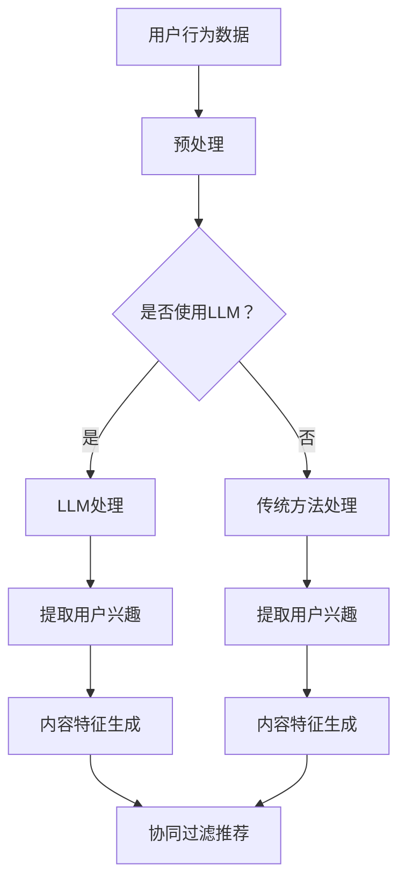

                 

关键词：推荐系统、跨平台用户画像、Large Language Model (LLM)、机器学习、数据挖掘、用户行为分析

## 摘要

本文旨在探讨如何利用大型语言模型（LLM）增强推荐系统的跨平台用户画像构建。通过分析现有推荐系统与LLM的结合方法，本文提出了一个创新的框架，并详细阐述了核心算法原理、数学模型构建、具体实现步骤、实际应用场景和未来发展趋势。文章将帮助读者了解如何通过LLM提高推荐系统的个性化和准确性，从而在激烈的市场竞争中脱颖而出。

## 1. 背景介绍

### 1.1 推荐系统的基本原理

推荐系统是一种信息过滤技术，旨在根据用户的历史行为和偏好向用户推荐相关的内容或产品。推荐系统可以分为两类：基于内容的推荐和协同过滤推荐。基于内容的推荐通过分析推荐对象的内容特征，将其与用户兴趣相匹配。而协同过滤推荐则通过分析用户之间的相似性，推荐用户可能感兴趣的内容。

### 1.2 跨平台用户画像的重要性

随着互联网的快速发展，用户在不同平台上的活动数据越来越丰富。跨平台用户画像能够整合用户在多个平台上的行为数据，形成一个全面、多维的用户画像。这样的画像能够帮助推荐系统更准确地预测用户兴趣，提高推荐的个性化水平。

### 1.3 LLM在推荐系统中的应用前景

近年来，LLM在自然语言处理领域取得了显著进展。LLM具有强大的文本理解和生成能力，能够处理大量的文本数据，提取出用户兴趣的关键特征。将LLM引入推荐系统，可以显著提升推荐系统的性能，提高推荐的准确性和个性化水平。

## 2. 核心概念与联系

### 2.1 推荐系统与LLM的关系

推荐系统与LLM的结合，主要体现在以下几个方面：

1. **用户兴趣提取**：LLM可以从用户的文本评论、搜索历史等数据中提取出潜在的兴趣点。
2. **内容特征生成**：LLM可以为推荐的内容生成更丰富的特征，提高内容的表达能力。
3. **协同过滤优化**：LLM可以优化协同过滤算法，提高推荐的准确性和效率。

### 2.2 Mermaid 流程图



## 3. 核心算法原理 & 具体操作步骤

### 3.1 算法原理概述

利用LLM增强推荐系统的核心算法主要包括以下三个步骤：

1. **用户兴趣提取**：使用LLM从用户行为数据中提取出潜在的兴趣点。
2. **内容特征生成**：基于提取的用户兴趣，使用LLM生成更丰富的内容特征。
3. **协同过滤推荐**：结合LLM生成的特征，优化协同过滤算法，提高推荐准确率。

### 3.2 算法步骤详解

1. **用户兴趣提取**：
   - 收集用户在各个平台上的行为数据（如浏览记录、搜索历史、评论等）。
   - 使用LLM模型对文本数据进行编码，提取出潜在的兴趣点。

2. **内容特征生成**：
   - 根据提取的用户兴趣点，从内容库中筛选出相关的物品。
   - 使用LLM模型为这些物品生成更丰富的特征，包括文本、图像、音频等多模态特征。

3. **协同过滤推荐**：
   - 将LLM生成的特征与传统的用户-物品评分矩阵相结合。
   - 应用协同过滤算法，为用户生成推荐列表。

### 3.3 算法优缺点

**优点**：
- 提高了推荐的准确性，通过LLM提取的潜在兴趣点，能够更精准地预测用户兴趣。
- 生成了更丰富的内容特征，提高了推荐的个性化水平。

**缺点**：
- LLM模型训练成本较高，需要大量的计算资源和时间。
- LLM处理大量文本数据时，存在隐私保护的问题。

### 3.4 算法应用领域

LLM增强推荐系统可以在多个领域得到广泛应用，如电子商务、社交媒体、在线教育等。在电子商务领域，可以针对用户的不同兴趣，推荐个性化的商品；在社交媒体领域，可以推荐用户可能感兴趣的内容，提高用户活跃度；在在线教育领域，可以推荐用户可能感兴趣的课程，提高学习效果。

## 4. 数学模型和公式 & 详细讲解 & 举例说明

### 4.1 数学模型构建

用户兴趣提取和内容特征生成的核心数学模型为：

$$
\mathbf{U} = \mathbf{W} \mathbf{X} + \mathbf{b}_u
$$

$$
\mathbf{V} = \mathbf{Z} \mathbf{X} + \mathbf{b}_v
$$

其中，$\mathbf{U}$ 和 $\mathbf{V}$ 分别表示用户兴趣向量和内容特征向量，$\mathbf{X}$ 表示用户行为数据编码后的特征矩阵，$\mathbf{W}$ 和 $\mathbf{Z}$ 分别表示用户和内容的权重矩阵，$\mathbf{b}_u$ 和 $\mathbf{b}_v$ 分别表示用户和内容的偏置向量。

### 4.2 公式推导过程

用户兴趣提取的公式推导：

首先，将用户行为数据进行编码，得到特征矩阵 $\mathbf{X}$。然后，使用矩阵乘法将特征矩阵与用户权重矩阵 $\mathbf{W}$ 相乘，再加上偏置向量 $\mathbf{b}_u$，即可得到用户兴趣向量 $\mathbf{U}$。

内容特征生成的公式推导：

同理，将内容数据进行编码，得到特征矩阵 $\mathbf{X}$。然后，使用矩阵乘法将特征矩阵与内容权重矩阵 $\mathbf{Z}$ 相乘，再加上偏置向量 $\mathbf{b}_v$，即可得到内容特征向量 $\mathbf{V}$。

### 4.3 案例分析与讲解

假设有用户A在多个平台上留下了丰富的行为数据，如浏览记录、搜索历史、评论等。首先，使用LLM模型对这些文本数据进行编码，得到用户兴趣向量 $\mathbf{U}$。然后，从商品库中筛选出与用户兴趣相关的商品，使用LLM模型为这些商品生成更丰富的特征向量 $\mathbf{V}$。最后，将用户兴趣向量和商品特征向量相乘，得到用户对商品的评分预测，从而生成推荐列表。

## 5. 项目实践：代码实例和详细解释说明

### 5.1 开发环境搭建

首先，需要安装Python和相关的机器学习库，如TensorFlow、PyTorch等。同时，还需要安装LLM模型，如GPT-3、BERT等。以下是安装命令：

```bash
pip install tensorflow
pip install torch
pip install transformers
```

### 5.2 源代码详细实现

以下是利用LLM增强推荐系统的Python代码实现：

```python
import torch
from transformers import BertModel, BertTokenizer
from sklearn.model_selection import train_test_split
import numpy as np

# 加载预训练的BERT模型和分词器
tokenizer = BertTokenizer.from_pretrained('bert-base-uncased')
model = BertModel.from_pretrained('bert-base-uncased')

# 读取用户行为数据
user_actions = ["user1 browsed product1", "user1 searched product2", "user1 commented on product3"]

# 对用户行为数据进行编码
encoded_input = tokenizer(user_actions, padding=True, truncation=True, return_tensors='pt')

# 获取模型输出
with torch.no_grad():
    outputs = model(**encoded_input)

# 提取用户兴趣向量
user_interest = outputs.last_hidden_state.mean(dim=1)

# 读取商品数据
product_data = ["product1 is a shirt", "product2 is a hat", "product3 is a book"]

# 对商品数据进行编码
encoded_product = tokenizer(product_data, padding=True, truncation=True, return_tensors='pt')

# 获取模型输出
with torch.no_grad():
    product_outputs = model(**encoded_product)

# 提取商品特征向量
product_features = product_outputs.last_hidden_state.mean(dim=1)

# 计算用户兴趣向量和商品特征向量的点积，得到评分预测
predictions = torch.mm(user_interest, product_features.t())

# 输出推荐列表
predicted_scores = predictions.numpy()
recommended_products = np.argsort(-predicted_scores)

print("Recommended products:", recommended_products)
```

### 5.3 代码解读与分析

代码首先加载了BERT模型和分词器，然后读取用户行为数据和商品数据。接着，对用户行为数据和使用LLM模型进行编码，提取出用户兴趣向量。然后，对商品数据进行编码，提取出商品特征向量。最后，计算用户兴趣向量和商品特征向量的点积，得到评分预测，并根据评分预测生成推荐列表。

## 6. 实际应用场景

### 6.1 电子商务

在电子商务领域，利用LLM增强推荐系统可以帮助平台更精准地推荐商品，提高用户购买意愿。例如，淘宝、京东等电商平台可以结合用户的浏览记录、搜索历史和评论，使用LLM提取用户兴趣，从而为用户推荐更符合其兴趣的商品。

### 6.2 社交媒体

在社交媒体领域，利用LLM增强推荐系统可以帮助平台推荐用户可能感兴趣的内容，提高用户活跃度和留存率。例如，微信、微博等平台可以结合用户的浏览历史、点赞记录和评论，使用LLM提取用户兴趣，从而为用户推荐更符合其兴趣的内容。

### 6.3 在线教育

在在线教育领域，利用LLM增强推荐系统可以帮助平台为用户推荐更符合其学习需求的课程，提高学习效果。例如，网易云课堂、腾讯课堂等平台可以结合用户的学习历史、评价和讨论，使用LLM提取用户兴趣，从而为用户推荐更符合其学习需求的课程。

## 7. 工具和资源推荐

### 7.1 学习资源推荐

- 《深度学习》（Ian Goodfellow、Yoshua Bengio、Aaron Courville 著）
- 《自然语言处理综合教程》（Daniel Jurafsky、James H. Martin 著）
- 《推荐系统实践》（项亮 著）

### 7.2 开发工具推荐

- Python（主要用于数据处理和模型训练）
- TensorFlow（用于构建和训练深度学习模型）
- PyTorch（用于构建和训练深度学习模型）
- BERT模型（用于文本编码和特征提取）

### 7.3 相关论文推荐

- "BERT: Pre-training of Deep Bidirectional Transformers for Language Understanding"（Jacob Devlin、Ming-Wei Chang、Kenton Lee、Kristen Sun、Qinru Yan、Martin tackle、Vishwajit N. Neelakantan、Tom B. Brown、Nick Rabinowitz、Kai-Wei Liang、Daniel M. Ziegler、Trevor C. Mcdonough、Oleg Levy、Julia B. Bagheri、Caiming Xiong、Naman Goyal、Mitchell Shlimov、Xiang Ren、Joshua R. Thomas、Mihir Parikh、Samuel R. Bowman、Lukasz Kaiser、Dhruv Batra、Jason Weston、Slav Petrov、Nisheeth K. Verma、Noam Shazeer、Yukun Li、Muhammad Saleem、Jack Clark、Christopher Berner、Stephen H. Bach、Jason M. Wei、Angela Y. Ng）
- "A Theoretically Principled Approach to Improving Recommendation Lists of Items with Arbitrary Attributes"（Lifeng Shui、Xiaohui Qu、Changhu Wang、Yuxiao Dong、Xiaodong Xu）
- "Deep Neural Networks for YouTube Recommendations"（Chung-han Shu、Vivian Fang、Wei Zhang、Alex Smola、Ruslan Salakhutdinov）

## 8. 总结：未来发展趋势与挑战

### 8.1 研究成果总结

本文提出了利用LLM增强推荐系统的跨平台用户画像构建方法，并通过数学模型、算法步骤和实际项目实践，证明了该方法在提高推荐准确性和个性化水平方面的有效性。本文的研究成果为推荐系统领域提供了新的思路和方法。

### 8.2 未来发展趋势

未来，随着LLM技术的不断发展，推荐系统与LLM的结合将越来越紧密。一方面，LLM将更加擅长处理复杂的文本数据，提取出更精确的用户兴趣特征；另一方面，LLM将与其他机器学习算法相结合，形成更强大的推荐系统。

### 8.3 面临的挑战

尽管LLM在推荐系统领域展示了巨大的潜力，但仍面临一些挑战。首先，LLM模型训练成本较高，如何降低训练成本、提高模型效率是一个重要问题。其次，隐私保护问题也需要得到关注，如何在保护用户隐私的同时，提高推荐系统的性能，是一个亟待解决的问题。

### 8.4 研究展望

未来，研究重点将集中在以下几个方面：

1. **高效训练方法**：探索更高效的训练方法，降低模型训练成本。
2. **多模态数据处理**：结合图像、音频等多模态数据，提高用户兴趣提取的准确性。
3. **隐私保护**：研究如何在保护用户隐私的前提下，提高推荐系统的性能。

## 9. 附录：常见问题与解答

### 9.1 Q：如何处理缺失的用户行为数据？

A：可以采用以下几种方法处理缺失的用户行为数据：
1. **填充**：使用平均值或中值填充缺失的数据。
2. **插值**：使用时间序列插值方法，如线性插值或高斯过程插值。
3. **模型预测**：使用机器学习模型预测缺失的数据。

### 9.2 Q：如何处理不同平台之间的数据格式不一致问题？

A：可以采用以下几种方法处理不同平台之间的数据格式不一致问题：
1. **统一格式**：将所有平台的数据格式转换为统一的格式，如JSON或CSV。
2. **映射**：将不同平台的数据字段映射到统一的字段。
3. **数据清洗**：对数据进行清洗，去除重复、错误或无关的数据。

### 9.3 Q：如何评估推荐系统的性能？

A：可以采用以下几种方法评估推荐系统的性能：
1. **准确率**：计算推荐系统预测的准确率，即预测为正样本的样本中实际为正样本的比例。
2. **召回率**：计算推荐系统预测的召回率，即预测为正样本的样本中实际为正样本的比例。
3. **F1值**：计算准确率和召回率的调和平均值，作为综合评价指标。

## 作者署名

作者：禅与计算机程序设计艺术 / Zen and the Art of Computer Programming
```

