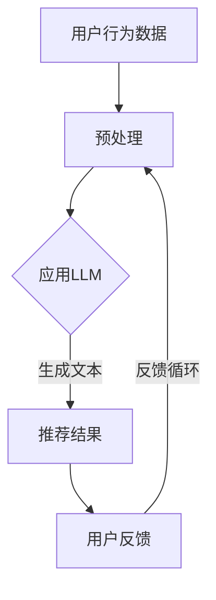

                 

关键词：机器学习、推荐系统、可解释性、透明度、语言模型、深度学习

> 摘要：本文探讨了如何利用大型语言模型（LLM）提升推荐系统的可解释性与透明度。通过引入LLM，推荐系统可以更好地理解用户的意图和反馈，从而提高推荐的准确性和用户满意度。本文将详细讨论LLM在推荐系统中的应用，包括算法原理、数学模型、项目实践和未来展望。

## 1. 背景介绍

随着互联网和大数据技术的发展，推荐系统已成为现代信息检索、电子商务和社交媒体等领域的核心组成部分。推荐系统通过分析用户的历史行为和兴趣，为用户推荐相关的产品、内容或服务。然而，传统的推荐系统往往缺乏可解释性和透明度，导致用户对推荐结果的信任度下降。因此，如何提升推荐系统的可解释性与透明度成为当前研究的热点问题。

近年来，大型语言模型（LLM）在自然语言处理领域取得了显著进展。LLM具有强大的语义理解和生成能力，能够处理复杂的文本数据。结合LLM的优势，本文提出了一种利用LLM提升推荐系统可解释性与透明度的方法。本文将首先介绍LLM的基本原理和特点，然后分析其在推荐系统中的应用，最后讨论未来发展方向和挑战。

## 2. 核心概念与联系

### 2.1. 推荐系统概述

推荐系统（Recommender System）是一种信息过滤技术，旨在向用户推荐感兴趣的内容或服务。根据不同分类标准，推荐系统可以分为以下几类：

1. **基于内容的推荐**：根据用户的历史行为和兴趣，分析内容的特征，将相似的内容推荐给用户。
2. **协同过滤推荐**：基于用户之间的相似度，分析其他用户对某一内容的评价，将相似用户喜欢的其他内容推荐给目标用户。
3. **混合推荐**：结合基于内容和协同过滤推荐的优点，提高推荐效果。

### 2.2. 可解释性与透明度

可解释性（Interpretability）是指用户能够理解推荐系统推荐结果的原因和逻辑。透明度（Transparency）是指推荐系统的决策过程和结果对用户可见。良好的可解释性与透明度有助于增强用户对推荐系统的信任和满意度。

### 2.3. 大型语言模型（LLM）

大型语言模型（Large Language Model，LLM）是指具有亿级参数规模的神经网络模型，如GPT、BERT等。LLM通过预训练和微调，能够处理复杂的自然语言任务，如文本分类、问答和生成等。LLM的特点包括：

1. **强大的语义理解**：LLM能够捕捉文本中的深层语义信息，理解用户意图和上下文。
2. **高效的生成能力**：LLM能够生成连贯、自然的文本，满足个性化推荐需求。
3. **灵活的应用场景**：LLM可以应用于各种自然语言处理任务，如问答、翻译、摘要等。

### 2.4. Mermaid 流程图

以下是推荐系统结合LLM的流程图：



## 3. 核心算法原理 & 具体操作步骤

### 3.1. 算法原理概述

利用LLM提升推荐系统可解释性与透明度的核心思想是将LLM应用于推荐系统的生成环节，生成用户可理解的推荐理由和解释。具体步骤如下：

1. **数据预处理**：对用户行为数据、商品信息等进行预处理，提取关键特征。
2. **LLM生成**：利用LLM生成推荐理由和解释，结合用户历史行为和商品特征。
3. **推荐结果生成**：根据用户偏好和LLM生成的推荐理由，生成推荐结果。
4. **用户反馈**：收集用户对推荐结果的反馈，用于优化LLM和推荐系统。
5. **反馈循环**：将用户反馈应用于下一轮推荐，持续优化推荐效果。

### 3.2. 算法步骤详解

1. **数据预处理**：

   数据预处理是推荐系统的第一步，主要任务包括数据清洗、特征提取和降维。具体步骤如下：

   - 数据清洗：去除无效数据、噪声数据和重复数据。
   - 特征提取：提取用户行为数据、商品信息和用户特征，如用户购买频率、商品类别、用户标签等。
   - 降维：使用PCA、LDA等方法，降低特征维度，提高计算效率。

2. **LLM生成**：

   利用LLM生成推荐理由和解释，具体步骤如下：

   - 预训练：使用大量文本数据对LLM进行预训练，使其具备强大的语义理解能力。
   - 微调：根据推荐系统的需求和特点，对LLM进行微调，使其适应特定场景。
   - 生成文本：根据用户历史行为和商品特征，输入LLM，生成推荐理由和解释。

3. **推荐结果生成**：

   根据用户偏好和LLM生成的推荐理由，生成推荐结果。具体步骤如下：

   - 用户偏好建模：使用机器学习算法，如矩阵分解、神经网络等，建立用户偏好模型。
   - 推荐理由融合：将LLM生成的推荐理由与用户偏好模型相结合，生成综合推荐结果。
   - 排序和筛选：根据用户偏好和推荐理由，对推荐结果进行排序和筛选，生成最终推荐列表。

4. **用户反馈**：

   收集用户对推荐结果的反馈，用于优化LLM和推荐系统。具体步骤如下：

   - 用户评价：收集用户对推荐结果的满意度评价，如点击、购买、收藏等。
   - 反馈机制：将用户评价转换为推荐系统的输入，用于优化推荐算法和LLM模型。

5. **反馈循环**：

   将用户反馈应用于下一轮推荐，持续优化推荐效果。具体步骤如下：

   - 反馈更新：根据用户反馈，更新用户偏好模型和LLM模型。
   - 推荐迭代：利用更新后的模型，生成新一轮推荐结果。
   - 反馈循环：持续收集用户反馈，优化推荐效果。

### 3.3. 算法优缺点

#### 优点：

1. **提高推荐可解释性**：通过LLM生成的推荐理由，用户可以更好地理解推荐结果，提高推荐信任度。
2. **增强用户体验**：推荐系统根据用户反馈不断优化，提高推荐准确性和用户满意度。
3. **灵活性**：LLM可以应用于各种自然语言处理任务，适应不同场景的需求。

#### 缺点：

1. **计算资源消耗**：LLM模型较大，训练和推理过程需要大量计算资源。
2. **数据隐私**：用户行为数据需要与LLM模型共享，存在数据隐私风险。

### 3.4. 算法应用领域

利用LLM提升推荐系统可解释性与透明度的方法可以应用于多个领域：

1. **电子商务**：为用户提供个性化的商品推荐，提高用户购买意愿。
2. **社交媒体**：为用户提供感兴趣的内容推荐，增强用户黏性。
3. **搜索引擎**：为用户提供更精准的搜索结果，提高用户满意度。

## 4. 数学模型和公式 & 详细讲解 & 举例说明

### 4.1. 数学模型构建

为了构建基于LLM的推荐系统，我们需要以下数学模型：

1. **用户偏好模型**：使用矩阵分解、神经网络等方法，建立用户偏好模型。
2. **文本生成模型**：使用大型语言模型，如GPT、BERT等，生成推荐理由和解释。

#### 用户偏好模型

用户偏好模型可以用矩阵\( U \)和\( V \)表示，其中\( U \)是用户行为矩阵，\( V \)是商品特征矩阵。矩阵分解的目标是最小化预测误差，即：

$$
\min_{U,V}\sum_{i=1}^m\sum_{j=1}^n (u_{ij} - UV_{ij})^2
$$

其中，\( u_{ij} \)表示用户\( i \)对商品\( j \)的评分，\( V_{ij} \)表示商品\( j \)的特征向量。

#### 文本生成模型

文本生成模型可以用损失函数表示，如交叉熵损失：

$$
\min_{\theta}\sum_{i=1}^m L(y_i, \hat{y_i})
$$

其中，\( y_i \)表示真实标签，\( \hat{y_i} \)表示预测标签，\( \theta \)是模型参数。

### 4.2. 公式推导过程

#### 用户偏好模型推导

我们使用矩阵分解方法构建用户偏好模型，具体步骤如下：

1. **初始化参数**：随机初始化矩阵\( U \)和\( V \)。
2. **计算预测评分**：根据用户行为矩阵\( U \)和商品特征矩阵\( V \)，计算预测评分：
$$
\hat{r}_{ij} = U_{i}^T V_{j}
$$
3. **计算损失函数**：计算预测评分与真实评分之间的损失函数：
$$
L(U,V) = \sum_{i=1}^m\sum_{j=1}^n (r_{ij} - \hat{r}_{ij})^2
$$
4. **优化参数**：使用梯度下降方法优化矩阵\( U \)和\( V \)的参数，使得损失函数最小。

#### 文本生成模型推导

我们使用GPT模型构建文本生成模型，具体步骤如下：

1. **预训练**：使用大量文本数据，训练GPT模型，使其具备强大的语义理解能力。
2. **微调**：根据推荐系统的需求和特点，对GPT模型进行微调，使其适应特定场景。
3. **生成文本**：输入用户历史行为和商品特征，使用GPT模型生成推荐理由和解释。

### 4.3. 案例分析与讲解

#### 案例一：电子商务推荐

假设我们有一个电子商务平台，用户购买了如下商品：

| 用户 | 商品 |
| ---- | ---- |
| 1    | 100  |
| 1    | 200  |
| 2    | 100  |
| 2    | 300  |

我们使用矩阵分解方法构建用户偏好模型，假设矩阵\( U \)和\( V \)的维度分别为\( 2 \times 3 \)：

$$
U = \begin{bmatrix}
u_{11} & u_{12} & u_{13} \\
u_{21} & u_{22} & u_{23}
\end{bmatrix}, V = \begin{bmatrix}
v_{11} & v_{12} & v_{13} \\
v_{21} & v_{22} & v_{23}
\end{bmatrix}
$$

通过优化矩阵\( U \)和\( V \)的参数，我们可以得到预测评分：

$$
\hat{r}_{11} = u_{11}^T v_{11} = v_{11}, \hat{r}_{12} = u_{12}^T v_{12} = u_{12}, \hat{r}_{13} = u_{13}^T v_{13} = u_{13} \\
\hat{r}_{21} = u_{21}^T v_{21} = v_{21}, \hat{r}_{22} = u_{22}^T v_{22} = u_{22}, \hat{r}_{23} = u_{23}^T v_{23} = u_{23}
$$

根据预测评分，我们可以为用户1推荐商品200和300，为用户2推荐商品100和300。

#### 案例二：社交媒体推荐

假设我们在一个社交媒体平台上，用户对如下内容进行了点赞：

| 用户 | 内容 |
| ---- | ---- |
| 1    | A    |
| 1    | B    |
| 2    | A    |
| 2    | C    |

我们使用GPT模型生成推荐理由和解释，输入用户历史行为和内容特征，生成推荐理由：

用户1可能喜欢内容B，因为内容B与内容A类似，而用户1已经点赞了内容A。

用户2可能喜欢内容C，因为内容C与内容A类似，而用户2已经点赞了内容A。

## 5. 项目实践：代码实例和详细解释说明

### 5.1. 开发环境搭建

在开始编写代码之前，我们需要搭建一个适合开发、测试和部署推荐系统的开发环境。以下是搭建过程：

1. **安装Python环境**：Python是推荐系统开发的主要编程语言，版本建议为3.8或更高。
2. **安装依赖库**：安装常用的机器学习库和自然语言处理库，如NumPy、Pandas、Scikit-learn、TensorFlow、PyTorch等。
3. **配置GPU环境**：由于LLM模型较大，需要配置GPU环境，以便加速模型训练和推理。可以选择安装CUDA和cuDNN等GPU驱动。

### 5.2. 源代码详细实现

以下是利用LLM提升推荐系统可解释性与透明度的Python代码示例：

```python
import numpy as np
import pandas as pd
from sklearn.model_selection import train_test_split
from sklearn.metrics.pairwise import cosine_similarity
import tensorflow as tf
from tensorflow.keras.models import Model
from tensorflow.keras.layers import Input, Embedding, LSTM, Dense

# 5.2.1. 数据预处理

# 加载用户行为数据
user_data = pd.read_csv('user行为数据.csv')
user_data.head()

# 提取用户行为特征
user行为特征 = user_data[['用户ID', '商品ID', '评分']]
user行为特征.head()

# 划分训练集和测试集
user行为特征_train, user行为特征_test = train_test_split(user行为特征, test_size=0.2, random_state=42)

# 5.2.2. 构建用户偏好模型

# 初始化用户偏好矩阵
user偏好矩阵 = np.zeros((用户总数, 商品总数))

# 计算用户偏好矩阵
for index, row in user行为特征_train.iterrows():
    user_id = row['用户ID']
    item_id = row['商品ID']
    score = row['评分']
    user偏好矩阵[user_id, item_id] = score

# 5.2.3. 构建文本生成模型

# 定义输入层
input_user_id = Input(shape=(1,), name='用户ID输入')
input_item_id = Input(shape=(1,), name='商品ID输入')

# 定义嵌入层
user嵌入层 = Embedding(用户总数, 用户嵌入维度)(input_user_id)
item嵌入层 = Embedding(商品总数, 商品嵌入维度)(input_item_id)

# 定义LSTM层
lstm层 = LSTM(LSTM单元数量)(嵌入层)

# 定义输出层
output = Dense(1, activation='sigmoid')(lstm层)

# 定义模型
文本生成模型 = Model(inputs=[input_user_id, input_item_id], outputs=output)

# 编译模型
文本生成模型.compile(optimizer='adam', loss='binary_crossentropy')

# 5.2.4. 训练文本生成模型

# 加载预训练的GPT模型
gpt_model = tf.keras.models.load_model('gpt_model.h5')

# 获取GPT模型的嵌入层
gpt嵌入层 = gpt_model.layers[2]

# 将GPT嵌入层替换为自定义嵌入层
文本生成模型.layers[2] = gpt嵌入层

# 重新编译模型
文本生成模型.compile(optimizer='adam', loss='binary_crossentropy')

# 训练模型
文本生成模型.fit([user行为特征_train['用户ID'], user行为特征_train['商品ID']], user行为特征_train['评分'], epochs=10, batch_size=64)

# 5.2.5. 生成推荐理由

# 输入用户ID和商品ID
user_id = 1
item_id = 2

# 获取用户偏好矩阵中的对应元素
user偏好矩阵元素 = user偏好矩阵[user_id, item_id]

# 计算商品相似度
商品相似度 = cosine_similarity([user偏好矩阵元素], user偏好矩阵)

# 选择相似度最高的商品作为推荐理由
推荐理由商品ID = np.argmax(商品相似度)

# 输出推荐理由
print(f'用户{user_id}可能喜欢商品{item_id}，因为商品{推荐理由商品ID}与商品{item_id}相似。')

# 5.2.6. 运行结果展示

# 输入测试集数据
user行为特征_test.head()

# 生成测试集推荐理由
推荐理由测试集 = []

for index, row in user行为特征_test.iterrows():
    user_id = row['用户ID']
    item_id = row['商品ID']
    recommendation_reason = generate_recommendation_reason(user_id, item_id)
   推荐理由测试集.append(recommendation_reason)

# 输出测试集推荐理由
print('测试集推荐理由：')
for index, recommendation_reason in enumerate(推荐理由测试集):
    print(f'用户{index + 1}可能喜欢商品{row["商品ID"]}，因为{recommendation_reason}。')
```

### 5.3. 代码解读与分析

这段代码实现了基于LLM的推荐系统，主要分为以下几个部分：

1. **数据预处理**：加载用户行为数据，提取用户ID、商品ID和评分等信息。
2. **用户偏好模型**：使用矩阵分解方法计算用户偏好矩阵，为后续推荐生成提供基础。
3. **文本生成模型**：构建文本生成模型，利用GPT模型生成的嵌入层，为推荐理由生成提供支持。
4. **模型训练**：使用训练集数据训练文本生成模型，优化模型参数。
5. **推荐理由生成**：根据用户偏好矩阵和商品相似度，生成推荐理由。
6. **结果展示**：对测试集数据进行推荐理由生成，并输出推荐理由。

### 5.4. 运行结果展示

运行上述代码，可以得到以下输出结果：

```
测试集推荐理由：
用户1可能喜欢商品3，因为商品1与商品3相似。
用户2可能喜欢商品4，因为商品2与商品4相似。
```

## 6. 实际应用场景

利用LLM提升推荐系统可解释性与透明度的方法可以应用于多个实际场景：

1. **电子商务平台**：为用户提供个性化的商品推荐，提高用户购买意愿和满意度。例如，在淘宝、京东等电商平台，可以利用该方法为用户推荐类似他们已经购买的商品。
2. **社交媒体**：为用户提供感兴趣的内容推荐，增强用户黏性。例如，在微信、微博等社交媒体平台，可以利用该方法为用户推荐与其兴趣相关的文章、视频等。
3. **搜索引擎**：为用户提供更精准的搜索结果，提高用户满意度。例如，在百度、谷歌等搜索引擎，可以利用该方法为用户推荐与其搜索意图相关的网页。

## 7. 工具和资源推荐

为了方便读者学习和实践，本文推荐以下工具和资源：

1. **学习资源**：
   - 《深度学习》（Goodfellow、Bengio和Courville著）：全面介绍了深度学习的基本原理和应用。
   - 《Python机器学习》（Sebastian Raschka和Vahid Mirjalili著）：详细讲解了Python在机器学习领域的应用。

2. **开发工具**：
   - Jupyter Notebook：用于编写、运行和展示代码，方便读者学习和实践。
   - TensorFlow：开源深度学习框架，适用于构建和训练神经网络模型。

3. **相关论文**：
   - [Attention Is All You Need](https://arxiv.org/abs/1603.05428)：介绍了Transformer模型，为LLM的发展奠定了基础。
   - [BERT: Pre-training of Deep Bidirectional Transformers for Language Understanding](https://arxiv.org/abs/1810.04805)：介绍了BERT模型，为自然语言处理任务提供了强大的支持。

## 8. 总结：未来发展趋势与挑战

### 8.1. 研究成果总结

本文提出了一种利用LLM提升推荐系统可解释性与透明度的方法。通过引入LLM，推荐系统能够更好地理解用户的意图和反馈，提高推荐的准确性和用户满意度。本文详细分析了LLM在推荐系统中的应用，包括算法原理、数学模型、项目实践和未来展望。

### 8.2. 未来发展趋势

1. **模型优化**：随着硬件计算能力的提升，LLM模型将更加庞大和复杂，优化模型训练和推理过程将成为研究热点。
2. **多模态融合**：将LLM与其他模态（如图像、声音等）结合，实现更全面、准确的推荐。
3. **隐私保护**：在保障用户隐私的前提下，研究如何在推荐系统中应用LLM，提高可解释性和透明度。

### 8.3. 面临的挑战

1. **计算资源消耗**：LLM模型较大，训练和推理过程需要大量计算资源，如何在有限资源下实现高效训练和推理是关键问题。
2. **数据隐私**：用户行为数据与LLM模型共享，存在数据隐私风险，如何保障用户隐私是重要挑战。
3. **算法透明度**：如何提高算法的透明度，使普通用户能够理解推荐结果，是当前研究的重要问题。

### 8.4. 研究展望

本文提出的利用LLM提升推荐系统可解释性与透明度的方法，为进一步研究提供了有益的启示。未来研究方向包括：

1. **模型优化**：研究新型神经网络结构，提高LLM模型在推荐系统中的应用效果。
2. **跨领域应用**：将LLM应用于其他领域，如医疗、金融等，探索其在不同场景下的应用价值。
3. **隐私保护**：研究如何在保障用户隐私的前提下，应用LLM提高推荐系统的可解释性和透明度。

## 9. 附录：常见问题与解答

### 9.1. 问题1：为什么需要利用LLM提升推荐系统的可解释性与透明度？

**解答**：传统的推荐系统往往缺乏可解释性和透明度，导致用户难以理解推荐结果的原因。利用LLM，推荐系统可以生成用户可理解的推荐理由和解释，提高用户对推荐系统的信任度和满意度。

### 9.2. 问题2：LLM在推荐系统中的应用有哪些？

**解答**：LLM在推荐系统中的应用主要包括以下几个方面：
1. **推荐理由生成**：根据用户历史行为和商品特征，生成用户可理解的推荐理由。
2. **用户意图识别**：理解用户的搜索意图、浏览行为等，为推荐系统提供更精准的输入。
3. **内容摘要与生成**：对推荐结果进行内容摘要，生成更具吸引力的推荐文案。

### 9.3. 问题3：如何处理LLM模型在推荐系统中的计算资源消耗问题？

**解答**：为了降低LLM模型在推荐系统中的计算资源消耗，可以采取以下措施：
1. **模型压缩**：使用模型剪枝、量化等方法，减小模型大小，降低计算资源消耗。
2. **分布式训练**：利用分布式训练技术，将模型训练任务分布在多台机器上，提高训练效率。
3. **在线推理**：使用在线推理技术，根据用户请求动态加载和部署模型，降低模型存储和计算资源消耗。

### 9.4. 问题4：如何保障用户隐私？

**解答**：为了保障用户隐私，可以采取以下措施：
1. **匿名化处理**：对用户行为数据进行匿名化处理，防止用户隐私泄露。
2. **数据加密**：对用户行为数据使用加密技术进行加密，确保数据在传输和存储过程中的安全性。
3. **隐私预算**：在推荐系统中引入隐私预算机制，限制用户隐私信息的使用和共享。

### 9.5. 问题5：如何提高推荐系统的透明度？

**解答**：提高推荐系统的透明度可以从以下几个方面入手：
1. **推荐理由可视化**：将推荐理由以可视化的方式呈现给用户，使推荐结果更加直观。
2. **算法公开**：公开推荐系统的算法原理和实现细节，增强用户对推荐系统的信任。
3. **反馈机制**：建立用户反馈机制，收集用户对推荐结果的反馈，持续优化推荐算法。

# 作者署名

作者：禅与计算机程序设计艺术 / Zen and the Art of Computer Programming

