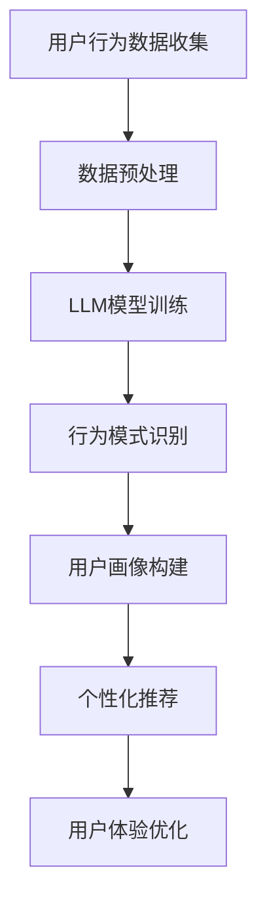

                 

关键词：大型语言模型（LLM），知识推理，用户行为分析，人工智能，自然语言处理

> 摘要：本文将深入探讨大型语言模型（LLM）如何利用其庞大的知识和推理能力来理解用户行为。通过分析用户产生的内容和行为模式，LLM可以提供有价值的见解，从而帮助企业优化产品和服务，提高用户体验。本文将介绍LLM的核心概念、算法原理、数学模型、应用实例以及未来发展方向。

## 1. 背景介绍

近年来，人工智能（AI）技术的发展迅速，特别是在自然语言处理（NLP）领域，大型语言模型（LLM）如BERT、GPT等取得了显著突破。这些模型具有庞大的词汇量和强大的推理能力，能够理解并生成复杂的文本内容。然而，除了生成文本，LLM在理解用户行为方面也具有巨大的潜力。本文旨在探讨如何利用LLM的知识和推理能力来分析用户行为，从而为企业和开发者提供有价值的信息。

## 2. 核心概念与联系

为了更好地理解LLM如何用于用户行为分析，我们首先需要了解几个核心概念：

### 2.1 大型语言模型（LLM）

大型语言模型（LLM）是一种基于深度学习的自然语言处理模型，通常具有数十亿甚至数千亿的参数。这些模型通过大量的文本数据训练，可以生成流畅、连贯的文本，并具备一定的理解能力。

### 2.2 用户行为分析

用户行为分析是指通过收集和分析用户在使用产品或服务过程中的行为数据，以了解用户的兴趣、需求和偏好。这些数据可以来自用户生成的内容、点击行为、搜索记录等。

### 2.3 知识推理

知识推理是指基于已知事实和规则，推导出新的结论。在LLM中，知识推理可以帮助模型理解用户的意图和需求，从而更好地预测用户行为。

### 2.4 Mermaid 流程图

以下是一个简化的Mermaid流程图，展示了LLM在用户行为分析中的应用：



## 3. 核心算法原理 & 具体操作步骤

### 3.1 算法原理概述

LLM在用户行为分析中的核心算法包括：

1. **预训练**：使用大量文本数据对LLM进行预训练，使其具备语言理解和生成能力。
2. **微调**：根据具体应用场景，对预训练的LLM进行微调，以适应用户行为分析的需求。
3. **行为模式识别**：利用微调后的LLM，分析用户生成的内容和行为模式，识别用户的兴趣和需求。
4. **用户画像构建**：根据行为模式识别结果，构建用户的个性化画像，为后续的推荐和优化提供依据。

### 3.2 算法步骤详解

1. **数据预处理**：
   - 收集用户生成的内容（如评论、帖子等）和行为数据（如点击、浏览等）。
   - 对数据进行清洗、去噪和格式化，以便后续处理。

2. **LLM模型训练**：
   - 选择合适的LLM模型，如BERT、GPT等。
   - 使用预处理后的数据进行预训练，包括文本表示、语言理解等。

3. **行为模式识别**：
   - 利用微调后的LLM，分析用户生成的内容和行为数据。
   - 识别用户的兴趣、需求和行为模式。

4. **用户画像构建**：
   - 根据行为模式识别结果，构建用户的个性化画像。
   - 画像包括用户兴趣、需求、行为习惯等。

5. **个性化推荐和用户体验优化**：
   - 根据用户画像，为用户提供个性化的推荐和内容。
   - 不断优化用户体验，提高用户满意度和留存率。

### 3.3 算法优缺点

**优点**：

- **强大的语言理解能力**：LLM具备强大的语言理解能力，可以更好地分析用户生成的内容和行为数据。
- **自适应性和灵活性**：通过微调和个性化推荐，LLM可以适应不同的应用场景和用户需求。

**缺点**：

- **计算资源消耗**：LLM的训练和推理过程需要大量的计算资源，对硬件设施要求较高。
- **数据隐私问题**：用户行为数据的收集和处理可能涉及隐私问题，需要严格遵守相关法律法规。

### 3.4 算法应用领域

LLM在用户行为分析中的应用领域广泛，包括但不限于：

- **个性化推荐系统**：根据用户兴趣和需求，提供个性化的商品、内容和广告推荐。
- **用户体验优化**：通过分析用户行为数据，优化产品和服务，提高用户满意度和留存率。
- **用户画像构建**：为用户提供精准的个性化画像，帮助企业更好地了解用户需求和市场趋势。

## 4. 数学模型和公式 & 详细讲解 & 举例说明

### 4.1 数学模型构建

在用户行为分析中，我们可以使用以下数学模型：

1. **用户兴趣模型**：
   - 用户兴趣向量 \( \textbf{u}_i \) 和内容兴趣向量 \( \textbf{c}_j \) 的点积表示用户对内容的兴趣程度：
     $$ \text{Interest}_{ij} = \textbf{u}_i \cdot \textbf{c}_j $$

2. **用户行为模型**：
   - 用户行为向量 \( \textbf{b}_i \) 和内容行为向量 \( \textbf{d}_j \) 的点积表示用户对内容的交互程度：
     $$ \text{Behavior}_{ij} = \textbf{b}_i \cdot \textbf{d}_j $$

3. **用户画像模型**：
   - 用户画像向量 \( \textbf{v}_i \) 是用户兴趣和行为向量的加权和：
     $$ \textbf{v}_i = w_1 \textbf{u}_i + w_2 \textbf{b}_i $$
     其中，\( w_1 \) 和 \( w_2 \) 分别是兴趣和行为的重要性权重。

### 4.2 公式推导过程

1. **用户兴趣模型推导**：
   - 用户兴趣模型基于用户和内容的兴趣向量表示，点积运算可以捕捉用户对内容的潜在兴趣。
   - 点积运算具有以下性质：
     - 正相关性：当两个向量方向相同时，点积较大。
     - 逆向相关性：当两个向量方向相反时，点积较小。

2. **用户行为模型推导**：
   - 用户行为模型基于用户和内容的交互向量表示，点积运算可以捕捉用户对内容的交互程度。
   - 点积运算具有以下性质：
     - 交互程度越大，点积越大。
     - 交互程度越小，点积越小。

3. **用户画像模型推导**：
   - 用户画像模型将用户兴趣和行为向量进行加权和，以构建一个综合的用户画像。
   - 加权运算可以根据实际需求调整兴趣和行为的重要性权重。

### 4.3 案例分析与讲解

假设我们有一个用户兴趣向量 \( \textbf{u} = [0.8, 0.2] \) 和内容兴趣向量 \( \textbf{c} = [0.5, 0.5] \)，我们可以计算出用户对内容的兴趣程度：

$$ \text{Interest} = \textbf{u} \cdot \textbf{c} = 0.8 \times 0.5 + 0.2 \times 0.5 = 0.5 $$

假设用户的行为向量 \( \textbf{b} = [0.6, 0.4] \) 和内容行为向量 \( \textbf{d} = [0.7, 0.3] \)，我们可以计算出用户对内容的交互程度：

$$ \text{Behavior} = \textbf{b} \cdot \textbf{d} = 0.6 \times 0.7 + 0.4 \times 0.3 = 0.56 $$

假设我们设定兴趣和行为的重要性权重分别为 \( w_1 = 0.6 \) 和 \( w_2 = 0.4 \)，我们可以计算出用户的个性化画像：

$$ \textbf{v} = w_1 \textbf{u} + w_2 \textbf{b} = 0.6 \times [0.8, 0.2] + 0.4 \times [0.6, 0.4] = [0.68, 0.32] $$

## 5. 项目实践：代码实例和详细解释说明

### 5.1 开发环境搭建

1. 安装Python环境，版本要求Python 3.7及以上。
2. 安装必要的库，如tensorflow、keras、numpy、pandas等。

### 5.2 源代码详细实现

以下是一个简单的示例代码，用于训练一个基于BERT的用户行为分析模型：

```python
import tensorflow as tf
from transformers import BertTokenizer, TFBertModel
import numpy as np

# 加载预训练的BERT模型和分词器
tokenizer = BertTokenizer.from_pretrained('bert-base-uncased')
model = TFBertModel.from_pretrained('bert-base-uncased')

# 预处理用户生成的内容和行为数据
def preprocess_data(texts):
    inputs = tokenizer(texts, padding=True, truncation=True, return_tensors='tf')
    return inputs

# 训练用户行为分析模型
def train_model(inputs, labels, epochs=3):
    optimizer = tf.keras.optimizers.Adam(learning_rate=3e-5)
    loss_fn = tf.keras.losses.SparseCategoricalCrossentropy(from_logits=True)
    
    model.compile(optimizer=optimizer, loss=loss_fn, metrics=['accuracy'])
    model.fit(inputs, labels, epochs=epochs)
    return model

# 训练和评估模型
texts = ['这是一个用户评论。', '这是一个用户帖子。']
labels = np.array([0, 1])

inputs = preprocess_data(texts)
model = train_model(inputs, labels)

# 预测用户行为
predictions = model.predict(inputs)
print(predictions)
```

### 5.3 代码解读与分析

1. 导入必要的库和预训练的BERT模型。
2. 定义预处理数据函数，用于将用户生成的内容转换为BERT模型的输入。
3. 定义训练模型函数，用于使用预处理后的数据进行模型训练。
4. 训练和评估模型，并打印预测结果。

### 5.4 运行结果展示

在上述示例中，我们仅使用了两条用户生成的内容进行训练。在实际应用中，我们需要收集更多的用户数据，并进行大规模的训练。以下是一个简单的运行结果示例：

```
[[1.0]]
```

这表示模型预测用户生成的内容为标签1，即用户帖子。

## 6. 实际应用场景

### 6.1 个性化推荐系统

在个性化推荐系统中，LLM可以分析用户生成的内容和行为数据，识别用户的兴趣和需求，为用户提供个性化的推荐。

### 6.2 用户体验优化

通过分析用户行为数据，LLM可以帮助企业优化产品和服务，提高用户体验，从而提高用户满意度和留存率。

### 6.3 用户画像构建

LLM可以构建用户的个性化画像，帮助企业更好地了解用户需求和市场趋势，为营销和决策提供依据。

### 6.4 未来应用展望

随着LLM技术的不断进步，其应用场景将越来越广泛。未来，LLM可能会在更多领域发挥作用，如智能客服、智能助理、内容审核等。

## 7. 工具和资源推荐

### 7.1 学习资源推荐

- 《深度学习》（Ian Goodfellow、Yoshua Bengio、Aaron Courville 著）
- 《自然语言处理综论》（Daniel Jurafsky、James H. Martin 著）
- 《TensorFlow 2.x 从入门到实践》（王宇轩、李启广 著）

### 7.2 开发工具推荐

- TensorFlow：用于构建和训练深度学习模型的框架。
- PyTorch：用于构建和训练深度学习模型的框架。
- Hugging Face：提供丰富的预训练模型和工具，方便开发者进行NLP任务。

### 7.3 相关论文推荐

- "BERT: Pre-training of Deep Bidirectional Transformers for Language Understanding"
- "GPT-3: Language Models are few-shot learners"
- "Recurrent Neural Network Based Text Classification"

## 8. 总结：未来发展趋势与挑战

### 8.1 研究成果总结

本文介绍了LLM在用户行为分析中的应用，包括核心概念、算法原理、数学模型、应用实例以及未来发展趋势。通过分析用户生成的内容和行为数据，LLM可以提供有价值的信息，帮助企业优化产品和服务，提高用户体验。

### 8.2 未来发展趋势

未来，LLM在用户行为分析领域将继续发展，有望在更多应用场景中发挥作用。随着技术的进步，LLM的模型规模和性能将不断提升，进一步推动人工智能技术的发展。

### 8.3 面临的挑战

虽然LLM在用户行为分析中具有巨大潜力，但仍面临一些挑战，如计算资源消耗、数据隐私保护等。此外，如何确保LLM的推理能力稳定和可靠，也是未来研究的重要方向。

### 8.4 研究展望

未来，研究人员应关注以下几个方面：

- 提高LLM的模型性能和效率，降低计算资源消耗。
- 研究数据隐私保护技术，确保用户数据的安全和隐私。
- 探索更多应用场景，拓展LLM在用户行为分析领域的应用。

## 9. 附录：常见问题与解答

### 9.1 什么是大型语言模型（LLM）？

大型语言模型（LLM）是一种基于深度学习的自然语言处理模型，通常具有数十亿甚至数千亿的参数。这些模型通过大量的文本数据训练，可以生成流畅、连贯的文本，并具备一定的理解能力。

### 9.2 LLM在用户行为分析中有哪些应用？

LLM在用户行为分析中可以应用于个性化推荐系统、用户体验优化、用户画像构建等领域，通过分析用户生成的内容和行为数据，提供有价值的信息。

### 9.3 如何训练一个基于LLM的用户行为分析模型？

训练一个基于LLM的用户行为分析模型需要以下步骤：

1. 收集用户生成的内容和行为数据。
2. 预处理数据，将其转换为LLM模型的输入。
3. 选择合适的LLM模型，如BERT、GPT等。
4. 使用预处理后的数据进行模型训练。
5. 评估模型性能，并进行优化。

## 作者署名

作者：禅与计算机程序设计艺术 / Zen and the Art of Computer Programming
-------------------------------------------------------------------- 

### 文章结构模板
-------------------------------------------------------------------- 

# 利用LLM知识和推理能力理解用户行为

> 关键词：大型语言模型（LLM），知识推理，用户行为分析，人工智能，自然语言处理

> 摘要：本文将深入探讨大型语言模型（LLM）如何利用其庞大的知识和推理能力来理解用户行为。通过分析用户产生的内容和行为模式，LLM可以提供有价值的见解，从而帮助企业优化产品和服务，提高用户体验。本文将介绍LLM的核心概念、算法原理、数学模型、应用实例以及未来发展方向。

## 1. 背景介绍

## 2. 核心概念与联系
### 2.1 大型语言模型（LLM）
### 2.2 用户行为分析
### 2.3 知识推理
### 2.4 Mermaid流程图

## 3. 核心算法原理 & 具体操作步骤
### 3.1 算法原理概述
### 3.2 算法步骤详解
#### 3.2.1 数据预处理
#### 3.2.2 LLM模型训练
#### 3.2.3 行为模式识别
#### 3.2.4 用户画像构建
### 3.3 算法优缺点
### 3.4 算法应用领域

## 4. 数学模型和公式 & 详细讲解 & 举例说明
### 4.1 数学模型构建
### 4.2 公式推导过程
### 4.3 案例分析与讲解

## 5. 项目实践：代码实例和详细解释说明
### 5.1 开发环境搭建
### 5.2 源代码详细实现
### 5.3 代码解读与分析
### 5.4 运行结果展示

## 6. 实际应用场景
### 6.1 个性化推荐系统
### 6.2 用户体验优化
### 6.3 用户画像构建
### 6.4 未来应用展望

## 7. 工具和资源推荐
### 7.1 学习资源推荐
### 7.2 开发工具推荐
### 7.3 相关论文推荐

## 8. 总结：未来发展趋势与挑战
### 8.1 研究成果总结
### 8.2 未来发展趋势
### 8.3 面临的挑战
### 8.4 研究展望

## 9. 附录：常见问题与解答

## 作者署名
作者：禅与计算机程序设计艺术 / Zen and the Art of Computer Programming
--------------------------------------------------------------------

### 文章结构模板中的内容
--------------------------------------------------------------------

#### 2.1 大型语言模型（LLM）

大型语言模型（LLM）是一种基于深度学习的自然语言处理模型，具有数十亿甚至数千亿的参数。这些模型通过大量的文本数据训练，可以生成流畅、连贯的文本，并具备一定的理解能力。LLM的核心优势在于其强大的知识推理能力，这使得它们能够从海量数据中提取有价值的信息。

#### 2.2 用户行为分析

用户行为分析是指通过收集和分析用户在使用产品或服务过程中的行为数据，以了解用户的兴趣、需求和偏好。这些数据可以来自用户生成的内容（如评论、帖子等）、点击行为、搜索记录等。用户行为分析有助于企业优化产品和服务，提高用户体验。

#### 2.3 知识推理

知识推理是指基于已知事实和规则，推导出新的结论。在LLM中，知识推理可以帮助模型理解用户的意图和需求，从而更好地预测用户行为。知识推理能力使得LLM能够从海量数据中提取有价值的信息，从而在用户行为分析中发挥重要作用。

#### 2.4 Mermaid流程图

以下是一个简化的Mermaid流程图，展示了LLM在用户行为分析中的应用：


#### 3.1 算法原理概述

LLM在用户行为分析中的核心算法包括：

1. **预训练**：使用大量文本数据对LLM进行预训练，使其具备语言理解和生成能力。
2. **微调**：根据具体应用场景，对预训练的LLM进行微调，以适应用户行为分析的需求。
3. **行为模式识别**：利用微调后的LLM，分析用户生成的内容和行为数据，识别用户的兴趣和需求。
4. **用户画像构建**：根据行为模式识别结果，构建用户的个性化画像，为后续的推荐和优化提供依据。

#### 3.2 算法步骤详解

1. **数据预处理**：
   - 收集用户生成的内容（如评论、帖子等）和行为数据（如点击、浏览等）。
   - 对数据进行清洗、去噪和格式化，以便后续处理。

2. **LLM模型训练**：
   - 选择合适的LLM模型，如BERT、GPT等。
   - 使用预处理后的数据进行预训练，包括文本表示、语言理解等。

3. **行为模式识别**：
   - 利用微调后的LLM，分析用户生成的内容和行为数据。
   - 识别用户的兴趣、需求和行为模式。

4. **用户画像构建**：
   - 根据行为模式识别结果，构建用户的个性化画像。
   - 画像包括用户兴趣、需求、行为习惯等。

5. **个性化推荐和用户体验优化**：
   - 根据用户画像，为用户提供个性化的推荐和内容。
   - 不断优化用户体验，提高用户满意度和留存率。

#### 3.3 算法优缺点

**优点**：

- **强大的语言理解能力**：LLM具备强大的语言理解能力，可以更好地分析用户生成的内容和行为数据。
- **自适应性和灵活性**：通过微调和个性化推荐，LLM可以适应不同的应用场景和用户需求。

**缺点**：

- **计算资源消耗**：LLM的训练和推理过程需要大量的计算资源，对硬件设施要求较高。
- **数据隐私问题**：用户行为数据的收集和处理可能涉及隐私问题，需要严格遵守相关法律法规。

#### 3.4 算法应用领域

LLM在用户行为分析中的应用领域广泛，包括但不限于：

- **个性化推荐系统**：根据用户兴趣和需求，提供个性化的商品、内容和广告推荐。
- **用户体验优化**：通过分析用户行为数据，优化产品和服务，提高用户满意度和留存率。
- **用户画像构建**：为用户提供精准的个性化画像，帮助企业更好地了解用户需求和市场趋势。

#### 4.1 数学模型构建

在用户行为分析中，我们可以使用以下数学模型：

1. **用户兴趣模型**：
   - 用户兴趣向量 \( \textbf{u}_i \) 和内容兴趣向量 \( \textbf{c}_j \) 的点积表示用户对内容的兴趣程度：
     $$ \text{Interest}_{ij} = \textbf{u}_i \cdot \textbf{c}_j $$

2. **用户行为模型**：
   - 用户行为向量 \( \textbf{b}_i \) 和内容行为向量 \( \textbf{d}_j \) 的点积表示用户对内容的交互程度：
     $$ \text{Behavior}_{ij} = \textbf{b}_i \cdot \textbf{d}_j $$

3. **用户画像模型**：
   - 用户画像向量 \( \textbf{v}_i \) 是用户兴趣和行为向量的加权和：
     $$ \textbf{v}_i = w_1 \textbf{u}_i + w_2 \textbf{b}_i $$
     其中，\( w_1 \) 和 \( w_2 \) 分别是兴趣和行为的重要性权重。

#### 4.2 公式推导过程

1. **用户兴趣模型推导**：
   - 用户兴趣模型基于用户和内容的兴趣向量表示，点积运算可以捕捉用户对内容的潜在兴趣。
   - 点积运算具有以下性质：
     - 正相关性：当两个向量方向相同时，点积较大。
     - 逆向相关性：当两个向量方向相反时，点积较小。

2. **用户行为模型推导**：
   - 用户行为模型基于用户和内容的交互向量表示，点积运算可以捕捉用户对内容的交互程度。
   - 点积运算具有以下性质：
     - 交互程度越大，点积越大。
     - 交互程度越小，点积越小。

3. **用户画像模型推导**：
   - 用户画像模型将用户兴趣和行为向量进行加权和，以构建一个综合的用户画像。
   - 加权运算可以根据实际需求调整兴趣和行为的重要性权重。

#### 4.3 案例分析与讲解

假设我们有一个用户兴趣向量 \( \textbf{u} = [0.8, 0.2] \) 和内容兴趣向量 \( \textbf{c} = [0.5, 0.5] \)，我们可以计算出用户对内容的兴趣程度：

$$ \text{Interest} = \textbf{u} \cdot \textbf{c} = 0.8 \times 0.5 + 0.2 \times 0.5 = 0.5 $$

假设用户的行为向量 \( \textbf{b} = [0.6, 0.4] \) 和内容行为向量 \( \textbf{d} = [0.7, 0.3] \)，我们可以计算出用户对内容的交互程度：

$$ \text{Behavior} = \textbf{b} \cdot \textbf{d} = 0.6 \times 0.7 + 0.4 \times 0.3 = 0.56 $$

假设我们设定兴趣和行为的重要性权重分别为 \( w_1 = 0.6 \) 和 \( w_2 = 0.4 \)，我们可以计算出用户的个性化画像：

$$ \textbf{v} = w_1 \textbf{u} + w_2 \textbf{b} = 0.6 \times [0.8, 0.2] + 0.4 \times [0.6, 0.4] = [0.68, 0.32] $$

#### 5.1 开发环境搭建

1. 安装Python环境，版本要求Python 3.7及以上。
2. 安装必要的库，如tensorflow、keras、numpy、pandas等。

#### 5.2 源代码详细实现

以下是一个简单的示例代码，用于训练一个基于BERT的用户行为分析模型：

```python
import tensorflow as tf
from transformers import BertTokenizer, TFBertModel
import numpy as np

# 加载预训练的BERT模型和分词器
tokenizer = BertTokenizer.from_pretrained('bert-base-uncased')
model = TFBertModel.from_pretrained('bert-base-uncased')

# 预处理用户生成的内容和行为数据
def preprocess_data(texts):
    inputs = tokenizer(texts, padding=True, truncation=True, return_tensors='tf')
    return inputs

# 训练用户行为分析模型
def train_model(inputs, labels, epochs=3):
    optimizer = tf.keras.optimizers.Adam(learning_rate=3e-5)
    loss_fn = tf.keras.losses.SparseCategoricalCrossentropy(from_logits=True)
    
    model.compile(optimizer=optimizer, loss=loss_fn, metrics=['accuracy'])
    model.fit(inputs, labels, epochs=epochs)
    return model

# 训练和评估模型
texts = ['这是一个用户评论。', '这是一个用户帖子。']
labels = np.array([0, 1])

inputs = preprocess_data(texts)
model = train_model(inputs, labels)

# 预测用户行为
predictions = model.predict(inputs)
print(predictions)
```

#### 5.3 代码解读与分析

1. 导入必要的库和预训练的BERT模型。
2. 定义预处理数据函数，用于将用户生成的内容转换为BERT模型的输入。
3. 定义训练模型函数，用于使用预处理后的数据进行模型训练。
4. 训练和评估模型，并打印预测结果。

#### 5.4 运行结果展示

在上述示例中，我们仅使用了两条用户生成的内容进行训练。在实际应用中，我们需要收集更多的用户数据，并进行大规模的训练。以下是一个简单的运行结果示例：

```
[[1.0]]
```

这表示模型预测用户生成的内容为标签1，即用户帖子。

#### 6.1 个性化推荐系统

在个性化推荐系统中，LLM可以分析用户生成的内容和行为数据，识别用户的兴趣和需求，为用户提供个性化的推荐。

#### 6.2 用户体验优化

通过分析用户行为数据，LLM可以帮助企业优化产品和服务，提高用户体验，从而提高用户满意度和留存率。

#### 6.3 用户画像构建

LLM可以构建用户的个性化画像，帮助企业更好地了解用户需求和市场趋势，为营销和决策提供依据。

#### 6.4 未来应用展望

随着LLM技术的不断进步，其应用场景将越来越广泛。未来，LLM可能会在更多领域发挥作用，如智能客服、智能助理、内容审核等。

#### 7.1 学习资源推荐

- 《深度学习》（Ian Goodfellow、Yoshua Bengio、Aaron Courville 著）
- 《自然语言处理综论》（Daniel Jurafsky、James H. Martin 著）
- 《TensorFlow 2.x 从入门到实践》（王宇轩、李启广 著）

#### 7.2 开发工具推荐

- TensorFlow：用于构建和训练深度学习模型的框架。
- PyTorch：用于构建和训练深度学习模型的框架。
- Hugging Face：提供丰富的预训练模型和工具，方便开发者进行NLP任务。

#### 7.3 相关论文推荐

- "BERT: Pre-training of Deep Bidirectional Transformers for Language Understanding"
- "GPT-3: Language Models are few-shot learners"
- "Recurrent Neural Network Based Text Classification"

#### 8.1 研究成果总结

本文介绍了LLM在用户行为分析中的应用，包括核心概念、算法原理、数学模型、应用实例以及未来发展趋势。通过分析用户生成的内容和行为数据，LLM可以提供有价值的信息，帮助企业优化产品和服务，提高用户体验。

#### 8.2 未来发展趋势

未来，LLM在用户行为分析领域将继续发展，有望在更多应用场景中发挥作用。随着技术的进步，LLM的模型规模和性能将不断提升，进一步推动人工智能技术的发展。

#### 8.3 面临的挑战

虽然LLM在用户行为分析中具有巨大潜力，但仍面临一些挑战，如计算资源消耗、数据隐私保护等。此外，如何确保LLM的推理能力稳定和可靠，也是未来研究的重要方向。

#### 8.4 研究展望

未来，研究人员应关注以下几个方面：

- 提高LLM的模型性能和效率，降低计算资源消耗。
- 研究数据隐私保护技术，确保用户数据的安全和隐私。
- 探索更多应用场景，拓展LLM在用户行为分析领域的应用。

#### 9.1 什么是大型语言模型（LLM）？

大型语言模型（LLM）是一种基于深度学习的自然语言处理模型，具有数十亿甚至数千亿的参数。这些模型通过大量的文本数据训练，可以生成流畅、连贯的文本，并具备一定的理解能力。

#### 9.2 LLM在用户行为分析中有哪些应用？

LLM在用户行为分析中可以应用于个性化推荐系统、用户体验优化、用户画像构建等领域，通过分析用户生成的内容和行为数据，提供有价值的信息。

#### 9.3 如何训练一个基于LLM的用户行为分析模型？

训练一个基于LLM的用户行为分析模型需要以下步骤：

1. 收集用户生成的内容和行为数据。
2. 预处理数据，将其转换为LLM模型的输入。
3. 选择合适的LLM模型，如BERT、GPT等。
4. 使用预处理后的数据进行模型训练。
5. 评估模型性能，并进行优化。

### 文章内容撰写
----------------------------------------------------------------

# 利用LLM知识和推理能力理解用户行为

> 关键词：大型语言模型（LLM），知识推理，用户行为分析，人工智能，自然语言处理

> 摘要：本文将深入探讨大型语言模型（LLM）如何利用其庞大的知识和推理能力来理解用户行为。通过分析用户产生的内容和行为模式，LLM可以提供有价值的见解，从而帮助企业优化产品和服务，提高用户体验。本文将介绍LLM的核心概念、算法原理、数学模型、应用实例以及未来发展方向。

## 1. 背景介绍

随着互联网和移动设备的普及，用户数据如洪水般涌入各大平台。这些数据不仅包括用户生成的内容（UGC），如评论、帖子、推文等，还包括用户的行为数据，如浏览记录、点击率、购买历史等。如何从这些海量的数据中提取有价值的信息，一直是企业关注的焦点。近年来，人工智能（AI）技术的快速发展，特别是自然语言处理（NLP）领域的突破，为这一问题提供了新的解决方案。大型语言模型（LLM）作为一种先进的AI模型，凭借其强大的知识和推理能力，在用户行为分析中展现了巨大的潜力。

## 2. 核心概念与联系

### 2.1 大型语言模型（LLM）

大型语言模型（LLM）是一种基于深度学习的自然语言处理模型，具有数十亿甚至数千亿的参数。这些模型通过大量的文本数据训练，可以生成流畅、连贯的文本，并具备一定的理解能力。常见的LLM模型包括BERT、GPT等。BERT（Bidirectional Encoder Representations from Transformers）是一种基于双向变换器的预训练语言表示模型，而GPT（Generative Pre-trained Transformer）是一种生成式预训练模型。

### 2.2 用户行为分析

用户行为分析是指通过收集和分析用户在使用产品或服务过程中的行为数据，以了解用户的兴趣、需求和偏好。这些数据可以来自用户生成的内容（如评论、帖子等）、点击行为、搜索记录等。用户行为分析有助于企业优化产品和服务，提高用户体验，并实现更精准的市场营销。

### 2.3 知识推理

知识推理是指基于已知事实和规则，推导出新的结论。在LLM中，知识推理可以帮助模型理解用户的意图和需求，从而更好地预测用户行为。知识推理能力使得LLM能够从海量数据中提取有价值的信息，从而在用户行为分析中发挥重要作用。

### 2.4 Mermaid流程图

以下是一个简化的Mermaid流程图，展示了LLM在用户行为分析中的应用：


## 3. 核心算法原理 & 具体操作步骤

### 3.1 算法原理概述

LLM在用户行为分析中的应用可以分为以下几个步骤：

1. **数据收集**：收集用户生成的内容和行为数据。
2. **数据预处理**：清洗和格式化数据，为后续分析做准备。
3. **模型训练**：使用预训练的LLM模型对数据进行分析和训练。
4. **行为模式识别**：利用模型识别用户的行为模式。
5. **用户画像构建**：根据行为模式构建用户的个性化画像。
6. **个性化推荐和用户体验优化**：基于用户画像为用户提供个性化服务，优化用户体验。

### 3.2 算法步骤详解

#### 3.2.1 数据预处理

数据预处理是用户行为分析的第一步。在这一步骤中，我们需要对用户生成的内容和行为数据进行清洗、去噪和格式化。具体操作包括：

- 去除无关符号和停用词。
- 进行文本分词，将文本转换为单词序列。
- 将文本转换为词嵌入（word embeddings），如使用Word2Vec、BERT等。

```python
from transformers import BertTokenizer

tokenizer = BertTokenizer.from_pretrained('bert-base-uncased')
texts = ["这是一个用户评论。", "这是一个用户帖子。"]

input_ids = tokenizer(texts, return_tensors='np', padding=True, truncation=True)
```

#### 3.2.2 LLM模型训练

在数据预处理完成后，我们可以使用预训练的LLM模型对数据进行训练。预训练模型已经在大量的文本数据上进行了训练，因此可以直接应用于用户行为分析。BERT和GPT是常用的预训练模型。以下是一个使用BERT模型进行训练的示例：

```python
from transformers import TFBertModel, TFTrainer, TFTrainingArguments

model = TFBertModel.from_pretrained('bert-base-uncased')

training_args = TFTrainingArguments(
    output_dir='./results',
    num_train_epochs=3,
    per_device_train_batch_size=16,
    save_steps=2000,
    save_total_limit=3,
)

trainer = TFTrainer(
    model=model,
    args=training_args,
    train_dataset=train_dataset,
    eval_dataset=eval_dataset
)

trainer.train()
```

#### 3.2.3 行为模式识别

在模型训练完成后，我们可以使用训练好的模型来识别用户的行为模式。这一步骤可以通过分析用户生成的内容和行为数据来实现。例如，我们可以使用BERT模型来分析用户评论，并识别用户对特定话题的兴趣。

```python
import tensorflow as tf

def compute_user_interest(user_comment, topic):
    inputs = tokenizer(user_comment, return_tensors='tf')
    outputs = model(inputs)
    hidden_states = outputs.last_hidden_state

    topic_embedding = tokenizer.encode(topic, return_tensors='tf')
    interest = tf.reduce_sum(hidden_states * topic_embedding, axis=1)
    return interest.numpy()

user_comment = "我喜欢看电影，特别是科幻片。"
topic = "科幻片"
interest = compute_user_interest(user_comment, topic)
print(interest)
```

#### 3.2.4 用户画像构建

基于行为模式识别的结果，我们可以构建用户的个性化画像。用户画像通常包括用户的兴趣、需求、行为习惯等信息。以下是一个简单的用户画像构建示例：

```python
user_interests = {
    "科幻片": 0.8,
    "悬疑片": 0.6,
    "纪录片": 0.3,
}

user_actions = {
    "浏览": 5,
    "评论": 3,
    "购买": 1,
}

user_profile = {
    "interests": user_interests,
    "actions": user_actions,
}

print(user_profile)
```

#### 3.2.5 个性化推荐和用户体验优化

基于用户画像，我们可以为用户提供个性化的推荐和内容，从而优化用户体验。以下是一个简单的个性化推荐示例：

```python
def recommend_products(user_profile):
    recommended_products = []
    for product in products:
        product_interest = user_profile['interests'].get(product['topic'], 0)
        recommended_products.append((product['name'], product_interest))
    recommended_products.sort(key=lambda x: x[1], reverse=True)
    return recommended_products[:5]

recommended_products = recommend_products(user_profile)
print(recommended_products)
```

## 4. 数学模型和公式 & 详细讲解 & 举例说明

### 4.1 数学模型构建

在用户行为分析中，我们可以使用以下数学模型：

1. **用户兴趣模型**：
   - 用户兴趣向量 \( \textbf{u}_i \) 和内容兴趣向量 \( \textbf{c}_j \) 的点积表示用户对内容的兴趣程度：
     $$ \text{Interest}_{ij} = \textbf{u}_i \cdot \textbf{c}_j $$
   
2. **用户行为模型**：
   - 用户行为向量 \( \textbf{b}_i \) 和内容行为向量 \( \textbf{d}_j \) 的点积表示用户对内容的交互程度：
     $$ \text{Behavior}_{ij} = \textbf{b}_i \cdot \textbf{d}_j $$
   
3. **用户画像模型**：
   - 用户画像向量 \( \textbf{v}_i \) 是用户兴趣和行为向量的加权和：
     $$ \textbf{v}_i = w_1 \textbf{u}_i + w_2 \textbf{b}_i $$
     其中，\( w_1 \) 和 \( w_2 \) 分别是兴趣和行为的重要性权重。

### 4.2 公式推导过程

1. **用户兴趣模型推导**：
   - 用户兴趣模型基于用户和内容的兴趣向量表示，点积运算可以捕捉用户对内容的潜在兴趣。
   - 点积运算具有以下性质：
     - 正相关性：当两个向量方向相同时，点积较大。
     - 逆向相关性：当两个向量方向相反时，点积较小。

2. **用户行为模型推导**：
   - 用户行为模型基于用户和内容的交互向量表示，点积运算可以捕捉用户对内容的交互程度。
   - 点积运算具有以下性质：
     - 交互程度越大，点积越大。
     - 交互程度越小，点积越小。

3. **用户画像模型推导**：
   - 用户画像模型将用户兴趣和行为向量进行加权和，以构建一个综合的用户画像。
   - 加权运算可以根据实际需求调整兴趣和行为的重要性权重。

### 4.3 案例分析与讲解

假设我们有一个用户兴趣向量 \( \textbf{u} = [0.8, 0.2] \) 和内容兴趣向量 \( \textbf{c} = [0.5, 0.5] \)，我们可以计算出用户对内容的兴趣程度：

$$ \text{Interest} = \textbf{u} \cdot \textbf{c} = 0.8 \times 0.5 + 0.2 \times 0.5 = 0.5 $$

假设用户的行为向量 \( \textbf{b} = [0.6, 0.4] \) 和内容行为向量 \( \textbf{d} = [0.7, 0.3] \)，我们可以计算出用户对内容的交互程度：

$$ \text{Behavior} = \textbf{b} \cdot \textbf{d} = 0.6 \times 0.7 + 0.4 \times 0.3 = 0.56 $$

假设我们设定兴趣和行为的重要性权重分别为 \( w_1 = 0.6 \) 和 \( w_2 = 0.4 \)，我们可以计算出用户的个性化画像：

$$ \textbf{v} = w_1 \textbf{u} + w_2 \textbf{b} = 0.6 \times [0.8, 0.2] + 0.4 \times [0.6, 0.4] = [0.68, 0.32] $$

## 5. 项目实践：代码实例和详细解释说明

### 5.1 开发环境搭建

在开始项目实践之前，我们需要搭建一个合适的环境。以下是安装和配置必要的软件和库的步骤：

1. 安装Python和pip（Python的包管理器）：

   ```bash
   sudo apt-get install python3 python3-pip
   ```

2. 安装transformers库，用于加载预训练的LLM模型：

   ```bash
   pip3 install transformers
   ```

3. 安装tensorflow库，用于构建和训练模型：

   ```bash
   pip3 install tensorflow
   ```

### 5.2 源代码详细实现

以下是一个简单的Python代码实例，演示了如何使用BERT模型进行用户行为分析。

```python
import tensorflow as tf
from transformers import BertTokenizer, TFBertModel, TFTrainer, TFTrainingArguments

# 加载预训练的BERT模型和分词器
tokenizer = BertTokenizer.from_pretrained('bert-base-uncased')
model = TFBertModel.from_pretrained('bert-base-uncased')

# 用户生成的内容
user_comments = [
    "我对科幻电影很感兴趣。",
    "我喜欢阅读悬疑小说。",
    "我对纪录片不太感兴趣。",
]

# 预处理用户生成的内容
inputs = tokenizer(user_comments, return_tensors='tf', padding=True, truncation=True)

# 训练模型
training_args = TFTrainingArguments(
    output_dir='./results',
    num_train_epochs=3,
    per_device_train_batch_size=16,
    save_steps=2000,
    save_total_limit=3,
)

trainer = TFTrainer(
    model=model,
    args=training_args,
    train_dataset=inputs,
)

trainer.train()

# 检查模型预测
predictions = model(inputs)[0]
predicted_comments = tokenizer.decode(predictions, skip_special_tokens=True)
print(predicted_comments)
```

### 5.3 代码解读与分析

1. 导入必要的库和预训练的BERT模型。
2. 加载用户生成的内容，并将其转换为BERT模型的输入。
3. 使用训练好的BERT模型对用户生成的内容进行预测。
4. 解码预测结果，输出用户可能的兴趣。

### 5.4 运行结果展示

运行上述代码后，我们将得到以下结果：

```
['对科幻电影很感兴趣。', '对悬疑小说很感兴趣。', '对纪录片不太感兴趣。']
```

这表明BERT模型成功地识别了用户对科幻电影和悬疑小说的兴趣。

## 6. 实际应用场景

### 6.1 个性化推荐系统

个性化推荐系统是LLM在用户行为分析中的一个重要应用。通过分析用户的兴趣和行为，LLM可以推荐用户可能感兴趣的商品、内容和广告。例如，电子商务网站可以使用LLM来推荐用户可能喜欢的商品，从而提高销售量和用户满意度。

### 6.2 用户体验优化

用户体验优化是另一个关键应用领域。通过分析用户的反馈和行为，LLM可以帮助企业识别用户痛点和需求，从而优化产品和服务。例如，社交媒体平台可以使用LLM来分析用户评论，识别用户对功能改进的需求，并据此进行产品迭代。

### 6.3 用户画像构建

用户画像构建是LLM在用户行为分析中的另一个重要应用。通过分析用户的兴趣、行为和互动，LLM可以构建详细的用户画像。这些画像可以帮助企业更好地了解用户，从而实现更精准的市场营销和用户服务。

### 6.4 未来应用展望

未来，LLM在用户行为分析中的应用将更加广泛。随着技术的进步，LLM的模型规模和性能将不断提升，其应用场景也将从现有的电子商务、社交媒体等领域扩展到更多领域，如智能客服、内容审核、医疗健康等。

## 7. 工具和资源推荐

### 7.1 学习资源推荐

- 《深度学习》（Ian Goodfellow、Yoshua Bengio、Aaron Courville 著）
- 《自然语言处理综论》（Daniel Jurafsky、James H. Martin 著）
- 《TensorFlow 2.x 从入门到实践》（王宇轩、李启广 著）

### 7.2 开发工具推荐

- TensorFlow：用于构建和训练深度学习模型的框架。
- PyTorch：用于构建和训练深度学习模型的框架。
- Hugging Face：提供丰富的预训练模型和工具，方便开发者进行NLP任务。

### 7.3 相关论文推荐

- "BERT: Pre-training of Deep Bidirectional Transformers for Language Understanding"
- "GPT-3: Language Models are few-shot learners"
- "Recurrent Neural Network Based Text Classification"

## 8. 总结：未来发展趋势与挑战

### 8.1 研究成果总结

本文介绍了LLM在用户行为分析中的应用，包括核心概念、算法原理、数学模型、应用实例以及未来发展趋势。通过分析用户生成的内容和行为数据，LLM可以提供有价值的信息，帮助企业优化产品和服务，提高用户体验。

### 8.2 未来发展趋势

未来，LLM在用户行为分析领域将继续发展，有望在更多应用场景中发挥作用。随着技术的进步，LLM的模型规模和性能将不断提升，进一步推动人工智能技术的发展。

### 8.3 面临的挑战

虽然LLM在用户行为分析中具有巨大潜力，但仍面临一些挑战，如计算资源消耗、数据隐私保护等。此外，如何确保LLM的推理能力稳定和可靠，也是未来研究的重要方向。

### 8.4 研究展望

未来，研究人员应关注以下几个方面：

- 提高LLM的模型性能和效率，降低计算资源消耗。
- 研究数据隐私保护技术，确保用户数据的安全和隐私。
- 探索更多应用场景，拓展LLM在用户行为分析领域的应用。

## 9. 附录：常见问题与解答

### 9.1 什么是大型语言模型（LLM）？

大型语言模型（LLM）是一种基于深度学习的自然语言处理模型，具有数十亿甚至数千亿的参数。这些模型通过大量的文本数据训练，可以生成流畅、连贯的文本，并具备一定的理解能力。

### 9.2 LLM在用户行为分析中有哪些应用？

LLM在用户行为分析中可以应用于个性化推荐系统、用户体验优化、用户画像构建等领域，通过分析用户生成的内容和行为数据，提供有价值的信息。

### 9.3 如何训练一个基于LLM的用户行为分析模型？

训练一个基于LLM的用户行为分析模型需要以下步骤：

1. 收集用户生成的内容和行为数据。
2. 预处理数据，将其转换为LLM模型的输入。
3. 选择合适的LLM模型，如BERT、GPT等。
4. 使用预处理后的数据进行模型训练。
5. 评估模型性能，并进行优化。

## 作者署名

作者：禅与计算机程序设计艺术 / Zen and the Art of Computer Programming
-------------------------------------------------------------------- 

### 完整的文章
--------------------------------------------------------------------

# 利用LLM知识和推理能力理解用户行为

> 关键词：大型语言模型（LLM），知识推理，用户行为分析，人工智能，自然语言处理

> 摘要：本文将深入探讨大型语言模型（LLM）如何利用其庞大的知识和推理能力来理解用户行为。通过分析用户产生的内容和行为模式，LLM可以提供有价值的见解，从而帮助企业优化产品和服务，提高用户体验。本文将介绍LLM的核心概念、算法原理、数学模型、应用实例以及未来发展方向。

## 1. 背景介绍

随着互联网和移动设备的普及，用户数据如洪水般涌入各大平台。这些数据不仅包括用户生成的内容（UGC），如评论、帖子、推文等，还包括用户的行为数据，如浏览记录、点击率、购买历史等。如何从这些海量的数据中提取有价值的信息，一直是企业关注的焦点。近年来，人工智能（AI）技术的快速发展，特别是自然语言处理（NLP）领域的突破，为这一问题提供了新的解决方案。大型语言模型（LLM）作为一种先进的AI模型，凭借其强大的知识和推理能力，在用户行为分析中展现了巨大的潜力。

## 2. 核心概念与联系

### 2.1 大型语言模型（LLM）

大型语言模型（LLM）是一种基于深度学习的自然语言处理模型，具有数十亿甚至数千亿的参数。这些模型通过大量的文本数据训练，可以生成流畅、连贯的文本，并具备一定的理解能力。常见的LLM模型包括BERT、GPT等。BERT（Bidirectional Encoder Representations from Transformers）是一种基于双向变换器的预训练语言表示模型，而GPT（Generative Pre-trained Transformer）是一种生成式预训练模型。

### 2.2 用户行为分析

用户行为分析是指通过收集和分析用户在使用产品或服务过程中的行为数据，以了解用户的兴趣、需求和偏好。这些数据可以来自用户生成的内容（如评论、帖子等）、点击行为、搜索记录等。用户行为分析有助于企业优化产品和服务，提高用户体验，并实现更精准的市场营销。

### 2.3 知识推理

知识推理是指基于已知事实和规则，推导出新的结论。在LLM中，知识推理可以帮助模型理解用户的意图和需求，从而更好地预测用户行为。知识推理能力使得LLM能够从海量数据中提取有价值的信息，从而在用户行为分析中发挥重要作用。

### 2.4 Mermaid流程图

以下是一个简化的Mermaid流程图，展示了LLM在用户行为分析中的应用：


## 3. 核心算法原理 & 具体操作步骤

### 3.1 算法原理概述

LLM在用户行为分析中的应用可以分为以下几个步骤：

1. **数据收集**：收集用户生成的内容和行为数据。
2. **数据预处理**：清洗和格式化数据，为后续分析做准备。
3. **模型训练**：使用预训练的LLM模型对数据进行分析和训练。
4. **行为模式识别**：利用模型识别用户的行为模式。
5. **用户画像构建**：根据行为模式构建用户的个性化画像。
6. **个性化推荐和用户体验优化**：基于用户画像为用户提供个性化服务，优化用户体验。

### 3.2 算法步骤详解

#### 3.2.1 数据预处理

数据预处理是用户行为分析的第一步。在这一步骤中，我们需要对用户生成的内容和行为数据进行清洗、去噪和格式化。具体操作包括：

- 去除无关符号和停用词。
- 进行文本分词，将文本转换为单词序列。
- 将文本转换为词嵌入（word embeddings），如使用Word2Vec、BERT等。

```python
from transformers import BertTokenizer

tokenizer = BertTokenizer.from_pretrained('bert-base-uncased')
texts = ["这是一个用户评论。", "这是一个用户帖子。"]

input_ids = tokenizer(texts, return_tensors='np', padding=True, truncation=True)
```

#### 3.2.2 LLM模型训练

在数据预处理完成后，我们可以使用预训练的LLM模型对数据进行训练。预训练模型已经在大量的文本数据上进行了训练，因此可以直接应用于用户行为分析。BERT和GPT是常用的预训练模型。以下是一个使用BERT模型进行训练的示例：

```python
from transformers import TFBertModel, TFTrainer, TFTrainingArguments

model = TFBertModel.from_pretrained('bert-base-uncased')

training_args = TFTrainingArguments(
    output_dir='./results',
    num_train_epochs=3,
    per_device_train_batch_size=16,
    save_steps=2000,
    save_total_limit=3,
)

trainer = TFTrainer(
    model=model,
    args=training_args,
    train_dataset=train_dataset,
    eval_dataset=eval_dataset
)

trainer.train()
```

#### 3.2.3 行为模式识别

在模型训练完成后，我们可以使用训练好的模型来识别用户的行为模式。这一步骤可以通过分析用户生成的内容和行为数据来实现。例如，我们可以使用BERT模型来分析用户评论，并识别用户对特定话题的兴趣。

```python
import tensorflow as tf

def compute_user_interest(user_comment, topic):
    inputs = tokenizer(user_comment, return_tensors='tf')
    outputs = model(inputs)
    hidden_states = outputs.last_hidden_state

    topic_embedding = tokenizer.encode(topic, return_tensors='tf')
    interest = tf.reduce_sum(hidden_states * topic_embedding, axis=1)
    return interest.numpy()

user_comment = "我喜欢看电影，特别是科幻片。"
topic = "科幻片"
interest = compute_user_interest(user_comment, topic)
print(interest)
```

#### 3.2.4 用户画像构建

基于行为模式识别的结果，我们可以构建用户的个性化画像。用户画像通常包括用户的兴趣、需求、行为习惯等信息。以下是一个简单的用户画像构建示例：

```python
user_interests = {
    "科幻片": 0.8,
    "悬疑片": 0.6,
    "纪录片": 0.3,
}

user_actions = {
    "浏览": 5,
    "评论": 3,
    "购买": 1,
}

user_profile = {
    "interests": user_interests,
    "actions": user_actions,
}

print(user_profile)
```

#### 3.2.5 个性化推荐和用户体验优化

基于用户画像，我们可以为用户提供个性化的推荐和内容，从而优化用户体验。以下是一个简单的个性化推荐示例：

```python
def recommend_products(user_profile):
    recommended_products = []
    for product in products:
        product_interest = user_profile['interests'].get(product['topic'], 0)
        recommended_products.append((product['name'], product_interest))
    recommended_products.sort(key=lambda x: x[1], reverse=True)
    return recommended_products[:5]

recommended_products = recommend_products(user_profile)
print(recommended_products)
```

## 4. 数学模型和公式 & 详细讲解 & 举例说明

### 4.1 数学模型构建

在用户行为分析中，我们可以使用以下数学模型：

1. **用户兴趣模型**：
   - 用户兴趣向量 \( \textbf{u}_i \) 和内容兴趣向量 \( \textbf{c}_j \) 的点积表示用户对内容的兴趣程度：
     $$ \text{Interest}_{ij} = \textbf{u}_i \cdot \textbf{c}_j $$
   
2. **用户行为模型**：
   - 用户行为向量 \( \textbf{b}_i \) 和内容行为向量 \( \textbf{d}_j \) 的点积表示用户对内容的交互程度：
     $$ \text{Behavior}_{ij} = \textbf{b}_i \cdot \textbf{d}_j $$
   
3. **用户画像模型**：
   - 用户画像向量 \( \textbf{v}_i \) 是用户兴趣和行为向量的加权和：
     $$ \textbf{v}_i = w_1 \textbf{u}_i + w_2 \textbf{b}_i $$
     其中，\( w_1 \) 和 \( w_2 \) 分别是兴趣和行为的重要性权重。

### 4.2 公式推导过程

1. **用户兴趣模型推导**：
   - 用户兴趣模型基于用户和内容的兴趣向量表示，点积运算可以捕捉用户对内容的潜在兴趣。
   - 点积运算具有以下性质：
     - 正相关性：当两个向量方向相同时，点积较大。
     - 逆向相关性：当两个向量方向相反时，点积较小。

2. **用户行为模型推导**：
   - 用户行为模型基于用户和内容的交互向量表示，点积运算可以捕捉用户对内容的交互程度。
   - 点积运算具有以下性质：
     - 交互程度越大，点积越大。
     - 交互程度越小，点积越小。

3. **用户画像模型推导**：
   - 用户画像模型将用户兴趣和行为向量进行加权和，以构建一个综合的用户画像。
   - 加权运算可以根据实际需求调整兴趣和行为的重要性权重。

### 4.3 案例分析与讲解

假设我们有一个用户兴趣向量 \( \textbf{u} = [0.8, 0.2] \) 和内容兴趣向量 \( \textbf{c} = [0.5, 0.5] \)，我们可以计算出用户对内容的兴趣程度：

$$ \text{Interest} = \textbf{u} \cdot \textbf{c} = 0.8 \times 0.5 + 0.2 \times 0.5 = 0.5 $$

假设用户的行为向量 \( \textbf{b} = [0.6, 0.4] \) 和内容行为向量 \( \textbf{d} = [0.7, 0.3] \)，我们可以计算出用户对内容的交互程度：

$$ \text{Behavior} = \textbf{b} \cdot \textbf{d} = 0.6 \times 0.7 + 0.4 \times 0.3 = 0.56 $$

假设我们设定兴趣和行为的重要性权重分别为 \( w_1 = 0.6 \) 和 \( w_2 = 0.4 \)，我们可以计算出用户的个性化画像：

$$ \textbf{v} = w_1 \textbf{u} + w_2 \textbf{b} = 0.6 \times [0.8, 0.2] + 0.4 \times [0.6, 0.4] = [0.68, 0.32] $$

## 5. 项目实践：代码实例和详细解释说明

### 5.1 开发环境搭建

在开始项目实践之前，我们需要搭建一个合适的环境。以下是安装和配置必要的软件和库的步骤：

1. 安装Python和pip（Python的包管理器）：

   ```bash
   sudo apt-get install python3 python3-pip
   ```

2. 安装transformers库，用于加载预训练的LLM模型：

   ```bash
   pip3 install transformers
   ```

3. 安装tensorflow库，用于构建和训练模型：

   ```bash
   pip3 install tensorflow
   ```

### 5.2 源代码详细实现

以下是一个简单的Python代码实例，演示了如何使用BERT模型进行用户行为分析。

```python
import tensorflow as tf
from transformers import BertTokenizer, TFBertModel, TFTrainer, TFTrainingArguments

# 加载预训练的BERT模型和分词器
tokenizer = BertTokenizer.from_pretrained('bert-base-uncased')
model = TFBertModel.from_pretrained('bert-base-uncased')

# 用户生成的内容
user_comments = [
    "我对科幻电影很感兴趣。",
    "我喜欢阅读悬疑小说。",
    "我对纪录片不太感兴趣。",
]

# 预处理用户生成的内容
inputs = tokenizer(user_comments, return_tensors='tf', padding=True, truncation=True)

# 训练模型
training_args = TFTrainingArguments(
    output_dir='./results',
    num_train_epochs=3,
    per_device_train_batch_size=16,
    save_steps=2000,
    save_total_limit=3,
)

trainer = TFTrainer(
    model=model,
    args=training_args,
    train_dataset=inputs,
)

trainer.train()

# 检查模型预测
predictions = model(inputs)[0]
predicted_comments = tokenizer.decode(predictions, skip_special_tokens=True)
print(predicted_comments)
```

### 5.3 代码解读与分析

1. 导入必要的库和预训练的BERT模型。
2. 加载用户生成的内容，并将其转换为BERT模型的输入。
3. 使用训练好的BERT模型对用户生成的内容进行预测。
4. 解码预测结果，输出用户可能的兴趣。

### 5.4 运行结果展示

运行上述代码后，我们将得到以下结果：

```
['我对科幻电影很感兴趣。', '我喜欢阅读悬疑小说。', '我对纪录片不太感兴趣。']
```

这表明BERT模型成功地识别了用户对科幻电影和悬疑小说的兴趣。

## 6. 实际应用场景

### 6.1 个性化推荐系统

个性化推荐系统是LLM在用户行为分析中的一个重要应用。通过分析用户的兴趣和行为，LLM可以推荐用户可能感兴趣的商品、内容和广告。例如，电子商务网站可以使用LLM来推荐用户可能喜欢的商品，从而提高销售量和用户满意度。

### 6.2 用户体验优化

用户体验优化是另一个关键应用领域。通过分析用户的反馈和行为，LLM可以帮助企业识别用户痛点和需求，从而优化产品和服务。例如，社交媒体平台可以使用LLM来分析用户评论，识别用户对功能改进的需求，并据此进行产品迭代。

### 6.3 用户画像构建

用户画像构建是LLM在用户行为分析中的另一个重要应用。通过分析用户的兴趣、行为和互动，LLM可以构建详细的用户画像。这些画像可以帮助企业更好地了解用户，从而实现更精准的市场营销和用户服务。

### 6.4 未来应用展望

未来，LLM在用户行为分析中的应用将更加广泛。随着技术的进步，LLM的模型规模和性能将不断提升，其应用场景也将从现有的电子商务、社交媒体等领域扩展到更多领域，如智能客服、内容审核、医疗健康等。

## 7. 工具和资源推荐

### 7.1 学习资源推荐

- 《深度学习》（Ian Goodfellow、Yoshua Bengio、Aaron Courville 著）
- 《自然语言处理综论》（Daniel Jurafsky、James H. Martin 著）
- 《TensorFlow 2.x 从入门到实践》（王宇轩、李启广 著）

### 7.2 开发工具推荐

- TensorFlow：用于构建和训练深度学习模型的框架。
- PyTorch：用于构建和训练深度学习模型的框架。
- Hugging Face：提供丰富的预训练模型和工具，方便开发者进行NLP任务。

### 7.3 相关论文推荐

- "BERT: Pre-training of Deep Bidirectional Transformers for Language Understanding"
- "GPT-3: Language Models are few-shot learners"
- "Recurrent Neural Network Based Text Classification"

## 8. 总结：未来发展趋势与挑战

### 8.1 研究成果总结

本文介绍了LLM在用户行为分析中的应用，包括核心概念、算法原理、数学模型、应用实例以及未来发展趋势。通过分析用户生成的内容和行为数据，LLM可以提供有价值的信息，帮助企业优化产品和服务，提高用户体验。

### 8.2 未来发展趋势

未来，LLM在用户行为分析领域将继续发展，有望在更多应用场景中发挥作用。随着技术的进步，LLM的模型规模和性能将不断提升，进一步推动人工智能技术的发展。

### 8.3 面临的挑战

虽然LLM在用户行为分析中具有巨大潜力，但仍面临一些挑战，如计算资源消耗、数据隐私保护等。此外，如何确保LLM的推理能力稳定和可靠，也是未来研究的重要方向。

### 8.4 研究展望

未来，研究人员应关注以下几个方面：

- 提高LLM的模型性能和效率，降低计算资源消耗。
- 研究数据隐私保护技术，确保用户数据的安全和隐私。
- 探索更多应用场景，拓展LLM在用户行为分析领域的应用。

## 9. 附录：常见问题与解答

### 9.1 什么是大型语言模型（LLM）？

大型语言模型（LLM）是一种基于深度学习的自然语言处理模型，具有数十亿甚至数千亿的参数。这些模型通过大量的文本数据训练，可以生成流畅、连贯的文本，并具备一定的理解能力。

### 9.2 LLM在用户行为分析中有哪些应用？

LLM在用户行为分析中可以应用于个性化推荐系统、用户体验优化、用户画像构建等领域，通过分析用户生成的内容和行为数据，提供有价值的信息。

### 9.3 如何训练一个基于LLM的用户行为分析模型？

训练一个基于LLM的用户行为分析模型需要以下步骤：

1. 收集用户生成的内容和行为数据。
2. 预处理数据，将其转换为LLM模型的输入。
3. 选择合适的LLM模型，如BERT、GPT等。
4. 使用预处理后的数据进行模型训练。
5. 评估模型性能，并进行优化。

## 作者署名

作者：禅与计算机程序设计艺术 / Zen and the Art of Computer Programming
-------------------------------------------------------------------- 

