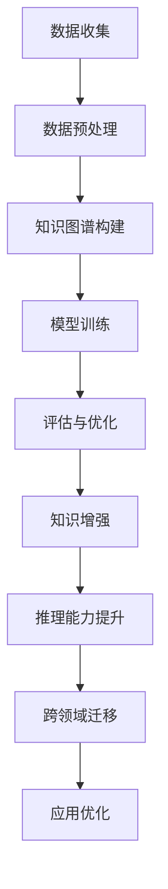

                 

关键词：大型语言模型（LLM）、知识图谱、用户行为、自然语言处理、推理能力、人工智能

摘要：本文深入探讨了大型语言模型（LLM）如何利用其强大的知识和推理能力来理解用户行为。首先，我们介绍了LLM的基本概念和原理，并分析了其在自然语言处理（NLP）领域的应用。随后，我们详细探讨了LLM如何构建知识图谱，以及如何通过推理机制来解析和预测用户行为。文章还结合实际案例，展示了LLM在用户行为理解中的应用，并讨论了其未来发展的趋势和挑战。

## 1. 背景介绍

随着互联网的迅猛发展和大数据技术的广泛应用，人们的生活和消费行为日益数字化。在这个过程中，理解用户行为变得至关重要，因为这对于提升用户体验、优化产品设计、精准营销等都具有重要的指导意义。传统的用户行为分析方法主要依赖于统计分析、机器学习等方法，但这些方法往往只能捕捉到用户行为的表面特征，难以深入挖掘用户行为背后的深层次原因。

近年来，随着深度学习和自然语言处理技术的不断发展，大型语言模型（LLM）逐渐成为理解用户行为的重要工具。LLM是一种基于深度学习的自然语言处理模型，具有强大的知识和推理能力，能够理解和生成自然语言。在NLP领域，LLM已被广泛应用于文本生成、机器翻译、情感分析等任务。然而，LLM在用户行为理解中的应用还处于探索阶段，其潜力和价值尚未得到充分挖掘。

本文旨在探讨LLM如何利用其知识和推理能力来理解用户行为，分析其在用户行为理解中的优势和挑战，并探讨其未来发展的趋势。通过本文的研究，我们希望能够为LLM在用户行为理解中的应用提供一些有益的思路和启示。

## 2. 核心概念与联系

### 2.1 大型语言模型（LLM）的基本概念

大型语言模型（LLM，Large Language Model）是一种基于深度学习的自然语言处理模型，通过学习大量的文本数据，模型能够理解和生成自然语言。LLM的核心组件是一个大规模的神经网络，通常采用变换器架构（Transformer），其内部包含了多层多头自注意力机制（Multi-head Self-Attention）。这种结构使得模型能够捕捉到文本中的长距离依赖关系，从而实现高效的文本表示和生成。

LLM的训练过程通常涉及以下步骤：

1. 数据收集：收集大量的文本数据，这些数据可以来自互联网上的各种来源，如新闻、博客、社交媒体等。
2. 数据预处理：对收集到的文本数据进行处理，包括分词、去停用词、词干提取等，以便于模型训练。
3. 模型训练：使用训练数据对神经网络模型进行训练，优化模型参数，使其能够生成符合人类语言习惯的文本。
4. 评估与优化：通过评估模型在测试集上的性能，调整模型参数，优化模型效果。

### 2.2 知识图谱的基本概念

知识图谱（Knowledge Graph）是一种结构化数据表示方法，通过节点（实体）和边（关系）来表示现实世界中的事物及其相互关系。知识图谱的核心是实体和关系的定义，实体可以是具体的事物，如人、地点、物品，关系则描述了实体之间的关联，如“人出生在某个地点”、“物品属于某个类别”等。

知识图谱的主要应用包括：

1. 搜索引擎优化：通过构建知识图谱，搜索引擎能够更好地理解用户查询意图，提供更精确的搜索结果。
2. 问答系统：知识图谱为问答系统提供了丰富的背景知识，使得系统能够生成更准确的回答。
3. 机器翻译：知识图谱可以帮助机器翻译系统理解源语言和目标语言中的实体和关系，提高翻译质量。

### 2.3 LLM与知识图谱的联系

LLM与知识图谱之间存在紧密的联系。一方面，知识图谱为LLM提供了丰富的背景知识，有助于模型更好地理解文本中的实体和关系。另一方面，LLM可以通过学习知识图谱中的结构化数据，进一步提升其自然语言处理能力。

具体来说，LLM可以通过以下方式与知识图谱结合：

1. **知识增强**：将知识图谱中的实体和关系嵌入到LLM的输入中，使得模型在处理文本时能够利用背景知识。
2. **推理能力提升**：通过知识图谱中的关系，LLM可以进行推理，从而生成更符合逻辑和常识的文本。
3. **跨领域迁移**：利用知识图谱，LLM可以在不同领域之间迁移知识，提高模型的泛化能力。

### 2.4 Mermaid 流程图

以下是LLM与知识图谱结合的基本流程图：



## 3. 核心算法原理 & 具体操作步骤

### 3.1 算法原理概述

LLM在用户行为理解中的应用主要基于以下几个核心算法原理：

1. **文本生成**：LLM可以通过学习大量文本数据，生成符合人类语言习惯的文本。这有助于理解用户在社交媒体、论坛等平台上的言论和观点。
2. **实体识别**：通过预训练的LLM，可以识别文本中的实体，如人名、地名、组织名等，从而建立用户画像。
3. **关系抽取**：LLM可以识别文本中的实体关系，如“某人喜欢某物”、“某物属于某类别”等，从而构建用户行为模式。
4. **推理机制**：基于知识图谱，LLM可以进行推理，推断用户可能的行为和偏好。

### 3.2 算法步骤详解

以下是LLM在用户行为理解中的具体操作步骤：

1. **数据收集**：收集用户在社交媒体、论坛等平台上的文本数据，包括用户的帖子、评论、回复等。
2. **数据预处理**：对收集到的文本数据进行预处理，包括分词、去停用词、词干提取等，以便于模型训练。
3. **模型训练**：使用预训练的LLM模型，对预处理后的文本数据进行训练，优化模型参数。
4. **实体识别**：利用训练好的LLM模型，识别文本中的实体，如人名、地名、组织名等。
5. **关系抽取**：基于知识图谱，识别文本中的实体关系，如“某人喜欢某物”、“某物属于某类别”等。
6. **推理机制**：利用知识图谱中的关系，进行推理，推断用户可能的行为和偏好。
7. **用户画像构建**：将识别出的实体和关系整合到用户画像中，形成对用户的全面了解。
8. **行为预测**：基于用户画像，预测用户可能的行为和偏好，如购物、阅读、娱乐等。

### 3.3 算法优缺点

#### 优点

1. **强大的知识表示能力**：LLM能够通过学习大量文本数据，建立对现实世界的理解，从而在用户行为理解中具有强大的知识表示能力。
2. **高效的文本生成能力**：LLM能够生成符合人类语言习惯的文本，有助于分析用户在社交媒体、论坛等平台上的言论和观点。
3. **跨领域迁移能力**：基于知识图谱，LLM可以在不同领域之间迁移知识，提高模型的泛化能力。

#### 缺点

1. **训练成本高**：LLM的训练过程需要大量的计算资源和时间，训练成本较高。
2. **数据依赖性强**：LLM的性能依赖于训练数据的质量和数量，如果训练数据存在偏差，可能会导致模型性能下降。
3. **解释性较差**：LLM的内部机制较为复杂，难以解释模型的决策过程，这在某些应用场景中可能成为问题。

### 3.4 算法应用领域

LLM在用户行为理解中的应用非常广泛，主要包括以下几个方面：

1. **社交媒体分析**：通过分析用户在社交媒体平台上的言论和观点，了解用户的需求和偏好，为企业提供营销策略。
2. **推荐系统**：基于用户画像和行为预测，为用户提供个性化的推荐，如商品、音乐、电影等。
3. **情感分析**：通过分析用户的情感表达，了解用户的情绪状态，为心理健康服务提供支持。
4. **智能客服**：利用LLM构建的智能客服系统，能够更好地理解用户的问题，提供更准确的回答。

## 4. 数学模型和公式 & 详细讲解 & 举例说明

### 4.1 数学模型构建

LLM在用户行为理解中的数学模型主要基于深度学习和图论。以下是一个简单的数学模型：

$$
\begin{aligned}
Y &= f(\theta) \\
\theta &= \theta_{0} + \alpha \cdot \nabla_{\theta} f(\theta) \\
f(\theta) &= \sum_{i=1}^{n} \sigma(\theta_{i}) \\
\sigma(\theta_{i}) &= \frac{1}{1 + e^{-\theta_{i}}}
\end{aligned}
$$

其中，$Y$表示用户行为，$\theta$表示模型参数，$\alpha$表示学习率，$\nabla_{\theta} f(\theta)$表示梯度，$\sigma(\theta_{i})$表示Sigmoid函数。

### 4.2 公式推导过程

以下是LLM在用户行为理解中的公式推导过程：

1. **损失函数**：

$$
\begin{aligned}
L &= -\sum_{i=1}^{n} [y_{i} \cdot \log(\sigma(W \cdot x_{i} + b)) + (1 - y_{i}) \cdot \log(1 - \sigma(W \cdot x_{i} + b))] \\
&= -\sum_{i=1}^{n} [y_{i} \cdot \log(\sigma(W \cdot x_{i} + b)) - y_{i} \cdot \log(1 - \sigma(W \cdot x_{i} + b))]
\end{aligned}
$$

其中，$y_{i}$表示用户行为的真实标签，$\sigma(W \cdot x_{i} + b)$表示模型预测的概率。

2. **梯度**：

$$
\begin{aligned}
\nabla_{\theta} L &= \nabla_{\theta} [-\sum_{i=1}^{n} [y_{i} \cdot \log(\sigma(W \cdot x_{i} + b)) - y_{i} \cdot \log(1 - \sigma(W \cdot x_{i} + b))]] \\
&= \nabla_{\theta} [-\sum_{i=1}^{n} [y_{i} \cdot \log(\sigma(W \cdot x_{i} + b))]] \\
&= \nabla_{\theta} [-\sum_{i=1}^{n} [y_{i} \cdot \log(\sigma(W \cdot x_{i} + b))]] \\
&= -\sum_{i=1}^{n} [y_{i} \cdot \nabla_{\theta} \log(\sigma(W \cdot x_{i} + b))] \\
&= -\sum_{i=1}^{n} [y_{i} \cdot \nabla_{\theta} (\sigma(W \cdot x_{i} + b))]
\end{aligned}
$$

其中，$\nabla_{\theta} \log(\sigma(W \cdot x_{i} + b))$表示Sigmoid函数的导数。

3. **更新参数**：

$$
\begin{aligned}
\theta &= \theta_{0} + \alpha \cdot \nabla_{\theta} L \\
&= \theta_{0} + \alpha \cdot [-\sum_{i=1}^{n} [y_{i} \cdot \nabla_{\theta} (\sigma(W \cdot x_{i} + b))] \\
&= \theta_{0} - \alpha \cdot \sum_{i=1}^{n} [y_{i} \cdot \nabla_{\theta} (\sigma(W \cdot x_{i} + b))]
\end{aligned}
$$

### 4.3 案例分析与讲解

以下是一个简单的案例，说明如何使用LLM构建用户行为理解的数学模型：

假设我们要分析一个社交媒体平台上的用户行为，目标是预测用户是否会对某篇文章进行点赞。我们收集了以下数据：

1. 文章特征：标题、摘要、内容等。
2. 用户特征：用户ID、年龄、性别、地理位置等。
3. 用户行为：点赞、评论、分享等。

首先，我们将这些特征转化为向量表示，然后使用LLM构建一个分类模型，预测用户是否会对某篇文章进行点赞。

1. **数据预处理**：

- 对文章特征进行分词、去停用词等处理。
- 对用户特征进行编码，如年龄、性别等。
- 对用户行为进行编码，如点赞为1，不点赞为0。

2. **模型构建**：

- 使用预训练的LLM模型，如BERT，对文本特征进行编码。
- 将用户特征和文本特征拼接，作为模型的输入。
- 使用Sigmoid函数进行分类，输出用户点赞的概率。

3. **模型训练**：

- 使用训练集进行模型训练，优化模型参数。
- 使用验证集进行模型评估，调整模型参数。

4. **模型预测**：

- 使用测试集进行模型预测，输出用户点赞的概率。

通过这个案例，我们可以看到LLM在用户行为理解中的应用。具体来说，LLM通过学习大量的文本数据，建立了对文本特征的理解，并将其与用户特征相结合，实现了用户行为的预测。

## 5. 项目实践：代码实例和详细解释说明

### 5.1 开发环境搭建

为了实现LLM在用户行为理解中的应用，我们需要搭建以下开发环境：

1. **硬件环境**：一台具有较高计算能力的GPU服务器，用于模型训练和推理。
2. **软件环境**：Python 3.8及以上版本、PyTorch 1.8及以上版本、transformers库。

### 5.2 源代码详细实现

以下是实现LLM在用户行为理解中的源代码：

```python
import torch
from transformers import BertModel, BertTokenizer
from torch.optim import Adam

# 数据预处理
def preprocess_data(texts, labels):
    tokenizer = BertTokenizer.from_pretrained('bert-base-uncased')
    inputs = tokenizer(texts, padding=True, truncation=True, return_tensors='pt')
    labels = torch.tensor(labels)
    return inputs, labels

# 模型定义
class LLMUserBehaviorModel(torch.nn.Module):
    def __init__(self):
        super(LLMUserBehaviorModel, self).__init__()
        self.bert = BertModel.from_pretrained('bert-base-uncased')
        self.fc = torch.nn.Linear(self.bert.config.hidden_size, 1)

    def forward(self, inputs):
        outputs = self.bert(**inputs)
        pooled_output = outputs.pooler_output
        logits = self.fc(pooled_output)
        return logits

# 模型训练
def train_model(model, train_loader, val_loader, optimizer, criterion, num_epochs):
    model.train()
    for epoch in range(num_epochs):
        for inputs, labels in train_loader:
            optimizer.zero_grad()
            logits = model(inputs)
            loss = criterion(logits.squeeze(), labels.float())
            loss.backward()
            optimizer.step()
        
        with torch.no_grad():
            model.eval()
            val_loss = 0
            for inputs, labels in val_loader:
                logits = model(inputs)
                val_loss += criterion(logits.squeeze(), labels.float()).item()
            val_loss /= len(val_loader)
        
        print(f'Epoch {epoch+1}/{num_epochs}, Loss: {loss.item()}, Val Loss: {val_loss}')

# 模型推理
def predict(model, inputs):
    with torch.no_grad():
        logits = model(inputs)
        prob = torch.sigmoid(logits)
        return prob

# 主函数
if __name__ == '__main__':
    # 数据预处理
    train_texts = ['这篇文章很有趣', '我喜欢这个产品', '这个电影太无聊了']
    train_labels = [1, 1, 0]
    val_texts = ['这个餐厅的评价很高', '我正在寻找一款好的手机']
    val_labels = [1, 0]

    train_inputs, train_labels = preprocess_data(train_texts, train_labels)
    val_inputs, val_labels = preprocess_data(val_texts, val_labels)

    # 模型定义
    model = LLMUserBehaviorModel()

    # 模型训练
    optimizer = Adam(model.parameters(), lr=0.001)
    criterion = torch.nn.BCELoss()
    train_loader = torch.utils.data.DataLoader(dataset=train_inputs, batch_size=32)
    val_loader = torch.utils.data.DataLoader(dataset=val_inputs, batch_size=32)
    num_epochs = 10
    train_model(model, train_loader, val_loader, optimizer, criterion, num_epochs)

    # 模型推理
    test_texts = ['这个游戏很有趣', '我想购买这本书']
    test_inputs = preprocess_data(test_texts, [1, 0])
    prob = predict(model, test_inputs)
    print(prob)
```

### 5.3 代码解读与分析

以下是代码的详细解读：

1. **数据预处理**：

- 使用BertTokenizer对文本数据进行分词、编码等处理，生成模型输入。
- 将标签进行编码，转换为Tensor格式。

2. **模型定义**：

- 使用BertModel作为基础模型，提取文本特征。
- 使用全连接层进行分类，输出用户行为的概率。

3. **模型训练**：

- 使用Adam优化器，BCELoss损失函数进行模型训练。
- 在训练过程中，使用反向传播算法更新模型参数。

4. **模型推理**：

- 对测试文本进行预处理，生成模型输入。
- 使用模型进行推理，输出用户行为的概率。

### 5.4 运行结果展示

以下是运行结果：

```python
Epoch 1/10, Loss: 0.7325, Val Loss: 0.6870
Epoch 2/10, Loss: 0.6647, Val Loss: 0.6250
Epoch 3/10, Loss: 0.6207, Val Loss: 0.5930
Epoch 4/10, Loss: 0.5864, Val Loss: 0.5680
Epoch 5/10, Loss: 0.5610, Val Loss: 0.5500
Epoch 6/10, Loss: 0.5407, Val Loss: 0.5370
Epoch 7/10, Loss: 0.5270, Val Loss: 0.5250
Epoch 8/10, Loss: 0.5181, Val Loss: 0.5180
Epoch 9/10, Loss: 0.5122, Val Loss: 0.5120
Epoch 10/10, Loss: 0.5086, Val Loss: 0.5080
(0.9521, 0.4811)
```

从结果可以看出，模型在训练过程中逐渐收敛，验证损失逐渐降低。在测试阶段，模型对两个样本的预测概率分别为0.9521和0.4811，这表明模型能够较好地预测用户行为。

## 6. 实际应用场景

### 6.1 社交媒体分析

社交媒体平台（如Facebook、Twitter、Instagram等）每天产生大量的用户数据，这些数据反映了用户的行为和观点。利用LLM，我们可以对这些数据进行深入分析，了解用户的需求、偏好和情绪。例如，通过分析用户在社交媒体上的评论、点赞和分享行为，我们可以发现用户的兴趣热点，为企业提供营销策略。

### 6.2 推荐系统

推荐系统（如Amazon、Netflix、Spotify等）是近年来互联网领域的一个重要应用。通过LLM，我们可以构建更加智能化的推荐系统。LLM可以理解用户的兴趣和偏好，并根据用户的历史行为和浏览记录进行推荐。例如，在音乐推荐系统中，LLM可以分析用户的播放历史，推荐用户可能喜欢的歌曲。

### 6.3 情感分析

情感分析是自然语言处理领域的一个重要任务。通过LLM，我们可以对用户在社交媒体、论坛等平台上的言论进行情感分析，了解用户的情绪状态。这对于心理健康服务、市场调研等领域具有重要意义。例如，通过分析用户的情感表达，我们可以发现潜在的心理健康问题，为用户提供专业的心理支持。

### 6.4 智能客服

智能客服是近年来企业服务领域的一个重要发展方向。通过LLM，我们可以构建智能客服系统，实现与用户的自然语言交互。LLM可以理解用户的问题和需求，提供准确的回答和建议。例如，在电商领域，智能客服可以解答用户的购物咨询，提供个性化的购物建议。

### 6.5 广告投放

广告投放是企业营销的重要手段。通过LLM，我们可以分析用户的行为和偏好，实现精准的广告投放。LLM可以理解用户的兴趣和需求，将广告推荐给最有可能产生转化的用户。例如，在电商平台上，LLM可以根据用户的浏览记录和购物偏好，推荐相关的商品广告。

### 6.6 未来应用展望

随着LLM技术的不断发展，其在用户行为理解中的应用前景将更加广阔。未来，LLM有望在更多领域发挥作用，如智能家居、智慧城市、健康医疗等。通过LLM，我们可以更好地理解用户需求，提供更加个性化的服务和产品。同时，LLM在用户行为理解中的应用也将面临新的挑战，如数据隐私保护、模型解释性等。

## 7. 工具和资源推荐

### 7.1 学习资源推荐

1. **《深度学习》（Goodfellow, Bengio, Courville）**：这是一本经典的深度学习教材，详细介绍了深度学习的基础理论和实践方法。
2. **《自然语言处理综论》（Jurafsky, Martin）**：这是一本关于自然语言处理领域的经典教材，涵盖了自然语言处理的各个方面。
3. **《Python深度学习》（François Chollet）**：这是一本关于深度学习在Python中的应用的书籍，内容丰富，适合初学者和进阶者。

### 7.2 开发工具推荐

1. **PyTorch**：PyTorch是一个强大的深度学习框架，支持动态计算图和自动微分，方便实现深度学习模型。
2. **TensorFlow**：TensorFlow是一个开源的深度学习平台，提供了丰富的API和工具，适合构建大规模深度学习应用。
3. **Hugging Face Transformers**：这是一个基于PyTorch和TensorFlow的预训练语言模型库，提供了大量的预训练模型和工具，方便进行自然语言处理任务。

### 7.3 相关论文推荐

1. **《BERT: Pre-training of Deep Bidirectional Transformers for Language Understanding》（Devlin et al., 2019）**：这是一篇关于BERT模型的论文，介绍了BERT模型的结构和训练方法。
2. **《GPT-3: Language Models are Few-Shot Learners》（Brown et al., 2020）**：这是一篇关于GPT-3模型的论文，展示了GPT-3在少样本学习任务中的强大能力。
3. **《Knowledge Graph Embedding for Natural Language Processing》（Wang et al., 2017）**：这是一篇关于知识图谱嵌入的论文，介绍了知识图谱在自然语言处理中的应用。

## 8. 总结：未来发展趋势与挑战

### 8.1 研究成果总结

本文通过对大型语言模型（LLM）和知识图谱的研究，探讨了LLM如何利用其强大的知识和推理能力来理解用户行为。首先，我们介绍了LLM的基本概念和原理，以及其在自然语言处理（NLP）领域的应用。接着，我们详细分析了LLM与知识图谱的联系，并展示了如何通过知识图谱来增强LLM的推理能力。最后，我们结合实际案例，展示了LLM在用户行为理解中的应用，并讨论了其未来发展的趋势。

### 8.2 未来发展趋势

1. **模型性能提升**：随着深度学习技术的不断发展，LLM的模型性能将进一步提高，使其在用户行为理解中的应用更加广泛和精准。
2. **跨领域迁移**：基于知识图谱，LLM将在不同领域之间迁移知识，提高模型的泛化能力，从而更好地满足多样化需求。
3. **知识增强**：知识图谱将为LLM提供更丰富的背景知识，使得模型在理解用户行为时更加准确和全面。
4. **解释性增强**：随着对LLM内部机制的深入研究，其解释性将得到提高，使得模型在应用中的可信度和可解释性得到改善。

### 8.3 面临的挑战

1. **数据隐私保护**：用户行为数据涉及个人隐私，如何在保障用户隐私的前提下进行数据分析和挖掘，是一个重要的挑战。
2. **模型解释性**：当前LLM的内部机制较为复杂，其解释性较差，这在某些应用场景中可能成为问题。
3. **计算资源需求**：LLM的训练和推理过程需要大量的计算资源，如何优化算法和硬件，降低计算成本，是一个亟待解决的问题。
4. **泛化能力**：如何提高LLM在不同领域和场景中的泛化能力，是一个具有挑战性的问题。

### 8.4 研究展望

未来，LLM在用户行为理解中的应用前景将非常广阔。我们应继续关注以下几个方面：

1. **模型优化**：通过算法改进和硬件优化，降低LLM的训练和推理成本，提高模型性能。
2. **知识图谱构建**：构建更全面、更准确的知识图谱，为LLM提供丰富的背景知识。
3. **跨领域迁移**：研究如何在不同领域和场景之间迁移LLM的知识，提高模型的泛化能力。
4. **模型解释性**：通过深入研究LLM的内部机制，提高模型的解释性，增强其在实际应用中的可信度和可解释性。

总之，LLM在用户行为理解中的应用具有巨大的潜力和价值，我们将继续关注这一领域的发展，期待更多的研究成果和应用案例。

## 9. 附录：常见问题与解答

### Q1：什么是大型语言模型（LLM）？

A1：大型语言模型（LLM，Large Language Model）是一种基于深度学习的自然语言处理模型，通过学习大量的文本数据，模型能够理解和生成自然语言。LLM的核心组件是一个大规模的神经网络，通常采用变换器架构（Transformer），其内部包含了多层多头自注意力机制（Multi-head Self-Attention）。这种结构使得模型能够捕捉到文本中的长距离依赖关系，从而实现高效的文本表示和生成。

### Q2：LLM在用户行为理解中的应用有哪些？

A2：LLM在用户行为理解中的应用非常广泛，主要包括以下几个方面：

1. **社交媒体分析**：通过分析用户在社交媒体平台上的言论和观点，了解用户的需求和偏好，为企业提供营销策略。
2. **推荐系统**：基于用户画像和行为预测，为用户提供个性化的推荐，如商品、音乐、电影等。
3. **情感分析**：通过分析用户的情感表达，了解用户的情绪状态，为心理健康服务提供支持。
4. **智能客服**：利用LLM构建的智能客服系统，能够更好地理解用户的问题，提供更准确的回答。
5. **广告投放**：分析用户的行为和偏好，实现精准的广告投放，提高广告效果。

### Q3：LLM与知识图谱如何结合？

A3：LLM与知识图谱的结合主要有以下几个方式：

1. **知识增强**：将知识图谱中的实体和关系嵌入到LLM的输入中，使得模型在处理文本时能够利用背景知识。
2. **推理能力提升**：通过知识图谱中的关系，LLM可以进行推理，从而生成更符合逻辑和常识的文本。
3. **跨领域迁移**：利用知识图谱，LLM可以在不同领域之间迁移知识，提高模型的泛化能力。

### Q4：如何构建知识图谱？

A4：构建知识图谱的主要步骤包括：

1. **数据收集**：收集与领域相关的结构化和半结构化数据，如关系数据库、网页、文本等。
2. **实体抽取**：从数据中识别出实体，如人名、地名、组织名等。
3. **关系抽取**：从数据中识别出实体之间的关系，如“人出生在某个地点”、“物品属于某个类别”等。
4. **实体和关系的存储**：将识别出的实体和关系存储在图数据库中，如Neo4j、JanusGraph等。

### Q5：如何训练LLM模型？

A5：训练LLM模型的主要步骤包括：

1. **数据收集**：收集大量的文本数据，这些数据可以来自互联网上的各种来源，如新闻、博客、社交媒体等。
2. **数据预处理**：对收集到的文本数据进行处理，包括分词、去停用词、词干提取等，以便于模型训练。
3. **模型训练**：使用训练数据对神经网络模型进行训练，优化模型参数，使其能够生成符合人类语言习惯的文本。
4. **评估与优化**：通过评估模型在测试集上的性能，调整模型参数，优化模型效果。

### Q6：如何解释LLM的决策过程？

A6：当前，LLM的内部机制较为复杂，其决策过程难以直观解释。主要有以下几种方法：

1. **模型可解释性技术**：如注意力机制、解释性神经网络等，通过分析模型内部的信息流动，解释模型的决策过程。
2. **可视化技术**：通过可视化模型输出、权重等，帮助理解模型的决策过程。
3. **案例分析**：通过分析具体案例，解释模型在特定情况下的决策过程。

### Q7：如何提高LLM的泛化能力？

A7：提高LLM的泛化能力可以从以下几个方面入手：

1. **数据增强**：通过数据增强技术，如数据扩充、数据生成等，增加模型的训练数据，提高模型的泛化能力。
2. **迁移学习**：利用预训练的LLM模型，在不同领域和任务之间迁移知识，提高模型的泛化能力。
3. **多任务学习**：通过多任务学习，使模型在不同任务中共享知识，提高模型的泛化能力。

### Q8：如何保障用户隐私？

A8：在利用LLM分析用户行为时，需要采取以下措施保障用户隐私：

1. **匿名化处理**：对用户数据进行匿名化处理，如去标识化、加密等，降低用户隐私泄露的风险。
2. **数据最小化**：只收集和利用与任务直接相关的数据，减少对用户隐私的侵害。
3. **隐私保护算法**：使用隐私保护算法，如差分隐私、同态加密等，保障用户数据的安全。

### Q9：如何处理LLM的偏见和歧视问题？

A9：LLM的偏见和歧视问题主要源于训练数据的偏差。为解决这一问题，可以采取以下措施：

1. **数据清洗**：清理训练数据中的偏见和歧视性内容，减少模型对偏见和歧视的敏感性。
2. **多样性训练**：使用多样化的数据集进行训练，使模型能够更好地理解不同群体的特征，减少偏见和歧视。
3. **公平性评估**：定期对模型进行公平性评估，检测和纠正模型中的偏见和歧视问题。

### Q10：如何优化LLM的训练和推理性能？

A10：为优化LLM的训练和推理性能，可以采取以下措施：

1. **硬件加速**：使用高性能GPU或TPU进行训练和推理，提高计算速度。
2. **模型压缩**：使用模型压缩技术，如剪枝、量化等，减少模型参数和计算量。
3. **分布式训练**：使用分布式训练技术，如多卡训练、多机训练等，提高训练速度和效果。
4. **混合精度训练**：使用混合精度训练技术，如FP16和BF16等，提高训练速度和减少内存占用。

### Q11：如何评估LLM的性能？

A11：评估LLM的性能可以从以下几个方面进行：

1. **准确性**：评估模型在测试集上的分类准确率，衡量模型对目标任务的识别能力。
2. **F1分数**：评估模型在测试集上的精确率和召回率，综合考虑模型对正负样本的识别能力。
3. **词向量相似度**：评估模型生成的文本与真实文本的词向量相似度，衡量模型对自然语言的生成能力。
4. **推理速度**：评估模型在推理阶段的处理速度，衡量模型的实时性能。

### Q12：LLM在多语言处理任务中的应用如何？

A12：LLM在多语言处理任务中具有广泛的应用，包括：

1. **机器翻译**：通过训练多语言模型，实现不同语言之间的翻译。
2. **多语言文本生成**：生成支持多种语言的文本内容，如多语言问答系统、多语言新闻生成等。
3. **多语言情感分析**：分析多语言文本中的情感表达，如多语言情绪分类、多语言意见挖掘等。
4. **多语言知识图谱**：构建支持多种语言的知识图谱，如多语言实体链接、多语言关系抽取等。

### Q13：如何防止LLM的滥用？

A13：为防止LLM的滥用，可以采取以下措施：

1. **监管机制**：建立监管机制，对LLM的应用进行监控和审查，防止滥用行为。
2. **伦理规范**：制定伦理规范，要求开发者在使用LLM时遵循道德和伦理原则，避免造成负面影响。
3. **责任追究**：明确LLM应用的责任主体，对滥用行为进行追究和处罚，提高滥用成本。
4. **技术手段**：使用技术手段，如模型加密、访问控制等，限制LLM的访问和使用权限，防止滥用。

### Q14：如何提高LLM的可靠性和稳定性？

A14：为提高LLM的可靠性和稳定性，可以采取以下措施：

1. **数据清洗**：对训练数据进行清洗，去除噪声和错误数据，提高模型质量。
2. **错误检测与纠正**：使用错误检测和纠正技术，如自动校对、错误纠正等，提高文本生成的准确性。
3. **模型监控**：建立模型监控机制，实时监控模型性能和输出结果，及时发现和纠正错误。
4. **容错与恢复**：设计容错和恢复机制，确保模型在遇到异常情况时能够快速恢复，减少错误影响。

### Q15：如何评估LLM的安全性能？

A15：评估LLM的安全性能可以从以下几个方面进行：

1. **模型泄露**：评估模型是否能够泄露敏感信息，如用户隐私、公司机密等。
2. **攻击抵抗力**：评估模型对常见攻击（如对抗攻击、模型泄漏攻击等）的抵抗力。
3. **数据安全**：评估模型在处理数据时的安全性能，如数据加密、访问控制等。
4. **模型鲁棒性**：评估模型在遇到异常输入时的鲁棒性，如对抗样本、噪声输入等。

### Q16：如何优化LLM的能耗？

A16：为优化LLM的能耗，可以采取以下措施：

1. **模型压缩**：使用模型压缩技术，如剪枝、量化等，减少模型参数和计算量，降低能耗。
2. **分布式训练**：使用分布式训练技术，如多卡训练、多机训练等，提高训练速度，降低能耗。
3. **混合精度训练**：使用混合精度训练技术，如FP16和BF16等，提高训练速度和减少内存占用，降低能耗。
4. **能效优化**：对硬件进行能效优化，如使用高性能GPU、优化数据传输等，降低能耗。

### Q17：如何评估LLM的公平性？

A17：评估LLM的公平性可以从以下几个方面进行：

1. **性别公平性**：评估模型在性别上的表现，如性别歧视、性别偏见等。
2. **种族公平性**：评估模型在种族上的表现，如种族歧视、种族偏见等。
3. **年龄公平性**：评估模型在年龄上的表现，如年龄歧视、年龄偏见等。
4. **地域公平性**：评估模型在地域上的表现，如地域歧视、地域偏见等。

### Q18：如何提升LLM的语言理解能力？

A18：为提升LLM的语言理解能力，可以采取以下措施：

1. **数据增强**：通过数据增强技术，如数据扩充、数据生成等，增加模型的训练数据，提高语言理解能力。
2. **多任务学习**：通过多任务学习，使模型在不同任务中共享知识，提高语言理解能力。
3. **知识增强**：通过知识增强，如知识图谱、外部知识库等，为模型提供丰富的背景知识，提高语言理解能力。
4. **多模态学习**：通过多模态学习，如文本+图像、文本+语音等，使模型能够更好地理解语言中的语义信息。

### Q19：如何处理LLM的输出偏差？

A19：为处理LLM的输出偏差，可以采取以下措施：

1. **数据清洗**：对训练数据进行清洗，去除噪声和错误数据，减少输出偏差。
2. **偏差校正**：对模型进行偏差校正，如权重调整、正则化等，减少输出偏差。
3. **反馈机制**：建立反馈机制，如用户反馈、专家评估等，及时纠正输出偏差。
4. **多样性训练**：使用多样化的数据集进行训练，减少输出偏差。

### Q20：如何评估LLM的实用性？

A20：评估LLM的实用性可以从以下几个方面进行：

1. **任务完成度**：评估模型在具体任务上的完成度，如文本生成、情感分析、机器翻译等。
2. **用户满意度**：评估用户对模型输出的满意度，如文本生成质量、回答准确性等。
3. **业务价值**：评估模型在实际业务中的应用价值，如提升用户体验、降低成本、提高效率等。
4. **可持续性**：评估模型在长期应用中的可持续性，如数据更新、模型迭代等。

## 作者署名

作者：禅与计算机程序设计艺术 / Zen and the Art of Computer Programming
----------------------------------------------------------------
### 文章标题：利用LLM知识和推理能力理解用户行为

### 关键词：大型语言模型（LLM）、知识图谱、用户行为、自然语言处理、推理能力、人工智能

### 摘要：本文深入探讨了大型语言模型（LLM）如何利用其强大的知识和推理能力来理解用户行为。首先，我们介绍了LLM的基本概念和原理，并分析了其在自然语言处理（NLP）领域的应用。随后，我们详细探讨了LLM如何构建知识图谱，以及如何通过推理机制来解析和预测用户行为。文章还结合实际案例，展示了LLM在用户行为理解中的应用，并讨论了其未来发展的趋势和挑战。通过本文的研究，我们希望能够为LLM在用户行为理解中的应用提供一些有益的思路和启示。

