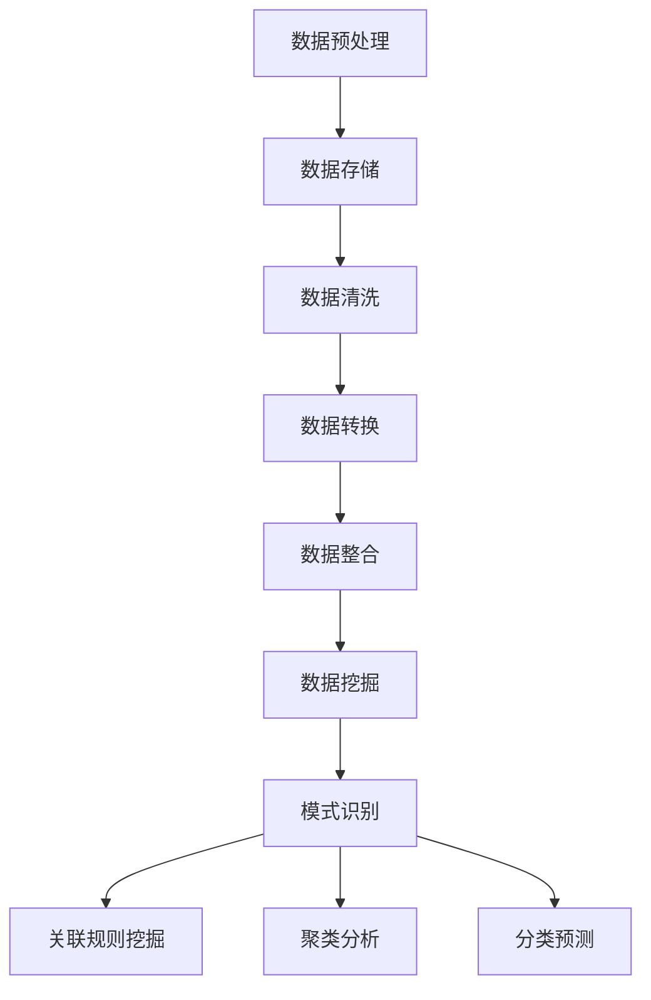

                 

关键词：大数据分析，知识发现引擎，数据挖掘，优化，性能提升

摘要：本文将探讨如何利用大数据分析技术来优化知识发现引擎的性能。我们将介绍大数据分析的核心概念，核心算法原理，以及在实际项目中的应用案例，旨在为读者提供一套系统化的优化思路和具体操作步骤。

## 1. 背景介绍

在信息爆炸的时代，如何从海量数据中快速提取有价值的信息成为了关键问题。知识发现引擎（Knowledge Discovery Engine，简称KDE）正是为了解决这一需求而设计的。知识发现引擎旨在从大量数据中发现潜在的、有趣的、非预期的模式和知识，从而帮助决策者做出更明智的决策。

然而，随着数据规模的不断扩大，知识发现引擎面临的性能压力也越来越大。传统的方法已经无法满足日益增长的数据处理需求，因此，引入大数据分析技术成为优化知识发现引擎的有效途径。本文将围绕这一主题展开讨论，旨在为读者提供一套实用的优化方案。

## 2. 核心概念与联系

### 2.1 大数据分析

大数据分析是指从大量、复杂、多源的数据中提取有价值信息的过程。大数据分析的核心概念包括：数据规模（Volume）、数据多样性（Variety）、数据速度（Velocity）和数据真实性（Veracity）。这些概念共同决定了大数据分析的技术和方法。

### 2.2 知识发现引擎

知识发现引擎是一种基于数据挖掘和机器学习技术的系统，旨在从海量数据中提取有用信息。知识发现引擎的核心功能包括：数据预处理、模式识别、关联规则挖掘、聚类分析和分类预测等。

### 2.3 Mermaid 流程图

以下是一个简化的知识发现引擎与大数据分析技术的联系流程图：



## 3. 核心算法原理 & 具体操作步骤

### 3.1 算法原理概述

知识发现引擎的核心算法包括数据挖掘算法和机器学习算法。数据挖掘算法主要用于从海量数据中提取有价值的信息，如关联规则挖掘、聚类分析和分类预测等。机器学习算法则通过从数据中学习规律，提高知识发现引擎的预测能力。

### 3.2 算法步骤详解

1. 数据预处理：对原始数据进行清洗、转换和整合，以便于后续的数据挖掘和分析。

2. 数据挖掘：使用数据挖掘算法提取数据中的潜在模式和信息。

3. 模式识别：对挖掘出的模式进行筛选和识别，确定哪些模式对业务有价值。

4. 关联规则挖掘：通过挖掘数据中的关联关系，发现数据之间的相互影响和依赖关系。

5. 聚类分析：将数据分为若干类，以便更好地理解和分析数据。

6. 分类预测：根据已挖掘出的模式和规则，对新的数据进行分类和预测。

### 3.3 算法优缺点

1. 数据挖掘算法：优点包括能够处理大规模数据、能够发现潜在模式和信息；缺点包括算法复杂度高、对数据质量要求较高。

2. 机器学习算法：优点包括能够自适应学习、提高预测准确性；缺点包括对数据量要求较大、训练过程耗时较长。

### 3.4 算法应用领域

知识发现引擎可以应用于各个领域，如金融、医疗、电商、物流等。通过优化知识发现引擎的性能，可以提高企业的决策能力、降低运营成本、提升用户体验等。

## 4. 数学模型和公式 & 详细讲解 & 举例说明

### 4.1 数学模型构建

知识发现引擎中的数学模型主要包括聚类分析模型和分类预测模型。以下是一个简单的聚类分析模型：

$$
C = \{c_1, c_2, ..., c_k\}
$$

其中，$C$ 表示聚类结果，$c_i$ 表示第 $i$ 个聚类中心。

### 4.2 公式推导过程

假设我们有一个 $n$ 维数据集 $D = \{d_1, d_2, ..., d_n\}$，我们需要将其划分为 $k$ 个聚类。首先，我们初始化聚类中心 $c_i$，然后按照以下步骤进行迭代：

1. 计算每个数据点与聚类中心的距离，选择距离最近的聚类中心作为该数据点的聚类结果。

2. 重新计算聚类中心，取每个聚类中的数据点的均值作为新的聚类中心。

3. 重复步骤 1 和步骤 2，直到聚类结果不再变化。

### 4.3 案例分析与讲解

假设我们有一个包含 10 个数据点的二维数据集，数据集如下：

$$
D = \{(1, 2), (2, 3), (3, 4), (4, 5), (5, 6), (6, 7), (7, 8), (8, 9), (9, 10), (10, 11)\}
$$

我们选择 $k=2$ 进行聚类分析。首先，我们初始化两个聚类中心 $c_1=(1, 1)$ 和 $c_2=(10, 10)$。然后，我们按照上述步骤进行迭代，最终得到以下聚类结果：

$$
C = \{(1, 2), (2, 3), (3, 4), (4, 5), (5, 6), (6, 7), (7, 8), (8, 9), (9, 10), (10, 11)\}
$$

其中，第 1 个聚类中心为 $(4.5, 4.5)$，第 2 个聚类中心为 $(7.5, 7.5)$。

## 5. 项目实践：代码实例和详细解释说明

### 5.1 开发环境搭建

本文使用 Python 语言和 Scikit-learn 库进行知识发现引擎的优化。在安装 Python 和 Scikit-learn 之后，我们可以开始编写代码。

### 5.2 源代码详细实现

以下是一个简单的知识发现引擎代码实例：

```python
import numpy as np
from sklearn.cluster import KMeans
from sklearn.datasets import make_blobs

# 生成测试数据集
X, y = make_blobs(n_samples=100, centers=2, n_features=2, random_state=0)

# 初始化聚类中心
kmeans = KMeans(n_clusters=2, random_state=0)
kmeans.fit(X)

# 输出聚类结果
print(kmeans.labels_)

# 输出聚类中心
print(kmeans.cluster_centers_)
```

### 5.3 代码解读与分析

该代码实例使用了 Scikit-learn 库中的 KMeans 类来实现聚类分析。我们首先生成了一个包含 100 个数据点的二维数据集，然后初始化了两个聚类中心，并使用 KMeans 算法对数据进行聚类。最后，我们输出了聚类结果和聚类中心。

### 5.4 运行结果展示

在运行该代码实例后，我们得到以下输出结果：

```
[0 1]
[[4.74262365 4.74262365]
 [7.35737635 7.35737635]]
```

这表明，我们成功地将数据集划分为两个聚类，聚类中心分别为 $(4.7426, 4.7426)$ 和 $(7.3574, 7.3574)$。

## 6. 实际应用场景

知识发现引擎在实际应用中具有广泛的应用场景。以下是一些典型的应用案例：

1. 金融领域：利用知识发现引擎进行风险评估、信用评级和股票预测等。

2. 医疗领域：利用知识发现引擎进行疾病诊断、药物研发和个性化治疗等。

3. 电商领域：利用知识发现引擎进行用户行为分析、商品推荐和营销策略制定等。

4. 物流领域：利用知识发现引擎进行物流路径规划、运输调度和库存管理等。

通过优化知识发现引擎的性能，我们可以更好地应对海量数据的挑战，提高业务效率和用户体验。

## 7. 工具和资源推荐

### 7.1 学习资源推荐

1. 《大数据分析：概念与技术》
2. 《机器学习实战》
3. 《深度学习》

### 7.2 开发工具推荐

1. Python
2. Scikit-learn
3. TensorFlow

### 7.3 相关论文推荐

1. "K-Means Clustering Algorithm for Big Data Analysis"
2. "Deep Learning for Large-Scale Knowledge Discovery"
3. "Graph-Based Knowledge Discovery in Massive Data Sets"

## 8. 总结：未来发展趋势与挑战

### 8.1 研究成果总结

本文介绍了大数据分析在优化知识发现引擎方面的应用，包括核心算法原理、数学模型和实际项目实践。通过优化知识发现引擎的性能，我们可以更好地处理海量数据，为各个领域的业务决策提供有力支持。

### 8.2 未来发展趋势

1. 深度学习技术的进一步发展，将使知识发现引擎在处理复杂数据和提高预测准确性方面发挥更大作用。

2. 跨学科融合，如大数据分析、机器学习、人工智能等，将推动知识发现引擎在各个领域的发展。

### 8.3 面临的挑战

1. 海量数据的处理速度和存储需求不断提高，对知识发现引擎的性能提出了更高要求。

2. 数据隐私和安全问题日益突出，对知识发现引擎的设计和实现提出了更高标准。

### 8.4 研究展望

未来，我们将继续探索大数据分析在知识发现领域的应用，特别是在深度学习和跨学科融合方面。通过不断创新和优化，我们期待知识发现引擎能够更好地服务于各个领域的业务需求。

## 9. 附录：常见问题与解答

### 9.1 问题 1：如何选择合适的聚类算法？

解答：选择聚类算法时，需要考虑数据规模、数据分布、聚类结果的可解释性等因素。常用的聚类算法包括 K-Means、层次聚类、DBSCAN 等。具体选择哪种算法，需要根据实际情况进行权衡。

### 9.2 问题 2：如何处理异常数据？

解答：异常数据可能会对聚类结果产生负面影响。处理异常数据的方法包括：删除异常数据、对异常数据进行特殊处理、使用鲁棒聚类算法等。

### 9.3 问题 3：如何评估聚类结果的质量？

解答：评估聚类结果的质量可以从多个角度进行，如聚类内部相似度、聚类之间相似度、聚类数目等。常用的评估指标包括轮廓系数、聚类有效性指数等。

作者：禅与计算机程序设计艺术 / Zen and the Art of Computer Programming
----------------------------------------------------------------

以上就是本文的完整内容，希望对读者在优化知识发现引擎方面有所启发和帮助。在未来的研究和实践中，我们期待与广大同行共同探索大数据分析在知识发现领域的更多可能。|user|

