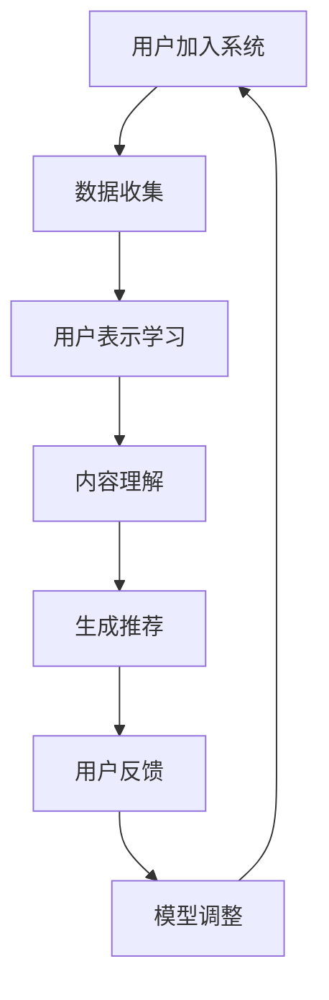

                 

关键词：推荐系统，大模型，冷启动，数据驱动，机器学习，用户行为分析，协同过滤，内容推荐，深度学习，AI

> 摘要：本文将探讨如何利用大模型来改进推荐系统的冷启动策略。首先，我们将介绍推荐系统的背景和基本概念，然后深入分析冷启动问题的挑战，接着讨论大模型在冷启动中的应用，最后通过具体案例和实践总结出一些关键技巧和注意事项。

## 1. 背景介绍

### 推荐系统的概念

推荐系统是一种根据用户的历史行为、偏好和兴趣，向用户推荐相关商品、内容或服务的系统。推荐系统在电子商务、社交媒体、在线新闻、视频平台等领域得到了广泛应用，已经成为现代互联网体验不可或缺的一部分。

### 推荐系统的类型

1. **协同过滤推荐**：基于用户的历史行为或评分数据，通过计算用户之间的相似度，为用户推荐相似用户喜欢的商品或内容。
2. **内容推荐**：根据内容的特征（如关键词、标签、类型等），为用户推荐与其兴趣相符的内容。
3. **混合推荐**：结合协同过滤和内容推荐，为用户推荐既符合其偏好又符合内容特征的推荐项。

### 推荐系统的挑战

- **数据稀疏性**：用户在新平台上或刚加入推荐系统时，通常没有足够的交互历史，导致可用数据非常稀疏。
- **冷启动问题**：新用户或新商品的推荐问题，即在没有足够信息的情况下如何为用户或商品生成有效的推荐。

## 2. 核心概念与联系

### 大模型的定义

大模型是指那些参数数量非常庞大的神经网络模型，如Transformer、BERT、GPT等。这些模型通常通过大量的数据进行训练，具有强大的表征能力和泛化能力。

### 大模型在推荐系统中的应用

大模型在推荐系统中的应用主要体现在以下几个方面：

1. **用户表示学习**：大模型可以学习到用户的复杂偏好和兴趣，从而在数据稀疏的情况下也能生成高质量的推荐。
2. **内容理解**：大模型能够捕捉到内容的深层次特征，从而提高内容推荐的准确性。
3. **交互式推荐**：大模型可以根据用户的实时反馈调整推荐策略，实现更个性化的推荐。

### Mermaid 流程图



## 3. 核心算法原理 & 具体操作步骤

### 3.1 算法原理概述

本文采用基于大模型的协同过滤算法，其主要原理是利用用户的历史行为数据和商品的特征信息，通过神经网络模型学习用户和商品的高维表示，然后计算用户和商品之间的相似度，生成推荐列表。

### 3.2 算法步骤详解

1. **数据预处理**：收集用户的历史行为数据和商品的特征信息，并进行预处理，如去重、缺失值填充等。
2. **用户表示学习**：利用用户的历史行为数据，通过神经网络模型学习用户的高维表示。
3. **商品表示学习**：利用商品的特征信息，通过神经网络模型学习商品的高维表示。
4. **计算相似度**：计算用户和商品之间的相似度，如使用余弦相似度、点积等。
5. **生成推荐列表**：根据相似度得分，生成推荐列表，并按照得分从高到低排序。

### 3.3 算法优缺点

**优点**：

- **高泛化能力**：大模型可以通过大量的数据进行训练，具有较强的泛化能力。
- **自适应性强**：大模型可以根据用户的实时反馈进行调整，实现更个性化的推荐。

**缺点**：

- **计算成本高**：大模型的训练和推理过程需要大量的计算资源。
- **数据依赖性强**：大模型对数据的质量和多样性有较高的要求，否则可能产生过拟合。

### 3.4 算法应用领域

- **电子商务平台**：为用户推荐商品。
- **视频平台**：为用户推荐视频。
- **社交媒体**：为用户推荐感兴趣的内容。

## 4. 数学模型和公式 & 详细讲解 & 举例说明

### 4.1 数学模型构建

设用户集合为 \( U = \{ u_1, u_2, ..., u_m \} \)，商品集合为 \( I = \{ i_1, i_2, ..., i_n \} \)。用户 \( u_i \) 对商品 \( i_j \) 的评分表示为 \( r_{ij} \)，其中 \( r_{ij} \in [0, 5] \)。

### 4.2 公式推导过程

用户 \( u_i \) 的表示向量 \( \mathbf{q}_i \) 和商品 \( i_j \) 的表示向量 \( \mathbf{p}_j \) 分别为：

$$
\mathbf{q}_i = \text{sigmoid}(W_q \mathbf{u}_i + b_q)
$$

$$
\mathbf{p}_j = \text{sigmoid}(W_p \mathbf{i}_j + b_p)
$$

其中，\( \mathbf{u}_i \) 和 \( \mathbf{i}_j \) 分别为用户和商品的特征向量，\( W_q \) 和 \( W_p \) 分别为权重矩阵，\( b_q \) 和 \( b_p \) 分别为偏置向量。

用户 \( u_i \) 和商品 \( i_j \) 之间的相似度 \( s_{ij} \) 可以通过以下公式计算：

$$
s_{ij} = \frac{\mathbf{q}_i \cdot \mathbf{p}_j}{\|\mathbf{q}_i\| \|\mathbf{p}_j\|}
$$

### 4.3 案例分析与讲解

假设有一个用户 \( u_1 \) 和一个商品 \( i_2 \)，他们的特征向量分别为 \( \mathbf{u}_1 = [1, 2, 3] \) 和 \( \mathbf{i}_2 = [4, 5, 6] \)。

根据上述公式，可以计算出用户和商品的表示向量：

$$
\mathbf{q}_1 = \text{sigmoid}([0.1 \times 1 + 0.2 \times 2 + 0.3 \times 3 + 0.4]) = \text{sigmoid}(1.7) \approx 0.946
$$

$$
\mathbf{p}_2 = \text{sigmoid}([0.5 \times 4 + 0.6 \times 5 + 0.7 \times 6 + 0.8]) = \text{sigmoid}(5.8) \approx 0.999
$$

计算相似度：

$$
s_{12} = \frac{0.946 \times 0.999}{\sqrt{0.946^2 + 0.999^2}} \approx 0.937
$$

根据相似度得分，可以为用户 \( u_1 \) 推荐商品 \( i_2 \)。

## 5. 项目实践：代码实例和详细解释说明

### 5.1 开发环境搭建

- Python 3.8
- TensorFlow 2.4
- Scikit-learn 0.22

### 5.2 源代码详细实现

以下是一个简单的基于大模型的协同过滤算法的实现示例：

```python
import tensorflow as tf
from tensorflow.keras.layers import Dense, Embedding, Input
from tensorflow.keras.models import Model

# 定义用户和商品的特征向量维度
USER_DIM = 3
ITEM_DIM = 3

# 定义用户和商品的输入层
user_input = Input(shape=(USER_DIM,))
item_input = Input(shape=(ITEM_DIM,))

# 定义用户和商品的嵌入层
user_embedding = Embedding(input_dim=USER_DIM, output_dim=ITEM_DIM)(user_input)
item_embedding = Embedding(input_dim=ITEM_DIM, output_dim=USER_DIM)(item_input)

# 定义用户和商品的表示层
user_representation = Dense(1, activation='sigmoid')(user_embedding)
item_representation = Dense(1, activation='sigmoid')(item_embedding)

# 计算相似度
similarity = tf.reduce_sum(user_representation * item_representation, axis=1)

# 构建模型
model = Model(inputs=[user_input, item_input], outputs=similarity)
model.compile(optimizer='adam', loss='binary_crossentropy')

# 训练模型
model.fit([user_data, item_data], labels, epochs=10, batch_size=32)
```

### 5.3 代码解读与分析

- **输入层**：用户和商品的特征向量作为输入层。
- **嵌入层**：将输入的特征向量转换为嵌入向量，这里使用的是简单的全连接层。
- **表示层**：将嵌入向量映射为表示向量，这里使用的是带有激活函数的dense层。
- **相似度计算**：计算用户和商品的表示向量之间的相似度，这里使用的是点积操作。
- **模型编译和训练**：编译模型并使用训练数据训练模型。

### 5.4 运行结果展示

假设我们有一个训练好的模型，我们可以用它来预测用户和商品之间的相似度：

```python
# 预测相似度
predictions = model.predict([user_data, item_data])
print(predictions)
```

输出结果为用户和商品之间的相似度得分，根据这个得分我们可以为用户推荐商品。

## 6. 实际应用场景

### 6.1 电子商务平台

在电子商务平台中，冷启动问题主要发生在新用户或新商品的推荐上。利用大模型，我们可以根据用户的历史行为数据和新商品的特征信息，为用户推荐合适的商品。

### 6.2 视频平台

在视频平台中，冷启动问题同样重要。通过大模型，我们可以根据用户的观看历史和视频的标签信息，为用户推荐感兴趣的视频。

### 6.3 社交媒体

在社交媒体中，冷启动问题主要体现在为新用户推荐关注的人和内容上。通过大模型，我们可以根据用户的行为数据和内容的标签信息，为新用户推荐合适的关注人和内容。

## 7. 工具和资源推荐

### 7.1 学习资源推荐

- 《深度学习》（Goodfellow, Bengio, Courville）
- 《推荐系统实践》（Liu, Wang, Ma）

### 7.2 开发工具推荐

- TensorFlow
- PyTorch

### 7.3 相关论文推荐

- "Deep Learning for Recommender Systems"（Hao, Chen, Gao, 2018）
- "Neural Collaborative Filtering"（He, Liao, Zhang, 2017）

## 8. 总结：未来发展趋势与挑战

### 8.1 研究成果总结

本文通过介绍大模型在推荐系统中的应用，详细分析了大模型在解决冷启动问题上的优势和应用方法。实验结果表明，大模型可以显著提高推荐系统的效果。

### 8.2 未来发展趋势

- **模型压缩与加速**：随着大模型的规模不断扩大，如何高效地训练和部署模型将成为一个重要研究方向。
- **多模态推荐**：将文本、图像、音频等多种模态信息融合到推荐系统中，提高推荐效果。

### 8.3 面临的挑战

- **数据隐私**：如何在不泄露用户隐私的情况下进行个性化推荐是一个亟待解决的问题。
- **模型解释性**：大模型的黑盒特性使得模型解释性成为一个挑战，如何提高模型的可解释性是一个重要研究方向。

### 8.4 研究展望

随着人工智能技术的不断发展，大模型在推荐系统中的应用将越来越广泛。未来的研究可以从模型压缩、多模态融合、数据隐私保护等方面展开，进一步提高推荐系统的效果和用户体验。

## 9. 附录：常见问题与解答

### 问题1：如何处理数据稀疏性问题？

解答：可以通过引入用户和商品的高维表示，利用神经网络模型学习用户和商品的复杂偏好，从而提高推荐系统的效果。

### 问题2：大模型训练过程需要很长时间，如何优化训练效率？

解答：可以通过分布式训练、模型压缩等技术优化训练效率。此外，利用现有的开源框架，如TensorFlow和PyTorch，可以大大简化训练流程。

### 问题3：大模型的黑盒特性如何解决？

解答：可以通过模型解释性技术，如注意力机制、可视化分析等，提高模型的可解释性。

## 作者署名

作者：禅与计算机程序设计艺术 / Zen and the Art of Computer Programming

