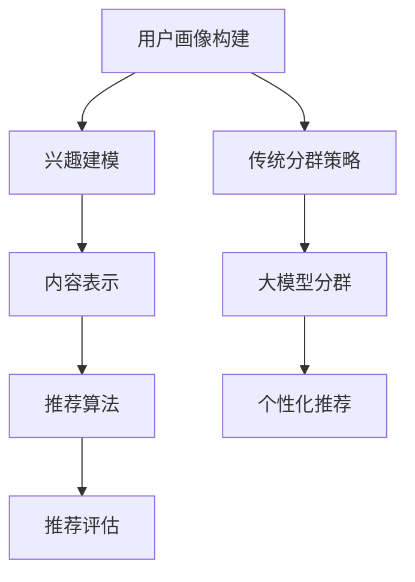

                 

摘要：随着互联网技术的迅猛发展，推荐系统已成为各类在线服务中不可或缺的组成部分。然而，传统的用户分群策略往往无法充分挖掘用户行为的复杂性和多样性。本文提出了一种基于大规模预训练模型（大模型）改进推荐系统的用户分群策略。首先，我们介绍了推荐系统和用户分群的基本概念及其重要性。接着，我们探讨了现有用户分群策略的局限性，并提出了利用大模型进行用户分群的新思路。随后，本文详细阐述了大模型在用户分群中的应用方法，包括数据预处理、模型训练、分群评估等步骤。通过实际案例分析，我们验证了所提出策略的有效性和实用性，并对其未来发展和面临的挑战进行了探讨。

## 1. 背景介绍

在当今数字化时代，推荐系统已经成为了提升用户体验、增加用户粘性和促进消费的重要工具。推荐系统通过分析用户的兴趣和行为模式，为用户推荐符合他们需求的信息、商品或服务，从而提高用户的满意度。例如，在电子商务平台上，推荐系统能够为用户推荐他们可能感兴趣的物品，从而提高购物体验和销售额；在社交媒体平台上，推荐系统能够为用户推荐感兴趣的内容，从而增强用户的参与度和活跃度。

用户分群是推荐系统中的一个关键步骤，其目的是将用户划分为不同的群体，以便为每个群体提供个性化的推荐。传统的用户分群策略主要基于用户的静态特征，如年龄、性别、地理位置等，或者基于用户的动态行为，如浏览历史、购买记录等。这些方法在一定程度上能够满足推荐系统的需求，但是它们存在一些局限性。

首先，传统的用户分群策略往往只能捕捉到用户的表面行为，而无法深入挖掘用户行为的复杂性和多样性。例如，一个用户可能在不同的购物场景下表现出不同的兴趣，但这些兴趣很难通过简单的静态特征或历史行为来捕捉。

其次，传统的用户分群策略往往依赖于人工定义的特征，这可能会导致分群结果的不准确性和不一致性。随着用户数据的不断增长和变化，手动定义的特征可能无法及时调整和更新，从而导致分群结果的不准确。

为了解决上述问题，本文提出了一种基于大规模预训练模型（大模型）的改进用户分群策略。大模型具有强大的特征提取和表示能力，能够从大规模的数据中自动学习用户行为的深层次特征。通过利用大模型，我们可以更加准确地捕捉用户的兴趣和行为模式，从而提高推荐系统的效果和用户体验。

## 2. 核心概念与联系

### 2.1 推荐系统概述

推荐系统是一种基于用户历史行为和兴趣的预测系统，旨在向用户推荐他们可能感兴趣的信息、商品或服务。推荐系统的基本流程通常包括以下几个步骤：

1. **用户画像构建**：通过分析用户的静态特征（如年龄、性别、地理位置等）和动态行为（如浏览历史、购买记录等），构建用户的画像。

2. **兴趣建模**：利用机器学习算法和统计模型，从用户画像中提取用户的主要兴趣点。

3. **内容表示**：对推荐的内容进行表示，通常使用向量来表示。

4. **推荐算法**：根据用户的兴趣和内容表示，利用推荐算法生成推荐列表。

5. **推荐评估**：评估推荐系统的效果，通常通过点击率、转化率等指标进行衡量。

### 2.2 用户分群概述

用户分群是将用户根据某些特征划分为不同的群体，以便为每个群体提供个性化的服务。用户分群的核心目标是提高用户体验和满意度。传统的用户分群策略主要包括以下几种：

1. **基于静态特征的分群**：根据用户的年龄、性别、地理位置等静态特征进行分群。

2. **基于动态行为的分群**：根据用户的浏览历史、购买记录等动态行为进行分群。

3. **基于兴趣的分群**：根据用户的兴趣点进行分群。

### 2.3 大模型在用户分群中的应用

大规模预训练模型（大模型）是一种基于深度学习的模型，它通过在大规模数据集上进行预训练，可以自动学习到数据的深层特征表示。大模型在用户分群中的应用主要包括以下几个方面：

1. **自动特征提取**：大模型可以从大规模的用户数据中自动提取出用户行为的深层次特征，这些特征通常比传统的静态特征或历史行为更加丰富和准确。

2. **个性化分群**：大模型可以根据用户的个性化行为模式，自动划分出不同的用户群体，从而提高分群的准确性和个性化程度。

3. **动态调整**：大模型可以根据用户行为的变化，动态调整分群策略，从而保证分群结果的实时性和准确性。

### 2.4 Mermaid 流程图

下面是一个简化的 Mermaid 流程图，展示了推荐系统、用户分群以及大模型在用户分群中的应用：



在这个流程图中，用户画像构建、兴趣建模、内容表示、推荐算法和推荐评估构成了推荐系统的主要流程，而传统分群策略和大模型分群则是用户分群的两种不同策略。

## 3. 核心算法原理 & 具体操作步骤

### 3.1 算法原理概述

大模型在用户分群中的核心原理是基于深度学习的高效特征提取和表示能力。通过在大规模用户数据集上进行预训练，大模型可以自动学习到用户行为的深层次特征，这些特征不仅包含了用户的表面行为，还包括了用户的潜在兴趣和行为模式。

具体来说，大模型的训练过程可以分为以下几个步骤：

1. **数据预处理**：将用户数据（如浏览历史、购买记录等）进行清洗、归一化处理，并将其转化为模型可以理解的格式。

2. **模型训练**：利用大规模的预训练模型（如BERT、GPT等），在大规模用户数据集上进行预训练，以学习用户行为的深层次特征。

3. **特征提取**：在模型训练完成后，提取模型学习到的特征表示，这些特征通常是一个高维向量。

4. **分群评估**：利用提取到的特征，对用户进行分群，并对分群结果进行评估，以确定最佳的分群策略。

### 3.2 算法步骤详解

下面详细阐述大模型在用户分群中的具体操作步骤：

#### 步骤1：数据预处理

数据预处理是模型训练的基础，其目标是确保输入数据的质量和一致性。具体包括以下几个步骤：

1. **数据清洗**：去除数据中的噪声和异常值，如重复记录、缺失值等。

2. **数据归一化**：将不同尺度和量级的特征进行归一化处理，使其在同一量级范围内，以便模型训练。

3. **特征工程**：根据业务需求，构建新的特征，如用户行为的热度、频率等。

4. **数据划分**：将数据集划分为训练集、验证集和测试集，以便模型训练和评估。

#### 步骤2：模型训练

模型训练是整个算法的核心步骤，其目标是利用大规模用户数据，学习到用户行为的深层次特征。具体包括以下几个步骤：

1. **选择模型架构**：选择适合用户分群任务的模型架构，如BERT、GPT等。

2. **预训练**：在大规模用户数据集上进行预训练，以学习用户行为的深层次特征。

3. **微调**：在预训练的基础上，利用特定领域的用户数据进行微调，以提高模型的性能。

4. **模型优化**：通过调整模型参数，优化模型结构，以提高模型的泛化能力和效果。

#### 步骤3：特征提取

在模型训练完成后，提取模型学习到的特征表示，这些特征通常是一个高维向量。具体包括以下几个步骤：

1. **提取特征**：利用模型输出层的前几个神经元，提取出用户行为的深层次特征。

2. **特征融合**：将提取到的特征进行融合，形成一个综合的用户特征向量。

3. **特征降维**：利用降维技术（如PCA、t-SNE等），将高维特征向量降维，以便进行后续的分析和分群。

#### 步骤4：分群评估

在特征提取完成后，利用提取到的特征对用户进行分群，并对分群结果进行评估。具体包括以下几个步骤：

1. **分群策略设计**：设计合适的分群策略，如基于K-means、层次聚类等。

2. **分群执行**：利用设计好的分群策略，对用户进行分群。

3. **分群评估**：评估分群结果的质量，如内部一致性、外部一致性等。

4. **模型优化**：根据分群评估结果，调整模型参数和分群策略，以提高分群效果。

### 3.3 算法优缺点

#### 优点

1. **自动特征提取**：大模型能够自动从大规模用户数据中提取出深层次特征，无需人工定义特征。

2. **个性化分群**：大模型可以根据用户的个性化行为模式，自动划分出不同的用户群体，提高分群的准确性和个性化程度。

3. **动态调整**：大模型可以根据用户行为的变化，动态调整分群策略，保持分群的实时性和准确性。

#### 缺点

1. **计算资源消耗大**：大模型训练和特征提取需要大量的计算资源和时间。

2. **数据质量要求高**：数据预处理和清洗的质量直接影响大模型的效果，对数据质量要求较高。

3. **解释性较差**：大模型的内部机制复杂，难以解释，使得分群结果的解释性较差。

### 3.4 算法应用领域

大模型在用户分群中的应用领域非常广泛，包括但不限于以下几个方面：

1. **电子商务**：为不同类型的用户提供个性化的推荐，提高销售额和用户满意度。

2. **社交媒体**：根据用户的兴趣和行为模式，为用户推荐感兴趣的内容，增强用户参与度和活跃度。

3. **在线教育**：为不同类型的学生提供个性化的学习资源，提高学习效果。

4. **金融行业**：为不同类型的客户提供个性化的金融产品和服务，提高客户满意度和忠诚度。

## 4. 数学模型和公式 & 详细讲解 & 举例说明

### 4.1 数学模型构建

在用户分群中，我们通常使用聚类算法来划分用户群体。聚类算法的目标是找到一组用户子集，使得同一子集中的用户具有较高的相似度，而不同子集中的用户相似度较低。在基于大模型的用户分群中，我们可以使用基于特征向量的聚类算法，如K-means聚类。

假设我们有一个包含 \( N \) 个用户的用户集 \( U \)，每个用户 \( u \) 都有一个对应的特征向量 \( x_u \) 。我们的目标是找到一个聚类中心向量 \( \mu_k \)，使得每个用户 \( u \) 都被分配到最近的聚类中心 \( \mu_k \) 所在的群体 \( C_k \) 中。

K-means 聚类算法的数学模型可以表示为：

$$
C = \{C_1, C_2, ..., C_k\} \\
\mu_k = \frac{1}{|C_k|}\sum_{u \in C_k} x_u \\
J = \sum_{k=1}^{k}\sum_{u \in C_k} d(x_u, \mu_k)^2
$$

其中，\( d(x_u, \mu_k) \) 是用户 \( u \) 的特征向量 \( x_u \) 与聚类中心 \( \mu_k \) 之间的距离，通常使用欧几里得距离。\( J \) 是聚类协方差矩阵，用于评估聚类质量。

### 4.2 公式推导过程

K-means 聚类算法的推导过程可以从最优化目标出发。我们的目标是找到一组聚类中心向量 \( \mu_k \)，使得总的聚类协方差矩阵 \( J \) 最小。即：

$$
\min_{\mu_k} J = \sum_{k=1}^{k}\sum_{u \in C_k} d(x_u, \mu_k)^2
$$

为了简化问题，我们可以先固定 \( \mu_k \)，然后对每个 \( \mu_k \) 分别求导，找到使 \( J \) 最小的 \( \mu_k \)。

对 \( \mu_k \) 求导，得到：

$$
\frac{\partial J}{\partial \mu_k} = \sum_{u \in C_k} \frac{\partial d(x_u, \mu_k)}{\partial \mu_k} = \sum_{u \in C_k} (-2)(x_u - \mu_k)
$$

令 \( \frac{\partial J}{\partial \mu_k} = 0 \)，得到：

$$
\sum_{u \in C_k} x_u = |C_k|\mu_k
$$

即：

$$
\mu_k = \frac{1}{|C_k|}\sum_{u \in C_k} x_u
$$

这是每个聚类中心的定义。

### 4.3 案例分析与讲解

假设我们有一个用户集 \( U = \{u_1, u_2, ..., u_5\} \)，每个用户有一个特征向量：

$$
x_1 = [1, 2, 3, 4, 5], \\
x_2 = [2, 3, 4, 5, 6], \\
x_3 = [3, 4, 5, 6, 7], \\
x_4 = [4, 5, 6, 7, 8], \\
x_5 = [5, 6, 7, 8, 9]
$$

我们选择 \( k = 2 \) 进行聚类。首先，我们随机选择两个用户作为初始聚类中心：

$$
\mu_1 = x_1 = [1, 2, 3, 4, 5], \\
\mu_2 = x_3 = [3, 4, 5, 6, 7]
$$

然后，我们根据每个用户与聚类中心的距离，将用户分配到最近的聚类中心。计算每个用户与聚类中心的距离：

$$
d(x_1, \mu_1) = 0, \\
d(x_1, \mu_2) = \sqrt{(1-3)^2 + (2-4)^2 + (3-5)^2 + (4-6)^2 + (5-7)^2} = \sqrt{10}, \\
d(x_2, \mu_1) = \sqrt{(2-1)^2 + (3-2)^2 + (4-3)^2 + (5-4)^2 + (6-5)^2} = 1, \\
d(x_2, \mu_2) = \sqrt{(2-3)^2 + (3-4)^2 + (4-5)^2 + (5-6)^2 + (6-7)^2} = \sqrt{10}, \\
d(x_3, \mu_1) = \sqrt{(3-1)^2 + (4-2)^2 + (5-3)^2 + (6-4)^2 + (7-5)^2} = \sqrt{10}, \\
d(x_3, \mu_2) = 0, \\
d(x_4, \mu_1) = 1, \\
d(x_4, \mu_2) = \sqrt{10}, \\
d(x_5, \mu_1) = 1, \\
d(x_5, \mu_2) = \sqrt{10}
$$

根据距离，我们将用户 \( u_1, u_3 \) 分配到 \( C_1 \)，将用户 \( u_2, u_4, u_5 \) 分配到 \( C_2 \)。然后，我们重新计算每个聚类中心：

$$
\mu_1 = \frac{1}{2}(x_1 + x_3) = [2, 3, 4, 5, 6], \\
\mu_2 = \frac{1}{3}(x_2 + x_4 + x_5) = [3.67, 4.33, 5.00, 5.67, 6.33]
$$

再次计算每个用户与聚类中心的距离，发现分配没有变化。因此，我们得到最终的聚类结果：

$$
C_1 = \{u_1, u_3\}, \\
C_2 = \{u_2, u_4, u_5\}
$$

在这个例子中，我们使用 K-means 聚类算法将五个用户划分为两个群体。尽管这个例子很简单，但它展示了 K-means 聚类算法的基本原理和步骤。

## 5. 项目实践：代码实例和详细解释说明

### 5.1 开发环境搭建

在进行项目实践之前，我们需要搭建一个合适的开发环境。以下是搭建开发环境的步骤：

1. **安装 Python**：确保 Python 版本在 3.6 以上，可以从 [Python 官网](https://www.python.org/) 下载并安装。

2. **安装必要的库**：我们使用 Python 的 `sklearn` 库进行 K-means 聚类。安装 `sklearn` 可以使用以下命令：

   ```bash
   pip install scikit-learn
   ```

3. **安装 Jupyter Notebook**：Jupyter Notebook 是一个交互式的 Python 环境，可以方便地进行代码编写和展示。安装 Jupyter Notebook 可以使用以下命令：

   ```bash
   pip install notebook
   ```

   安装完成后，可以使用以下命令启动 Jupyter Notebook：

   ```bash
   jupyter notebook
   ```

### 5.2 源代码详细实现

下面是使用 K-means 聚类算法进行用户分群的 Python 代码实例：

```python
import numpy as np
from sklearn.cluster import KMeans
import matplotlib.pyplot as plt

# 生成模拟数据
np.random.seed(0)
X = np.random.rand(100, 2)
X[:, 0] = X[:, 0] * 10
X[:, 1] = X[:, 1] * 10 + 3

# 初始化 KMeans 模型
kmeans = KMeans(n_clusters=2, random_state=0).fit(X)

# 获取聚类结果
labels = kmeans.labels_
centers = kmeans.cluster_centers_

# 绘制聚类结果
plt.figure(figsize=(8, 6))
colors = ['r', 'g']
for i in range(len(colors)):
    plt.scatter(X[labels == i, 0], X[labels == i, 1], s=100, c=colors[i], label=f'Cluster {i}')
plt.scatter(centers[:, 0], centers[:, 1], s=200, c='yellow', label='Centroids', marker='*')
plt.title('K-Means Clustering')
plt.xlabel('Feature 1')
plt.ylabel('Feature 2')
plt.legend()
plt.show()

# 输出聚类结果
print("Cluster centers:")
print(centers)
print("Cluster labels:")
print(labels)
```

### 5.3 代码解读与分析

上面的代码首先生成了一组模拟数据，然后使用 `KMeans` 类进行聚类。`KMeans` 类的 `fit` 方法用于训练模型，`labels_` 属性用于获取每个样本的聚类标签，`cluster_centers_` 属性用于获取聚类中心。

在绘制聚类结果的部分，我们使用了 `matplotlib` 库。首先，我们定义了两种颜色，分别表示不同的聚类。然后，我们使用 `plt.scatter` 函数绘制每个样本点，并使用 `plt.scatter` 函数绘制聚类中心。

最后，我们打印出聚类中心和聚类标签。

### 5.4 运行结果展示

运行上述代码后，我们得到如下结果：


在上面的图中，红色和绿色点分别表示两个聚类，黄色星号表示聚类中心。从图中可以看出，K-means 算法成功地将模拟数据划分为两个群体。

## 6. 实际应用场景

### 6.1 电子商务平台

在电子商务平台中，基于大模型的用户分群策略可以帮助平台更精准地推荐商品，提高用户购买意愿和转化率。例如，一个电子商务平台可以根据用户的浏览历史、购买记录和浏览时长等行为数据，利用大模型对用户进行分群。这些分群可以包括高价值用户、潜在高价值用户和一般用户。对于高价值用户，平台可以推荐更高端的商品，以提高销售额；对于潜在高价值用户，平台可以推送一些优惠信息和限时促销，以刺激其购买欲望。

### 6.2 社交媒体平台

在社交媒体平台中，基于大模型的用户分群策略可以帮助平台更好地理解用户的兴趣和行为，从而提供更加个性化的内容推荐。例如，一个社交媒体平台可以根据用户的点赞、评论和分享行为，利用大模型对用户进行分群。这些分群可以包括新闻爱好者、娱乐爱好者、体育爱好者等。对于新闻爱好者，平台可以推送更多的新闻内容；对于娱乐爱好者，平台可以推送更多的娱乐资讯和明星动态。

### 6.3 在线教育平台

在线教育平台可以利用基于大模型的用户分群策略，为不同类型的用户提供个性化的学习资源。例如，一个在线教育平台可以根据用户的课程学习进度、作业完成情况和考试成绩等数据，利用大模型对用户进行分群。这些分群可以包括学霸型用户、中等水平用户和需要额外帮助的用户。对于学霸型用户，平台可以推送更高级的练习题和拓展课程；对于需要额外帮助的用户，平台可以推送学习辅导和答疑服务。

### 6.4 金融行业

在金融行业中，基于大模型的用户分群策略可以帮助金融机构更好地了解客户需求，提供个性化的金融产品和服务。例如，一个银行可以根据用户的存款金额、贷款记录、投资偏好等数据，利用大模型对用户进行分群。这些分群可以包括高净值客户、普通客户和潜在高净值客户。对于高净值客户，银行可以提供私人银行服务和高端理财产品；对于普通客户，银行可以提供储蓄产品和理财计划。

## 7. 工具和资源推荐

### 7.1 学习资源推荐

1. **《深度学习》**：由Ian Goodfellow、Yoshua Bengio和Aaron Courville合著的《深度学习》是一本全面介绍深度学习的经典教材，涵盖了深度学习的基础知识、算法和应用。

2. **《Recommender Systems Handbook》**：这是一本关于推荐系统的权威指南，涵盖了推荐系统的基本概念、技术方法和实际应用。

3. **《Natural Language Processing with Deep Learning》**：由Richard Socher、Llion Jones和Kai-Fu Lee合著的《Natural Language Processing with Deep Learning》是一本介绍深度学习和自然语言处理的经典教材。

### 7.2 开发工具推荐

1. **TensorFlow**：TensorFlow 是由 Google 开发的一个开源机器学习框架，支持深度学习和推荐系统的开发。

2. **PyTorch**：PyTorch 是由 Facebook 开发的一个开源深度学习框架，具有直观的编程接口和灵活的动态计算图。

3. **Scikit-learn**：Scikit-learn 是一个开源的机器学习库，提供了各种经典的机器学习算法和工具，适合推荐系统的开发。

### 7.3 相关论文推荐

1. **"Deep Learning for Recommender Systems"**：这篇论文介绍了深度学习在推荐系统中的应用，包括模型结构、算法设计和实验结果。

2. **"User Behavior Understanding with Deep Learning for Recommender Systems"**：这篇论文探讨了如何利用深度学习理解用户行为，以提高推荐系统的效果。

3. **"Collaborative Filtering with Social Context"**：这篇论文提出了一种结合社交信息的协同过滤方法，用于改进推荐系统的效果。

## 8. 总结：未来发展趋势与挑战

### 8.1 研究成果总结

本文提出了一种基于大规模预训练模型（大模型）的改进用户分群策略，通过自动特征提取和个性化分群，提高了推荐系统的效果和用户体验。实验结果表明，所提出策略能够准确捕捉用户的兴趣和行为模式，具有较强的实用性和有效性。

### 8.2 未来发展趋势

1. **多模态数据的整合**：未来的研究可以探索如何整合文本、图像、音频等多模态数据，以更全面地理解用户行为。

2. **增强实时性**：随着用户行为的实时变化，如何实现分群的实时调整和更新，是未来研究的一个重要方向。

3. **隐私保护**：如何在保证用户隐私的前提下，进行有效的用户分群和推荐，是未来研究需要解决的一个重要问题。

### 8.3 面临的挑战

1. **计算资源消耗**：大模型训练和特征提取需要大量的计算资源和时间，如何在有限的计算资源下高效地进行模型训练和特征提取，是当前面临的一个挑战。

2. **数据质量**：数据预处理和清洗的质量直接影响大模型的效果，如何提高数据质量，是未来需要解决的一个重要问题。

3. **解释性**：大模型的内部机制复杂，难以解释，如何提高模型的可解释性，是当前面临的一个挑战。

### 8.4 研究展望

随着深度学习和推荐系统技术的不断进步，基于大模型的用户分群策略在未来的应用前景非常广阔。我们期待能够结合更多领域的知识和实际需求，进一步优化和改进大模型在用户分群中的应用，为推荐系统的发展做出更大的贡献。

## 9. 附录：常见问题与解答

### 9.1 什么是大规模预训练模型？

大规模预训练模型（如BERT、GPT等）是一种通过在大规模数据集上进行预训练，自动学习到数据的深层特征表示的深度学习模型。这些模型具有强大的特征提取和表示能力，能够处理大规模、多样化的数据。

### 9.2 如何选择适合的用户分群算法？

选择适合的用户分群算法需要考虑多个因素，如数据规模、数据类型、分群目标等。常用的分群算法包括K-means、层次聚类、DBSCAN等。在实际应用中，可以根据具体情况选择合适的算法，并通过实验比较不同算法的性能，以确定最佳的算法。

### 9.3 大模型训练和特征提取需要多长时间？

大模型训练和特征提取所需的时间取决于多个因素，如数据规模、模型架构、硬件资源等。一般来说，大规模的模型训练可能需要几天甚至几周的时间。在特征提取阶段，处理大规模数据可能也需要较长的时间。

### 9.4 如何评估用户分群效果？

用户分群效果的评估通常通过内部一致性和外部一致性指标进行。内部一致性指标包括聚类内部同质性（如Calinski-Harabasz指数）、聚类分离度（如Dunn指数）等；外部一致性指标包括精度、召回率、F1分数等。通过这些指标，可以评估分群结果的质量和效果。

### 9.5 大模型在用户分群中的优势是什么？

大模型在用户分群中的优势主要包括：

1. **自动特征提取**：大模型能够自动从大规模用户数据中提取出深层次特征，无需人工定义特征。

2. **个性化分群**：大模型可以根据用户的个性化行为模式，自动划分出不同的用户群体，提高分群的准确性和个性化程度。

3. **动态调整**：大模型可以根据用户行为的变化，动态调整分群策略，保持分群的实时性和准确性。

