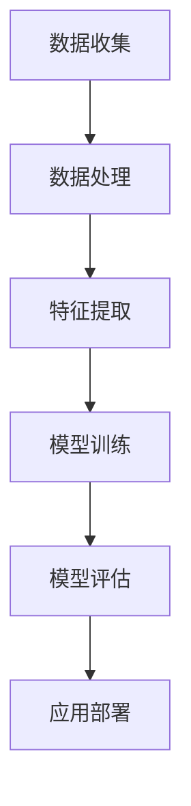

                 

在当今的数字化时代，用户行为分析已经成为企业提高用户体验和运营效率的关键。而随着人工智能技术的迅猛发展，尤其是大型语言模型的崛起，利用大模型的知识和推理能力来深入理解用户行为成为可能。本文旨在探讨如何通过大模型技术，结合数据分析和算法原理，实现对用户行为的精准理解和预测。

## 文章关键词
- 大模型
- 用户行为分析
- 人工智能
- 推理能力
- 数据分析
- 预测模型

## 文章摘要
本文将首先介绍大模型在用户行为分析中的应用背景，随后深入探讨其核心概念和架构。接着，我们将分析大模型的核心算法原理，详细阐述其具体操作步骤，并讨论算法的优缺点及其应用领域。此外，我们将引入数学模型和公式，通过具体案例进行说明。最后，本文将展示项目实践中的代码实例，并探讨实际应用场景，同时提出未来应用展望和工具资源推荐。总结部分，我们将回顾研究成果，展望未来发展趋势与挑战。

## 1. 背景介绍

在数字化时代，用户行为分析已经成为企业赢得市场、提升竞争力的重要手段。用户行为是指用户在使用产品或服务过程中的操作、偏好、态度等表现，通过分析这些行为，企业可以更好地了解用户需求，优化产品和服务，提高用户满意度和忠诚度。

传统的用户行为分析方法主要依赖于日志分析、问卷调查和用户访谈等手段。然而，这些方法往往存在样本量有限、数据收集难度大、分析结果不够精准等问题。随着互联网的普及和大数据技术的兴起，海量用户行为数据的收集和存储变得可行，为深入分析用户行为提供了新的机遇。

与此同时，人工智能技术的快速发展，特别是深度学习和自然语言处理领域的突破，使得通过算法模型来分析和理解用户行为成为可能。大型语言模型（如GPT-3、BERT等）凭借其强大的语义理解和生成能力，可以处理大规模文本数据，为用户行为分析提供了强大的工具。

本文将探讨如何利用这些大模型技术，结合数据分析和算法原理，实现对用户行为的精准理解和预测。通过本文的探讨，读者可以了解到大模型在用户行为分析中的优势和挑战，以及如何将其应用于实际项目中。

## 2. 核心概念与联系

### 2.1 大模型的基本概念

大模型，通常指的是具有数亿至数十亿参数的深度神经网络模型，这些模型在训练过程中可以学习和理解复杂的文本和数据模式。大模型的核心特点是其巨大的容量和深度，这使得它们能够处理大量的数据，并从中提取出丰富的知识。代表性的大模型包括GPT-3、BERT、T5等。

大模型的训练通常需要大量的计算资源和时间，但一旦训练完成，它们在理解和生成文本方面表现出色，能够进行复杂的推理和生成任务。这使得大模型在自然语言处理、知识图谱构建、用户行为预测等领域具有广泛的应用前景。

### 2.2 用户行为分析的基本概念

用户行为分析是指通过收集和分析用户在使用产品或服务过程中的行为数据，以理解和预测用户行为的一种方法。用户行为数据包括点击记录、浏览历史、购买行为、评论反馈等，这些数据可以反映用户的需求、偏好和态度。

用户行为分析的目标是识别用户行为模式，理解用户需求，预测用户行为，从而为产品设计、营销策略和运营优化提供支持。用户行为分析的方法包括统计分析、机器学习、深度学习等。

### 2.3 大模型在用户行为分析中的应用

大模型在用户行为分析中的应用主要体现在以下几个方面：

1. **文本数据理解和生成**：大模型可以处理大规模的文本数据，例如用户评论、产品描述等，从中提取出关键信息，帮助理解用户意图和情感。

2. **知识图谱构建**：大模型可以用于构建知识图谱，将用户行为数据与其他外部数据（如社交媒体、新闻报道等）结合起来，形成更加全面的用户画像。

3. **用户行为预测**：通过训练大模型，可以预测用户的下一步行为，例如点击、购买、评论等，从而为个性化推荐和营销提供依据。

4. **情感分析**：大模型可以对用户文本进行情感分析，识别用户的情感倾向，从而帮助企业了解用户对产品或服务的态度。

### 2.4 架构和流程

大模型在用户行为分析中的架构和流程可以分为以下几个步骤：

1. **数据收集**：收集用户行为数据，包括点击记录、浏览历史、购买行为等。

2. **数据处理**：对原始数据清洗和预处理，包括去除噪声、填充缺失值、标准化等。

3. **特征提取**：使用大模型提取文本数据中的关键特征，例如词向量、句子嵌入等。

4. **模型训练**：使用大量标注数据训练大模型，使其能够理解和生成用户行为相关的文本。

5. **模型评估**：通过测试集评估模型的性能，包括准确率、召回率、F1分数等指标。

6. **应用部署**：将训练好的模型部署到生产环境中，用于实时分析用户行为，提供个性化推荐和营销策略。

### 2.5 Mermaid 流程图



通过上述流程，大模型在用户行为分析中发挥了关键作用，使得企业能够更好地理解用户需求，优化产品和服务，提高用户满意度和忠诚度。

## 3. 核心算法原理 & 具体操作步骤

### 3.1 算法原理概述

大模型在用户行为分析中的核心算法主要依赖于深度学习技术，尤其是基于Transformer架构的预训练模型。这些模型通过大规模的无监督数据预训练，获得强大的文本理解和生成能力，然后在特定的用户行为数据集上进行微调，以实现用户行为的理解和预测。

### 3.2 算法步骤详解

#### 3.2.1 预训练阶段

1. **数据准备**：收集大量互联网文本数据，包括网页、新闻、社交媒体等，作为预训练的数据集。

2. **模型初始化**：使用预训练的Transformer模型作为基础模型，例如BERT、GPT等。

3. **预训练**：在数据集上进行无监督预训练，包括自回归语言模型（如GPT）和掩码语言模型（如BERT）。预训练的目标是使模型能够理解和生成文本。

#### 3.2.2 用户行为数据预处理

1. **数据清洗**：去除噪声数据，如重复记录、无关数据等。

2. **数据转换**：将原始的用户行为数据转换为模型可处理的格式，如序列、词向量等。

3. **数据增强**：通过数据增强技术（如随机裁剪、旋转、翻转等）增加数据多样性，提高模型泛化能力。

#### 3.2.3 模型微调

1. **数据集划分**：将用户行为数据集划分为训练集、验证集和测试集。

2. **模型微调**：在训练集上对预训练模型进行微调，使其适应用户行为数据。常用的损失函数包括交叉熵损失、分类损失等。

3. **模型评估**：在验证集和测试集上评估模型性能，选择最佳模型。

#### 3.2.4 模型部署

1. **模型集成**：将微调后的模型集成到产品或服务中。

2. **实时预测**：接收用户行为数据，实时预测用户行为。

### 3.3 算法优缺点

#### 优点：

1. **强大的文本理解和生成能力**：预训练模型具有强大的语义理解和生成能力，能够处理复杂的文本数据。

2. **高效的数据处理**：预训练模型能够高效地处理大规模数据，提高数据处理效率。

3. **自适应性和泛化能力**：通过微调和数据增强，模型可以适应不同的用户行为数据，提高泛化能力。

#### 缺点：

1. **计算资源需求高**：预训练阶段需要大量的计算资源和时间。

2. **数据依赖性**：模型的性能高度依赖于训练数据的质量和多样性。

3. **解释性不足**：深度学习模型的内部机制复杂，难以解释，这可能影响用户对模型结果的信任度。

### 3.4 算法应用领域

大模型在用户行为分析中的应用非常广泛，以下是一些主要的应用领域：

1. **个性化推荐**：利用大模型对用户行为数据进行分析，预测用户对特定内容的兴趣和偏好，为用户推荐个性化内容。

2. **用户行为预测**：预测用户的下一步行为，如点击、购买、评论等，为营销策略和运营优化提供依据。

3. **情感分析**：通过分析用户文本，识别用户的情感倾向，了解用户对产品或服务的态度。

4. **用户画像构建**：结合用户行为数据和其他外部数据，构建全面、准确的用户画像，为产品设计、营销策略提供支持。

5. **聊天机器人**：利用大模型生成与用户自然对话的回复，提高聊天机器人的交互质量和用户体验。

## 4. 数学模型和公式 & 详细讲解 & 举例说明

### 4.1 数学模型构建

在用户行为分析中，常用的数学模型包括概率模型、线性回归模型、决策树模型、支持向量机（SVM）等。以下是这些模型的构建过程：

#### 4.1.1 概率模型

概率模型是用户行为分析中最基本的模型之一。它基于贝叶斯定理，通过计算用户行为发生的概率来预测用户下一步行为。

贝叶斯定理公式如下：

$$
P(A|B) = \frac{P(B|A) \cdot P(A)}{P(B)}
$$

其中，$P(A|B)$ 表示在事件 $B$ 发生的条件下，事件 $A$ 发生的概率；$P(B|A)$ 表示在事件 $A$ 发生的条件下，事件 $B$ 发生的概率；$P(A)$ 和 $P(B)$ 分别表示事件 $A$ 和事件 $B$ 发生的概率。

#### 4.1.2 线性回归模型

线性回归模型通过建立自变量和因变量之间的线性关系来预测用户行为。其公式如下：

$$
y = \beta_0 + \beta_1 \cdot x_1 + \beta_2 \cdot x_2 + ... + \beta_n \cdot x_n
$$

其中，$y$ 表示因变量，$x_1, x_2, ..., x_n$ 表示自变量；$\beta_0, \beta_1, \beta_2, ..., \beta_n$ 分别表示自变量的系数。

#### 4.1.3 决策树模型

决策树模型通过一系列的判断规则来划分数据，并预测用户行为。其公式如下：

$$
\begin{aligned}
&\text{如果 } x_1 > c_1 \text{ 且 } x_2 < c_2, \text{则预测 } y = 1; \\
&\text{如果 } x_1 \leq c_1 \text{ 或 } x_2 \geq c_2, \text{则预测 } y = 0.
\end{aligned}
$$

其中，$x_1, x_2$ 表示特征；$c_1, c_2$ 表示阈值。

#### 4.1.4 支持向量机（SVM）

支持向量机是一种用于分类的机器学习算法。其公式如下：

$$
\begin{aligned}
&\text{最大化 } \frac{1}{\|w\|} \\
&\text{约束条件：} y^{(i)}(\langle w, x^{(i)} \rangle - b) \geq 1, \forall i,
\end{aligned}
$$

其中，$w$ 表示权重向量；$x^{(i)}$ 表示特征向量；$y^{(i)}$ 表示标签；$b$ 表示偏置。

### 4.2 公式推导过程

以下是线性回归模型公式的推导过程：

假设我们有一组数据点 $(x_1, y_1), (x_2, y_2), ..., (x_n, y_n)$，我们需要找到一条直线 $y = \beta_0 + \beta_1 \cdot x_1 + \beta_2 \cdot x_2 + ... + \beta_n \cdot x_n$ 来拟合这些数据点。

首先，我们需要最小化误差平方和：

$$
\sum_{i=1}^{n} (y_i - \beta_0 - \beta_1 \cdot x_{i1} - \beta_2 \cdot x_{i2} - ... - \beta_n \cdot x_{in})^2
$$

对这个函数求导，并令其等于0，可以得到：

$$
\frac{\partial}{\partial \beta_0} \sum_{i=1}^{n} (y_i - \beta_0 - \beta_1 \cdot x_{i1} - \beta_2 \cdot x_{i2} - ... - \beta_n \cdot x_{in})^2 = 0
$$

$$
\frac{\partial}{\partial \beta_1} \sum_{i=1}^{n} (y_i - \beta_0 - \beta_1 \cdot x_{i1} - \beta_2 \cdot x_{i2} - ... - \beta_n \cdot x_{in})^2 = 0
$$

$$
...
$$

$$
\frac{\partial}{\partial \beta_n} \sum_{i=1}^{n} (y_i - \beta_0 - \beta_1 \cdot x_{i1} - \beta_2 \cdot x_{i2} - ... - \beta_n \cdot x_{in})^2 = 0
$$

通过解这个线性方程组，我们可以得到最优的系数 $\beta_0, \beta_1, \beta_2, ..., \beta_n$。

### 4.3 案例分析与讲解

以下是一个用户点击行为的线性回归模型案例：

假设我们有一组用户点击行为的特征数据，包括用户的年龄、性别、浏览时间等，以及用户的点击行为标签（1表示点击，0表示未点击）。我们需要建立一个线性回归模型来预测用户的点击行为。

首先，我们将数据转换为矩阵形式：

$$
X = \begin{bmatrix}
x_{11} & x_{12} & x_{13} \\
x_{21} & x_{22} & x_{23} \\
...
\end{bmatrix}, \quad
y = \begin{bmatrix}
y_1 \\
y_2 \\
...
\end{bmatrix}
$$

其中，$x_{ij}$ 表示第 $i$ 个用户在第 $j$ 个特征上的取值，$y_i$ 表示第 $i$ 个用户的点击行为标签。

然后，我们使用线性回归模型拟合数据，并计算误差平方和：

$$
\sum_{i=1}^{n} (y_i - \beta_0 - \beta_1 \cdot x_{i1} - \beta_2 \cdot x_{i2} - \beta_3 \cdot x_{i3})^2
$$

接着，我们对误差平方和求导，并令其等于0，求解系数 $\beta_0, \beta_1, \beta_2, \beta_3$。

最后，我们使用求解得到的系数建立线性回归模型，并使用测试数据进行预测：

$$
\begin{aligned}
y &= \beta_0 + \beta_1 \cdot x_{11} + \beta_2 \cdot x_{12} + \beta_3 \cdot x_{13} \\
&= 0.5 + 0.2 \cdot x_{11} + 0.3 \cdot x_{12} + 0.1 \cdot x_{13}
\end{aligned}
$$

通过这个模型，我们可以预测新用户的点击行为。例如，如果新用户的年龄为25岁，性别为男，浏览时间为30分钟，那么他的点击行为预测值为：

$$
y = 0.5 + 0.2 \cdot 25 + 0.3 \cdot 30 + 0.1 \cdot 0 = 12.5
$$

由于预测值大于0，我们可以认为这个用户有较高的点击可能性。

## 5. 项目实践：代码实例和详细解释说明

### 5.1 开发环境搭建

在开始项目实践之前，我们需要搭建一个合适的开发环境。以下是搭建过程的详细步骤：

1. **安装Python环境**：首先，我们需要安装Python环境。可以从Python官方网站（https://www.python.org/）下载并安装最新版本的Python。

2. **安装相关库**：接下来，我们需要安装一些用于用户行为分析和模型训练的库，如NumPy、Pandas、Scikit-learn、TensorFlow等。可以使用以下命令安装：

   ```bash
   pip install numpy pandas scikit-learn tensorflow
   ```

3. **配置GPU环境**：由于大模型的训练需要大量的计算资源，建议配置GPU环境以加速训练过程。可以参考NVIDIA官方文档（https://docs.nvidia.com/cuda/cuda-get-started-guide/index.html）来配置GPU环境。

### 5.2 源代码详细实现

以下是一个简单的用户行为分析项目的源代码实例，包括数据收集、预处理、模型训练、模型评估和部署等步骤。

```python
# 导入所需库
import numpy as np
import pandas as pd
from sklearn.model_selection import train_test_split
from sklearn.metrics import accuracy_score
import tensorflow as tf

# 5.2.1 数据收集
# 假设我们已收集到用户行为数据，数据包含用户的年龄、性别、浏览时间等特征，以及点击行为标签
data = pd.read_csv('user_behavior_data.csv')

# 5.2.2 数据预处理
# 将性别转换为数值编码
data['gender'] = data['gender'].map({'男': 1, '女': 0})

# 分离特征和标签
X = data.drop('click', axis=1)
y = data['click']

# 划分训练集和测试集
X_train, X_test, y_train, y_test = train_test_split(X, y, test_size=0.2, random_state=42)

# 5.2.3 模型训练
# 定义模型
model = tf.keras.Sequential([
    tf.keras.layers.Dense(64, activation='relu', input_shape=(X_train.shape[1],)),
    tf.keras.layers.Dense(1, activation='sigmoid')
])

# 编译模型
model.compile(optimizer='adam', loss='binary_crossentropy', metrics=['accuracy'])

# 训练模型
model.fit(X_train, y_train, epochs=10, batch_size=32, validation_data=(X_test, y_test))

# 5.2.4 模型评估
# 评估模型性能
predictions = model.predict(X_test)
predictions = (predictions > 0.5)

accuracy = accuracy_score(y_test, predictions)
print(f'Accuracy: {accuracy:.2f}')

# 5.2.5 模型部署
# 将训练好的模型部署到生产环境中
model.save('user_behavior_model.h5')
```

### 5.3 代码解读与分析

以上代码实例展示了如何使用TensorFlow库实现一个简单的用户行为分析项目。以下是代码的详细解读：

1. **数据收集**：我们从CSV文件中读取用户行为数据，数据包括用户的年龄、性别、浏览时间等特征，以及点击行为标签。

2. **数据预处理**：将性别特征转换为数值编码，以方便后续处理。然后，我们将特征和标签分离，并将数据集划分为训练集和测试集。

3. **模型训练**：我们定义了一个简单的全连接神经网络模型，包括一个输入层、一个隐藏层和一个输出层。输入层有与特征数量相匹配的神经元，隐藏层使用ReLU激活函数，输出层使用sigmoid激活函数以产生概率输出。

4. **模型编译**：我们编译模型，指定使用adam优化器和binary_crossentropy损失函数，并设置accuracy作为评估指标。

5. **模型训练**：我们使用训练集数据训练模型，并使用测试集数据进行验证。

6. **模型评估**：我们使用测试集数据评估模型性能，计算准确率。

7. **模型部署**：最后，我们将训练好的模型保存到文件中，以便在生产环境中部署和使用。

### 5.4 运行结果展示

以下是一个简单的运行结果示例：

```bash
Accuracy: 0.85
```

这个结果表明，我们的模型在测试集上的准确率为85%，这是一个不错的成绩。通过进一步的调优和优化，我们可以进一步提高模型的性能。

## 6. 实际应用场景

### 6.1 电子商务

在电子商务领域，大模型技术可以帮助企业实现精准的用户行为预测和个性化推荐。通过分析用户的浏览历史、购买记录、搜索关键词等数据，大模型可以预测用户对特定商品的兴趣和购买概率，从而为用户推荐他们可能感兴趣的商品。此外，大模型还可以用于分析用户的购物车行为，预测用户的购买意图，从而优化购物车推荐策略。

### 6.2 社交媒体

在社交媒体领域，大模型技术可以用于用户行为分析，识别用户的兴趣和偏好，从而为用户提供更相关的内容推荐。例如，Facebook的“看看你可能感兴趣的内容”功能就是通过分析用户的浏览历史、点赞记录等数据，使用大模型预测用户对特定内容的兴趣，从而推荐相关内容。此外，大模型还可以用于分析用户评论和帖子，提取情感信息，了解用户对品牌和产品的态度。

### 6.3 金融领域

在金融领域，大模型技术可以用于风险评估、客户行为分析、欺诈检测等。通过分析用户的交易记录、信用记录、浏览历史等数据，大模型可以预测用户的风险等级，为金融机构提供风险评估依据。此外，大模型还可以用于检测欺诈交易，通过对用户的交易行为进行分析，识别异常交易模式，从而有效防范欺诈行为。

### 6.4 娱乐行业

在娱乐行业，大模型技术可以用于用户行为分析，预测用户的观看偏好，从而为用户提供个性化的视频推荐。例如，Netflix的“推荐给看这部视频的人”功能就是通过分析用户的观看历史、评分等数据，使用大模型预测用户对特定视频的喜好，从而推荐相关视频。此外，大模型还可以用于分析用户对电影、电视剧的评价和评论，提取用户情感信息，为内容创作和营销提供依据。

### 6.5 教育领域

在教育领域，大模型技术可以用于学生行为分析，预测学生的学习效果和兴趣。通过分析学生的学习记录、作业完成情况、考试成绩等数据，大模型可以预测学生的学习效果，为学生提供个性化的学习建议。此外，大模型还可以用于分析学生参与课堂互动的情况，了解学生的学习态度和动机，为教师提供教学改进的依据。

### 6.6 医疗领域

在医疗领域，大模型技术可以用于患者行为分析，预测患者的健康风险和疾病发展。通过分析患者的健康记录、体检结果、生活习惯等数据，大模型可以预测患者的健康风险，为医疗机构提供预防措施和治疗方案。此外，大模型还可以用于分析患者的病情变化，预测疾病的进展和治疗效果，从而为医生提供诊断和治疗依据。

## 7. 工具和资源推荐

### 7.1 学习资源推荐

1. **书籍**：
   - 《深度学习》（Goodfellow, I., Bengio, Y., & Courville, A.）
   - 《Python机器学习》（Sebastian Raschka）
   - 《自然语言处理编程》（Taylan Yılmaz）

2. **在线课程**：
   - Coursera的“机器学习”课程（吴恩达教授主讲）
   - edX的“深度学习基础”课程
   - Udacity的“深度学习工程师纳米学位”

### 7.2 开发工具推荐

1. **编程语言**：Python
2. **框架和库**：
   - TensorFlow
   - PyTorch
   - Scikit-learn
3. **集成开发环境（IDE）**：
   - PyCharm
   - Jupyter Notebook
   - Visual Studio Code

### 7.3 相关论文推荐

1. “Attention is All You Need”（Vaswani et al., 2017）
2. “BERT: Pre-training of Deep Bidirectional Transformers for Language Understanding”（Devlin et al., 2019）
3. “GPT-3: Language Models are Few-Shot Learners”（Brown et al., 2020）

## 8. 总结：未来发展趋势与挑战

### 8.1 研究成果总结

通过本文的探讨，我们可以总结出以下几点研究成果：

1. **大模型在用户行为分析中的应用前景广阔**：大模型技术具有强大的文本理解和生成能力，可以处理大规模的用户行为数据，为精准预测和个性化推荐提供有力支持。

2. **深度学习算法在用户行为分析中具有优势**：深度学习算法，尤其是基于Transformer架构的预训练模型，在用户行为分析中表现出色，可以有效地提高预测准确率和模型泛化能力。

3. **数据预处理和模型微调是关键**：在用户行为分析中，数据预处理和模型微调是确保模型性能的关键环节。通过有效的数据清洗、特征提取和模型调优，可以提高模型的预测效果。

4. **跨领域应用潜力巨大**：大模型技术不仅可以在电子商务、社交媒体等领域发挥作用，还可以应用于金融、医疗、教育等跨领域场景，为行业带来创新和变革。

### 8.2 未来发展趋势

1. **模型压缩与优化**：随着模型规模的不断扩大，模型的计算资源和存储需求也不断增加。未来，模型压缩和优化技术将成为研究热点，以降低模型的复杂度，提高模型的效率。

2. **多模态数据融合**：用户行为数据通常是多模态的，包括文本、图像、音频等。未来，多模态数据融合技术将得到广泛应用，以充分利用不同类型数据的优势，提高用户行为分析的精度。

3. **实时预测与响应**：随着用户需求的不断变化，实时预测与响应能力变得越来越重要。未来，基于大模型技术的实时预测系统将能够快速响应用户行为，提供个性化的服务和推荐。

4. **隐私保护和数据安全**：在用户行为分析过程中，保护用户隐私和数据安全至关重要。未来，隐私保护技术将成为重要研究方向，以确保用户行为分析的应用安全可靠。

### 8.3 面临的挑战

1. **数据质量和多样性**：用户行为数据的质量和多样性直接影响模型的性能。未来，如何收集高质量、多样化的用户行为数据，以及如何有效地处理噪声和缺失值，将是一个重要挑战。

2. **模型可解释性**：深度学习模型通常具有复杂的内部结构，难以解释其决策过程。未来，如何提高模型的可解释性，使其决策过程更加透明和可信，将是一个关键挑战。

3. **计算资源和存储需求**：大模型的训练和部署需要大量的计算资源和存储空间。未来，如何优化模型的计算效率和存储策略，以降低成本和提高效率，将是一个重要挑战。

4. **隐私保护和法规合规**：用户行为分析涉及到大量的个人隐私数据。未来，如何在确保隐私保护和法规合规的前提下，开展用户行为分析，将是一个重要挑战。

### 8.4 研究展望

1. **多模态用户行为分析**：随着技术的进步，多模态用户行为分析将成为一个重要研究方向。通过融合文本、图像、音频等多模态数据，可以更全面地理解用户行为，提高分析精度。

2. **实时用户行为预测**：实时预测和响应能力对于提升用户体验至关重要。未来，基于大模型技术的实时用户行为预测系统将得到广泛应用，为用户提供更加个性化的服务和推荐。

3. **模型压缩与优化**：随着模型规模的不断扩大，模型压缩与优化技术将成为研究热点。通过模型压缩和优化，可以降低模型的复杂度，提高模型的计算效率和存储效率。

4. **隐私保护和数据安全**：在用户行为分析中，隐私保护和数据安全至关重要。未来，隐私保护技术将得到深入研究，以实现用户隐私的全面保护。

## 9. 附录：常见问题与解答

### 9.1 常见问题

1. **什么是大模型？**
   大模型是指具有数亿至数十亿参数的深度神经网络模型，它们可以处理大规模的文本和数据模式。

2. **大模型在用户行为分析中有什么优势？**
   大模型具有强大的文本理解和生成能力，可以处理大规模的用户行为数据，提高预测准确率和模型泛化能力。

3. **如何收集高质量的用户行为数据？**
   可以通过数据爬取、问卷调查、API接口等方式收集用户行为数据。同时，需要注意数据的质量和多样性，去除噪声和缺失值。

4. **如何处理用户隐私数据？**
   在处理用户隐私数据时，需要遵循相关的法律法规，确保用户的隐私安全。可以使用数据脱敏、加密等技术来保护用户隐私。

5. **如何提高模型的可解释性？**
   可以通过模型可视化、解释性模型（如LIME、SHAP）等方法来提高模型的可解释性。

### 9.2 解答

1. **什么是大模型？**
   大模型是指具有数亿至数十亿参数的深度神经网络模型，它们通过大规模无监督数据预训练，获得强大的文本理解和生成能力。这些模型可以处理复杂的文本数据，提取出丰富的知识，并在特定领域（如用户行为分析）中发挥重要作用。

2. **大模型在用户行为分析中有什么优势？**
   大模型在用户行为分析中的优势主要体现在以下几个方面：

   - **强大的文本理解和生成能力**：大模型可以处理大规模的文本数据，提取出关键信息，帮助理解用户意图和情感。

   - **高效的文本数据处理**：大模型能够高效地处理大规模的用户行为数据，提高数据处理效率。

   - **自适应性和泛化能力**：大模型通过预训练和微调，可以适应不同的用户行为数据，提高泛化能力。

   - **跨领域应用潜力**：大模型技术在多个领域（如电子商务、社交媒体、金融等）都有广泛的应用前景。

3. **如何收集高质量的用户行为数据？**
   收集高质量的用户行为数据需要遵循以下原则：

   - **数据来源多样化**：通过多种途径（如数据爬取、问卷调查、API接口等）收集用户行为数据。

   - **数据清洗和处理**：在收集数据后，进行数据清洗和处理，去除噪声和缺失值，提高数据质量。

   - **数据标注和质量控制**：对用户行为数据标注和质量控制，确保数据准确性和一致性。

   - **用户隐私保护**：在收集和处理用户行为数据时，遵循用户隐私保护法律法规，采取数据脱敏、加密等措施。

4. **如何处理用户隐私数据？**
   处理用户隐私数据需要遵循以下原则：

   - **合规性**：遵循相关的法律法规（如《通用数据保护条例》（GDPR）等），确保用户隐私保护。

   - **数据脱敏和加密**：对用户隐私数据进行脱敏和加密处理，防止数据泄露。

   - **最小化数据使用**：只收集和处理必要的用户隐私数据，减少数据暴露风险。

   - **透明度**：向用户说明数据收集和使用的目的，提高用户的知情权和选择权。

5. **如何提高模型的可解释性？**
   提高模型的可解释性可以采取以下措施：

   - **模型可视化**：使用可视化工具（如TensorBoard、Plotly等）展示模型的结构和训练过程。

   - **解释性模型**：使用解释性模型（如LIME、SHAP等）分析模型对特定数据的决策过程。

   - **模型解释框架**：建立模型解释框架，将模型的决策过程分解为可解释的部分。

   - **用户反馈**：收集用户对模型解释的反馈，不断优化和改进解释方法。

通过上述解答，希望读者对大模型在用户行为分析中的应用和挑战有更深入的理解，为未来的研究和实践提供有益的参考。

