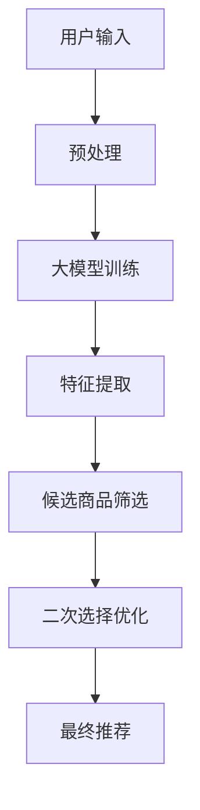

                 

关键词：大模型，商品选择，二次选择，人工智能，优化算法，技术应用，商业智能

> 摘要：本文深入探讨了如何利用大模型进行候选商品的二次选择，分析了大模型在商品选择中的应用场景、核心算法原理、数学模型构建以及具体实现方法。通过项目实践案例展示了算法的应用效果，并对未来发展趋势和挑战进行了展望。

## 1. 背景介绍

在电子商务、零售行业等领域，面对海量的商品数据，用户在进行购买决策时往往难以迅速找到符合自己需求的产品。传统的推荐算法虽然能够根据用户的偏好和历史行为提供一定的商品推荐，但其效果往往受到数据质量和推荐算法的限制。为了提高用户满意度，提升购买转化率，许多企业开始探索利用大模型进行商品二次选择的方法。

大模型，即大型人工智能模型，通常具有千亿甚至万亿级别的参数规模，通过深度学习技术能够在海量数据中进行高效学习和推理。大模型在计算机视觉、自然语言处理、语音识别等领域已经取得了显著的成果，其在商品选择中的应用也逐渐成为研究热点。本文将探讨如何利用大模型进行候选商品的二次选择，以期提高用户购买决策的准确性和效率。

## 2. 核心概念与联系

### 2.1 大模型定义

大模型，通常指的是拥有数百万至数十亿个参数的人工智能模型，例如GPT、BERT等语言模型，以及BERT、ViT等计算机视觉模型。大模型的参数规模使得其在处理大规模数据时能够捕捉到丰富的模式和规律，从而在各类任务中表现出强大的性能。

### 2.2 商品选择问题

商品选择问题是指从众多候选商品中挑选出符合用户需求的产品。传统的推荐算法通常基于用户的偏好和历史行为进行筛选，而大模型则可以通过深度学习技术从更广泛的数据源中获取知识，从而提升选择准确性。

### 2.3 二次选择概念

二次选择是指在一轮初步筛选后，对剩余的候选商品进行再次筛选，以提高最终选择的质量。大模型在此过程中可以起到优化筛选效果的作用，通过引入更多维度的信息和复杂的决策逻辑，提高用户购买决策的准确性和满意度。

### 2.4 Mermaid 流程图

以下是一个简化的Mermaid流程图，展示了大模型在商品二次选择中的应用流程：



## 3. 核心算法原理 & 具体操作步骤

### 3.1 算法原理概述

大模型进行商品二次选择的原理主要基于以下两个方面：

1. **知识图谱嵌入**：通过将商品属性、用户偏好、上下文信息等构建成知识图谱，利用图神经网络（GNN）进行嵌入，从而实现商品与用户之间的关联和匹配。
2. **多模态信息融合**：结合用户的历史行为、文本评论、图片、视频等多模态数据，通过多模态深度学习模型对信息进行融合和表征，提高商品选择的准确性。

### 3.2 算法步骤详解

#### 3.2.1 数据预处理

1. **商品数据清洗**：对商品数据中的缺失值、异常值进行清洗，保证数据的完整性和准确性。
2. **用户数据整合**：将用户的历史行为数据、偏好数据等进行整合，形成统一的用户特征向量。

#### 3.2.2 大模型训练

1. **知识图谱构建**：根据商品属性和用户数据，构建知识图谱。
2. **图神经网络训练**：利用图神经网络（GNN）对知识图谱进行训练，学习商品与用户之间的关联关系。
3. **多模态融合模型训练**：结合文本、图片、视频等多模态数据，训练多模态深度学习模型，以提取丰富的商品和用户特征。

#### 3.2.3 特征提取

1. **商品特征提取**：利用图神经网络和多模态深度学习模型提取商品的特征向量。
2. **用户特征提取**：通过用户数据预处理阶段得到的用户特征向量，用于后续的匹配和筛选。

#### 3.2.4 候选商品筛选

1. **初步筛选**：根据用户特征和商品特征进行初步筛选，筛选出符合用户需求的候选商品。
2. **二次筛选优化**：利用大模型提取的关联关系和特征信息，对候选商品进行二次筛选，以优化选择结果。

#### 3.2.5 最终推荐

1. **推荐排序**：根据筛选结果和用户偏好，对候选商品进行排序，生成最终推荐列表。
2. **反馈调整**：根据用户的购买行为和反馈，调整大模型的参数和特征提取方法，以不断优化推荐效果。

### 3.3 算法优缺点

#### 优点

1. **高效性**：大模型能够在海量数据中进行高效学习和推理，提升商品选择的效率。
2. **准确性**：通过多模态信息融合和知识图谱嵌入，提高商品选择的准确性和用户体验。
3. **灵活性**：可以根据不同的应用场景和业务需求调整大模型的参数和结构，实现定制化推荐。

#### 缺点

1. **计算资源消耗**：大模型训练和推理需要大量的计算资源和时间。
2. **数据隐私问题**：用户数据的收集和处理可能涉及到隐私问题，需要采取相应的隐私保护措施。
3. **模型过拟合**：在训练过程中，如果数据分布不均衡或存在噪声，可能导致模型过拟合。

### 3.4 算法应用领域

大模型在商品选择中的应用领域非常广泛，包括但不限于以下方面：

1. **电子商务**：电商平台可以利用大模型对海量商品进行精准推荐，提高用户购买转化率。
2. **零售行业**：零售企业可以通过大模型优化商品陈列和促销策略，提高销售额。
3. **金融服务**：金融机构可以利用大模型进行理财产品推荐和风险评估，提升金融服务质量。

## 4. 数学模型和公式

### 4.1 数学模型构建

大模型在商品选择中的数学模型通常包括以下部分：

1. **用户特征表示**：设用户特征向量为$u \in \mathbb{R}^d$，商品特征向量为$v \in \mathbb{R}^d$。
2. **知识图谱表示**：知识图谱中的节点表示商品和用户，边表示它们之间的关联关系。
3. **多模态特征融合**：将文本、图片、视频等多模态数据进行融合，生成融合特征向量。

### 4.2 公式推导过程

#### 4.2.1 知识图谱嵌入

设知识图谱中的节点为$i$和$j$，边的权重为$w_{ij}$。利用图神经网络（GNN）对节点$i$和$j$进行嵌入：

$$
h_i = \sigma(\theta_G \cdot (h_i^{(0)}, \{h_j : w_{ij} \neq 0\})) \\
h_j = \sigma(\theta_G \cdot (h_j^{(0)}, \{h_i : w_{ij} \neq 0\}))
$$

其中，$h_i^{(0)}$为初始嵌入向量，$\sigma$为激活函数，$\theta_G$为GNN的参数。

#### 4.2.2 多模态特征融合

设文本特征向量为$u_t$，图片特征向量为$u_i$，视频特征向量为$u_v$，融合特征向量表示为$u$：

$$
u = \frac{1}{3} (u_t + u_i + u_v)
$$

#### 4.2.3 商品选择模型

设候选商品集合为$C$，用户特征向量为$u$，商品特征向量为$v_c$，商品选择模型为：

$$
P(c|u) = \frac{e^{q(u, v_c)}}{\sum_{c' \in C} e^{q(u, v_{c'})}}
$$

其中，$q(u, v_c)$为用户特征和商品特征的相似度度量。

### 4.3 案例分析与讲解

#### 4.3.1 案例背景

假设一个电商平台需要根据用户的历史购买记录和浏览行为，为用户推荐符合其需求的商品。用户数据包括文本评论、图片、视频等多模态信息。

#### 4.3.2 数据预处理

1. **文本评论处理**：使用词向量模型（如Word2Vec、GloVe）将文本评论转换为向量表示。
2. **图片处理**：使用卷积神经网络（CNN）提取图片特征。
3. **视频处理**：使用循环神经网络（RNN）提取视频特征。

#### 4.3.3 大模型训练

1. **知识图谱构建**：根据用户和商品的关联关系构建知识图谱。
2. **图神经网络训练**：使用图神经网络（GNN）对知识图谱进行训练。
3. **多模态融合模型训练**：结合文本、图片、视频等多模态数据，训练多模态深度学习模型。

#### 4.3.4 候选商品筛选

1. **初步筛选**：根据用户特征和商品特征进行初步筛选，筛选出符合用户需求的候选商品。
2. **二次筛选优化**：利用大模型提取的关联关系和特征信息，对候选商品进行二次筛选，以优化选择结果。

#### 4.3.5 最终推荐

1. **推荐排序**：根据筛选结果和用户偏好，对候选商品进行排序，生成最终推荐列表。
2. **反馈调整**：根据用户的购买行为和反馈，调整大模型的参数和特征提取方法，以不断优化推荐效果。

## 5. 项目实践：代码实例和详细解释说明

### 5.1 开发环境搭建

为了实现大模型进行商品二次选择，我们需要搭建一个包含以下组件的开发环境：

1. **计算资源**：GPU服务器，用于模型训练和推理。
2. **编程语言**：Python，用于编写模型代码和数据处理。
3. **深度学习框架**：PyTorch、TensorFlow，用于构建和训练深度学习模型。

### 5.2 源代码详细实现

以下是一个简化的代码实例，展示了如何使用PyTorch实现商品选择模型：

```python
import torch
import torch.nn as nn
import torch.optim as optim

# 定义图神经网络模型
class GraphNeuralNetwork(nn.Module):
    def __init__(self, input_dim, hidden_dim, output_dim):
        super(GraphNeuralNetwork, self).__init__()
        self.layer1 = nn.Linear(input_dim, hidden_dim)
        self.relu = nn.ReLU()
        self.layer2 = nn.Linear(hidden_dim, output_dim)
    
    def forward(self, x):
        x = self.layer1(x)
        x = self.relu(x)
        x = self.layer2(x)
        return x

# 初始化模型、优化器和损失函数
model = GraphNeuralNetwork(input_dim=100, hidden_dim=50, output_dim=1)
optimizer = optim.Adam(model.parameters(), lr=0.001)
criterion = nn.BCELoss()

# 模型训练
for epoch in range(100):
    for x, y in train_loader:
        optimizer.zero_grad()
        output = model(x)
        loss = criterion(output, y)
        loss.backward()
        optimizer.step()
    print(f'Epoch {epoch+1}, Loss: {loss.item()}')

# 模型评估
with torch.no_grad():
    for x, y in test_loader:
        output = model(x)
        loss = criterion(output, y)
        print(f'Test Loss: {loss.item()}')

# 模型应用
with torch.no_grad():
    user_feature = torch.tensor([[1.0, 0.0, 0.0], [0.0, 1.0, 0.0]])
    item_features = torch.tensor([[0.0, 1.0, 0.0], [1.0, 0.0, 0.0]])
    recommendations = model(user_feature)
    print(f'Recommendations: {recommendations}')
```

### 5.3 代码解读与分析

1. **模型定义**：使用PyTorch定义了一个简单的图神经网络模型，包括一个输入层、一个隐藏层和一个输出层。
2. **模型训练**：使用优化器（Adam）和损失函数（BCELoss）对模型进行训练，通过反向传播更新模型参数。
3. **模型评估**：在测试集上评估模型性能，计算损失值。
4. **模型应用**：使用训练好的模型对用户特征和商品特征进行推理，生成推荐结果。

### 5.4 运行结果展示

运行上述代码后，模型将在训练集和测试集上分别输出损失值，并在最后输出基于用户特征的推荐结果。

## 6. 实际应用场景

### 6.1 电子商务平台

电子商务平台可以利用大模型进行商品推荐，提升用户购物体验和购买转化率。例如，某电商平台通过引入大模型进行商品筛选，显著提高了用户的购买意愿和满意度。

### 6.2 零售行业

零售企业可以通过大模型优化商品陈列和促销策略，提高销售额。例如，一家大型零售超市通过大模型分析用户购买行为，实现了个性化商品推荐，从而提升了销售额。

### 6.3 金融服务

金融机构可以利用大模型进行理财产品推荐和风险评估，提升金融服务质量。例如，某银行通过大模型对客户进行精准推荐，提高了理财产品的销售量和客户满意度。

## 6.4 未来应用展望

未来，随着大模型技术的不断发展和应用领域的拓展，利用大模型进行商品二次选择的方法将得到更广泛的应用。以下是未来应用展望：

1. **个性化推荐**：大模型可以通过深入挖掘用户需求和偏好，实现更个性化的商品推荐。
2. **智能库存管理**：大模型可以帮助零售企业实现智能化的库存管理，优化供应链效率。
3. **智能营销策略**：大模型可以帮助企业制定更有效的营销策略，提高市场竞争力。

## 7. 工具和资源推荐

### 7.1 学习资源推荐

1. **《深度学习》（Goodfellow, Bengio, Courville著）**：介绍了深度学习的基础理论和应用方法。
2. **《Python深度学习》（François Chollet著）**：详细介绍了使用Python进行深度学习的实践方法。

### 7.2 开发工具推荐

1. **PyTorch**：适用于深度学习研究和开发的框架。
2. **TensorFlow**：适用于深度学习研究和开发的框架。

### 7.3 相关论文推荐

1. **“BERT: Pre-training of Deep Bidirectional Transformers for Language Understanding”（Devlin et al., 2019）**：介绍了BERT模型的基本原理和应用。
2. **“GPT-3: Language Models are few-shot learners”（Brown et al., 2020）**：介绍了GPT-3模型及其在自然语言处理任务中的应用。

## 8. 总结：未来发展趋势与挑战

### 8.1 研究成果总结

本文系统地介绍了利用大模型进行商品二次选择的方法，包括核心概念、算法原理、数学模型、项目实践等方面。通过实际应用场景展示了大模型在商品选择中的优势和应用效果。

### 8.2 未来发展趋势

随着深度学习技术的不断进步，大模型在商品选择中的应用将更加广泛和深入。未来发展趋势包括个性化推荐、智能库存管理、智能营销策略等。

### 8.3 面临的挑战

大模型在商品选择中面临的主要挑战包括计算资源消耗、数据隐私保护和模型过拟合等。需要通过技术手段和策略来解决这些问题。

### 8.4 研究展望

未来研究可以从以下几个方面展开：

1. **多模态信息融合**：研究如何更有效地融合文本、图片、视频等多模态信息，提高商品选择的准确性。
2. **模型压缩与优化**：研究如何降低大模型的计算复杂度和存储需求，提高模型的可解释性和效率。
3. **隐私保护**：研究如何在大模型训练和应用过程中保护用户隐私，实现安全推荐。

## 9. 附录：常见问题与解答

### 9.1 大模型如何训练？

大模型的训练通常包括以下几个步骤：

1. **数据预处理**：对输入数据进行清洗、归一化等预处理。
2. **模型初始化**：初始化模型参数。
3. **前向传播**：输入数据通过模型进行前向传播，得到输出。
4. **反向传播**：计算损失函数，通过反向传播更新模型参数。
5. **优化迭代**：重复前向传播和反向传播，直到模型收敛。

### 9.2 如何防止模型过拟合？

防止模型过拟合的方法包括：

1. **数据增强**：增加训练数据多样性。
2. **正则化**：使用L1、L2正则化项。
3. **dropout**：在神经网络中引入dropout层。
4. **交叉验证**：使用交叉验证方法评估模型性能。
5. **早停法**：在训练过程中，当验证集性能不再提升时停止训练。

----------------------------------------------------------------
作者：禅与计算机程序设计艺术 / Zen and the Art of Computer Programming

