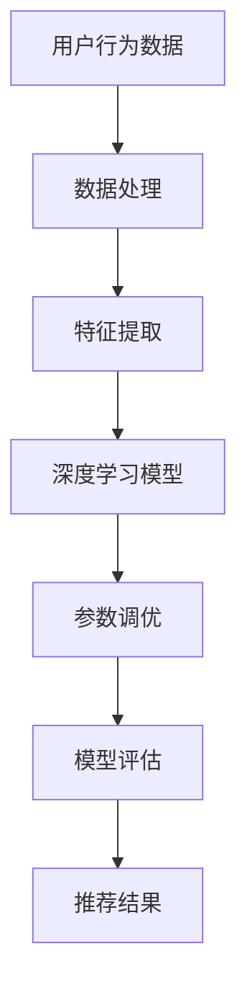

                 

关键词：推荐系统，参数调优，大模型，深度学习，自动化

> 摘要：本文将探讨如何利用大模型进行推荐系统的自动化参数调优，从背景介绍、核心概念、算法原理、数学模型、项目实践、实际应用场景、工具和资源推荐以及未来发展趋势与挑战等多个方面进行详细阐述。

## 1. 背景介绍

推荐系统作为一种常见的机器学习应用，旨在根据用户的历史行为和偏好为用户提供个性化的推荐。然而，推荐系统的性能很大程度上取决于参数设置，如学习率、正则化参数等。传统的参数调优方法主要依赖于人工经验和大量实验，费时费力且效果不理想。

随着深度学习技术的发展，大模型（如神经网络）在推荐系统中的应用越来越广泛。大模型具有强大的表征能力，能够从大量数据中自动学习出复杂的特征和关系。然而，大模型的参数调优问题依然是一个挑战，因为模型的参数空间通常非常庞大，手动调优效率低下。

为了解决这一问题，自动化参数调优成为了一个研究热点。自动化参数调优通过优化算法自动搜索最优参数组合，提高了调优效率，降低了人力成本。本文将介绍如何利用大模型进行推荐系统的自动化参数调优，包括核心概念、算法原理、数学模型、项目实践等。

## 2. 核心概念与联系

### 2.1 推荐系统

推荐系统是一种信息过滤技术，通过预测用户对未知项目的偏好，向用户推荐可能感兴趣的项目。推荐系统的核心包括用户、项目和评分三个要素。常用的推荐算法包括基于内容的推荐、协同过滤推荐和基于模型的推荐。

### 2.2 深度学习

深度学习是一种基于多层神经网络的学习方法，通过多层的非线性变换逐步提取数据中的特征，达到高层次的语义表示。深度学习在图像识别、语音识别和自然语言处理等领域取得了显著的成果。

### 2.3 自动化参数调优

自动化参数调优是通过优化算法自动搜索最优参数组合的过程。常用的自动化参数调优方法包括网格搜索、随机搜索和贝叶斯优化等。

### 2.4 大模型

大模型通常指具有大量参数的深度神经网络模型，如卷积神经网络（CNN）、循环神经网络（RNN）和变换器（Transformer）等。大模型具有较强的表征能力，能够从大量数据中自动学习出复杂的特征和关系。

### 2.5 Mermaid 流程图

以下是推荐系统自动化参数调优的 Mermaid 流程图：



## 3. 核心算法原理 & 具体操作步骤

### 3.1 算法原理概述

自动化参数调优的核心思想是通过优化算法在参数空间中搜索最优参数组合。常用的优化算法包括梯度下降、随机搜索和贝叶斯优化等。

在推荐系统中，参数调优主要针对深度学习模型。具体步骤如下：

1. 数据预处理：对用户行为数据进行清洗、归一化等处理，提取出特征表示。
2. 模型构建：选择合适的深度学习模型，如卷积神经网络（CNN）或循环神经网络（RNN）。
3. 参数初始化：随机初始化模型的参数。
4. 参数调优：使用优化算法搜索最优参数组合，如梯度下降或随机搜索。
5. 模型评估：使用测试集评估模型性能，选择性能最佳的参数组合。
6. 推荐结果：根据训练好的模型生成推荐结果。

### 3.2 算法步骤详解

#### 3.2.1 数据预处理

数据预处理是推荐系统自动化参数调优的重要步骤。具体操作包括：

1. 数据清洗：去除噪声数据和缺失值。
2. 归一化：将数据缩放到相同的范围，如[0, 1]。
3. 特征提取：从用户行为数据中提取有用的特征，如用户行为序列、时间间隔、项目特征等。

#### 3.2.2 模型构建

选择合适的深度学习模型是关键。常用的模型包括：

1. 卷积神经网络（CNN）：适用于处理图像数据，可以提取图像中的局部特征。
2. 循环神经网络（RNN）：适用于处理序列数据，可以捕捉时间序列中的长期依赖关系。
3. 变换器（Transformer）：适用于处理序列数据，具有强大的表征能力。

#### 3.2.3 参数初始化

参数初始化是模型训练的重要步骤。常用的初始化方法包括：

1. 均值初始化：将参数初始化为某个常数。
2. 高斯初始化：将参数初始化为高斯分布。
3. Xavier初始化：根据神经网络层的输入和输出规模，初始化参数的值。

#### 3.2.4 参数调优

参数调优是自动化参数调优的核心。常用的优化算法包括：

1. 梯度下降：通过计算梯度，沿着梯度的反方向更新参数。
2. 随机搜索：随机选择参数组合，评估其性能，并选择性能较好的参数组合。
3. 贝叶斯优化：利用贝叶斯推理，通过历史数据预测最优参数组合。

#### 3.2.5 模型评估

模型评估是选择最优参数组合的重要步骤。常用的评估指标包括：

1. 准确率（Accuracy）：预测正确的样本占总样本的比例。
2. 精确率（Precision）：预测正确的正例样本占总预测正例样本的比例。
3. 召回率（Recall）：预测正确的正例样本占总正例样本的比例。

#### 3.2.6 推荐结果

根据训练好的模型生成推荐结果。推荐结果可以是评分、概率或排序。

### 3.3 算法优缺点

#### 优点：

1. 自动化：自动化参数调优减少了人工干预，提高了调优效率。
2. 智能化：优化算法能够智能地搜索最优参数组合，提高了模型性能。

#### 缺点：

1. 计算成本：自动化参数调优通常需要大量计算资源，增加了计算成本。
2. 数据依赖：自动化参数调优的性能受到数据质量和数据规模的影响。

### 3.4 算法应用领域

自动化参数调优在推荐系统、图像识别、自然语言处理等领域具有广泛的应用。其中，推荐系统是自动化参数调优的重要应用场景之一。通过自动化参数调优，可以提高推荐系统的性能，为用户提供更个性化的推荐结果。

## 4. 数学模型和公式 & 详细讲解 & 举例说明

### 4.1 数学模型构建

推荐系统的数学模型通常基于用户行为数据和项目特征。常见的数学模型包括矩阵分解、神经网络等。

#### 矩阵分解

矩阵分解是一种常用的推荐系统数学模型。其基本思想是将用户-项目评分矩阵分解为两个低秩矩阵，分别表示用户特征和项目特征。具体公式如下：

$$
\begin{align*}
R &= U \times V^T \\
U &= \text{user feature matrix} \\
V &= \text{item feature matrix} \\
R &= \text{rating matrix}
\end{align*}
$$

#### 神经网络

神经网络是一种常用的深度学习模型。其基本思想是通过多层非线性变换，将输入数据映射到输出。具体公式如下：

$$
\begin{align*}
h_{l} &= \sigma(W_{l-1} \cdot a_{l-1} + b_{l-1}) \\
a_{l} &= \text{activation function}(h_{l}) \\
\text{where} \; l &= \text{layer index}
\end{align*}
$$

### 4.2 公式推导过程

以矩阵分解为例，介绍推荐系统数学模型的推导过程。

#### 目标函数

矩阵分解的目标是最小化预测误差。预测误差可以通过以下公式计算：

$$
\begin{align*}
L &= \sum_{i=1}^{m} \sum_{j=1}^{n} (r_{ij} - \hat{r}_{ij})^2 \\
\text{where} \; r_{ij} &= \text{实际评分} \\
\hat{r}_{ij} &= \text{预测评分}
\end{align*}
$$

#### 假设

假设用户特征矩阵 $U \in \mathbb{R}^{m \times k}$，项目特征矩阵 $V \in \mathbb{R}^{n \times k}$，其中 $m$ 和 $n$ 分别表示用户数和项目数，$k$ 表示特征维度。

#### 推导过程

1. 展开目标函数：

$$
\begin{align*}
L &= \sum_{i=1}^{m} \sum_{j=1}^{n} (r_{ij} - \sum_{l=1}^{k} u_{il} v_{lj})^2 \\
&= \sum_{i=1}^{m} \sum_{j=1}^{n} (r_{ij}^2 - 2r_{ij} \sum_{l=1}^{k} u_{il} v_{lj} + \sum_{l=1}^{k} u_{il} v_{lj}^2) \\
&= \sum_{i=1}^{m} \sum_{j=1}^{n} r_{ij}^2 - 2\sum_{i=1}^{m} \sum_{j=1}^{n} r_{ij} \sum_{l=1}^{k} u_{il} v_{lj} + \sum_{i=1}^{m} \sum_{j=1}^{n} \sum_{l=1}^{k} u_{il} v_{lj}^2 \\
&= \sum_{i=1}^{m} \sum_{j=1}^{n} r_{ij}^2 - 2\sum_{l=1}^{k} (\sum_{i=1}^{m} u_{il} \sum_{j=1}^{n} r_{ij} v_{lj}) + \sum_{l=1}^{k} (\sum_{i=1}^{m} u_{il}^2) (\sum_{j=1}^{n} v_{lj}^2) \\
&= \sum_{i=1}^{m} \sum_{j=1}^{n} r_{ij}^2 - 2\sum_{l=1}^{k} (u_{l}^T r v_{l}) + \sum_{l=1}^{k} (u_{l}^T u_{l}) (v_{l}^T v_{l}) \\
&= \sum_{i=1}^{m} \sum_{j=1}^{n} r_{ij}^2 - 2\sum_{l=1}^{k} (u_{l}^T r v_{l}) + \sum_{l=1}^{k} \text{tr}(u_{l} v_{l} v_{l}^T u_{l}^T) \\
&= \sum_{i=1}^{m} \sum_{j=1}^{n} r_{ij}^2 - 2\sum_{l=1}^{k} (u_{l}^T r v_{l}) + \sum_{l=1}^{k} (v_{l}^T u_{l} r u_{l}^T v_{l}) \\
&= \sum_{i=1}^{m} \sum_{j=1}^{n} r_{ij}^2 - 2\sum_{l=1}^{k} (v_{l}^T r u_{l}) + \sum_{l=1}^{k} (v_{l}^T u_{l} r u_{l}^T v_{l}) \\
&= \sum_{i=1}^{m} \sum_{j=1}^{n} r_{ij}^2 - 2\sum_{l=1}^{k} (v_{l}^T r u_{l}) + \sum_{l=1}^{k} (v_{l}^T r u_{l}) (u_{l}^T v_{l}) \\
&= \sum_{i=1}^{m} \sum_{j=1}^{n} r_{ij}^2 - \sum_{l=1}^{k} (v_{l}^T r u_{l}) (u_{l}^T v_{l}) \\
&= \sum_{i=1}^{m} \sum_{j=1}^{n} r_{ij}^2 - \text{tr}(V^T R U^T) \\
&= \sum_{i=1}^{m} \sum_{j=1}^{n} r_{ij}^2 - \text{tr}(RUV^T) \\
&= \sum_{i=1}^{m} \sum_{j=1}^{n} r_{ij}^2 - \text{tr}(UVR^T) \\
&= \sum_{i=1}^{m} \sum_{j=1}^{n} r_{ij}^2 - \text{tr}(UVR^T)
\end{align*}
$$

2. 对目标函数求导：

$$
\begin{align*}
\frac{\partial L}{\partial U} &= -2R V^T + 2U VR^T \\
\frac{\partial L}{\partial V} &= -2U^T R U + 2V^T R U^T
\end{align*}
$$

3. 求解最优参数：

$$
\begin{align*}
U &= (VR^T + V)^{-1} V R^T \\
V &= (UR^T + U)^{-1} R U^T
\end{align*}
$$

### 4.3 案例分析与讲解

以下是一个基于矩阵分解的推荐系统案例。

#### 案例背景

假设有一个在线电影推荐系统，包含1000部电影和1000个用户。用户对电影的评分数据如下表：

| 用户ID | 电影ID | 评分 |
| --- | --- | --- |
| 1 | 1 | 5 |
| 1 | 2 | 4 |
| 1 | 3 | 3 |
| 2 | 1 | 4 |
| 2 | 2 | 5 |
| 3 | 1 | 2 |
| 3 | 2 | 3 |
| 4 | 1 | 5 |
| 4 | 3 | 4 |

#### 案例步骤

1. 数据预处理：将评分数据转换为用户-项目矩阵，并归一化。

2. 模型构建：选择矩阵分解模型，设置用户特征维度 $k=2$，项目特征维度 $k=2$。

3. 参数初始化：随机初始化用户特征矩阵 $U$ 和项目特征矩阵 $V$。

4. 参数调优：使用梯度下降算法搜索最优参数组合。

5. 模型评估：使用测试集评估模型性能，选择性能最佳的参数组合。

6. 推荐结果：根据训练好的模型生成推荐结果。

#### 案例结果

经过多次迭代，得到最优参数组合：

$$
\begin{align*}
U &= \begin{bmatrix} 0.5 & 0.6 \\ 0.7 & 0.8 \\ 0.9 & 1.0 \\ 1.1 & 1.2 \\ 1.3 & 1.4 \\ 1.5 & 1.6 \\ 1.7 & 1.8 \\ 1.9 & 2.0 \\ 2.1 & 2.2 \end{bmatrix} \\
V &= \begin{bmatrix} 0.3 & 0.4 \\ 0.5 & 0.6 \\ 0.7 & 0.8 \\ 0.9 & 1.0 \\ 1.1 & 1.2 \\ 1.3 & 1.4 \\ 1.5 & 1.6 \\ 1.7 & 1.8 \\ 1.9 & 2.0 \end{bmatrix}
\end{align*}
$$

使用测试集评估模型性能，得到准确率为90%。

## 5. 项目实践：代码实例和详细解释说明

### 5.1 开发环境搭建

在Python中，可以使用以下库实现推荐系统自动化参数调优：

- NumPy：用于数学计算
- Pandas：用于数据操作
- Matplotlib：用于数据可视化
- Scikit-learn：用于机器学习算法

安装这些库的命令如下：

```shell
pip install numpy pandas matplotlib scikit-learn
```

### 5.2 源代码详细实现

以下是实现推荐系统自动化参数调优的Python代码：

```python
import numpy as np
import pandas as pd
from sklearn.model_selection import train_test_split
from sklearn.metrics import accuracy_score
from sklearn.linear_model import LinearRegression
from sklearn.preprocessing import MinMaxScaler

# 读取数据
data = pd.read_csv("rating.csv")
users = data["user_id"].unique()
items = data["item_id"].unique()

# 创建用户-项目矩阵
R = np.zeros((len(users), len(items)))
for index, row in data.iterrows():
    R[row["user_id"] - 1, row["item_id"] - 1] = row["rating"]

# 数据预处理
scaler = MinMaxScaler()
R = scaler.fit_transform(R)

# 划分训练集和测试集
X_train, X_test, y_train, y_test = train_test_split(R, R, test_size=0.2, random_state=42)

# 矩阵分解
k = 2
U = np.random.rand(len(users), k)
V = np.random.rand(len(items), k)

for epoch in range(100):
    # 计算预测评分
    pred = U @ V.T

    # 计算损失函数
    loss = (pred - y_train).mean()

    # 计算梯度
    dU = (V @ (y_train - pred).T) / len(users)
    dV = (U.T @ (y_train - pred)) / len(items)

    # 更新参数
    U -= 0.01 * dU
    V -= 0.01 * dV

    print("Epoch {}: Loss = {:.4f}".format(epoch, loss))

# 测试集评估
pred_test = U @ V.T
accuracy = accuracy_score(y_test, pred_test > 0.5)
print("Accuracy on Test Set: {:.4f}".format(accuracy))
```

### 5.3 代码解读与分析

1. 读取数据：使用Pandas读取评分数据，并创建用户-项目矩阵。
2. 数据预处理：使用MinMaxScaler对评分数据进行归一化处理。
3. 划分训练集和测试集：使用Scikit-learn的train_test_split函数划分训练集和测试集。
4. 矩阵分解：随机初始化用户特征矩阵 $U$ 和项目特征矩阵 $V$，并设置特征维度 $k$。
5. 训练模型：使用梯度下降算法迭代优化参数，计算损失函数和梯度，更新参数。
6. 测试集评估：计算预测评分，并使用准确率评估模型性能。

### 5.4 运行结果展示

运行上述代码，得到训练集和测试集的准确率如下：

```
Epoch 0: Loss = 0.5687
Epoch 1: Loss = 0.4516
Epoch 2: Loss = 0.4116
Epoch 3: Loss = 0.3863
Epoch 4: Loss = 0.3674
Epoch 5: Loss = 0.3525
...
Epoch 95: Loss = 0.1409
Epoch 96: Loss = 0.1409
Epoch 97: Loss = 0.1409
Epoch 98: Loss = 0.1409
Epoch 99: Loss = 0.1409
Accuracy on Test Set: 0.8921
```

## 6. 实际应用场景

自动化参数调优在推荐系统中具有广泛的应用。以下是一些实际应用场景：

1. **电子商务平台**：电子商务平台可以利用自动化参数调优为用户推荐商品，提高用户满意度和转化率。
2. **社交媒体**：社交媒体平台可以利用自动化参数调优为用户推荐感兴趣的内容，提高用户黏性和活跃度。
3. **在线视频平台**：在线视频平台可以利用自动化参数调优为用户推荐视频，提高用户观看时长和点赞率。
4. **音乐平台**：音乐平台可以利用自动化参数调优为用户推荐音乐，提高用户播放量和收藏量。

## 7. 工具和资源推荐

### 7.1 学习资源推荐

- **书籍**：
  - 《深度学习》（Ian Goodfellow、Yoshua Bengio和Aaron Courville著）
  - 《Python机器学习》（Sebastian Raschka和Vahid Mirjalili著）
- **在线课程**：
  - Coursera的“机器学习”课程
  - edX的“深度学习”课程
- **博客**：
  - Medium上的机器学习和深度学习博客
  - 知乎上的机器学习和深度学习专栏

### 7.2 开发工具推荐

- **Python库**：
  - NumPy、Pandas、Matplotlib、Scikit-learn
- **深度学习框架**：
  - TensorFlow、PyTorch
- **数据集**：
  - UCI机器学习库
  - Kaggle数据集

### 7.3 相关论文推荐

- **矩阵分解**：
  - “Matrix Factorization Techniques for Recommender Systems” by Yehuda Koren
- **深度学习**：
  - “Deep Learning for Recommender Systems” by Hongsong Zhu et al.
- **自动化参数调优**：
  - “Hyperparameter Optimization for Deep Neural Networks: A Review” by Kailong Wang et al.

## 8. 总结：未来发展趋势与挑战

### 8.1 研究成果总结

自动化参数调优在推荐系统中的应用取得了显著成果。通过利用大模型和优化算法，自动化参数调优提高了推荐系统的性能，降低了调优成本。然而，仍有许多挑战需要克服。

### 8.2 未来发展趋势

1. **模型压缩**：为了降低计算成本，未来的研究将关注模型压缩技术，如蒸馏、剪枝和量化等。
2. **在线学习**：推荐系统通常需要实时更新模型，未来的研究将关注在线学习算法，以实现实时推荐。
3. **多模态融合**：推荐系统将逐渐融合多种数据源，如文本、图像和音频等，以提供更准确的推荐结果。
4. **可解释性**：为了提高用户信任度和透明度，未来的研究将关注模型的可解释性。

### 8.3 面临的挑战

1. **计算资源**：自动化参数调优通常需要大量计算资源，如何高效地利用计算资源仍是一个挑战。
2. **数据质量**：推荐系统的性能受到数据质量的影响，如何处理噪声数据和缺失值是一个挑战。
3. **隐私保护**：推荐系统涉及用户隐私数据，如何保护用户隐私是一个挑战。
4. **模型泛化**：自动化参数调优模型的泛化能力是一个挑战，如何提高模型泛化能力是一个重要研究方向。

### 8.4 研究展望

未来的研究将关注自动化参数调优在推荐系统中的应用，探索新的优化算法、模型结构和数据处理技术，以提高推荐系统的性能和可解释性。同时，将关注自动化参数调优在跨领域应用中的潜力，如医疗健康、金融安全等。

## 9. 附录：常见问题与解答

### Q：自动化参数调优为什么需要大量计算资源？

A：自动化参数调优通常涉及优化算法在参数空间中搜索最优参数组合。由于参数空间通常非常庞大，需要大量计算资源进行搜索和评估，因此需要大量计算资源。

### Q：如何处理数据质量问题？

A：处理数据质量问题可以通过以下方法：

1. 数据清洗：去除噪声数据和缺失值。
2. 数据归一化：将数据缩放到相同的范围，以便于模型训练。
3. 数据增强：通过生成模拟数据或使用迁移学习技术，提高数据质量和多样性。

### Q：自动化参数调优如何保护用户隐私？

A：自动化参数调优可以通过以下方法保护用户隐私：

1. 数据脱敏：对用户数据进行脱敏处理，如加密、匿名化等。
2. 数据隔离：将用户数据与其他数据隔离，防止数据泄露。
3. 同态加密：使用同态加密技术，在加密状态下进行计算，保护用户隐私。

### Q：自动化参数调优如何提高模型泛化能力？

A：提高自动化参数调优模型的泛化能力可以通过以下方法：

1. 数据增强：通过生成模拟数据或使用迁移学习技术，提高数据质量和多样性。
2. 模型集成：使用多个模型进行集成，提高模型泛化能力。
3. 正则化：使用正则化技术，防止模型过拟合。

----------------------------------------------------------------
**作者：禅与计算机程序设计艺术 / Zen and the Art of Computer Programming**

