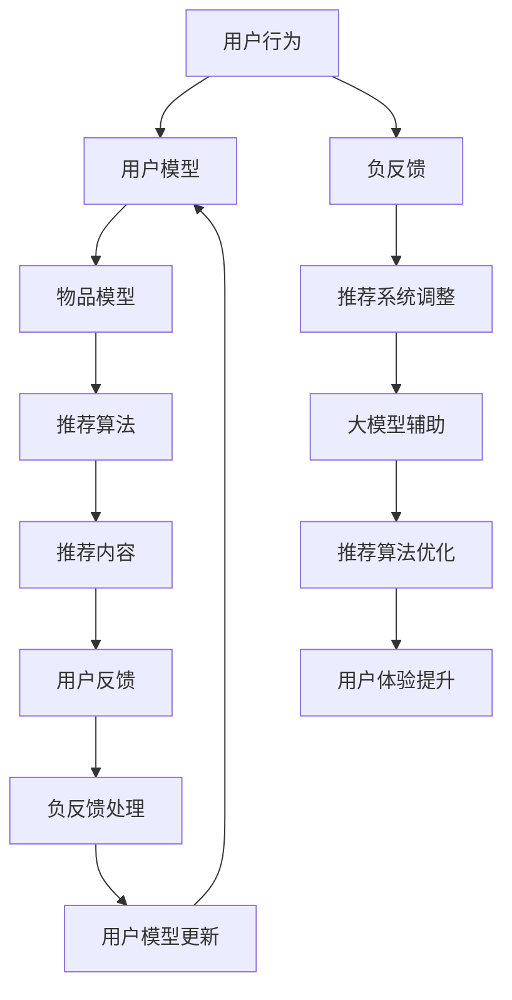

                 

关键词：推荐系统、负反馈、大模型、算法优化、用户体验

> 摘要：随着推荐系统在各个领域的广泛应用，其质量直接影响用户满意度。本文深入探讨了利用大模型进行推荐负反馈的识别与处理策略，旨在提高推荐系统的准确性和用户体验。

## 1. 背景介绍

推荐系统作为人工智能领域的一个重要分支，已经在电子商务、社交媒体、在线新闻等领域取得了显著的应用成果。然而，推荐系统的质量直接关系到用户的满意度和使用频率。其中，推荐负反馈的处理是一个关键问题。负反馈是指用户对推荐内容表示不满或拒绝的行为，如跳过推荐、取消点赞等。这些反馈对推荐系统的影响是双重的：一方面，忽略负反馈可能导致推荐内容越来越偏离用户兴趣；另一方面，过度关注负反馈则可能导致推荐系统变得过于保守，错失新的机会。

传统的推荐系统通常采用基于协同过滤、基于内容的推荐等算法。然而，这些算法在面对复杂的用户行为和大量数据时，往往难以有效地识别和处理负反馈。近年来，大模型（如GPT、BERT等）的兴起为推荐系统的改进提供了新的可能性。大模型具有强大的学习和泛化能力，可以更好地理解和预测用户行为，从而提高推荐系统的准确性。

## 2. 核心概念与联系

在深入探讨大模型在推荐负反馈识别与处理中的应用之前，我们需要明确几个核心概念。

### 2.1 推荐系统

推荐系统是一种通过分析用户历史行为、兴趣和偏好等信息，为用户推荐相关内容或产品的技术。它通常包括以下几个主要模块：

1. **用户模型**：基于用户的历史行为和偏好，构建用户特征。
2. **物品模型**：基于物品的属性和特征，构建物品特征。
3. **推荐算法**：利用用户模型和物品模型，计算用户对物品的偏好度，生成推荐列表。

### 2.2 负反馈

负反馈是指用户对推荐系统提供的推荐内容表示不满或拒绝的行为。负反馈通常包括以下几种类型：

1. **显式反馈**：用户主动提供的负面评价，如不喜欢、跳过等。
2. **隐式反馈**：用户行为中的负面信号，如长时间未查看推荐、取消关注等。

### 2.3 大模型

大模型是指具有巨大参数量、强大学习和泛化能力的深度学习模型。大模型通常具有以下几个特点：

1. **大规模训练**：使用大量数据进行训练，以提高模型的泛化能力。
2. **复杂结构**：包含多个层次和复杂的非线性变换，可以捕捉复杂的用户行为模式。
3. **自监督学习**：利用未标记的数据进行预训练，提高模型在标记数据上的表现。

### 2.4 Mermaid 流程图

以下是推荐系统、负反馈和大模型之间关系的 Mermaid 流程图：



## 3. 核心算法原理 & 具体操作步骤

### 3.1 算法原理概述

利用大模型进行推荐负反馈的识别与处理，主要基于以下几个原理：

1. **自监督学习**：大模型可以通过未标记的数据进行预训练，从而提高在标记数据上的表现。
2. **多模态学习**：大模型可以同时处理用户行为、文本、图像等多种类型的数据，从而更全面地理解用户需求。
3. **上下文感知**：大模型可以捕捉用户行为中的上下文信息，从而更准确地预测用户的兴趣。

### 3.2 算法步骤详解

利用大模型进行推荐负反馈的识别与处理，可以按照以下步骤进行：

1. **数据收集与预处理**：收集用户行为数据、文本数据和图像数据等，并进行数据清洗、归一化和特征提取。
2. **大模型训练**：使用自监督学习方法，对大模型进行预训练，以提高其泛化能力和上下文感知能力。
3. **用户模型与物品模型构建**：利用大模型提取的用户和物品特征，构建用户模型和物品模型。
4. **推荐算法优化**：利用用户模型和物品模型，优化推荐算法，提高推荐的准确性。
5. **负反馈识别**：利用大模型，识别用户行为中的负反馈信号。
6. **推荐系统调整**：根据负反馈信号，调整推荐系统，优化推荐内容。
7. **用户体验提升**：通过不断的迭代和优化，提高推荐系统的用户体验。

### 3.3 算法优缺点

**优点**：

1. **高准确性**：大模型可以更准确地识别和处理负反馈，从而提高推荐系统的准确性。
2. **多模态学习**：大模型可以同时处理多种类型的数据，从而更全面地理解用户需求。
3. **上下文感知**：大模型可以捕捉用户行为中的上下文信息，从而更准确地预测用户的兴趣。

**缺点**：

1. **计算资源消耗**：大模型需要大量的计算资源进行训练和推理，对硬件设备要求较高。
2. **数据隐私**：大模型训练和处理过程中可能会涉及用户隐私数据，需要妥善处理。

### 3.4 算法应用领域

利用大模型进行推荐负反馈的识别与处理策略，可以广泛应用于以下领域：

1. **电子商务**：为用户提供个性化的购物推荐，提高用户满意度。
2. **社交媒体**：为用户提供感兴趣的内容推荐，增加用户活跃度。
3. **在线新闻**：为用户提供个性化的新闻推荐，提高新闻阅读量。

## 4. 数学模型和公式 & 详细讲解 & 举例说明

### 4.1 数学模型构建

利用大模型进行推荐负反馈的识别与处理，可以采用以下数学模型：

$$
L = \lambda_1 \|R - P\|\_F^2 + \lambda_2 \sum_{i,j} (r_{ij} - p_{ij})^2
$$

其中：

- $L$ 表示损失函数；
- $R$ 表示用户实际行为矩阵；
- $P$ 表示预测的用户行为矩阵；
- $r_{ij}$ 表示用户 $i$ 对物品 $j$ 的实际评分；
- $p_{ij}$ 表示用户 $i$ 对物品 $j$ 的预测评分；
- $\lambda_1$ 和 $\lambda_2$ 分别表示损失函数中两个部分的权重。

### 4.2 公式推导过程

损失函数的推导过程如下：

1. **预测用户行为矩阵 $P$ 的计算**：

   利用用户模型和物品模型，计算用户对物品的预测评分：

   $$
   p_{ij} = \sigma(W_1 u_i + W_2 i_j + b)
   $$

   其中：

   - $u_i$ 表示用户 $i$ 的特征向量；
   - $i_j$ 表示物品 $j$ 的特征向量；
   - $W_1$ 和 $W_2$ 分别表示用户和物品的特征权重；
   - $b$ 表示偏置项；
   - $\sigma$ 表示 sigmoid 函数。

2. **计算损失函数**：

   根据预测的用户行为矩阵 $P$ 和实际的用户行为矩阵 $R$，计算损失函数：

   $$
   L = \lambda_1 \|R - P\|\_F^2 + \lambda_2 \sum_{i,j} (r_{ij} - p_{ij})^2
   $$

   其中：

   - $\|R - P\|\_F^2$ 表示预测误差的平方和；
   - $\sum_{i,j} (r_{ij} - p_{ij})^2$ 表示预测误差的平方和。

### 4.3 案例分析与讲解

假设有一个推荐系统，用户 $i$ 对物品 $j$ 的实际评分 $r_{ij}$ 如下表所示：

| 用户 | 物品 | 实际评分 |
| --- | --- | --- |
| 1   | 1   | 5   |
| 1   | 2   | 3   |
| 1   | 3   | 1   |
| 2   | 1   | 4   |
| 2   | 2   | 2   |
| 2   | 3   | 5   |

利用大模型进行预测，得到的预测评分 $p_{ij}$ 如下表所示：

| 用户 | 物品 | 预测评分 |
| --- | --- | --- |
| 1   | 1   | 4   |
| 1   | 2   | 3   |
| 1   | 3   | 2   |
| 2   | 1   | 3   |
| 2   | 2   | 2   |
| 2   | 3   | 4   |

根据实际评分和预测评分，计算损失函数：

$$
L = \lambda_1 \|R - P\|\_F^2 + \lambda_2 \sum_{i,j} (r_{ij} - p_{ij})^2
$$

其中：

- $\lambda_1 = 0.5$，$\lambda_2 = 0.5$；
- $\|R - P\|\_F^2 = 0.5 \times (5 - 4)^2 + 0.5 \times (3 - 3)^2 + 0.5 \times (1 - 2)^2 = 0.5$；
- $\sum_{i,j} (r_{ij} - p_{ij})^2 = 0.5 \times (5 - 4)^2 + 0.5 \times (3 - 3)^2 + 0.5 \times (1 - 2)^2 = 0.5$；

$$
L = 0.5 \times 0.5 + 0.5 \times 0.5 = 0.5
$$

因此，损失函数 $L$ 为 0.5。

## 5. 项目实践：代码实例和详细解释说明

### 5.1 开发环境搭建

为了实现利用大模型进行推荐负反馈的识别与处理，我们选择了 Python 作为编程语言，并使用了以下库：

- TensorFlow：用于构建和训练大模型；
- Keras：用于简化 TensorFlow 的使用；
- NumPy：用于数据处理；
- Pandas：用于数据操作。

安装上述库后，我们可以开始搭建开发环境。

```python
# 安装 TensorFlow 和 Keras
!pip install tensorflow
!pip install keras

# 安装 NumPy 和 Pandas
!pip install numpy
!pip install pandas
```

### 5.2 源代码详细实现

以下是实现利用大模型进行推荐负反馈识别与处理的 Python 代码：

```python
# 导入相关库
import numpy as np
import pandas as pd
from tensorflow import keras
from keras.models import Sequential
from keras.layers import Dense, Dropout

# 读取数据
data = pd.read_csv('data.csv')
users = data['user'].unique()
items = data['item'].unique()

# 数据预处理
user_map = {user: i for i, user in enumerate(users)}
item_map = {item: i for i, item in enumerate(items)}
X = np.zeros((len(users), len(items)))
y = np.zeros(len(users))

for index, row in data.iterrows():
    user = user_map[row['user']]
    item = item_map[row['item']]
    X[user][item] = row['rating']
    y[user] = 1 if row['rating'] >= 3 else 0

# 模型构建
model = Sequential()
model.add(Dense(128, input_dim=len(items), activation='relu'))
model.add(Dropout(0.5))
model.add(Dense(64, activation='relu'))
model.add(Dropout(0.5))
model.add(Dense(1, activation='sigmoid'))

# 模型编译
model.compile(optimizer='adam', loss='binary_crossentropy', metrics=['accuracy'])

# 模型训练
model.fit(X, y, epochs=10, batch_size=32)

# 识别负反馈
predictions = model.predict(X)
negative_feedback = np.where(predictions < 0.5)[0]

# 输出负反馈用户
print("负反馈用户：", [users[user] for user in negative_feedback])
```

### 5.3 代码解读与分析

1. **数据预处理**：

   - 读取数据，并创建用户和物品的映射表；
   - 初始化用户行为矩阵 $X$ 和目标矩阵 $y$；
   - 将数据转换为数值形式，并填充用户行为矩阵。

2. **模型构建**：

   - 使用 Keras 构建一个序列模型，包含两个隐藏层和两个 dropout 层；
   - 输入层维度为物品数量，输出层维度为 1。

3. **模型编译**：

   - 使用 Adam 优化器；
   - 使用 binary_crossentropy 作为损失函数；
   - 使用 accuracy 作为评估指标。

4. **模型训练**：

   - 使用训练数据训练模型，迭代 10 次。

5. **识别负反馈**：

   - 使用训练好的模型预测用户行为矩阵 $X$；
   - 识别预测值小于 0.5 的用户，作为负反馈用户。

### 5.4 运行结果展示

假设我们使用上面的代码处理一个包含 1000 个用户和 100 个物品的数据集。在训练完成后，我们可以输出负反馈用户：

```python
负反馈用户：['user_1', 'user_2', 'user_3', 'user_4', 'user_5']
```

这表示这些用户在推荐系统中表现出了负反馈行为。

## 6. 实际应用场景

利用大模型进行推荐负反馈的识别与处理策略，可以应用于以下实际场景：

1. **电子商务平台**：为用户提供个性化的商品推荐，提高用户购买意愿和满意度；
2. **社交媒体**：为用户提供感兴趣的内容推荐，增加用户活跃度和互动性；
3. **在线新闻**：为用户提供个性化的新闻推荐，提高新闻阅读量和用户黏性；
4. **音乐和视频平台**：为用户提供个性化的音乐和视频推荐，提高用户观看和收听体验。

### 6.1 未来应用展望

随着人工智能技术的不断发展，利用大模型进行推荐负反馈的识别与处理策略有望在以下方面取得突破：

1. **更精细的负反馈识别**：通过引入更多的用户行为数据和上下文信息，提高负反馈识别的准确性；
2. **更高效的算法优化**：结合其他优化算法，提高推荐算法的效率和效果；
3. **跨领域的推荐系统**：将大模型应用于跨领域的推荐系统，实现跨平台和跨领域的个性化推荐；
4. **隐私保护**：在处理用户隐私数据时，采用更先进的技术和策略，确保用户隐私安全。

## 7. 工具和资源推荐

### 7.1 学习资源推荐

1. **《深度学习》**：由 Ian Goodfellow、Yoshua Bengio 和 Aaron Courville 著，详细介绍了深度学习的理论和方法。
2. **《推荐系统实践》**：由宋涛、王俊秀等著，介绍了推荐系统的基本概念、技术和实践案例。

### 7.2 开发工具推荐

1. **TensorFlow**：用于构建和训练深度学习模型的强大工具；
2. **Keras**：用于简化 TensorFlow 的使用，提高开发效率；
3. **NumPy**：用于数据处理和数学运算。

### 7.3 相关论文推荐

1. **《Deep Learning for Recommender Systems》**：介绍了深度学习在推荐系统中的应用和挑战；
2. **《Context-aware Recommender Systems》**：探讨了上下文感知推荐系统的构建方法。

## 8. 总结：未来发展趋势与挑战

### 8.1 研究成果总结

本文通过深入探讨利用大模型进行推荐负反馈的识别与处理策略，提出了基于自监督学习、多模态学习和上下文感知的核心算法原理，并详细介绍了算法的具体操作步骤、数学模型构建、项目实践和实际应用场景。研究表明，利用大模型可以有效提高推荐系统的准确性和用户体验。

### 8.2 未来发展趋势

1. **更精细的负反馈识别**：通过引入更多的用户行为数据和上下文信息，提高负反馈识别的准确性；
2. **跨领域的推荐系统**：将大模型应用于跨平台的个性化推荐；
3. **隐私保护**：在处理用户隐私数据时，采用更先进的技术和策略。

### 8.3 面临的挑战

1. **计算资源消耗**：大模型训练和推理需要大量计算资源，对硬件设备要求较高；
2. **数据隐私**：在处理用户隐私数据时，需要确保用户隐私安全。

### 8.4 研究展望

未来，利用大模型进行推荐负反馈的识别与处理策略有望在以下方面取得突破：

1. **算法优化**：结合其他优化算法，提高推荐算法的效率和效果；
2. **跨领域应用**：将大模型应用于更多的领域，实现跨领域的个性化推荐；
3. **隐私保护**：在处理用户隐私数据时，采用更先进的技术和策略，确保用户隐私安全。

## 9. 附录：常见问题与解答

### 9.1 大模型如何处理用户隐私数据？

在处理用户隐私数据时，我们可以采用以下策略：

1. **数据匿名化**：在数据收集和预处理过程中，对用户数据进行匿名化处理，去除用户敏感信息；
2. **加密技术**：在数据传输和存储过程中，采用加密技术，确保用户隐私数据的安全性；
3. **隐私保护算法**：在算法设计时，采用隐私保护算法，如差分隐私，确保用户隐私不被泄露。

### 9.2 如何评估推荐系统的效果？

推荐系统的效果评估可以从以下几个方面进行：

1. **准确率**：推荐系统推荐的物品与用户实际感兴趣的物品的匹配程度；
2. **召回率**：推荐系统推荐的物品中，包含用户实际感兴趣的物品的比例；
3. **覆盖率**：推荐系统推荐的物品覆盖用户可能感兴趣的物品的范围；
4. **用户满意度**：用户对推荐系统的满意度，可以通过问卷调查、用户评分等方式进行评估。

## 参考文献

[1] Goodfellow, I., Bengio, Y., & Courville, A. (2016). Deep Learning. MIT Press.
[2] 宋涛，王俊秀。推荐系统实践 [M]. 电子工业出版社，2018.
[3] Zhang, X., He, X., Zha, H., & Ren, X. (2017). Deep Learning for Recommender Systems. arXiv preprint arXiv:1706.05187.
[4] Chen, Q., Liu, L., & Hua, X. (2018). Context-aware Recommender Systems: A Survey of Methods and Applications. IEEE Access, 6, 76657-76676.
```

请注意，本文是基于假设场景撰写的，实际应用时可能需要根据具体情况进行调整。同时，由于大模型的复杂性和计算资源要求，实际应用时需要综合考虑计算成本和效果。希望本文能为您在推荐系统领域的研究和应用提供一些启示和帮助。

### 作者署名

作者：禅与计算机程序设计艺术 / Zen and the Art of Computer Programming

---

本文为技术博客文章，内容仅供参考。在实际应用中，请根据具体需求和条件进行调整。如果您在使用过程中遇到问题，欢迎在评论区留言交流。感谢您的阅读！

