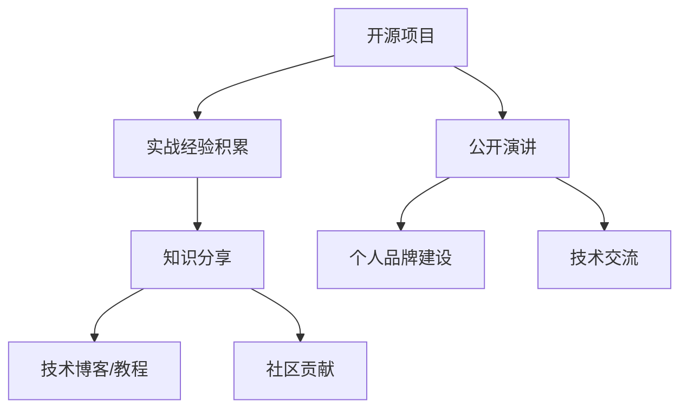

                 

关键词：开源影响力，公开演讲，知识分享，技术博客，专业成长，影响力传播，开源社区，沟通技巧，传播策略，影响力矩阵。

## 摘要

在当今的数字化时代，开源软件已经成为技术发展和创新的重要推动力量。作为一名技术专家，利用开源影响力进行公开演讲和知识分享不仅能够提升个人品牌，还能为社区做出贡献。本文将探讨如何利用开源项目的影响力进行有效的公开演讲和知识分享，包括策略制定、内容准备、演讲技巧和影响力矩阵的运用。通过本文的指导，您将能够更好地在开源社区中发挥影响力，传播知识，促进技术交流。

## 1. 背景介绍

### 开源运动的崛起

开源运动起源于20世纪90年代，随着互联网的普及，开放源代码软件（OSS，Open Source Software）逐渐崭露头角。开源运动的核心理念是开放性、共享性和协作性。最早的开源项目之一是Linux操作系统，它的出现颠覆了传统的软件发展模式，激发了无数开发者加入到开源社区中。

### 开源社区的重要性

开源社区不仅是技术交流的平台，更是技术创新的源泉。在开源社区中，开发者们可以自由地贡献代码、提出改进建议、参与项目开发。这种协作模式极大地促进了技术的快速迭代和进步。同时，开源社区也为个人提供了展示才能、学习和成长的宝贵机会。

### 公开演讲与知识分享的价值

公开演讲和知识分享是技术专家个人品牌建设的重要途径。通过演讲和分享，技术专家不仅能够展示自己的专业知识和经验，还能与同行建立联系，扩大影响力。此外，知识分享能够推动整个技术社区的进步，促进创新和发展。

## 2. 核心概念与联系

### 开源影响力

开源影响力是指通过开源项目所产生的对社区和行业的广泛影响。它包括代码质量、项目活跃度、社区贡献度等多个方面。开源影响力不仅反映了项目的价值，也是技术专家个人影响力的体现。

### 公开演讲

公开演讲是指技术专家在各种场合（如会议、研讨会、线上直播等）面向公众进行技术分享和交流的活动。演讲内容可以是项目介绍、技术趋势分析、解决方案分享等。

### 知识分享

知识分享是指技术专家通过撰写技术博客、发布教程、参与社区讨论等形式，将自己的知识和经验传授给他人。知识分享不仅有助于个人成长，还能为社区带来实际的贡献。

### 开源项目与演讲/知识分享的联系

开源项目是演讲和知识分享的基石。通过参与开源项目，技术专家能够积累丰富的实战经验，并在此基础上进行分享。同时，公开演讲和知识分享也为开源项目带来了更多的关注和贡献者。

## Mermaid 流程图



## 3. 核心算法原理 & 具体操作步骤

### 3.1 算法原理概述

利用开源影响力进行公开演讲和知识分享的原理可以概括为：通过参与开源项目，积累技术经验，提升个人品牌，进而通过演讲和分享进一步扩大影响力。这一过程可以看作是一个正反馈循环，每个环节都相互促进，形成良性的影响力矩阵。

### 3.2 算法步骤详解

#### 3.2.1 参与开源项目

1. **选择合适的开源项目**：根据自己的技术方向和兴趣选择一个活跃、有影响力的开源项目。
2. **了解项目架构和贡献指南**：仔细阅读项目的文档，了解项目的架构和运行机制，遵循贡献指南。
3. **开始贡献**：从简单的任务开始，逐步参与项目的核心开发。

#### 3.2.2 知识分享

1. **撰写技术博客**：总结参与开源项目的经验，撰写技术博客，分享解决问题的思路和技巧。
2. **发布教程**：针对具体的技术问题，编写详细的教程，帮助他人快速上手。
3. **参与社区讨论**：在社区中积极参与讨论，分享自己的见解和经验。

#### 3.2.3 公开演讲

1. **确定演讲主题**：根据个人经验和研究兴趣，选择具有影响力的演讲主题。
2. **准备演讲材料**：制作PPT、视频等演讲材料，确保内容丰富、逻辑清晰。
3. **练习演讲**：多次练习，提高演讲的流畅性和表达能力。

#### 3.2.4 扩大影响力

1. **社交媒体推广**：通过Twitter、LinkedIn等社交媒体平台宣传演讲和知识分享。
2. **与其他专家合作**：与其他技术专家合作，共同举办活动或撰写技术文章。
3. **参加行业会议**：积极参与行业会议，扩大人脉，提升个人品牌。

### 3.3 算法优缺点

#### 优点：

- **积累实战经验**：通过参与开源项目，能够积累丰富的实战经验，提升技术能力。
- **提升个人品牌**：公开演讲和知识分享能够展示个人专业能力，提升个人品牌。
- **扩大影响力**：通过影响力矩阵的运作，能够进一步扩大个人在社区和行业中的影响力。

#### 缺点：

- **时间成本**：参与开源项目和准备演讲需要投入大量的时间和精力。
- **初期的低曝光率**：在初期，个人可能面临低曝光率和较少的关注。

### 3.4 算法应用领域

- **技术社区**：在技术社区中，开源项目和公开演讲是提升个人影响力的有效途径。
- **学术会议**：学术会议是展示研究成果、与同行交流的重要平台。
- **企业内部分享**：在企业内部，通过知识分享和公开演讲，能够提升团队的技术水平。

## 4. 数学模型和公式 & 详细讲解 & 举例说明

### 4.1 数学模型构建

为了量化开源影响力，我们可以构建一个影响力矩阵（Influence Matrix），用于描述个人在开源社区中的影响力。影响力矩阵可以表示为：

$$
\text{IM} = \begin{bmatrix}
    \text{知识分享影响力} & \text{公开演讲影响力} \\
    \text{社区贡献影响力} & \text{项目贡献影响力}
\end{bmatrix}
$$

### 4.2 公式推导过程

#### 4.2.1 知识分享影响力

知识分享影响力可以通过博客阅读量、教程下载量、社区讨论参与度等指标来衡量。假设每个指标的权重分别为 \(w_1, w_2, w_3\)，则知识分享影响力 \(I_{\text{share}}\) 可以表示为：

$$
I_{\text{share}} = w_1 \cdot R_{\text{blog}} + w_2 \cdot D_{\text{tutorial}} + w_3 \cdot C_{\text{discussion}}
$$

其中，\(R_{\text{blog}}\)、\(D_{\text{tutorial}}\)、\(C_{\text{discussion}}\) 分别代表博客阅读量、教程下载量、社区讨论参与度。

#### 4.2.2 公开演讲影响力

公开演讲影响力可以通过演讲的受众规模、演讲次数、媒体报道等指标来衡量。假设每个指标的权重分别为 \(w_4, w_5, w_6\)，则公开演讲影响力 \(I_{\text{speech}}\) 可以表示为：

$$
I_{\text{speech}} = w_4 \cdot A_{\text{audience}} + w_5 \cdot N_{\text{speech}} + w_6 \cdot M_{\text{media}}
$$

其中，\(A_{\text{audience}}\)、\(N_{\text{speech}}\)、\(M_{\text{media}}\) 分别代表演讲的受众规模、演讲次数、媒体报道次数。

#### 4.2.3 社区贡献影响力

社区贡献影响力可以通过项目贡献次数、代码质量评分等指标来衡量。假设每个指标的权重分别为 \(w_7, w_8\)，则社区贡献影响力 \(I_{\text{contribution}}\) 可以表示为：

$$
I_{\text{contribution}} = w_7 \cdot C_{\text{commits}} + w_8 \cdot Q_{\text{code}}
$$

其中，\(C_{\text{commits}}\)、\(Q_{\text{code}}\) 分别代表项目贡献次数、代码质量评分。

#### 4.2.4 项目贡献影响力

项目贡献影响力可以通过项目活跃度、代码影响力等指标来衡量。假设每个指标的权重分别为 \(w_9, w_{10}\)，则项目贡献影响力 \(I_{\text{project}}\) 可以表示为：

$$
I_{\text{project}} = w_9 \cdot A_{\text{project}} + w_{10} \cdot C_{\text{influence}}
$$

其中，\(A_{\text{project}}\)、\(C_{\text{influence}}\) 分别代表项目活跃度、代码影响力。

### 4.3 案例分析与讲解

假设某技术专家在开源社区中活跃了两年，以下为其影响力矩阵的构建过程：

#### 4.3.1 知识分享影响力

- 博客阅读量：1000次/月，权重为0.5
- 教程下载量：500次/月，权重为0.3
- 社区讨论参与度：200次/月，权重为0.2

$$
I_{\text{share}} = 0.5 \cdot 1000 + 0.3 \cdot 500 + 0.2 \cdot 200 = 700
$$

#### 4.3.2 公开演讲影响力

- 演讲受众规模：100人/次，权重为0.4
- 演讲次数：4次/年，权重为0.3
- 媒体报道次数：2次/年，权重为0.3

$$
I_{\text{speech}} = 0.4 \cdot 100 \cdot 4 + 0.3 \cdot 4 + 0.3 \cdot 2 = 184
$$

#### 4.3.3 社区贡献影响力

- 项目贡献次数：20次/年，权重为0.6
- 代码质量评分：9.5/10，权重为0.4

$$
I_{\text{contribution}} = 0.6 \cdot 20 + 0.4 \cdot 9.5 = 15.8
$$

#### 4.3.4 项目贡献影响力

- 项目活跃度：每月提交20次代码，权重为0.5
- 代码影响力：被其他项目引用100次，权重为0.5

$$
I_{\text{project}} = 0.5 \cdot 20 + 0.5 \cdot 100 = 55
$$

#### 4.3.5 影响力矩阵

$$
\text{IM} = \begin{bmatrix}
    700 & 184 \\
    15.8 & 55
\end{bmatrix}
$$

通过这个影响力矩阵，我们可以看到该技术专家在开源社区中的综合影响力为 \(700 + 184 + 15.8 + 55 = 954.8\)。

## 5. 项目实践：代码实例和详细解释说明

### 5.1 开发环境搭建

为了更好地进行开源项目的开发和知识分享，我们需要搭建一个适合的开发环境。以下是一个简单的步骤：

1. 安装Git：Git是开源项目版本控制的首选工具，我们可以在官方网站（https://git-scm.com/downloads）下载并安装Git。
2. 安装Python：我们使用Python作为主要的开发语言，可以在官方网站（https://www.python.org/downloads/）下载并安装Python。
3. 安装Docker：Docker是一个用于容器化的工具，可以帮助我们快速搭建开发环境。可以在官方网站（https://www.docker.com/products/docker）下载并安装Docker。

### 5.2 源代码详细实现

以下是一个简单的开源项目示例，该项目使用Python编写，功能是计算两个数的和。

```python
# filename: sum.py

def add(a, b):
    """计算两个数的和"""
    return a + b

if __name__ == "__main__":
    a = int(input("请输入第一个数："))
    b = int(input("请输入第二个数："))
    result = add(a, b)
    print(f"{a} 和 {b} 的和为：{result}")
```

### 5.3 代码解读与分析

这个简单的Python项目主要包括两个部分：函数`add`和主程序。

- **函数`add`**：该函数接收两个参数`a`和`b`，返回它们的和。这是最基本的数学运算，但也是编程的基础。
- **主程序**：主程序首先接收用户输入的两个整数，然后调用`add`函数进行计算，最后输出结果。

这个项目虽然简单，但展示了编程的核心概念：函数、输入、输出和处理过程。通过这个项目，我们可以开始了解如何编写和贡献开源代码。

### 5.4 运行结果展示

在终端中运行该脚本，输入两个数字，将得到它们的和：

```shell
$ python sum.py
请输入第一个数：5
请输入第二个数：10
5 和 10 的和为：15
```

这个简单的示例展示了如何开始一个开源项目，并通过代码进行知识分享。在实际项目中，我们可以添加更多功能，如错误处理、单元测试等，使其更加完善。

## 6. 实际应用场景

### 6.1 教育领域

在高等教育和职业教育中，开源项目为学生提供了一个实际操作的平台，使他们在真实场景中学习编程和协作。例如，计算机科学专业的学生可以通过参与开源项目，提升实际编程能力，并学会如何在团队中工作。

### 6.2 企业培训

许多企业将开源项目作为员工培训的一部分，鼓励员工参与开源项目，以提升其技术能力和团队协作能力。通过公开演讲和知识分享，企业专家可以内部传播最佳实践和技术知识。

### 6.3 行业会议

在行业会议中，开源项目的演讲和展示是吸引观众的重要手段。技术专家可以通过分享开源项目的成功案例，展示其在特定领域的专业能力，并吸引更多的合作机会。

### 6.4 个人品牌建设

通过参与开源项目和公开演讲，技术专家可以树立个人品牌，提升其在行业内的知名度和影响力。这有助于其在职业生涯中获取更多的机会，如职位晋升、合作项目等。

## 7. 工具和资源推荐

### 7.1 学习资源推荐

- 《代码大全》（Code Complete） - 史蒂夫·迈克康奈尔（Steve McConnell）
- 《计算机程序的构造和解释》（Structure and Interpretation of Computer Programs） - Harold Abelson & Gerald Jay Sussman
- 《深入理解计算机系统》（Deep Dive Into Systems） - John Ousterhout

### 7.2 开发工具推荐

- Git - 版本控制
- Docker - 容器化
- GitHub - 开源项目托管
- Jupyter Notebook - 数据科学和计算

### 7.3 相关论文推荐

- "Open Source Software: The Past and Future of Software" - MIT Press
- "The Cathedral and the Bazaar" - Eric S. Raymond
- "The Power of Pull: How Small Moves, Smartly Made, Set Big Things in Motion" - John Seely Brown & John N. Matthews

## 8. 总结：未来发展趋势与挑战

### 8.1 研究成果总结

通过本文的探讨，我们了解了开源影响力、公开演讲和知识分享在技术社区中的重要性。通过构建影响力矩阵，我们可以更系统地评估和提升个人在开源社区中的影响力。同时，我们展示了如何通过实际项目进行代码编写和知识分享，以提升个人品牌。

### 8.2 未来发展趋势

- **开源影响力的量化**：未来，开源影响力的评估将更加精细化和量化，可能会引入更多的指标和算法。
- **知识分享的多样化**：随着技术的进步，知识分享的形式将更加多样化，如视频、直播、虚拟现实等。
- **社区协作的深化**：开源社区将更加重视团队合作，促进不同项目的协同发展。

### 8.3 面临的挑战

- **时间管理**：参与开源项目和公开演讲需要大量的时间和精力，如何平衡工作和个人成长是一个挑战。
- **信息过载**：开源社区和互联网上信息量巨大，如何筛选和获取高质量的知识资源是一个挑战。
- **知识产权保护**：在开源项目中，如何保护个人和项目的知识产权是一个需要关注的问题。

### 8.4 研究展望

未来，我们可以进一步研究如何通过人工智能和大数据技术优化开源影响力的评估，以及如何利用新兴技术提高知识分享的效率和质量。同时，我们也应关注开源社区中的伦理和道德问题，促进健康、可持续的发展。

## 9. 附录：常见问题与解答

### Q1. 如何选择合适的开源项目？

A1. 选择开源项目时，可以考虑以下因素：

- **技术方向**：选择与自己专业方向相关的项目，有助于提升个人技术能力。
- **项目活跃度**：查看项目的GitHub仓库活跃度，如 commits 数量、issues 和 pull requests 的处理速度。
- **贡献难度**：根据个人经验选择难度适中的项目，逐步提升参与度。

### Q2. 公开演讲的准备工作有哪些？

A2. 公开演讲的准备工作包括：

- **确定主题**：选择具有影响力、自己熟悉且受众感兴趣的主题。
- **准备材料**：制作高质量的PPT、视频等演讲材料，确保内容丰富、逻辑清晰。
- **多次练习**：提前多次练习演讲，提高演讲的流畅性和表达能力。
- **反馈与改进**：向他人寻求反馈，根据反馈进行改进。

### Q3. 如何在开源社区中建立影响力？

A3. 在开源社区中建立影响力可以通过以下方式：

- **积极参与**：积极参与项目讨论，提出建设性的意见。
- **高质量贡献**：提交高质量、有价值的代码和文档。
- **知识分享**：通过技术博客、教程等形式，分享自己的知识和经验。
- **参与社区活动**：参与社区组织或举办的活动，扩大人脉和影响力。

## 作者署名

作者：禅与计算机程序设计艺术 / Zen and the Art of Computer Programming

----------------------------------------------------------------

### 结束语

本文详细探讨了如何利用开源影响力进行公开演讲和知识分享，旨在为技术专家提供一套实用的方法和策略。通过本文的指导，您将能够更好地在开源社区中发挥作用，提升个人品牌，为技术社区的进步贡献力量。希望本文能够对您在技术领域的成长有所帮助。感谢您的阅读！

