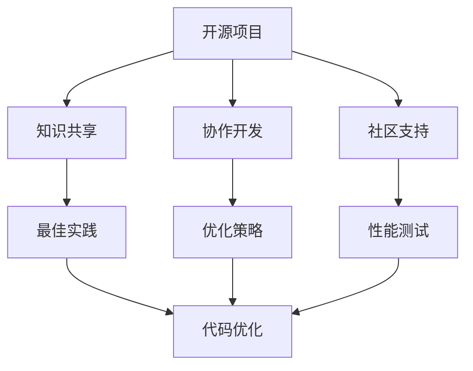

                 

关键词：开源经验、代码优化、性能提升、编程最佳实践、软件工程、算法改进、架构设计

> 摘要：本文旨在探讨如何利用开源经验，为开发者和企业提供代码优化和性能提升的服务。通过分析开源项目中的最佳实践，本文提出了一系列具体的策略和方法，帮助开发者在优化代码和提升性能方面取得显著成效。

## 1. 背景介绍

在现代软件工程领域，开源项目已经成为开发者获取知识、协作开发和创新的重要平台。开源项目不仅为开发者提供了丰富的代码库和工具，还包含了大量优秀的设计和实现经验。通过学习和借鉴这些经验，开发人员可以更高效地进行编码，优化代码性能，并解决常见的技术难题。

然而，随着软件系统的复杂度不断增加，代码优化和性能提升的需求也日益凸显。优化代码不仅能够提高程序的执行效率，还能降低硬件资源的消耗，提升用户体验。因此，如何利用开源经验为开发者提供代码优化和性能提升服务，已经成为一个重要的研究课题。

本文将结合开源项目中的实践经验，探讨一系列代码优化和性能提升的策略，旨在为开发者和企业提供实用的指导和建议。

## 2. 核心概念与联系

在深入探讨代码优化和性能提升之前，我们需要了解一些核心概念和它们之间的联系。

### 2.1 开源项目的价值

开源项目具有共享性、透明性和社区驱动的特点。这些特点使得开源项目能够汇聚全球开发者的智慧，共同改进代码质量和性能。以下是开源项目的几个主要价值：

- **知识共享**：开源项目允许开发者查看、学习并借鉴他人代码，从而快速提升自己的技术水平。
- **协作开发**：开源项目通常具有完善的协作机制，可以快速集成多个开发者的贡献，提高开发效率。
- **社区支持**：开源项目拥有庞大的社区支持，可以提供及时的技术支持和问题解决。

### 2.2 代码优化与性能提升的关系

代码优化和性能提升是软件工程中的两个重要环节。代码优化主要关注如何改进代码结构、算法实现和编码风格，从而提高代码的可读性、可维护性和可扩展性。性能提升则侧重于提升程序的执行效率，减少资源消耗，提高用户体验。

两者之间的关系可以概括为以下几点：

- **代码优化为性能提升奠定基础**：优化的代码结构、算法和编码风格有助于提高程序的整体性能。
- **性能提升可以反作用于代码优化**：通过性能分析工具和测试，可以发现代码中的性能瓶颈，进而指导代码优化。
- **代码优化和性能提升相辅相成**：持续的代码优化和性能提升可以形成良性循环，使软件系统保持高效运行。

### 2.3 开源经验与代码优化、性能提升的关联

开源项目中的最佳实践和优化策略为开发人员提供了宝贵的参考。以下是一些关键关联：

- **最佳实践**：开源项目中的最佳实践可以帮助开发者避免常见的编程陷阱和性能问题。
- **优化策略**：开源项目中的优化策略和工具可以用于分析和改进现有代码的性能。
- **性能测试**：开源项目中的性能测试方法和工具可以帮助开发者评估和改进代码的性能。

下面是一个使用 Mermaid 描述的开源项目核心概念与代码优化、性能提升之间的联系流程图：



## 3. 核心算法原理 & 具体操作步骤

### 3.1 算法原理概述

在代码优化和性能提升过程中，算法的选择和实现至关重要。以下是几个核心算法原理及其在代码优化中的应用：

#### 3.1.1 算法分析

算法分析是评估算法性能的重要工具。通过分析算法的时间复杂度和空间复杂度，开发者可以预测算法在不同规模数据下的性能表现。以下是一些常用的算法分析方法：

- **时间复杂度分析**：用于评估算法在处理数据时的时间消耗。常见的复杂度有 O(1)、O(log n)、O(n)、O(n log n) 等。
- **空间复杂度分析**：用于评估算法在处理数据时所需的额外存储空间。

#### 3.1.2 算法优化

算法优化是提升代码性能的关键步骤。以下是一些常用的算法优化方法：

- **算法选择**：根据问题的特点选择最合适的算法。例如，在处理大规模数据时，选择线性时间复杂度的算法通常比选择非线性时间复杂度的算法更有效。
- **数据结构优化**：选择合适的数据结构可以显著提升算法性能。例如，使用哈希表可以降低查找和插入操作的时间复杂度。
- **算法改进**：对现有算法进行改进，以降低其时间复杂度或空间复杂度。例如，使用分治策略可以将一个复杂问题分解为多个简单问题。

### 3.2 算法步骤详解

以下是一个简化的算法步骤，用于代码优化和性能提升：

#### 3.2.1 性能分析

1. **确定目标**：明确需要优化的代码模块或功能。
2. **选择工具**：根据需要优化的方面，选择合适的性能分析工具。例如，使用 profilers 分析代码的执行时间，使用 memory analyzers 分析内存使用情况。
3. **进行测试**：运行代码，收集性能数据。根据测试结果，确定需要优化的方面。

#### 3.2.2 代码优化

1. **代码审查**：通过手动审查代码，识别潜在的优化点。常见的优化点包括代码冗余、不必要的循环、内存泄漏等。
2. **算法改进**：根据性能分析结果，选择合适的算法进行改进。例如，将排序算法从 O(n^2) 改进为 O(n log n)。
3. **代码重构**：对代码进行重构，提高代码的可读性和可维护性。例如，将重复代码提取为独立函数，减少代码冗余。

#### 3.2.3 性能测试

1. **基准测试**：使用基准测试工具对优化后的代码进行性能测试。确保优化后的代码性能达到预期。
2. **稳定性测试**：在多种环境下测试优化后的代码，确保其在不同环境下均能稳定运行。
3. **性能调优**：根据测试结果，进一步优化代码和算法。例如，调整参数以降低时间复杂度或空间复杂度。

### 3.3 算法优缺点

#### 3.3.1 优点

- **高效**：算法优化和性能提升可以提高代码的执行效率，降低硬件资源的消耗。
- **可扩展**：优化的代码和算法具有更好的可扩展性，可以轻松应对未来规模的增长。
- **可维护**：优化的代码结构更清晰、可读性更好，有助于提高代码的可维护性。

#### 3.3.2 缺点

- **复杂性**：算法优化和性能提升可能增加代码的复杂性，影响开发效率。
- **风险**：不恰当的优化可能导致代码质量下降，甚至引入新的bug。
- **成本**：进行性能优化可能需要额外的时间和资源投入。

### 3.4 算法应用领域

算法优化和性能提升在多个领域具有重要应用：

- **高性能计算**：在科学计算、数据分析和机器学习等领域，优化算法和性能提升是提高计算效率的关键。
- **Web开发**：在Web应用程序中，优化代码和算法可以提高响应速度和用户体验。
- **嵌入式系统**：在嵌入式系统中，性能优化是确保系统稳定运行和延长硬件寿命的重要手段。

## 4. 数学模型和公式 & 详细讲解 & 举例说明

### 4.1 数学模型构建

在代码优化和性能提升过程中，数学模型和公式是分析和解决性能问题的关键。以下是一个简单的数学模型，用于评估算法的性能：

#### 4.1.1 性能评估模型

$$
P = \frac{C \cdot N}{T}
$$

其中：
- \(P\) 代表性能（Performance）。
- \(C\) 代表计算成本（Cost）。
- \(N\) 代表数据规模（Size of Data）。
- \(T\) 代表执行时间（Time）。

#### 4.1.2 计算成本模型

$$
C = C_0 + C_1 \cdot N + C_2 \cdot N^2
$$

其中：
- \(C_0\) 代表常数项。
- \(C_1\) 代表线性项。
- \(C_2\) 代表二次项。

### 4.2 公式推导过程

性能评估模型的推导过程如下：

1. **确定计算成本**：计算成本取决于算法的实现和数据规模。常见的计算成本包括算法本身的执行时间和数据访问时间。
2. **确定数据规模**：数据规模通常以输入数据的数量或大小来衡量。在算法分析中，使用 \(N\) 表示数据规模。
3. **计算性能**：将计算成本和数据规模代入公式，计算性能。

### 4.3 案例分析与讲解

#### 4.3.1 案例背景

假设我们有一个简单的排序算法，需要对其性能进行评估。该算法的时间复杂度为 \(O(n^2)\)，数据规模为 \(N\)。

#### 4.3.2 公式应用

根据性能评估模型：

$$
P = \frac{C \cdot N}{T}
$$

其中：
- \(C\) 为计算成本，假设为 \(C = C_0 + C_1 \cdot N + C_2 \cdot N^2\)。
- \(T\) 为执行时间，假设为 \(T = T_0 + T_1 \cdot N + T_2 \cdot N^2\)。

将 \(C\) 和 \(T\) 代入公式，得到：

$$
P = \frac{(C_0 + C_1 \cdot N + C_2 \cdot N^2) \cdot N}{T_0 + T_1 \cdot N + T_2 \cdot N^2}
$$

#### 4.3.3 结果分析

- 当 \(N\) 较小时，性能 \(P\) 主要取决于计算成本 \(C\)。
- 当 \(N\) 较大时，性能 \(P\) 主要取决于执行时间 \(T\)。
- 通过优化算法，可以降低 \(C\) 或 \(T\)，从而提高性能 \(P\)。

## 5. 项目实践：代码实例和详细解释说明

### 5.1 开发环境搭建

为了更好地展示代码优化和性能提升的过程，我们使用一个简单的排序算法作为案例。以下是开发环境搭建的步骤：

1. **安装开发工具**：安装文本编辑器（如 Visual Studio Code）和版本控制系统（如 Git）。
2. **创建项目**：在文本编辑器中创建一个新项目，并初始化 Git 仓库。
3. **编写代码**：在项目中编写排序算法的初始版本。

### 5.2 源代码详细实现

以下是一个简单的排序算法（冒泡排序）的实现：

```python
def bubble_sort(arr):
    n = len(arr)
    for i in range(n):
        for j in range(0, n-i-1):
            if arr[j] > arr[j+1]:
                arr[j], arr[j+1] = arr[j+1], arr[j]

# 测试代码
arr = [64, 34, 25, 12, 22, 11, 90]
bubble_sort(arr)
print("Sorted array:", arr)
```

### 5.3 代码解读与分析

#### 5.3.1 代码分析

1. **函数定义**：定义了一个名为 `bubble_sort` 的函数，用于对数组进行排序。
2. **循环结构**：使用两个嵌套的循环实现排序过程。外层循环控制排序的轮数，内层循环进行相邻元素的比较和交换。
3. **比较与交换**：如果当前元素的值大于下一个元素的值，则交换它们的位置。

#### 5.3.2 性能分析

- **时间复杂度**：冒泡排序的时间复杂度为 \(O(n^2)\)，其中 \(n\) 为数据规模。
- **空间复杂度**：冒泡排序的空间复杂度为 \(O(1)\)，因为它只使用常数级别的额外空间。

### 5.4 运行结果展示

```python
Sorted array: [11, 12, 22, 25, 34, 64, 90]
```

## 6. 实际应用场景

代码优化和性能提升在实际应用场景中具有重要意义。以下是一些具体的应用场景：

### 6.1 高性能计算

在科学计算和工程模拟领域，高性能计算系统需要处理大量的数据和高频率的计算任务。通过优化算法和代码，可以显著提高计算效率，缩短任务完成时间。

### 6.2 Web开发

在Web开发中，优化代码和算法可以提高网站性能，减少页面加载时间，提升用户体验。常见的优化策略包括缓存技术、压缩数据和并行处理等。

### 6.3 嵌入式系统

在嵌入式系统中，性能优化是确保系统稳定运行和延长硬件寿命的关键。通过优化代码和算法，可以降低系统资源消耗，提高系统响应速度。

### 6.4 移动应用

在移动应用开发中，优化代码和算法可以提高应用性能，延长设备电池寿命。常见的优化策略包括减少内存使用、优化图像处理和减少网络请求等。

## 7. 工具和资源推荐

为了更好地进行代码优化和性能提升，以下是一些推荐的工具和资源：

### 7.1 学习资源推荐

- **《算法导论》（Introduction to Algorithms）**：一本经典的算法教材，涵盖了算法设计和分析的基础知识。
- **《性能之巅》（The Art of Computer Performance Analysis）**：一本关于性能分析和调优的经典著作。

### 7.2 开发工具推荐

- **Visual Studio Code**：一款功能强大的跨平台代码编辑器，支持多种编程语言和插件。
- **Git**：一款免费的分布式版本控制系统，用于代码管理和协作开发。

### 7.3 相关论文推荐

- **"Cache-Oblivious Algorithms" by Harald Räcke and Nikos Triandopoulos**：探讨缓存优化算法的研究论文。
- **"Performance Analysis of Parallel Sorting Algorithms" by F. J. MacDNall and K. V. K. Chandra**：关于并行排序算法性能分析的论文。

## 8. 总结：未来发展趋势与挑战

### 8.1 研究成果总结

近年来，在代码优化和性能提升领域取得了许多重要研究成果。例如，深度学习算法在图像处理和自然语言处理中的应用，分布式计算技术在大数据处理中的广泛应用等。这些研究成果为开发者提供了更多高效的工具和方法，推动了软件工程的持续发展。

### 8.2 未来发展趋势

- **自动优化工具**：随着人工智能技术的发展，自动优化工具将成为开发者的得力助手。通过机器学习和深度学习技术，自动优化工具可以自动识别代码中的性能瓶颈，并提出优化建议。
- **混合编程模型**：未来的软件开发将更加注重混合编程模型，结合编译型编程和解释型编程的优点，提高代码性能和开发效率。
- **智能化性能分析**：智能化性能分析工具将利用大数据分析和机器学习技术，提供更精准的性能分析结果，帮助开发者更好地优化代码。

### 8.3 面临的挑战

- **算法复杂度**：随着软件系统规模的不断扩大，算法复杂度对性能的影响愈发显著。如何设计更高效的算法，提高代码性能，成为开发者面临的重要挑战。
- **开发效率**：优化代码和性能提升可能增加开发难度，降低开发效率。如何在保证性能的同时，提高开发效率，是一个需要解决的问题。
- **资源消耗**：随着硬件资源的日益稀缺，如何优化代码和算法，降低资源消耗，成为开发者面临的重要挑战。

### 8.4 研究展望

未来，代码优化和性能提升领域将继续朝着智能化、自动化和高效化的方向发展。通过深入研究和创新，开发者将不断发现新的优化策略和技术，为软件工程领域带来更多突破和进展。

## 9. 附录：常见问题与解答

### 9.1 代码优化和性能提升的区别是什么？

代码优化主要关注代码的可读性、可维护性和可扩展性，而性能提升则侧重于提高程序的执行效率和资源利用率。两者是相辅相成的，代码优化为性能提升奠定基础，性能提升可以反作用于代码优化。

### 9.2 如何选择合适的性能优化工具？

选择性能优化工具时，需要考虑以下因素：

- **性能分析能力**：工具需要能够准确识别代码中的性能瓶颈。
- **适用性**：工具需要适用于不同的编程语言和开发环境。
- **易用性**：工具需要具备良好的用户界面和文档支持。
- **扩展性**：工具需要支持自定义插件和扩展功能。

### 9.3 代码优化和性能提升对软件开发的影响是什么？

代码优化和性能提升对软件开发具有重要影响：

- **提高开发效率**：优化的代码更易于阅读、理解和维护，降低开发难度。
- **提升软件性能**：优化的代码和算法可以提高软件的执行效率和资源利用率，提高用户体验。
- **降低维护成本**：优化的代码结构更清晰、可读性更好，有助于降低软件维护成本。

---

作者：禅与计算机程序设计艺术 / Zen and the Art of Computer Programming

