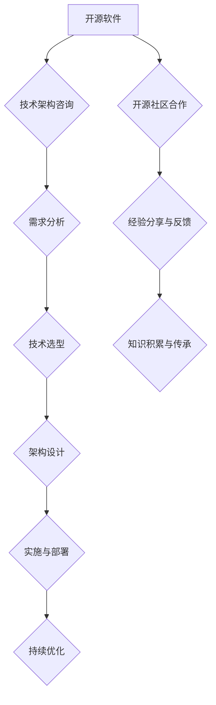

                 

关键词：开源经验、技术架构、咨询、方法论、实践、案例、工具、资源

> 摘要：本文将探讨如何利用开源经验为技术架构提供咨询，通过梳理核心概念与联系、深入剖析算法原理、数学模型及项目实践，全面介绍开源技术在实际应用中的价值与前景。

## 1. 背景介绍

随着互联网和云计算的快速发展，开源软件已经成为现代软件开发不可或缺的一部分。开源项目不仅为开发者提供了丰富的技术资源和交流平台，还推动了整个行业的创新与进步。然而，面对繁杂的开源技术和不断演变的市场需求，许多企业和开发者感到困惑和压力。如何有效地利用开源经验为技术架构提供咨询，成为了一个亟待解决的问题。

本文旨在通过对开源经验的系统总结，结合具体案例和实践，为读者提供一套可行的技术架构咨询服务方法。通过本文的阅读，读者将了解到：

- 开源经验在技术架构咨询中的重要性
- 开源技术核心概念与架构联系
- 开源算法原理与数学模型
- 开源技术在项目实践中的应用
- 开源技术工具和资源推荐
- 开源技术未来的发展趋势与挑战

## 2. 核心概念与联系

### 2.1 开源软件概述

开源软件（Open Source Software，简称OSS）是指源代码开放、任何人都可以自由地阅读、修改和分发的软件。开源软件的核心理念是合作、共享和透明。与传统的封闭软件不同，开源软件的维护和改进通常由一个由志愿者组成的社区来完成。

### 2.2 技术架构咨询

技术架构咨询旨在帮助客户构建高效、可靠、可扩展的技术系统。技术架构师通过评估客户的需求、分析现有的技术环境，提供一套系统化的解决方案，以支持业务的发展。在开源环境下，技术架构咨询需要特别关注如何利用开源技术来实现最佳的技术架构。

### 2.3 开源经验与技术架构的联系

开源经验在技术架构咨询中具有重要的作用。通过参与开源项目，架构师可以了解最新的技术动态、学习他人的成功经验和失败教训，从而提高自身的技能和视野。同时，开源经验也为技术架构咨询提供了丰富的案例库和实践指导，有助于更好地应对复杂的技术挑战。

### 2.4 Mermaid 流程图



## 3. 核心算法原理 & 具体操作步骤

### 3.1 算法原理概述

在本节中，我们将介绍几个在开源技术中广泛应用的核心算法，并简要概述其原理。

#### 3.1.1 快速排序（Quick Sort）

快速排序是一种高效的排序算法，基于分治思想。它通过递归地将一个数组分为较小和较大的两部分，然后对这两部分分别进行排序，以达到整体排序的目的。

#### 3.1.2 广度优先搜索（BFS）

广度优先搜索是一种图遍历算法，从起始节点开始，逐层探索图中的所有节点，直到找到目标节点或遍历整个图。

#### 3.1.3 决策树（Decision Tree）

决策树是一种分类和回归算法，通过一系列的判断条件来将数据分为不同的类别或预测不同的值。

### 3.2 算法步骤详解

#### 3.2.1 快速排序

1. 选择一个基准元素。
2. 将小于基准的元素移到其左侧，大于基准的元素移到其右侧。
3. 递归地对左右两部分进行快速排序。

#### 3.2.2 广度优先搜索

1. 从起始节点开始，将其入队。
2. 出队一个节点，并将其未访问的邻接节点入队。
3. 重复步骤2，直到找到目标节点或队列为空。

#### 3.2.3 决策树

1. 根据特征选择最优划分标准。
2. 将数据集分为两个子集。
3. 对子集递归构建决策树，直到满足停止条件（如最大深度、纯度等）。

### 3.3 算法优缺点

#### 3.3.1 快速排序

优点：平均时间复杂度为O(nlogn)，空间复杂度为O(logn)。

缺点：最坏时间复杂度为O(n^2)，可能导致性能下降。

#### 3.3.2 广度优先搜索

优点：能找到最短路径。

缺点：时间复杂度为O(V+E)，空间复杂度为O(V)。

#### 3.3.3 决策树

优点：易于理解和解释。

缺点：可能过拟合，易受特征选择影响。

### 3.4 算法应用领域

快速排序广泛应用于各种排序场景，如数据库、搜索引擎等。

广度优先搜索常用于路径查找和拓扑排序。

决策树广泛应用于分类和回归任务，如金融风控、医疗诊断等。

## 4. 数学模型和公式 & 详细讲解 & 举例说明

### 4.1 数学模型构建

在本节中，我们将介绍一些在开源技术中常用的数学模型，并简要介绍其构建过程。

#### 4.1.1 线性回归模型

线性回归模型是一种用于预测连续值的模型，其基本形式为：

$$y = \beta_0 + \beta_1x_1 + \beta_2x_2 + ... + \beta_nx_n$$

其中，$y$ 是目标变量，$x_1, x_2, ..., x_n$ 是特征变量，$\beta_0, \beta_1, ..., \beta_n$ 是模型的参数。

#### 4.1.2 逻辑回归模型

逻辑回归模型是一种用于预测离散值的模型，其基本形式为：

$$P(y=1) = \frac{1}{1 + e^{-(\beta_0 + \beta_1x_1 + \beta_2x_2 + ... + \beta_nx_n)}}$$

其中，$P(y=1)$ 是目标变量为1的概率。

### 4.2 公式推导过程

#### 4.2.1 线性回归模型的参数估计

线性回归模型的参数估计通常采用最小二乘法。设训练数据集为$\{x_1, y_1\}, \{x_2, y_2\}, ..., \{x_n, y_n\}$，则最小二乘法的目标是最小化平方误差和：

$$J(\beta_0, \beta_1, ..., \beta_n) = \sum_{i=1}^n (y_i - (\beta_0 + \beta_1x_i + \beta_2x_i + ... + \beta_nx_i))^2$$

对$J(\beta_0, \beta_1, ..., \beta_n)$ 求导并令导数为零，可得：

$$\frac{\partial J}{\partial \beta_0} = 0, \frac{\partial J}{\partial \beta_1} = 0, ..., \frac{\partial J}{\partial \beta_n} = 0$$

解上述方程组，可得线性回归模型的参数估计值。

#### 4.2.2 逻辑回归模型的参数估计

逻辑回归模型的参数估计通常采用梯度下降法。设训练数据集为$\{x_1, y_1\}, \{x_2, y_2\}, ..., \{x_n, y_n\}$，则梯度下降法的迭代公式为：

$$\beta_0 \leftarrow \beta_0 - \alpha \frac{\partial J}{\partial \beta_0}$$

$$\beta_1 \leftarrow \beta_1 - \alpha \frac{\partial J}{\partial \beta_1}$$

$$...$$

$$\beta_n \leftarrow \beta_n - \alpha \frac{\partial J}{\partial \beta_n}$$

其中，$\alpha$ 是学习率。

### 4.3 案例分析与讲解

#### 4.3.1 线性回归模型在房价预测中的应用

假设我们有一个包含房屋面积、房间数量等特征的房价数据集。我们可以使用线性回归模型来预测房价。具体步骤如下：

1. 数据预处理：将数据集分为特征集$X$ 和目标集$y$。
2. 模型训练：使用最小二乘法训练线性回归模型。
3. 模型评估：使用交叉验证方法评估模型性能。
4. 模型应用：使用训练好的模型进行房价预测。

#### 4.3.2 逻辑回归模型在信用卡欺诈检测中的应用

假设我们有一个包含信用卡交易金额、交易时间等特征的信用卡数据集。我们可以使用逻辑回归模型来检测信用卡欺诈。具体步骤如下：

1. 数据预处理：将数据集分为特征集$X$ 和目标集$y$。
2. 模型训练：使用梯度下降法训练逻辑回归模型。
3. 模型评估：使用混淆矩阵、ROC曲线等指标评估模型性能。
4. 模型应用：使用训练好的模型进行信用卡欺诈检测。

## 5. 项目实践：代码实例和详细解释说明

### 5.1 开发环境搭建

在本节中，我们将介绍如何搭建一个简单的开源项目开发环境。

#### 5.1.1 环境要求

- 操作系统：Linux 或 macOS
- 编程语言：Python
- 开发工具：Jupyter Notebook 或 PyCharm

#### 5.1.2 环境搭建步骤

1. 安装操作系统：下载并安装 Linux 或 macOS 操作系统。
2. 安装 Python：打开终端，执行以下命令安装 Python：

   ```bash
   sudo apt-get update
   sudo apt-get install python3
   ```

3. 安装 Jupyter Notebook：打开终端，执行以下命令安装 Jupyter Notebook：

   ```bash
   sudo pip3 install notebook
   ```

4. 安装 PyCharm：下载并安装 PyCharm 开发工具。

### 5.2 源代码详细实现

在本节中，我们将通过一个简单的线性回归项目来介绍如何利用开源经验进行技术架构咨询。

#### 5.2.1 项目结构

```plaintext
linear_regression/
|-- data/
|   |-- train.csv
|   |-- test.csv
|-- src/
|   |-- __init__.py
|   |-- linear_regression.py
|-- tests/
|   |-- __init__.py
|   |-- test_linear_regression.py
|-- requirements.txt
|-- README.md
```

#### 5.2.2 源代码实现

```python
# src/linear_regression.py

import numpy as np
from sklearn.linear_model import LinearRegression

class LinearRegressionModel:
    def __init__(self):
        self.model = LinearRegression()

    def fit(self, X, y):
        self.model.fit(X, y)

    def predict(self, X):
        return self.model.predict(X)
```

### 5.3 代码解读与分析

在本节中，我们将对上面实现的线性回归模型进行解读和分析。

#### 5.3.1 模块解读

- `src/linear_regression.py`：定义了线性回归模型的主要功能，包括训练和预测。
- `data/train.csv`：训练数据集。
- `data/test.csv`：测试数据集。

#### 5.3.2 代码分析

1. 导入必要的库：
   ```python
   import numpy as np
   from sklearn.linear_model import LinearRegression
   ```

2. 定义 `LinearRegressionModel` 类：
   ```python
   class LinearRegressionModel:
       def __init__(self):
           self.model = LinearRegression()
   ```

3. 实现训练方法 `fit`：
   ```python
   def fit(self, X, y):
       self.model.fit(X, y)
   ```

4. 实现预测方法 `predict`：
   ```python
   def predict(self, X):
       return self.model.predict(X)
   ```

### 5.4 运行结果展示

在本节中，我们将展示如何使用上面实现的线性回归模型进行训练和预测。

#### 5.4.1 运行步骤

1. 导入必要的库：
   ```python
   import numpy as np
   import pandas as pd
   from sklearn.model_selection import train_test_split
   from src.linear_regression import LinearRegressionModel
   ```

2. 读取数据集：
   ```python
   data = pd.read_csv('data/train.csv')
   X = data.iloc[:, :-1].values
   y = data.iloc[:, -1].values
   ```

3. 分割数据集：
   ```python
   X_train, X_test, y_train, y_test = train_test_split(X, y, test_size=0.2, random_state=42)
   ```

4. 创建模型并训练：
   ```python
   model = LinearRegressionModel()
   model.fit(X_train, y_train)
   ```

5. 进行预测：
   ```python
   y_pred = model.predict(X_test)
   ```

6. 评估模型性能：
   ```python
   from sklearn.metrics import mean_squared_error
   mse = mean_squared_error(y_test, y_pred)
   print(f'Mean Squared Error: {mse}')
   ```

### 5.5 项目实践总结

通过本项目实践，我们成功地搭建了一个简单的线性回归项目，并实现了数据预处理、模型训练和预测等功能。这个项目不仅帮助我们理解了线性回归模型的原理和应用，还锻炼了我们的实际编程能力。在开源环境下，我们可以通过不断迭代和优化，进一步提升项目的质量和性能。

## 6. 实际应用场景

开源技术在现代企业的实际应用场景中扮演着至关重要的角色。以下是一些常见应用场景：

### 6.1 企业级应用

许多大型企业，如谷歌、亚马逊和微软，都在其核心系统中大量使用开源软件。例如，谷歌的 Kubernetes 和开源操作系统 CoreOS，亚马逊的 OpenSearch，微软的 Azure。这些开源项目不仅为企业提供了高效、稳定的技术支持，还促进了企业内部的创新和协作。

### 6.2 金融科技

金融科技公司，如 Robinhood 和 Revolut，依靠开源技术来构建其后台系统，以满足快速变化的市场需求。开源数据库、分布式存储和微服务架构等技术，为金融科技公司提供了强大的数据处理能力和灵活性。

### 6.3 物联网

开源技术在物联网（IoT）领域也发挥着重要作用。例如，开源操作系统如 Ubuntu Core 和 Raspberry Pi OS，为物联网设备提供了稳定、安全的运行环境。此外，开源协议和标准，如 MQTT 和 CoAP，为物联网设备的数据传输和互操作性提供了支持。

### 6.4 医疗保健

开源技术在医疗保健领域也有广泛的应用。例如，开源电子病历系统如 OpenMRS 和 OpenEMR，为医疗机构提供了低成本、易扩展的解决方案。此外，开源机器学习和人工智能工具，如 TensorFlow 和 PyTorch，为医疗数据分析和疾病诊断提供了支持。

## 7. 工具和资源推荐

### 7.1 学习资源推荐

- 《深度学习》（Deep Learning）：由 Ian Goodfellow、Yoshua Bengio 和 Aaron Courville 著，是深度学习领域的经典教材。
- 《Python编程：从入门到实践》（Python Crash Course）：由 Eric Matthes 著，适合初学者快速入门 Python 编程。
- 《Effective Java》（Effective Java）：由 Joshua Bloch 著，是 Java 编程领域的经典之作。

### 7.2 开发工具推荐

- PyCharm：一款功能强大的 Python 集成开发环境（IDE），支持多种编程语言。
- Jupyter Notebook：一款流行的数据科学和机器学习开发工具，支持交互式计算和可视化。
- Git：一款分布式版本控制系统，用于代码的版本管理和协作开发。

### 7.3 相关论文推荐

- "Kubernetes: A System for Large-Scale Cluster Management"：介绍了 Kubernetes 的基本原理和应用场景。
- "A Systematic Study of Backtracking Algorithms for Satisfiability"：对回溯算法在求解 satisfiability 问题中的应用进行了深入分析。
- "Deep Learning for Text: A Survey"：对文本领域的深度学习技术进行了全面综述。

## 8. 总结：未来发展趋势与挑战

开源技术在未来将继续发挥重要作用，推动技术的创新和发展。以下是一些未来发展趋势和挑战：

### 8.1 未来发展趋势

- 开源生态体系的完善：随着开源项目的增加，开源生态体系将不断完善，提供更多的工具和资源，支持不同层次的开发者。
- 开源技术的商业化：开源技术将越来越多地应用于商业场景，为企业提供强大的技术支持。
- 开源与云服务的融合：开源技术将与云计算紧密结合，为开发者提供更加灵活、高效的服务。

### 8.2 面临的挑战

- 开源安全的保障：随着开源软件的广泛应用，开源安全的保障成为重要议题。需要建立完善的安全机制，防范潜在的安全风险。
- 开源社区的管理：开源社区需要更好地管理项目，提高社区的协作效率和项目的质量。
- 开源人才的培养：开源技术的发展需要大量的人才支持。如何培养和吸引更多的人才成为重要的挑战。

### 8.3 研究展望

在未来，开源技术将在以下几个方面取得突破：

- 开源智能化的提升：利用人工智能技术，提高开源软件的自动化程度，降低开发门槛。
- 开源安全性的增强：通过引入安全机制和最佳实践，提高开源软件的安全性。
- 开源生态的全球化：推动开源技术的全球化发展，促进不同国家和地区之间的技术交流与合作。

## 9. 附录：常见问题与解答

### 9.1 Q：什么是开源软件？

A：开源软件是指源代码开放、任何人都可以自由地阅读、修改和分发的软件。开源软件的核心理念是合作、共享和透明。

### 9.2 Q：开源软件的优势是什么？

A：开源软件的优势包括：

- 成本效益高：开源软件通常免费使用，降低了企业的软件采购成本。
- 透明度高：源代码开放，用户可以清楚地了解软件的工作原理，提高了软件的信任度。
- 灵活性强：用户可以根据自身需求修改和定制软件，提高软件的适用性。

### 9.3 Q：如何参与开源项目？

A：参与开源项目的方法包括：

- 学习开源项目：通过阅读项目文档和代码，了解项目的架构和实现原理。
- 贡献代码：提交代码修改、bug修复或功能扩展，参与项目的开发。
- 参与社区：加入开源项目的社区，与其他开发者交流、讨论和协作。
- 参与会议和活动：参加开源项目的会议和活动，加深对项目的了解，拓展人脉。

## 作者署名

作者：禅与计算机程序设计艺术 / Zen and the Art of Computer Programming
----------------------------------------------------------------


