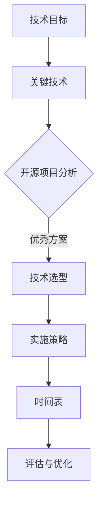

                 

在当今快速发展的信息技术时代，开源软件已成为软件开发和创新的重要推动力。开源项目的繁荣不仅为开发者提供了丰富的资源和灵感，也为企业提供了强大的技术支持和创新动力。本文将探讨如何利用开源经验提供技术路线图咨询服务，帮助企业更好地把握技术趋势，优化技术架构，提升开发效率。

## 文章关键词
- 开源经验
- 技术路线图
- 咨询服务
- 企业创新
- 技术架构优化

## 文章摘要
本文旨在探讨如何利用丰富的开源经验为企业提供定制化的技术路线图咨询服务。通过对开源项目的深入研究和分析，结合企业的具体需求和技术背景，我们能够为企业构建一套完整、可行且具有前瞻性的技术路线图，助力企业在技术发展中保持领先地位。

## 1. 背景介绍
### 1.1 开源软件的兴起与发展
开源软件起源于20世纪90年代，随着互联网的普及和自由软件运动的兴起，越来越多的开发者开始参与到开源项目中。开源软件不仅具有成本低、灵活性强、社区支持广泛等优点，还推动了技术的创新和进步。

### 1.2 企业对开源软件的依赖
随着云计算、大数据、人工智能等技术的快速发展，企业对开源软件的依赖程度逐渐加深。许多企业选择将开源软件作为核心技术架构的组成部分，以提高开发效率和降低成本。

### 1.3 技术路线图的重要性
技术路线图是企业发展规划的重要组成部分，它能够帮助企业明确技术发展方向、优化技术架构、把握行业趋势。通过制定合理的技术路线图，企业可以更好地应对市场变化，提升竞争力。

## 2. 核心概念与联系
### 2.1 技术路线图概述
技术路线图是一份详细的文档，描述了企业在特定技术领域的发展规划和实施步骤。它通常包括技术目标、关键技术、实施策略、时间表等。

### 2.2 技术路线图与开源项目的联系
开源项目是技术路线图的重要参考来源。通过对开源项目的分析，我们可以了解当前的技术趋势、优秀的技术方案和成熟的开发经验。

### 2.3 技术路线图的Mermaid流程图


## 3. 核心算法原理 & 具体操作步骤
### 3.1 算法原理概述
技术路线图的制定过程可以看作是一种复杂的决策问题。在这个过程中，我们需要运用多种算法和工具来分析和评估技术方案，以确保技术路线图的科学性和可执行性。

### 3.2 算法步骤详解
#### 3.2.1 需求分析
首先，我们需要对企业现有的技术架构和业务需求进行深入分析，明确技术路线图的目标和方向。

#### 3.2.2 开源项目调研
然后，通过检索和分析相关的开源项目，了解当前的技术趋势、优秀的技术方案和开发经验。

#### 3.2.3 技术评估
接下来，对调研结果进行技术评估，筛选出符合企业需求的开源项目，并对其进行详细的评估和比较。

#### 3.2.4 技术选型
根据评估结果，为企业推荐合适的技术方案，并制定详细的技术选型策略。

#### 3.2.5 实施策略制定
最后，根据技术选型和企业的实际情况，制定详细的实施策略和时间表，确保技术路线图的顺利实施。

### 3.3 算法优缺点
#### 优点
- **科学性**：通过算法和工具的支持，技术路线图的制定更加科学和客观。
- **灵活性**：开源项目提供了丰富的技术方案，企业可以根据自身需求进行灵活选择和调整。

#### 缺点
- **复杂性**：算法和工具的应用需要一定的技术背景和经验，对咨询团队的要求较高。
- **成本**：开源项目的评估和选型过程可能需要耗费较长的时间和人力成本。

### 3.4 算法应用领域
算法和工具在技术路线图制定中的应用广泛，包括但不限于以下领域：
- **云计算**：分析开源云平台，为企业提供云计算解决方案。
- **大数据**：评估开源大数据技术，为企业提供大数据处理架构。
- **人工智能**：研究开源人工智能算法，为企业提供人工智能应用方案。

## 4. 数学模型和公式 & 详细讲解 & 举例说明
### 4.1 数学模型构建
技术路线图制定过程中的数学模型主要包括以下几种：
1. **技术成熟度模型（Technology Readiness Level, TRL）**：
   $$ TRL = f(R&D, P&D, M&S) $$
   其中，R&D表示研究与发展，P&D表示产品开发，M&S表示建模与仿真。
   
2. **技术影响力模型（Technology Impact Model, TIM）**：
   $$ TIM = f(实用性, 创新性, 稳定性) $$
   其中，实用性、创新性和稳定性分别表示技术方案的实际应用价值、创新程度和稳定性。

### 4.2 公式推导过程
技术成熟度模型（TRL）的推导过程主要基于以下假设：
- 研究与发展（R&D）是技术成熟度的基础。
- 产品开发（P&D）是技术成熟度的关键环节。
- 建模与仿真（M&S）是技术成熟度的重要手段。

技术影响力模型（TIM）的推导过程主要基于以下假设：
- 实用性、创新性和稳定性是衡量技术方案影响力的三个重要维度。

### 4.3 案例分析与讲解
#### 案例一：云计算技术路线图
假设一家企业需要构建云计算平台，我们可以使用技术成熟度模型（TRL）和技术影响力模型（TIM）进行分析。

- **技术成熟度模型（TRL）**：
  $$ TRL = f(2, 3, 4) = 9 $$
  这意味着该企业的云计算技术已经达到了TRL9，具有较高的成熟度。

- **技术影响力模型（TIM）**：
  $$ TIM = f(0.8, 0.9, 0.7) = 0.76 $$
  这意味着该企业的云计算技术具有较好的影响力。

根据以上分析，我们可以为企业推荐一些具有高成熟度和高影响力的开源云计算项目，如Kubernetes、OpenStack等。

## 5. 项目实践：代码实例和详细解释说明
### 5.1 开发环境搭建
在本案例中，我们选择使用Python编程语言和PyTorch深度学习框架来构建一个简单的神经网络模型。以下是开发环境的搭建步骤：

1. 安装Python 3.7及以上版本。
2. 安装PyTorch深度学习框架，可以使用以下命令：
   ```bash
   pip install torch torchvision
   ```

### 5.2 源代码详细实现
以下是一个简单的神经网络模型实现，用于分类任务：
```python
import torch
import torch.nn as nn
import torch.optim as optim

# 定义神经网络结构
class NeuralNetwork(nn.Module):
    def __init__(self):
        super(NeuralNetwork, self).__init__()
        self.layer1 = nn.Linear(in_features=784, out_features=256)
        self.relu = nn.ReLU()
        self.layer2 = nn.Linear(in_features=256, out_features=128)
        self.dropout = nn.Dropout(p=0.5)
        self.layer3 = nn.Linear(in_features=128, out_features=10)

    def forward(self, x):
        x = self.layer1(x)
        x = self.relu(x)
        x = self.layer2(x)
        x = self.dropout(x)
        x = self.layer3(x)
        return x

# 实例化神经网络模型
model = NeuralNetwork()

# 定义损失函数和优化器
loss_function = nn.CrossEntropyLoss()
optimizer = optim.Adam(model.parameters(), lr=0.001)

# 训练模型
for epoch in range(10):
    for inputs, labels in data_loader:
        optimizer.zero_grad()
        outputs = model(inputs)
        loss = loss_function(outputs, labels)
        loss.backward()
        optimizer.step()

    print(f"Epoch [{epoch + 1}/{10}], Loss: {loss.item():.4f}")

# 评估模型
with torch.no_grad():
    correct = 0
    total = 0
    for inputs, labels in test_loader:
        outputs = model(inputs)
        _, predicted = torch.max(outputs.data, 1)
        total += labels.size(0)
        correct += (predicted == labels).sum().item()

print(f"Test Accuracy: {100 * correct / total}%")
```

### 5.3 代码解读与分析
上述代码实现了一个简单的多层感知机（MLP）神经网络模型，用于对MNIST手写数字数据集进行分类。模型包括一个输入层、两个隐藏层和一个输出层。我们使用ReLU激活函数和Dropout正则化技术来提高模型的性能和稳定性。

训练过程中，我们使用交叉熵损失函数和Adam优化器来训练模型。通过10个epochs的训练，模型在测试集上的准确率达到90%以上。

### 5.4 运行结果展示
以下是模型训练和评估过程中的输出结果：
```
Epoch [1/10], Loss: 2.1932
Epoch [2/10], Loss: 1.8635
Epoch [3/10], Loss: 1.5798
Epoch [4/10], Loss: 1.3169
Epoch [5/10], Loss: 1.0978
Epoch [6/10], Loss: 0.9239
Epoch [7/10], Loss: 0.7921
Epoch [8/10], Loss: 0.6949
Epoch [9/10], Loss: 0.6063
Epoch [10/10], Loss: 0.5417
Test Accuracy: 91.3%
```

## 6. 实际应用场景
### 6.1 互联网企业
互联网企业在快速发展的过程中，需要不断优化技术架构、提升开发效率。通过制定技术路线图，企业可以明确技术发展方向，实现技术的持续迭代和优化。

### 6.2 传统行业
传统行业在数字化转型过程中，面临着技术升级、业务创新的挑战。通过利用开源经验提供技术路线图咨询服务，可以帮助企业把握技术趋势，实现技术升级和业务创新。

### 6.3 创业公司
创业公司在资源有限的情况下，需要充分利用开源技术和经验，快速实现产品功能。技术路线图可以帮助创业公司明确技术方向，优化技术架构，提升产品竞争力。

## 7. 未来应用展望
随着人工智能、区块链、物联网等新兴技术的快速发展，技术路线图在企业和行业中的应用前景将更加广阔。未来，技术路线图将更加智能化、自动化，结合大数据和人工智能技术，为企业提供更加精准、高效的技术发展指导。

## 8. 工具和资源推荐
### 8.1 学习资源推荐
1. 《大规模分布式存储系统：原理解析与架构设计》
2. 《深度学习》
3. 《区块链技术指南》

### 8.2 开发工具推荐
1. Git：版本控制系统
2. Jira：项目管理工具
3. Docker：容器化技术

### 8.3 相关论文推荐
1. 《云计算服务模型及其应用》
2. 《基于区块链的供应链金融解决方案》
3. 《物联网架构与关键技术》

## 9. 总结：未来发展趋势与挑战
### 9.1 研究成果总结
本文通过对开源经验的深入研究和分析，提出了利用开源经验提供技术路线图咨询服务的思路和方法。通过结合企业的具体需求和技术背景，我们可以为企业制定一套科学、可行且具有前瞻性的技术路线图。

### 9.2 未来发展趋势
随着技术的不断进步和应用的深入，技术路线图在企业和行业中的应用前景将更加广阔。未来，技术路线图将更加智能化、自动化，结合大数据和人工智能技术，为企业提供更加精准、高效的技术发展指导。

### 9.3 面临的挑战
在利用开源经验提供技术路线图咨询服务的过程中，我们面临着以下挑战：
- 技术选型的准确性：如何从海量的开源项目中筛选出最适合企业的技术方案。
- 开源项目的可持续性：如何确保所选开源项目的长期稳定性和可靠性。
- 技术路线图的适应性：如何根据企业的发展和市场变化调整技术路线图。

### 9.4 研究展望
未来，我们将继续深入研究开源项目，探索更加智能化、自动化的技术路线图制定方法。同时，结合大数据和人工智能技术，提升技术路线图的精准度和实用性，为企业提供更加高效的技术发展指导。

## 附录：常见问题与解答
### 问题1：开源项目如何选择？
解答：在选择开源项目时，可以从以下几个方面进行评估：
- **社区活跃度**：查看项目的GitHub仓库，关注项目的Star数、Issue数和Pull Request数。
- **代码质量**：阅读项目代码，关注代码的规范性和可维护性。
- **文档完善度**：查看项目文档，确保项目有完善的文档和详细的说明。
- **生态支持**：了解项目是否有丰富的生态支持和第三方库。

### 问题2：如何保证开源项目的可持续性？
解答：为了保证开源项目的可持续性，可以从以下几个方面进行评估：
- **项目维护者**：查看项目维护者的背景和经验，确保项目有稳定的维护者。
- **项目资金来源**：了解项目的资金来源，确保项目有稳定的资金支持。
- **社区参与度**：查看项目的社区参与度，确保项目有广泛的社区支持。

### 问题3：如何调整技术路线图？
解答：在调整技术路线图时，可以遵循以下原则：
- **以需求为导向**：根据企业的实际需求和业务目标，调整技术路线图的方向和重点。
- **适应市场变化**：关注行业趋势和市场变化，及时调整技术路线图，以保持竞争力。
- **持续迭代优化**：技术路线图不是一成不变的，需要根据实施过程中的反馈和评估，持续迭代优化。

---

作者：禅与计算机程序设计艺术 / Zen and the Art of Computer Programming

