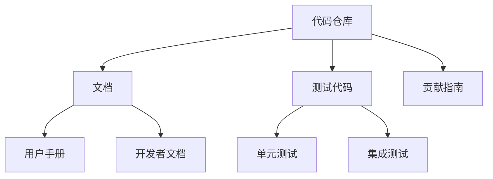

                 

关键词：开源贡献，个人品牌，影响力，技术博客，社区参与，代码质量，知识分享

> 摘要：本文旨在探讨通过开源贡献来建立个人品牌和影响力的策略。我们将分析开源项目的价值、参与开源的最佳实践、如何优化代码质量以及如何通过博客和社区活动来分享知识，最终实现个人品牌的提升。

## 1. 背景介绍

在当今信息化时代，开源软件已经成为技术发展的主流。无论是操作系统、数据库、框架还是工具，开源项目无处不在，成为开发者学习和实践的重要平台。随着开源生态的不断发展，越来越多的人开始认识到开源的贡献不仅能够提升个人的技术水平，更可以建立强大的个人品牌和影响力。

个人品牌是指个人在专业领域内建立起来的声誉和影响力，它可以帮助个人在职业生涯中取得成功。在技术领域，通过开源贡献建立个人品牌，不仅能够展示个人的技术实力，还可以为未来的职业发展积累宝贵的人脉资源。

本文将围绕以下几个核心问题展开讨论：

- 如何选择合适的开源项目参与？
- 开源贡献中的最佳实践有哪些？
- 如何提高代码质量，以获得更好的社区反馈？
- 如何通过技术博客和社区活动分享知识？
- 开源贡献对个人品牌和职业发展的长期影响是什么？

通过对这些问题的探讨，希望能够为那些希望利用开源贡献建立个人品牌和影响力的人提供一些实用的指导和建议。

## 2. 核心概念与联系

### 2.1 开源项目的基本概念

开源项目是指那些软件源代码公开的项目，允许任何人自由地查看、修改和分发。开源项目的核心特点是透明性、协作性和共享性。开源项目通常基于特定的许可证（如GPL、MIT等），这些许可证规定了项目源代码的使用和分发规则。

### 2.2 个人品牌的定义

个人品牌是指个人在某一专业领域内通过积累知识和经验，所形成的声誉和影响力。它不仅仅是一个名字，更是一个专业形象的象征。在技术领域，个人品牌可以帮助个人在职业发展中脱颖而出，获得更多的机会和资源。

### 2.3 开源贡献与个人品牌的关系

开源贡献是建立个人品牌的重要途径。通过参与开源项目，开发者可以展示自己的技术能力和解决问题的能力。这些贡献不仅会被项目社区看到，也会被潜在的雇主和合作伙伴注意到。因此，高质量的、有价值的开源贡献可以极大地提升个人品牌。

### 2.4 开源项目的结构

开源项目的结构通常包括代码仓库、文档、测试代码、贡献指南等。以下是一个简单的开源项目结构示例：



在这个结构中，代码仓库是核心，文档、测试代码和贡献指南则支持代码的维护和开发。

### 2.5 社区活动的意义

社区活动是开源项目的重要组成部分。通过参与社区活动，开发者可以与同行交流、分享经验、解决问题，同时也可以提升自己的影响力。常见的社区活动包括代码审查、技术讨论、Bug修复、新功能开发等。

### 2.6 技术博客的作用

技术博客是分享知识的重要平台。通过博客，开发者可以记录自己的学习过程、技术见解和实践经验，同时也可以吸引更多的关注和讨论。优秀的博客内容可以提升作者的个人品牌，增强其在技术社区中的影响力。

## 3. 核心算法原理 & 具体操作步骤

### 3.1 算法原理概述

开源贡献中的核心算法原理通常涉及以下几个方面：

- **算法的选择**：选择合适的算法来解决问题，这需要开发者具备深入的技术理解和广泛的算法知识。
- **算法的实现**：将算法转化为高效的代码，这需要开发者具备优秀的编程能力和对数据结构的深入理解。
- **算法的优化**：对算法进行优化，提高其运行效率和性能，这需要开发者具备对算法和程序性能的敏感度。

### 3.2 算法步骤详解

参与开源项目的具体步骤通常包括以下几个阶段：

- **项目选择**：根据个人兴趣和专业背景选择合适的项目。
- **代码审查**：在贡献代码之前，先审查项目代码，了解项目的架构和编程风格。
- **问题报告**：发现问题后，按照项目的贡献指南提交问题报告。
- **代码提交**：在解决完问题后，提交代码并附上详细的说明。
- **代码审查**：提交的代码会经过社区成员的审查，可能需要多次修改和优化。
- **代码合并**：代码经过审查并通过后，会被合并到主分支。

### 3.3 算法优缺点

- **优点**：开源贡献可以提升个人技术能力，积累实战经验，建立个人品牌。
- **缺点**：参与开源项目需要投入大量时间和精力，初期可能会面临一些挑战和困难。

### 3.4 算法应用领域

开源算法广泛应用于各种领域，如：

- **云计算**：开源的云计算平台如OpenStack、Kubernetes等。
- **大数据**：开源的大数据处理框架如Hadoop、Spark等。
- **人工智能**：开源的深度学习框架如TensorFlow、PyTorch等。

## 4. 数学模型和公式 & 详细讲解 & 举例说明

### 4.1 数学模型构建

开源贡献中的数学模型通常涉及以下几个方面：

- **算法性能评估**：使用数学模型来评估算法的性能和效率。
- **数据预处理**：使用数学模型来处理和清洗数据。
- **机器学习**：使用数学模型来构建和优化机器学习算法。

### 4.2 公式推导过程

以下是一个简单的线性回归模型的公式推导过程：

- **目标函数**：最小化预测值与真实值之间的误差。
  $$J(\theta) = \frac{1}{2m}\sum_{i=1}^{m}(h_\theta(x^{(i)}) - y^{(i)})^2$$
- **梯度下降**：通过梯度下降法更新参数。
  $$\theta_j := \theta_j - \alpha \frac{\partial}{\partial \theta_j}J(\theta)$$

### 4.3 案例分析与讲解

假设我们要使用线性回归模型来预测房价。我们有以下数据集：

| 特征 | 房价 |
| --- | --- |
| 房间数 | 3 |
| 平方数 | 100 |
| ... | ... |
| 房价 | 300000 |

我们可以使用线性回归模型来建立房价的预测模型：

$$\text{房价} = \theta_0 + \theta_1 \times \text{房间数} + \theta_2 \times \text{平方数} + ...$$

通过训练数据和梯度下降法，我们可以得到最优的参数值。然后，我们可以使用这个模型来预测新的房价。

## 5. 项目实践：代码实例和详细解释说明

### 5.1 开发环境搭建

在参与开源项目之前，首先需要搭建一个合适的开发环境。以下是一个简单的步骤：

- 安装Git：用于版本控制和代码提交。
- 安装Python：用于编程和算法实现。
- 安装相关的依赖库：例如NumPy、Pandas等。

### 5.2 源代码详细实现

以下是一个简单的线性回归模型的实现代码：

```python
import numpy as np

def compute_cost(X, y, theta):
    m = len(y)
    predictions = X.dot(theta)
    errors = predictions - y
    cost = (1/(2*m)) * (errors.T.dot(errors))
    return cost

def gradient_descent(X, y, theta, alpha, iterations):
    m = len(y)
    for i in range(iterations):
        predictions = X.dot(theta)
        errors = predictions - y
        gradient = X.T.dot(errors) / m
        theta = theta - alpha * gradient
    return theta

X = np.array([[1, x1], [1, x2], ..., [1, xn]])
y = np.array([y1, y2, ..., yn])
theta = np.array([theta0, theta1, theta2])
alpha = 0.01
iterations = 1000

theta = gradient_descent(X, y, theta, alpha, iterations)
print("最优参数：", theta)
```

### 5.3 代码解读与分析

这段代码实现了线性回归模型的训练和预测。其中，`compute_cost` 函数用于计算损失函数，`gradient_descent` 函数用于进行梯度下降法的迭代。通过迭代计算，我们可以得到最优的参数值。

### 5.4 运行结果展示

在运行代码后，我们得到的最优参数值可以用来预测新的房价。例如，对于一个新的房间数和平方数，我们可以使用以下代码进行预测：

```python
new_room = 4
new_area = 120
new_prediction = np.array([[1, new_room], [1, new_area]]).dot(theta)
print("预测房价：", new_prediction)
```

## 6. 实际应用场景

开源贡献可以在多个领域发挥作用，以下是一些实际应用场景：

- **软件开发**：参与开源项目，贡献代码和文档，提升项目的质量和稳定性。
- **科研工作**：通过开源贡献，分享研究成果，促进学术交流和合作。
- **技术社区**：通过技术博客和社区活动，分享知识，建立个人品牌和影响力。
- **教育培训**：利用开源资源和项目，设计和实施课程，培养新一代技术人才。

### 6.4 未来应用展望

随着开源生态的不断发展和完善，开源贡献在个人品牌和职业发展中的作用将越来越重要。未来，我们可以预见以下几个方面的发展趋势：

- **开源与商业的深度融合**：越来越多的企业将开源作为商业战略的一部分，开源项目将成为企业创新的重要引擎。
- **开源社区的专业化**：开源社区将更加专业化和精细化，不同领域和层次的贡献者将发挥各自的作用。
- **开源教育的普及**：开源将成为教育的重要组成部分，更多的教育资源和项目将向开源社区开放。
- **开源与人工智能的结合**：开源项目将更加智能化，利用人工智能技术进行自动化测试、代码审查等。

## 7. 工具和资源推荐

### 7.1 学习资源推荐

- **在线课程**：Coursera、edX、Udemy等平台提供了丰富的技术课程。
- **技术博客**：Medium、Dev.to、Stack Overflow Blogs等平台提供了大量高质量的技术文章。
- **开源项目**：GitHub、GitLab、Bitbucket等平台提供了丰富的开源资源和项目。

### 7.2 开发工具推荐

- **版本控制工具**：Git、SVN、Mercurial等。
- **编程语言**：Python、Java、C++、Go等。
- **开发环境**：Visual Studio Code、Eclipse、IntelliJ IDEA等。

### 7.3 相关论文推荐

- **“The Cathedral and the Bazaar”**：Eric S. Raymond关于开源运动的重要论文。
- **“Open Source Model of Innovation”**：关于开源模式创新的研究论文。
- **“The Structure and Dynamics of Open Source Software Development”**：关于开源软件开发结构和动力学的论文。

## 8. 总结：未来发展趋势与挑战

### 8.1 研究成果总结

通过本文的探讨，我们可以得出以下结论：

- 开源贡献是建立个人品牌和影响力的重要途径。
- 选择合适的项目、遵循最佳实践、提高代码质量是成功参与开源的关键。
- 通过博客和社区活动分享知识可以增强个人在技术社区中的影响力。
- 开源贡献对个人职业发展具有长期的积极影响。

### 8.2 未来发展趋势

随着开源生态的不断发展，我们可以预见以下发展趋势：

- 开源与商业的深度融合，开源将成为企业创新的重要引擎。
- 开源社区的专业化和精细化，不同领域和层次的贡献者将发挥各自的作用。
- 开源教育的普及，开源将成为教育的重要组成部分。
- 开源与人工智能的结合，将带来更多的创新和可能性。

### 8.3 面临的挑战

尽管开源贡献具有巨大的潜力，但在实际操作中也面临一些挑战：

- 时间和精力的投入：参与开源项目需要投入大量的时间和精力。
- 技术门槛：参与开源项目需要具备一定的技术能力和编程水平。
- 社区规范和合作：遵守社区规范和有效地合作是成功参与开源的重要保障。

### 8.4 研究展望

未来的研究可以从以下几个方面展开：

- 开源贡献对个人职业发展的长期影响机制研究。
- 开源项目成功的关键因素分析。
- 开源与商业合作的模式研究。
- 开源教育和培训的有效性研究。

通过这些研究，我们可以更好地理解开源贡献的机制和效果，为更多的人提供实用的指导和建议。

## 9. 附录：常见问题与解答

### 9.1 如何选择合适的项目？

- **根据兴趣选择**：选择自己感兴趣的项目，这样可以保持持续的动力和热情。
- **考虑项目的重要性和影响力**：优先考虑那些重要且具有广泛影响力的项目。
- **查阅项目文档**：仔细阅读项目的贡献指南，了解项目的需求和目标。

### 9.2 如何提高代码质量？

- **代码审查**：在提交代码之前，自己先进行代码审查，确保代码的规范性和质量。
- **单元测试**：编写单元测试，确保代码的功能正确性和稳定性。
- **遵循编码规范**：遵循项目或社区的编码规范，确保代码的可读性和可维护性。

### 9.3 如何建立个人品牌？

- **持续贡献**：长期且持续地在开源项目中贡献高质量代码。
- **分享知识**：通过技术博客、社区活动等方式分享自己的知识和经验。
- **参与社区**：积极参与社区讨论，建立良好的人际关系和网络。

### 9.4 如何应对开源贡献的挑战？

- **合理规划时间**：合理安排时间和任务，确保能够兼顾开源贡献和个人生活。
- **学习与成长**：不断提升自己的技术能力和编程水平，以应对技术挑战。
- **保持耐心与毅力**：开源贡献是一个长期且艰苦的过程，需要保持耐心和毅力。

