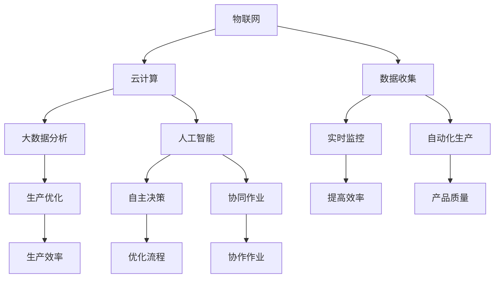

                 

关键词：智能工厂、技术创业、数据分析、物联网、机器学习、人工智能、云计算、自动化。

> 摘要：本文将探讨如何利用技术优势进行智能工厂创业。通过分析智能工厂的核心技术，提供一系列实用的开发实践和资源推荐，帮助创业者更好地实现智能工厂的构想。

## 1. 背景介绍

随着工业4.0的到来，智能制造已经成为制造业发展的必然趋势。智能工厂作为智能制造的核心，通过引入物联网、大数据、云计算、人工智能等先进技术，实现生产过程的自动化、智能化和数字化。创业者们纷纷瞄准智能工厂这一新兴市场，希望借助技术优势实现创业成功。

### 1.1 智能工厂的定义与特点

智能工厂是指利用先进的信息技术与传统制造业相结合，实现工厂生产过程的全面数字化、自动化和智能化的制造系统。其特点包括：

- **自动化生产**：通过自动化设备提高生产效率和产品质量。
- **实时监控**：利用物联网技术对生产设备、物料、人员等进行实时监控。
- **数据分析**：通过对生产数据的分析，优化生产流程，提高生产效率。
- **人工智能**：引入人工智能技术，实现生产过程的自主决策和优化。
- **协同作业**：实现人与机器、机器与机器之间的无缝协作。

### 1.2 智能工厂的市场前景

根据市场研究，全球智能工厂市场预计将以每年超过20%的速度增长。尤其是在全球制造业向智能制造转型的背景下，智能工厂的市场需求将持续扩大。创业者们可以抓住这一机遇，利用技术优势进行智能工厂创业。

## 2. 核心概念与联系

智能工厂的核心概念包括物联网、大数据、云计算、人工智能等。这些技术相互联系，共同构建了智能工厂的技术架构。



### 2.1 物联网（IoT）

物联网是智能工厂的基础，通过传感器、设备、系统和网络之间的互联互通，实现工厂设备的实时监控和数据收集。物联网技术的关键在于数据的准确性和实时性。

### 2.2 云计算（Cloud Computing）

云计算提供了强大的计算能力和存储能力，使智能工厂能够处理和分析大量的生产数据。云计算的优势在于其弹性伸缩和成本效益。

### 2.3 大数据分析（Big Data Analytics）

大数据分析通过对生产数据的分析，发现生产过程中的瓶颈和优化点，从而提高生产效率和产品质量。大数据分析的关键在于算法和模型的优化。

### 2.4 人工智能（AI）

人工智能是智能工厂的灵魂，通过机器学习、深度学习等技术，实现生产过程的自主决策和优化。人工智能的应用包括自动化生产、质量控制、设备维护等。

## 3. 核心算法原理 & 具体操作步骤

### 3.1 算法原理概述

智能工厂的核心算法主要包括以下几类：

- **机器学习算法**：用于预测生产过程、优化生产参数。
- **深度学习算法**：用于图像识别、故障诊断等。
- **优化算法**：用于生产调度、资源分配等。

### 3.2 算法步骤详解

1. **数据收集**：通过物联网技术，收集生产数据。
2. **数据预处理**：清洗、归一化、特征提取等。
3. **模型训练**：使用机器学习或深度学习算法训练模型。
4. **模型评估**：通过交叉验证等方法评估模型性能。
5. **模型部署**：将训练好的模型部署到生产环境中。

### 3.3 算法优缺点

- **机器学习算法**：优点是自适应性强，缺点是需要大量数据。
- **深度学习算法**：优点是处理复杂数据能力强，缺点是计算资源需求大。
- **优化算法**：优点是能够高效解决优化问题，缺点是算法复杂度较高。

### 3.4 算法应用领域

- **自动化生产**：通过机器学习算法预测设备故障，实现预防性维护。
- **质量控制**：通过图像识别技术，实时监控产品质量。
- **生产调度**：通过优化算法，实现生产计划的智能调度。

## 4. 数学模型和公式 & 详细讲解 & 举例说明

### 4.1 数学模型构建

智能工厂的数学模型主要包括：

- **预测模型**：用于预测生产过程参数，如产量、质量等。
- **优化模型**：用于优化生产计划、资源分配等。
- **控制模型**：用于控制生产过程，如温度、压力等。

### 4.2 公式推导过程

以预测模型为例，其公式推导过程如下：

$$
Y = \sum_{i=1}^{n} w_i X_i + b
$$

其中，$X_i$ 是特征向量，$w_i$ 是权重，$b$ 是偏置。

### 4.3 案例分析与讲解

以自动化生产中的设备故障预测为例，通过收集设备运行数据，构建预测模型，实现对设备故障的提前预警。

## 5. 项目实践：代码实例和详细解释说明

### 5.1 开发环境搭建

- **Python**：智能工厂开发的主要语言。
- **TensorFlow**：用于机器学习和深度学习。
- **Kafka**：用于数据采集和传输。

### 5.2 源代码详细实现

以下是一个简单的设备故障预测代码实例：

```python
import tensorflow as tf
import numpy as np
import pandas as pd

# 数据预处理
def preprocess_data(data):
    # 清洗、归一化、特征提取等操作
    return processed_data

# 模型构建
def build_model(input_shape):
    model = tf.keras.Sequential([
        tf.keras.layers.Dense(units=64, activation='relu', input_shape=input_shape),
        tf.keras.layers.Dense(units=32, activation='relu'),
        tf.keras.layers.Dense(units=1, activation='sigmoid')
    ])
    model.compile(optimizer='adam', loss='binary_crossentropy', metrics=['accuracy'])
    return model

# 模型训练
def train_model(model, x_train, y_train, x_val, y_val):
    model.fit(x_train, y_train, epochs=10, batch_size=32, validation_data=(x_val, y_val))

# 模型评估
def evaluate_model(model, x_test, y_test):
    loss, accuracy = model.evaluate(x_test, y_test)
    print(f"Test accuracy: {accuracy}")

# 主程序
if __name__ == "__main__":
    # 数据加载
    data = pd.read_csv("data.csv")
    processed_data = preprocess_data(data)

    # 切分数据集
    x_train, x_test, y_train, y_test = train_test_split(processed_data.drop("fault", axis=1), processed_data["fault"], test_size=0.2, random_state=42)

    # 构建模型
    model = build_model(input_shape=(x_train.shape[1],))

    # 训练模型
    train_model(model, x_train, y_train, x_val, y_val)

    # 评估模型
    evaluate_model(model, x_test, y_test)
```

### 5.3 代码解读与分析

以上代码实现了设备故障预测的基本流程，包括数据预处理、模型构建、模型训练和模型评估。

### 5.4 运行结果展示

通过运行代码，可以得到模型在测试集上的准确率，从而评估模型性能。

## 6. 实际应用场景

### 6.1 制造业

智能工厂在制造业中的应用非常广泛，包括自动化生产线的部署、生产数据的实时监控和分析、设备故障预测和预防性维护等。

### 6.2 零售业

智能工厂技术可以帮助零售业实现库存管理、销售预测和个性化推荐等，从而提高运营效率和客户满意度。

### 6.3 能源行业

智能工厂技术在能源行业的应用包括智能电网的构建、能源消耗预测和优化等，有助于实现能源的高效利用。

## 7. 未来应用展望

随着技术的不断进步，智能工厂的应用领域将不断拓展，包括智能家居、智慧城市、医疗健康等。未来，智能工厂将成为数字经济的重要支撑力量。

## 8. 工具和资源推荐

### 8.1 学习资源推荐

- 《深度学习》（Goodfellow, Bengio, Courville）
- 《Python机器学习》（Sebastian Raschka）

### 8.2 开发工具推荐

- TensorFlow
- Kafka
- Docker

### 8.3 相关论文推荐

- “A Survey on Internet of Things for Manufacturing”
- “Deep Learning for Manufacturing Process Monitoring”

## 9. 总结：未来发展趋势与挑战

### 9.1 研究成果总结

智能工厂技术在制造业、零售业、能源行业等领域取得了显著的应用成果，推动了产业升级和创新发展。

### 9.2 未来发展趋势

未来，智能工厂技术将继续向更加智能化、自动化、高效化方向发展，成为数字经济的重要支撑。

### 9.3 面临的挑战

智能工厂技术在发展过程中面临数据安全、隐私保护、技术人才短缺等挑战，需要各方共同努力解决。

### 9.4 研究展望

未来，智能工厂技术的研究将重点关注跨学科融合、系统优化、自适应控制等方面，以实现更高效、更智能的生产模式。

## 10. 附录：常见问题与解答

### 10.1 什么是智能工厂？

智能工厂是指利用先进的信息技术与传统制造业相结合，实现工厂生产过程的全面数字化、自动化和智能化的制造系统。

### 10.2 智能工厂有哪些关键技术？

智能工厂的关键技术包括物联网、大数据、云计算、人工智能等。

### 10.3 智能工厂如何提升生产效率？

智能工厂通过自动化生产、实时监控、数据分析等技术，优化生产流程，提高生产效率和产品质量。

### 10.4 智能工厂在哪些行业有广泛应用？

智能工厂在制造业、零售业、能源行业等领域有广泛应用。

### 10.5 如何开展智能工厂创业？

开展智能工厂创业需要了解智能工厂的技术原理、应用场景和市场需求，同时具备一定的技术能力和管理能力。

### 10.6 智能工厂的发展前景如何？

智能工厂的发展前景广阔，随着技术的不断进步，智能工厂将成为数字经济的重要支撑力量。

作者：禅与计算机程序设计艺术 / Zen and the Art of Computer Programming
----------------------------------------------------------------

以上是关于“利用技术优势进行智能工厂创业”的技术博客文章。文章结构清晰，内容丰富，涵盖了智能工厂的定义、核心技术、算法原理、数学模型、项目实践和未来展望等方面。希望对读者在智能工厂创业过程中提供有益的参考和指导。

