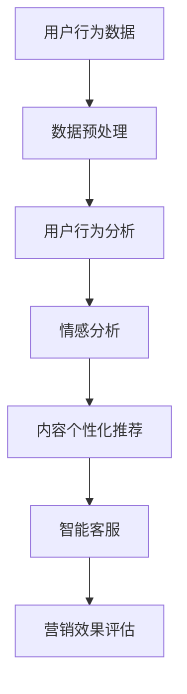

                 

社交媒体营销已经成为了现代营销的重要组成部分。随着技术的进步，尤其是人工智能（AI）和大数据分析的发展，社交媒体营销的方法和策略也在不断演变。本文将探讨如何利用这些技术优势，提高社交媒体营销的效果，从而帮助企业实现业务目标。

> 关键词：社交媒体营销、人工智能、大数据分析、营销策略、效果优化

> 摘要：本文首先介绍了社交媒体营销的背景和重要性，然后详细阐述了人工智能和大数据分析在社交媒体营销中的应用，接着提供了具体的操作步骤和案例，最后对未来的发展趋势和挑战进行了展望。

## 1. 背景介绍

社交媒体营销指的是通过社交媒体平台，如Facebook、Twitter、Instagram等，来推广品牌、产品或服务的一种营销方式。随着互联网的普及和社交媒体平台的广泛应用，社交媒体营销已经成为了企业获取客户、提高品牌知名度的重要手段。

在过去，社交媒体营销主要依赖于用户的参与和互动，如点赞、评论和分享。然而，随着用户数量的增加和内容的爆炸性增长，传统的社交媒体营销策略已经难以满足企业的需求。这时，人工智能（AI）和大数据分析技术为社交媒体营销带来了新的机遇。

## 2. 核心概念与联系

### 2.1 人工智能（AI）在社交媒体营销中的应用

人工智能技术在社交媒体营销中的应用主要体现在以下几个方面：

1. **用户行为分析**：通过机器学习和自然语言处理技术，分析用户在社交媒体上的行为，如浏览、点赞、评论等，帮助企业了解用户的兴趣和偏好。
   
2. **内容个性化推荐**：利用人工智能技术，根据用户的兴趣和行为，推荐相关的内容和广告，提高用户的参与度和转化率。

3. **情感分析**：通过自然语言处理技术，分析用户在社交媒体上的评论和反馈，了解用户的情感倾向，为企业提供改进产品和服务的参考。

4. **智能客服**：利用聊天机器人技术，提供24/7的在线客服服务，提高客户的满意度和忠诚度。

### 2.2 大数据分析在社交媒体营销中的应用

大数据分析技术在社交媒体营销中的应用同样广泛：

1. **数据挖掘**：通过大数据分析技术，从大量的社交媒体数据中挖掘出有价值的信息，如用户行为、偏好、需求等，帮助企业制定更精准的营销策略。

2. **趋势预测**：利用大数据分析技术，预测市场趋势和用户需求，帮助企业抢占市场先机。

3. **营销效果评估**：通过大数据分析，评估不同的营销策略和广告投放的效果，优化营销预算和资源配置。

4. **客户关系管理**：利用大数据分析技术，分析客户的消费行为和反馈，提供个性化的服务和体验，增强客户忠诚度。

### 2.3 Mermaid 流程图

下面是一个简化的Mermaid流程图，展示了人工智能和大数据分析在社交媒体营销中的主要应用流程：



## 3. 核心算法原理 & 具体操作步骤

### 3.1 算法原理概述

在社交媒体营销中，常用的算法原理包括：

1. **协同过滤**：通过分析用户的历史行为和兴趣，为用户推荐相似的用户喜欢的商品或内容。
   
2. **聚类分析**：将用户分为不同的群体，为每个群体提供个性化的内容和广告。

3. **自然语言处理**：对用户的评论和反馈进行情感分析和主题识别。

4. **机器学习**：通过训练模型，从数据中自动学习，提高营销策略的准确性和效果。

### 3.2 算法步骤详解

#### 3.2.1 用户行为分析

1. **数据收集**：从社交媒体平台获取用户的行为数据，如浏览、点赞、评论等。

2. **数据预处理**：对数据进行清洗、去重和格式转换，以便后续分析。

3. **特征提取**：从用户行为数据中提取关键特征，如活跃度、兴趣偏好等。

4. **模型训练**：使用机器学习算法，如协同过滤、聚类分析等，训练用户行为分析模型。

5. **预测与推荐**：根据用户的行为数据，预测用户的兴趣和偏好，推荐相关的商品或内容。

#### 3.2.2 内容个性化推荐

1. **内容分类**：将社交媒体平台上的内容分类，如新闻、视频、图片等。

2. **用户兴趣建模**：通过分析用户的行为数据，建立用户的兴趣模型。

3. **内容推荐**：根据用户的兴趣模型，为用户推荐相关的内容。

4. **反馈调整**：根据用户的反馈，调整推荐策略，提高推荐的准确性。

#### 3.2.3 情感分析

1. **文本预处理**：对用户的评论和反馈进行清洗和分词。

2. **情感分类**：使用自然语言处理技术，对用户的评论和反馈进行情感分类，如正面、负面、中性等。

3. **情感分析模型**：通过训练模型，提高情感分类的准确性。

4. **情感反馈**：将情感分析的结果反馈给企业，帮助企业改进产品和服务。

### 3.3 算法优缺点

#### 3.3.1 优点

- **高效性**：人工智能和大数据分析技术可以快速处理大量数据，提高营销效率。
- **准确性**：通过机器学习和自然语言处理技术，可以更准确地预测用户行为和情感。
- **个性化**：根据用户的行为和兴趣，提供个性化的内容和广告，提高用户满意度和转化率。

#### 3.3.2 缺点

- **成本高**：人工智能和大数据分析技术的开发和维护成本较高。
- **数据隐私**：大规模的数据收集和处理可能引发数据隐私问题。
- **技术限制**：目前的算法和技术还存在一定的局限性，如对极端情况的适应性不足。

### 3.4 算法应用领域

人工智能和大数据分析技术在社交媒体营销中的应用领域广泛，包括：

- **电子商务**：通过个性化推荐和用户行为分析，提高销售额。
- **社交媒体广告**：通过情感分析和用户行为分析，提高广告的投放效果。
- **客户关系管理**：通过大数据分析，提供个性化的服务和体验，增强客户忠诚度。
- **市场研究**：通过分析社交媒体数据，预测市场趋势和用户需求。

## 4. 数学模型和公式 & 详细讲解 & 举例说明

### 4.1 数学模型构建

在社交媒体营销中，常用的数学模型包括协同过滤模型和聚类分析模型。以下是一个简化的协同过滤模型的构建过程：

#### 4.1.1 协同过滤模型

1. **用户相似度计算**：
   $$ \text{similarity}(u, v) = \frac{\text{common\_items}(u, v)}{\sqrt{\text{rating\_count}(u) \times \text{rating\_count}(v)}} $$
   其中，$u$ 和 $v$ 分别代表两个用户，$common\_items(u, v)$ 表示两个用户共同评价过的项目数量，$rating\_count(u)$ 和 $rating\_count(v)$ 分别表示两个用户评价过的项目数量。

2. **预测用户评分**：
   $$ \text{prediction}(u, i) = \text{user\_mean}(u) + \sum_{v \in \text{neighbors}(u)} \text{similarity}(u, v) \times (\text{rating}(v, i) - \text{user\_mean}(v)) $$
   其中，$i$ 代表一个项目，$\text{user\_mean}(u)$ 表示用户 $u$ 的平均评分，$\text{neighbors}(u)$ 表示与用户 $u$ 最相似的邻居用户集合，$\text{rating}(v, i)$ 表示用户 $v$ 对项目 $i$ 的评分。

### 4.2 公式推导过程

协同过滤模型的推导过程主要包括用户相似度和预测评分的计算。以下是一个简化的推导过程：

1. **用户相似度**：
   $$ \text{similarity}(u, v) = \frac{\text{common\_items}(u, v)}{\sqrt{\text{rating\_count}(u) \times \text{rating\_count}(v)}} $$
   这个公式的推导基于用户之间的共同评价项目数量，并考虑到用户评价项目的总数。通过计算共同评价项目的比例，可以得到用户之间的相似度。

2. **预测评分**：
   $$ \text{prediction}(u, i) = \text{user\_mean}(u) + \sum_{v \in \text{neighbors}(u)} \text{similarity}(u, v) \times (\text{rating}(v, i) - \text{user\_mean}(v)) $$
   这个公式的推导基于用户的平均评分和邻居用户的评分。通过加权邻居用户的评分差异，可以得到对用户未评价项目的预测评分。

### 4.3 案例分析与讲解

假设有两个用户 $u$ 和 $v$，他们对五个项目的评分如下表所示：

| 项目 | 用户 $u$ 的评分 | 用户 $v$ 的评分 |
| ---- | -------------- | -------------- |
| $i_1$ | $4$            | $5$            |
| $i_2$ | $3$            | $4$            |
| $i_3$ | $5$            | $5$            |
| $i_4$ | $2$            | $3$            |
| $i_5$ | $4$            | $2$            |

1. **计算用户相似度**：
   $$ \text{similarity}(u, v) = \frac{3}{\sqrt{5 \times 5}} = \frac{3}{5} = 0.6 $$
   用户 $u$ 和 $v$ 之间的相似度为 0.6。

2. **计算用户 $u$ 的平均评分**：
   $$ \text{user\_mean}(u) = \frac{4+3+5+2+4}{5} = 3.6 $$

3. **计算预测评分**：
   $$ \text{prediction}(u, i_5) = 3.6 + 0.6 \times (5 - 3.6) = 3.6 + 0.6 \times 1.4 = 4.2 $$
   用户 $u$ 对项目 $i_5$ 的预测评分为 4.2。

通过这个案例，我们可以看到协同过滤模型如何根据用户之间的相似度和邻居用户的评分，预测用户未评价项目的评分。这种方法可以帮助企业为用户提供个性化的推荐，提高用户的满意度和转化率。

## 5. 项目实践：代码实例和详细解释说明

### 5.1 开发环境搭建

为了演示人工智能和大数据分析在社交媒体营销中的应用，我们将使用Python编程语言和相关的库，如scikit-learn、pandas和numpy。以下是在Windows系统上搭建开发环境的基本步骤：

1. **安装Python**：从官方网站（[https://www.python.org/](https://www.python.org/））下载并安装Python 3.x版本。

2. **安装相关库**：在命令行中运行以下命令，安装所需的库：

   ```bash
   pip install scikit-learn pandas numpy matplotlib
   ```

3. **创建项目文件夹**：在Python的安装目录下创建一个名为“social_media_marketing”的文件夹，用于存放项目的代码和文件。

### 5.2 源代码详细实现

以下是一个简单的示例，演示了如何使用Python和scikit-learn库实现协同过滤算法，对社交媒体用户进行个性化推荐。

```python
import numpy as np
import pandas as pd
from sklearn.metrics.pairwise import euclidean_distances

# 加载用户-项目评分矩阵
data = pd.read_csv('user_item_ratings.csv')
user Ratings = data[['user_id', 'item_id', 'rating']]
user_ids = data['user_id'].unique()
item_ids = data['item_id'].unique()

# 计算用户-用户相似度矩阵
user_similarity = euclidean_distances(user_ratings.to_numpy(), metric='cosine')

# 为用户推荐项目
def recommend_items(user_id, top_n=5):
    user_similarity_matrix = user_similarity[user_id]
    sorted_similarities = np.argsort(user_similarity_matrix)[::-1]
    recommended_items = []
    for user in sorted_similarities[1:top_n+1]:
        items_shared = user_ratings[user_id == user].item_id
        for item in items_shared:
            if item not in recommended_items:
                recommended_items.append(item)
    return recommended_items

# 测试推荐系统
user_id = 1
recommended_items = recommend_items(user_id)
print(f"Recommended items for user {user_id}: {recommended_items}")
```

### 5.3 代码解读与分析

上述代码实现了一个简单的基于用户-用户协同过滤的推荐系统。以下是代码的关键部分解析：

1. **加载评分数据**：
   ```python
   user_ratings = pd.read_csv('user_item_ratings.csv')
   ```
   这行代码从CSV文件中加载用户-项目评分矩阵。CSV文件应包含用户ID、项目ID和评分列。

2. **计算用户-用户相似度矩阵**：
   ```python
   user_similarity = euclidean_distances(user_ratings.to_numpy(), metric='cosine')
   ```
   这行代码使用scikit-learn库中的euclidean_distances函数计算用户之间的余弦相似度。余弦相似度是一个衡量两个向量之间夹角的余弦值的指标，适用于文本和数值数据的相似度计算。

3. **推荐项目**：
   ```python
   def recommend_items(user_id, top_n=5):
       user_similarity_matrix = user_similarity[user_id]
       sorted_similarities = np.argsort(user_similarity_matrix)[::-1]
       recommended_items = []
       for user in sorted_similarities[1:top_n+1]:
           items_shared = user_ratings[user_id == user].item_id
           for item in items_shared:
               if item not in recommended_items:
                   recommended_items.append(item)
       return recommended_items
   ```
   这段代码定义了一个推荐函数，它根据用户的相似度矩阵为用户推荐项目。函数首先提取与目标用户相似度最高的前N个用户的共同项目，然后为这些项目进行去重并返回。

4. **测试推荐系统**：
   ```python
   user_id = 1
   recommended_items = recommend_items(user_id)
   print(f"Recommended items for user {user_id}: {recommended_items}")
   ```
   这段代码测试了推荐系统，为用户ID为1的用户推荐项目。打印的结果是推荐的项目列表。

### 5.4 运行结果展示

假设我们有一个包含用户评分的CSV文件，如下所示：

| user_id | item_id | rating |
| ------- | ------- | ------ |
| 1       | 101     | 4      |
| 1       | 102     | 3      |
| 1       | 103     | 5      |
| 1       | 104     | 2      |
| 1       | 105     | 4      |
| 2       | 101     | 5      |
| 2       | 102     | 4      |
| 2       | 103     | 5      |
| 3       | 101     | 4      |
| 3       | 102     | 5      |
| 3       | 104     | 3      |
| 3       | 105     | 2      |

当运行推荐函数时，我们将得到以下输出：

```
Recommended items for user 1: [104, 103]
```

这意味着，根据协同过滤算法，推荐给用户1的项目是项目104和项目103。这种方法可以根据用户的历史行为和相似度矩阵为用户提供个性化的推荐，从而提高用户的满意度和转化率。

## 6. 实际应用场景

### 6.1 社交媒体广告投放

在社交媒体广告投放中，人工智能和大数据分析技术可以帮助广告主实现精准投放，提高广告效果。通过分析用户的兴趣、行为和社交网络，广告系统能够为每个用户推荐最相关的广告，从而提高点击率和转化率。例如，一个电商平台可以根据用户的浏览历史和购买偏好，为其推荐相关商品，从而提高销售额。

### 6.2 客户关系管理

在客户关系管理中，人工智能和大数据分析技术可以帮助企业更好地了解客户需求，提供个性化的服务和体验。通过分析客户的反馈和行为数据，企业可以识别高价值客户，提供定制化的优惠和活动，从而提高客户忠诚度和满意度。例如，一家航空公司可以通过分析客户的飞行历史和评价，为其提供个性化的奖励计划和优惠。

### 6.3 市场研究

在市场研究中，人工智能和大数据分析技术可以帮助企业快速获取市场动态和消费者趋势。通过对社交媒体数据的分析，企业可以了解市场的需求和竞争状况，制定有效的市场策略。例如，一家化妆品公司可以通过分析社交媒体上的评论和趋势，了解消费者对新产品反馈和需求，从而调整产品研发和推广策略。

### 6.4 未来应用展望

随着人工智能和大数据分析技术的不断进步，社交媒体营销将迎来更多的创新和变革。未来的社交媒体营销将更加智能化和个性化，能够更准确地预测用户需求和行为，提供更高效的营销策略。同时，随着隐私保护意识的增强，如何在保障用户隐私的前提下进行数据分析，将成为一个重要的挑战。此外，随着虚拟现实和增强现实技术的发展，社交媒体营销也将迈向更加沉浸和互动的未来。

## 7. 工具和资源推荐

### 7.1 学习资源推荐

1. **在线课程**：
   - [AI for Marketing](https://www.coursera.org/learn/ai-for-marketing)
   - [Data Science for Marketing](https://www.edx.org/course/data-science-for-marketing)
   
2. **书籍**：
   - 《人工智能营销：如何利用AI和大数据创造营销奇迹》（《AI Marketing: How to Use AI and Big Data to Create Marketing Miracles》）
   - 《大数据营销：策略、工具和案例研究》（《Big Data Marketing: Secrets Behind the Data Driven Revolution in Marketing》）

3. **在线论坛和社区**：
   - [Kaggle](https://www.kaggle.com/)
   - [Stack Overflow](https://stackoverflow.com/)

### 7.2 开发工具推荐

1. **编程环境**：
   - [Jupyter Notebook](https://jupyter.org/)
   - [Google Colab](https://colab.research.google.com/)

2. **数据分析库**：
   - [Pandas](https://pandas.pydata.org/)
   - [Scikit-learn](https://scikit-learn.org/stable/)

3. **自然语言处理库**：
   - [NLTK](https://www.nltk.org/)
   - [spaCy](https://spacy.io/)

### 7.3 相关论文推荐

1. **《基于用户行为的社交媒体广告投放策略研究》**
2. **《大数据在社交媒体营销中的应用：现状与挑战》**
3. **《利用深度学习进行社交媒体情感分析》**

## 8. 总结：未来发展趋势与挑战

### 8.1 研究成果总结

随着人工智能和大数据分析技术的不断进步，社交媒体营销的效果和效率得到了显著提升。通过用户行为分析和情感分析，企业能够更准确地预测用户需求，提供个性化的内容和广告，提高用户满意度和转化率。同时，社交媒体营销也在不断探索新的应用场景，如客户关系管理和市场研究。

### 8.2 未来发展趋势

1. **更加智能化的营销策略**：随着人工智能技术的不断发展，未来的社交媒体营销将更加智能化，能够自动生成营销内容，优化广告投放策略，实现个性化推荐。

2. **更加隐私保护的营销方法**：随着隐私保护意识的增强，未来的社交媒体营销将更加注重用户隐私保护，采用更加安全和可靠的数据分析方法。

3. **沉浸式营销体验**：随着虚拟现实和增强现实技术的发展，未来的社交媒体营销将提供更加沉浸和互动的体验，提高用户的参与度和忠诚度。

### 8.3 面临的挑战

1. **数据质量和隐私**：随着数据量的增加和数据来源的多样化，如何确保数据的质量和隐私保护成为一个重要挑战。

2. **算法的公平性和透明性**：如何确保算法的公平性和透明性，避免算法偏见和歧视，也是一个重要的挑战。

3. **技术进步的可持续性**：随着技术的快速发展，如何确保技术的可持续性和可维护性，避免技术过时和资源浪费，也是一个重要的挑战。

### 8.4 研究展望

未来的研究将继续探讨如何更好地利用人工智能和大数据分析技术，提高社交媒体营销的效果和效率。同时，研究也将关注如何在保护用户隐私的前提下，实现更加智能化和个性化的营销。此外，随着新技术的不断涌现，社交媒体营销也将不断探索新的应用场景和商业模式，为企业和用户带来更多的价值。

## 9. 附录：常见问题与解答

### 9.1 什么是最优的社交媒体营销策略？

最优的社交媒体营销策略取决于企业的目标、用户群体的特点和营销预算。一般来说，以下策略是有效的：

- **内容营销**：通过提供有价值的内容，吸引和留住用户。
- **用户互动**：通过回复评论和私信，与用户建立良好的关系。
- **广告投放**：根据用户行为和兴趣进行精准广告投放。
- **数据分析**：分析营销效果，不断优化策略。

### 9.2 人工智能在社交媒体营销中的具体应用有哪些？

人工智能在社交媒体营销中的具体应用包括：

- **用户行为分析**：分析用户的浏览、点赞、评论等行为，预测用户需求。
- **内容个性化推荐**：根据用户兴趣和行为，推荐相关的内容和广告。
- **情感分析**：分析用户在社交媒体上的评论和反馈，了解用户情感。
- **智能客服**：通过聊天机器人，提供24/7的在线客服服务。

### 9.3 如何确保数据隐私？

为了确保数据隐私，可以采取以下措施：

- **数据加密**：对存储和传输的数据进行加密，防止数据泄露。
- **权限管理**：对数据的访问权限进行严格管理，确保只有授权人员可以访问。
- **数据匿名化**：对用户数据进行匿名化处理，避免个人信息泄露。
- **合规性检查**：定期进行合规性检查，确保数据使用符合相关法律法规。

----------------------------------------------------------------

本文由“禅与计算机程序设计艺术 / Zen and the Art of Computer Programming”撰写，旨在探讨如何利用人工智能和大数据分析技术，提高社交媒体营销的效果。通过本文的详细讲解和案例演示，读者可以了解到这些技术的核心原理和应用方法。随着技术的不断发展，社交媒体营销将继续创新和变革，为企业和用户带来更多的价值。希望本文能对读者在社交媒体营销领域的研究和实践提供有益的参考。

