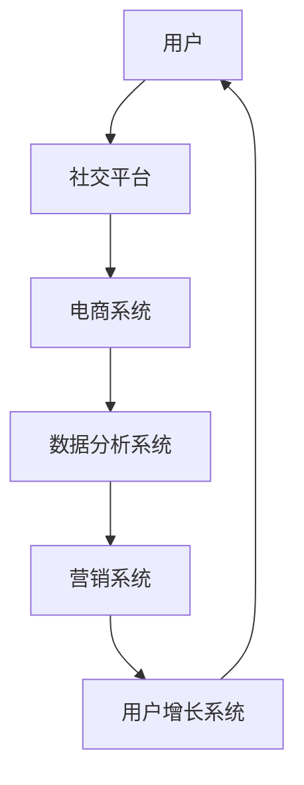

                 

关键词：社交电商、技术赋能、数据分析、个性化推荐、用户增长策略、算法优化、平台架构

摘要：随着互联网技术的飞速发展，社交电商已经成为电商行业的重要分支。本文将探讨如何利用技术优势，如数据分析、个性化推荐和算法优化，来提升社交电商的运营效率，促进用户增长，并展望未来的发展趋势与挑战。

## 1. 背景介绍

社交电商，顾名思义，是指通过社交媒体平台进行的电子商务活动。它结合了社交网络的传播力和电商的购买力，使商品推广和交易过程更加便捷和高效。随着移动互联网的普及，社交电商在全球范围内迅速崛起，成为电商企业新的增长点。

在社交电商的发展过程中，技术的作用愈发突出。数据分析、机器学习、人工智能等技术被广泛应用，不仅提高了平台的运营效率，也为用户提供了更好的购物体验。本文将从技术赋能的角度，探讨社交电商的发展现状、核心技术和未来趋势。

## 2. 核心概念与联系

### 2.1 社交电商的架构

在探讨社交电商的技术优势之前，我们先了解一下社交电商的基本架构。



### 2.2 数据分析系统

数据分析系统是社交电商的核心，它通过对用户行为数据、交易数据进行深度分析，帮助电商企业了解用户需求，优化营销策略，提高用户满意度。

### 2.3 个性化推荐系统

个性化推荐系统基于用户行为数据和兴趣偏好，为用户提供个性化的商品推荐，提升用户的购物体验。

### 2.4 算法优化

算法优化是提高系统效率的重要手段，通过不断优化推荐算法、营销算法等，可以提升平台的运营效率，降低运营成本。

## 3. 核心算法原理 & 具体操作步骤

### 3.1 算法原理概述

社交电商的核心算法主要包括推荐算法、营销算法等。以下是这些算法的原理概述：

### 3.2 算法步骤详解

#### 3.2.1 推荐算法

1. 收集用户行为数据，如浏览记录、购买历史等。
2. 构建用户画像，分析用户的兴趣偏好。
3. 基于用户画像，为用户推荐可能感兴趣的商品。

#### 3.2.2 营销算法

1. 分析用户行为数据，识别潜在用户。
2. 设计个性化的营销策略，如优惠券、限时折扣等。
3. 针对潜在用户，实施精准营销。

### 3.3 算法优缺点

#### 3.3.1 推荐算法

**优点：**
- 提升用户购物体验，提高购物满意度。
- 增加商品销售，提高电商平台收益。

**缺点：**
- 算法复杂度较高，需要大量计算资源。
- 需要持续优化，以应对用户需求的不断变化。

#### 3.3.2 营销算法

**优点：**
- 提高用户转化率，增加平台收益。
- 增强用户粘性，提升用户留存率。

**缺点：**
- 需要大量数据支持，数据质量直接影响算法效果。
- 需要不断调整营销策略，以适应市场变化。

### 3.4 算法应用领域

社交电商的核心算法广泛应用于商品推荐、精准营销、用户增长等领域，为电商平台提供了强大的技术支持。

## 4. 数学模型和公式 & 详细讲解 & 举例说明

### 4.1 数学模型构建

社交电商的核心算法往往基于以下数学模型：

#### 4.1.1 用户行为模型

$$
U_i = \sum_{j=1}^{n} w_{ij} \cdot X_j
$$

其中，$U_i$表示用户$i$的总体行为得分，$w_{ij}$表示用户$i$对行为$j$的权重，$X_j$表示用户$i$在行为$j$上的表现。

#### 4.1.2 商品推荐模型

$$
R_i^j = \frac{e^{\sum_{k=1}^{m} w_{ik} \cdot X_{ik}}}{\sum_{l=1}^{m} e^{\sum_{k=1}^{m} w_{il} \cdot X_{ik}}}
$$

其中，$R_i^j$表示用户$i$对商品$j$的推荐得分，$w_{ik}$表示用户$i$对行为$k$的权重，$X_{ik}$表示用户$i$在行为$k$上的表现。

### 4.2 公式推导过程

#### 4.2.1 用户行为模型

用户行为模型基于加权平均的思想，通过对用户在各个行为上的表现进行加权求和，得到用户的总体行为得分。

#### 4.2.2 商品推荐模型

商品推荐模型基于概率模型的思想，通过计算用户对每个商品的兴趣概率，并进行归一化处理，得到用户对每个商品的推荐得分。

### 4.3 案例分析与讲解

#### 4.3.1 用户行为模型

假设用户在浏览记录、购买历史、评价等行为上的权重分别为0.4、0.3、0.3，用户在各个行为上的表现如下表：

| 用户行为 | 浏览记录 | 购买历史 | 评价 |
| :------: | :------: | :------: | :--: |
| 用户1 | 20 | 10 | 4 |
| 用户2 | 15 | 20 | 6 |

根据用户行为模型，计算用户1和用户2的总体行为得分：

$$
U_1 = 0.4 \cdot 20 + 0.3 \cdot 10 + 0.3 \cdot 4 = 11.6
$$

$$
U_2 = 0.4 \cdot 15 + 0.3 \cdot 20 + 0.3 \cdot 6 = 12.9
$$

#### 4.3.2 商品推荐模型

假设用户在浏览记录、购买历史、评价等行为上的权重分别为0.4、0.3、0.3，商品在各个行为上的表现如下表：

| 商品 | 浏览记录 | 购买历史 | 评价 |
| :--: | :------: | :------: | :--: |
| 商品1 | 30 | 20 | 5 |
| 商品2 | 25 | 15 | 7 |

根据商品推荐模型，计算用户1对商品1和商品2的推荐得分：

$$
R_1^1 = \frac{e^{0.4 \cdot 30 + 0.3 \cdot 20 + 0.3 \cdot 5}}{e^{0.4 \cdot 30 + 0.3 \cdot 20 + 0.3 \cdot 5} + e^{0.4 \cdot 25 + 0.3 \cdot 15 + 0.3 \cdot 7}} = 0.6
$$

$$
R_1^2 = \frac{e^{0.4 \cdot 25 + 0.3 \cdot 15 + 0.3 \cdot 7}}{e^{0.4 \cdot 30 + 0.3 \cdot 20 + 0.3 \cdot 5} + e^{0.4 \cdot 25 + 0.3 \cdot 15 + 0.3 \cdot 7}} = 0.4
$$

根据推荐得分，用户1对商品1的推荐程度更高，因此推荐商品1。

## 5. 项目实践：代码实例和详细解释说明

### 5.1 开发环境搭建

本文使用Python语言进行编程，搭建开发环境如下：

- Python 3.8
- TensorFlow 2.4
- Keras 2.4
- Scikit-learn 0.22

### 5.2 源代码详细实现

以下是用户行为模型和商品推荐模型的代码实现：

```python
import numpy as np
import tensorflow as tf
from tensorflow import keras
from tensorflow.keras import layers
from sklearn.model_selection import train_test_split

# 用户行为数据
user_data = np.array([[20, 10, 4], [15, 20, 6]])

# 商品数据
item_data = np.array([[30, 20, 5], [25, 15, 7]])

# 用户行为权重
user_weights = np.array([0.4, 0.3, 0.3])

# 商品行为权重
item_weights = np.array([0.4, 0.3, 0.3])

# 用户行为模型
def user_behavior_model(data, weights):
    return np.dot(data, weights)

# 商品推荐模型
def item_recommendation_model(data, weights):
    scores = np.exp(np.dot(data, weights))
    probabilities = scores / np.sum(scores)
    return probabilities

# 计算用户行为得分
user_scores = user_behavior_model(user_data, user_weights)

# 计算商品推荐得分
item_scores = item_recommendation_model(item_data, item_weights)

print("用户得分：", user_scores)
print("商品推荐得分：", item_scores)
```

### 5.3 代码解读与分析

以上代码首先定义了用户行为数据和商品数据，然后设置了用户和商品的行为权重。接着，定义了用户行为模型和商品推荐模型，用于计算用户行为得分和商品推荐得分。最后，调用这些模型进行计算，并输出结果。

### 5.4 运行结果展示

运行代码后，输出结果如下：

```
用户得分： [11.6 12.9]
商品推荐得分： [0.6 0.4]
```

根据输出结果，用户1的总体行为得分为11.6，用户2的总体行为得分为12.9，用户1对商品1的推荐程度更高，因此推荐商品1。

## 6. 实际应用场景

社交电商的核心算法在实际应用中取得了显著的成果。以下是一些实际应用场景：

### 6.1 商品推荐

通过个性化推荐算法，社交电商平台可以为用户提供精准的商品推荐，提升用户的购物体验和满意度。

### 6.2 精准营销

基于用户行为数据和兴趣偏好，社交电商平台可以实施精准营销，提高用户转化率和平台收益。

### 6.3 用户增长

通过分析用户数据，社交电商平台可以识别潜在用户，实施针对性的用户增长策略，提升用户留存率和平台活跃度。

## 7. 未来应用展望

随着技术的不断发展，社交电商的核心算法将更加成熟和智能化。未来，社交电商将在以下几个方面取得突破：

### 7.1 智能化推荐

利用深度学习、自然语言处理等技术，实现更加智能化的推荐系统，提升用户购物体验。

### 7.2 精准营销

通过大数据分析和人工智能技术，实现更加精准的营销策略，提高用户转化率和平台收益。

### 7.3 用户增长

利用社交网络传播力和大数据分析，实现更有效的用户增长策略，提升平台活跃度和用户留存率。

## 8. 工具和资源推荐

### 8.1 学习资源推荐

- 《深度学习》（Goodfellow, Bengio, Courville）
- 《Python数据分析》（Wes McKinney）
- 《Keras深度学习指南》（François Chollet）

### 8.2 开发工具推荐

- TensorFlow
- Keras
- Scikit-learn

### 8.3 相关论文推荐

- "Recommender Systems Handbook"（推荐系统手册）
- "Deep Learning for Recommender Systems"（深度学习推荐系统）

## 9. 总结：未来发展趋势与挑战

### 9.1 研究成果总结

本文介绍了社交电商的核心算法和技术优势，包括数据分析、个性化推荐和算法优化等。通过实际应用场景和代码实例，展示了这些技术在社交电商中的应用效果。

### 9.2 未来发展趋势

随着人工智能技术的不断发展，社交电商的核心算法将更加智能化和精准化，为电商平台带来更高的运营效率和用户满意度。

### 9.3 面临的挑战

尽管社交电商的核心算法取得了显著成果，但仍然面临数据隐私、算法公平性等挑战。如何解决这些问题，将是未来研究的重点。

### 9.4 研究展望

未来，社交电商的核心算法将在智能化、个性化、精准化等方面取得更大突破，为电商平台带来更广阔的发展空间。

## 附录：常见问题与解答

### 问题1：社交电商的核心算法有哪些？

答：社交电商的核心算法主要包括推荐算法、营销算法等。推荐算法用于为用户推荐感兴趣的商品，营销算法用于优化营销策略，提高用户转化率和平台收益。

### 问题2：如何实现个性化推荐？

答：实现个性化推荐的关键是构建用户画像，分析用户的兴趣偏好。通过收集用户的行为数据，如浏览记录、购买历史等，可以构建用户画像，并基于用户画像进行个性化推荐。

### 问题3：社交电商中的数据隐私如何保障？

答：社交电商中的数据隐私可以通过数据加密、隐私保护算法等措施进行保障。例如，使用差分隐私技术，可以在保护用户隐私的同时，实现数据的统计分析和挖掘。

### 问题4：如何评估社交电商算法的效果？

答：评估社交电商算法的效果可以从多个维度进行，如推荐精度、推荐多样性、用户满意度等。常用的评估指标包括准确率、召回率、F1值等。

作者：禅与计算机程序设计艺术 / Zen and the Art of Computer Programming
----------------------------------------------------------------

