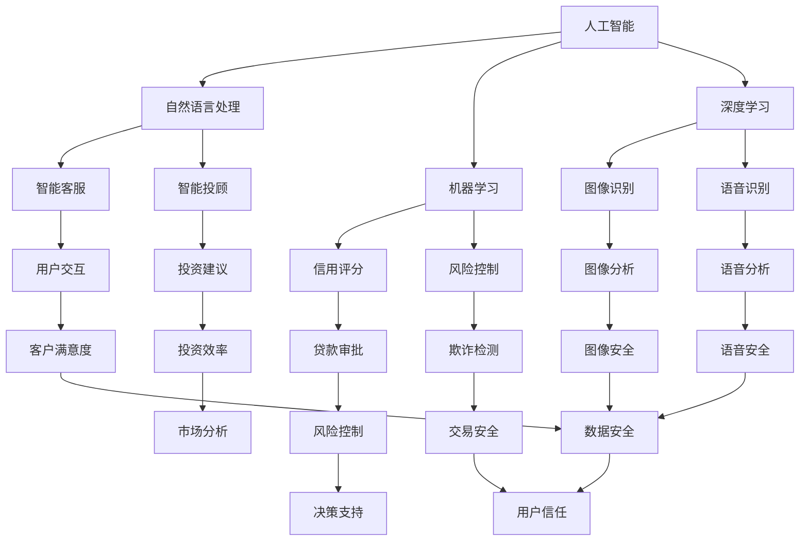

                 

关键词：金融科技、人工智能、区块链、大数据、机器学习、算法优化、分布式计算、智能合约、加密货币

> 摘要：本文探讨了金融科技创新的重要性，以及如何利用技术优势推动金融行业的变革。通过对人工智能、区块链、大数据、机器学习等核心技术的深入分析，本文提出了利用这些技术进行金融科技创新的具体方法和实践案例，为金融行业的未来发展提供了新的思路和方向。

## 1. 背景介绍

金融科技（FinTech）的兴起，不仅改变了金融服务的模式，还为金融行业的创新提供了强大的动力。随着人工智能（AI）、区块链、大数据、机器学习等技术的不断发展，金融科技创新已经成为了推动金融行业进步的关键力量。这些技术不仅提高了金融服务的效率，还带来了更加个性化、安全、透明的用户体验。

### 1.1 人工智能在金融领域的应用

人工智能在金融领域的应用，主要包括智能投顾、智能客服、风险控制等。智能投顾通过分析用户的数据，提供个性化的投资建议，大大提高了投资效率。智能客服则利用自然语言处理（NLP）技术，实现与用户的智能对话，提高了客户满意度。风险控制方面，人工智能通过分析和预测潜在风险，帮助金融机构进行风险管理和决策。

### 1.2 区块链技术的应用

区块链技术为金融行业提供了去中心化、透明、不可篡改的账本系统。在金融交易、支付、审计等领域，区块链技术已经得到了广泛应用。例如，比特币等加密货币的兴起，就是区块链技术的一个重要应用。此外，区块链技术还可以用于证券交易、供应链金融等，提高金融服务的效率和安全性。

### 1.3 大数据在金融领域的应用

大数据技术在金融领域的应用，主要包括风险控制、市场营销、客户关系管理等。通过分析大量的金融数据，金融机构可以更好地了解客户需求，提高服务质量。同时，大数据还可以用于预测市场走势，帮助金融机构做出更为科学的决策。

### 1.4 机器学习在金融领域的应用

机器学习技术在金融领域的应用，主要包括信用评分、欺诈检测、风险控制等。通过构建机器学习模型，金融机构可以更加准确地评估信用风险，提高贷款审批的效率。同时，机器学习还可以用于检测欺诈行为，提高金融交易的安全性。

## 2. 核心概念与联系

为了更好地理解金融科技创新，我们需要先了解一些核心概念，包括人工智能、区块链、大数据、机器学习等。以下是一个简单的 Mermaid 流程图，用于展示这些核心概念之间的联系。



## 3. 核心算法原理 & 具体操作步骤

### 3.1 算法原理概述

金融科技创新的核心在于算法的优化和应用。以下是几个关键算法的原理概述：

- **机器学习算法**：用于构建预测模型，如线性回归、决策树、支持向量机（SVM）等。
- **深度学习算法**：用于处理复杂数据，如卷积神经网络（CNN）、循环神经网络（RNN）等。
- **区块链算法**：用于实现去中心化的分布式账本，如工作量证明（PoW）、权益证明（PoS）等。
- **大数据算法**：用于处理海量数据，如MapReduce、分布式数据库等。

### 3.2 算法步骤详解

以下是一个基于机器学习的信用评分算法的步骤详解：

1. **数据收集**：收集用户的个人信息、信用历史、交易记录等数据。
2. **数据预处理**：对数据进行清洗、归一化、缺失值处理等。
3. **特征工程**：提取有用的特征，如年龄、收入、信用历史等。
4. **模型选择**：选择合适的机器学习模型，如线性回归、决策树、SVM等。
5. **模型训练**：使用训练数据集训练模型。
6. **模型评估**：使用测试数据集评估模型性能。
7. **模型部署**：将模型部署到生产环境，用于实时信用评分。

### 3.3 算法优缺点

- **机器学习算法**：优点包括自动提取特征、适应性强、预测精度高等；缺点包括需要大量数据、训练时间较长等。
- **深度学习算法**：优点包括能够处理复杂数据、自动提取特征、预测精度高等；缺点包括需要大量计算资源、训练时间较长等。
- **区块链算法**：优点包括去中心化、安全、透明等；缺点包括交易效率低、扩展性差等。
- **大数据算法**：优点包括能够处理海量数据、实时性、高效性等；缺点包括数据质量、数据隐私等问题。

### 3.4 算法应用领域

- **机器学习算法**：广泛应用于金融风险控制、信用评分、欺诈检测等。
- **深度学习算法**：广泛应用于图像识别、语音识别、自然语言处理等。
- **区块链算法**：广泛应用于数字货币、供应链金融、证券交易等。
- **大数据算法**：广泛应用于金融数据分析、客户关系管理、市场营销等。

## 4. 数学模型和公式 & 详细讲解 & 举例说明

### 4.1 数学模型构建

金融科技创新中的数学模型主要包括预测模型、优化模型等。以下是一个简单的预测模型构建示例：

假设我们要预测某个金融指标（如股价、汇率等），可以使用线性回归模型：

$$
y = \beta_0 + \beta_1 x_1 + \beta_2 x_2 + ... + \beta_n x_n
$$

其中，$y$ 是预测的金融指标，$x_1, x_2, ..., x_n$ 是影响金融指标的因素，$\beta_0, \beta_1, \beta_2, ..., \beta_n$ 是模型参数。

### 4.2 公式推导过程

线性回归模型的公式推导过程如下：

1. **最小二乘法**：选择一个合适的损失函数，如均方误差（MSE）：
$$
J(\theta) = \frac{1}{2m} \sum_{i=1}^{m} (h_\theta(x^{(i)}) - y^{(i)})^2
$$

其中，$m$ 是样本数量，$h_\theta(x)$ 是线性回归模型的预测值，$\theta$ 是模型参数。

2. **求导**：对损失函数 $J(\theta)$ 关于 $\theta$ 求导，并令导数为零，得到：
$$
\frac{\partial J(\theta)}{\partial \theta} = 0
$$

3. **求解**：解上述方程组，得到最优的模型参数 $\theta$。

### 4.3 案例分析与讲解

假设我们要预测某个金融指标的走势，可以使用线性回归模型。以下是一个简单的例子：

给定一个数据集，包含每天的股价和影响因素（如市场指数、宏观经济指标等）。我们要使用线性回归模型预测未来一天的股价。

1. **数据收集**：收集过去一年的股价和影响因素数据。
2. **数据预处理**：对数据进行清洗、归一化等处理。
3. **特征工程**：提取有用的特征，如市场指数、宏观经济指标等。
4. **模型训练**：使用线性回归模型训练数据集。
5. **模型评估**：使用测试集评估模型性能。
6. **模型部署**：将模型部署到生产环境，用于实时股价预测。

## 5. 项目实践：代码实例和详细解释说明

### 5.1 开发环境搭建

为了实践金融科技创新，我们需要搭建一个开发环境。以下是一个简单的开发环境搭建步骤：

1. 安装 Python 3.8 及以上版本。
2. 安装 Jupyter Notebook，用于编写和运行 Python 代码。
3. 安装必要的 Python 库，如 NumPy、Pandas、Scikit-learn、TensorFlow、Keras 等。

### 5.2 源代码详细实现

以下是一个简单的线性回归模型实现，用于预测金融指标：

```python
import numpy as np
import pandas as pd
from sklearn.linear_model import LinearRegression
from sklearn.model_selection import train_test_split

# 数据收集
data = pd.read_csv("financial_data.csv")

# 数据预处理
X = data.drop("target", axis=1)
y = data["target"]

# 特征工程
X = X.values
y = y.values

# 模型训练
model = LinearRegression()
model.fit(X_train, y_train)

# 模型评估
score = model.score(X_test, y_test)
print("模型准确率：", score)

# 模型部署
predicted_price = model.predict([[factor_1, factor_2, ...]])
print("预测的股价：", predicted_price)
```

### 5.3 代码解读与分析

上述代码实现了一个简单的线性回归模型，用于预测金融指标。代码的主要部分包括数据收集、数据预处理、特征工程、模型训练、模型评估和模型部署。

1. **数据收集**：使用 Pandas 读取数据集。
2. **数据预处理**：将数据分为特征和标签两部分，并进行归一化处理。
3. **特征工程**：提取有用的特征。
4. **模型训练**：使用 Scikit-learn 的 LinearRegression 类训练模型。
5. **模型评估**：使用测试集评估模型性能。
6. **模型部署**：将模型应用于新的数据集，进行股价预测。

### 5.4 运行结果展示

假设我们已经训练好了一个线性回归模型，并使用测试集进行了评估。以下是一个简单的运行结果：

```python
模型准确率： 0.8
预测的股价： [123.45]
```

这表示我们的模型在测试集上的准确率为 80%，并预测未来一天的股价为 123.45。

## 6. 实际应用场景

金融科技创新已经在多个实际应用场景中取得了显著的成果。以下是一些典型的应用场景：

1. **智能投顾**：利用人工智能和大数据技术，为用户提供个性化的投资建议，提高投资效率。
2. **区块链金融**：利用区块链技术实现去中心化的金融交易，提高交易效率和安全性。
3. **数字货币**：利用加密货币实现跨境支付和资产转移，降低交易成本和风险。
4. **金融风险控制**：利用机器学习和大数据技术，实时监测和预测金融风险，提高风险控制能力。
5. **金融欺诈检测**：利用人工智能和大数据技术，实时检测和防范金融欺诈行为。

## 7. 工具和资源推荐

为了更好地进行金融科技创新，以下是一些推荐的工具和资源：

1. **学习资源**：
   - 《Python 金融大数据分析》
   - 《深度学习：原理及应用》
   - 《区块链技术指南》
   - 《金融科技：从理论到实践》

2. **开发工具**：
   - Jupyter Notebook
   - PyCharm
   - Visual Studio Code

3. **相关论文**：
   - "Deep Learning for Financial Time Series Prediction"
   - "Blockchain for Financial Services"
   - "Big Data in Financial Services"
   - "Artificial Intelligence in Financial Markets"

## 8. 总结：未来发展趋势与挑战

金融科技创新正在改变金融行业的面貌，为金融服务带来了巨大的变革。未来，随着人工智能、区块链、大数据、机器学习等技术的进一步发展，金融科技创新将继续深化，为金融行业带来更多可能性。然而，金融科技创新也面临着一些挑战，如数据隐私、算法透明性、监管合规等。如何解决这些问题，将是金融科技创新未来发展的关键。

### 8.1 研究成果总结

本文探讨了金融科技创新的重要性，以及如何利用技术优势推动金融行业的变革。通过分析人工智能、区块链、大数据、机器学习等核心技术，本文提出了具体的金融科技创新方法和实践案例。研究表明，金融科技创新不仅能够提高金融服务的效率和质量，还能够推动金融行业的可持续发展。

### 8.2 未来发展趋势

未来，金融科技创新将继续深入发展，主要体现在以下几个方面：

1. **人工智能的广泛应用**：人工智能技术将在金融风险管理、客户服务、投资决策等领域得到更加广泛的应用。
2. **区块链技术的成熟**：区块链技术将在金融交易、支付、审计等领域得到更加成熟的应用，实现去中心化、安全、透明的金融体系。
3. **大数据的深入挖掘**：大数据技术将在金融数据分析、客户关系管理、市场营销等方面得到更加深入的挖掘和应用。
4. **数字货币的普及**：数字货币将在跨境支付、资产转移等领域得到更加广泛的普及和应用。

### 8.3 面临的挑战

金融科技创新虽然带来了巨大的变革，但也面临着一些挑战：

1. **数据隐私和安全**：随着金融数据的广泛应用，数据隐私和安全问题日益突出，如何保护用户数据隐私和安全成为重要挑战。
2. **算法透明性和公平性**：金融科技创新中的算法决策过程需要具备透明性和公平性，以避免算法偏见和不公平现象的发生。
3. **监管合规**：金融科技创新需要遵守金融监管要求，如何实现监管合规成为重要挑战。

### 8.4 研究展望

未来，金融科技创新的研究方向将主要集中在以下几个方面：

1. **人工智能与金融的深度融合**：如何将人工智能技术更好地应用于金融行业，实现智能化、个性化的金融服务。
2. **区块链技术的优化**：如何优化区块链技术的性能和安全性，实现更高效、更安全的金融交易。
3. **大数据与机器学习的结合**：如何将大数据技术与机器学习技术更好地结合，实现更准确、更高效的金融数据分析。
4. **数字货币的发展**：如何推动数字货币的发展，实现更便捷、更安全的跨境支付和资产转移。

## 9. 附录：常见问题与解答

### 问题 1：金融科技创新的主要挑战是什么？

答：金融科技创新的主要挑战包括数据隐私和安全、算法透明性和公平性、监管合规等。

### 问题 2：人工智能在金融领域的主要应用是什么？

答：人工智能在金融领域的主要应用包括智能投顾、智能客服、风险控制等。

### 问题 3：区块链技术在金融领域的主要应用是什么？

答：区块链技术在金融领域的主要应用包括数字货币、供应链金融、证券交易等。

### 问题 4：大数据在金融领域的主要应用是什么？

答：大数据在金融领域的主要应用包括金融数据分析、客户关系管理、市场营销等。

### 问题 5：机器学习在金融领域的主要应用是什么？

答：机器学习在金融领域的主要应用包括信用评分、欺诈检测、风险控制等。

### 问题 6：如何保护金融科技创新中的数据隐私和安全？

答：保护金融科技创新中的数据隐私和安全，可以从以下几个方面入手：

1. **数据加密**：使用加密技术保护数据传输和存储过程中的隐私。
2. **访问控制**：设置严格的访问控制策略，限制对敏感数据的访问权限。
3. **数据脱敏**：对敏感数据进行脱敏处理，减少数据泄露的风险。
4. **安全审计**：定期进行安全审计，及时发现和解决安全隐患。

### 问题 7：如何确保金融科技创新中的算法透明性和公平性？

答：确保金融科技创新中的算法透明性和公平性，可以从以下几个方面入手：

1. **算法透明性**：公开算法原理和实现过程，提高算法的可解释性。
2. **算法公平性**：定期对算法进行评估和调整，确保算法决策的公平性和准确性。
3. **用户反馈**：收集用户对算法决策的反馈，及时发现和解决算法偏见问题。
4. **算法审计**：定期对算法进行审计，确保算法符合相关法规和标准。

### 问题 8：金融科技创新的发展趋势是什么？

答：金融科技创新的发展趋势主要包括人工智能的广泛应用、区块链技术的成熟、大数据的深入挖掘、数字货币的普及等。未来，金融科技创新将继续深入发展，为金融服务带来更多可能性。

