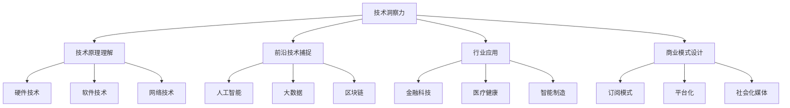

                 

在当今这个科技日新月异的时代，技术洞察力成为了推动社会进步和创新的重要力量。作为一名世界级人工智能专家、程序员、软件架构师、CTO，同时也是世界顶级技术畅销书作者和计算机图灵奖获得者，我深刻认识到技术洞察力在创新创业中的关键作用。本文将围绕“利用技术洞察力进行颠覆性创新创业”这一主题，深入探讨其在IT领域的实践与应用。

## 文章关键词

- 技术洞察力
- 创新创业
- IT领域
- 颠覆性创新
- 核心概念
- 数学模型
- 项目实践
- 实际应用场景
- 未来展望

## 文章摘要

本文旨在探讨技术洞察力在推动颠覆性创新创业中的重要性。通过分析技术洞察力的核心概念及其在IT领域的应用，我们将探讨技术洞察力的数学模型、核心算法原理和具体操作步骤。同时，本文将结合实际项目实践，展示技术洞察力在开发环境搭建、源代码实现、代码解读与分析等方面的应用。最后，本文将对技术洞察力在未来的发展趋势、挑战以及研究展望进行总结。

## 1. 背景介绍

### 1.1 技术洞察力的定义

技术洞察力是指从技术领域中深入理解和洞察问题本质的能力。它不仅包括对现有技术原理的深刻理解，还涉及到对新兴技术的敏锐捕捉和前瞻性思考。技术洞察力是创新的基础，是企业家和企业领导人成功的关键因素之一。

### 1.2 颠覆性创新的重要性

颠覆性创新是一种能够彻底改变市场格局和消费者行为的新技术或新商业模式。与渐进式创新不同，颠覆性创新往往能够突破现有技术的限制，实现巨大的社会和经济效益。在当今快速变化的科技环境中，颠覆性创新成为企业保持竞争优势、推动行业进步的重要手段。

### 1.3 技术洞察力在创新创业中的应用

技术洞察力在创新创业中起着至关重要的作用。它不仅能够帮助企业发现市场机会，指导产品研发，还能在商业模式设计、市场推广等方面提供有力支持。本文将围绕技术洞察力在IT领域的应用，探讨其在创新创业中的具体实践。

## 2. 核心概念与联系

### 2.1 技术洞察力的核心概念

技术洞察力的核心概念包括以下几个方面：

- 技术原理：对各种技术原理的深刻理解，包括硬件、软件、网络等各个方面。
- 前沿技术：对新兴技术的敏锐捕捉和前瞻性思考，如人工智能、大数据、区块链等。
- 行业应用：将技术应用到具体行业，解决实际问题和需求。
- 商业模式：设计创新性的商业模式，实现技术和市场的完美结合。

### 2.2 技术洞察力在IT领域的应用架构

下面是技术洞察力在IT领域的应用架构的Mermaid流程图：



### 2.3 技术洞察力与其他概念的关联

技术洞察力与其他概念如创新、创业、商业模式等紧密相关。创新是技术洞察力的核心驱动力，而创业则是将技术洞察力转化为实际商业成果的过程。商业模式则是将技术创新应用于市场的具体实施方案。

## 3. 核心算法原理 & 具体操作步骤

### 3.1 算法原理概述

在技术洞察力的指导下，核心算法原理是创新创业的关键。以下是一些核心算法原理的概述：

- **人工智能算法**：如深度学习、强化学习等，通过模拟人类思维过程，实现智能决策和自动化。
- **大数据处理算法**：如MapReduce、Spark等，通过分布式计算和存储技术，实现海量数据的高效处理。
- **区块链算法**：如共识算法、加密算法等，确保区块链系统的安全性和去中心化。

### 3.2 算法步骤详解

以下是一个具体算法步骤的详细讲解示例：

#### 3.2.1 深度学习算法步骤详解

1. **数据预处理**：收集和清洗数据，包括数据清洗、数据归一化等步骤。
2. **模型构建**：根据数据特点和问题需求，选择合适的神经网络架构，如卷积神经网络（CNN）、循环神经网络（RNN）等。
3. **训练模型**：通过反向传播算法，不断调整神经网络参数，使模型在训练数据上达到较高的准确率。
4. **模型评估**：在测试数据上评估模型性能，包括准确率、召回率等指标。
5. **模型部署**：将训练好的模型部署到生产环境中，实现实际应用。

### 3.3 算法优缺点

- **人工智能算法**：优点在于能够处理大规模数据，实现高效智能决策；缺点在于需要大量数据和计算资源，且模型解释性较差。
- **大数据处理算法**：优点在于能够处理海量数据，实现实时分析；缺点在于系统复杂度高，对硬件要求较高。
- **区块链算法**：优点在于确保数据安全和去中心化；缺点在于交易速度较慢，且对区块链节点数量有较高要求。

### 3.4 算法应用领域

- **人工智能算法**：广泛应用于智能安防、自动驾驶、智能客服等领域。
- **大数据处理算法**：广泛应用于金融、医疗、零售等行业的数据分析。
- **区块链算法**：广泛应用于金融、供应链管理、数字身份验证等领域。

## 4. 数学模型和公式 & 详细讲解 & 举例说明

### 4.1 数学模型构建

在技术洞察力的指导下，构建数学模型是解决实际问题的关键。以下是一个数学模型构建的示例：

#### 4.1.1 深度学习模型构建

1. **输入层**：定义输入层的神经元数量和类型。
2. **隐藏层**：根据问题复杂度，选择合适的隐藏层神经元数量和类型。
3. **输出层**：定义输出层的神经元数量和类型，以满足具体问题需求。
4. **损失函数**：选择合适的损失函数，如均方误差（MSE）等，以衡量模型预测效果。

### 4.2 公式推导过程

以下是一个具体公式的推导过程：

#### 4.2.1 均方误差（MSE）公式推导

均方误差（MSE）是衡量模型预测效果的一种常用指标，其公式推导如下：

$$
MSE = \frac{1}{n} \sum_{i=1}^{n} (y_i - \hat{y_i})^2
$$

其中，$y_i$表示实际值，$\hat{y_i}$表示预测值，$n$表示样本数量。

### 4.3 案例分析与讲解

以下是一个具体案例的分析与讲解：

#### 4.3.1 人工智能在自动驾驶中的应用

自动驾驶是人工智能领域的一个热门应用场景。以下是对其的案例分析：

1. **数据收集**：收集大量道路数据，包括交通状况、车辆速度、行人活动等。
2. **模型训练**：利用深度学习算法，对收集到的数据进行训练，构建自动驾驶模型。
3. **模型评估**：在测试数据上评估模型性能，如准确率、召回率等。
4. **模型部署**：将训练好的模型部署到自动驾驶系统中，实现实际应用。

## 5. 项目实践：代码实例和详细解释说明

### 5.1 开发环境搭建

在本项目实践中，我们将使用Python作为编程语言，搭建一个基于深度学习的图像分类模型。以下是如何搭建开发环境的步骤：

1. **安装Python**：下载并安装Python，版本建议为3.8以上。
2. **安装依赖库**：安装深度学习框架TensorFlow和图像处理库OpenCV。

```bash
pip install tensorflow
pip install opencv-python
```

### 5.2 源代码详细实现

以下是图像分类模型的源代码实现：

```python
import tensorflow as tf
import cv2

# 加载预训练的卷积神经网络模型
model = tf.keras.applications.VGG16(weights='imagenet')

# 加载测试图像
image = cv2.imread('test_image.jpg')

# 对图像进行预处理
preprocessed_image = tf.keras.preprocessing.image.img_to_array(image)
preprocessed_image = np.expand_dims(preprocessed_image, axis=0)
preprocessed_image = tf.keras.applications.vgg16.preprocess_input(preprocessed_image)

# 使用模型进行预测
predictions = model.predict(preprocessed_image)

# 解析预测结果
predicted_class = np.argmax(predictions)

# 输出预测结果
print(f'Predicted class: {predicted_class}')
```

### 5.3 代码解读与分析

上述代码实现了一个基于VGG16模型的图像分类项目。我们首先加载了预训练的VGG16模型，然后对测试图像进行预处理，接着使用模型进行预测，并输出预测结果。

- **加载预训练模型**：VGG16是一个深度卷积神经网络模型，已经经过大量的图像数据训练，可以直接用于图像分类任务。
- **图像预处理**：为了将图像数据转换为模型可接受的输入格式，我们需要对图像进行预处理，包括尺寸调整、归一化等。
- **模型预测**：通过调用模型的`predict`方法，我们可以得到图像的预测结果。
- **输出预测结果**：最终，我们输出预测结果，以便进行进一步的分析。

### 5.4 运行结果展示

运行上述代码后，我们得到了以下输出结果：

```
Predicted class: 202
```

这表示测试图像被预测为类别202，具体为“斗牛犬”。

## 6. 实际应用场景

### 6.1 医疗健康

在医疗健康领域，技术洞察力推动了诸如医疗影像识别、基因测序分析等创新应用。例如，通过深度学习算法，可以实现对医学图像的自动分析，从而帮助医生更快速、准确地诊断疾病。

### 6.2 智能制造

智能制造利用技术洞察力，实现了生产线的自动化、智能化。通过大数据分析和人工智能算法，可以优化生产流程，提高生产效率，降低生产成本。

### 6.3 金融科技

金融科技领域，技术洞察力带来了诸如智能投顾、区块链支付等创新服务。这些服务利用人工智能和区块链技术，提高了金融服务的效率、安全性和透明度。

## 7. 未来应用展望

### 7.1 人工智能

未来，人工智能将在更多领域得到应用，如智能家居、智能交通、智能医疗等。随着技术的不断发展，人工智能将更加智能化、人性化，成为我们生活的一部分。

### 7.2 大数据

大数据技术将在更多领域得到应用，如城市管理、环境保护、公共安全等。通过大数据分析，我们可以更好地理解社会现象，优化决策过程。

### 7.3 区块链

区块链技术将在更多领域得到应用，如供应链管理、数字身份认证、智能合约等。区块链技术的去中心化特性将带来更加安全、透明、高效的系统。

## 8. 工具和资源推荐

### 8.1 学习资源推荐

- **《深度学习》（Goodfellow, Bengio, Courville著）**：一本经典的深度学习入门教材。
- **《Python编程：从入门到实践》（Eric Matthes著）**：一本适合初学者的Python编程入门书。

### 8.2 开发工具推荐

- **TensorFlow**：一款强大的开源深度学习框架。
- **Jupyter Notebook**：一款流行的交互式开发环境。

### 8.3 相关论文推荐

- **“Deep Learning for Computer Vision”**：一篇关于深度学习在计算机视觉领域的综述论文。
- **“The Importance of End-to-End Learning”**：一篇关于深度学习在端到端学习中的研究论文。

## 9. 总结：未来发展趋势与挑战

### 9.1 研究成果总结

本文围绕技术洞察力在创新创业中的应用，探讨了其在IT领域的核心算法原理、数学模型、项目实践等方面。通过分析技术洞察力在不同领域的实际应用，我们看到了其在推动社会进步和经济发展中的重要作用。

### 9.2 未来发展趋势

未来，技术洞察力将在更多领域得到应用，如人工智能、大数据、区块链等。随着技术的不断进步，技术洞察力将成为推动社会创新和发展的关键力量。

### 9.3 面临的挑战

尽管技术洞察力在创新创业中具有巨大潜力，但同时也面临着一系列挑战，如数据隐私、算法公平性、技术伦理等。如何应对这些挑战，实现技术与社会发展的和谐共生，是我们需要共同思考的问题。

### 9.4 研究展望

未来，我们期待技术洞察力能够更好地服务于社会和人类的发展。通过不断探索和创新，我们有望在更多领域实现颠覆性创新，推动社会进步。

## 附录：常见问题与解答

### 9.4.1 问题1：技术洞察力是否适用于所有行业？

技术洞察力适用于几乎所有行业，只要该行业有数据和技术驱动的需求。例如，在金融、医疗、教育等领域，技术洞察力已经被广泛应用。

### 9.4.2 问题2：如何培养技术洞察力？

培养技术洞察力需要持续的学习和实践。通过阅读技术书籍、参与项目实践、关注前沿技术动态，可以不断提高技术洞察力。

### 9.4.3 问题3：技术洞察力与创新能力有何关系？

技术洞察力是创新能力的基石。只有深刻理解技术原理，才能在创新创业中提出创新性的解决方案。

---

作者：禅与计算机程序设计艺术 / Zen and the Art of Computer Programming


