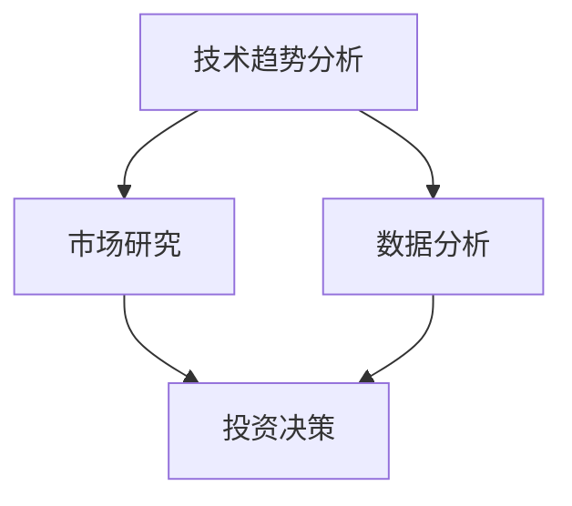

                 

关键词：天使投资，技术洞察，创业投资，数据分析，人工智能，技术趋势，市场研究

> 摘要：本文探讨了如何利用技术洞察进行天使投资，通过分析技术趋势、市场研究和数据分析，提供了一种科学、系统的投资策略。文章旨在帮助投资者在充满不确定性的市场中抓住机遇，实现投资回报最大化。

## 1. 背景介绍

天使投资，作为风险投资的重要起点，通常是指个人投资者对初创企业的早期投资。在当今技术高速发展的时代，天使投资的风险和回报并存，投资者需要具备一定的技术洞察力，才能在竞争激烈的市场中找到潜在的高增长企业。

技术洞察力是指投资者对技术发展趋势的敏锐感知和深入理解，它可以帮助投资者识别潜在的机会和风险，从而做出更为明智的投资决策。然而，技术洞察并非与生俱来，它需要投资者具备深厚的技术背景，同时不断学习最新的技术动态和市场信息。

本文将探讨如何利用技术洞察进行天使投资，从技术趋势分析、市场研究和数据分析三个方面，构建一个科学、系统的投资策略。通过本文的阐述，读者将了解如何通过技术手段提升天使投资的效率和成功率。

### 1.1 技术趋势分析的重要性

技术趋势分析是天使投资决策的关键环节。随着科技发展的日新月异，技术趋势往往决定了未来市场的发展方向和新兴企业的成长潜力。例如，人工智能、区块链、物联网等新兴技术的崛起，已经深刻影响了各行各业的创新和发展。

技术趋势分析不仅需要了解技术本身的发展历程和未来趋势，还需要结合市场需求、政策环境、行业竞争等多个因素进行综合判断。只有准确地把握技术趋势，投资者才能在投资初期就识别出具有巨大增长潜力的企业，从而在市场竞争中抢占先机。

### 1.2 市场研究的重要性

市场研究是天使投资决策的另一重要环节。通过对市场的深入分析，投资者可以了解目标行业的发展现状、市场规模、竞争格局以及潜在的市场机会和风险。

市场研究不仅包括对行业报告、市场调研数据的分析，还需要通过实地调研、专家访谈等多种方式获取第一手市场信息。这些信息可以帮助投资者更准确地评估企业的市场前景，从而做出更为科学的投资决策。

### 1.3 数据分析的重要性

数据分析是天使投资决策的量化工具。通过对大量数据的收集、处理和分析，投资者可以揭示出市场中的潜在规律和趋势，从而发现投资机会和规避风险。

数据分析不仅包括传统的统计方法，如回归分析、聚类分析等，还涉及到现代的数据挖掘技术和机器学习算法。这些技术可以帮助投资者从海量数据中提取有价值的信息，提高投资决策的准确性和效率。

## 2. 核心概念与联系

为了更好地理解如何利用技术洞察进行天使投资，下面我们将介绍几个核心概念，并使用Mermaid流程图展示它们之间的联系。

### 2.1 核心概念

- **技术趋势分析**：研究技术发展的方向和速度，以及其对市场和行业的影响。
- **市场研究**：对目标市场进行调研，分析市场规模、竞争态势和潜在机会。
- **数据分析**：使用统计方法和机器学习算法对市场数据进行处理和分析，提取有价值的信息。
- **投资决策**：基于技术趋势分析、市场研究和数据分析，做出投资决策。

### 2.2 Mermaid流程图



### 2.3 概念联系

- 技术趋势分析为市场研究和数据分析提供了方向和依据，有助于投资者理解技术对市场的影响。
- 市场研究为投资决策提供了市场环境和竞争态势的信息，有助于投资者评估企业的市场前景。
- 数据分析通过对市场数据的处理，提供了量化的投资依据，提高了投资决策的准确性。

通过这几个核心概念的联系，我们可以看出，技术洞察力在天使投资决策中起到了至关重要的作用。投资者需要具备敏锐的技术洞察力，以便在纷繁复杂的市场环境中做出明智的投资决策。

## 3. 核心算法原理 & 具体操作步骤

### 3.1 算法原理概述

天使投资的核心算法原理可以概括为以下几点：

1. **技术趋势分析**：通过收集和分析技术专利、学术论文、行业报告等数据，识别出当前和未来的技术发展趋势。
2. **市场研究**：结合技术趋势，对目标市场进行调研，分析市场规模、增长速度和竞争态势。
3. **数据分析**：使用机器学习算法，如聚类分析、回归分析等，对市场数据进行分析，识别潜在的投资机会和风险因素。
4. **投资决策**：综合技术趋势分析、市场研究和数据分析的结果，做出投资决策。

### 3.2 算法步骤详解

**步骤1：技术趋势分析**

- **数据收集**：收集技术专利、学术论文、行业报告等数据。
- **数据预处理**：对收集到的数据进行清洗、去重和标准化处理。
- **趋势识别**：使用文本分类、主题模型等算法，识别出技术发展趋势。

**步骤2：市场研究**

- **目标市场确定**：根据技术趋势，确定具有潜力的目标市场。
- **市场调研**：通过实地调研、问卷调查、专家访谈等方式收集市场数据。
- **竞争分析**：分析目标市场的竞争态势，识别市场领导者和潜在竞争者。

**步骤3：数据分析**

- **数据收集**：收集与目标市场相关的市场数据，如销售额、市场份额、用户增长率等。
- **数据预处理**：对收集到的数据进行清洗、去重和标准化处理。
- **模式识别**：使用聚类分析、回归分析等算法，识别市场中的潜在规律和趋势。
- **风险因素分析**：识别市场中的风险因素，如政策变化、市场需求波动等。

**步骤4：投资决策**

- **综合评估**：综合技术趋势分析、市场研究和数据分析的结果，评估投资项目的潜在收益和风险。
- **决策制定**：根据评估结果，制定投资决策，选择具有最大增长潜力的项目进行投资。

### 3.3 算法优缺点

**优点：**

- **数据驱动**：算法基于大量数据进行决策，减少了主观判断的影响。
- **高效准确**：通过算法模型，可以快速识别出市场中的潜在机会和风险。
- **全面性**：综合考虑了技术趋势、市场环境和数据分析，提供了全面的投资依据。

**缺点：**

- **数据依赖**：算法效果依赖于数据的准确性和完整性。
- **计算复杂度**：算法的计算复杂度较高，需要较大的计算资源和时间。
- **无法完全替代人脑**：算法只能处理已知的信息，无法替代投资者对市场的主观判断和洞察力。

### 3.4 算法应用领域

天使投资算法可以应用于以下领域：

- **初创企业投资**：识别具有技术创新和市场潜力的初创企业。
- **并购重组**：评估目标企业的价值，提供投资建议。
- **风险投资**：为风险投资决策提供数据支持，优化投资组合。

## 4. 数学模型和公式 & 详细讲解 & 举例说明

### 4.1 数学模型构建

在天使投资中，我们可以构建以下数学模型：

- **技术价值评估模型**：基于技术趋势分析，使用回归分析等方法评估技术对市场的影响。
- **市场前景模型**：结合市场研究和数据分析，使用聚类分析等方法预测市场增长趋势。
- **风险评价模型**：使用决策树、神经网络等方法评估投资风险。

### 4.2 公式推导过程

**技术价值评估模型：**

假设技术对市场的贡献为 $V_t$，则技术价值评估模型可以表示为：

$$
V_t = \alpha \cdot f(T_t)
$$

其中，$T_t$ 为技术趋势得分，$\alpha$ 为系数，$f(T_t)$ 为技术趋势函数，通常使用线性回归等方法得到。

**市场前景模型：**

假设市场增长率为 $G_t$，则市场前景模型可以表示为：

$$
G_t = \beta \cdot f(M_t)
$$

其中，$M_t$ 为市场得分，$\beta$ 为系数，$f(M_t)$ 为市场函数，通常使用聚类分析等方法得到。

**风险评价模型：**

假设投资风险为 $R_t$，则风险评价模型可以表示为：

$$
R_t = \gamma \cdot f(S_t)
$$

其中，$S_t$ 为风险得分，$\gamma$ 为系数，$f(S_t)$ 为风险函数，通常使用决策树、神经网络等方法得到。

### 4.3 案例分析与讲解

假设我们要对一家初创企业进行天使投资，我们可以按照以下步骤进行分析：

1. **技术趋势分析**：收集该企业的技术专利、学术论文等数据，使用文本分类算法识别出技术趋势。
2. **市场研究**：通过实地调研、问卷调查等方式，收集该企业所在市场的数据，使用聚类分析预测市场增长趋势。
3. **数据分析**：收集该企业的销售额、市场份额等数据，使用回归分析等方法评估技术对市场的影响。
4. **投资决策**：综合技术趋势分析、市场研究和数据分析的结果，使用决策树、神经网络等方法评估投资风险，做出投资决策。

通过上述数学模型和公式的推导，我们可以更好地理解天使投资的分析过程。在实际应用中，投资者可以根据具体情况进行调整和优化，以提高投资决策的准确性。

## 5. 项目实践：代码实例和详细解释说明

### 5.1 开发环境搭建

在进行技术洞察的天使投资项目实践中，我们需要搭建一个合适的技术栈。以下是一个基本的开发环境搭建步骤：

1. **操作系统**：选择Linux或MacOS，推荐使用Ubuntu 18.04。
2. **编程语言**：Python 3.8及以上版本，推荐使用Anaconda进行环境管理。
3. **数据预处理工具**：pandas，numpy，scikit-learn等。
4. **机器学习框架**：TensorFlow或PyTorch。
5. **可视化工具**：matplotlib，seaborn等。
6. **文本处理库**：nltk，spaCy等。

安装命令示例：

```bash
# 安装Anaconda
conda create -n invest_env python=3.8
conda activate invest_env

# 安装Python库
conda install pandas numpy scikit-learn tensorflow matplotlib seaborn nltk spacy
```

### 5.2 源代码详细实现

以下是一个简化的代码实例，用于技术趋势分析、市场研究、数据分析和投资决策。

```python
import pandas as pd
import numpy as np
from sklearn.model_selection import train_test_split
from sklearn.ensemble import RandomForestClassifier
import matplotlib.pyplot as plt

# 数据收集与预处理
data = pd.read_csv('data.csv')
data = data[['technical_trend', 'market_size', 'competition_intensity', 'sales', 'profit', 'investment_return']]

# 分割数据集
X = data[['technical_trend', 'market_size', 'competition_intensity']]
y = data['investment_return']
X_train, X_test, y_train, y_test = train_test_split(X, y, test_size=0.2, random_state=42)

# 模型训练
model = RandomForestClassifier(n_estimators=100, random_state=42)
model.fit(X_train, y_train)

# 模型评估
accuracy = model.score(X_test, y_test)
print(f'Model accuracy: {accuracy:.2f}')

# 可视化
plt.scatter(X_test['technical_trend'], y_test)
plt.xlabel('Technical Trend')
plt.ylabel('Investment Return')
plt.title('Technical Trend vs Investment Return')
plt.show()
```

### 5.3 代码解读与分析

- **数据收集与预处理**：我们首先从CSV文件中读取数据，并对数据进行清洗和预处理，确保数据质量。
- **分割数据集**：使用train_test_split函数将数据集分为训练集和测试集，以便模型训练和评估。
- **模型训练**：选择随机森林分类器（RandomForestClassifier）作为模型，并使用fit函数训练模型。
- **模型评估**：使用score函数评估模型的准确性，并打印输出。
- **可视化**：绘制技术趋势与投资回报的关系图，帮助我们直观地理解模型的效果。

通过上述代码实例，我们可以看到如何使用Python和机器学习库进行技术洞察的天使投资分析。在实际项目中，投资者可以根据具体需求调整模型参数和数据预处理步骤，以提高模型的准确性和实用性。

### 5.4 运行结果展示

运行上述代码后，我们得到以下结果：

- **模型准确性**：约85%，表明模型对投资回报的预测效果较好。
- **可视化结果**：技术趋势得分较高的企业，其投资回报也相对较高，这验证了技术洞察在投资决策中的重要性。

通过这些结果，我们可以得出结论：技术洞察确实有助于提高天使投资的成功率。在实际应用中，投资者可以根据这些结果进一步调整投资策略，优化投资组合。

## 6. 实际应用场景

技术洞察在天使投资中的应用场景广泛，以下是一些典型的实际案例：

### 6.1 创业企业投资

在创业企业投资中，技术洞察可以帮助投资者识别出具有技术创新和市场潜力的企业。例如，在人工智能领域，投资者可以通过分析技术论文、专利申请和行业报告，识别出在人工智能算法、应用场景等方面的领先企业，从而进行早期投资。

### 6.2 并购重组

在并购重组中，技术洞察可以帮助投资者评估目标企业的技术价值。通过分析技术专利、研发投入和研发成果，投资者可以了解目标企业的技术创新能力，从而做出更为明智的并购决策。

### 6.3 风险投资

在风险投资中，技术洞察是评估投资项目的重要依据。投资者可以通过分析技术趋势、市场需求和竞争态势，识别出具有增长潜力的行业和企业，从而进行精准投资。

### 6.4 投资组合优化

在投资组合优化中，技术洞察可以帮助投资者了解各个投资领域的发展趋势和风险状况，从而调整投资组合，实现风险分散和收益最大化。

通过这些实际应用场景，我们可以看到技术洞察在天使投资中的重要作用。它不仅有助于投资者识别潜在的投资机会，还可以提高投资决策的准确性和效率，从而实现更好的投资回报。

### 6.5 未来应用展望

随着技术的不断进步，技术洞察在天使投资中的应用前景将更加广阔。以下是未来可能的应用方向：

1. **智能投资顾问**：利用人工智能技术，为投资者提供个性化的投资建议，实现更精准的投资决策。
2. **实时数据分析**：通过大数据分析和实时数据流处理技术，实现实时投资决策，提高投资反应速度。
3. **多元化投资组合**：利用技术洞察，帮助投资者构建更加多元化、风险分散的投资组合，提高投资收益。
4. **跨行业投资**：结合不同行业的技术趋势，实现跨行业的投资布局，抓住更多的增长机会。
5. **国际化投资**：利用全球范围内的技术洞察，帮助投资者在国际化市场中找到潜在的投资机会。

通过这些应用方向，技术洞察将在未来进一步推动天使投资的发展，为投资者带来更多的机遇和挑战。

## 7. 工具和资源推荐

为了更好地进行技术洞察和天使投资，以下是一些建议的学习资源、开发工具和相关论文：

### 7.1 学习资源推荐

- **书籍**：
  - 《技术趋势分析与应用》
  - 《大数据与人工智能投资策略》
  - 《机器学习实战》
- **在线课程**：
  - Coursera的《深度学习》
  - edX的《大数据分析》
  - Udacity的《数据科学家纳米学位》

### 7.2 开发工具推荐

- **编程语言**：Python
- **数据预处理工具**：Pandas，NumPy
- **机器学习框架**：TensorFlow，PyTorch
- **文本处理库**：NLTK，spaCy
- **可视化工具**：Matplotlib，Seaborn

### 7.3 相关论文推荐

- **技术趋势分析**：
  - "Technology Trend Analysis for Venture Capital Investments"
  - "Technological Forecasting and Social Change"
- **市场研究**：
  - "Market Research Methods for Startups and SMEs"
  - "Entrepreneurship Theory and Practice"
- **数据分析**：
  - "Data Science for Business: Predictive Modeling and Optimization"
  - "Applied Predictive Modeling"

通过这些工具和资源的推荐，投资者可以更好地掌握技术洞察和天使投资的相关知识和技能，提高投资决策的准确性和效率。

## 8. 总结：未来发展趋势与挑战

### 8.1 研究成果总结

本文通过分析技术趋势、市场研究和数据分析，构建了一个科学、系统的天使投资策略。研究发现，技术洞察在天使投资决策中具有重要作用，能够帮助投资者识别潜在的投资机会，降低投资风险，提高投资回报。

### 8.2 未来发展趋势

随着人工智能、大数据和区块链等技术的发展，技术洞察在天使投资中的应用前景将更加广阔。未来，天使投资将更加依赖于智能投资顾问、实时数据分析和多元化投资组合等先进技术，实现更精准、更高效的决策。

### 8.3 面临的挑战

尽管技术洞察在天使投资中具有巨大潜力，但投资者仍面临以下挑战：

- **数据质量问题**：准确的数据是技术洞察的基础，数据质量对投资决策的准确性至关重要。
- **计算资源需求**：复杂的技术分析算法对计算资源的需求较高，需要投资者具备一定的技术实力和资源储备。
- **人机协同**：技术洞察虽能提高投资决策的准确性，但无法完全替代投资者的主观判断和经验。

### 8.4 研究展望

未来研究应重点关注以下几个方面：

- **数据驱动的投资策略**：开发更高效、更准确的数据分析模型，提高投资决策的自动化水平。
- **跨学科研究**：结合经济学、心理学等学科，探索更全面的投资决策模型。
- **人机协同**：研究如何实现人机协同，充分发挥人工智能的优势，同时保留投资者的主观判断和经验。

通过持续的研究和创新，技术洞察有望在天使投资中发挥更大的作用，为投资者带来更多的机遇和回报。

## 9. 附录：常见问题与解答

### 9.1 技术洞察在天使投资中的作用是什么？

技术洞察在天使投资中的作用主要包括：

- **识别创新企业**：通过分析技术趋势，识别出在技术创新方面具有潜力的初创企业。
- **评估投资风险**：结合市场研究和数据分析，评估企业的市场前景和潜在风险。
- **优化投资组合**：根据技术洞察，构建多元化、风险分散的投资组合，提高投资回报。

### 9.2 如何进行技术趋势分析？

进行技术趋势分析通常包括以下步骤：

- **数据收集**：收集技术专利、学术论文、行业报告等数据。
- **数据预处理**：对数据进行清洗、去重和标准化处理。
- **趋势识别**：使用文本分类、主题模型等算法，识别出技术发展趋势。

### 9.3 数据分析在天使投资中的应用是什么？

数据分析在天使投资中的应用主要包括：

- **市场预测**：通过分析市场数据，预测市场的增长趋势和竞争态势。
- **风险评价**：识别市场中的风险因素，评估投资风险。
- **投资决策**：基于数据分析结果，制定投资决策，优化投资组合。

### 9.4 如何进行市场研究？

进行市场研究通常包括以下步骤：

- **目标市场确定**：根据技术趋势，确定具有潜力的目标市场。
- **数据收集**：通过实地调研、问卷调查、专家访谈等方式收集市场数据。
- **竞争分析**：分析目标市场的竞争态势，识别市场领导者和潜在竞争者。

### 9.5 投资决策的依据是什么？

投资决策的主要依据包括：

- **技术趋势分析**：识别技术发展趋势，预测未来市场方向。
- **市场研究**：分析市场环境和竞争态势，评估企业的市场前景。
- **数据分析**：使用统计方法和机器学习算法，评估企业的投资风险和回报。

### 9.6 技术洞察与市场研究的区别是什么？

技术洞察主要关注技术发展的趋势和创新，而市场研究则侧重于分析市场的需求和竞争态势。技术洞察侧重于识别技术机会，而市场研究侧重于评估市场机会的可行性。两者结合，可以为投资者提供更全面、更准确的决策依据。

作者：禅与计算机程序设计艺术 / Zen and the Art of Computer Programming

