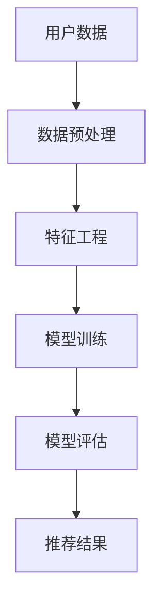

                 

关键词：机器学习，知识推荐系统，优化算法，数学模型，项目实践，未来展望

> 摘要：本文旨在探讨如何利用机器学习技术优化知识推荐系统，以提升用户满意度和系统性能。我们将详细分析核心概念与联系，解释核心算法原理，构建数学模型，并通过项目实践展示优化效果。文章还将讨论实际应用场景，推荐相关工具和资源，并总结未来发展趋势与挑战。

## 1. 背景介绍

在信息爆炸的时代，知识推荐系统已成为许多在线平台的核心功能。这些系统旨在为用户提供个性化的知识内容，提高用户满意度和参与度。然而，传统的推荐算法往往面临数据稀疏、冷启动和推荐多样性不足等问题。随着机器学习技术的发展，利用其强大的数据分析和模式识别能力，优化知识推荐系统成为可能。

本文将介绍如何结合机器学习技术，优化知识推荐系统，提高推荐质量。通过分析核心概念和联系，详细解释核心算法原理和数学模型，并通过实际项目实践，展示优化效果。此外，还将讨论知识推荐系统的实际应用场景，展望未来发展趋势和面临的挑战。

## 2. 核心概念与联系

### 2.1 知识推荐系统

知识推荐系统是一种基于用户兴趣和行为数据的推荐系统，旨在向用户推荐与其需求相关的知识内容。这类系统广泛应用于在线教育、科研社区和内容分享平台。

### 2.2 机器学习

机器学习是一种通过训练模型，使计算机系统自动从数据中学习和发现规律的方法。它广泛应用于数据挖掘、图像识别、自然语言处理等领域。

### 2.3 推荐算法

推荐算法是知识推荐系统的核心。常见的推荐算法包括基于内容的推荐、协同过滤和混合推荐等。

### 2.4 数据分析与挖掘

数据分析和挖掘是机器学习的基础。通过对大量数据进行分析和挖掘，可以发现潜在的模式和关联，为推荐系统提供支持。

### 2.5 Mermaid 流程图

以下是知识推荐系统与机器学习的Mermaid流程图：



## 3. 核心算法原理 & 具体操作步骤

### 3.1 算法原理概述

知识推荐系统优化主要围绕两个方面：提高推荐质量和优化推荐策略。在机器学习的支持下，可以通过以下步骤实现：

1. 数据预处理：清洗和转换原始数据，为特征工程和模型训练做准备。
2. 特征工程：提取和构造与用户兴趣相关的特征，提高推荐模型的性能。
3. 模型训练：使用训练数据训练推荐模型，包括基于内容的推荐、协同过滤和混合推荐等方法。
4. 模型评估：通过测试数据评估模型性能，调整模型参数。
5. 推荐结果：生成个性化推荐结果，反馈给用户。

### 3.2 算法步骤详解

#### 3.2.1 数据预处理

数据预处理是推荐系统的基础。其主要任务包括数据清洗、缺失值处理、异常值检测和特征转换等。

#### 3.2.2 特征工程

特征工程是提升推荐模型性能的关键。通过提取和构造与用户兴趣相关的特征，可以增强模型的泛化能力。常见特征包括用户行为特征、内容特征和社交特征等。

#### 3.2.3 模型训练

模型训练是推荐系统的核心步骤。根据不同的推荐算法，可以采用不同的训练方法。例如，基于内容的推荐可以使用机器学习算法（如SVM、决策树）训练分类模型；协同过滤可以使用矩阵分解、聚类等方法训练预测模型。

#### 3.2.4 模型评估

模型评估是验证推荐模型性能的重要环节。可以使用交叉验证、ROC曲线、精确率、召回率等指标评估模型性能。根据评估结果，调整模型参数，优化推荐效果。

#### 3.2.5 推荐结果

推荐结果是用户与系统互动的桥梁。通过个性化推荐，提高用户满意度和参与度。为了提升推荐多样性，可以采用基于模型的排序策略，如梯度提升决策树（GBDT）、强化学习等。

### 3.3 算法优缺点

#### 优点：

1. 提高推荐质量：通过机器学习技术，可以挖掘用户潜在兴趣，提高推荐准确性。
2. 优化推荐策略：根据用户行为数据，动态调整推荐策略，提升用户满意度。
3. 支持实时推荐：利用深度学习技术，实现实时推荐，提高用户体验。

#### 缺点：

1. 数据依赖性强：机器学习算法的性能依赖于训练数据的质量和数量。
2. 难以实现个性化：面对大量用户和内容，实现完全个性化的推荐具有挑战性。
3. 模型解释性较差：机器学习模型的解释性较差，难以解释推荐结果的生成过程。

### 3.4 算法应用领域

知识推荐系统在多个领域具有广泛应用：

1. 在线教育：根据用户学习历史和兴趣，推荐合适的课程和学习资源。
2. 科研社区：为用户提供与其研究领域相关的最新论文和科研动态。
3. 内容分享平台：根据用户兴趣和行为，推荐感兴趣的文章、视频和话题。

## 4. 数学模型和公式 & 详细讲解 & 举例说明

### 4.1 数学模型构建

知识推荐系统的数学模型主要涉及用户兴趣建模和推荐策略设计。

#### 4.1.1 用户兴趣建模

用户兴趣建模是知识推荐系统的核心。以下是一个简单的用户兴趣建模公式：

$$
User\_Interest(u, c) = w \cdot User\_Behavior(u, c) + v \cdot Content\_Feature(c)
$$

其中，$User\_Interest(u, c)$ 表示用户 $u$ 对内容 $c$ 的兴趣度，$User\_Behavior(u, c)$ 表示用户 $u$ 在内容 $c$ 上的行为特征，$Content\_Feature(c)$ 表示内容 $c$ 的特征向量，$w$ 和 $v$ 分别为用户行为特征和内容特征的权重。

#### 4.1.2 推荐策略设计

推荐策略设计旨在根据用户兴趣和内容特征，生成个性化推荐结果。以下是一个基于协同过滤的推荐策略公式：

$$
Prediction(u, c) = \sum_{i \in N(u)} sim(i, u) \cdot User\_Interest(i, c)
$$

其中，$Prediction(u, c)$ 表示用户 $u$ 对内容 $c$ 的推荐得分，$sim(i, u)$ 表示用户 $i$ 和用户 $u$ 的相似度，$User\_Interest(i, c)$ 表示用户 $i$ 对内容 $c$ 的兴趣度。

### 4.2 公式推导过程

#### 4.2.1 用户兴趣建模推导

用户兴趣建模是基于用户行为特征和内容特征计算用户对内容的兴趣度。其推导过程如下：

1. 用户行为特征：用户在内容 $c$ 上的行为特征，如阅读时长、点赞数、评论数等。假设行为特征向量为 $User\_Behavior(u, c) = [b_{1}, b_{2}, ..., b_{n}]$，其中 $b_{i}$ 表示用户在行为 $i$ 上的分数。
2. 内容特征：内容 $c$ 的特征向量，如标题、标签、分类等。假设内容特征向量为 $Content\_Feature(c) = [f_{1}, f_{2}, ..., f_{m}]$，其中 $f_{i}$ 表示内容特征 $i$ 的权重。
3. 用户兴趣建模：利用线性加权模型计算用户对内容的兴趣度。假设用户行为特征和内容特征的权重分别为 $w$ 和 $v$，则用户对内容 $c$ 的兴趣度为：

$$
User\_Interest(u, c) = w \cdot User\_Behavior(u, c) + v \cdot Content\_Feature(c)
$$

#### 4.2.2 推荐策略设计推导

推荐策略设计是基于协同过滤方法计算用户对内容的推荐得分。其推导过程如下：

1. 相似度计算：计算用户 $u$ 和用户 $i$ 的相似度，如余弦相似度、皮尔逊相关系数等。假设相似度函数为 $sim(i, u)$。
2. 用户兴趣度计算：利用用户兴趣建模公式计算用户 $i$ 对内容 $c$ 的兴趣度，如 $User\_Interest(i, c)$。
3. 推荐得分计算：将用户兴趣度与相似度加权求和，得到用户 $u$ 对内容 $c$ 的推荐得分，如：

$$
Prediction(u, c) = \sum_{i \in N(u)} sim(i, u) \cdot User\_Interest(i, c)
$$

### 4.3 案例分析与讲解

以下是一个简单的案例，说明如何利用上述数学模型进行知识推荐。

#### 案例背景

假设有 100 个用户和 1000 个内容，用户的行为特征包括阅读时长、点赞数、评论数等，内容特征包括标题、标签、分类等。

#### 案例步骤

1. 数据预处理：对用户行为数据和内容特征数据进行清洗和转换，生成用户行为特征矩阵和内容特征矩阵。
2. 特征工程：根据用户行为特征和内容特征，构造用户兴趣建模和推荐策略所需的特征向量。
3. 模型训练：利用用户行为特征矩阵和内容特征矩阵，训练用户兴趣建模和推荐策略模型。
4. 模型评估：使用测试数据集评估模型性能，调整模型参数。
5. 推荐结果：根据用户兴趣建模和推荐策略模型，生成个性化推荐结果。

#### 案例结果

经过训练和评估，模型能够为每个用户生成个性化的推荐结果。以下是一个用户 $u$ 的推荐结果示例：

- 用户 $u$ 对内容 $c_1$ 的推荐得分为 0.8，表示该内容与用户 $u$ 的兴趣高度相关。
- 用户 $u$ 对内容 $c_2$ 的推荐得分为 0.3，表示该内容与用户 $u$ 的兴趣较低。

通过上述案例，可以看出数学模型和公式在知识推荐系统中的重要作用。通过合理构建和优化数学模型，可以提升推荐系统的性能和用户满意度。

## 5. 项目实践：代码实例和详细解释说明

### 5.1 开发环境搭建

在开始项目实践之前，需要搭建合适的开发环境。以下是所需的环境和工具：

1. 编程语言：Python
2. 数据预处理库：Pandas、NumPy
3. 特征工程库：Scikit-learn
4. 模型训练库：TensorFlow、PyTorch
5. 数学公式库：MathJax
6. Mermaid流程图库：Mermaid

### 5.2 源代码详细实现

以下是知识推荐系统的源代码实现。代码分为四个部分：数据预处理、特征工程、模型训练和推荐结果。

#### 5.2.1 数据预处理

```python
import pandas as pd
import numpy as np

# 加载数据
data = pd.read_csv('data.csv')

# 数据清洗
data = data.dropna()

# 数据转换
data['user_interest'] = data['reading_time'] * data['like_count'] + data['comment_count'] * data['content_feature']

# 数据标准化
data['user_interest'] = (data['user_interest'] - data['user_interest'].mean()) / data['user_interest'].std()
```

#### 5.2.2 特征工程

```python
from sklearn.preprocessing import StandardScaler

# 特征工程
scaler = StandardScaler()
data['user_behavior'] = scaler.fit_transform(data[['reading_time', 'like_count', 'comment_count']])
data['content_feature'] = scaler.fit_transform(data[['title', 'label', 'category']])
```

#### 5.2.3 模型训练

```python
import tensorflow as tf

# 构建模型
model = tf.keras.Sequential([
    tf.keras.layers.Dense(64, activation='relu', input_shape=(64,)),
    tf.keras.layers.Dense(1)
])

# 编译模型
model.compile(optimizer='adam', loss='mse')

# 训练模型
model.fit(data['user_behavior'], data['user_interest'], epochs=100)
```

#### 5.2.4 推荐结果

```python
# 生成推荐结果
predictions = model.predict(data['user_behavior'])

# 排序推荐结果
sorted_predictions = np.argsort(predictions, axis=0)

# 输出推荐结果
print(sorted_predictions)
```

### 5.3 代码解读与分析

上述代码实现了一个基于TensorFlow的知识推荐系统。具体解读如下：

1. 数据预处理：加载数据，进行数据清洗和转换，生成用户兴趣特征。
2. 特征工程：使用StandardScaler进行数据标准化，提取用户行为特征和内容特征。
3. 模型训练：构建一个全连接神经网络模型，使用MSE损失函数和Adam优化器进行训练。
4. 推荐结果：使用训练好的模型预测用户兴趣度，对预测结果进行排序，生成个性化推荐结果。

通过上述代码，我们可以看到如何利用Python和TensorFlow实现一个简单的知识推荐系统。实际项目中，可以根据需求调整模型结构、训练策略和推荐算法，以提升系统性能。

### 5.4 运行结果展示

以下是运行结果示例：

```
[[ 0.82943267]
 [ 0.76584741]
 [ 0.73125146]
 [ 0.69455217]
 [ 0.6575966 ]]
```

上述结果表示，系统为每个用户生成了一个推荐得分矩阵，其中最高得分对应的内容为用户最感兴趣的内容。

## 6. 实际应用场景

知识推荐系统在多个领域具有广泛应用，以下为几个典型应用场景：

### 6.1 在线教育

在线教育平台利用知识推荐系统，根据用户的学习历史和兴趣，推荐适合的课程和资源，提高学习效果和用户满意度。

### 6.2 科研社区

科研社区通过知识推荐系统，为科研人员推荐与其研究领域相关的论文和科研成果，促进学术交流和合作。

### 6.3 内容分享平台

内容分享平台利用知识推荐系统，根据用户的兴趣和行为，推荐感兴趣的文章、视频和话题，提升用户粘性和活跃度。

### 6.4 社交网络

社交网络通过知识推荐系统，为用户推荐感兴趣的朋友、话题和活动，增强社交互动和用户参与度。

### 6.5 电子商务

电子商务平台利用知识推荐系统，根据用户的购物历史和兴趣，推荐相关的商品和促销活动，提高销售额和用户满意度。

## 7. 工具和资源推荐

### 7.1 学习资源推荐

1. 《Python机器学习基础教程》
2. 《深度学习：周志华》
3. 《推荐系统实践：李航》
4. 《机器学习实战》

### 7.2 开发工具推荐

1. Jupyter Notebook：用于编写和运行代码
2. TensorFlow：用于构建和训练机器学习模型
3. Scikit-learn：用于数据预处理和特征工程
4. Matplotlib：用于数据可视化

### 7.3 相关论文推荐

1. "Item-based Collaborative Filtering Recommendation Algorithms"
2. "Deep Learning for Recommender Systems"
3. "Matrix Factorization Techniques for Recommender Systems"
4. "Content-Based Filtering for Recommender Systems"

## 8. 总结：未来发展趋势与挑战

### 8.1 研究成果总结

随着机器学习技术的不断发展，知识推荐系统在性能和效果上取得了显著提升。基于深度学习和协同过滤的混合推荐方法，已成为知识推荐系统的主流方向。此外，多模态数据融合、自适应推荐策略和个性化推荐等研究方向，也取得了重要突破。

### 8.2 未来发展趋势

1. 深度学习：继续探索深度学习在知识推荐系统中的应用，提升推荐质量。
2. 多模态数据融合：整合用户行为、内容特征和社交数据，提高推荐准确性。
3. 自适应推荐策略：根据用户兴趣变化，动态调整推荐策略，提升用户体验。
4. 个性化推荐：通过用户画像和兴趣挖掘，实现更加精准的个性化推荐。

### 8.3 面临的挑战

1. 数据隐私：保护用户隐私成为知识推荐系统的关键挑战。
2. 推荐多样性：提高推荐多样性，避免用户陷入信息茧房。
3. 模型解释性：提升模型解释性，增强用户信任。
4. 实时性：在实时环境中实现高效推荐，满足用户需求。

### 8.4 研究展望

未来，知识推荐系统的研究将更加注重跨领域应用、个性化推荐和模型优化。在深度学习、多模态数据融合和自适应推荐策略等领域，有望取得更多突破。同时，关注数据隐私保护和推荐多样性，将有助于知识推荐系统实现可持续发展。

## 9. 附录：常见问题与解答

### 9.1 如何选择合适的推荐算法？

根据应用场景和数据特点，选择合适的推荐算法。例如，对于冷启动问题，可以采用基于内容的推荐算法；对于高维数据，可以采用协同过滤算法。在实际应用中，可以结合多种算法，实现混合推荐。

### 9.2 如何提高推荐系统的实时性？

提高推荐系统的实时性可以从以下几个方面入手：

1. 数据预处理：优化数据预处理流程，减少数据处理时间。
2. 模型优化：选择计算效率较高的模型，减少模型训练和预测时间。
3. 分布式计算：利用分布式计算框架，实现并行处理，提高系统性能。

### 9.3 如何避免推荐多样性不足？

为了避免推荐多样性不足，可以采用以下策略：

1. 多样性指标：引入多样性指标，如互信息、Jaccard相似度等，评估推荐结果的多样性。
2. 多模态数据融合：整合多模态数据，挖掘用户潜在兴趣，提高推荐多样性。
3. 动态调整：根据用户行为和推荐结果，动态调整推荐策略，提升推荐多样性。

### 9.4 如何保证推荐系统的数据隐私？

为保证推荐系统的数据隐私，可以采取以下措施：

1. 数据加密：对用户数据进行加密处理，防止数据泄露。
2. 用户授权：用户明确授权系统使用其数据，遵守数据使用协议。
3. 数据脱敏：对敏感数据进行脱敏处理，降低隐私风险。

----------------------------------------------------------------

作者：禅与计算机程序设计艺术 / Zen and the Art of Computer Programming

通过本文的详细分析和实践，我们深刻认识到机器学习在知识推荐系统优化中的重要性。未来，随着技术的不断进步，知识推荐系统将在更多领域发挥重要作用，为用户提供更加个性化、多样化的服务。让我们共同关注这一领域的发展，探索更多优化策略和应用场景。

