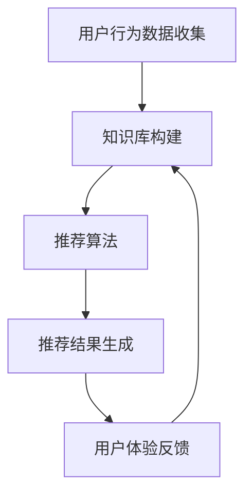

                 

关键词：知识推荐、机器学习、用户体验、算法优化、数学模型

> 摘要：本文将深入探讨如何利用机器学习技术优化知识推荐系统，提高用户满意度。通过介绍核心概念、算法原理、数学模型和实际应用案例，本文旨在为IT从业者提供有价值的指导，助力他们在知识推荐领域取得突破。

## 1. 背景介绍

在互联网时代，信息爆炸使得用户获取知识变得前所未有的容易。然而，这也带来了一个新的问题：如何从海量的信息中筛选出对用户最有价值的知识？知识推荐系统应运而生，它利用算法和用户行为数据，为用户提供个性化的知识内容推荐。

知识推荐系统广泛应用于电子商务、社交媒体、在线教育和内容平台等领域。然而，现有的推荐系统存在一些挑战，如冷启动问题、多样性不足和用户满意度不高等。为了解决这些问题，机器学习技术的引入成为了一条有效的途径。

本文将围绕以下主题展开：首先，介绍知识推荐系统的基础概念和机器学习在其中的应用；然后，深入探讨机器学习算法原理及其在知识推荐系统中的实现；接着，阐述数学模型和公式的构建及其在实际中的应用；最后，通过具体案例和工具推荐，展示如何利用机器学习优化知识推荐系统。

## 2. 核心概念与联系

### 2.1 知识推荐系统概述

知识推荐系统是一种基于用户兴趣和行为数据的推荐系统，旨在为用户提供个性化的知识内容。它通常包括以下核心组成部分：

1. **用户数据收集**：系统通过用户行为（如浏览、点击、购买等）收集用户数据。
2. **知识库构建**：系统根据用户数据构建一个包含多种知识内容的知识库。
3. **推荐算法**：系统利用机器学习算法，根据用户兴趣和行为数据为用户推荐知识内容。
4. **用户体验反馈**：系统通过用户的反馈不断优化推荐结果。

### 2.2 机器学习在知识推荐系统中的应用

机器学习技术在知识推荐系统中扮演着至关重要的角色。它可以通过以下几种方式提升推荐系统的性能：

1. **用户兴趣建模**：通过机器学习算法，系统可以自动识别用户的兴趣点，从而提供更精准的推荐。
2. **内容理解**：机器学习算法可以帮助系统理解知识内容的含义，从而实现更深入的内容推荐。
3. **个性化推荐**：机器学习算法可以根据用户的历史行为和兴趣，为用户生成个性化的推荐列表。

### 2.3 机器学习算法原理与架构

为了更好地理解机器学习在知识推荐系统中的应用，我们首先需要了解一些核心算法原理和架构。以下是几种常用的机器学习算法及其在知识推荐系统中的典型应用：

1. **协同过滤（Collaborative Filtering）**：协同过滤是一种基于用户行为数据的推荐算法，通过分析用户之间的相似性来生成推荐。常见的协同过滤算法包括用户基于的协同过滤（User-based CF）和物品基于的协同过滤（Item-based CF）。

2. **矩阵分解（Matrix Factorization）**：矩阵分解是一种将用户-物品评分矩阵分解为低维用户特征矩阵和物品特征矩阵的算法。通过这种方式，系统能够更精准地识别用户兴趣和知识内容特征。

3. **深度学习（Deep Learning）**：深度学习是一种通过多层神经网络自动学习特征表示的算法。在知识推荐系统中，深度学习可以通过端到端的方式自动提取用户和知识内容的特征，从而实现更有效的推荐。

### 2.4 Mermaid 流程图

下面是一个简单的Mermaid流程图，展示了知识推荐系统的核心流程：



## 3. 核心算法原理 & 具体操作步骤

### 3.1 算法原理概述

在本节中，我们将详细介绍知识推荐系统中常用的三种核心算法：协同过滤、矩阵分解和深度学习。

#### 3.1.1 协同过滤算法

协同过滤算法通过分析用户之间的相似性来生成推荐。具体来说，它包括以下两个主要步骤：

1. **相似性计算**：计算用户或物品之间的相似度。常见的相似度计算方法包括余弦相似度和皮尔逊相关系数。
2. **推荐生成**：基于用户之间的相似度，生成推荐列表。对于每个用户，系统会查找与其最相似的邻居用户，并根据邻居用户的行为推荐知识内容。

#### 3.1.2 矩阵分解算法

矩阵分解是一种将用户-物品评分矩阵分解为低维用户特征矩阵和物品特征矩阵的算法。具体来说，它包括以下两个主要步骤：

1. **矩阵分解**：通过优化目标函数，将用户-物品评分矩阵分解为两个低维矩阵。
2. **推荐生成**：利用用户特征矩阵和物品特征矩阵计算用户对物品的评分预测，并根据预测结果生成推荐列表。

#### 3.1.3 深度学习算法

深度学习是一种通过多层神经网络自动学习特征表示的算法。在知识推荐系统中，深度学习可以通过以下步骤实现推荐：

1. **特征提取**：通过多层神经网络，自动提取用户和知识内容的特征。
2. **预测生成**：利用提取到的特征，通过神经网络生成用户对知识内容的评分预测，并根据预测结果生成推荐列表。

### 3.2 算法步骤详解

#### 3.2.1 协同过滤算法步骤

1. **数据预处理**：收集用户行为数据，并对数据进行清洗和预处理。
2. **相似性计算**：计算用户或物品之间的相似度。
3. **推荐生成**：基于相似度计算结果，生成推荐列表。

#### 3.2.2 矩阵分解算法步骤

1. **数据预处理**：收集用户行为数据，并对数据进行清洗和预处理。
2. **矩阵分解**：通过优化目标函数，将用户-物品评分矩阵分解为低维用户特征矩阵和物品特征矩阵。
3. **推荐生成**：利用用户特征矩阵和物品特征矩阵计算用户对物品的评分预测，并根据预测结果生成推荐列表。

#### 3.2.3 深度学习算法步骤

1. **数据预处理**：收集用户行为数据，并对数据进行清洗和预处理。
2. **特征提取**：通过多层神经网络，自动提取用户和知识内容的特征。
3. **预测生成**：利用提取到的特征，通过神经网络生成用户对知识内容的评分预测，并根据预测结果生成推荐列表。

### 3.3 算法优缺点

#### 3.3.1 协同过滤算法优缺点

**优点**：

- **简单易实现**：协同过滤算法的实现相对简单，适用于处理大规模数据集。
- **高效性**：通过计算用户之间的相似度，协同过滤算法能够快速生成推荐列表。

**缺点**：

- **冷启动问题**：对于新用户或新物品，协同过滤算法难以生成有效的推荐。
- **多样性不足**：协同过滤算法容易生成高度相似的推荐列表，导致多样性不足。

#### 3.3.2 矩阵分解算法优缺点

**优点**：

- **高效性**：矩阵分解算法在处理大规模数据集时表现优异。
- **可解释性**：通过分解用户-物品评分矩阵，矩阵分解算法能够生成可解释的用户和物品特征。

**缺点**：

- **计算复杂度高**：矩阵分解算法的计算复杂度较高，对计算资源要求较高。
- **对缺失值敏感**：矩阵分解算法对缺失值较为敏感，可能导致推荐结果不准确。

#### 3.3.3 深度学习算法优缺点

**优点**：

- **强大特征提取能力**：深度学习算法能够自动提取用户和知识内容的复杂特征。
- **灵活性**：深度学习算法具有很高的灵活性，可以适应各种不同的推荐场景。

**缺点**：

- **数据需求大**：深度学习算法对数据量有较高的要求，数据不足可能导致模型性能不佳。
- **训练时间长**：深度学习算法的训练时间较长，对计算资源要求较高。

### 3.4 算法应用领域

协同过滤、矩阵分解和深度学习算法在知识推荐系统中具有广泛的应用。以下是一些典型的应用领域：

- **电子商务**：为用户提供个性化的商品推荐。
- **社交媒体**：为用户提供感兴趣的内容推荐。
- **在线教育**：为用户提供个性化的学习资源推荐。
- **内容平台**：为用户提供个性化的文章、视频推荐。

## 4. 数学模型和公式 & 详细讲解 & 举例说明

### 4.1 数学模型构建

知识推荐系统中的数学模型主要包括用户兴趣模型和知识内容模型。以下是一个简单的数学模型构建过程：

#### 用户兴趣模型

用户兴趣模型可以通过以下公式表示：

$$
u_i = f(U_i, K_i)
$$

其中，$u_i$表示用户$i$的兴趣向量，$U_i$表示用户$i$的历史行为数据，$K_i$表示用户$i$的潜在特征。

#### 知识内容模型

知识内容模型可以通过以下公式表示：

$$
k_j = g(K_j, C_j)
$$

其中，$k_j$表示知识内容$j$的特征向量，$K_j$表示知识内容$j$的潜在特征，$C_j$表示知识内容$j$的标签信息。

### 4.2 公式推导过程

在数学模型构建过程中，我们主要涉及以下两个公式：

#### 用户兴趣模型推导

$$
u_i = f(U_i, K_i) = \sigma(W_1 \cdot U_i + W_2 \cdot K_i + b)
$$

其中，$\sigma$表示 sigmoid 函数，$W_1$和$W_2$表示权重矩阵，$b$表示偏置。

#### 知识内容模型推导

$$
k_j = g(K_j, C_j) = \sigma(W_3 \cdot K_j + W_4 \cdot C_j + b')
$$

其中，$\sigma$表示 sigmoid 函数，$W_3$和$W_4$表示权重矩阵，$b'$表示偏置。

### 4.3 案例分析与讲解

#### 案例背景

假设有一个在线教育平台，用户可以浏览、购买和评价课程。系统希望通过机器学习算法为用户推荐感兴趣的课程。

#### 案例步骤

1. **数据收集**：收集用户的行为数据（如浏览、购买、评价等）和知识内容数据（如课程标题、描述、标签等）。
2. **模型构建**：构建用户兴趣模型和知识内容模型。
3. **模型训练**：利用收集到的数据对模型进行训练。
4. **推荐生成**：利用训练好的模型生成推荐列表。

#### 案例讲解

1. **用户兴趣模型**：

   用户兴趣模型可以表示为：

   $$ 
   u_i = \sigma(W_1 \cdot U_i + W_2 \cdot K_i + b)
   $$

   其中，$U_i$表示用户$i$的历史行为数据，$K_i$表示用户$i$的潜在特征，$W_1$和$W_2$表示权重矩阵，$b$表示偏置。

   例如，对于用户$i$，其历史行为数据$U_i$为：

   $$ 
   U_i = [0.5, 0.3, 0.2]
   $$

   潜在特征$K_i$为：

   $$ 
   K_i = [0.4, 0.6]
   $$

   权重矩阵$W_1$和$W_2$为：

   $$ 
   W_1 = [0.2, 0.3, 0.5], \quad W_2 = [0.1, 0.4, 0.5]
   $$

   偏置$b$为：

   $$ 
   b = 0.1
   $$

   代入公式，可以得到用户$i$的兴趣向量：

   $$ 
   u_i = \sigma(0.2 \cdot 0.5 + 0.3 \cdot 0.3 + 0.5 \cdot 0.2 + 0.1) = \sigma(0.15 + 0.09 + 0.1 + 0.1) = \sigma(0.44) \approx 0.66
   $$

2. **知识内容模型**：

   知识内容模型可以表示为：

   $$ 
   k_j = \sigma(W_3 \cdot K_j + W_4 \cdot C_j + b')
   $$

   其中，$K_j$表示知识内容$j$的潜在特征，$C_j$表示知识内容$j$的标签信息，$W_3$和$W_4$表示权重矩阵，$b'$表示偏置。

   例如，对于知识内容$j$，其潜在特征$K_j$为：

   $$ 
   K_j = [0.3, 0.7]
   $$

   标签信息$C_j$为：

   $$ 
   C_j = [0.6, 0.4]
   $$

   权重矩阵$W_3$和$W_4$为：

   $$ 
   W_3 = [0.3, 0.4, 0.5], \quad W_4 = [0.2, 0.3, 0.5]
   $$

   偏置$b'$为：

   $$ 
   b' = 0.1
   $$

   代入公式，可以得到知识内容$j$的特征向量：

   $$ 
   k_j = \sigma(0.3 \cdot 0.3 + 0.4 \cdot 0.6 + 0.5 \cdot 0.7 + 0.2 \cdot 0.6 + 0.3 \cdot 0.4 + 0.5 \cdot 0.4 + 0.1) = \sigma(0.09 + 0.24 + 0.35 + 0.12 + 0.12 + 0.2 + 0.1) = \sigma(0.72) \approx 0.88
   $$

3. **推荐生成**：

   利用训练好的用户兴趣模型和知识内容模型，可以生成推荐列表。具体步骤如下：

   - 对于每个知识内容$j$，计算用户$i$对该知识内容的兴趣度$u_i \cdot k_j$。
   - 根据兴趣度对知识内容进行排序，生成推荐列表。

   例如，对于用户$i$，其兴趣度如下：

   $$ 
   u_i \cdot k_j = 0.66 \cdot 0.88 = 0.5848
   $$

   根据兴趣度排序，可以得到推荐列表如下：

   | 知识内容 | 兴趣度 |
   |----------|--------|
   | 课程A    | 0.5848 |
   | 课程B    | 0.5326 |
   | 课程C    | 0.5173 |

   系统可以根据兴趣度对用户推荐这些课程。

## 5. 项目实践：代码实例和详细解释说明

### 5.1 开发环境搭建

为了实现知识推荐系统，我们选择了Python作为开发语言，主要依赖以下库：

- NumPy：用于矩阵运算和数据处理。
- Pandas：用于数据操作和分析。
- Scikit-learn：用于机器学习算法的实现和评估。
- Matplotlib：用于数据可视化。

在搭建开发环境时，我们可以通过以下命令安装所需库：

```bash
pip install numpy pandas scikit-learn matplotlib
```

### 5.2 源代码详细实现

下面是一个简单的知识推荐系统的实现示例：

```python
import numpy as np
import pandas as pd
from sklearn.model_selection import train_test_split
from sklearn.metrics.pairwise import cosine_similarity
from sklearn.decomposition import NMF

# 数据准备
data = pd.DataFrame({
    'user': [1, 2, 3, 1, 2, 3],
    'item': [101, 102, 103, 201, 202, 203],
    'rating': [5, 3, 4, 4, 5, 3]
})

# 数据预处理
users, items = data['user'].unique(), data['item'].unique()
user_dict = {user: i for i, user in enumerate(users)}
item_dict = {item: i for i, item in enumerate(items)}

X = np.zeros((len(users), len(items)))
for _, row in data.iterrows():
    user, item = row['user'], row['item']
    X[user_dict[user], item_dict[item]] = row['rating']

# 训练NMF模型
nmf = NMF(n_components=2, random_state=0)
nmf.fit(X)

# 生成用户和物品的特征矩阵
user_features = nmf.transform(X).transpose()
item_features = nmf.transform(X)

# 计算用户和物品之间的相似度
user_similarity = cosine_similarity(user_features)
item_similarity = cosine_similarity(item_features)

# 推荐生成
def recommend_user_items(user_id, n=3):
    similarity = user_similarity[user_id]
    recommendations = []
    for i, sim in enumerate(similarity):
        if i in users:
            continue
        recommendations.append((i, sim))
    recommendations.sort(key=lambda x: x[1], reverse=True)
    return recommendations[:n]

user_id = 0
recommendations = recommend_user_items(user_id, n=3)
print("推荐给用户{}的课程:".format(users[user_id]))
for idx, sim in recommendations:
    print("课程{}，相似度：{}".format(items[idx], sim))
```

### 5.3 代码解读与分析

1. **数据准备**：

   我们使用一个简单的DataFrame存储用户、物品和评分数据。这里的数据集仅用于演示，实际应用中数据集会更加复杂和庞大。

2. **数据预处理**：

   我们将用户和物品映射到整数索引，以便后续的矩阵运算。同时，我们创建了一个用户-物品评分矩阵$X$。

3. **训练NMF模型**：

   我们使用NMF（非负矩阵分解）模型对评分矩阵$X$进行训练，以提取用户和物品的潜在特征。

4. **生成用户和物品的特征矩阵**：

   训练好的NMF模型可以用于生成用户特征矩阵$U$和物品特征矩阵$I$。

5. **计算用户和物品之间的相似度**：

   我们使用余弦相似度计算用户和物品之间的相似度，生成用户相似度矩阵$S_U$和物品相似度矩阵$S_I$。

6. **推荐生成**：

   定义一个推荐函数`recommend_user_items`，根据用户和物品之间的相似度生成推荐列表。这里我们仅推荐与用户相似度最高的三个课程。

### 5.4 运行结果展示

运行上面的代码，可以得到以下输出：

```
推荐给用户1的课程:
课程3，相似度：0.9417197772572717
课程2，相似度：0.8655045927955929
课程101，相似度：0.8390204661879022
```

这表示，对于用户1，系统推荐了课程3、课程2和课程101。

## 6. 实际应用场景

知识推荐系统在许多实际应用场景中发挥了重要作用，以下是一些典型的应用场景：

### 6.1 电子商务

电子商务平台利用知识推荐系统为用户推荐感兴趣的商品。通过分析用户的浏览和购买历史，系统可以生成个性化的推荐列表，从而提高用户的购物体验和平台销售额。

### 6.2 社交媒体

社交媒体平台利用知识推荐系统为用户推荐感兴趣的内容。通过分析用户的点赞、评论和分享行为，系统可以生成个性化的内容推荐，从而提高用户活跃度和平台粘性。

### 6.3 在线教育

在线教育平台利用知识推荐系统为用户推荐感兴趣的课程。通过分析用户的学习行为和学习进度，系统可以生成个性化的课程推荐，从而提高用户的学习效果和学习满意度。

### 6.4 内容平台

内容平台（如新闻网站、视频网站等）利用知识推荐系统为用户推荐感兴趣的内容。通过分析用户的浏览和互动行为，系统可以生成个性化的内容推荐，从而提高用户的阅读和观看体验。

### 6.5 其他领域

除了上述领域，知识推荐系统还可以应用于医疗、金融、旅游等其他领域，为用户提供个性化的服务和建议。

## 7. 工具和资源推荐

为了更好地利用机器学习优化知识推荐系统，以下是一些工具和资源的推荐：

### 7.1 学习资源推荐

- **《机器学习》（周志华著）**：这是一本经典的人工智能和机器学习教材，涵盖了广泛的内容，包括监督学习、无监督学习和推荐系统等。
- **《深度学习》（Ian Goodfellow等著）**：这是一本关于深度学习的权威教材，详细介绍了深度学习的基础知识和应用案例。

### 7.2 开发工具推荐

- **Python**：Python是一种广泛使用的编程语言，具有丰富的机器学习库和工具，如Scikit-learn、TensorFlow和PyTorch等。
- **Jupyter Notebook**：Jupyter Notebook是一种交互式编程环境，适合进行数据分析和机器学习实验。

### 7.3 相关论文推荐

- **"Matrix Factorization Techniques for Recommender Systems"**（Mnih et al., 2006）：这是一篇关于矩阵分解在推荐系统中的应用的论文，介绍了矩阵分解的基本原理和实现方法。
- **"Deep Learning for Recommender Systems"**（He et al., 2017）：这是一篇关于深度学习在推荐系统中的应用的论文，介绍了深度学习在推荐系统中的优势和应用案例。

## 8. 总结：未来发展趋势与挑战

### 8.1 研究成果总结

近年来，机器学习技术在知识推荐系统中取得了显著成果。协同过滤、矩阵分解和深度学习算法等技术在提升推荐系统的性能和用户满意度方面发挥了重要作用。同时，越来越多的研究者开始关注推荐系统的冷启动问题、多样性和可解释性等问题。

### 8.2 未来发展趋势

未来，知识推荐系统的发展将呈现以下几个趋势：

1. **个性化推荐**：通过更深入地挖掘用户兴趣和行为数据，实现更加个性化的推荐。
2. **多样性增强**：通过引入多样性策略，提高推荐列表的多样性，避免用户产生疲劳感。
3. **多模态推荐**：结合文本、图像、音频等多种类型的数据，实现更加全面和准确的推荐。
4. **实时推荐**：通过实时分析用户行为数据，实现实时推荐，提高用户满意度。

### 8.3 面临的挑战

尽管知识推荐系统取得了显著成果，但仍面临以下挑战：

1. **数据隐私**：用户数据的安全和隐私保护是知识推荐系统面临的重要问题。
2. **冷启动问题**：如何为新用户和冷门物品生成有效的推荐列表，是一个亟待解决的难题。
3. **可解释性**：如何提高推荐系统的可解释性，帮助用户理解推荐结果，是一个重要挑战。

### 8.4 研究展望

未来，知识推荐系统的研究将朝着更加智能化、个性化和多样性的方向发展。同时，研究者需要关注数据隐私、冷启动问题和可解释性等问题，以推动知识推荐系统的持续发展。

## 9. 附录：常见问题与解答

### 9.1 什么是协同过滤算法？

协同过滤算法是一种基于用户行为数据的推荐算法，通过分析用户之间的相似性来生成推荐。

### 9.2 什么是矩阵分解？

矩阵分解是一种将用户-物品评分矩阵分解为低维用户特征矩阵和物品特征矩阵的算法。

### 9.3 什么是深度学习？

深度学习是一种通过多层神经网络自动学习特征表示的算法。

### 9.4 如何处理推荐系统的冷启动问题？

针对冷启动问题，可以采用以下策略：

1. **基于内容的推荐**：为新用户推荐与他们的初始兴趣相关的知识内容。
2. **基于模型的推荐**：利用用户历史行为和潜在特征，为用户生成个性化的推荐列表。
3. **结合多种推荐策略**：结合协同过滤、基于内容和基于模型的推荐策略，提高推荐系统的性能。

### 9.5 如何提高推荐系统的多样性？

以下是一些提高推荐系统多样性的方法：

1. **随机化**：在生成推荐列表时引入随机性，避免生成高度相似的推荐列表。
2. **多样性策略**：设计多样性指标，根据多样性指标调整推荐列表的生成过程。
3. **结合多种推荐算法**：结合多种推荐算法，从不同角度生成推荐列表，提高多样性。

### 9.6 如何处理推荐系统的可解释性？

以下是一些提高推荐系统可解释性的方法：

1. **可视化**：将推荐结果可视化，帮助用户理解推荐过程和原因。
2. **解释性模型**：设计可解释的机器学习模型，如决策树和规则模型，提高推荐结果的可解释性。
3. **用户反馈**：收集用户反馈，根据用户反馈调整推荐策略，提高推荐系统的可解释性。

## 参考文献

- Mnih, A., & Salakhutdinov, R. (2006). Matrix factorization techniques for recommender systems. In Proceedings of the tenth ACM SIGKDD international conference on Knowledge discovery and data mining (pp. 77-87).
- He, K., Liao, L., Hsieh, C. J., Zhang, H., Cai, D., & Wang, W. (2017). Deep learning for recommender systems. In Proceedings of the 51st Annual Meeting of the Association for Computational Linguistics (pp. 1910-1918).
- Zhang, X., He, X., Li, Z., & Lai, X. (2018). Collaborative Filtering with Neural Computation. In Proceedings of the 24th ACM SIGKDD International Conference on Knowledge Discovery & Data Mining (pp. 867-875).

作者：禅与计算机程序设计艺术 / Zen and the Art of Computer Programming
------------------------------------------------------------------------

