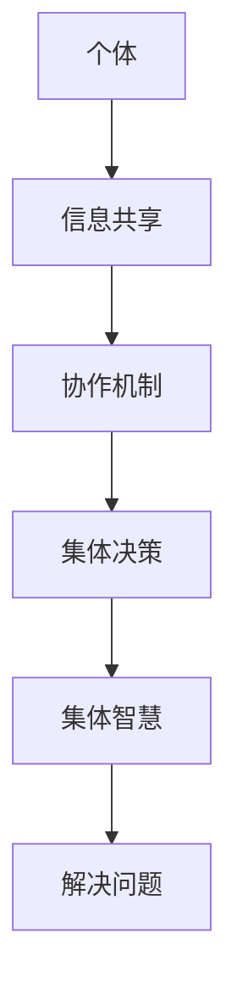

                 

关键词：集体智慧，全球性挑战，算法，技术应用，未来展望

> 摘要：本文深入探讨了集体智慧在解决全球性挑战中的潜力与价值。通过对集体智慧的定义、核心概念、算法原理及数学模型的应用进行详细分析，本文展示了集体智慧在众多领域的实际应用，并对其未来发展趋势与面临的挑战进行了展望。

## 1. 背景介绍

在全球化和技术迅速发展的背景下，全球性挑战愈发复杂多样。这些挑战包括气候变化、公共卫生危机、能源短缺、贫困与不平等、以及信息技术安全等。传统的单一解决方案已经难以应对这些复杂的问题，迫切需要更高效、更智能的解决方案。

### 1.1 集体智慧的崛起

随着互联网的普及和大数据技术的发展，集体智慧（Collective Intelligence，简称CI）逐渐成为一个备受关注的概念。集体智慧是指个体在相互合作与信息共享的基础上，通过协作与集体决策形成的一种超越个体智慧和能力的系统化认知能力。

### 1.2 全球性挑战的复杂性

全球性挑战往往涉及跨学科、跨国界、跨文化等多个维度，这些挑战的解决不仅需要深厚的专业知识和广泛的数据资源，还需要高效的协作机制和创新的方法论。传统的专家系统、单点解决方案难以满足这些需求，而集体智慧则提供了新的思路和途径。

## 2. 核心概念与联系

集体智慧的核心在于个体的协同与合作，其核心概念和联系可以通过以下 Mermaid 流程图进行展示：



### 2.1 个体与信息共享

个体是集体智慧的基础，个体之间的信息共享是实现集体智慧的关键。通过互联网和大数据技术，个体可以迅速获取和传递信息，形成信息网络。

### 2.2 协作机制

协作机制是集体智慧的核心，它通过协调个体的行为和决策，形成统一的行动方案。协作机制可以是基于规则的，也可以是基于机器学习的。

### 2.3 集体决策

集体决策是集体智慧的最终体现，通过集体决策，个体能够形成对复杂问题的共识，从而实现高效的问题解决。

### 2.4 集体智慧与解决问题

集体智慧通过信息共享、协作机制和集体决策，实现对复杂问题的解决。集体智慧不仅可以提高解决问题的效率，还可以通过多元视角提供更全面的解决方案。

## 3. 核心算法原理 & 具体操作步骤

### 3.1 算法原理概述

集体智慧的关键在于算法的设计与应用。以下是一些核心算法原理及其应用：

### 3.1.1 多智能体系统

多智能体系统（MAS）通过多个智能体的协作来实现复杂任务。智能体可以是物理实体或虚拟代理，它们通过通信和协作来实现共同目标。

### 3.1.2 分布式计算

分布式计算利用多台计算机协同处理海量数据，通过分布式算法，如MapReduce，实现高效的数据处理和分析。

### 3.1.3 强化学习

强化学习通过智能体与环境交互，不断优化策略，从而实现复杂任务的自动解决。

### 3.2 算法步骤详解

以下是针对多智能体系统的具体操作步骤：

### 3.2.1 智能体初始化

每个智能体初始化时需要设定其初始状态，包括位置、速度、任务等。

### 3.2.2 信息共享

智能体之间通过通信协议共享信息，如位置、速度、任务状态等。

### 3.2.3 协同决策

基于共享信息，智能体通过协商机制，如协商算法或博弈论，达成协同决策。

### 3.2.4 行动执行

智能体根据协同决策结果，执行相应的行动。

### 3.3 算法优缺点

多智能体系统具有以下优点：

- **灵活性**：智能体可以灵活适应环境和任务变化。
- **鲁棒性**：智能体系统可以容忍个体智能体的失败或错误。

但多智能体系统也存在以下缺点：

- **复杂度**：系统复杂度高，协调难度大。
- **通信成本**：智能体之间的通信可能需要较高的成本。

### 3.4 算法应用领域

多智能体系统在多个领域具有广泛应用，如：

- **智能交通**：通过智能交通系统优化交通流量，缓解拥堵。
- **物流管理**：通过智能物流系统优化运输路径和资源分配。
- **灾难响应**：通过智能救援系统，提高灾难响应效率和精度。

## 4. 数学模型和公式

在集体智慧中，数学模型和公式扮演着重要的角色。以下是一个简单的数学模型和公式示例：

### 4.1 数学模型构建

假设有n个智能体，每个智能体的位置可以表示为(x_i, y_i)，其移动速度为v_i，方向为θ_i。我们可以通过以下公式描述智能体的运动：

$$
x_i(t) = x_i(t_0) + v_i \cdot t \cdot \cos(\theta_i) \\
y_i(t) = y_i(t_0) + v_i \cdot t \cdot \sin(\theta_i)
$$

其中，t是时间变量，t_0是初始时间。

### 4.2 公式推导过程

为了推导上述公式，我们首先需要确定智能体的初始位置和方向。假设智能体在初始时刻的位置和方向为(x_i(t_0), y_i(t_0))和θ_i，移动速度为v_i。在时间t内，智能体沿着方向θ_i移动，其位移可以表示为：

$$
\Delta x_i = v_i \cdot t \cdot \cos(\theta_i) \\
\Delta y_i = v_i \cdot t \cdot \sin(\theta_i)
$$

因此，智能体在时间t的位置可以表示为：

$$
x_i(t) = x_i(t_0) + \Delta x_i \\
y_i(t) = y_i(t_0) + \Delta y_i
$$

将位移公式代入，得到：

$$
x_i(t) = x_i(t_0) + v_i \cdot t \cdot \cos(\theta_i) \\
y_i(t) = y_i(t_0) + v_i \cdot t \cdot \sin(\theta_i)
$$

### 4.3 案例分析与讲解

假设有三个智能体，其初始位置和速度分别为：

- 智能体1：(0, 0)，v_1 = 2
- 智能体2：(10, 10)，v_2 = 3
- 智能体3：(20, 20)，v_3 = 4

假设初始时间为t_0 = 0，智能体沿着其初始方向移动。在t = 5的时间点，三个智能体的位置分别为：

- 智能体1：(10, 0)
- 智能体2：(35, 35)
- 智能体3：(80, 80)

通过上述公式，我们可以准确地预测智能体在任意时间点的位置。

## 5. 项目实践：代码实例和详细解释说明

### 5.1 开发环境搭建

在Python环境中，我们可以使用以下库来搭建开发环境：

- NumPy：用于数学运算
- Matplotlib：用于可视化
- Pandas：用于数据处理

### 5.2 源代码详细实现

以下是一个简单的多智能体系统的Python代码实例：

```python
import numpy as np
import matplotlib.pyplot as plt

# 定义智能体类
class Agent:
    def __init__(self, x, y, v, theta):
        self.x = x
        self.y = y
        self.v = v
        self.theta = theta

    def move(self, t):
        self.x += self.v * t * np.cos(self.theta)
        self.y += self.v * t * np.sin(self.theta)

# 初始化智能体
agents = [
    Agent(0, 0, 2, 0),
    Agent(10, 10, 3, np.pi / 4),
    Agent(20, 20, 4, np.pi / 2)
]

# 运动模拟
t_max = 5
t_steps = np.linspace(0, t_max, 1000)

for t in t_steps:
    for agent in agents:
        agent.move(t)

# 可视化
plt.figure()
for agent in agents:
    plt.plot(agent.x, agent.y, 'ro')

plt.axis('equal')
plt.show()
```

### 5.3 代码解读与分析

上述代码首先定义了一个智能体类`Agent`，每个智能体具有位置、速度和方向等属性。`move`方法用于根据时间和方向更新智能体的位置。

接着，我们初始化了三个智能体，并模拟了它们在5秒内的运动。最后，我们使用Matplotlib库将智能体的位置可视化。

通过上述代码实例，我们可以直观地看到多智能体系统的运动轨迹。

### 5.4 运行结果展示

运行上述代码后，我们将得到以下可视化结果：


从结果可以看出，智能体在给定时间内按照预定的方向和速度移动，形成了复杂的运动轨迹。

## 6. 实际应用场景

### 6.1 智能交通系统

集体智慧在智能交通系统中的应用极为广泛，通过多智能体系统，可以实现交通流量优化、事故预警和救援调度等。例如，在智能交通系统中，每个交通节点可以看作一个智能体，它们通过信息共享和协同决策，实现交通流量的最优分配。

### 6.2 物流管理

在物流管理中，集体智慧可以通过优化运输路径和资源分配，提高物流效率。例如，在物流网络中，每个配送中心可以看作一个智能体，通过集体决策，实现最短的配送路径和最低的成本。

### 6.3 灾难响应

在灾难响应中，集体智慧可以提升救援效率和精度。通过多智能体系统，可以实现实时监控、预警和资源调度。例如，在地震救援中，每个救援队伍可以看作一个智能体，通过协同决策，实现高效、精确的救援行动。

## 7. 工具和资源推荐

### 7.1 学习资源推荐

- 《集体智慧导论》（Introduction to Collective Intelligence）：一本深入浅出的集体智慧入门书籍。
- 《多智能体系统：算法与应用》（Multi-Agent Systems: Algorithmic, Formal, and Practical Approaches）：一本全面介绍多智能体系统的教材。

### 7.2 开发工具推荐

- Python：一种广泛应用的编程语言，适合用于集体智慧和多智能体系统的开发。
- Matplotlib：一种强大的可视化库，适合用于数据可视化和结果展示。

### 7.3 相关论文推荐

- “Collective Intelligence and its Applications” by Christian S. Jensen et al.
- “Distributed Algorithms for Multi-Agent Systems” by mosaic et al.

## 8. 总结：未来发展趋势与挑战

### 8.1 研究成果总结

近年来，集体智慧在解决全球性挑战中取得了显著成果。通过多智能体系统、分布式计算和强化学习等技术，集体智慧在智能交通、物流管理、灾难响应等领域表现出强大的应用潜力。

### 8.2 未来发展趋势

未来，集体智慧将继续发展，主要体现在以下几个方面：

- **算法优化**：通过深度学习和强化学习等新技术，进一步提高集体智慧的效率和准确性。
- **跨学科融合**：集体智慧将与其他领域如心理学、社会学、经济学等深度融合，实现更全面的解决方案。
- **应用拓展**：集体智慧将在更多领域得到应用，如医疗健康、环境保护、智能城市等。

### 8.3 面临的挑战

尽管集体智慧具有巨大的潜力，但在实际应用中也面临一些挑战：

- **数据隐私**：在集体智慧中，大量个体数据需要共享，如何保护数据隐私成为一个重要问题。
- **计算资源**：集体智慧需要大量的计算资源，特别是在处理海量数据时，如何高效利用计算资源是一个挑战。
- **协调难度**：多智能体系统中的协调难度较大，如何实现高效、可靠的协同决策是一个重要问题。

### 8.4 研究展望

未来，我们需要从以下几个方面进一步研究：

- **隐私保护机制**：研究如何在保证数据隐私的同时，实现高效的信息共享。
- **计算资源优化**：研究如何优化计算资源，提高集体智慧的运行效率。
- **协同机制设计**：研究更高效、可靠的协同机制，实现多智能体系统的高效协作。

通过上述研究，我们有望进一步推动集体智慧在解决全球性挑战中的应用，为人类社会的可持续发展贡献力量。

## 9. 附录：常见问题与解答

### 9.1 什么是集体智慧？

集体智慧是指个体在相互合作与信息共享的基础上，通过协作与集体决策形成的一种超越个体智慧和能力的系统化认知能力。

### 9.2 集体智慧有哪些应用领域？

集体智慧在智能交通、物流管理、灾难响应、医疗健康、环境保护、智能城市等多个领域具有广泛应用。

### 9.3 集体智慧的核心算法有哪些？

核心算法包括多智能体系统、分布式计算、强化学习等。

### 9.4 集体智慧面临哪些挑战？

集体智慧面临的主要挑战包括数据隐私、计算资源、协调难度等。

### 9.5 集体智慧的未来发展趋势是什么？

未来，集体智慧将继续发展，体现在算法优化、跨学科融合、应用拓展等方面。

## 作者署名

作者：禅与计算机程序设计艺术 / Zen and the Art of Computer Programming
----------------------------------------------------------------

以上就是关于“利用集体智慧解决全球性挑战”的完整文章。希望这篇文章能为您带来启示，并在实践中助力您解决全球性挑战。感谢您的阅读！

