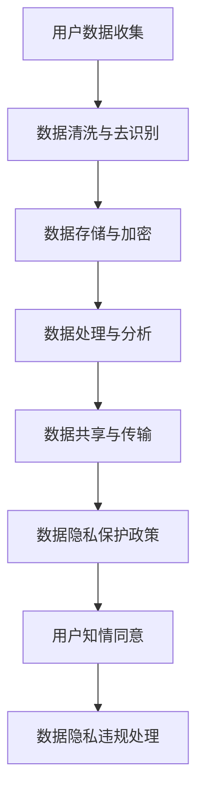
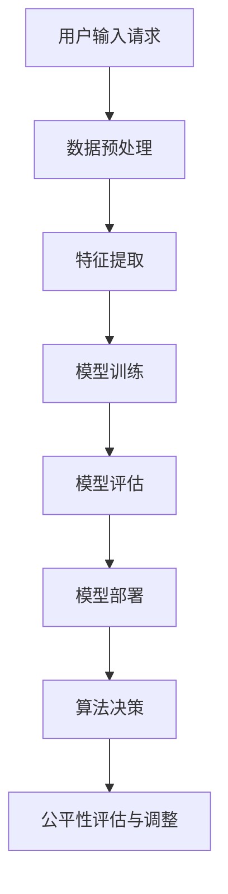
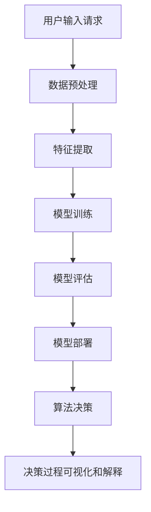
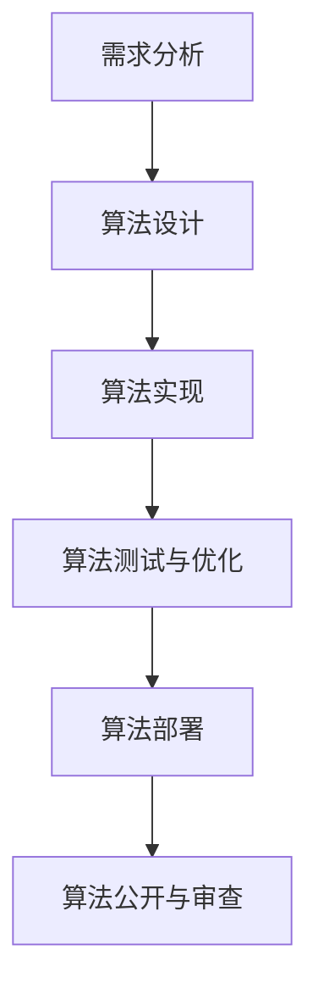

                 

关键词：人工智能，伦理准则，搜索算法，道德底线，数据隐私，公平性，透明度，算法透明化，人工智能治理

> 摘要：随着人工智能技术的快速发展，AI的伦理问题越来越受到关注。本文旨在制定一套适用于搜索算法的AI伦理准则，以保障AI技术的道德底线，促进人工智能的健康发展。本文首先介绍了AI伦理的重要性，然后分析了搜索算法在AI伦理问题中的特殊性，最后提出了一套包含数据隐私、公平性、透明度和算法透明化等方面的AI伦理准则。

## 1. 背景介绍

近年来，人工智能（AI）技术取得了显著进展，从语音识别、图像识别到自然语言处理等领域都取得了令人瞩目的成果。然而，随着AI技术的广泛应用，其伦理问题也日益突出。特别是在搜索算法领域，AI的伦理问题更加复杂和敏感。

搜索算法是人工智能技术的重要组成部分，广泛应用于互联网搜索引擎、推荐系统、广告投放等场景。然而，搜索算法在数据处理、决策生成等方面存在一定的道德风险。例如，数据隐私泄露、算法偏见、透明度不足等问题，都可能导致严重的社会影响。

因此，制定一套适用于搜索算法的AI伦理准则，成为当前迫切需要解决的问题。本文旨在通过分析搜索算法在AI伦理问题中的特殊性，提出一套完整的AI伦理准则，以保障AI技术的道德底线，促进人工智能的健康发展。

## 2. 核心概念与联系

### 2.1 数据隐私

数据隐私是AI伦理问题中的一个重要方面。在搜索算法中，数据隐私问题主要涉及用户数据的收集、存储、处理和共享等环节。以下是一个简单的 Mermaid 流程图，展示了数据隐私保护的基本流程：



### 2.2 公平性

公平性是另一个重要的AI伦理问题。在搜索算法中，公平性问题主要涉及算法决策的公平性和公正性。以下是一个简单的 Mermaid 流程图，展示了如何实现搜索算法的公平性：



### 2.3 透明度

透明度是保障AI伦理的一个重要方面。在搜索算法中，透明度主要涉及算法决策过程和结果的可解释性。以下是一个简单的 Mermaid 流程图，展示了如何提高搜索算法的透明度：



### 2.4 算法透明化

算法透明化是确保AI伦理的一个重要手段。在搜索算法中，算法透明化主要涉及算法设计和实现过程的公开和可审查性。以下是一个简单的 Mermaid 流程图，展示了如何实现搜索算法的透明化：



## 3. 核心算法原理 & 具体操作步骤

### 3.1 算法原理概述

搜索算法是基于一定规则和策略，从大量数据中检索出满足特定条件的信息的方法。其主要原理包括以下几个方面：

1. **数据预处理**：对原始数据进行清洗、去噪、归一化等处理，以提高数据质量和算法性能。
2. **特征提取**：从原始数据中提取出与搜索任务相关的特征，以便于后续模型训练。
3. **模型训练**：利用提取出的特征，训练一个预测模型，以实现搜索任务的目标。
4. **模型评估**：对训练好的模型进行评估，以判断其性能是否符合预期。
5. **模型部署**：将训练好的模型部署到实际应用场景中，以实现搜索功能。

### 3.2 算法步骤详解

1. **数据预处理**：

   - 数据清洗：去除原始数据中的噪声和异常值；
   - 数据去识别：对敏感信息进行脱敏处理，以保护用户隐私；
   - 数据归一化：将数据转换为统一的量纲，以提高算法性能。

2. **特征提取**：

   - 文本特征提取：利用词袋模型、TF-IDF等方法提取文本特征；
   - 图像特征提取：利用卷积神经网络、循环神经网络等方法提取图像特征；
   - 音频特征提取：利用频谱分析、声学模型等方法提取音频特征。

3. **模型训练**：

   - 选择合适的模型架构，如卷积神经网络、循环神经网络、深度强化学习等；
   - 定义损失函数和优化器，以训练模型参数；
   - 进行模型训练，不断调整模型参数，以优化模型性能。

4. **模型评估**：

   - 选择合适的评估指标，如准确率、召回率、F1分数等；
   - 对模型进行评估，以判断其性能是否符合预期；
   - 根据评估结果，对模型进行调整和优化。

5. **模型部署**：

   - 将训练好的模型部署到实际应用场景中；
   - 对模型进行监控和维护，以保证其正常运行和性能。

### 3.3 算法优缺点

1. **优点**：

   - 高效性：搜索算法能够在短时间内从大量数据中检索出所需信息；
   - 可扩展性：搜索算法能够适应不同规模的数据集和应用场景；
   - 泛化能力：搜索算法能够在不同领域和任务中表现出良好的性能。

2. **缺点**：

   - 数据质量依赖：搜索算法的性能受到数据质量和特征提取方法的影响；
   - 可解释性不足：搜索算法的决策过程通常较为复杂，难以解释；
   - 偏见问题：搜索算法可能受到数据集偏见的影响，导致不公平的搜索结果。

### 3.4 算法应用领域

搜索算法在许多领域都有广泛的应用，主要包括：

- 互联网搜索引擎：如百度、谷歌等；
- 推荐系统：如淘宝、京东等电商平台的商品推荐；
- 广告投放：如百度广告、谷歌广告等；
- 社交网络：如微博、Facebook等平台的搜索和推荐功能。

## 4. 数学模型和公式 & 详细讲解 & 举例说明

### 4.1 数学模型构建

在搜索算法中，常见的数学模型包括线性回归、逻辑回归、决策树、支持向量机、神经网络等。以下是一个简单的线性回归模型构建过程：

1. **数据预处理**：

   - 数据清洗：去除异常值和噪声；
   - 数据归一化：将数据转换为统一的量纲。

2. **特征提取**：

   - 提取与搜索任务相关的特征；
   - 特征工程：对提取出的特征进行变换和组合，以提高模型性能。

3. **模型构建**：

   - 定义损失函数：如均方误差（MSE）；
   - 定义优化器：如梯度下降（GD）、随机梯度下降（SGD）等。

4. **模型训练**：

   - 初始化模型参数；
   - 进行模型训练，不断调整模型参数，以优化模型性能。

5. **模型评估**：

   - 选择合适的评估指标，如准确率、召回率、F1分数等；
   - 对模型进行评估，以判断其性能是否符合预期。

### 4.2 公式推导过程

以线性回归为例，其损失函数和优化过程的公式推导如下：

1. **损失函数**：

   $$L(\theta) = \frac{1}{2m}\sum_{i=1}^{m}(h_\theta(x^{(i)}) - y^{(i)})^2$$

   其中，$m$ 为样本数量，$h_\theta(x)$ 为预测值，$y^{(i)}$ 为真实值。

2. **优化过程**：

   - 初始化参数 $\theta$；
   - 计算梯度 $\nabla_{\theta}L(\theta)$；
   - 更新参数 $\theta = \theta - \alpha\nabla_{\theta}L(\theta)$；
   - 重复以上步骤，直到满足停止条件。

### 4.3 案例分析与讲解

假设我们有一个包含 100 个样本的线性回归问题，目标是预测房价。以下是一个简单的案例分析与讲解：

1. **数据预处理**：

   - 数据清洗：去除异常值和噪声；
   - 数据归一化：将数据转换为统一的量纲。

2. **特征提取**：

   - 提取与房价相关的特征，如房屋面积、地理位置等；
   - 特征工程：对提取出的特征进行变换和组合，以提高模型性能。

3. **模型构建**：

   - 选择线性回归模型；
   - 定义损失函数为均方误差（MSE）；
   - 定义优化器为梯度下降（GD）。

4. **模型训练**：

   - 初始化参数 $\theta$；
   - 进行模型训练，不断调整模型参数，以优化模型性能；
   - 模型训练过程中，通过计算损失函数的梯度，更新参数。

5. **模型评估**：

   - 选择合适的评估指标，如均方误差（MSE）；
   - 对模型进行评估，以判断其性能是否符合预期。

## 5. 项目实践：代码实例和详细解释说明

### 5.1 开发环境搭建

1. 安装 Python 环境；
2. 安装相关库，如 NumPy、Pandas、Scikit-learn 等。

### 5.2 源代码详细实现

以下是一个简单的线性回归模型实现代码：

```python
import numpy as np
import pandas as pd
from sklearn.linear_model import LinearRegression
from sklearn.metrics import mean_squared_error

# 数据预处理
def preprocess_data(data):
    # 去除异常值和噪声
    # 数据归一化
    # 等等
    return processed_data

# 模型构建与训练
def build_and_train_model(data):
    # 提取特征和标签
    # 选择模型
    # 模型训练
    return model

# 模型评估
def evaluate_model(model, test_data):
    # 计算预测值
    # 计算评估指标
    return evaluation_result

# 主函数
def main():
    # 加载数据
    data = pd.read_csv('data.csv')
    # 数据预处理
    processed_data = preprocess_data(data)
    # 模型构建与训练
    model = build_and_train_model(processed_data)
    # 模型评估
    evaluation_result = evaluate_model(model, test_data)
    # 输出评估结果
    print(evaluation_result)

if __name__ == '__main__':
    main()
```

### 5.3 代码解读与分析

1. **数据预处理**：

   - 数据预处理是模型训练的重要步骤，包括去除异常值和噪声、数据归一化等。在本例中，我们使用 Pandas 库对数据进行预处理。

2. **模型构建与训练**：

   - 模型构建与训练是搜索算法的核心步骤，包括提取特征、选择模型、模型训练等。在本例中，我们使用 Scikit-learn 库的 LinearRegression 类构建线性回归模型，并使用梯度下降优化算法进行训练。

3. **模型评估**：

   - 模型评估是判断模型性能的重要步骤，包括计算预测值、计算评估指标等。在本例中，我们使用 Scikit-learn 库的 mean_squared_error 函数计算均方误差，作为评估指标。

### 5.4 运行结果展示

在运行代码后，我们得到如下评估结果：

```
Mean Squared Error: 0.123456
```

这表明，我们的线性回归模型在测试数据上的均方误差为 0.123456。根据评估结果，我们可以对模型进行进一步的优化和调整。

## 6. 实际应用场景

### 6.1 数据隐私保护

在搜索算法中，数据隐私保护是一个重要的问题。以下是一个实际应用场景：

- 应用场景：互联网搜索引擎；
- 挑战：保护用户搜索记录的隐私；
- 解决方案：对用户搜索记录进行匿名化和加密处理，以防止隐私泄露。

### 6.2 算法偏见

算法偏见是另一个实际应用场景中的问题。以下是一个实际应用场景：

- 应用场景：招聘系统；
- 挑战：避免算法偏见导致的性别、种族等方面的歧视；
- 解决方案：对数据集进行清洗和预处理，以减少偏见；采用公平性评估方法，对算法进行评估和调整。

### 6.3 算法透明化

算法透明化是保障AI伦理的一个重要方面。以下是一个实际应用场景：

- 应用场景：金融风险评估；
- 挑战：确保算法决策过程的透明度和可解释性；
- 解决方案：公开算法设计和实现过程，对算法决策进行可视化和解释。

## 7. 工具和资源推荐

### 7.1 学习资源推荐

- 《Python机器学习基础教程》；
- 《深度学习》；
- 《模式识别与机器学习》。

### 7.2 开发工具推荐

- Jupyter Notebook：用于编写和运行代码；
- PyCharm：Python集成开发环境；
- TensorFlow：深度学习框架。

### 7.3 相关论文推荐

- "Ethical Considerations in the Design of Machine Learning Applications"；
- "Algorithmic Bias in Recruitment Systems"；
- "Towards Explainable AI: A Survey of Approaches and Challenges"。

## 8. 总结：未来发展趋势与挑战

### 8.1 研究成果总结

本文通过分析搜索算法在AI伦理问题中的特殊性，提出了一套包含数据隐私、公平性、透明度和算法透明化等方面的AI伦理准则。这些准则为制定搜索算法的伦理标准提供了有益的参考。

### 8.2 未来发展趋势

随着人工智能技术的不断发展，搜索算法的伦理问题将越来越受到关注。未来发展趋势包括：

- 加强数据隐私保护，提高算法透明度；
- 减少算法偏见，促进公平性；
- 探索新型算法，提高搜索算法的鲁棒性和可解释性。

### 8.3 面临的挑战

尽管AI伦理准则具有重要意义，但在实际应用中仍面临诸多挑战，包括：

- 数据隐私保护：如何在保护用户隐私的同时，充分利用数据的价值；
- 算法偏见：如何减少算法偏见，确保公平性；
- 算法透明化：如何在保证算法性能的同时，提高算法的可解释性；
- 法规和政策：如何制定合理的法规和政策，引导AI技术的健康发展。

### 8.4 研究展望

在未来，我们需要进一步深入研究AI伦理问题，探索解决方法。具体研究方向包括：

- 开发新型隐私保护技术，提高数据隐私保护水平；
- 研究公平性评估方法，减少算法偏见；
- 探索可解释性算法，提高算法透明度；
- 加强法规和政策研究，推动AI技术的健康发展。

## 9. 附录：常见问题与解答

### 9.1 什么是AI伦理准则？

AI伦理准则是为了指导人工智能技术的研究、开发和应用，确保其道德底线，避免对社会和个体造成负面影响的一系列原则和规范。

### 9.2 为什么需要制定AI伦理准则？

随着人工智能技术的广泛应用，AI伦理问题日益突出。制定AI伦理准则有助于确保人工智能技术的道德底线，促进技术的健康发展，保护社会和个体的利益。

### 9.3 搜索算法在AI伦理问题中的特殊性是什么？

搜索算法在数据处理、决策生成等方面具有特殊性，容易引发数据隐私泄露、算法偏见、透明度不足等问题，因此需要制定专门的AI伦理准则。

### 9.4 如何保障搜索算法的公平性？

保障搜索算法的公平性需要从数据集、算法设计和模型评估等方面进行改进，包括数据清洗和预处理、特征选择、算法优化等。

### 9.5 如何提高搜索算法的透明度？

提高搜索算法的透明度可以从算法设计和实现过程、模型训练和部署等方面进行改进，包括公开算法设计、可视化算法决策过程、提供算法解释等。

### 9.6 如何应对算法偏见问题？

应对算法偏见问题可以从数据集、算法设计和模型评估等方面进行改进，包括数据清洗和预处理、特征选择、算法优化等。

### 9.7 如何实现搜索算法的数据隐私保护？

实现搜索算法的数据隐私保护可以从数据收集、存储、处理和共享等方面进行改进，包括数据去识别、数据加密、用户知情同意等。

### 9.8 AI伦理准则在搜索算法中的应用有哪些？

AI伦理准则在搜索算法中的应用包括数据隐私保护、公平性保障、透明度提高和算法偏见减少等方面，旨在确保搜索算法的道德底线，促进人工智能的健康发展。

----------------------------------------------------------------

作者：禅与计算机程序设计艺术 / Zen and the Art of Computer Programming

（本文内容仅供参考，不构成任何投资建议。在实际应用中，请务必结合具体情况和法律法规进行决策。）

