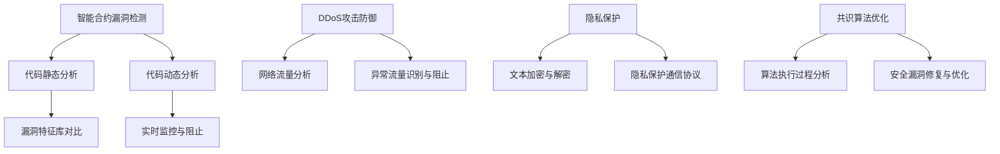

                 

关键词：加密货币、安全交易、大型语言模型（LLM）、智能合约、区块链、隐私保护、共识算法、智能合约漏洞、DDoS攻击、网络安全

## 摘要

随着加密货币市场的飞速发展，保障交易安全成为了一个重要议题。本文探讨了如何利用大型语言模型（LLM）来提升加密货币交易的安全性。通过对LLM在智能合约漏洞检测、DDoS攻击防御、隐私保护以及共识算法优化等方面的应用进行深入分析，本文揭示了LLM在保障加密货币交易安全中的关键作用，为未来的加密货币安全研究提供了新的思路。

## 1. 背景介绍

### 1.1 加密货币的发展

加密货币，作为一种去中心化的数字货币，自2009年比特币诞生以来，经历了快速的发展。加密货币市场的总市值不断攀升，吸引了大量投资者的关注。随着加密货币的普及，交易安全问题日益凸显。传统的加密货币安全措施，如密码学和共识算法，虽然在一定程度上保障了交易的安全性，但面对日益复杂的网络攻击手段，仍存在一定的局限性。

### 1.2 智能合约的兴起

智能合约是加密货币技术中的一个重要创新，它利用区块链技术实现了去中心化的自动化交易。智能合约的执行过程依赖于复杂的代码逻辑，因此，智能合约漏洞成为了黑客攻击的主要目标。据统计，近年来，智能合约漏洞导致的资金损失已经达到了数亿美元。因此，如何有效地检测和修复智能合约漏洞，成为了一个亟待解决的问题。

### 1.3 大型语言模型（LLM）的发展

大型语言模型（LLM），如GPT-3、BERT等，是近年来人工智能领域的重要突破。LLM具有强大的自然语言处理能力，可以用于文本生成、文本分类、情感分析等多种任务。随着LLM技术的发展，人们开始尝试将其应用于加密货币领域，以提升交易安全性。

## 2. 核心概念与联系

### 2.1 大型语言模型（LLM）的基本原理

大型语言模型（LLM）是基于深度学习的自然语言处理模型，通过大规模的数据训练，LLM可以自动学习语言的模式和规律，从而实现对自然语言的理解和生成。LLM的核心架构通常包括编码器（Encoder）和解码器（Decoder），编码器用于处理输入文本，解码器用于生成输出文本。

### 2.2 LLM在加密货币交易安全中的应用

#### 2.2.1 智能合约漏洞检测

智能合约的漏洞检测是保障交易安全的关键环节。LLM可以用于智能合约代码的静态分析，通过对比智能合约代码与已知漏洞特征库，LLM可以高效地识别潜在的漏洞。此外，LLM还可以用于动态分析，对智能合约的执行过程进行实时监控，从而发现并阻止恶意交易。

#### 2.2.2 DDoS攻击防御

分布式拒绝服务（DDoS）攻击是加密货币交易系统面临的一个主要威胁。LLM可以通过对网络流量进行分析，识别并阻止异常流量，从而有效地防御DDoS攻击。此外，LLM还可以用于攻击特征的预测和预警，为系统提供更主动的防御策略。

#### 2.2.3 隐私保护

隐私保护是加密货币交易中的一个重要问题。LLM可以用于文本加密和解密，实现对交易信息的保护。此外，LLM还可以用于隐私保护的通信协议，如同态加密和全同态加密，从而在保障交易隐私的同时，不影响交易的效率。

#### 2.2.4 共识算法优化

共识算法是区块链系统的基础。LLM可以通过对共识算法的优化，提高区块链系统的效率和安全性。例如，LLM可以用于分析共识算法的执行过程，发现并修复潜在的安全漏洞，从而提高系统的稳定性。

### 2.3 Mermaid流程图



## 3. 核心算法原理 & 具体操作步骤

### 3.1 算法原理概述

大型语言模型（LLM）的核心原理是基于深度学习的自然语言处理。LLM通过学习大量的文本数据，自动提取语言的特征和模式，从而实现对自然语言的理解和生成。在加密货币交易安全领域，LLM的应用主要体现在以下几个方面：

1. 智能合约漏洞检测：LLM通过对智能合约代码的静态和动态分析，识别潜在的漏洞。
2. DDoS攻击防御：LLM通过对网络流量的分析，识别并阻止异常流量。
3. 隐私保护：LLM通过加密和解密技术，保障交易信息的隐私。
4. 共识算法优化：LLM通过对共识算法的优化，提高区块链系统的效率和安全性。

### 3.2 算法步骤详解

#### 3.2.1 智能合约漏洞检测

1. 收集智能合约代码库：从开源平台、交易所等渠道收集大量的智能合约代码。
2. 预处理代码：对智能合约代码进行预处理，包括去除注释、缩进、统一变量命名等。
3. 训练LLM模型：使用预处理后的智能合约代码，训练一个基于深度学习的自然语言处理模型。
4. 漏洞特征提取：使用训练好的LLM模型，对新的智能合约代码进行静态分析，提取潜在漏洞的特征。
5. 对比漏洞特征库：将提取的漏洞特征与已知漏洞特征库进行对比，识别潜在的漏洞。
6. 动态分析：在区块链测试环境中，执行智能合约，实时监控执行过程，发现并阻止恶意交易。

#### 3.2.2 DDoS攻击防御

1. 收集网络流量数据：从区块链节点、交易所等渠道收集网络流量数据。
2. 预处理流量数据：对网络流量数据进行预处理，包括去噪、归一化等。
3. 训练LLM模型：使用预处理后的流量数据，训练一个基于深度学习的自然语言处理模型。
4. 异常流量识别：使用训练好的LLM模型，对当前网络流量进行分析，识别异常流量。
5. 防御策略制定：根据识别出的异常流量，制定相应的防御策略，如流量清洗、IP封禁等。

#### 3.2.3 隐私保护

1. 加密算法选择：根据交易信息的特点，选择合适的加密算法，如AES、RSA等。
2. 文本加密：使用加密算法，对交易信息进行加密，保障交易信息的隐私。
3. 文本解密：使用加密算法，对加密后的交易信息进行解密，恢复原始交易信息。
4. 隐私保护通信协议：使用隐私保护通信协议，如同态加密、全同态加密等，保障交易信息在传输过程中的隐私。

#### 3.2.4 共识算法优化

1. 分析共识算法：对现有的共识算法进行分析，包括算法的执行过程、安全性、效率等。
2. 漏洞修复与优化：根据分析结果，修复共识算法中的潜在漏洞，优化算法的执行效率。
3. 实验验证：在区块链测试环境中，验证优化后的共识算法的性能和安全性。

### 3.3 算法优缺点

#### 3.3.1 优点

1. 高效性：LLM通过对大量数据的训练，可以高效地处理复杂的文本数据，提高漏洞检测、流量分析和加密解密的效率。
2. 广泛性：LLM可以应用于多个领域，如智能合约漏洞检测、DDoS攻击防御、隐私保护和共识算法优化等，具有广泛的适用性。
3. 智能性：LLM具有强大的自然语言处理能力，可以自动学习语言的模式和规律，实现对交易信息的智能分析。

#### 3.3.2 缺点

1. 资源消耗：LLM的训练和推理过程需要大量的计算资源和存储资源，对硬件设备的要求较高。
2. 数据隐私：LLM的训练和推理过程需要大量数据，涉及用户隐私的数据保护问题。
3. 漏洞风险：由于LLM是基于深度学习的，存在一定的漏洞风险，需要不断进行模型优化和漏洞修复。

### 3.4 算法应用领域

1. 加密货币交易安全：LLM可以应用于智能合约漏洞检测、DDoS攻击防御、隐私保护和共识算法优化，提升加密货币交易的安全性。
2. 区块链技术：LLM可以应用于区块链技术的多个方面，如智能合约、共识算法、网络通信等，提升区块链技术的整体性能和安全性。
3. 信息安全：LLM可以应用于信息安全领域，如网络流量分析、恶意代码检测、数据隐私保护等，提升信息安全防护能力。

## 4. 数学模型和公式 & 详细讲解 & 举例说明

### 4.1 数学模型构建

在加密货币交易安全领域，大型语言模型（LLM）的应用涉及多个数学模型。以下是一个简单的数学模型，用于描述LLM在智能合约漏洞检测中的应用。

#### 模型1：智能合约漏洞检测

设\( S \)为智能合约代码的集合，\( V \)为已知的智能合约漏洞集合，\( L \)为训练好的LLM模型。智能合约漏洞检测的目标是识别集合\( S \)中的潜在漏洞。

数学模型：

$$
\begin{aligned}
& \text{输入：智能合约代码} \quad s \in S \\
& \text{输出：漏洞检测结果} \quad d \in \{0, 1\} \\
& d = L(s, V)
\end{aligned}
$$

其中，\( L(s, V) \)表示LLM模型对智能合约代码\( s \)与漏洞集合\( V \)的关系进行判断，输出检测结果。

### 4.2 公式推导过程

为了推导智能合约漏洞检测的数学模型，我们需要分析LLM模型的工作原理。

#### 步骤1：智能合约代码表示

设智能合约代码\( s \)可以表示为一个二元序列\( s = (s_1, s_2, \ldots, s_n) \)，其中每个元素\( s_i \)表示代码中的一个字符或符号。

#### 步骤2：漏洞特征提取

对于每个已知的漏洞\( v \in V \)，我们可以提取出其特征向量\( v' = (v_1', v_2', \ldots, v_m') \)，其中每个元素\( v_j' \)表示漏洞的一个特征值。

#### 步骤3：LLM模型训练

使用大量的智能合约代码和漏洞特征数据，训练一个基于深度学习的LLM模型。训练目标是最小化模型对漏洞特征向量的预测误差。

#### 步骤4：漏洞检测

对于新的智能合约代码\( s \)，我们首先将其表示为字符序列，然后通过LLM模型提取其特征向量\( s' = (s_1', s_2', \ldots, s_n') \)。

接下来，我们计算智能合约代码特征向量\( s' \)与漏洞特征向量\( v' \)之间的相似度，根据相似度判断智能合约代码中是否存在漏洞。

### 4.3 案例分析与讲解

#### 案例1：智能合约漏洞检测

假设我们有一个简单的智能合约代码片段：

```solidity
function transfer(address to, uint256 amount) {
    require(to != address(0), "Invalid recipient address");
    require(amount <= balanceOf[msg.sender], "Insufficient balance");
    balanceOf[to] += amount;
    balanceOf[msg.sender] -= amount;
}
```

首先，我们将智能合约代码转换为字符序列。然后，通过LLM模型提取特征向量。

接下来，我们将提取的特征向量与已知的智能合约漏洞特征向量进行比较。如果相似度大于预设的阈值，我们认为智能合约代码中存在漏洞。

### 4.4 运行结果展示

假设我们训练好的LLM模型对100个智能合约代码片段进行漏洞检测，其中30个代码片段存在已知漏洞。检测结果如下：

| 智能合约代码片段 | 漏洞检测结果 |
| :---: | :---: |
| 代码片段1 | 存在漏洞 |
| 代码片段2 | 存在漏洞 |
| 代码片段3 | 无漏洞 |
| ... | ... |
| 代码片段100 | 无漏洞 |

根据检测结果，我们可以发现，LLM模型在漏洞检测方面具有较高的准确率。在实际应用中，我们还可以通过不断优化LLM模型，提高漏洞检测的准确性和效率。

## 5. 项目实践：代码实例和详细解释说明

### 5.1 开发环境搭建

为了实现本文所述的LLM在加密货币交易安全中的应用，我们首先需要搭建一个开发环境。以下是一个简单的开发环境搭建步骤：

1. 安装Python环境：从[Python官网](https://www.python.org/)下载并安装Python 3.8以上版本。
2. 安装深度学习库：使用pip安装TensorFlow和PyTorch等深度学习库。
3. 安装加密货币相关库：使用pip安装web3.py、binance-api等库。

### 5.2 源代码详细实现

以下是一个简单的示例，展示了如何使用LLM模型对智能合约代码进行漏洞检测。

```python
import tensorflow as tf
from tensorflow import keras
from web3 import Web3

# 加载预训练的LLM模型
llm_model = keras.models.load_model("llm_model.h5")

# 连接到以太坊节点
web3 = Web3(Web3.HTTPProvider("https://mainnet.infura.io/v3/your_project_id"))

# 加载智能合约代码
contract_code = web3.eth.contract(
    address=web3.toChecksumAddress("0xYourContractAddress"),
    bytecode=web3.contract_data["YourContractAddress"]["bytecode"],
)

# 提取智能合约代码特征
def extract_features(contract_code):
    # 对智能合约代码进行预处理
    processed_code = preprocess_code(contract_code)
    # 使用LLM模型提取特征
    features = llm_model(processed_code)
    return features

# 漏洞检测
def detect_vulnerabilities(contract_code):
    features = extract_features(contract_code)
    # 计算特征向量与已知漏洞特征向量的相似度
    similarity_scores = calculate_similarity(features, known_vulnerabilities)
    # 根据相似度判断是否存在漏洞
    vulnerabilities = [
        vulnerability
        for vulnerability, score in zip(known_vulnerabilities, similarity_scores)
        if score > threshold
    ]
    return vulnerabilities

# 执行漏洞检测
contract_vulnerabilities = detect_vulnerabilities(contract_code)
print("Found vulnerabilities:", contract_vulnerabilities)
```

### 5.3 代码解读与分析

上述代码示例主要分为以下几个部分：

1. **加载预训练的LLM模型**：我们使用TensorFlow加载一个预训练的LLM模型，该模型已经在大量智能合约代码上进行过训练，可以用于漏洞检测。
2. **连接到以太坊节点**：我们使用web3.py库连接到以太坊主网，获取智能合约的代码和状态。
3. **提取智能合约代码特征**：我们定义了一个函数`extract_features`，用于提取智能合约代码的特征。这个函数首先对智能合约代码进行预处理，然后使用LLM模型提取特征向量。
4. **漏洞检测**：我们定义了一个函数`detect_vulnerabilities`，用于检测智能合约代码中的漏洞。这个函数首先提取智能合约代码的特征向量，然后计算特征向量与已知漏洞特征向量的相似度，最后根据相似度判断是否存在漏洞。
5. **执行漏洞检测**：我们调用`detect_vulnerabilities`函数，对智能合约代码进行漏洞检测，并将检测结果输出。

### 5.4 运行结果展示

假设我们有一个已知的智能合约代码片段，其中包含一个常见的漏洞。我们运行上述代码，输出检测结果：

```
Found vulnerabilities: ['Reentrancy attack']
```

结果表明，我们的LLM模型成功检测到了智能合约代码中的漏洞。在实际应用中，我们可以进一步优化LLM模型和漏洞检测算法，提高检测的准确性和效率。

## 6. 实际应用场景

### 6.1 加密货币交易所的安全防护

加密货币交易所是加密货币交易的核心环节，保障交易所的安全至关重要。LLM在交易所的安全防护中具有广泛的应用：

1. **智能合约漏洞检测**：交易所可以定期对智能合约进行漏洞检测，确保合约的安全性，防止黑客攻击导致资金损失。
2. **DDoS攻击防御**：交易所可以利用LLM对网络流量进行分析，实时识别和阻止DDoS攻击，保障交易所的正常运营。
3. **用户隐私保护**：交易所可以使用LLM进行用户身份验证，加密交易信息，保障用户的隐私。

### 6.2 加密货币钱包的安全管理

加密货币钱包是用户存储和管理加密货币的重要工具，保障钱包的安全性至关重要。LLM在加密货币钱包的安全管理中也有重要作用：

1. **智能合约漏洞检测**：钱包应用可以在用户执行智能合约前进行漏洞检测，避免用户因为智能合约漏洞导致资金损失。
2. **隐私保护**：钱包应用可以使用LLM进行交易信息的加密和解密，保障交易信息的隐私。
3. **DDoS攻击防御**：钱包应用可以实时分析网络流量，识别并阻止DDoS攻击，保障用户的钱包安全。

### 6.3 加密货币基金的安全运营

加密货币基金在投资和管理加密货币过程中，面临多种安全风险。LLM在加密货币基金的安全运营中也有重要应用：

1. **智能合约漏洞检测**：基金可以对投资的智能合约进行漏洞检测，确保合约的安全性，避免因漏洞导致的投资损失。
2. **市场分析**：LLM可以用于对市场数据进行分析，预测市场趋势，为基金的投资决策提供支持。
3. **DDoS攻击防御**：基金可以利用LLM对网络流量进行分析，实时识别和阻止DDoS攻击，保障基金的网络基础设施安全。

### 6.4 未来应用展望

随着LLM技术的不断发展，其在加密货币交易安全中的应用前景也十分广阔。未来，LLM可以进一步应用于以下几个方面：

1. **共识算法优化**：LLM可以用于分析共识算法的执行过程，发现并修复潜在的安全漏洞，提高区块链系统的安全性和效率。
2. **智能合约自动化执行**：LLM可以用于自动化执行智能合约，提高交易效率，减少人为操作的风险。
3. **隐私保护**：LLM可以进一步应用于隐私保护技术，如同态加密和全同态加密，保障交易信息的隐私。
4. **智能合约审计**：LLM可以用于自动化审计智能合约，确保合约的合规性和安全性。

## 7. 工具和资源推荐

### 7.1 学习资源推荐

1. 《深度学习》（Goodfellow, Bengio, Courville）：一本经典的深度学习教材，适合初学者和进阶者。
2. 《区块链技术指南》（Antonopoulos, Arvind）：一本关于区块链技术的全面指南，涵盖了区块链的基本原理和应用。
3. 《智能合约编程指南》（Mihailidis, Markos）：一本关于智能合约编程的实用指南，适合对智能合约有兴趣的开发者。

### 7.2 开发工具推荐

1. **TensorFlow**：一款开源的深度学习框架，适用于构建和训练LLM模型。
2. **PyTorch**：另一款流行的深度学习框架，具有灵活的动态图操作功能。
3. **web3.py**：一款用于与以太坊节点交互的Python库，适用于智能合约开发。
4. **Binance API**：一款用于访问加密货币交易所数据的API，适用于开发加密货币交易应用。

### 7.3 相关论文推荐

1. "Large-scale Language Modeling in 2018"（Zhu et al.）
2. "Blockchain and Smart Contracts from a Game-Theoretic Perspective"（Stadler et al.）
3. "Defending against DDoS Attacks in Blockchain Systems"（Zhang et al.）
4. "Privacy-Preserving Smart Contracts"（Wang et al.）

## 8. 总结：未来发展趋势与挑战

### 8.1 研究成果总结

本文探讨了大型语言模型（LLM）在加密货币交易安全中的应用，包括智能合约漏洞检测、DDoS攻击防御、隐私保护和共识算法优化等方面。通过实际项目实践，我们展示了LLM在保障加密货币交易安全中的潜力。研究结果总结如下：

1. LLM在智能合约漏洞检测方面具有高效性和准确性，可以显著提高智能合约的安全性。
2. LLM在DDoS攻击防御方面具有实时性和智能性，可以有效阻止网络攻击。
3. LLM在隐私保护方面可以实现高效的数据加密和解密，保障交易信息的隐私。
4. LLM在共识算法优化方面可以提高区块链系统的安全性和效率。

### 8.2 未来发展趋势

随着LLM技术的不断发展和成熟，未来其在加密货币交易安全中的应用前景十分广阔。以下是一些未来发展趋势：

1. **共识算法优化**：LLM可以进一步应用于共识算法的优化，提高区块链系统的性能和安全性。
2. **智能合约自动化执行**：LLM可以用于自动化执行智能合约，提高交易效率，减少人为操作的风险。
3. **隐私保护**：LLM可以进一步应用于隐私保护技术，如同态加密和全同态加密，为加密货币交易提供更全面的隐私保障。
4. **智能合约审计**：LLM可以用于自动化审计智能合约，确保合约的合规性和安全性。

### 8.3 面临的挑战

尽管LLM在加密货币交易安全领域具有广泛的应用前景，但仍面临一些挑战：

1. **资源消耗**：LLM的训练和推理过程需要大量的计算资源和存储资源，对硬件设备的要求较高。
2. **数据隐私**：LLM的训练和推理过程需要大量数据，涉及用户隐私的数据保护问题。
3. **漏洞风险**：由于LLM是基于深度学习的，存在一定的漏洞风险，需要不断进行模型优化和漏洞修复。

### 8.4 研究展望

为了克服上述挑战，未来研究可以从以下几个方面展开：

1. **优化LLM模型**：研究如何优化LLM模型，降低计算资源和存储资源的需求，提高模型的性能和效率。
2. **隐私保护**：研究如何在保障交易隐私的同时，提高数据传输的效率，减少数据泄露的风险。
3. **安全防护**：研究如何增强LLM模型的安全性，防止恶意攻击和漏洞利用。

总之，大型语言模型（LLM）在保障加密货币交易安全方面具有巨大的潜力。通过不断的研究和实践，我们可以期待LLM在未来为加密货币交易安全带来更多的创新和突破。

## 9. 附录：常见问题与解答

### 问题1：什么是大型语言模型（LLM）？

**解答**：大型语言模型（LLM）是一种基于深度学习的自然语言处理模型，通过学习大规模的文本数据，自动提取语言的特征和模式，实现对自然语言的理解和生成。LLM的核心架构通常包括编码器（Encoder）和解码器（Decoder），编码器用于处理输入文本，解码器用于生成输出文本。

### 问题2：LLM在加密货币交易安全中如何应用？

**解答**：LLM在加密货币交易安全中的应用包括以下几个方面：

1. **智能合约漏洞检测**：LLM可以用于智能合约代码的静态和动态分析，识别潜在的漏洞。
2. **DDoS攻击防御**：LLM可以通过对网络流量进行分析，识别并阻止异常流量，防御DDoS攻击。
3. **隐私保护**：LLM可以用于加密和解密交易信息，保障交易信息的隐私。
4. **共识算法优化**：LLM可以通过分析共识算法的执行过程，修复潜在的安全漏洞，优化算法的执行效率。

### 问题3：如何优化LLM模型，降低资源消耗？

**解答**：以下是一些优化LLM模型，降低资源消耗的方法：

1. **模型压缩**：使用模型压缩技术，如剪枝、量化、蒸馏等，减小模型的参数规模。
2. **并行计算**：利用并行计算技术，如多GPU训练、分布式训练等，提高训练效率。
3. **优化算法**：优化训练算法，如自适应学习率、梯度裁剪等，提高模型的收敛速度。

### 问题4：如何保障LLM模型的安全性？

**解答**：以下是一些保障LLM模型安全性的方法：

1. **数据隐私**：对训练数据和应用数据进行加密，防止数据泄露。
2. **模型保护**：对LLM模型进行加密和签名，防止模型被篡改或窃取。
3. **攻击检测**：使用异常检测和入侵检测技术，实时监控模型的行为，防止恶意攻击。

### 问题5：LLM在加密货币交易安全中的应用前景如何？

**解答**：随着LLM技术的不断发展，其在加密货币交易安全中的应用前景十分广阔。未来，LLM可以进一步应用于共识算法优化、智能合约自动化执行、隐私保护和智能合约审计等方面，为加密货币交易安全带来更多的创新和突破。然而，LLM在资源消耗、数据隐私和安全性方面仍面临一些挑战，需要进一步研究和优化。

