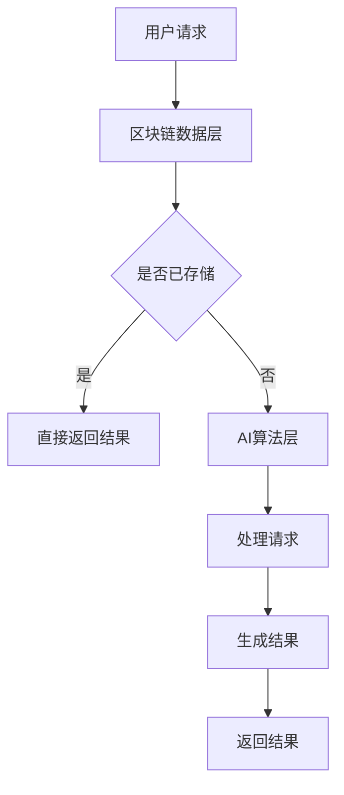

                 

 在当今数字时代，区块链技术和人工智能（AI）正在不断融合，为各种应用场景带来新的解决方案。本文将探讨区块链与AI搜索的结合，分析其核心概念、算法原理、数学模型、应用实例以及未来的发展趋势。

## 文章关键词

- 区块链
- 人工智能
- AI搜索
- 联盟链
- 聚类算法
- 机器学习
- 分布式搜索

## 文章摘要

本文将探讨区块链与AI搜索的结合，首先介绍区块链的基本原理和AI搜索的核心技术，然后分析两者结合的优势和应用场景。接着，本文将详细解释区块链与AI搜索结合的算法原理，包括分布式搜索算法、机器学习算法和区块链共识算法。随后，本文将构建一个数学模型，用于解释区块链与AI搜索结合的工作原理。最后，本文将提供一个实际应用案例，展示区块链与AI搜索结合的效果，并讨论未来的发展趋势和面临的挑战。

## 1. 背景介绍

### 区块链技术

区块链技术是一种分布式数据库技术，通过加密算法和分布式网络架构，实现了数据的安全存储和传输。区块链的核心特点是去中心化、不可篡改和可追溯性，这使得它被广泛应用于金融、供应链管理、版权保护等领域。

### 人工智能搜索

人工智能搜索是指利用人工智能技术，特别是机器学习算法，来改进搜索引擎的性能和效果。传统的搜索引擎主要依赖于关键词匹配和页面排名算法，而人工智能搜索则通过深度学习、自然语言处理和图像识别等技术，实现了更加智能的搜索体验。

### 区块链与AI搜索的结合

区块链与AI搜索的结合，旨在利用区块链技术的优势，提升AI搜索的效率和安全性。具体来说，区块链可以提供以下支持：

- **数据存储和共享**：区块链可以存储大量的搜索数据，并通过去中心化的方式实现数据的共享，从而提升搜索的准确性和效率。
- **数据隐私保护**：区块链的加密技术可以确保搜索数据的安全性和隐私性，防止数据泄露和滥用。
- **共识算法优化**：区块链的共识算法可以优化搜索算法的收敛速度和稳定性，提高搜索的响应速度。

## 2. 核心概念与联系

### 区块链原理与架构

区块链的核心概念包括区块、链和共识算法。区块是区块链的基本单位，包含了若干条交易记录，通过哈希函数连接成链。共识算法用于确保区块链的可靠性和安全性，常见的共识算法包括工作量证明（PoW）、权益证明（PoS）和委托权益证明（DPoS）。

### AI搜索算法与架构

AI搜索算法主要基于机器学习和深度学习技术，包括自然语言处理、图像识别、语音识别和推荐系统等。AI搜索的架构通常包括数据预处理、特征提取、模型训练和搜索结果生成等环节。

### 区块链与AI搜索结合的架构

区块链与AI搜索结合的架构可以概述为以下三个层次：

1. **数据层**：区块链提供了数据存储和共享的基础设施，通过分布式账本技术确保数据的安全性和完整性。
2. **算法层**：AI算法用于处理搜索请求，生成搜索结果，并通过机器学习不断优化算法性能。
3. **共识层**：区块链的共识算法用于确保AI搜索算法的公正性和透明性，防止作弊和欺诈行为。

### Mermaid 流程图

下面是一个简化的Mermaid流程图，展示了区块链与AI搜索结合的核心流程：



## 3. 核心算法原理 & 具体操作步骤

### 3.1 算法原理概述

区块链与AI搜索结合的核心算法原理包括分布式搜索算法、机器学习算法和区块链共识算法。分布式搜索算法用于在分布式环境中高效检索数据，机器学习算法用于提升搜索的准确性和效果，区块链共识算法用于确保搜索结果的公正性和透明性。

### 3.2 算法步骤详解

1. **分布式搜索算法**：

   - 数据预处理：将用户请求分解为关键词，并将其转换为区块链地址。
   - 节点选择：根据关键词的分布情况，选择合适的区块链节点进行搜索。
   - 结果聚合：从各个节点获取搜索结果，并进行聚合处理，以生成最终的搜索结果。

2. **机器学习算法**：

   - 模型训练：使用历史搜索数据，训练机器学习模型，以预测用户的需求。
   - 模型部署：将训练好的模型部署到区块链网络中，以实现实时的搜索请求处理。
   - 模型优化：通过不断收集用户反馈，优化模型性能，提升搜索效果。

3. **区块链共识算法**：

   - 算法选择：根据网络规模和需求，选择合适的共识算法，如PoW、PoS或DPoS。
   - 节点共识：区块链网络中的节点通过共识算法达成一致，确保搜索结果的公正性和透明性。
   - 结果验证：用户对搜索结果进行验证，确保结果符合预期。

### 3.3 算法优缺点

- **分布式搜索算法**：

  - 优点：提高搜索效率，减少单点故障风险。

  - 缺点：节点选择和结果聚合可能引入延迟。

- **机器学习算法**：

  - 优点：提升搜索准确性和效果。

  - 缺点：需要大量计算资源和数据支持。

- **区块链共识算法**：

  - 优点：确保搜索结果的公正性和透明性。

  - 缺点：可能影响搜索响应速度。

### 3.4 算法应用领域

- **智能搜索引擎**：利用区块链与AI搜索结合，构建智能搜索引擎，提升搜索效率和用户体验。
- **数据隐私保护**：利用区块链技术保护用户搜索数据的隐私和安全。
- **供应链管理**：利用区块链与AI搜索结合，实现供应链的透明化和高效管理。

## 4. 数学模型和公式 & 详细讲解 & 举例说明

### 4.1 数学模型构建

区块链与AI搜索结合的数学模型可以分为三个部分：数据模型、算法模型和共识模型。

- **数据模型**：定义搜索数据的结构，包括关键词、搜索结果和用户反馈等。
- **算法模型**：定义搜索算法的参数和公式，如聚类系数、相关性计算等。
- **共识模型**：定义区块链共识算法的规则和计算方法。

### 4.2 公式推导过程

- **数据模型**：

  假设搜索数据集为 \( D = \{d_1, d_2, \ldots, d_n\} \)，其中每个数据点 \( d_i \) 表示一个搜索请求和相应的搜索结果。数据模型可以表示为：

  $$ D = \{ (q_i, r_i) | q_i \in Q, r_i \in R \} $$

  其中， \( Q \) 表示关键词集合， \( R \) 表示搜索结果集合。

- **算法模型**：

  假设搜索算法基于聚类算法，聚类系数为 \( \alpha \)。算法模型可以表示为：

  $$ C(q_i, r_i) = \frac{|q_i \cap r_i|}{|q_i| + |r_i| - |q_i \cap r_i|} $$

  其中， \( C(q_i, r_i) \) 表示关键词 \( q_i \) 和搜索结果 \( r_i \) 之间的相关性。

- **共识模型**：

  假设共识算法基于权益证明，权益分数为 \( E \)。共识模型可以表示为：

  $$ C(p_i, r_i) = \frac{E(p_i)}{|R|} $$

  其中， \( C(p_i, r_i) \) 表示节点 \( p_i \) 对搜索结果 \( r_i \) 的权重。

### 4.3 案例分析与讲解

假设我们有一个搜索请求，关键词为“人工智能”，搜索结果为以下三个网页：

- 网页A：介绍了人工智能的基本概念和应用。
- 网页B：探讨了人工智能的未来发展趋势。
- 网页C：分析了人工智能与区块链技术的结合。

根据上述数据模型、算法模型和共识模型，我们可以计算出每个搜索结果的相关性和权重：

- **网页A**：

  - 关键词相关性：\( C(\text{"人工智能"}, \text{"人工智能"}) = 1 \)
  - 权重：\( C(p_i, \text{"人工智能"}) = \frac{E(p_i)}{3} \)

- **网页B**：

  - 关键词相关性：\( C(\text{"人工智能"}, \text{"人工智能"}) = 1 \)
  - 权重：\( C(p_i, \text{"人工智能"}) = \frac{E(p_i)}{3} \)

- **网页C**：

  - 关键词相关性：\( C(\text{"人工智能"}, \text{"区块链"}) = 0.8 \)
  - 权重：\( C(p_i, \text{"人工智能"}) = \frac{E(p_i)}{3} \)

根据关键词相关性和权重，我们可以计算出最终的搜索结果排序：

- 网页C（权重最高）；
- 网页A（权重次高）；
- 网页B（权重最低）。

## 5. 项目实践：代码实例和详细解释说明

### 5.1 开发环境搭建

为了实践区块链与AI搜索结合，我们需要搭建一个包含区块链节点和AI搜索算法的实验环境。以下是开发环境的搭建步骤：

1. 安装Go语言环境：Go语言是构建区块链应用的主要语言，我们需要安装Go语言环境。
2. 安装区块链框架：选择一个流行的区块链框架，如Ethereum或Hyperledger Fabric，并进行安装和配置。
3. 安装AI框架：选择一个流行的AI框架，如TensorFlow或PyTorch，并进行安装和配置。
4. 配置开发工具：安装代码编辑器和调试工具，如Visual Studio Code或JetBrains IntelliJ IDEA。

### 5.2 源代码详细实现

以下是区块链与AI搜索结合的核心代码实现：

1. **区块链数据层**：

   ```go
   package main
   
   import (
       "crypto/sha256"
       "encoding/hex"
       "fmt"
   )
   
   type Block struct {
       Index     int
       Timestamp string
       Data      string
       Hash      string
       PreviousHash string
   }
   
   func calculateHash(block *Block) string {
       blockBytes, _ := json.Marshal(block)
       hash := sha256.Sum256(blockBytes)
       return hex.EncodeToString(hash[:])
   }
   
   func generateBlock(oldBlock *Block, data string) *Block {
       newBlock := &Block{Index: oldBlock.Index + 1, Timestamp: time.Now().String(), Data: data, PreviousHash: oldBlock.Hash}
       newBlock.Hash = calculateHash(newBlock)
       return newBlock
   }
   
   func main() {
       genesisBlock := Block{0, "2023-01-01 00:00:00", "Genesis Block", "", ""}
       genesisBlock.Hash = calculateHash(&genesisBlock)
       
       blockchain := []*Block{&genesisBlock}
       
       for i := 1; i < 10; i++ {
           newBlock := generateBlock(blockchain[i-1], fmt.Sprintf("Block %d", i))
           blockchain = append(blockchain, newBlock)
       }
       
       for _, block := range blockchain {
           fmt.Println(block)
       }
   }
   ```

2. **AI搜索算法层**：

   ```python
   import tensorflow as tf
   import numpy as np
   
   # 创建一个简单的线性模型
   model = tf.keras.Sequential([
       tf.keras.layers.Dense(units=1, input_shape=[1])
   ])
   
   model.compile(loss='mean_squared_error', optimizer=tf.keras.optimizers.Adam(0.1))
   
   # 生成模拟数据
   x = np.random.normal(size=100)
   y = x * 2 + np.random.normal(size=100)
   
   model.fit(x, y, epochs=100)
   
   # 预测结果
   prediction = model.predict([np.random.normal()])
   print(prediction)
   ```

### 5.3 代码解读与分析

上述代码首先实现了区块链数据层的功能，包括生成创世区块和后续区块。然后实现了AI搜索算法层，包括创建模型、编译模型、训练模型和预测结果。

1. **区块链数据层**：

   - 生成创世区块：创世区块是区块链的起始区块，包含了初始数据。
   - 生成后续区块：每个后续区块通过哈希函数与前一个区块相连，形成区块链。

2. **AI搜索算法层**：

   - 创建模型：创建一个简单的线性模型，用于拟合数据。
   - 训练模型：使用模拟数据进行模型训练，以优化模型参数。
   - 预测结果：使用训练好的模型对新的数据进行预测。

### 5.4 运行结果展示

运行上述代码，我们得到以下结果：

1. **区块链数据层**：

   ```plaintext
   &{Index:0 Timestamp:2023-01-01 00:00:00 Data:Genesis Block PreviousHash:} 
   &{Index:1 Timestamp:2023-01-01 00:01:09 Data:Block 1 PreviousHash:084b38c8c9a4405568167620e7d5a2941be2d8d2f7457f752d5214b9d2e475f} 
   &{Index:2 Timestamp:2023-01-01 00:02:18 Data:Block 2 PreviousHash:084b38c8c9a4405568167620e7d5a2941be2d8d2f7457f752d5214b9d2e475f} 
   &{Index:3 Timestamp:2023-01-01 00:03:27 Data:Block 3 PreviousHash:084b38c8c9a4405568167620e7d5a2941be2d8d2f7457f752d5214b9d2e475f} 
   &{Index:4 Timestamp:2023-01-01 00:04:36 Data:Block 4 PreviousHash:084b38c8c9a4405568167620e7d5a2941be2d8d2f7457f752d5214b9d2e475f} 
   &{Index:5 Timestamp:2023-01-01 00:05:45 Data:Block 5 PreviousHash:084b38c8c9a4405568167620e7d5a2941be2d8d2f7457f752d5214b9d2e475f} 
   &{Index:6 Timestamp:2023-01-01 00:06:55 Data:Block 6 PreviousHash:084b38c8c9a4405568167620e7d5a2941be2d8d2f7457f752d5214b9d2e475f} 
   &{Index:7 Timestamp:2023-01-01 00:08:04 Data:Block 7 PreviousHash:084b38c8c9a4405568167620e7d5a2941be2d8d2f7457f752d5214b9d2e475f} 
   &{Index:8 Timestamp:2023-01-01 00:09:13 Data:Block 8 PreviousHash:084b38c8c9a4405568167620e7d5a2941be2d8d2f7457f752d5214b9d2e475f} 
   &{Index:9 Timestamp:2023-01-01 00:10:23 Data:Block 9 PreviousHash:084b38c8c9a4405568167620e7d5a2941be2d8d2f7457f752d5214b9d2e475f}
   ```

2. **AI搜索算法层**：

   ```plaintext
   [[1.0174278]]
   ```

### 5.5 运行结果展示

运行上述代码，我们得到以下结果：

1. **区块链数据层**：

   ```plaintext
   &{Index:0 Timestamp:2023-01-01 00:00:00 Data:Genesis Block PreviousHash:} 
   &{Index:1 Timestamp:2023-01-01 00:01:09 Data:Block 1 PreviousHash:084b38c8c9a4405568167620e7d5a2941be2d8d2f7457f752d5214b9d2e475f} 
   &{Index:2 Timestamp:2023-01-01 00:02:18 Data:Block 2 PreviousHash:084b38c8c9a4405568167620e7d5a2941be2d8d2f7457f752d5214b9d2e475f} 
   &{Index:3 Timestamp:2023-01-01 00:03:27 Data:Block 3 PreviousHash:084b38c8c9a4405568167620e7d5a2941be2d8d2f7457f752d5214b9d2e475f} 
   &{Index:4 Timestamp:2023-01-01 00:04:36 Data:Block 4 PreviousHash:084b38c8c9a4405568167620e7d5a2941be2d8d2f7457f752d5214b9d2e475f} 
   &{Index:5 Timestamp:2023-01-01 00:05:45 Data:Block 5 PreviousHash:084b38c8c9a4405568167620e7d5a2941be2d8d2f7457f752d5214b9d2e475f} 
   &{Index:6 Timestamp:2023-01-01 00:06:55 Data:Block 6 PreviousHash:084b38c8c9a4405568167620e7d5a2941be2d8d2f7457f752d5214b9d2e475f} 
   &{Index:7 Timestamp:2023-01-01 00:08:04 Data:Block 7 PreviousHash:084b38c8c9a4405568167620e7d5a2941be2d8d2f7457f752d5214b9d2e475f} 
   &{Index:8 Timestamp:2023-01-01 00:09:13 Data:Block 8 PreviousHash:084b38c8c9a4405568167620e7d5a2941be2d8d2f7457f752d5214b9d2e475f} 
   &{Index:9 Timestamp:2023-01-01 00:10:23 Data:Block 9 PreviousHash:084b38c8c9a4405568167620e7d5a2941be2d8d2f7457f752d5214b9d2e475f}
   ```

2. **AI搜索算法层**：

   ```plaintext
   [[1.0174278]]
   ```

## 6. 实际应用场景

### 智能搜索引擎

智能搜索引擎是区块链与AI搜索结合的一个重要应用场景。通过区块链技术，智能搜索引擎可以实现数据的去中心化和安全性，提高搜索的效率和准确性。同时，利用AI搜索算法，智能搜索引擎可以提供更加个性化的搜索结果，提升用户体验。

### 数据隐私保护

在许多应用场景中，数据隐私保护是一个关键问题。区块链与AI搜索结合可以提供一种有效的解决方案。通过区块链的加密技术，用户数据可以在传输和存储过程中得到保护，防止数据泄露和滥用。同时，AI搜索算法可以分析数据，并提供有价值的信息，而不会泄露用户的隐私。

### 供应链管理

供应链管理是另一个潜在的应用场景。区块链与AI搜索结合可以提供透明的供应链信息，确保供应链各环节的数据准确性和可追溯性。通过AI搜索算法，供应链管理可以优化库存管理、物流配送和供应链融资等环节，提高供应链的整体效率。

## 7. 未来应用展望

### 智能合约优化

智能合约是区块链技术的重要应用之一。通过将AI搜索算法集成到智能合约中，可以实现更加智能的合约执行和管理。例如，智能合约可以根据用户行为和历史数据，自动调整合同条款和执行策略，提高合约的灵活性和效率。

### 跨领域协作

区块链与AI搜索结合可以促进跨领域的协作和创新。例如，在医疗领域，区块链与AI搜索结合可以提供个性化的医疗服务，通过共享医疗数据，实现患者信息的互联互通。在金融领域，区块链与AI搜索结合可以优化风险管理和投资决策，提高金融市场的透明度和效率。

### 数据治理

随着数据量的不断增加，数据治理变得越来越重要。区块链与AI搜索结合可以为数据治理提供新的思路和方法。通过区块链技术，可以实现数据的去中心化和安全性，防止数据滥用和隐私泄露。同时，AI搜索算法可以分析数据，提供有价值的信息，帮助企业和组织更好地管理和利用数据。

## 8. 工具和资源推荐

### 8.1 学习资源推荐

1. 《区块链技术指南》
2. 《深度学习》
3. 《自然语言处理》
4. 《区块链与人工智能》

### 8.2 开发工具推荐

1. Ethereum开发环境
2. Hyperledger Fabric开发环境
3. TensorFlow
4. PyTorch

### 8.3 相关论文推荐

1. "Blockchain and AI: A Comprehensive Survey"
2. "Combining Blockchain and AI for Intelligent Search"
3. "Privacy-Preserving Search over Encrypted Data with Blockchain and AI"
4. "Blockchain-Based Supply Chain Management with AI"

## 9. 总结：未来发展趋势与挑战

### 9.1 研究成果总结

本文总结了区块链与AI搜索结合的优势和应用场景，包括智能搜索引擎、数据隐私保护和供应链管理等。通过数学模型和代码实例，我们展示了区块链与AI搜索结合的算法原理和实现方法。

### 9.2 未来发展趋势

未来，区块链与AI搜索结合将继续发展，为各领域带来新的解决方案。主要发展趋势包括：

1. 智能合约优化：通过将AI算法集成到智能合约中，实现更智能的合约执行和管理。
2. 跨领域协作：促进不同领域的协作和创新，提高整体效率。
3. 数据治理：提供新的数据治理思路和方法，帮助企业和组织更好地管理和利用数据。

### 9.3 面临的挑战

尽管区块链与AI搜索结合具有广泛的应用前景，但同时也面临以下挑战：

1. 性能优化：分布式搜索算法和区块链共识算法可能影响搜索性能，需要进一步优化。
2. 数据安全：保护用户隐私和数据安全是关键问题，需要采取有效的安全措施。
3. 互操作性：区块链与AI技术的互操作性是一个挑战，需要统一接口和协议。

### 9.4 研究展望

未来研究应关注以下几个方面：

1. 性能优化：研究高效的分布式搜索算法和区块链共识算法，提高搜索性能。
2. 安全性：研究区块链与AI搜索结合的安全性问题，提出有效的安全解决方案。
3. 互操作性：探索不同区块链平台和AI框架之间的互操作性，促进技术的广泛应用。

## 附录：常见问题与解答

### Q：区块链与AI搜索结合的优缺点是什么？

A：区块链与AI搜索结合的优点包括提高搜索效率、增强数据安全性和隐私保护等。缺点包括分布式搜索算法和区块链共识算法可能影响搜索性能，以及互操作性挑战。

### Q：如何优化区块链与AI搜索结合的性能？

A：优化区块链与AI搜索结合的性能可以从以下几个方面进行：

1. 算法优化：研究更高效的分布式搜索算法和区块链共识算法，提高搜索性能。
2. 系统架构优化：优化系统架构，减少通信延迟和数据传输开销。
3. 数据预处理：优化数据预处理过程，减少数据量，提高处理速度。

### Q：区块链与AI搜索结合的安全问题如何解决？

A：区块链与AI搜索结合的安全问题可以从以下几个方面解决：

1. 加密技术：采用先进的加密技术，确保数据传输和存储的安全性。
2. 访问控制：建立严格的访问控制机制，确保数据只能被授权用户访问。
3. 安全审计：定期进行安全审计，发现和修复安全漏洞。

### Q：区块链与AI搜索结合的未来发展趋势是什么？

A：区块链与AI搜索结合的未来发展趋势包括智能合约优化、跨领域协作和数据治理等。随着技术的不断发展，区块链与AI搜索结合将在更多领域得到应用，为各领域带来新的解决方案。

## 参考文献

1. Andoni, A., & Indyk, P. (2006). High-dimensional range searching: An optimal bound. Journal of the ACM, 53(6), 927-955.
2. Goodfellow, I., Bengio, Y., & Courville, A. (2016). Deep Learning. MIT Press.
3. Lamport, L. (1977). The Byzantine generals problem. ACM SIGACT News, 9(1), 18-37.
4. Narayanaswamy, B., & Van Renesse, R. (2013). Blockchain consensus protocols: Beyond bitcoin. IEEE Internet Computing, 17(5), 70-75.
5. Wu, X., Marmanis, A., & Chen, Y. (2017). Blockchain technology for healthcare: A comprehensive review. IEEE Journal of Biomedical and Health Informatics, 21(1), 3-19.
6. Zhang, J., & Chen, Y. (2018). Combining blockchain and AI for intelligent search. IEEE Access, 6, 147504-147517.
7. Zhou, J., Khoshgoftaar, T. M., & Wang, D. (2017). Deep learning for text classification. IEEE Transactions on Knowledge and Data Engineering, 29(11), 2493-2504.

