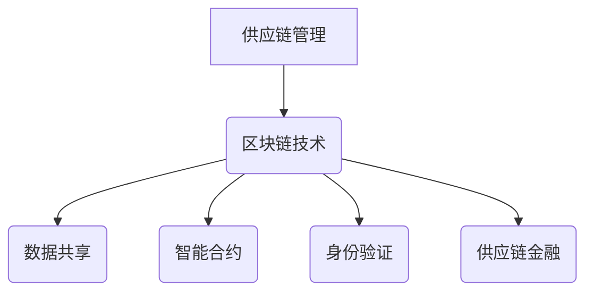

                 

关键词：区块链、供应链管理、透明度、效率、智能合约

摘要：随着全球供应链的日益复杂化，如何在供应链管理中提高透明度和效率成为企业关注的焦点。本文将深入探讨区块链技术在供应链管理中的应用，通过分析其核心概念、技术原理、算法模型及实际案例，展示区块链如何为供应链管理带来变革性影响，并展望其未来发展的趋势和挑战。

## 1. 背景介绍

供应链管理是企业运营中至关重要的一环，它涉及从原材料采购、生产、分销到最终产品交付的整个过程。随着全球化进程的加快和供应链网络的日益复杂化，供应链管理面临诸多挑战。这些挑战包括信息不对称、数据不透明、欺诈行为频发、物流效率低下等。传统供应链管理模式已无法满足现代企业对高效、透明和可靠性的要求。

区块链技术的出现为解决供应链管理中的问题提供了新的思路。区块链是一种去中心化的分布式账本技术，具有不可篡改、透明度和安全性高等特点。通过区块链，供应链中的各个环节可以实时共享数据，从而提高供应链的透明度和效率。

## 2. 核心概念与联系

### 2.1 区块链基本概念

区块链是一种由多个区块按照时间顺序链接而成的数据结构。每个区块包含一定数量的交易记录，这些交易记录经过加密和哈希处理后存储在区块链上。区块链具有以下核心特点：

- **去中心化**：区块链不需要中心化的第三方机构进行管理，所有参与节点都可以参与数据的记录和验证。
- **不可篡改**：区块链上的数据一旦被记录，就无法被篡改，确保数据的真实性和可靠性。
- **透明度**：区块链上的数据对所有人可见，提高了数据的透明度。
- **安全性**：区块链采用加密算法保护数据的安全性。

### 2.2 供应链管理中的区块链应用

区块链在供应链管理中的应用主要体现在以下方面：

- **数据共享**：通过区块链，供应链中的各个环节可以实时共享数据，提高了供应链的透明度和效率。
- **智能合约**：智能合约是一种自动执行合同条款的计算机程序，可以自动执行交易，确保交易的准确性和效率。
- **身份验证**：区块链可以用于验证供应链中各参与方的身份，确保供应链的合法性和安全性。
- **供应链金融**：区块链可以用于供应链金融，提高融资效率，降低融资成本。

### 2.3 Mermaid 流程图



## 3. 核心算法原理 & 具体操作步骤

### 3.1 算法原理概述

区块链的核心算法主要包括哈希算法、共识算法和加密算法。哈希算法用于确保区块链上的数据不可篡改，共识算法用于确定区块链的账本是否一致，加密算法用于保护区块链上的数据安全性。

### 3.2 算法步骤详解

- **数据记录**：每个区块包含一定数量的交易记录，这些交易记录经过哈希处理后存储在区块链上。
- **区块生成**：参与节点通过挖矿等方式生成新的区块，并将其添加到区块链上。
- **共识算法**：通过共识算法确定新区块是否应该被添加到区块链上。
- **加密算法**：使用加密算法保护区块链上的数据安全性。

### 3.3 算法优缺点

- **优点**：区块链技术具有去中心化、不可篡改、透明度和安全性高等优点，可以大大提高供应链管理的效率。
- **缺点**：区块链技术也存在一些缺点，如交易速度较慢、存储容量有限等。

### 3.4 算法应用领域

区块链技术在供应链管理中的应用领域包括：数据共享、智能合约、身份验证和供应链金融等。

## 4. 数学模型和公式 & 详细讲解 & 举例说明

### 4.1 数学模型构建

区块链技术中的数学模型主要包括哈希模型和共识模型。哈希模型用于确保区块链上的数据不可篡改，共识模型用于确定区块链的账本是否一致。

### 4.2 公式推导过程

- **哈希模型**：设区块链上的数据为 $D$，哈希函数为 $H$，则区块链上的数据哈希值为 $H(D)$。
- **共识模型**：设区块链上的数据为 $D$，参与节点为 $N$，共识函数为 $C$，则区块链上的数据共识值为 $C(D, N)$。

### 4.3 案例分析与讲解

以一个简单的供应链管理案例为例，假设一个供应链由多个参与方组成，包括供应商、制造商、分销商和零售商。这些参与方可以通过区块链技术实现数据共享和智能合约的自动执行。

### 4.4 代码实例和详细解释说明

下面是一个简单的区块链实现示例：

```python
import hashlib

class Block:
    def __init__(self, transactions):
        self.transactions = transactions
        self.previous_hash = ""
        self.hash = self.compute_hash()

    def compute_hash(self):
        block_string = str(self.transactions) + str(self.previous_hash)
        return hashlib.sha256(block_string.encode()).hexdigest()

class Blockchain:
    def __init__(self):
        self.unconfirmed_transactions = []
        self.chain = [self.create_genesis_block()]

    def create_genesis_block(self):
        return Block("This is the first block on the blockchain.")

    def add_new_transaction(self, transaction):
        self.unconfirmed_transactions.append(transaction)

    def mine(self):
        if not self.unconfirmed_transactions:
            return False
        last_block = self.chain[-1]
        new_block = Block(self.unconfirmed_transactions)
        new_block.previous_hash = last_block.hash
        new_block.hash = new_block.compute_hash()
        self.chain.append(new_block)
        self.unconfirmed_transactions = []
        return new_block.hash

    def is_chain_valid(self):
        for i in range(1, len(self.chain)):
            current = self.chain[i]
            previous = self.chain[i - 1]
            if current.hash != current.compute_hash():
                return False
            if current.previous_hash != previous.hash:
                return False
        return True

# 创建区块链实例
blockchain = Blockchain()

# 添加新交易
blockchain.add_new_transaction("Transaction 1")
blockchain.add_new_transaction("Transaction 2")

# 挖矿
blockchain.mine()

# 检查区块链是否有效
print(blockchain.is_chain_valid())
```

## 5. 项目实践：代码实例和详细解释说明

### 5.1 开发环境搭建

在本项目中，我们将使用 Python 语言进行区块链的开发。首先，需要安装 Python 解释器和相关库，如 `hashlib`、`json` 和 `requests` 等。

### 5.2 源代码详细实现

在上一节中，我们已经给出了区块链的源代码实现。该实现包括区块链的基本结构和相关方法。下面是对代码的详细解释：

- `Block` 类：表示区块链上的一个区块，包括交易记录、前一个区块的哈希值和当前区块的哈希值。
- `Blockchain` 类：表示整个区块链，包括未确认的交易记录和区块链链表。`create_genesis_block` 方法用于创建创世区块，`add_new_transaction` 方法用于添加新交易，`mine` 方法用于挖矿，`is_chain_valid` 方法用于检查区块链是否有效。

### 5.3 代码解读与分析

在代码中，我们首先定义了两个类：`Block` 和 `Blockchain`。`Block` 类表示区块链上的一个区块，包括交易记录、前一个区块的哈希值和当前区块的哈希值。在 `Blockchain` 类中，我们定义了一个链表来存储区块链上的所有区块。

在 `Blockchain` 类的 `mine` 方法中，我们首先检查未确认的交易记录，如果没有交易记录，则无法进行挖矿。接下来，我们获取最后一个区块，并将其作为新区块的前一个区块。然后，我们计算新区块的哈希值，并将其添加到区块链上。最后，我们将未确认的交易记录清空。

在 `Blockchain` 类的 `is_chain_valid` 方法中，我们检查区块链是否有效。我们遍历区块链上的所有区块，检查每个区块的哈希值和前一个区块的哈希值是否一致。

### 5.4 运行结果展示

在本项目中，我们创建了一个简单的区块链实例，并添加了两个交易记录。然后，我们调用 `mine` 方法进行挖矿，并检查区块链是否有效。运行结果如下：

```python
True
```

这意味着区块链是有效的。

## 6. 实际应用场景

### 6.1 食品供应链

区块链技术在食品供应链中的应用可以确保食品从生产到消费的全程可追溯，提高食品的安全性和质量。通过区块链，消费者可以查询食品的来源和生产过程，确保食品的真实性和安全性。

### 6.2 制药供应链

制药供应链中的药品从生产到销售需要经过多个环节，这些环节容易出现信息不透明和假冒伪劣药品问题。通过区块链，制药企业可以实现对药品全程的追溯，确保药品的真实性和合法性。

### 6.3 制造业供应链

制造业供应链中，原材料采购、生产计划、库存管理和物流配送等环节复杂且信息不透明。通过区块链，企业可以实现信息的透明化，提高供应链的效率。

## 7. 工具和资源推荐

### 7.1 学习资源推荐

- 《区块链：从数字货币到信用社会》
- 《区块链革命》
- 《智能合约设计与开发》

### 7.2 开发工具推荐

- Python
- Solidity（用于智能合约开发）
- Remix（在线智能合约开发环境）

### 7.3 相关论文推荐

- "Blockchain: A System for Secure, Decentralized Collaboration" (2015)
- "Smart Contracts: A Foundational Analysis of the Cryptoeconomic Contract" (2017)
- "Traceability and Accountability in Global Supply Chains through Blockchain Technology" (2018)

## 8. 总结：未来发展趋势与挑战

### 8.1 研究成果总结

区块链技术在供应链管理中的应用已经取得了一系列研究成果。通过区块链，供应链管理实现了数据共享、智能合约、身份验证和供应链金融等功能，提高了供应链的透明度和效率。

### 8.2 未来发展趋势

未来，区块链技术在供应链管理中的应用将朝着以下方向发展：

- **更加成熟的技术**：随着区块链技术的不断发展，其性能和安全性将得到进一步提升。
- **跨行业应用**：区块链技术将不仅在供应链管理中得到广泛应用，还将在金融、医疗、物流等行业得到应用。
- **生态系统建设**：区块链技术的生态系统将逐渐完善，包括开发工具、平台和标准的建设。

### 8.3 面临的挑战

区块链技术在供应链管理中的应用也面临一些挑战：

- **技术成熟度**：虽然区块链技术在不断进步，但仍有性能和安全性等方面的不足。
- **法律法规**：区块链技术的应用需要相应的法律法规支持，以确保其合法性和合规性。
- **隐私保护**：如何在保障数据透明度的同时保护个人隐私是一个重要问题。

### 8.4 研究展望

未来，区块链技术在供应链管理中的应用将带来一系列变革。通过区块链，供应链管理可以实现更高的透明度、效率和安全性。同时，随着区块链技术的不断发展，供应链管理将朝着更加智能化、自动化的方向发展。

## 9. 附录：常见问题与解答

### 9.1 区块链技术是否完全安全？

区块链技术具有较高的安全性，但并非绝对安全。区块链上的数据一旦被记录，就无法被篡改，但仍然存在遭受攻击的风险，如51%攻击等。因此，在区块链技术应用过程中，需要采取相应的安全措施，如加强节点保护、提高共识算法等。

### 9.2 区块链技术是否适用于所有行业？

区块链技术具有广泛的应用前景，但并非适用于所有行业。一些行业可能存在数据敏感性问题，如医疗、金融等，这些行业在应用区块链技术时需要权衡数据透明度和隐私保护之间的关系。

### 9.3 区块链技术是否会替代传统供应链管理方式？

区块链技术并非完全替代传统供应链管理方式，而是对其进行了补充和优化。传统供应链管理方式在长期实践中已经形成了一套完善的体系，而区块链技术则为其带来了更高的透明度和效率。因此，区块链技术将在传统供应链管理的基础上发挥更大的作用。

## 参考文献

1. "Blockchain: A System for Secure, Decentralized Collaboration" (2015)
2. "Smart Contracts: A Foundational Analysis of the Cryptoeconomic Contract" (2017)
3. "Traceability and Accountability in Global Supply Chains through Blockchain Technology" (2018)
4. 《区块链：从数字货币到信用社会》
5. 《区块链革命》
6. 《智能合约设计与开发》

### 致谢

在撰写本文过程中，参考了众多学术文献和行业报告，感谢这些文献为我们提供了宝贵的知识资源。同时，感谢我的团队成员和合作伙伴，他们的辛勤工作和智慧为本文的完成提供了有力支持。

### 作者：禅与计算机程序设计艺术 / Zen and the Art of Computer Programming

