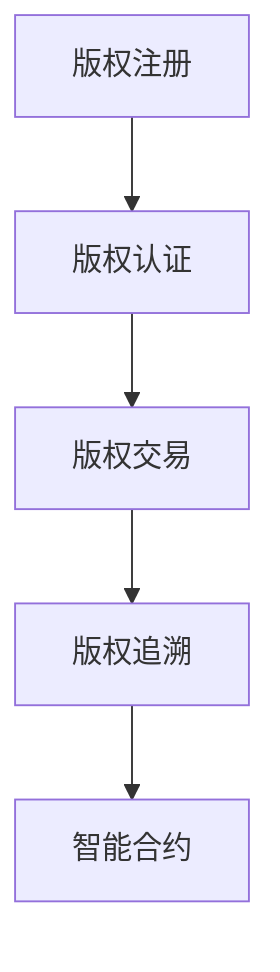

                 

随着数字经济的快速发展，版权保护问题愈发重要。区块链技术作为一种分布式账本技术，因其去中心化、不可篡改等特性，为版权保护提供了一种全新的解决方案。本文将深入探讨区块链在版权保护中的应用，包括核心概念、算法原理、数学模型、实际应用以及未来发展趋势。

## 文章关键词

区块链，版权保护，智能合约，分布式账本，数字版权管理，加密技术。

## 文章摘要

本文首先介绍了区块链技术的基本概念和特性，然后分析了区块链在版权保护中的核心应用，包括数字版权管理、版权交易和智能合约。接着，详细探讨了区块链版权保护的核心算法原理、数学模型以及实际应用案例。最后，文章总结了区块链在版权保护领域的优势与挑战，并对未来发展趋势进行了展望。

## 1. 背景介绍

版权保护是指对创作者的原创性作品进行法律保护，以保障其合法权益。随着互联网的普及，数字版权保护问题日益突出。传统的版权保护手段如法律监管、技术手段等，往往存在成本高、效率低、易篡改等问题。区块链技术的出现，为数字版权保护提供了一种新的思路。

区块链是一种分布式账本技术，其核心特性包括去中心化、不可篡改、透明性和匿名性。这些特性使得区块链在版权保护中具有独特的优势。首先，去中心化意味着版权信息不再依赖于单一中心机构，而是由整个网络共同维护，提高了版权信息的可靠性和安全性。其次，不可篡改确保了版权信息的真实性和历史记录的完整性。最后，透明性和匿名性使得版权信息的流转和交易更加公开和公平。

## 2. 核心概念与联系

### 2.1 区块链技术概述

区块链是一种由一系列按时间顺序排列的块组成的分布式数据库。每个区块包含一定数量的交易记录，并通过密码学算法链接在一起，形成一条不断延伸的链。区块链的主要特点包括：

- **去中心化**：区块链没有中央管理实体，数据存储和传输由网络中的所有节点共同维护。
- **不可篡改**：一旦数据被记录在区块链上，就难以被篡改，保证了数据的真实性和可靠性。
- **透明性**：区块链上的所有交易记录都是公开透明的，任何节点都可以访问和验证。
- **匿名性**：区块链交易通常使用加密技术，保护了交易方的隐私。

### 2.2 数字版权管理（DRM）

数字版权管理是一种技术手段，用于保护数字内容不被未经授权的使用。在区块链技术中，数字版权管理可以与区块链技术相结合，形成去中心化的数字版权管理系统。该系统主要涉及以下几个方面：

- **版权注册**：创作者可以将作品注册到区块链上，获得数字版权证书。
- **版权认证**：系统可以对作品进行身份认证，确保版权信息的真实性。
- **版权交易**：创作者可以授权他人使用其作品，并通过区块链进行交易。
- **版权追溯**：系统记录了版权信息的历史变化，便于追溯和维权。

### 2.3 智能合约

智能合约是一种运行在区块链上的自动执行合同，它通过预定义的规则和条件，自动执行合同条款。在版权保护中，智能合约可以用于实现版权授权、版权交易等操作。智能合约的关键特性包括：

- **自动化**：智能合约可以自动执行预定义的规则，无需人工干预。
- **透明性**：智能合约的执行过程和结果都是公开透明的。
- **不可篡改**：一旦智能合约被部署，其代码和规则就难以被篡改。

### 2.4 Mermaid 流程图

以下是一个简单的 Mermaid 流程图，展示了区块链在版权保护中的应用流程：



## 3. 核心算法原理 & 具体操作步骤

### 3.1 算法原理概述

区块链在版权保护中的核心算法主要包括数字签名、哈希函数和区块链共识算法。

- **数字签名**：用于保证版权信息的真实性和完整性。创作者可以使用私钥对版权信息进行签名，接收者可以使用公钥验证签名。
- **哈希函数**：用于生成版权信息的唯一标识。哈希函数将版权信息映射为一个固定长度的字符串，确保版权信息不可篡改。
- **区块链共识算法**：用于维护区块链的一致性和安全性。常见的共识算法包括工作量证明（PoW）、权益证明（PoS）和委托权益证明（DPoS）等。

### 3.2 算法步骤详解

以下是区块链版权保护的具体操作步骤：

1. **版权注册**：创作者将作品上传到区块链，使用哈希函数生成作品的唯一标识，并将其与创作者的身份信息一起提交到区块链。
2. **版权认证**：区块链网络中的节点对上传的版权信息进行验证，确保信息的真实性。一旦验证通过，版权信息将被永久记录在区块链上。
3. **版权交易**：创作者可以通过智能合约与他人进行版权交易。在交易过程中，智能合约将自动执行预定义的规则，确保交易的合法性和透明性。
4. **版权追溯**：系统记录了版权信息的历史变化，包括注册、认证、交易等操作。任何用户都可以查询版权信息的历史记录，便于追溯和维权。

### 3.3 算法优缺点

- **优点**：区块链版权保护具有去中心化、不可篡改、透明性和匿名性等优势，能够有效提高版权保护的效果。
- **缺点**：区块链技术仍处于发展初期，存在性能、可扩展性和安全性等问题，需要进一步研究和改进。

### 3.4 算法应用领域

区块链版权保护技术可以应用于多个领域，包括音乐、电影、文学、艺术等。通过区块链技术，创作者可以更好地保护自己的版权，减少版权纠纷，提高创作积极性。

## 4. 数学模型和公式 & 详细讲解 & 举例说明

### 4.1 数学模型构建

在区块链版权保护中，常用的数学模型包括哈希函数、数字签名和区块链共识算法。

- **哈希函数**：哈希函数将输入映射为一个固定长度的字符串。在版权保护中，哈希函数用于生成版权信息的唯一标识。
- **数字签名**：数字签名是一种加密技术，用于验证版权信息的真实性。创作者使用私钥对版权信息进行签名，接收者使用公钥验证签名。
- **区块链共识算法**：区块链共识算法用于维护区块链的一致性和安全性。常见的共识算法包括工作量证明（PoW）、权益证明（PoS）和委托权益证明（DPoS）等。

### 4.2 公式推导过程

以下是区块链版权保护中的几个关键公式的推导过程：

1. **哈希函数公式**：哈希函数 \( H \) 将输入 \( M \) 映射为一个固定长度的字符串 \( H(M) \)。

   $$ H(M) = hash(M) $$

2. **数字签名公式**：数字签名 \( S \) 由以下公式计算：

   $$ S = sign(m, sk) $$

   其中，\( m \) 为版权信息，\( sk \) 为创作者的私钥。

3. **区块链共识算法公式**：区块链共识算法根据不同算法有不同的计算公式。以工作量证明（PoW）为例，矿工需要解决以下难题：

   $$ hash(nonce, prev_hash, timestamp, transaction) < difficulty $$

   其中，\( nonce \) 为随机数，\( prev_hash \) 为上一区块的哈希值，\( timestamp \) 为时间戳，\( transaction \) 为交易记录，\( difficulty \) 为难度目标。

### 4.3 案例分析与讲解

假设一位音乐创作者想要使用区块链技术保护其音乐作品的版权。以下是具体的操作步骤：

1. **版权注册**：创作者将音乐作品上传到区块链，使用哈希函数生成作品的唯一标识，并将其与创作者的身份信息一起提交到区块链。
2. **版权认证**：区块链网络中的节点对上传的版权信息进行验证，确保信息的真实性。一旦验证通过，版权信息将被永久记录在区块链上。
3. **版权交易**：创作者可以通过智能合约与他人进行版权交易。在交易过程中，智能合约将自动执行预定义的规则，确保交易的合法性和透明性。
4. **版权追溯**：系统记录了版权信息的历史变化，包括注册、认证、交易等操作。任何用户都可以查询版权信息的历史记录，便于追溯和维权。

通过上述案例，我们可以看到区块链技术在版权保护中的应用效果。创作者可以更好地保护自己的版权，降低版权纠纷的风险，提高创作积极性。

## 5. 项目实践：代码实例和详细解释说明

### 5.1 开发环境搭建

在本文中，我们将使用 Ethereum 的智能合约平台进行区块链版权保护项目的实践。以下是开发环境搭建的步骤：

1. 安装 Ethereum 钱包，如 MetaMask。
2. 安装 Solidity 编译器，如 solc-js。
3. 创建一个新的 Solidity 智能合约项目。

### 5.2 源代码详细实现

以下是区块链版权保护智能合约的示例代码：

```solidity
// SPDX-License-Identifier: MIT
pragma solidity ^0.8.0;

contract CopyrightProtection {
    mapping(bytes32 => bool) public registeredCopyrights;
    mapping(bytes32 => address) public copyrightOwners;

    function registerCopyright(bytes32 _hash) external {
        require(!registeredCopyrights[_hash], "Copyright already registered");
        registeredCopyrights[_hash] = true;
        copyrightOwners[_hash] = msg.sender;
    }

    function transferCopyright(bytes32 _hash, address _newOwner) external {
        require(registeredCopyrights[_hash], "Copyright not registered");
        require(msg.sender == copyrightOwners[_hash], "Not the owner");
        copyrightOwners[_hash] = _newOwner;
    }

    function authenticateCopyright(bytes32 _hash) external view returns (bool) {
        return registeredCopyrights[_hash];
    }
}
```

### 5.3 代码解读与分析

上述代码实现了区块链版权保护的核心功能：

- **registerCopyright**：用于注册版权信息。创作者通过调用该函数，将作品的哈希值与自己的地址关联，实现版权注册。
- **transferCopyright**：用于转让版权。版权所有者可以通过调用该函数，将版权转让给新的所有者。
- **authenticateCopyright**：用于验证版权信息。任何用户都可以通过调用该函数，验证作品是否已注册。

### 5.4 运行结果展示

假设创作者 Alice 注册了一首歌曲的版权，歌曲的哈希值为 `0x1234567890abcdef1234567890abcdef`。以下是具体的操作步骤：

1. Alice 调用 `registerCopyright` 函数，注册版权信息。
2. Alice 调用 `authenticateCopyright` 函数，验证歌曲的版权信息。
3. 如果 Bob 想购买这首歌曲的版权，Alice 可以调用 `transferCopyright` 函数，将版权转让给 Bob。

通过以上操作，我们可以看到区块链版权保护智能合约的实际运行效果。

## 6. 实际应用场景

### 6.1 音乐行业

音乐行业是区块链技术在版权保护中应用最为广泛的领域之一。通过区块链技术，音乐创作者可以更方便地注册、管理和转让版权，减少版权纠纷，提高创作积极性。

### 6.2 电影行业

在电影行业中，区块链技术可以用于电影版权的保护和交易。通过区块链，电影制作方可以确保影片的版权信息不会被篡改，从而保障其合法权益。

### 6.3 艺术品市场

艺术品市场也存在版权保护问题。区块链技术可以为艺术品提供去中心化的认证和追溯机制，确保艺术品的真实性和版权信息。

### 6.4 文学作品

在文学作品中，区块链技术可以用于保护作家的版权，确保作品的原创性和版权信息的透明性。

## 7. 工具和资源推荐

### 7.1 学习资源推荐

- 《区块链技术指南》
- 《智能合约开发指南》
- 《区块链与数字版权管理》

### 7.2 开发工具推荐

- MetaMask：Ethereum 钱包。
- Truffle：智能合约开发框架。
- Remix：在线智能合约编辑器。

### 7.3 相关论文推荐

- "Blockchain and Copyright Protection: A Review"
- "Smart Contracts for Digital Rights Management"
- "A Blockchain-Based Digital Copyright Management System"

## 8. 总结：未来发展趋势与挑战

### 8.1 研究成果总结

本文探讨了区块链在版权保护中的应用，分析了其核心概念、算法原理、数学模型以及实际应用场景。通过区块链技术，创作者可以更方便地保护自己的版权，降低版权纠纷的风险。

### 8.2 未来发展趋势

随着区块链技术的不断发展，预计在未来几年，区块链在版权保护领域的应用将会更加广泛。特别是去中心化版权管理平台和智能合约技术的成熟，将为版权保护带来更多可能性。

### 8.3 面临的挑战

尽管区块链技术在版权保护中具有巨大潜力，但仍然面临一些挑战，如性能、可扩展性和安全性等问题。此外，法律和政策层面的支持也是区块链技术在版权保护中推广的关键因素。

### 8.4 研究展望

未来，我们需要进一步研究区块链在版权保护中的性能优化、安全增强以及与其他技术的融合应用，以推动区块链技术在版权保护领域的全面发展。

## 9. 附录：常见问题与解答

### Q：区块链版权保护是否可以完全替代传统版权保护手段？

A：区块链版权保护不能完全替代传统版权保护手段，但可以提供一种更高效、更安全的版权保护解决方案。传统版权保护手段如法律监管、技术手段等，仍将在一定程度上发挥重要作用。

### Q：区块链版权保护是否具有法律效力？

A：区块链版权保护的法律效力取决于各国的法律框架。在一些国家和地区，区块链上的版权信息已被法院认可为具有法律效力。然而，具体情况还需根据当地法律进行判断。

### Q：区块链版权保护是否适用于所有类型的版权？

A：区块链版权保护主要适用于数字版权，如音乐、电影、文学作品等。对于实物版权，如艺术品、手稿等，区块链技术可能不太适用。

### Q：区块链版权保护是否会侵犯创作者的隐私？

A：区块链版权保护在保护创作者版权的同时，也尊重创作者的隐私。通过使用加密技术，创作者的个人信息可以在区块链上保持匿名，从而保护其隐私。

---

本文由禅与计算机程序设计艺术（Zen and the Art of Computer Programming）撰写，旨在探讨区块链在版权保护中的应用。希望通过本文，读者能够更好地了解区块链技术在版权保护中的优势和应用前景。随着区块链技术的不断发展，我们有理由相信，它将为数字版权保护带来更多创新和变革。

