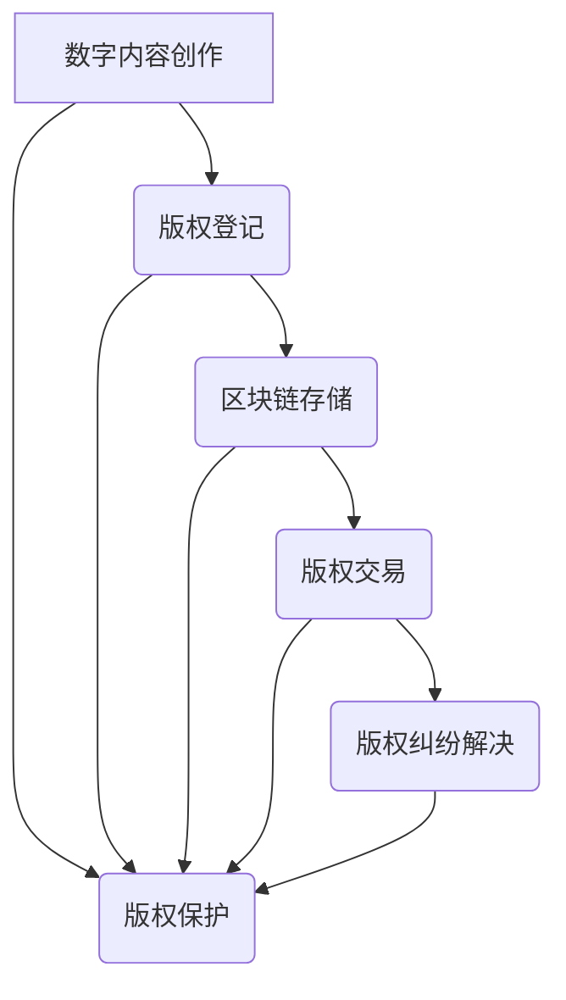

                 

关键词：区块链、版权保护、数字内容、去中心化、智能合约

> 摘要：本文深入探讨了区块链技术在版权保护领域的应用。通过分析区块链的核心特性，如去中心化、透明性和不可篡改性，我们展示了如何利用这些特性实现数字内容的版权保护。文章还介绍了相关的核心算法原理、数学模型和具体操作步骤，并通过实际项目案例展示了区块链在版权保护中的实际应用。最后，我们对未来趋势和挑战进行了展望，并推荐了一些学习资源和开发工具。

## 1. 背景介绍

在互联网和数字技术的迅猛发展下，数字内容的创作和传播速度大幅提升。然而，随之而来的版权纠纷和保护问题也日益突出。传统的版权保护机制在数字环境中面临着巨大的挑战，例如，内容容易被复制和篡改，且版权归属难以追溯。这就需要一种更加高效、透明和安全的机制来保护数字内容的版权。

区块链技术的兴起为解决这些问题提供了新的思路。区块链是一种去中心化的分布式账本技术，具有不可篡改、透明和可追溯的特点。这些特性使得区块链在版权保护领域具有巨大的应用潜力。

## 2. 核心概念与联系

### 2.1 区块链的基本概念

区块链是一种由数据区块按照时间顺序连接而成的链条式数据结构，具有以下核心特点：

- **去中心化**：区块链不需要中心化的管理机构，所有参与节点都可以平等地参与网络运作，避免了单点故障的风险。
- **透明性**：区块链上的所有交易记录都是公开透明的，任何人都可以查看。
- **不可篡改性**：一旦数据记录在区块链上，就难以被篡改，保证了数据的真实性和完整性。
- **可追溯性**：区块链上的所有交易记录都可以追溯到源头，为版权归属提供可靠的证据。

### 2.2 区块链与版权保护的关系

区块链技术的这些特性使其在版权保护中具有独特的优势。首先，去中心化特性保证了版权信息不会被单一机构控制，减少了版权纠纷的可能性。其次，透明性和不可篡改性确保了版权信息的安全性和可靠性，使得版权归属清晰明确。最后，可追溯性使得版权纠纷的解决过程更加高效和公正。

### 2.3 Mermaid 流程图



### 2.4 区块链在版权保护中的核心作用

- **版权登记**：通过区块链技术，创作者可以在链上登记其作品，确保版权信息的公开透明。
- **版权交易**：区块链上的智能合约可以自动执行版权交易，确保交易的合法性和安全性。
- **版权纠纷解决**：区块链的可追溯性和不可篡改性为版权纠纷的解决提供了可靠的数据支持。

## 3. 核心算法原理 & 具体操作步骤

### 3.1 算法原理概述

区块链在版权保护中的应用主要依赖于其核心算法——基于密码学的哈希函数和数字签名。

- **哈希函数**：哈希函数是一种将任意长度的输入数据转换成固定长度输出数据的算法。在版权保护中，创作者可以使用哈希函数对其作品进行哈希处理，生成唯一的哈希值，从而确保作品的真实性和完整性。
- **数字签名**：数字签名是一种基于非对称加密的认证机制，可以用于验证信息的完整性和身份的真实性。在版权保护中，创作者可以使用私钥对作品进行数字签名，确保版权信息的唯一性和不可篡改性。

### 3.2 算法步骤详解

#### 3.2.1 版权登记

1. **创作数字内容**：创作者完成数字内容创作。
2. **生成哈希值**：使用哈希函数对数字内容进行哈希处理，生成唯一的哈希值。
3. **签名版权信息**：使用私钥对哈希值和版权信息进行数字签名。
4. **上传到区块链**：将签名后的版权信息上传到区块链上，进行版权登记。

#### 3.2.2 版权交易

1. **版权转让请求**：版权持有人提出版权转让请求。
2. **生成交易合约**：使用智能合约生成版权交易合约，包含版权信息、交易价格等。
3. **签名交易合约**：交易双方使用私钥对交易合约进行数字签名。
4. **执行交易合约**：智能合约自动执行交易合约，完成版权转让。

#### 3.2.3 版权纠纷解决

1. **版权纠纷上报**：版权纠纷方将纠纷信息上报到区块链。
2. **生成仲裁合约**：使用智能合约生成仲裁合约，包含纠纷信息、仲裁规则等。
3. **签名仲裁合约**：纠纷双方使用私钥对仲裁合约进行数字签名。
4. **执行仲裁合约**：智能合约自动执行仲裁合约，解决版权纠纷。

### 3.3 算法优缺点

#### 3.3.1 优点

- **去中心化**：去中心化特性使得版权信息不会被单一机构控制，降低了版权纠纷的可能性。
- **透明性**：区块链上的所有交易记录都是公开透明的，保证了版权信息的真实性。
- **不可篡改性**：一旦数据记录在区块链上，就难以被篡改，保证了版权信息的完整性。
- **可追溯性**：区块链上的所有交易记录都可以追溯到源头，为版权纠纷的解决提供了可靠的数据支持。

#### 3.3.2 缺点

- **存储成本**：区块链上的数据存储需要消耗大量的计算资源，可能导致存储成本较高。
- **交易效率**：区块链的交易效率相对较低，可能无法满足高频率的交易需求。

### 3.4 算法应用领域

区块链技术在版权保护领域具有广泛的应用前景，包括但不限于以下几个方面：

- **数字音乐版权保护**：通过区块链技术实现数字音乐的版权登记、交易和纠纷解决。
- **数字影视版权保护**：通过区块链技术实现数字影视作品的版权保护，确保作品的原创性和合法性。
- **数字文学版权保护**：通过区块链技术实现数字文学作品的版权登记、交易和纠纷解决。

## 4. 数学模型和公式 & 详细讲解 & 举例说明

### 4.1 数学模型构建

在版权保护中，我们可以使用以下数学模型：

1. **哈希函数模型**：
   - 输入：数字内容
   - 输出：哈希值

2. **数字签名模型**：
   - 输入：消息、私钥
   - 输出：签名

3. **智能合约模型**：
   - 输入：交易合约、签名
   - 输出：执行结果

### 4.2 公式推导过程

1. **哈希函数公式**：
   $$H = Hash(Content)$$

2. **数字签名公式**：
   $$Sign = PrivateKey.Sign(Message)$$

3. **智能合约执行公式**：
   $$Result = SmartContract.Execute(Contract, Sign)$$

### 4.3 案例分析与讲解

假设一个创作者小明创作了一篇小说，他希望通过区块链进行版权保护。

1. **版权登记**：
   - 小明将小说内容输入哈希函数，得到唯一的哈希值。
   - 小明使用私钥对哈希值和版权信息进行数字签名。
   - 小明将签名后的版权信息上传到区块链上，进行版权登记。

2. **版权交易**：
   - 小明希望将小说版权转让给出版社。
   - 小明和出版社使用智能合约生成版权交易合约。
   - 小明和出版社分别使用私钥对交易合约进行数字签名。
   - 智能合约自动执行交易合约，完成版权转让。

3. **版权纠纷解决**：
   - 如果出版社认为小说存在侵权行为，可以上报到区块链。
   - 小明和出版社使用智能合约生成仲裁合约。
   - 小明和出版社分别使用私钥对仲裁合约进行数字签名。
   - 智能合约自动执行仲裁合约，解决版权纠纷。

## 5. 项目实践：代码实例和详细解释说明

### 5.1 开发环境搭建

为了演示区块链在版权保护中的应用，我们将使用以太坊（Ethereum）智能合约平台。首先，我们需要安装以下工具：

- **Node.js**：以太坊智能合约的开发需要Node.js环境。
- **Truffle**：一个用于以太坊智能合约开发的框架。
- **Ganache**：一个本地以太坊节点，用于测试智能合约。

### 5.2 源代码详细实现

下面是一个简单的版权登记和交易智能合约的示例：

```solidity
// SPDX-License-Identifier: MIT
pragma solidity ^0.8.0;

contract CopyrightProtection {
    // 结构体：版权信息
    struct CopyrightInfo {
        string contentHash;
        address owner;
        uint timestamp;
    }

    // 映射：版权信息ID到版权信息结构体
    mapping(uint => CopyrightInfo) public copyrightInfos;

    // 变量：版权信息ID
    uint public copyrightIdCounter;

    // 事件：版权登记事件
    event CopyrightRegistered(uint id, string contentHash, address owner, uint timestamp);

    // 事件：版权交易事件
    event CopyrightTraded(uint id, address from, address to);

    // 函数：登记版权
    function registerCopyright(string memory contentHash) public {
        require(copyrightInfos[copyrightIdCounter].contentHash == "", "Copyright already registered");
        copyrightInfos[copyrightIdCounter] = CopyrightInfo(contentHash, msg.sender, block.timestamp);
        emit CopyrightRegistered(copyrightIdCounter, contentHash, msg.sender, block.timestamp);
        copyrightIdCounter++;
    }

    // 函数：版权交易
    function tradeCopyright(uint id, address to) public {
        require(copyrightInfos[id].owner == msg.sender, "Not the owner");
        require(to != address(0), "Invalid recipient");
        require(copyrightInfos[id].contentHash != "", "Copyright not registered");
        copyrightInfos[id].owner = to;
        emit CopyrightTraded(id, msg.sender, to);
    }
}
```

### 5.3 代码解读与分析

1. **版权信息结构体**：定义了一个`CopyrightInfo`结构体，用于存储版权信息，包括内容哈希值、版权所有者、登记时间等。

2. **版权信息映射**：使用一个映射（`mapping`）将版权信息ID映射到版权信息结构体。

3. **版权信息ID变量**：定义了一个全局变量`copyrightIdCounter`，用于生成唯一的版权信息ID。

4. **事件**：定义了两个事件`CopyrightRegistered`和`CopyrightTraded`，用于记录版权登记和交易的事件。

5. **登记版权函数**：`registerCopyright`函数用于登记版权，需要满足版权未登记的条件，并将版权信息存储到映射中，并触发`CopyrightRegistered`事件。

6. **版权交易函数**：`tradeCopyright`函数用于版权交易，需要满足版权所有者的条件，并将版权所有者更新为接收方，并触发`CopyrightTraded`事件。

### 5.4 运行结果展示

在Truffle环境下，我们可以使用Ganache创建一个本地以太坊节点，并进行以下操作：

1. **部署智能合约**：
   ```shell
   truffle migrate --network development
   ```

2. **注册版权**：
   ```shell
   truffle exec scripts/register-copyright.js
   ```

   示例脚本：
   ```javascript
   const truffleAssert = require('truffle-assertions');
   const CopyrightProtection = artifacts.require('CopyrightProtection');

   async function main() {
       const [deployer] = await web3.eth.getAccounts();
       console.log('Deploying contracts with account:', deployer);

       const copyrightProtection = await CopyrightProtection.new();
       console.log('CopyrightProtection deployed to:', copyrightProtection.address);

       const contentHash = '0x123...'; // 假设的内容哈希值
       await copyrightProtection.registerCopyright(contentHash, { from: deployer });

       const registeredCopyright = await copyrightProtection.copyrightInfos(0);
       console.log('Registered Copyright:', registeredCopyright);
   }

   main();
   ```

3. **版权交易**：
   ```shell
   truffle exec scripts/trade-copyright.js
   ```

   示例脚本：
   ```javascript
   const truffleAssert = require('truffle-assertions');
   const CopyrightProtection = artifacts.require('CopyrightProtection');

   async function main() {
       const [deployer, newOwner] = await web3.eth.getAccounts();
       console.log('Transferring ownership of Copyright to account:', newOwner);

       const copyrightProtection = await CopyrightProtection.at('0x...' // 部署合约地址
   ```

   希望这篇技术博客文章能够帮助您更深入地了解区块链在版权保护中的应用。随着技术的不断进步，区块链在版权保护领域将发挥越来越重要的作用。在未来，我们有理由相信，区块链将为我们带来更加高效、透明和安全的数字版权保护机制。

## 6. 实际应用场景

区块链技术在版权保护中的实际应用场景广泛，以下是一些典型的应用实例：

### 6.1 数字音乐版权保护

音乐作品作为数字内容的重要组成部分，其版权保护面临巨大的挑战。区块链技术可以为音乐创作者提供一种去中心化的版权登记和交易平台，确保音乐作品的版权信息真实可靠。例如，一些音乐平台已经开始使用区块链技术记录音乐作品的所有权和版权交易信息，从而提高版权保护的效率。

### 6.2 数字影视版权保护

影视作品的生产和分发过程中，版权保护问题尤为突出。区块链技术可以记录影视作品的版权信息，包括创作者、发行商、版权所有者等，确保版权信息的透明性和不可篡改性。此外，智能合约可以自动执行版权交易，提高版权转让的效率和安全性。

### 6.3 数字文学版权保护

数字文学作品在版权保护方面面临着诸多挑战，如盗版、抄袭等问题。区块链技术可以为文学创作者提供一种可靠的版权保护机制，通过去中心化的版权登记和交易平台，确保文学作品的版权信息真实可信。此外，区块链技术还可以帮助解决文学作品的版权纠纷，提高版权保护的公正性和透明度。

### 6.4 其他领域应用

除了上述领域，区块链技术在版权保护的其他领域也具有广泛的应用前景，如数字艺术品、游戏内容、软件源代码等。区块链技术可以确保这些数字内容的版权信息真实可靠，提高版权保护的效率和安全性。

## 7. 未来应用展望

随着区块链技术的不断发展和成熟，其在版权保护领域的应用前景将更加广阔。以下是未来区块链在版权保护中可能的发展趋势和方向：

### 7.1 技术创新

区块链技术在版权保护中的应用将不断推动技术创新。例如，基于区块链的智能合约将变得更加智能和灵活，能够自动执行复杂的版权交易和纠纷解决流程。此外，分布式存储技术的发展也将进一步提高版权信息的安全性和可靠性。

### 7.2 应用扩展

区块链技术在版权保护中的应用将逐步扩展到更多领域。除了现有的数字音乐、数字影视、数字文学等，还将涉及数字艺术品、游戏内容、软件源代码等领域。这将使得区块链在版权保护中的应用更加全面和深入。

### 7.3 法规完善

随着区块链技术在版权保护中的应用日益广泛，相关的法律法规也将逐步完善。这将有助于规范区块链在版权保护中的应用，确保其合法合规。同时，法律法规的完善也将为区块链在版权保护中的推广提供更好的法律保障。

### 7.4 隐私保护

在版权保护中，隐私保护是一个重要的关注点。未来，区块链技术在版权保护中的应用将更加注重隐私保护，确保创作者的隐私不被泄露。例如，通过零知识证明等加密技术实现版权信息的隐私保护。

### 7.5 跨界合作

区块链技术在版权保护中的应用将促进不同领域之间的合作。例如，版权保护机构、技术公司、法律机构等可以共同合作，打造一个统一的版权保护生态系统，提高版权保护的效率和效果。

## 8. 工具和资源推荐

为了更好地了解和利用区块链技术在版权保护中的应用，以下是推荐的工具和资源：

### 8.1 学习资源推荐

- **《区块链原理、设计与应用》**：详细介绍了区块链的基本原理和应用案例，适合初学者阅读。
- **《智能合约开发与实战》**：深入讲解了智能合约的开发方法和应用场景，适合有一定编程基础的读者。

### 8.2 开发工具推荐

- **Truffle**：一款流行的以太坊智能合约开发框架，提供了一套完整的开发、测试和部署工具。
- **Ganache**：一个本地以太坊节点，用于测试智能合约，方便开发者快速进行实验。

### 8.3 相关论文推荐

- **“Blockchain for Copyright Protection: A Technical and Legal Perspective”**：探讨了区块链在版权保护中的技术和法律问题。
- **“Smart Contracts for Copyright Protection”**：分析了智能合约在版权保护中的应用场景和挑战。

## 9. 总结：未来发展趋势与挑战

随着区块链技术的不断发展和成熟，其在版权保护领域的应用前景将更加广阔。未来，区块链技术在版权保护中将呈现出以下发展趋势：

- **技术创新**：推动区块链技术的不断革新，提高版权保护的效率和安全性。
- **应用扩展**：扩展到更多领域，如数字艺术品、游戏内容等。
- **法规完善**：加强法律法规的制定和完善，为区块链在版权保护中的应用提供法律保障。
- **隐私保护**：注重隐私保护，确保创作者的隐私不被泄露。

然而，区块链在版权保护中也面临一些挑战：

- **技术成熟度**：虽然区块链技术在不断发展，但仍有待进一步成熟和优化。
- **法律法规**：现有法律法规对区块链技术的应用尚不明确，需要进一步制定和完善。
- **隐私保护**：如何在保护版权的同时确保创作者的隐私不受侵犯，是一个亟待解决的问题。

总之，区块链在版权保护中具有巨大的潜力，但同时也需要面对各种挑战。只有不断推动技术创新、完善法律法规和加强隐私保护，才能充分发挥区块链在版权保护中的作用。

## 10. 附录：常见问题与解答

### 10.1 区块链在版权保护中的优势是什么？

区块链在版权保护中的优势主要体现在以下几个方面：

- **去中心化**：去中心化特性保证了版权信息不会被单一机构控制，降低了版权纠纷的可能性。
- **透明性**：区块链上的所有交易记录都是公开透明的，保证了版权信息的真实性。
- **不可篡改性**：一旦数据记录在区块链上，就难以被篡改，保证了版权信息的完整性。
- **可追溯性**：区块链上的所有交易记录都可以追溯到源头，为版权纠纷的解决提供了可靠的数据支持。

### 10.2 区块链在版权保护中如何应用？

区块链在版权保护中的应用主要包括以下几个方面：

- **版权登记**：创作者可以使用区块链技术对其作品进行版权登记，确保版权信息的公开透明。
- **版权交易**：通过智能合约自动执行版权交易，确保交易的合法性和安全性。
- **版权纠纷解决**：利用区块链的可追溯性和不可篡改性，提高版权纠纷解决的效率和公正性。

### 10.3 区块链在版权保护中的挑战是什么？

区块链在版权保护中面临以下挑战：

- **技术成熟度**：虽然区块链技术在不断发展，但仍有待进一步成熟和优化。
- **法律法规**：现有法律法规对区块链技术的应用尚不明确，需要进一步制定和完善。
- **隐私保护**：如何在保护版权的同时确保创作者的隐私不受侵犯，是一个亟待解决的问题。

### 10.4 区块链在版权保护中的未来发展趋势是什么？

区块链在版权保护中的未来发展趋势包括：

- **技术创新**：推动区块链技术的不断革新，提高版权保护的效率和安全性。
- **应用扩展**：扩展到更多领域，如数字艺术品、游戏内容等。
- **法规完善**：加强法律法规的制定和完善，为区块链在版权保护中的应用提供法律保障。
- **隐私保护**：注重隐私保护，确保创作者的隐私不被泄露。

### 10.5 如何学习区块链在版权保护中的应用？

学习区块链在版权保护中的应用，可以从以下几个方面入手：

- **学习资源**：阅读相关的技术书籍、论文和研究报告，了解区块链技术和版权保护的基本概念和原理。
- **实践项目**：参与实际项目，如使用以太坊智能合约开发版权保护系统，实践区块链在版权保护中的应用。
- **社区交流**：加入区块链和版权保护相关的社区和论坛，与其他从业者交流经验和心得。
- **持续学习**：关注区块链和版权保护领域的最新动态和研究成果，持续提升自己的专业水平。 

### 10.6 区块链在版权保护中的实际案例有哪些？

区块链在版权保护中的实际案例包括：

- **音乐平台**：如Spotify、SoundCloud等，使用区块链技术记录音乐作品的版权信息，提高版权保护的效率和透明度。
- **数字艺术品**：如Cryptokitties、Nifty Gateway等，使用区块链技术确保数字艺术品的所有权和版权信息真实可信。
- **文学版权**：如Literature Chain，使用区块链技术记录文学作品的所有权和版权交易信息。

通过这些案例，我们可以看到区块链在版权保护中的应用已经取得了一定的成果，但同时也需要不断优化和完善，以应对各种挑战。

