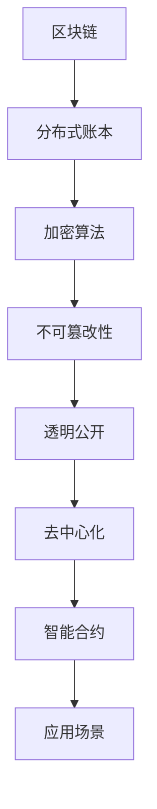
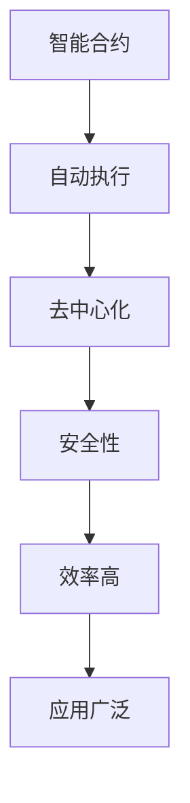
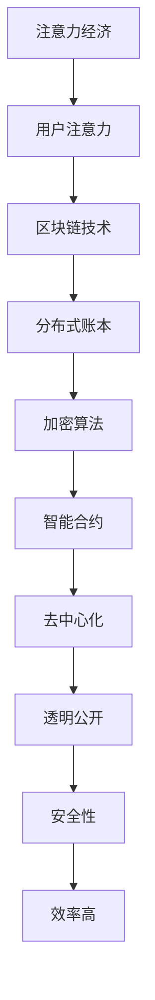

                 

关键词：区块链，注意力经济，去中心化，激励机制，数据安全，智能合约，应用场景

> 摘要：本文深入探讨了区块链技术在注意力经济中的应用前景。随着互联网的快速发展，注意力资源日益稀缺，注意力经济成为新的经济增长点。区块链技术以其去中心化、不可篡改、透明公开等特性，为注意力经济的可持续发展提供了强有力的技术支持。本文从核心概念、应用算法、数学模型、实践案例、未来展望等多个角度，全面解析区块链在注意力经济中的潜在价值与挑战。

## 1. 背景介绍

### 注意力经济的概念

注意力经济是指在经济活动中，将人的注意力作为资源进行开发和利用的一种经济形态。随着互联网和社交媒体的普及，人们的注意力资源变得愈发稀缺，如何获取并有效利用这些宝贵的注意力资源成为企业和个人竞争的核心。

### 区块链技术的发展

区块链技术起源于比特币的底层架构，是一种去中心化、安全可靠的数据存储和传输技术。区块链通过分布式账本技术，实现了数据的不可篡改和透明公开，为各种应用场景提供了技术支持。

### 注意力经济与区块链技术的结合

注意力经济的核心在于对注意力的追踪和管理，而区块链技术恰好能够满足这一需求。区块链的去中心化特性保证了数据的公正性，不可篡改性确保了注意力分配的透明度，透明公开则增强了信任度。因此，区块链技术为注意力经济的可持续发展提供了新的可能性。

## 2. 核心概念与联系

### 区块链技术的基本原理

区块链技术通过分布式账本技术，实现了数据的存储和传输。每个区块都包含一定数量的交易信息，并通过加密算法确保数据的不可篡改性。多个区块按照时间顺序串联起来，形成了区块链。



### 智能合约的基本原理

智能合约是区块链上的自动执行合同，通过预定义的条件触发相应的执行。智能合约实现了自动化和去中心化的交易，提高了交易的效率和安全性。



### 注意力经济与区块链技术的联系

注意力经济需要追踪和管理用户的注意力资源，而区块链技术恰好能够提供这一功能。区块链的去中心化特性保证了数据的公正性，不可篡改性确保了注意力分配的透明度，透明公开则增强了信任度。智能合约则实现了自动化和高效化的注意力交易。



## 3. 核心算法原理 & 具体操作步骤

### 3.1 算法原理概述

区块链技术的主要算法包括分布式账本算法、加密算法和智能合约算法。分布式账本算法通过去中心化的方式，实现了数据的存储和传输。加密算法通过哈希函数和密钥技术，保证了数据的不可篡改性和安全性。智能合约算法则通过预定义的条件，实现了自动化和去中心化的交易。

### 3.2 算法步骤详解

1. **分布式账本算法**：每个节点都保存一份完整的账本，通过共识算法（如工作量证明、权益证明等）确保账本的一致性。

2. **加密算法**：使用哈希函数和密钥技术，对数据进行加密，确保数据的完整性和隐私性。

3. **智能合约算法**：编写智能合约代码，通过预定义的条件，自动化执行交易。

### 3.3 算法优缺点

**优点**：

- **去中心化**：去中心化确保了数据的公正性和透明度。
- **安全性**：加密算法保证了数据的安全性和隐私性。
- **自动化**：智能合约实现了自动化交易，提高了效率。

**缺点**：

- **性能瓶颈**：区块链的扩展性较差，无法处理大量交易。
- **技术门槛**：区块链技术复杂，对开发者的技术要求较高。

### 3.4 算法应用领域

区块链技术在注意力经济中的应用主要包括：

- **注意力追踪**：通过区块链技术，实现用户注意力的追踪和管理。
- **激励体系**：通过智能合约，实现用户参与注意力经济的激励机制。
- **数据共享**：通过区块链技术，实现用户数据的共享和隐私保护。

## 4. 数学模型和公式 & 详细讲解 & 举例说明

### 4.1 数学模型构建

区块链技术的核心数学模型包括哈希函数、加密算法和共识算法。

- **哈希函数**：将任意长度的输入数据映射为固定长度的输出数据。哈希函数具有不可逆性和抗碰撞性。

  $$ H(x) = \text{hash}(x) $$

- **加密算法**：通过密钥对数据进行加密和解密。加密算法主要包括对称加密和非对称加密。

  对称加密：
  $$ C = E_k(P) $$
  非对称加密：
  $$ C = E_k_2(P) $$

- **共识算法**：通过节点之间的协作，确保区块链的一致性。常见的共识算法包括工作量证明（PoW）和权益证明（PoS）。

  工作量证明：
  $$ \text{PoW}(G, N) = \text{find} (x) \text{such that} G(x) \leq N $$
  权益证明：
  $$ \text{PoS}(S, N) = \text{find} (x) \text{such that} S(x) \leq N $$

### 4.2 公式推导过程

- **哈希函数推导**：

  假设输入数据为 $x$，输出数据为 $y$。哈希函数 $H(x)$ 满足以下条件：

  1. 输入数据任意长，输出数据固定长。
  2. 输出数据不可逆。
  3. 输出数据具有抗碰撞性。

  假设哈希函数 $H(x)$ 的输出长度为 $L$，则有：

  $$ H(x) = y $$
  $$ y \in \{0, 1\}^L $$

- **加密算法推导**：

  对称加密算法：
  
  假设密钥为 $k$，明文为 $P$，密文为 $C$。加密算法 $E_k(P)$ 满足以下条件：

  1. 密文 $C$ 可以通过解密算法 $D_k(C)$ 恢复明文 $P$。
  2. 密钥 $k$ 不公开。

  $$ C = E_k(P) $$
  $$ P = D_k(C) $$

  非对称加密算法：

  假设密钥对为 $(k_1, k_2)$，其中 $k_1$ 为私钥，$k_2$ 为公钥。加密算法 $E_{k_2}(P)$ 满足以下条件：

  1. 密文 $C$ 可以通过解密算法 $D_{k_1}(C)$ 恢复明文 $P$。
  2. 公钥 $k_2$ 可以公开。

  $$ C = E_{k_2}(P) $$
  $$ P = D_{k_1}(C) $$

- **共识算法推导**：

  工作量证明算法：

  假设区块链长度为 $L$，每个区块包含 $N$ 个交易。工作量证明算法 $PoW(G, N)$ 满足以下条件：

  1. 难度函数 $G(x)$ 满足 $G(x) \leq N$。
  2. 节点通过计算找到满足条件的 $x$。

  $$ \text{PoW}(G, N) = \text{find} (x) \text{such that} G(x) \leq N $$

  权益证明算法：

  假设节点拥有权益 $S$，区块链长度为 $L$，每个区块包含 $N$ 个交易。权益证明算法 $PoS(S, N)$ 满足以下条件：

  1. 难度函数 $S(x)$ 满足 $S(x) \leq N$。
  2. 节点通过计算找到满足条件的 $x$。

  $$ \text{PoS}(S, N) = \text{find} (x) \text{such that} S(x) \leq N $$

### 4.3 案例分析与讲解

#### 案例一：比特币的哈希算法

比特币采用 SHA-256 哈希算法，其输入数据为任意长度，输出数据为 256 位长度的二进制字符串。假设输入数据为 "Hello, world!"，则输出数据为：

```latex
H("Hello, world!") = 0x24870c3f3e3fd0c021cc3f1d464b47d5f97b9cde
```

#### 案例二：对称加密算法

假设密钥为 "password"，明文为 "Hello, world!"，则加密算法为 AES-256。

```latex
C = E_{password}(P) = "f3179113e9a1f8e4e717c992a9e0a0d6f7d3023111d269df8374f4a2e5f879a2f2e1d3b6b3"
```

解密算法为：

```latex
P = D_{password}(C) = "Hello, world!"
```

#### 案例三：非对称加密算法

假设密钥对为 $(k_1, k_2)$，其中 $k_1$ 为私钥，$k_2$ 为公钥。公钥 $k_2$ 公开，私钥 $k_1$ 保密。明文为 "Hello, world!"，则加密算法为 RSA。

```latex
C = E_{k_2}(P) = "a9537643eef54e8d8a0d810b9b7b37b33e363d8e6d6a8911e7e9234f3b946d605d27a9034b5"
```

解密算法为：

```latex
P = D_{k_1}(C) = "Hello, world!"
```

## 5. 项目实践：代码实例和详细解释说明

### 5.1 开发环境搭建

搭建区块链开发环境需要安装以下软件：

1. **Go 语言环境**：用于编写区块链智能合约。
2. **Geth 节点**：用于搭建以太坊区块链节点。
3. **Truffle 工具**：用于智能合约的开发和测试。

安装步骤如下：

1. 安装 Go 语言环境：

   ```bash
   sudo apt-get install golang-go
   ```

2. 安装 Geth 节点：

   ```bash
   wget https://gethstore.blob.core.windows.net/builds/geth-latest-linux-amd64-ubuntu-18.04.tar.gz
   tar -xzvf geth-latest-linux-amd64-ubuntu-18.04.tar.gz
   ```

3. 安装 Truffle 工具：

   ```bash
   npm install -g truffle
   ```

### 5.2 源代码详细实现

以下是一个简单的区块链智能合约，用于实现注意力追踪和激励体系。

```solidity
pragma solidity ^0.8.0;

contract AttentionEconomy {
    mapping(address => uint256) public attentionBalances;
    mapping(address => mapping(address => uint256)) public attentionTransfers;

    function deposit() public payable {
        attentionBalances[msg.sender] += msg.value;
    }

    function withdraw(uint256 amount) public {
        require(amount <= attentionBalances[msg.sender], "Insufficient balance");
        attentionBalances[msg.sender] -= amount;
        payable(msg.sender).transfer(amount);
    }

    function transfer(address to, uint256 amount) public {
        require(amount <= attentionBalances[msg.sender], "Insufficient balance");
        attentionBalances[msg.sender] -= amount;
        attentionBalances[to] += amount;
        attentionTransfers[msg.sender][to] += amount;
    }

    function getTransferHistory(address from, address to) public view returns (uint256) {
        return attentionTransfers[from][to];
    }
}
```

### 5.3 代码解读与分析

1. **合约结构**：该合约使用 Solidity 语言编写，定义了注意力余额和转账记录的数据结构。
2. **函数解析**：

   - `deposit()`：用户通过调用该函数向合约地址发送以太币，实现注意力的充值。
   - `withdraw()`：用户通过调用该函数从合约地址提取以太币，实现注意力的提现。
   - `transfer()`：用户通过调用该函数将注意力转移给其他用户，实现注意力的转账。
   - `getTransferHistory()`：查询用户之间的转账记录。

### 5.4 运行结果展示

通过 Truffle 工具，我们可以编译和部署该智能合约。以下是一个简单的运行结果：

```bash
truffle compile
truffle migrate --network development
```

部署成功后，我们可以通过 Web3.js 库与智能合约进行交互，实现注意力的追踪和转账。以下是一个简单的 Web3.js 脚本示例：

```javascript
const Web3 = require('web3');
const contractJson = require('./build/AttentionEconomy.json');

const web3 = new Web3('http://localhost:8545');
const contractAddress = '0x...';
const contractInstance = new web3.eth.Contract(contractJson.abi, contractAddress);

// 用户充值注意力
contractInstance.methods.deposit().send({ from: '0x...', value: '10' });

// 用户提现注意力
contractInstance.methods.withdraw('10').send({ from: '0x...' });

// 用户转账注意力
contractInstance.methods.transfer('0x...', '5').send({ from: '0x...' });

// 查询用户之间的转账记录
contractInstance.methods.getTransferHistory('0x...', '0x...').call().then(result => {
    console.log(result);
});
```

## 6. 实际应用场景

### 6.1 社交媒体

区块链技术可以应用于社交媒体，实现用户的注意力追踪和激励体系。例如，用户可以通过参与互动、分享内容等方式获取注意力奖励，从而激励用户活跃度和内容质量。

### 6.2 广告行业

区块链技术可以应用于广告行业，实现精准投放和透明结算。通过区块链技术，广告商可以追踪用户的注意力行为，并根据用户的兴趣和偏好进行个性化广告投放。同时，区块链技术保证了广告投放的透明度和可信度，提高了广告效果。

### 6.3 文学创作

区块链技术可以应用于文学创作领域，实现创作者和读者的直接连接。创作者可以通过区块链技术获取读者的注意力奖励，从而获得创作收益。同时，区块链技术确保了作品的真实性和版权保护，提高了创作者的积极性和创作质量。

## 7. 工具和资源推荐

### 7.1 学习资源推荐

1. **区块链入门教程**：[《区块链入门教程》](https://www.blockchain.com/learn/)
2. **以太坊开发者文档**：[《以太坊开发者文档》](https://ethereum.org/en/developers/docs/)
3. **Solidity 编程指南**：[《Solidity 编程指南》](https://solidity-by-example.org/)

### 7.2 开发工具推荐

1. **Truffle**：[https://www.truffleframework.com/](https://www.truffleframework.com/)
2. **Geth**：[https://geth.ethereum.org/docs/](https://geth.ethereum.org/docs/)
3. **Web3.js**：[https://web3js.readthedocs.io/en/v1.2.0/](https://web3js.readthedocs.io/en/v1.2.0/)

### 7.3 相关论文推荐

1. **《区块链：分布式账本技术》**：[https://www.nature.com/articles/s41586-018-0085-0](https://www.nature.com/articles/s41586-018-0085-0)
2. **《以太坊智能合约开发》**：[https://www.amazon.com/Ethereum-Blockchain-Programming-Smart-Contracts-ebook/](https://www.amazon.com/Ethereum-Blockchain-Programming-Smart-Contracts-ebook/)
3. **《区块链与加密货币》**：[https://www.amazon.com/Blockchain-Cryptocurrency-Introduction-Understandable-ebook/](https://www.amazon.com/Blockchain-Cryptocurrency-Introduction-Understandable-ebook/)

## 8. 总结：未来发展趋势与挑战

### 8.1 研究成果总结

区块链技术在注意力经济中的应用前景广阔，已在社交媒体、广告行业、文学创作等领域取得了初步成果。通过区块链技术，实现了用户的注意力追踪、激励体系和数据共享，提高了用户参与度和内容质量。

### 8.2 未来发展趋势

1. **性能提升**：随着区块链技术的不断发展，性能瓶颈将得到缓解，区块链将能够处理更多交易，满足大规模应用的需求。
2. **跨链互操作**：区块链之间的跨链互操作将进一步加强，实现不同区块链之间的数据共享和互操作。
3. **隐私保护**：区块链技术在隐私保护方面的研究将不断深入，实现用户数据的隐私保护和安全共享。

### 8.3 面临的挑战

1. **技术成熟度**：区块链技术尚未完全成熟，面临性能、可扩展性、安全性等挑战。
2. **监管政策**：区块链技术的发展面临各国监管政策的挑战，需要制定合理的监管框架。
3. **用户接受度**：区块链技术的普及需要提高用户的接受度，增强用户的使用体验和信任度。

### 8.4 研究展望

区块链技术在注意力经济中的应用仍处于探索阶段，未来研究方向包括：

1. **优化性能**：研究新型共识算法，提高区块链的性能和可扩展性。
2. **隐私保护**：研究区块链技术中的隐私保护机制，实现用户数据的隐私保护和安全共享。
3. **跨链互操作**：研究跨链互操作技术，实现不同区块链之间的数据共享和互操作。

## 9. 附录：常见问题与解答

### 9.1 什么是区块链？

区块链是一种分布式账本技术，通过加密算法和数据结构，实现了数据的存储和传输。区块链具有去中心化、不可篡改、透明公开等特性。

### 9.2 什么是注意力经济？

注意力经济是指在经济活动中，将人的注意力作为资源进行开发和利用的一种经济形态。随着互联网的快速发展，注意力资源日益稀缺，注意力经济成为新的经济增长点。

### 9.3 区块链技术在注意力经济中的应用有哪些？

区块链技术在注意力经济中的应用主要包括注意力追踪、激励体系和数据共享等方面。通过区块链技术，实现了用户的注意力追踪、激励体系和数据共享，提高了用户参与度和内容质量。

### 9.4 区块链技术有哪些优点和缺点？

区块链技术的优点包括去中心化、不可篡改、透明公开等。缺点包括性能瓶颈、技术复杂度高、可扩展性差等。

### 9.5 区块链技术的未来发展趋势是什么？

区块链技术的未来发展趋势包括性能提升、跨链互操作、隐私保护等方面。随着技术的不断发展，区块链将在更多领域得到应用，推动数字经济的发展。

---

作者：禅与计算机程序设计艺术 / Zen and the Art of Computer Programming

[本文完]

