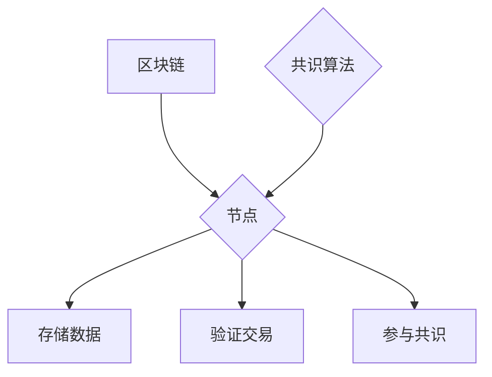

                 

区块链技术作为分布式系统的代表，正在逐渐渗透到各个商业领域，改变着传统的业务模式和管理方法。本文旨在探讨区块链在商业应用中的管理角色，分析其核心技术原理、算法应用，并展望其未来发展。

## 关键词 Keywords

区块链、分布式技术、商业应用、管理、核心技术原理、算法、数学模型、项目实践、应用场景、未来展望。

## 摘要 Abstract

本文首先介绍了区块链的基本概念和背景，然后深入探讨了区块链的核心技术原理和算法。接着，文章通过实际项目实践，展示了区块链在商业应用中的具体实现。最后，本文分析了区块链的实际应用场景，并对其未来发展趋势和挑战进行了展望。

## 1. 背景介绍 Background

区块链作为一种分布式账本技术，起源于比特币的底层架构。随着比特币的火爆，区块链技术逐渐受到关注，并开始应用于各个领域。区块链的核心价值在于其去中心化、安全性、透明性和不可篡改性。

### 1.1 去中心化 Decentralization

区块链通过分布式网络，使得数据不需要存储在中央服务器，而是分布在各个节点上。这样，任何一个节点都无法单独掌控整个系统，提高了系统的可靠性和抗攻击性。

### 1.2 安全性 Security

区块链利用密码学技术，确保数据的完整性和安全性。通过哈希函数、数字签名和加密算法，区块链实现了数据的防篡改和隐私保护。

### 1.3 透明性 Transparency

区块链的所有交易记录都是公开透明的，任何人都可以查看。这种透明性增强了系统的可信度，有助于防止欺诈和腐败。

### 1.4 不可篡改性 Immutability

区块链的数据一旦记录，就无法被篡改。这种不可篡改性确保了数据的真实性和历史可追溯性。

## 2. 核心概念与联系 Core Concepts and Connections

### 2.1 区块 Block

区块链的基本单位是区块，每个区块包含一定数量的交易记录。区块通过哈希函数与前一个区块连接，形成链式结构。

### 2.2 节点 Node

区块链的参与者是节点，节点可以是个人或组织。节点负责存储数据、验证交易和参与共识。

### 2.3 共识 Consensus

共识算法是区块链的核心机制，用于确保所有节点对数据的认同。常见的共识算法有工作量证明（PoW）、权益证明（PoS）和授权股权证明（DPoS）等。

### 2.4 Mermaid 流程图



## 3. 核心算法原理 & 具体操作步骤 Core Algorithm Principles & Operational Steps

### 3.1 算法原理概述

区块链的核心算法包括哈希函数、数字签名和共识算法。

#### 3.1.1 哈希函数 Hash Function

哈希函数用于将任意长度的数据映射为固定长度的哈希值。常见的哈希函数有SHA-256、MD5等。

#### 3.1.2 数字签名 Digital Signature

数字签名用于验证数据的真实性和完整性。签名过程涉及私钥和公钥。

#### 3.1.3 共识算法 Consensus Algorithm

共识算法用于确保所有节点对数据的认同。不同的共识算法有不同的实现方式，如PoW、PoS等。

### 3.2 算法步骤详解

#### 3.2.1 哈希函数步骤

1. 输入任意长度的数据。
2. 通过哈希函数计算哈希值。
3. 输出固定长度的哈希值。

#### 3.2.2 数字签名步骤

1. 输入明文数据和私钥。
2. 通过哈希函数计算哈希值。
3. 使用私钥对哈希值进行签名。
4. 输出签名结果。

#### 3.2.3 共识算法步骤

1. 节点接收交易数据。
2. 对交易数据进行验证。
3. 达成共识，确认交易。
4. 将确认的交易记录到区块。

### 3.3 算法优缺点

#### 3.3.1 哈希函数

- 优点：高效、不可逆、固定长度输出。
- 缺点：计算复杂度较高，容易受到算力攻击。

#### 3.3.2 数字签名

- 优点：保证数据完整性和真实性。
- 缺点：签名验证过程较慢。

#### 3.3.3 共识算法

- 优点：确保数据一致性和安全性。
- 缺点：计算资源消耗较大，存在中心化风险。

### 3.4 算法应用领域

- 金融领域：支付、交易、资产管理。
- 物流领域：供应链管理、运输跟踪。
- 医疗领域：病历管理、数据共享。
- 能源领域：智能电网、可再生能源管理。

## 4. 数学模型和公式 Mathematical Model and Formulas

### 4.1 数学模型构建

区块链的数学模型主要包括哈希函数、数字签名和共识算法。

### 4.2 公式推导过程

$$
H(x) = \text{SHA-256}(x)
$$

$$
S = \text{ECDSA}(k, m)
$$

$$
m = r \cdot G + s \cdot P
$$

### 4.3 案例分析与讲解

假设节点A向节点B发送消息，需要进行数字签名和验证。

#### 4.3.1 数字签名

1. A生成随机数$k$。
2. 计算$m = r \cdot G + s \cdot P$。
3. 计算$S = \text{ECDSA}(k, m)$。
4. 将$S$发送给B。

#### 4.3.2 数字验证

1. B收到消息和签名。
2. 计算$m = r \cdot G + s \cdot P$。
3. 计算$S' = \text{ECDSA}(s, m)$。
4. 验证$S = S'$，如果相等，则验证通过。

## 5. 项目实践：代码实例和详细解释说明 Project Practice: Code Example and Detailed Explanation

### 5.1 开发环境搭建

- 系统环境：Linux、Windows或MacOS。
- 开发工具：Python、Node.js等。
- 区块链框架：Ethereum、Hyperledger Fabric等。

### 5.2 源代码详细实现

```python
# Python示例：创建一个简单的区块链

import hashlib
import json
from time import time

class Block:
    def __init__(self, index, transactions, timestamp, previous_hash):
        self.index = index
        self.transactions = transactions
        self.timestamp = timestamp
        self.previous_hash = previous_hash
        self.hash = self.compute_hash()

    def compute_hash(self):
        block_string = json.dumps(self.__dict__, sort_keys=True)
        return hashlib.sha256(block_string.encode()).hexdigest()

class Blockchain:
    def __init__(self):
        self.unconfirmed_transactions = []
        self.chain = []
        self.create_genesis_block()

    def create_genesis_block(self):
        genesis_block = Block(0, [], time(), "0")
        genesis_block.hash = genesis_block.compute_hash()
        self.chain.append(genesis_block)

    def add_new_transaction(self, transaction):
        self.unconfirmed_transactions.append(transaction)

    def mine(self):
        if not self.unconfirmed_transactions:
            return False
        last_block = self.chain[-1]
        new_block = Block(index=last_block.index + 1,
                          transactions=self.unconfirmed_transactions,
                          timestamp=time(),
                          previous_hash=last_block.hash)
        new_block.hash = new_block.compute_hash()
        self.chain.append(new_block)
        self.unconfirmed_transactions = []
        return new_block

    def is_chain_valid(self):
        for i in range(1, len(self.chain)):
            current = self.chain[i]
            previous = self.chain[i - 1]
            if current.hash != current.compute_hash():
                return False
            if current.previous_hash != previous.hash:
                return False
        return True

# 创建区块链实例
blockchain = Blockchain()

# 添加交易
blockchain.add_new_transaction("Alice -> Bob -> 50")

# 挖掘新区块
blockchain.mine()

# 检查区块链是否有效
print(blockchain.is_chain_valid())
```

### 5.3 代码解读与分析

该示例实现了一个简单的区块链，包括创建创世区块、添加交易、挖掘新区块和验证区块链的有效性。

### 5.4 运行结果展示

运行上述代码，会输出区块链的有效性检查结果。如果区块链有效，则会输出`True`。

## 6. 实际应用场景 Practical Application Scenarios

### 6.1 金融领域

区块链在金融领域应用广泛，包括数字货币、智能合约、去中心化金融（DeFi）等。例如，比特币是第一个基于区块链的数字货币，以太坊则通过智能合约实现了去中心化应用（DApp）的开发。

### 6.2 物流领域

区块链在物流领域可用于供应链管理，确保商品的真实性和可追溯性。例如，沃尔玛已经使用区块链技术跟踪食品供应链，以提高食品安全。

### 6.3 医疗领域

区块链在医疗领域可用于病历管理、数据共享和医疗记录的验证。例如，IBM的Watson Health利用区块链技术实现患者数据的共享和安全性。

### 6.4 能源领域

区块链在能源领域可用于智能电网和可再生能源管理。例如，特斯拉的Powerwall通过区块链技术实现分布式能源管理，提高能源利用效率。

## 7. 工具和资源推荐 Tools and Resources Recommendations

### 7.1 学习资源推荐

- 书籍：《精通比特币》、《区块链革命》、《区块链：从数字货币到信用社会》。
- 在线课程：Coursera的《区块链与加密货币》、Udemy的《区块链开发基础》。
- 博客：康奈尔大学的《区块链学习指南》、以太坊官方博客。

### 7.2 开发工具推荐

- 区块链框架：Ethereum、Hyperledger Fabric、EOSIO。
- 智能合约开发工具：Truffle、Hardhat、Remix。
- 前端框架：React、Vue.js、Angular。

### 7.3 相关论文推荐

- 《比特币：一个点对点的电子现金系统》。
- 《区块链：机遇与挑战》。
- 《区块链共识算法研究综述》。

## 8. 总结：未来发展趋势与挑战 Summary: Future Trends and Challenges

### 8.1 研究成果总结

区块链技术在过去十年取得了显著的成果，从数字货币到智能合约，再到各种实际应用，区块链技术已经证明了其在金融、物流、医疗、能源等领域的价值。

### 8.2 未来发展趋势

- 智能合约的普及和发展。
- 去中心化应用（DApp）的创新。
- 区块链与其他技术的融合，如人工智能、物联网。
- 区块链在隐私保护、数据共享等方面的应用。

### 8.3 面临的挑战

- 扩容问题：如何提高区块链的吞吐量和性能。
- 安全性问题：如何防范恶意攻击和隐私泄露。
- 法规政策：如何适应不同国家和地区的法律法规。
- 可持续性问题：如何降低区块链的能源消耗。

### 8.4 研究展望

区块链技术仍处于快速发展阶段，未来将在更多领域展现其潜力。研究者需要关注区块链的扩展性、安全性、隐私保护和可持续性，以推动区块链技术的广泛应用。

## 9. 附录：常见问题与解答 Appendices: Frequently Asked Questions and Answers

### 9.1 区块链与数据库有什么区别？

区块链与数据库的区别在于数据存储和访问方式。区块链是一种分布式账本，数据存储在多个节点上，且具有不可篡改性和透明性。数据库则是集中式存储，数据存储在中心服务器上，容易受到单点故障和篡改攻击。

### 9.2 区块链可以用于所有商业场景吗？

区块链适用于需要高安全性、透明性和去中心化特性的商业场景，如金融、物流、医疗、能源等。但对于需要高并发、低延迟的场景，如在线游戏、电商等，区块链可能不是最佳选择。

### 9.3 区块链是否可以替代中心化系统？

区块链可以替代某些中心化系统的部分功能，如数据存储和交易验证。但对于需要高度协调和即时响应的场景，如银行支付系统，区块链可能无法完全替代。

## 作者署名 Author's Name

作者：禅与计算机程序设计艺术 / Zen and the Art of Computer Programming

------------------------------------------------------------

这篇文章从区块链的基本概念、核心技术原理、算法应用，到实际项目实践和未来展望，全面系统地介绍了区块链在商业应用中的管理角色。希望通过本文，读者能够对区块链技术有更深入的了解，并在实际工作中应用这一技术，推动业务的创新发展。

