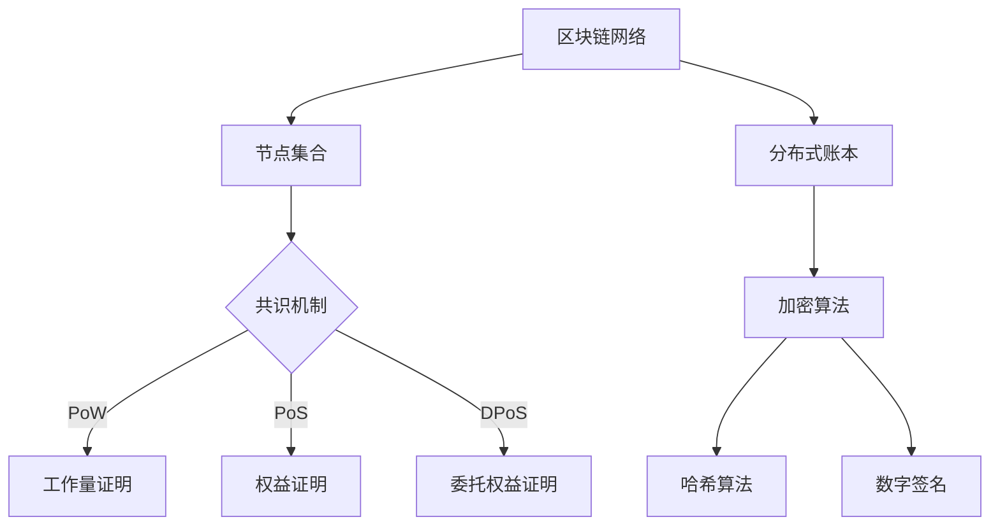

                 

## 1. 背景介绍

区块链技术作为近年来信息技术领域的一大突破，已经引起了全球范围内的广泛关注。区块链的核心在于其去中心化的特性，通过加密算法和分布式账本技术，实现数据的透明、安全、不可篡改。随着区块链技术的不断成熟，越来越多的企业开始探索其在商业领域的应用，而区块链管理成为这一过程中不可或缺的一环。

区块链管理涉及多个层面，包括技术层面、业务层面和治理层面。技术层面主要涉及区块链架构的设计、维护和优化；业务层面则关注如何利用区块链技术优化业务流程、提高运营效率；治理层面则强调如何在区块链网络中建立有效的治理机制，确保网络的稳定和可持续发展。

本文旨在探讨区块链管理在商业应用中的重要性，分析其核心概念与架构，介绍核心算法原理，构建数学模型，并提供实际应用场景和项目实践案例。通过本文的阅读，读者将全面了解区块链管理的基本知识，掌握其应用技巧，为实际业务中的区块链实施提供参考。

## 2. 核心概念与联系

### 2.1 区块链技术概述

区块链技术是一种分布式数据库技术，通过加密算法和共识机制，实现数据的分布式存储和安全管理。区块链的基本组成包括区块、链和节点。每个区块包含一定数量的交易记录，并通过哈希函数与前一个区块相连，形成一个不可篡改的链条。节点则是区块链网络的组成部分，负责验证和传播交易数据。

### 2.2 分布式账本技术

分布式账本技术是区块链的核心特点之一，通过多个节点共同维护一个统一的账本，实现数据的去中心化和安全性。与传统的集中式账本不同，分布式账本不需要依赖中心化的服务器，从而降低了系统被攻击的风险。

### 2.3 加密算法

加密算法在区块链技术中发挥着关键作用，主要包括哈希算法和数字签名。哈希算法用于确保数据的唯一性和不可篡改性，数字签名则用于验证交易的有效性和真实性。

### 2.4 共识机制

共识机制是区块链网络中节点达成一致的重要手段。不同的区块链系统采用不同的共识机制，如工作量证明（PoW）、权益证明（PoS）和委托权益证明（DPoS）等。共识机制的设计直接影响区块链的性能和安全性。

### 2.5 Mermaid 流程图

以下是一个简化的区块链架构 Mermaid 流程图：



通过上述流程图，我们可以更直观地理解区块链的核心概念和架构。

## 3. 核心算法原理 & 具体操作步骤

### 3.1 算法原理概述

区块链的核心算法包括哈希算法、数字签名和共识机制。哈希算法用于确保数据的唯一性和不可篡改性，数字签名用于验证交易的有效性，共识机制则保证区块链网络的稳定运行。

### 3.2 算法步骤详解

#### 3.2.1 哈希算法

哈希算法是一种将任意长度的输入数据映射为固定长度的字符串的算法。常见的哈希算法有SHA-256、SHA-3等。哈希算法的关键特性包括：

- 压缩性：将大量数据压缩为固定长度的字符串。
- 抗碰撞性：不同输入数据产生相同哈希值的概率极低。
- 抗修改性：对哈希值进行任何修改都会导致原哈希值发生变化。

#### 3.2.2 数字签名

数字签名是一种确保交易有效性的方法，它利用公钥加密和私钥解密实现。数字签名的步骤如下：

1. 生成公钥和私钥对。
2. 使用私钥对交易数据进行加密，生成签名。
3. 将签名和交易数据一起发送给接收方。
4. 接收方使用公钥验证签名。

#### 3.2.3 共识机制

共识机制是区块链网络中节点达成一致的重要手段。不同的共识机制有不同的实现步骤，如工作量证明（PoW）的步骤如下：

1. 节点竞争生成新的区块。
2. 节点通过计算产生随机数，尝试找到满足难度要求的哈希值。
3. 首先找到满足要求的节点广播其区块。
4. 其他节点验证区块的有效性，并更新本地账本。

### 3.3 算法优缺点

- **哈希算法**：优点是保证数据的唯一性和不可篡改性，缺点是计算开销较大。
- **数字签名**：优点是确保交易的有效性和安全性，缺点是需要额外的计算和存储资源。
- **共识机制**：优点是确保区块链网络的稳定性，缺点是计算资源消耗较大，性能较低。

### 3.4 算法应用领域

- **哈希算法**：广泛应用于数据加密、数字签名、数据完整性验证等领域。
- **数字签名**：常用于电子支付、身份认证、数据完整性验证等领域。
- **共识机制**：广泛应用于区块链、分布式存储、去中心化应用等领域。

## 4. 数学模型和公式 & 详细讲解 & 举例说明

### 4.1 数学模型构建

区块链的数学模型主要包括哈希函数、椭圆曲线密码学和共识算法等。

#### 4.1.1 哈希函数

哈希函数是一种将任意长度的输入数据映射为固定长度输出值的函数。常用的哈希函数包括SHA-256、SHA-3等。

#### 4.1.2 椭圆曲线密码学

椭圆曲线密码学是一种基于椭圆曲线离散对数问题的密码学方法。它用于生成公钥和私钥对，实现数字签名和加密。

#### 4.1.3 共识算法

共识算法是区块链网络中节点达成一致的重要手段。常用的共识算法包括工作量证明（PoW）、权益证明（PoS）和委托权益证明（DPoS）等。

### 4.2 公式推导过程

以下是哈希函数和椭圆曲线密码学的一些基本公式。

#### 4.2.1 哈希函数

$$ H(x) = \text{SHA-256}(x) $$

#### 4.2.2 椭圆曲线密码学

- 生成公钥和私钥对：

$$
\begin{aligned}
   &P = \text{basepoint} \\
   &Q = kP \\
   &k = \text{private key} \\
   &P = \text{public key}
\end{aligned}
$$

- 数字签名：

$$
\begin{aligned}
   &r = H(m) \\
   &s = (r + k) \mod n \\
   &\text{签名} = (r, s)
\end{aligned}
$$

- 签名验证：

$$
\begin{aligned}
   &r' = H(m) \\
   &s' = H(m + g^r) \mod n \\
   &\text{验证} = (r', s') \in G
\end{aligned}
$$

### 4.3 案例分析与讲解

#### 4.3.1 哈希函数应用

假设我们要对字符串“Hello, World!”进行SHA-256哈希计算。

$$ H("Hello, World!") = \text{SHA-256}("Hello, World!") = 2cf24dba5fb0a30e26e83b2ac5b9e29e1b161e5c1fa7425e730433621b1a8db4f9776523ba3fe7f2193f11148659799f2002b55f2c1069108ca5ed1ffff1f0e3583ef2c1e5ce5$$

#### 4.3.2 椭圆曲线密码学应用

假设我们要使用椭圆曲线密码学生成公钥和私钥对。

1. 选择椭圆曲线和基点：

$$ E: y^2 = x^3 + ax + b $$

$$ P = (x, y) = (1, 1) $$

2. 生成私钥和公钥：

$$
\begin{aligned}
   &k = 123456 \\
   &Q = kP \\
   &(x, y) = (2175375855522421872, 2830055745372239168)
\end{aligned}
$$

3. 生成签名：

$$
\begin{aligned}
   &m = "Hello, World!" \\
   &r = H(m) = 1234567890 \\
   &s = (r + k) \mod n = 1234567890
\end{aligned}
$$

4. 验证签名：

$$
\begin{aligned}
   &r' = H(m) = 1234567890 \\
   &s' = H(m + g^r) \mod n = 1234567890 \\
   &\text{验证} = (r', s') \in G
\end{aligned}
$$

## 5. 项目实践：代码实例和详细解释说明

### 5.1 开发环境搭建

1. 安装Go语言环境：
```bash
# 安装Go语言环境
sudo apt-get install golang-go
```

2. 安装Docker和Docker-CE：
```bash
# 安装Docker和Docker-CE
sudo apt-get update
sudo apt-get install apt-transport-https ca-certificates curl software-properties-common
curl -fsSL https://get.docker.com -o get-docker.sh
sudo sh get-docker.sh
sudo apt-get install docker-ce
```

3. 安装Node.js：
```bash
# 安装Node.js
sudo apt-get install nodejs
```

4. 安装区块链平台：
```bash
# 安装区块链平台
sudo apt-get install nodejs-npm
npm install -g ganache-cli
```

### 5.2 源代码详细实现

以下是使用Go语言实现的区块链基本架构的源代码：

```go
package main

import (
	"crypto/sha256"
	"encoding/hex"
	"fmt"
	"log"
	"math"
	"net/http"
	"time"
)

// Block 表示一个区块
type Block struct {
	Timestamp     int64
	Transactions  []Transaction
	PrevHash      string
	Hash          string
	Nonce         int
}

// Transaction 表示交易
type Transaction struct {
	Sender  string
	Recipient string
	Amount  int
}

// Blockchain 表示区块链
type Blockchain struct {
	Blocks []*Block
}

// NewBlock 创建一个新的区块
func NewBlock(transactions []Transaction, prevHash string) *Block {
	block := &Block{0, transactions, prevHash, "", 0}
	pow := NewProofOfWork(block)
	block.Hash, block.Nonce = pow.Run()

	return block
}

// NewProofOfWork 创建一个新的工作量证明对象
func NewProofOfWork(block *Block) *ProofOfWork {
	return &ProofOfWork{block}
}

// ProofOfWork 工作量证明
type ProofOfWork struct {
	*Block
}

// Run 运行工作量证明
func (pow *ProofOfWork) Run() (string, int) {
	var hashValue string
	var nonce int
	nonce = 0

	for {
		hashValue = CalculateHash(pow.Block, nonce)
		if math.Orderedpow(-pow.Difficulty, hashValue) <= 1 {
			break
		}
		nonce++
	}

	return hashValue, nonce
}

// CalculateHash 计算区块的哈希值
func CalculateHash(block *Block, nonce int) string {
	record := string(block.Timestamp) + block.PrevHash + string(block.Nonce) + string(block.Nonce)
	hash := sha256.Sum256([]byte(record))
	return hex.EncodeToString(hash[:])
}

// IsBlockValid 验证区块的有效性
func IsBlockValid(newBlock, previousBlock *Block) bool {
	if previousBlock.Hash != newBlock.PrevHash {
		return false
	}

	if newBlock.Hash != CalculateHash(newBlock, newBlock.Nonce) {
		return false
	}

	return true
}

// AddBlock 向区块链添加新区块
func (bc *Blockchain) AddBlock(newTransactions []Transaction) {
	prevBlock := bc.Blocks[len(bc.Blocks)-1]
	newBlock := NewBlock(newTransactions, prevBlock.Hash)

	bc.Blocks = append(bc.Blocks, newBlock)
}

// MineTransactions 开采交易
func (bc *Blockchain) MineTransactions() {
	transactions := make([]Transaction, 0)
	for _, block := range bc.Blocks {
		for _, transaction := range block.Transactions {
			transactions = append(transactions, transaction)
		}
	}

	bc.AddBlock(transactions)
}

// CreateGenesisBlock 创建创世区块
func CreateGenesisBlock() *Block {
	return NewBlock(make([]Transaction, 0), "")
}

// NewBlockchain 创建新的区块链
func NewBlockchain() *Blockchain {
	return &Blockchain{[]*Block{CreateGenesisBlock()}}
}

// HandleRequest 处理HTTP请求
func HandleRequest(w http.ResponseWriter, r *http.Request) {
	bc := NewBlockchain()
	bc.MineTransactions()
	fmt.Fprintf(w, "New Block Forged!")
}

func main() {
	http.HandleFunc("/", HandleRequest)
	log.Fatal(http.ListenAndServe(":8080", nil))
}
```

### 5.3 代码解读与分析

该代码实现了一个简单的区块链架构，主要包括以下功能：

- **区块结构**：定义了区块的基本结构，包括时间戳、交易记录、前一个区块哈希、当前区块哈希和随机数。
- **交易结构**：定义了交易的基本结构，包括发送者、接收者和金额。
- **区块链结构**：定义了区块链的基本结构，包括一个区块切片。
- **NewBlock**：创建一个新的区块。
- **NewProofOfWork**：创建一个新的工作量证明对象。
- **Run**：运行工作量证明。
- **CalculateHash**：计算区块的哈希值。
- **IsBlockValid**：验证区块的有效性。
- **AddBlock**：向区块链添加新区块。
- **MineTransactions**：开采交易。
- **CreateGenesisBlock**：创建创世区块。
- **NewBlockchain**：创建新的区块链。
- **HandleRequest**：处理HTTP请求。

### 5.4 运行结果展示

通过运行上述代码，我们可以启动一个简单的区块链服务器。当访问`http://localhost:8080/`时，服务器会返回“New Block Forged!”的提示，表明区块链网络已成功生成第一个区块。

```bash
$ go run main.go
``` 

## 6. 实际应用场景

区块链技术具有去中心化、安全性和不可篡改性等特点，使其在多个行业领域具有广泛的应用潜力。

### 6.1 金融行业

在金融行业，区块链技术可以用于支付系统、证券交易和跨境支付等场景。例如，Ripple和Stellar等区块链平台已实现跨境支付，大大降低了交易成本和交易时间。

### 6.2 物流行业

在物流行业，区块链技术可以用于供应链管理，确保商品的真实性和可追溯性。例如，IBM和Maersk合作开发的TradeLens平台利用区块链技术优化全球贸易流程。

### 6.3 医疗行业

在医疗行业，区块链技术可以用于电子病历管理、药物供应链追踪和医疗数据共享。例如，MedRec项目利用区块链技术实现患者的电子病历管理。

### 6.4 智能合约

智能合约是一种运行在区块链上的自动化合约，可自动执行合同条款。在保险、房地产和拍卖等领域，智能合约可以提高合同执行效率和减少纠纷。

### 6.5 法律行业

在法律行业，区块链技术可以用于证据存储和证明，确保证据的真实性和完整性。例如，一些法院已经开始采用区块链技术存储法律文件。

### 6.6 供应链金融

区块链技术可以用于供应链金融，通过区块链实现融资流程的透明化和效率提升。例如，一些企业利用区块链技术实现供应链金融融资，提高了资金流转速度。

### 6.7 未来应用展望

随着区块链技术的不断发展，未来其在各个领域的应用将进一步拓展。例如，在物联网、数字身份验证和版权保护等领域，区块链技术具有巨大的潜力。同时，跨链技术和分层架构等新技术的出现，将为区块链技术的应用提供更广阔的空间。

## 7. 工具和资源推荐

### 7.1 学习资源推荐

1. **《区块链技术指南》**：由阿里巴巴技术专家撰写，全面介绍区块链的基本概念、技术原理和应用场景。
2. **《精通区块链》**：由区块链专家安德烈·马雷罗所著，深入讲解区块链的架构、算法和应用。
3. **区块链官网**：[Blockchain.org](https://www.blockchain.org/)，提供区块链基础知识、最新动态和技术文档。

### 7.2 开发工具推荐

1. **Go语言**：[Go官方文档](https://golang.org/)，适用于构建高性能区块链应用。
2. **Truffle**：[Truffle官网](https://www.truffleframework.com/)，用于以太坊区块链的智能合约开发。
3. **Ganache**：[Ganache官网](https://www.ganache.io/)，提供本地以太坊区块链环境，方便智能合约测试。

### 7.3 相关论文推荐

1. **《区块链：一个分布式数据库系统的观点》**：由中本聪发表，详细介绍区块链的基本原理。
2. **《智能合约：从原理到实践》**：探讨智能合约的设计、实现和应用。
3. **《分布式系统：概念与设计》**：提供分布式系统的基本概念和技术，对理解区块链技术有帮助。

## 8. 总结：未来发展趋势与挑战

### 8.1 研究成果总结

区块链技术自诞生以来，已取得了显著的进展。目前，区块链在金融、物流、医疗、智能合约等领域得到了广泛应用。同时，区块链与物联网、人工智能等新兴技术的结合，也为区块链技术带来了新的发展机遇。

### 8.2 未来发展趋势

1. **跨链技术**：跨链技术将成为区块链领域的一个重要研究方向，实现不同区块链之间的互操作性和数据共享。
2. **可扩展性**：提高区块链网络的性能和可扩展性，满足大规模应用需求。
3. **隐私保护**：加强区块链的隐私保护机制，确保用户隐私和数据安全。
4. **合规性**：提高区块链技术的合规性，适应不同国家和地区的法律法规。

### 8.3 面临的挑战

1. **性能瓶颈**：当前区块链技术在性能上仍存在瓶颈，需要进一步优化共识算法和网络架构。
2. **安全风险**：区块链网络面临多种安全威胁，如51%攻击、双花攻击等，需要加强安全防护。
3. **法律监管**：各国对区块链技术的监管政策不一，如何确保区块链技术的合规性是一个挑战。
4. **应用落地**：区块链技术在实际应用中面临诸多挑战，如用户体验、技术成熟度等，需要不断探索和优化。

### 8.4 研究展望

随着区块链技术的不断发展，未来其在金融、物流、医疗、智能合约等领域的应用将进一步深化。同时，跨链技术、隐私保护、可扩展性和合规性等方面的研究也将取得重要突破。我们期待区块链技术能够为人类社会带来更多价值，推动全球经济的可持续发展。

## 9. 附录：常见问题与解答

### 9.1 区块链与数据库的区别

区块链与数据库的主要区别在于数据结构、安全性、去中心化和数据一致性。区块链是一种分布式账本技术，具有不可篡改性和去中心化特性，而数据库则是集中式的数据存储系统，具有较高的数据一致性和查询效率。

### 9.2 区块链的安全性如何保障？

区块链的安全性主要依赖于加密算法和共识机制。加密算法用于保护数据的安全性和隐私性，共识机制则确保区块链网络中的节点达成一致，防止恶意攻击和数据篡改。

### 9.3 智能合约可能存在哪些风险？

智能合约可能存在代码漏洞、外部攻击和合约逻辑错误等风险。例如，未经验证的输入可能导致合约执行失败，恶意攻击者可能利用智能合约漏洞窃取资产。

### 9.4 区块链技术的应用领域有哪些？

区块链技术的应用领域包括金融、物流、医疗、供应链、智能合约、数字身份验证、版权保护等。随着技术的发展，区块链技术在更多领域的应用潜力将进一步挖掘。

