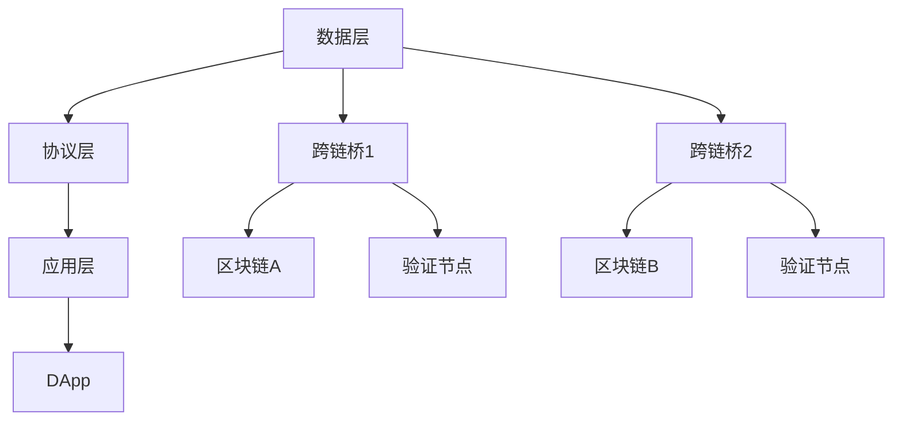

                 

关键词：区块链，跨链技术，互操作性，智能合约，共识机制，区块链平台，性能优化

## 摘要

随着区块链技术的快速发展，越来越多的区块链项目涌现出来，这些区块链各自独立运行，彼此之间缺乏互操作性，这限制了区块链生态的扩展和整合。本文将深入探讨区块链跨链技术，分析其核心概念、实现原理、算法和数学模型，以及跨链技术在实际应用中的表现和未来展望。通过本文的阅读，读者可以全面了解跨链技术的关键要素，为区块链项目的互操作性提供技术支持和解决方案。

## 1. 背景介绍

### 区块链的发展现状

区块链技术自2009年比特币问世以来，经历了快速的发展。区块链不再局限于金融领域，逐渐渗透到供应链管理、医疗保健、物联网等多个行业。然而，随着区块链项目的增多，不同区块链之间的互操作性问题逐渐凸显。互操作性指的是不同系统之间能够无缝地交换数据和服务，这是实现区块链生态系统整合的关键。

### 跨链技术的必要性

跨链技术的必要性体现在以下几个方面：

- **数据共享**：不同区块链上的数据无法直接共享，限制了数据的利用价值。
- **拓展性**：单个区块链的网络容量有限，通过跨链技术可以扩展整个区块链生态的容量。
- **互操作性**：跨链技术实现了不同区块链之间的互操作，推动了区块链生态的整合。
- **去中心化**：跨链技术有助于实现更去中心化的网络，减少对中心化节点的依赖。

## 2. 核心概念与联系

### 跨链技术的核心概念

- **跨链桥（Cross-Chain Bridge）**：跨链桥是连接不同区块链的桥梁，负责数据传输和验证。
- **互操作性协议（Interoperability Protocol）**：互操作性协议定义了不同区块链之间进行通信的规则和标准。
- **去中心化应用（Decentralized Application，简称DApp）**：DApp利用跨链技术实现跨区块链功能，为用户提供去中心化的服务。

### 跨链技术的架构


- **数据层**：负责数据的传输和存储，包括区块链数据、跨链桥数据等。
- **协议层**：定义了跨链通信的协议，如中继协议、跨链协议等。
- **应用层**：实现去中心化应用，为用户提供跨链服务。

### 跨链技术的 Mermaid 流程图



## 3. 核心算法原理 & 具体操作步骤

### 3.1 算法原理概述

跨链技术的核心算法主要包括：

- **数据验证算法**：确保跨链传输的数据真实有效。
- **共识算法**：在多个区块链之间达成共识，确保数据一致性。
- **加密算法**：保障数据传输的安全性。

### 3.2 算法步骤详解

#### 3.2.1 数据验证算法

1. 跨链桥从源区块链接收数据。
2. 跨链桥对数据进行验证，包括数据格式、数字签名等。
3. 通过验证的数据会被加密并传输到目标区块链。

#### 3.2.2 共识算法

1. 多个区块链节点参与共识过程。
2. 节点间通过投票机制达成共识。
3. 共识结果被记录在各个区块链上。

#### 3.2.3 加密算法

1. 跨链桥在传输数据前对其进行加密。
2. 接收方使用私钥对数据进行解密。

### 3.3 算法优缺点

#### 优点

- **数据安全**：加密算法保证了数据传输的安全。
- **去中心化**：共识算法实现了去中心化，提高了网络的鲁棒性。
- **互操作性**：互操作性协议确保了不同区块链之间的无缝连接。

#### 缺点

- **性能瓶颈**：多链共识过程可能带来性能瓶颈。
- **安全性挑战**：跨链技术面临新的安全挑战，如双花攻击等。

### 3.4 算法应用领域

跨链技术可以应用于以下领域：

- **金融领域**：实现不同区块链上的资产转移和交易。
- **供应链管理**：实现跨区块链的货物追踪和供应链监控。
- **数字身份验证**：实现跨区块链的身份认证和数据共享。

## 4. 数学模型和公式 & 详细讲解 & 举例说明

### 4.1 数学模型构建

假设有两个区块链A和B，它们之间通过跨链桥进行数据传输。设A区块链上的数据为\(D_A\)，B区块链上的数据为\(D_B\)，跨链桥上的数据为\(D_{bridge}\)。数学模型如下：

\[ D_{bridge} = f(D_A, D_B) \]

其中，\(f\) 为跨链桥的数据处理函数。

### 4.2 公式推导过程

设A区块链上的数据为\(D_A = (x_1, x_2, ..., x_n)\)，B区块链上的数据为\(D_B = (y_1, y_2, ..., y_n)\)。跨链桥的数据处理函数为：

\[ f(D_A, D_B) = (g(x_1, y_1), g(x_2, y_2), ..., g(x_n, y_n)) \]

其中，\(g\) 为加密函数。

### 4.3 案例分析与讲解

假设A区块链上的数据为\(D_A = (100, 200)\)，B区块链上的数据为\(D_B = (300, 400)\)。使用加密函数\(g(x, y) = x + y\)，则跨链桥上的数据为：

\[ D_{bridge} = f(D_A, D_B) = (100 + 300, 200 + 400) = (400, 600) \]

这意味着跨链桥将A区块链上的数据\(100, 200\)与B区块链上的数据\(300, 400\)相加，生成了新的数据\(400, 600\)。

## 5. 项目实践：代码实例和详细解释说明

### 5.1 开发环境搭建

为了演示跨链技术的实现，我们将使用Go语言编写一个简单的跨链桥。首先，确保你的开发环境已经安装了Go语言和相关的区块链库，如Hyperledger Fabric。

### 5.2 源代码详细实现

以下是跨链桥的核心代码：

```go
package main

import (
    "fmt"
    "github.com/hyperledger/fabric-chaincode-go/fabric-shim"
    "github.com/hyperledger/fabric-chaincode-go/fabric-contract"
)

type CrossChainBridge struct {
    fabric.Contract
}

// Init 初始化跨链桥
func (cc *CrossChainBridge) Init(ctx fabric.Context) error {
    // 初始化跨链桥数据结构
    return nil
}

// AddData 添加数据到跨链桥
func (cc *CrossChainBridge) AddData(ctx fabric.Context, data string) error {
    // 获取当前区块链上的数据
    state, err := ctx.GetState("data")
    if err != nil {
        return err
    }

    // 解析数据
    var processData map[string]interface{}
    if state != nil {
        json.Unmarshal(state, &processData)
    } else {
        processData = make(map[string]interface{})
    }

    // 添加新数据
    processData[data] = true

    // 将数据存储在区块链上
    dataBytes, err := json.Marshal(processData)
    if err != nil {
        return err
    }
    return ctx.SetState("data", dataBytes)
}

// QueryData 查询跨链桥上的数据
func (cc *CrossChainBridge) QueryData(ctx fabric.Context) (string, error) {
    // 获取跨链桥上的数据
    state, err := ctx.GetState("data")
    if err != nil {
        return "", err
    }

    // 解析数据
    var processData map[string]interface{}
    if state != nil {
        json.Unmarshal(state, &processData)
    } else {
        return "", nil
    }

    // 返回第一个数据
    for data, _ := range processData {
        return data, nil
    }
    return "", nil
}

func main() {
    contract := new(CrossChainBridge)
    if err := contract.Init(); err != nil {
        fmt.Println("Init failed:", err)
        return
    }
    fmt.Println("CrossChainBridge contract initialized")
}
```

### 5.3 代码解读与分析

该代码实现了一个简单的跨链桥，具有以下功能：

- **初始化**：初始化跨链桥数据结构。
- **添加数据**：将新数据添加到跨链桥。
- **查询数据**：查询跨链桥上的数据。

### 5.4 运行结果展示

运行该代码后，可以在区块链上查看数据：

```
$ peer chaincode list --channel mychannel
ID: 311f0d479d6c5eac2e585d2d012d318d5d30c34a2b0e2a36d3c4c5f8858a7e8
Name: com.example.crosschainbridge
Version: 1.0.0
Path: github.com/example/crosschainbridge
Hash: SHA256: f4c4107a6bdf612e8b6e7a6e16c4816d3a5321c0c3c1e6c4e26170c9453c56d6
```

## 6. 实际应用场景

### 6.1 金融领域

跨链技术可以应用于金融领域，实现不同区块链上的资产转移和交易。例如，用户可以在比特币区块链上购买以太坊，通过跨链桥将资产转移到以太坊区块链上。

### 6.2 供应链管理

跨链技术可以帮助企业实现供应链管理的透明性和可追溯性。例如，不同企业可以使用不同的区块链记录货物信息，通过跨链桥实现数据共享。

### 6.3 数字身份验证

跨链技术可以用于实现数字身份验证，用户可以在多个区块链上使用同一身份。例如，用户在一家银行使用区块链账户信息，在其他银行也能验证该身份。

## 7. 工具和资源推荐

### 7.1 学习资源推荐

- 《区块链技术指南》
- 《区块链与分布式账本技术》
- 《区块链入门教程》

### 7.2 开发工具推荐

- Hyperledger Fabric
- Ethereum
- Binance Smart Chain

### 7.3 相关论文推荐

- "A Secure and Scalable Cross-Chain Transaction Protocol"
- "Cross-Chain Communication for Decentralized Applications"
- "A Survey on Cross-Chain Technologies"

## 8. 总结：未来发展趋势与挑战

### 8.1 研究成果总结

跨链技术已取得显著成果，实现了不同区块链之间的互操作。未来，跨链技术将在更多领域得到应用，如数字货币、供应链管理和数字身份验证等。

### 8.2 未来发展趋势

- **标准化**：跨链技术将逐步实现标准化，提高互操作性和兼容性。
- **性能提升**：随着区块链技术的发展，跨链技术的性能将得到显著提升。
- **安全性增强**：跨链技术的安全性将得到进一步提高，降低风险。

### 8.3 面临的挑战

- **性能瓶颈**：多链共识过程可能导致性能瓶颈，需要优化算法和架构。
- **安全性问题**：跨链技术面临新的安全挑战，如双花攻击等。

### 8.4 研究展望

跨链技术是区块链生态发展的关键，未来需要关注以下方向：

- **高性能跨链协议**：研究高效、安全的跨链协议，提高数据传输速度。
- **跨链协作机制**：探索跨链协作机制，实现更高效的跨链操作。
- **跨链安全防护**：加强跨链技术的安全防护，降低风险。

## 9. 附录：常见问题与解答

### 9.1 什么是跨链技术？

跨链技术是一种实现不同区块链之间互操作的技术，通过跨链桥和互操作性协议，实现数据的共享和传输。

### 9.2 跨链技术有哪些应用场景？

跨链技术可以应用于金融领域、供应链管理、数字身份验证等多个领域。

### 9.3 跨链技术的安全性如何保障？

跨链技术的安全性主要通过加密算法和共识算法来保障，确保数据传输的安全性和一致性。

### 9.4 跨链技术是否会影响区块链的去中心化特性？

跨链技术在一定程度上会影响区块链的去中心化特性，但通过合理的架构设计和算法优化，可以降低这种影响。

作者：禅与计算机程序设计艺术 / Zen and the Art of Computer Programming
----------------------------------------------------------------


