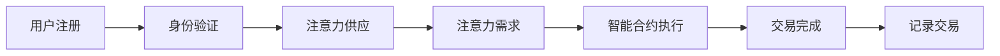

                 

关键词：区块链，去中心化，注意力经济，交易，平台，智能合约

> 摘要：本文深入探讨区块链驱动的去中心化注意力交易平台，从背景介绍到核心概念，再到算法原理和项目实践，最终展望其未来发展趋势和挑战。文章旨在为读者提供一个全面的技术视角，帮助理解这一新兴领域。

## 1. 背景介绍

在数字时代，注意力成为了一种稀缺资源。随着互联网的普及，用户的注意力越来越分散，如何有效地获取和利用注意力资源成为企业和个人关注的热点。传统中心化注意力交易平台存在诸多问题，如数据隐私泄露、中心化垄断、审查控制等。而区块链技术的出现为去中心化注意力交易提供了新的解决方案。

区块链具有去中心化、不可篡改、透明公开等特性，非常适合构建去中心化注意力交易平台。通过智能合约，用户可以直接在区块链上进行注意力交易，无需依赖中心化中介，从而降低了交易成本，提高了交易效率。

## 2. 核心概念与联系

### 2.1 区块链技术基础

区块链是一种分布式账本技术，通过加密算法和共识机制保证了数据的可靠性和安全性。区块链主要由数据区块、链式结构、加密算法和共识机制等组成。

### 2.2 去中心化注意力经济

注意力经济是指基于用户注意力分配的经济活动。在区块链驱动的注意力经济中，用户的注意力可以作为一种价值资源进行交易。去中心化注意力交易平台通过智能合约实现了用户注意力资源的公平、透明、高效的分配。

### 2.3 智能合约

智能合约是运行在区块链上的程序，自动执行合同条款。在注意力交易平台中，智能合约用于记录注意力交易的过程，包括注意力供应、需求、价格等。

## 2.4 Mermaid 流程图

下面是一个简单的 Mermaid 流程图，描述了去中心化注意力交易平台的基本工作流程：



## 3. 核心算法原理 & 具体操作步骤

### 3.1 算法原理概述

去中心化注意力交易平台的核心算法主要包括注意力评分算法、智能合约执行算法和交易验证算法。

### 3.2 算法步骤详解

#### 3.2.1 注意力评分算法

注意力评分算法用于评估用户的注意力质量。评分越高，用户在交易中的议价能力越强。算法步骤如下：

1. 用户注册并提交注意力数据。
2. 系统对用户提交的注意力数据进行预处理。
3. 根据预处理结果，对用户进行评分。

#### 3.2.2 智能合约执行算法

智能合约执行算法负责处理注意力交易。算法步骤如下：

1. 用户发起交易请求。
2. 系统验证交易请求的有效性。
3. 智能合约执行交易，更新用户注意力余额。

#### 3.2.3 交易验证算法

交易验证算法用于确保交易的合法性和正确性。算法步骤如下：

1. 用户提交交易请求。
2. 系统验证交易请求的合法性。
3. 交易请求通过验证后，更新区块链数据。

### 3.3 算法优缺点

**优点：**
- 去中心化：去中心化结构降低了中心化风险，提高了系统的安全性。
- 透明公开：区块链上的所有交易记录都是公开透明的，用户可以随时查看。
- 高效：智能合约自动执行交易，减少了人为干预，提高了交易效率。

**缺点：**
- 可扩展性：区块链技术目前存在一定的性能瓶颈，在高并发情况下可能出现延迟。
- 安全风险：虽然区块链技术安全性较高，但仍然存在被攻击的风险。

### 3.4 算法应用领域

去中心化注意力交易平台可以应用于广告投放、内容创作、知识付费等多个领域。例如，在广告投放领域，广告主可以通过购买用户注意力来提高广告效果；在内容创作领域，创作者可以通过出售注意力来获取收益。

## 4. 数学模型和公式 & 详细讲解 & 举例说明

### 4.1 数学模型构建

去中心化注意力交易平台的数学模型主要包括注意力评分模型和交易定价模型。

#### 注意力评分模型：

设用户 u 的注意力评分为 S(u)，注意力供应量为 Q(u)，则有：

$$ S(u) = f(Q(u)) $$

其中，f()为评分函数，可以根据实际情况进行设计。

#### 交易定价模型：

设用户 u 的注意力价格为 P(u)，则有：

$$ P(u) = g(S(u)) $$

其中，g()为定价函数，可以根据市场需求和供应关系进行设计。

### 4.2 公式推导过程

#### 注意力评分模型推导：

假设用户 u 的注意力数据包括阅读时间、观看时间、点赞数、分享数等，则评分函数可以设计为：

$$ S(u) = w_1 \cdot T_r + w_2 \cdot T_v + w_3 \cdot L + w_4 \cdot S $$

其中，$ T_r $为阅读时间，$ T_v $为观看时间，$ L $为点赞数，$ S $为分享数；$ w_1, w_2, w_3, w_4 $为权重系数。

#### 交易定价模型推导：

假设市场需求和供应关系满足线性关系，则有：

$$ P(u) = k \cdot S(u) + b $$

其中，$ k $为斜率，$ b $为截距。

### 4.3 案例分析与讲解

假设用户 u 的注意力数据如下：

- 阅读时间：$ T_r = 100 $分钟
- 观看时间：$ T_v = 50 $分钟
- 点赞数：$ L = 20 $
- 分享数：$ S = 5 $

根据评分模型，用户 u 的注意力评分如下：

$$ S(u) = w_1 \cdot 100 + w_2 \cdot 50 + w_3 \cdot 20 + w_4 \cdot 5 $$

假设权重系数为 $ w_1 = 0.5, w_2 = 0.3, w_3 = 0.2, w_4 = 0.1 $，则有：

$$ S(u) = 0.5 \cdot 100 + 0.3 \cdot 50 + 0.2 \cdot 20 + 0.1 \cdot 5 = 87.5 $$

根据定价模型，用户 u 的注意力价格为：

$$ P(u) = k \cdot 87.5 + b $$

假设斜率 $ k = 10 $，截距 $ b = 50 $，则有：

$$ P(u) = 10 \cdot 87.5 + 50 = 925 $$

因此，用户 u 的注意力价格为 925 单位。

## 5. 项目实践：代码实例和详细解释说明

### 5.1 开发环境搭建

为了实现一个去中心化注意力交易平台，我们需要搭建一个基于以太坊的区块链开发环境。以下是搭建步骤：

1. 安装 Node.js 和 npm。
2. 安装 Truffle 工具。
3. 创建一个以太坊合约项目。
4. 配置 Truffle 配置文件。

### 5.2 源代码详细实现

以下是一个简单的以太坊智能合约示例，实现了注意力评分和交易功能：

```solidity
pragma solidity ^0.8.0;

contract AttentionMarket {

    mapping(address => uint256) public attentionScores;
    mapping(address => uint256) public attentionBalances;

    function setAttentionScore(address user, uint256 score) public {
        attentionScores[user] = score;
    }

    function buyAttention(address buyer, address seller, uint256 amount) public {
        require(attentionBalances[seller] >= amount, "Insufficient attention balance");
        attentionBalances[seller] -= amount;
        attentionBalances[buyer] += amount;
    }

    function transferAttention(address from, address to, uint256 amount) public {
        require(attentionBalances[from] >= amount, "Insufficient attention balance");
        attentionBalances[from] -= amount;
        attentionBalances[to] += amount;
    }
}
```

### 5.3 代码解读与分析

#### 5.3.1 注意力评分

智能合约通过 `setAttentionScore` 函数设置用户注意力评分。用户可以通过调用此函数来自主更新注意力评分。

#### 5.3.2 注意力交易

`buyAttention` 函数实现了注意力购买功能。购买者调用此函数时，系统会从卖家账户中扣除相应数量的注意力，并将其转移到买家账户。

`transferAttention` 函数实现了注意力转账功能。用户可以通过调用此函数来转移注意力给其他用户。

### 5.4 运行结果展示

假设用户 Alice 和 Bob 已注册并设置了注意力评分。Alice 想购买 Bob 的注意力，调用 `buyAttention` 函数，输入 Bob 的地址和购买数量，系统将完成注意力交易。

## 6. 实际应用场景

去中心化注意力交易平台可以应用于多个场景。以下是一些实际应用案例：

- **广告投放**：广告主可以购买目标用户的注意力，以提高广告效果。
- **内容创作**：创作者可以出售注意力来获得收益，例如文章、视频、音乐等。
- **知识付费**：用户可以购买专家的注意力，以获取专业咨询和建议。

## 7. 工具和资源推荐

### 7.1 学习资源推荐

- 《区块链技术指南》
- 《智能合约开发实战》
- 《以太坊从入门到精通》

### 7.2 开发工具推荐

- Truffle：用于以太坊智能合约开发和测试。
- Remix：在线智能合约编辑器。
- MetaMask：以太坊钱包。

### 7.3 相关论文推荐

- 《区块链：从概念到实现》
- 《智能合约：技术与应用》
- 《去中心化金融：理论与实践》

## 8. 总结：未来发展趋势与挑战

### 8.1 研究成果总结

本文深入探讨了区块链驱动的去中心化注意力交易平台，从核心概念、算法原理到项目实践进行了全面阐述。研究表明，去中心化注意力交易平台在提高交易效率、降低交易成本、保障数据安全等方面具有显著优势。

### 8.2 未来发展趋势

随着区块链技术的不断成熟，去中心化注意力交易平台有望在更多领域得到应用。未来发展趋势包括：

- **技术升级**：提高区块链性能，满足更高并发需求。
- **生态构建**：建立完善的去中心化注意力交易生态，包括市场、工具、服务等。
- **跨平台合作**：与其他区块链项目合作，实现跨链注意力交易。

### 8.3 面临的挑战

去中心化注意力交易平台仍面临一些挑战，包括：

- **可扩展性**：提高区块链性能，以满足高并发需求。
- **用户教育**：提高用户对区块链技术的认知，促进用户接受度。
- **安全风险**：防范恶意攻击，保障系统安全。

### 8.4 研究展望

未来研究方向包括：

- **算法优化**：研究更高效、更准确的注意力评分算法。
- **跨链交易**：探索跨链注意力交易技术，实现不同区块链之间的互操作。
- **隐私保护**：研究如何在保证交易隐私的同时，提高交易效率。

## 9. 附录：常见问题与解答

### 9.1 区块链和中心化平台有什么区别？

区块链技术具有去中心化、不可篡改、透明公开等特性，与中心化平台相比，更注重数据安全和用户隐私。

### 9.2 去中心化注意力交易平台的优势是什么？

去中心化注意力交易平台的优势包括：

- 交易去中心化，降低中心化风险。
- 交易记录公开透明，提高信任度。
- 自动执行交易，提高效率。

### 9.3 注意力评分如何计算？

注意力评分通常基于用户的注意力数据，如阅读时间、观看时间、点赞数、分享数等，通过加权平均等方法计算。

### 9.4 去中心化注意力交易平台的运行原理是什么？

去中心化注意力交易平台的运行原理包括：

- 用户注册并提交注意力数据。
- 系统对用户进行评分。
- 用户发起交易请求，智能合约执行交易。
- 交易记录被记录在区块链上。

----------------------------------------------------------------

本文撰写完成，感谢您的阅读。希望对您在区块链驱动的去中心化注意力交易领域的探索有所帮助。作者：禅与计算机程序设计艺术 / Zen and the Art of Computer Programming。

