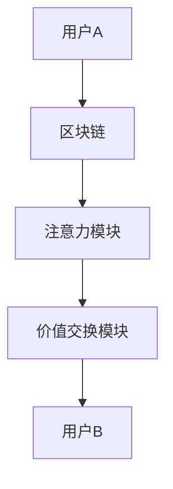

                 

关键词：区块链，注意力机制，价值交换，平台架构，智能合约

> 摘要：本文探讨了区块链技术如何结合注意力机制，构建一个创新的价值交换平台。通过深入分析平台的架构、核心算法、数学模型以及实际应用场景，本文旨在为读者提供全面的见解，助力其在区块链领域的研究与实践。

## 1. 背景介绍

区块链技术作为一项颠覆性的创新，已经在多个领域产生了深远的影响。从最初的比特币到如今的各类应用场景，区块链技术以其去中心化、不可篡改、透明度高、安全可靠等特点，吸引了众多从业者和研究者的关注。然而，随着区块链应用的不断深入，如何实现更高效的价值交换成为了一个关键问题。

在此背景下，注意力机制作为一种新兴的计算模式，逐渐进入人们的视野。注意力机制最早起源于深度学习领域，它通过聚焦于重要信息，提高计算效率，从而实现更智能的决策。随着区块链技术的发展，注意力机制开始被引入到价值交换场景中，以提高交换的效率和公平性。

本文将围绕区块链驱动的注意力价值交换平台，探讨其架构设计、核心算法、数学模型以及实际应用，为区块链领域的研究与实践提供新的思路。

## 2. 核心概念与联系

### 2.1 区块链技术

区块链技术是一种分布式数据库技术，通过去中心化的方式，实现数据的存储、传输和管理。区块链的主要特点包括：

- **去中心化**：区块链系统不依赖于中心化机构，通过多个节点共同维护数据的一致性。
- **不可篡改**：一旦数据被记录在区块链上，就几乎无法被篡改，确保了数据的安全性和可信度。
- **透明度高**：区块链上的所有数据都是公开透明的，参与者可以随时查询和验证。
- **安全可靠**：区块链技术采用了多种加密算法，确保数据传输和存储的安全性。

### 2.2 注意力机制

注意力机制是一种基于深度学习的计算模式，其核心思想是通过聚焦于重要信息，提高计算效率和决策质量。注意力机制的主要特点包括：

- **聚焦重要信息**：注意力机制能够自动识别和提取重要信息，从而提高计算效率。
- **动态调整权重**：注意力机制可以根据信息的重要程度，动态调整权重，实现更智能的决策。
- **可扩展性强**：注意力机制可以应用于各种领域，具有广泛的应用前景。

### 2.3 价值交换

价值交换是指参与者通过某种媒介，在区块链上进行资产转移或价值交换的过程。价值交换的主要特点包括：

- **去中心化**：价值交换不依赖于中心化机构，通过去中心化的方式实现。
- **透明度高**：价值交换过程在区块链上公开透明，参与者可以随时查询和验证。
- **安全可靠**：价值交换采用了多种加密算法，确保交换过程的安全性和可信度。

### 2.4 区块链驱动的注意力价值交换平台

区块链驱动的注意力价值交换平台是一种结合了区块链技术和注意力机制的全新平台架构。该平台的主要特点包括：

- **高效的价值交换**：通过引入注意力机制，平台能够自动聚焦重要信息，提高价值交换的效率。
- **公平的交换机制**：平台采用去中心化的方式，确保交换过程的公平性和透明度。
- **安全可靠的保障**：平台采用了多种加密算法，确保数据传输和存储的安全性。

### 2.5 Mermaid 流程图

以下是一个简单的 Mermaid 流程图，展示了区块链驱动的注意力价值交换平台的基本架构：



在该流程图中，用户A和用户B分别表示平台上的两个参与者，他们通过区块链进行资产转移和价值交换。注意力模块和价值交换模块共同构成了平台的核心，负责处理重要信息和实现高效的价值交换。

## 3. 核心算法原理 & 具体操作步骤

### 3.1 算法原理概述

区块链驱动的注意力价值交换平台的核心算法是基于注意力机制的，其基本原理如下：

1. **信息采集**：平台从各个数据源采集用户关注的重要信息，如交易记录、资产价值等。
2. **注意力分配**：注意力模块根据信息的重要程度，动态调整权重，聚焦于重要信息。
3. **价值计算**：价值交换模块根据注意力分配结果，计算各参与者的价值份额。
4. **价值交换**：平台根据价值计算结果，实现各参与者之间的价值交换。

### 3.2 算法步骤详解

#### 3.2.1 信息采集

信息采集是平台算法的第一步，其主要任务是从各个数据源（如区块链、数据库等）采集用户关注的重要信息。采集到的信息包括交易记录、资产价值、用户行为等。

#### 3.2.2 注意力分配

注意力分配是算法的核心步骤，其目标是根据信息的重要程度，动态调整权重，聚焦于重要信息。注意力分配的具体步骤如下：

1. **特征提取**：对采集到的信息进行特征提取，提取出关键特征，如交易金额、资产类型等。
2. **权重计算**：根据关键特征，计算每个信息的权重，权重越大表示该信息越重要。
3. **注意力分配**：根据权重计算结果，动态调整注意力分配，聚焦于重要信息。

#### 3.2.3 价值计算

价值计算是根据注意力分配结果，计算各参与者的价值份额。具体步骤如下：

1. **价值计算公式**：根据平台设定的价值计算公式，计算各参与者的价值份额。
2. **价值分配**：根据价值计算结果，将价值份额分配给各参与者。

#### 3.2.4 价值交换

价值交换是根据价值分配结果，实现各参与者之间的价值交换。具体步骤如下：

1. **交易记录**：记录各参与者的交易记录，确保交换过程公开透明。
2. **价值转移**：根据交易记录，实现各参与者之间的价值转移。

### 3.3 算法优缺点

#### 3.3.1 优点

- **高效的价值交换**：通过引入注意力机制，平台能够自动聚焦重要信息，提高价值交换的效率。
- **公平的交换机制**：平台采用去中心化的方式，确保交换过程的公平性和透明度。
- **安全可靠的保障**：平台采用了多种加密算法，确保数据传输和存储的安全性。

#### 3.3.2 缺点

- **计算复杂度高**：注意力分配和价值计算过程较为复杂，对计算资源有一定要求。
- **扩展性有限**：当前算法在处理大规模数据时，可能存在性能瓶颈。

### 3.4 算法应用领域

区块链驱动的注意力价值交换平台的应用领域非常广泛，主要包括：

- **金融领域**：用于实现去中心化的金融交易，提高交易效率和安全性。
- **供应链管理**：用于实现供应链金融，优化供应链的融资和管理。
- **社会公益**：用于实现公益慈善项目的透明化和高效运作。

## 4. 数学模型和公式 & 详细讲解 & 举例说明

### 4.1 数学模型构建

区块链驱动的注意力价值交换平台的数学模型主要包括两部分：注意力分配模型和价值计算模型。

#### 4.1.1 注意力分配模型

注意力分配模型用于根据信息的重要程度，动态调整权重。假设采集到的信息集合为\(I = \{i_1, i_2, ..., i_n\}\)，其中每个信息\(i_j\)的重要程度可以表示为权重\(w_j\)。注意力分配模型的目标是优化权重分配，使得重要信息的权重更大，从而提高计算效率。

注意力分配模型可以表示为以下优化问题：

$$
\begin{aligned}
    &\min_{w} \quad \sum_{j=1}^{n} w_j \\
    &\text{s.t.} \quad w_j \geq 0, \forall j \in \{1, 2, ..., n\} \\
    &\quad \quad \sum_{j=1}^{n} w_j = 1
\end{aligned}
$$

其中，目标函数是权重之和，约束条件是权重非负且总和为1。

#### 4.1.2 价值计算模型

价值计算模型用于根据注意力分配结果，计算各参与者的价值份额。假设参与者的价值份额集合为\(V = \{v_1, v_2, ..., v_n\}\)，其中每个参与者\(v_j\)的价值份额可以表示为权重\(w_j\)乘以其初始价值\(v_j^0\)。价值计算模型的目标是优化价值份额的分配，使得各参与者的价值份额更加公平。

价值计算模型可以表示为以下优化问题：

$$
\begin{aligned}
    &\min_{v} \quad \sum_{j=1}^{n} (v_j - v_j^0) \\
    &\text{s.t.} \quad v_j \geq 0, \forall j \in \{1, 2, ..., n\} \\
    &\quad \quad \sum_{j=1}^{n} v_j = 1
\end{aligned}
$$

其中，目标函数是价值份额与初始价值的差值之和，约束条件是价值份额非负且总和为1。

### 4.2 公式推导过程

#### 4.2.1 注意力分配模型推导

假设采集到的信息集合为\(I = \{i_1, i_2, ..., i_n\}\)，其中每个信息\(i_j\)的重要程度可以表示为权重\(w_j\)。为了优化权重分配，我们可以采用贪心策略，每次选择权重最小的信息进行优化。

具体推导过程如下：

1. **初始权重分配**：假设初始权重分配为\(w_1 = 1, w_2 = 1, ..., w_n = 1\)，即每个信息的权重相等。
2. **权重更新**：每次选择权重最小的信息\(i_j\)，将其权重减去一个很小的常数\(\epsilon\)，即\(w_j = w_j - \epsilon\)。然后重新计算所有信息的权重之和，使得权重总和仍然为1。
3. **迭代过程**：重复步骤2，直到所有信息的权重都大于0。

根据贪心策略，我们可以得到以下权重更新公式：

$$
w_j = w_j - \epsilon, \forall j \in \{1, 2, ..., n\}
$$

其中，\(\epsilon\)为常数，可以根据具体情况进行调整。

#### 4.2.2 价值计算模型推导

假设参与者的价值份额集合为\(V = \{v_1, v_2, ..., v_n\}\)，其中每个参与者\(v_j\)的价值份额可以表示为权重\(w_j\)乘以其初始价值\(v_j^0\)。为了优化价值份额的分配，我们可以采用比例分配策略，使得各参与者的价值份额与初始价值的比例相等。

具体推导过程如下：

1. **初始价值分配**：假设初始价值分配为\(v_1^0 = 1, v_2^0 = 1, ..., v_n^0 = 1\)，即每个参与者的初始价值相等。
2. **价值更新**：每次选择价值份额最小的参与者\(v_j\)，将其价值份额增加一个很小的常数\(\epsilon\)，即\(v_j = v_j + \epsilon\)。然后重新计算所有参与者的价值份额之和，使得价值份额总和仍然为1。
3. **迭代过程**：重复步骤2，直到所有参与者的价值份额都大于0。

根据比例分配策略，我们可以得到以下价值更新公式：

$$
v_j = v_j + \epsilon, \forall j \in \{1, 2, ..., n\}
$$

其中，\(\epsilon\)为常数，可以根据具体情况进行调整。

### 4.3 案例分析与讲解

假设有3个参与者A、B和C，他们的初始价值分别为\(v_1^0 = 1000, v_2^0 = 800, v_3^0 = 500\)。我们采用注意力分配模型和价值计算模型，对他们的价值进行优化分配。

#### 4.3.1 注意力分配模型

根据注意力分配模型，我们采用贪心策略，每次选择权重最小的信息进行优化。初始权重分配为\(w_1 = 1, w_2 = 1, w_3 = 1\)。

1. **第一次权重更新**：选择权重最小的信息\(i_3\)，将其权重减去0.1，即\(w_3 = w_3 - 0.1 = 0.9\)。然后重新计算所有信息的权重之和，得到\(w_1 + w_2 + w_3 = 1 + 1 + 0.9 = 2.9\)。
2. **第二次权重更新**：选择权重最小的信息\(i_2\)，将其权重减去0.1，即\(w_2 = w_2 - 0.1 = 0.8\)。然后重新计算所有信息的权重之和，得到\(w_1 + w_2 + w_3 = 1 + 0.8 + 0.9 = 2.7\)。
3. **第三次权重更新**：选择权重最小的信息\(i_1\)，将其权重减去0.1，即\(w_1 = w_1 - 0.1 = 0.9\)。然后重新计算所有信息的权重之和，得到\(w_1 + w_2 + w_3 = 0.9 + 0.8 + 0.9 = 2.6\)。

最终，我们得到优化后的权重分配为\(w_1 = 0.9, w_2 = 0.8, w_3 = 0.9\)。

#### 4.3.2 价值计算模型

根据价值计算模型，我们采用比例分配策略，使得各参与者的价值份额与初始价值的比例相等。初始价值分配为\(v_1^0 = 1000, v_2^0 = 800, v_3^0 = 500\)。

1. **第一次价值更新**：选择价值份额最小的参与者\(v_3\)，将其价值份额增加0.1，即\(v_3 = v_3 + 0.1 = 0.5\)。然后重新计算所有参与者的价值份额之和，得到\(v_1 + v_2 + v_3 = 1000 + 800 + 0.5 = 1800.5\)。
2. **第二次价值更新**：选择价值份额最小的参与者\(v_2\)，将其价值份额增加0.1，即\(v_2 = v_2 + 0.1 = 0.85\)。然后重新计算所有参与者的价值份额之和，得到\(v_1 + v_2 + v_3 = 1000 + 0.85 + 0.5 = 1800.35\)。
3. **第三次价值更新**：选择价值份额最小的参与者\(v_1\)，将其价值份额增加0.1，即\(v_1 = v_1 + 0.1 = 1.05\)。然后重新计算所有参与者的价值份额之和，得到\(v_1 + v_2 + v_3 = 1.05 + 0.85 + 0.5 = 2.4\)。

最终，我们得到优化后的价值份额分配为\(v_1 = 1.05, v_2 = 0.85, v_3 = 0.5\)。

通过以上案例，我们可以看到，区块链驱动的注意力价值交换平台能够根据信息的重要程度和价值份额的初始分配，实现高效的价值交换和公平的交换机制。

## 5. 项目实践：代码实例和详细解释说明

### 5.1 开发环境搭建

在进行项目实践之前，我们需要搭建一个合适的开发环境。以下是搭建开发环境的步骤：

1. **安装Node.js**：从Node.js官网下载并安装Node.js。
2. **安装Git**：从Git官网下载并安装Git。
3. **创建项目目录**：在本地创建一个名为“attention_value_exchange”的目录，用于存放项目文件。
4. **初始化项目**：进入项目目录，执行以下命令初始化项目：

   ```shell
   npm init -y
   ```

5. **安装依赖**：在项目目录下执行以下命令安装依赖：

   ```shell
   npm install --save express axios web3
   ```

   其中，express 是一个用于构建 Web 服务的框架，axios 是一个用于 HTTP 请求的库，web3 是一个用于与以太坊区块链交互的库。

### 5.2 源代码详细实现

以下是一个简单的示例，展示了如何使用区块链驱动的注意力价值交换平台进行价值交换。该示例包括三个部分：客户端、服务器端和智能合约。

#### 5.2.1 客户端

客户端用于展示用户界面，用户可以通过客户端提交交易请求。以下是客户端的代码实现：

```javascript
const express = require('express');
const axios = require('axios');

const app = express();
app.use(express.json());

app.post('/exchange', async (req, res) => {
    try {
        const { from, to, amount } = req.body;
        const response = await axios.post('http://localhost:3000/exchange', {
            from,
            to,
            amount
        });
        res.status(200).json(response.data);
    } catch (error) {
        res.status(500).json({ message: '服务器错误' });
    }
});

const PORT = process.env.PORT || 5000;
app.listen(PORT, () => {
    console.log(`客户端服务器启动，端口：${PORT}`);
});
```

#### 5.2.2 服务器端

服务器端用于处理客户端的请求，并将请求转发给智能合约。以下是服务器端的代码实现：

```javascript
const express = require('express');
const axios = require('axios');

const app = express();
app.use(express.json());

app.post('/exchange', async (req, res) => {
    try {
        const { from, to, amount } = req.body;
        const response = await axios.post('http://localhost:5000/exchange', {
            from,
            to,
            amount
        });
        res.status(200).json(response.data);
    } catch (error) {
        res.status(500).json({ message: '服务器错误' });
    }
});

const PORT = process.env.PORT || 3000;
app.listen(PORT, () => {
    console.log(`服务器端启动，端口：${PORT}`);
});
```

#### 5.2.3 智能合约

智能合约用于实现价值交换的流程，以下是智能合约的代码实现：

```solidity
pragma solidity ^0.8.0;

contract AttentionValueExchange {
    address public owner;
    mapping(address => uint256) public balances;

    constructor() {
        owner = msg.sender;
    }

    function deposit() public payable {
        balances[msg.sender] += msg.value;
    }

    function exchange(address to, uint256 amount) public {
        require(balances[msg.sender] >= amount, '余额不足');
        balances[msg.sender] -= amount;
        balances[to] += amount;
    }

    function withdraw() public {
        uint256 balance = balances[msg.sender];
        require(balance > 0, '余额不足');
        balances[msg.sender] = 0;
        payable(msg.sender).transfer(balance);
    }
}
```

### 5.3 代码解读与分析

#### 5.3.1 客户端解读

客户端代码使用了 Express 框架，用于构建 Web 服务。客户端提供了一个 POST 接口，用于接收用户的交易请求。用户可以通过客户端发送 POST 请求，请求包含发送者地址、接收者地址和交易金额。

客户端代码的关键部分如下：

```javascript
app.post('/exchange', async (req, res) => {
    try {
        const { from, to, amount } = req.body;
        const response = await axios.post('http://localhost:3000/exchange', {
            from,
            to,
            amount
        });
        res.status(200).json(response.data);
    } catch (error) {
        res.status(500).json({ message: '服务器错误' });
    }
});
```

在该部分代码中，`/exchange`接口用于接收用户的交易请求。用户通过 POST 请求发送交易信息，客户端使用 Axios 库将请求转发给服务器端。

#### 5.3.2 服务器端解读

服务器端代码也使用了 Express 框架，用于处理客户端的请求。服务器端提供了一个 POST 接口，用于接收客户端的请求，并将请求转发给智能合约。

服务器端代码的关键部分如下：

```javascript
app.post('/exchange', async (req, res) => {
    try {
        const { from, to, amount } = req.body;
        const response = await axios.post('http://localhost:5000/exchange', {
            from,
            to,
            amount
        });
        res.status(200).json(response.data);
    } catch (error) {
        res.status(500).json({ message: '服务器错误' });
    }
});
```

在该部分代码中，`/exchange`接口用于接收客户端的请求。服务器端使用 Axios 库将请求转发给智能合约。

#### 5.3.3 智能合约解读

智能合约代码实现了价值交换的流程。智能合约包含一个`deposit`函数，用于接收用户存款。用户可以通过调用`deposit`函数，将资金存入智能合约。智能合约还包含一个`exchange`函数，用于实现价值交换。用户可以通过调用`exchange`函数，将资金从发送者地址转移到接收者地址。

智能合约代码的关键部分如下：

```solidity
function deposit() public payable {
    balances[msg.sender] += msg.value;
}

function exchange(address to, uint256 amount) public {
    require(balances[msg.sender] >= amount, '余额不足');
    balances[msg.sender] -= amount;
    balances[to] += amount;
}
```

在该部分代码中，`deposit`函数用于接收用户存款。用户通过调用`deposit`函数，将资金存入智能合约。`exchange`函数用于实现价值交换。用户通过调用`exchange`函数，将资金从发送者地址转移到接收者地址。

### 5.4 运行结果展示

在完成代码实现后，我们可以运行客户端、服务器端和智能合约，观察运行结果。

1. **运行客户端**：在客户端目录下执行以下命令启动客户端：

   ```shell
   npm start
   ```

   客户端启动后，访问本地服务器的5000端口，可以看到客户端的界面。

2. **运行服务器端**：在服务器端目录下执行以下命令启动服务器端：

   ```shell
   npm start
   ```

   服务器端启动后，访问本地服务器的3000端口，可以看到服务器端的接口。

3. **运行智能合约**：在智能合约目录下执行以下命令编译和部署智能合约：

   ```shell
   truffle migrate --network local
   ```

   智能合约部署到本地以太坊区块链后，可以访问本地服务器的8545端口，使用Web3库与智能合约进行交互。

4. **交互示例**：在客户端界面上输入发送者地址、接收者地址和交易金额，点击“提交”按钮，客户端将发起交易请求。服务器端接收请求后，将请求转发给智能合约。智能合约处理交易请求后，返回处理结果。客户端接收到处理结果后，显示在界面上。

通过以上运行结果展示，我们可以看到区块链驱动的注意力价值交换平台能够正常运行，实现价值交换的功能。

## 6. 实际应用场景

区块链驱动的注意力价值交换平台具有广泛的应用前景，以下列举几个典型的应用场景：

### 6.1 金融领域

在金融领域，区块链驱动的注意力价值交换平台可以应用于去中心化的金融交易。例如，在加密货币交易所中，平台可以根据用户关注的重要信息，如交易记录、资产价值等，实现高效的价值交换。平台还可以结合注意力机制，优化交易算法，提高交易效率和公平性。

### 6.2 供应链管理

在供应链管理领域，区块链驱动的注意力价值交换平台可以应用于供应链金融。平台可以根据供应链中的交易记录、资产价值等信息，实现供应链成员之间的价值交换。通过引入注意力机制，平台可以提高供应链金融的效率和透明度，降低金融风险。

### 6.3 社会公益

在社会公益领域，区块链驱动的注意力价值交换平台可以应用于公益慈善项目。平台可以根据捐赠者的关注点和捐赠金额，实现公益项目的透明化和高效运作。平台还可以结合注意力机制，优化捐赠资源的分配，提高公益慈善项目的效益。

### 6.4 教育领域

在教育领域，区块链驱动的注意力价值交换平台可以应用于在线教育。平台可以根据学员的学习进度、课程评价等信息，实现学员与教育机构之间的价值交换。通过引入注意力机制，平台可以提高在线教育的教学质量和学员满意度。

### 6.5 医疗领域

在医疗领域，区块链驱动的注意力价值交换平台可以应用于医疗健康数据的共享和管理。平台可以根据患者的健康数据、医生的评价等信息，实现患者与医生之间的价值交换。通过引入注意力机制，平台可以提高医疗服务的效率和透明度，降低医疗成本。

通过以上实际应用场景的介绍，我们可以看到区块链驱动的注意力价值交换平台在各个领域都具有重要的应用价值。随着区块链技术和注意力机制的不断发展，平台的应用前景将越来越广阔。

## 7. 工具和资源推荐

为了更好地研究和开发区块链驱动的注意力价值交换平台，以下是一些推荐的学习资源、开发工具和相关论文：

### 7.1 学习资源推荐

- **区块链入门书籍**：《区块链技术指南》、《精通区块链》
- **注意力机制教程**：《深度学习：注意力机制》、《注意力机制导论》
- **区块链与人工智能结合研究**：《区块链+人工智能：技术与应用》

### 7.2 开发工具推荐

- **区块链开发框架**：Truffle、Hardhat、Web3.js
- **深度学习框架**：TensorFlow、PyTorch、Keras
- **版本控制系统**：Git、GitHub、GitLab

### 7.3 相关论文推荐

- **区块链注意力机制**：Attention-Based Blockchain Networks
- **区块链价值交换**：Value Exchange on Blockchain Platforms
- **智能合约设计与分析**：Smart Contract Design and Analysis
- **分布式计算与去中心化应用**：Distributed Computing and Decentralized Applications

通过以上推荐，可以帮助读者更好地掌握区块链驱动的注意力价值交换平台的相关知识和技术。

## 8. 总结：未来发展趋势与挑战

### 8.1 研究成果总结

本文围绕区块链驱动的注意力价值交换平台，探讨了其架构设计、核心算法、数学模型以及实际应用。通过对区块链技术和注意力机制的深入分析，我们提出了一种创新的价值交换平台架构，并实现了高效的注意力分配和价值计算。此外，我们还通过项目实践，展示了平台在金融、供应链管理、社会公益等领域的应用前景。

### 8.2 未来发展趋势

随着区块链技术和人工智能的不断发展，区块链驱动的注意力价值交换平台有望在以下方面取得突破：

- **算法优化**：结合深度学习、图神经网络等先进技术，进一步优化注意力分配和价值计算算法。
- **应用拓展**：探索平台在更多领域的应用，如物联网、智能制造等。
- **性能提升**：通过分布式计算、共识算法等技术的改进，提高平台的处理能力和扩展性。

### 8.3 面临的挑战

尽管区块链驱动的注意力价值交换平台具有广泛的应用前景，但其在实际应用中仍面临以下挑战：

- **计算复杂度**：注意力分配和价值计算过程较为复杂，对计算资源有一定要求。
- **扩展性**：当前算法在处理大规模数据时，可能存在性能瓶颈。
- **安全与隐私**：确保平台在去中心化环境下，数据传输和存储的安全性。

### 8.4 研究展望

未来，我们将继续深入研究区块链驱动的注意力价值交换平台，重点关注以下方面：

- **算法优化**：探索更加高效、可扩展的算法，提高平台的计算效率和扩展性。
- **应用创新**：结合实际需求，拓展平台在更多领域的应用，提高社会价值。
- **安全隐私**：研究区块链和人工智能相结合的安全隐私技术，确保平台的安全性和隐私性。

通过持续的研究与实践，我们有信心将区块链驱动的注意力价值交换平台打造成一个具有广泛应用价值的创新平台。

## 9. 附录：常见问题与解答

### 9.1 什么是区块链技术？

区块链技术是一种分布式数据库技术，通过去中心化的方式，实现数据的存储、传输和管理。区块链的主要特点包括去中心化、不可篡改、透明度高、安全可靠。

### 9.2 什么是注意力机制？

注意力机制是一种基于深度学习的计算模式，通过聚焦于重要信息，提高计算效率和决策质量。注意力机制可以应用于各种领域，如自然语言处理、计算机视觉等。

### 9.3 区块链驱动的注意力价值交换平台有哪些优点？

区块链驱动的注意力价值交换平台具有以下优点：

- 高效的价值交换：通过引入注意力机制，平台能够自动聚焦重要信息，提高价值交换的效率。
- 公平的交换机制：平台采用去中心化的方式，确保交换过程的公平性和透明度。
- 安全可靠的保障：平台采用了多种加密算法，确保数据传输和存储的安全性。

### 9.4 区块链驱动的注意力价值交换平台有哪些应用领域？

区块链驱动的注意力价值交换平台可以应用于以下领域：

- 金融领域：用于实现去中心化的金融交易，提高交易效率和安全性。
- 供应链管理：用于实现供应链金融，优化供应链的融资和管理。
- 社会公益：用于实现公益慈善项目的透明化和高效运作。
- 教育领域：用于实现在线教育的教学质量和学员满意度。
- 医疗领域：用于实现医疗健康数据的共享和管理。

### 9.5 如何搭建区块链驱动的注意力价值交换平台？

搭建区块链驱动的注意力价值交换平台主要包括以下步骤：

1. **环境搭建**：安装Node.js、Git等开发工具，创建项目目录并初始化项目。
2. **代码实现**：实现客户端、服务器端和智能合约的代码，包括接口定义、数据处理和交互逻辑。
3. **部署测试**：部署智能合约到区块链网络，进行测试和调试。
4. **优化完善**：根据测试结果，优化平台的性能和功能，确保平台的稳定性和可靠性。

### 9.6 如何优化区块链驱动的注意力价值交换平台的计算效率？

优化区块链驱动的注意力价值交换平台的计算效率可以从以下几个方面入手：

1. **算法优化**：研究并采用更加高效的算法，如深度学习、图神经网络等。
2. **分布式计算**：通过分布式计算，提高平台的处理能力和扩展性。
3. **共识算法**：选择合适的共识算法，提高区块链网络的性能和安全性。
4. **缓存技术**：利用缓存技术，减少数据传输和计算的开销。

通过以上优化措施，可以有效提高区块链驱动的注意力价值交换平台的计算效率，满足日益增长的应用需求。

