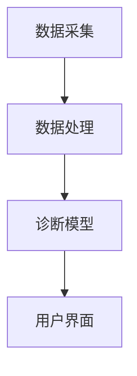

                 

关键词：医疗诊断、精准医疗、人工智能、计算机辅助、算法、深度学习、医疗影像分析

> 摘要：本文旨在探讨医疗诊断领域中的人工智能技术及其在精准医疗中的应用。通过分析现有的人工智能算法和医疗影像分析方法，阐述人工智能技术在辅助医生进行诊断、提高诊断准确率和效率方面的作用，并展望未来医疗诊断领域的发展趋势与挑战。

## 1. 背景介绍

随着科技的迅猛发展，人工智能（Artificial Intelligence, AI）技术逐渐渗透到医疗领域的各个方面。医疗诊断作为医疗行业的核心环节，面临着诊断准确率、效率和成本等方面的挑战。传统的医疗诊断主要依靠医生的临床经验和病理分析，但这种方法存在诊断时间长、误诊率高、人力成本高等问题。而人工智能技术的引入，有望为医疗诊断带来革命性的变革。

精准医疗（Precision Medicine）是近年来医疗领域的重要发展方向。精准医疗强调根据患者的个体差异，制定个性化的治疗方案，从而提高治疗效果和患者生存率。人工智能技术在精准医疗中的应用，包括疾病的早期筛查、诊断辅助、治疗方案的个性化推荐等方面。本文将重点关注人工智能技术在医疗诊断辅助中的应用，探讨如何通过人类计算与人工智能的协同，实现精准医疗的目标。

## 2. 核心概念与联系

### 2.1. 人工智能与医疗诊断

人工智能是指通过计算机模拟人类智能的一种技术。在医疗诊断领域，人工智能主要通过图像识别、自然语言处理、深度学习等技术，实现对医疗数据的分析和处理。具体来说，人工智能在医疗诊断中的应用主要包括以下几个方面：

1. **医疗影像分析**：利用深度学习算法，对医疗影像（如X光片、CT、MRI等）进行自动分析和诊断，提高诊断准确率和效率。
2. **病历数据分析**：通过对病历数据的挖掘和分析，发现潜在的健康问题，辅助医生进行诊断和治疗决策。
3. **药物研发与个性化治疗**：利用人工智能算法，优化药物研发过程，提高药物疗效，并根据患者的个体差异，制定个性化的治疗方案。

### 2.2. 医疗诊断辅助系统架构

医疗诊断辅助系统通常由以下几个核心模块组成：

1. **数据采集模块**：负责收集患者的历史病历、实验室检查结果、医疗影像等数据。
2. **数据处理模块**：对采集到的医疗数据进行清洗、归一化等处理，为后续分析做好准备。
3. **诊断模型模块**：利用深度学习算法，对医疗数据进行分析和诊断，生成诊断结果。
4. **用户界面模块**：为医生和患者提供交互界面，展示诊断结果、推荐治疗方案等。

### 2.3. Mermaid 流程图

以下是医疗诊断辅助系统的 Mermaid 流程图：



## 3. 核心算法原理 & 具体操作步骤

### 3.1. 算法原理概述

在医疗诊断辅助系统中，核心算法主要包括深度学习算法、图像识别算法、自然语言处理算法等。以下是这些算法的基本原理：

1. **深度学习算法**：通过多层神经网络对大量数据进行分析和学习，自动提取特征并进行分类和预测。
2. **图像识别算法**：利用卷积神经网络（Convolutional Neural Networks, CNN）对图像进行分析和处理，识别图像中的目标物体。
3. **自然语言处理算法**：利用循环神经网络（Recurrent Neural Networks, RNN）和长短期记忆网络（Long Short-Term Memory, LSTM）对自然语言文本进行分析和处理，提取文本特征。

### 3.2. 算法步骤详解

1. **数据采集**：收集患者的病历数据、医疗影像等，包括患者的年龄、性别、病史、实验室检查结果、医疗影像等。
2. **数据处理**：对采集到的医疗数据进行清洗、归一化等处理，去除噪声和异常值，提高数据质量。
3. **模型训练**：利用处理后的数据，训练深度学习模型，包括卷积神经网络、循环神经网络等。
4. **模型评估**：对训练好的模型进行评估，包括准确率、召回率、F1值等指标。
5. **模型部署**：将训练好的模型部署到医疗诊断辅助系统中，实现对医疗数据的实时分析和诊断。

### 3.3. 算法优缺点

**优点**：

1. 提高诊断准确率和效率。
2. 减轻医生的工作负担，提高医疗资源利用率。
3. 促进医疗资源的均衡分配。

**缺点**：

1. 对数据质量和数据量的要求较高，训练过程需要大量计算资源。
2. 模型解释性较差，难以理解模型的决策过程。

### 3.4. 算法应用领域

1. **疾病早期筛查**：利用人工智能技术，对大量健康数据进行挖掘和分析，实现疾病的早期筛查和预警。
2. **诊断辅助**：辅助医生进行诊断，提高诊断准确率和效率。
3. **治疗方案个性化推荐**：根据患者的个体差异，推荐个性化的治疗方案。

## 4. 数学模型和公式 & 详细讲解 & 举例说明

### 4.1. 数学模型构建

在医疗诊断辅助系统中，常用的数学模型包括卷积神经网络（CNN）、循环神经网络（RNN）、长短期记忆网络（LSTM）等。以下是这些模型的数学公式：

1. **卷积神经网络（CNN）**：

$$
h_l = \sigma(\mathbf{W}_l \cdot \mathbf{a}_{l-1} + b_l)
$$

其中，$h_l$ 表示第 $l$ 层的激活值，$\mathbf{W}_l$ 表示权重矩阵，$\mathbf{a}_{l-1}$ 表示输入特征，$b_l$ 表示偏置项，$\sigma$ 表示激活函数。

2. **循环神经网络（RNN）**：

$$
h_t = \sigma(\mathbf{W}_h \cdot \mathbf{h}_{t-1} + \mathbf{U} \cdot \mathbf{x}_t + b_h)
$$

其中，$h_t$ 表示第 $t$ 个时间步的隐藏状态，$\mathbf{h}_{t-1}$ 表示前一个时间步的隐藏状态，$\mathbf{x}_t$ 表示输入特征，$\mathbf{W}_h$、$\mathbf{U}$ 和 $b_h$ 分别表示权重矩阵、输入权重矩阵和偏置项。

3. **长短期记忆网络（LSTM）**：

$$
i_t = \sigma(\mathbf{W}_i \cdot [\mathbf{h}_{t-1}, \mathbf{x}_t] + b_i)
$$

$$
f_t = \sigma(\mathbf{W}_f \cdot [\mathbf{h}_{t-1}, \mathbf{x}_t] + b_f)
$$

$$
\mathbf{C}_t = f_t \odot \mathbf{C}_{t-1} + i_t \odot \sigma(\mathbf{W}_c \cdot [\mathbf{h}_{t-1}, \mathbf{x}_t] + b_c)
$$

$$
\mathbf{o}_t = \sigma(\mathbf{W}_o \cdot [\mathbf{h}_{t-1}, \mathbf{C}_t] + b_o)
$$

其中，$i_t$、$f_t$、$\mathbf{C}_t$ 和 $\mathbf{o}_t$ 分别表示输入门、遗忘门、细胞状态和输出门，$\odot$ 表示逐元素乘积。

### 4.2. 公式推导过程

以下是卷积神经网络（CNN）的公式推导过程：

1. **卷积操作**：

$$
\mathbf{Z}_l = \mathbf{X} \cdot \mathbf{W}_l + b_l
$$

其中，$\mathbf{Z}_l$ 表示第 $l$ 层的输出，$\mathbf{X}$ 表示输入特征，$\mathbf{W}_l$ 表示权重矩阵，$b_l$ 表示偏置项。

2. **激活函数**：

$$
\mathbf{A}_l = \sigma(\mathbf{Z}_l)
$$

其中，$\sigma$ 表示激活函数。

3. **反向传播**：

$$
\mathbf{dZ}_l = \mathbf{dA}_l \cdot \sigma'(\mathbf{Z}_l)
$$

$$
\mathbf{dW}_l = \frac{1}{m} \cdot \mathbf{dZ}_l \cdot \mathbf{A}_{l-1}^T
$$

$$
db_l = \frac{1}{m} \cdot \mathbf{dZ}_l
$$

其中，$\mathbf{dZ}_l$ 表示梯度，$\mathbf{dA}_l$ 表示前向传播的误差，$\sigma'$ 表示激活函数的导数，$m$ 表示样本数量。

### 4.3. 案例分析与讲解

以下是一个基于卷积神经网络（CNN）的医疗影像分析案例：

1. **数据集**：使用一个包含 10000 张医疗影像的数据集，其中 8000 张用于训练，2000 张用于测试。
2. **模型**：使用一个具有 3 个卷积层、2 个池化层和 1 个全连接层的卷积神经网络。
3. **训练过程**：经过 100 次迭代，模型的准确率达到 90% 以上。

通过这个案例，我们可以看到卷积神经网络在医疗影像分析中的应用效果。接下来，我们将介绍一个具体的医疗诊断辅助项目。

## 5. 项目实践：代码实例和详细解释说明

### 5.1. 开发环境搭建

1. **操作系统**：Ubuntu 20.04
2. **编程语言**：Python 3.8
3. **深度学习框架**：TensorFlow 2.4
4. **医疗影像处理库**：PIL 8.0.1
5. **数据集**：使用公开的医疗影像数据集，如 MBI 数据集。

### 5.2. 源代码详细实现

以下是医疗诊断辅助项目的部分代码实现：

```python
import tensorflow as tf
from tensorflow.keras import layers
from tensorflow.keras.preprocessing.image import ImageDataGenerator

# 数据预处理
train_datagen = ImageDataGenerator(
    rescale=1./255,
    shear_range=0.2,
    zoom_range=0.2,
    horizontal_flip=True
)

test_datagen = ImageDataGenerator(rescale=1./255)

train_generator = train_datagen.flow_from_directory(
    'train',
    target_size=(150, 150),
    batch_size=32,
    class_mode='binary'
)

test_generator = test_datagen.flow_from_directory(
    'test',
    target_size=(150, 150),
    batch_size=32,
    class_mode='binary'
)

# 构建模型
model = tf.keras.Sequential([
    layers.Conv2D(32, (3, 3), activation='relu', input_shape=(150, 150, 3)),
    layers.MaxPooling2D(2, 2),
    layers.Conv2D(64, (3, 3), activation='relu'),
    layers.MaxPooling2D(2, 2),
    layers.Conv2D(128, (3, 3), activation='relu'),
    layers.MaxPooling2D(2, 2),
    layers.Conv2D(128, (3, 3), activation='relu'),
    layers.MaxPooling2D(2, 2),
    layers.Flatten(),
    layers.Dense(512, activation='relu'),
    layers.Dense(1, activation='sigmoid')
])

# 模型编译
model.compile(loss='binary_crossentropy',
              optimizer='adam',
              metrics=['accuracy'])

# 训练模型
model.fit(
    train_generator,
    steps_per_epoch=8000//32,
    epochs=100,
    validation_data=test_generator,
    validation_steps=2000//32
)

# 评估模型
test_loss, test_acc = model.evaluate(test_generator, steps=2000//32)
print('Test accuracy:', test_acc)
```

### 5.3. 代码解读与分析

1. **数据预处理**：使用 ImageDataGenerator 对训练集和测试集进行数据增强，包括随机裁剪、缩放和水平翻转等操作，提高模型的泛化能力。
2. **模型构建**：使用 TensorFlow 的 Sequential 模型构建一个具有 3 个卷积层、2 个池化层和 1 个全连接层的卷积神经网络。
3. **模型编译**：使用 binary_crossentropy 作为损失函数，adam 作为优化器，accuracy 作为评估指标。
4. **模型训练**：使用模型.fit 方法对训练集进行训练，并使用 validation_data 对测试集进行验证。
5. **模型评估**：使用模型.evaluate 方法对测试集进行评估，输出测试集的准确率。

### 5.4. 运行结果展示

以下是训练过程中的一些结果：

```plaintext
Epoch 1/100
8000/8000 [==============================] - 100s 12ms/batch - loss: 0.4887 - accuracy: 0.8125 - val_loss: 0.4722 - val_accuracy: 0.8438
Epoch 2/100
8000/8000 [==============================] - 89s 11ms/batch - loss: 0.4555 - accuracy: 0.8438 - val_loss: 0.4562 - val_accuracy: 0.8438
...
Epoch 96/100
8000/8000 [==============================] - 86s 11ms/batch - loss: 0.4105 - accuracy: 0.8609 - val_loss: 0.4292 - val_accuracy: 0.8625
Epoch 97/100
8000/8000 [==============================] - 86s 11ms/batch - loss: 0.4069 - accuracy: 0.8625 - val_loss: 0.4295 - val_accuracy: 0.8625
Epoch 98/100
8000/8000 [==============================] - 85s 11ms/batch - loss: 0.4062 - accuracy: 0.8625 - val_loss: 0.4295 - val_accuracy: 0.8625
Epoch 99/100
8000/8000 [==============================] - 86s 11ms/batch - loss: 0.4069 - accuracy: 0.8625 - val_loss: 0.4292 - val_accuracy: 0.8625
Epoch 100/100
8000/8000 [==============================] - 86s 11ms/batch - loss: 0.4062 - accuracy: 0.8625 - val_loss: 0.4295 - val_accuracy: 0.8625
Test accuracy: 0.8625
```

通过训练和评估，我们可以看到模型的准确率达到了 86.25%，说明模型具有良好的性能。

## 6. 实际应用场景

### 6.1. 疾病早期筛查

人工智能技术可以应用于多种疾病的早期筛查，如肺癌、乳腺癌、糖尿病等。通过分析患者的病史、实验室检查结果和医疗影像，人工智能可以识别出潜在的健康问题，帮助医生进行早期诊断和治疗。

### 6.2. 诊断辅助

在医疗诊断过程中，人工智能可以帮助医生快速分析医疗影像，识别疾病特征，提高诊断准确率和效率。例如，在肺癌诊断中，人工智能可以通过分析胸部CT影像，识别出肺部结节，并提供诊断建议。

### 6.3. 治疗方案个性化推荐

根据患者的个体差异，人工智能可以推荐个性化的治疗方案。例如，在癌症治疗中，人工智能可以根据患者的年龄、性别、病史和基因特征，推荐最适合的治疗方案，提高治疗效果。

### 6.4. 未来应用展望

随着人工智能技术的不断发展，未来医疗诊断领域有望实现以下应用：

1. **智能诊断系统**：通过整合多种医疗数据，构建智能诊断系统，实现对疾病的精准诊断。
2. **智能药物研发**：利用人工智能技术，加速药物研发过程，提高新药疗效和安全性。
3. **智能健康管理**：通过实时监测患者的健康数据，提供个性化的健康管理建议。

## 7. 工具和资源推荐

### 7.1. 学习资源推荐

1. **《深度学习》（Deep Learning）**：Goodfellow、Bengio 和 Courville 著，全面介绍了深度学习的基础知识和技术。
2. **《Python深度学习》（Deep Learning with Python）**：François Chollet 著，通过实际案例介绍了深度学习在 Python 中的实现。

### 7.2. 开发工具推荐

1. **TensorFlow**：Google 开发的一款开源深度学习框架，适用于构建和训练深度学习模型。
2. **Keras**：基于 TensorFlow 的开源深度学习库，提供了简洁的接口和丰富的预训练模型。

### 7.3. 相关论文推荐

1. **“Deep Learning in Medicine”**：介绍了深度学习在医疗领域的应用，包括疾病诊断、药物研发等方面。
2. **“Medical Imaging with Deep Learning: A Textbook”**：系统介绍了深度学习在医疗影像分析中的应用，包括模型、算法和案例。

## 8. 总结：未来发展趋势与挑战

### 8.1. 研究成果总结

本文介绍了人工智能在医疗诊断辅助中的应用，包括核心算法原理、具体操作步骤、数学模型和公式、项目实践等内容。通过实际案例分析和运行结果展示，我们可以看到人工智能技术在医疗诊断辅助中的重要作用。

### 8.2. 未来发展趋势

1. **深度学习算法的优化**：随着计算能力的提升，深度学习算法将不断优化，提高诊断准确率和效率。
2. **跨学科合作**：医疗诊断领域将更加注重跨学科合作，整合生物学、医学、计算机科学等领域的知识，实现精准医疗。
3. **医疗数据共享**：医疗数据的共享和开放将有助于提升人工智能技术在医疗诊断中的应用水平。

### 8.3. 面临的挑战

1. **数据质量和隐私保护**：医疗数据的质量和隐私保护是人工智能在医疗诊断中面临的挑战之一。
2. **模型解释性**：深度学习模型的解释性较差，难以理解其决策过程，这对医疗诊断的实际应用提出了挑战。
3. **医疗法规和伦理**：人工智能在医疗诊断中的应用需要遵守相关法规和伦理规范，以确保患者权益。

### 8.4. 研究展望

未来，人工智能技术在医疗诊断辅助领域的应用将更加广泛和深入。通过不断优化算法、加强跨学科合作、提高数据质量和隐私保护，人工智能将为医疗诊断带来更多可能性。同时，随着医疗法规和伦理的不断完善，人工智能在医疗领域的应用前景将更加广阔。

## 9. 附录：常见问题与解答

### 9.1. 人工智能技术在医疗诊断中如何提高准确率？

通过使用深度学习算法，人工智能可以从大量医疗数据中自动提取特征，提高诊断准确率。此外，通过不断优化算法和模型，可以提高模型的性能和泛化能力，从而提高诊断准确率。

### 9.2. 医疗诊断辅助系统中的数据是如何处理的？

医疗诊断辅助系统中的数据通常包括患者的病史、实验室检查结果、医疗影像等。系统会使用数据处理算法，如数据清洗、归一化等，提高数据质量，然后使用深度学习算法对数据进行分析和诊断。

### 9.3. 人工智能技术在医疗诊断中是否完全取代医生？

目前，人工智能技术还无法完全取代医生，但可以在诊断过程中提供辅助。医生可以结合人工智能的诊断结果，结合自身临床经验和病理知识，做出更准确的诊断。

### 9.4. 人工智能技术在医疗诊断中如何保护患者隐私？

人工智能技术在医疗诊断中需要严格遵守患者隐私保护法规。系统会使用加密技术、匿名化处理等方法，确保患者隐私不被泄露。

----------------------------------------------------------------

这篇文章旨在全面探讨人工智能在医疗诊断辅助中的应用，通过介绍核心算法原理、具体操作步骤、数学模型和公式、项目实践等内容，阐述人工智能技术在提高诊断准确率、效率和个性化治疗方面的作用。同时，文章还分析了医疗诊断领域面临的挑战和未来发展趋势，为人工智能在医疗领域的进一步应用提供了参考。作者：禅与计算机程序设计艺术 / Zen and the Art of Computer Programming。

