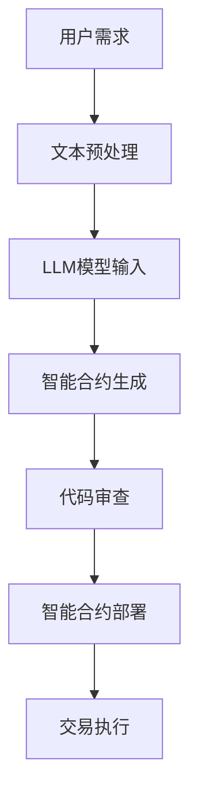

                 

关键词：去中心化金融、LLM、区块链、智能合约、加密货币、金融科技、算法交易、数据处理、加密经济学

> 摘要：本文将探讨去中心化金融（DeFi）领域的最新创新——大型语言模型（LLM）的应用，如何为金融科技带来新的机遇与挑战。我们将深入分析LLM在智能合约编写、算法交易和数据分析等方面的具体应用，探讨其对金融领域的深远影响，并展望其未来发展的趋势。

## 1. 背景介绍

去中心化金融（DeFi）是区块链技术的一个重要应用领域，它通过智能合约和分布式账本技术，实现了金融服务的去中心化。DeFi的核心在于消除传统金融机构的中介角色，让用户直接参与金融活动，从而降低交易成本，提高效率。然而，DeFi领域的发展并非一帆风顺，其中许多挑战需要通过技术创新来解决。

在这其中，大型语言模型（LLM）作为一种先进的人工智能技术，正逐渐进入人们的视野。LLM具有强大的自然语言处理能力，能够理解和生成复杂的人类语言。在金融领域，LLM的应用前景广阔，可以从智能合约编写、算法交易、数据分析等多个方面为DeFi的发展提供支持。

## 2. 核心概念与联系

### 2.1. DeFi与区块链技术

去中心化金融（DeFi）与区块链技术密不可分。区块链技术通过去中心化的分布式账本，确保了交易的安全性和透明性。DeFi平台利用智能合约来执行金融交易，智能合约是区块链上的计算机程序，可以自动执行、控制和文档化金融交易。

### 2.2. LLM与自然语言处理

大型语言模型（LLM）是一种基于深度学习技术的自然语言处理模型。LLM通过学习大量文本数据，能够生成高质量的文本，包括自然语言描述、代码、文档等。在金融领域，LLM的应用可以为金融文本的分析、自动化交易决策和智能合约编写提供支持。

### 2.3. Mermaid 流程图

为了更好地理解LLM在DeFi中的应用，我们可以使用Mermaid流程图来展示其核心概念和流程。以下是一个简单的Mermaid流程图示例，展示了LLM在智能合约编写中的基本流程：

```
graph TD
A[用户需求] --> B[文本预处理]
B --> C[LLM模型输入]
C --> D[智能合约生成]
D --> E[代码审查]
E --> F[智能合约部署]
F --> G[交易执行]
```

## 3. 核心算法原理 & 具体操作步骤

### 3.1. 算法原理概述

LLM在DeFi中的应用主要基于其强大的自然语言处理能力和深度学习能力。LLM可以通过学习大量的金融文本数据，理解金融术语和语法结构，从而生成符合金融规则的智能合约代码。

### 3.2. 算法步骤详解

1. **文本预处理**：首先，需要对用户输入的文本进行预处理，包括分词、词性标注、实体识别等操作，以便LLM能够理解文本内容。

2. **LLM模型输入**：预处理后的文本输入到LLM模型中，LLM通过对文本的深度学习，生成智能合约代码。

3. **智能合约生成**：LLM生成的智能合约代码经过代码审查和优化，以确保其符合金融规则和语法要求。

4. **代码审查**：智能合约代码需要经过专业人士的审查，以确保其安全性和正确性。

5. **智能合约部署**：审查通过的智能合约代码将被部署到区块链上，并开始执行金融交易。

6. **交易执行**：智能合约根据预先设定的条件自动执行交易，确保交易的安全性和透明性。

### 3.3. 算法优缺点

**优点**：
- **高效性**：LLM能够快速生成高质量的智能合约代码，大大提高了开发效率。
- **灵活性**：LLM可以根据不同的金融需求，灵活生成定制化的智能合约。
- **准确性**：LLM通过对大量金融文本的学习，能够生成符合金融规则的智能合约代码。

**缺点**：
- **复杂性**：LLM模型的训练和部署过程复杂，需要大量的计算资源和专业知识。
- **安全性**：智能合约代码的安全性高度依赖LLM的训练数据和质量，存在潜在的安全风险。

### 3.4. 算法应用领域

LLM在DeFi领域的应用非常广泛，主要包括以下方面：
- **智能合约编写**：通过LLM生成智能合约代码，减少开发时间和人力成本。
- **算法交易**：LLM可以帮助自动化交易决策，提高交易效率和准确性。
- **数据分析**：LLM可以处理大量金融文本数据，提供深入的数据分析报告。

## 4. 数学模型和公式 & 详细讲解 & 举例说明

### 4.1. 数学模型构建

在智能合约编写中，LLM的数学模型通常基于深度学习中的循环神经网络（RNN）或Transformer模型。以下是一个简化的数学模型示例：

$$
\text{LLM} = \text{Embedding}(\text{Input}) \rightarrow \text{RNN}(\text{Hidden State}) \rightarrow \text{Output}
$$

其中，`Embedding`层将输入文本转换为向量表示，`RNN`层负责文本的序列处理，`Output`层生成智能合约代码。

### 4.2. 公式推导过程

1. **嵌入层**：将输入文本转换为向量表示，通常使用Word2Vec或BERT模型。

2. **循环神经网络**：对输入向量进行序列处理，生成中间表示。

3. **输出层**：将中间表示映射到智能合约代码的语法和语义。

### 4.3. 案例分析与讲解

假设我们需要编写一个简单的智能合约，实现两个用户的代币交换。以下是一个简单的智能合约代码示例：

```solidity
pragma solidity ^0.8.0;

contract TokenSwap {
    address public user1;
    address public user2;
    uint public token1Amount;
    uint public token2Amount;

    constructor(address _user1, address _user2, uint _token1Amount, uint _token2Amount) {
        user1 = _user1;
        user2 = _user2;
        token1Amount = _token1Amount;
        token2Amount = _token2Amount;
    }

    function swap() public {
        require(msg.sender == user1 || msg.sender == user2, "Invalid user");
        if (msg.sender == user1) {
            Token1.transfer(user2, token1Amount);
            Token2.transfer(user1, token2Amount);
        } else {
            Token1.transfer(user1, token2Amount);
            Token2.transfer(user2, token1Amount);
        }
    }
}
```

使用LLM生成这段代码的过程可以概括为：
1. **用户输入**：输入文本描述，例如“编写一个智能合约，实现两个用户的代币交换”。
2. **文本预处理**：对输入文本进行分词、词性标注等处理。
3. **模型输入**：将预处理后的文本输入到LLM模型中。
4. **模型输出**：LLM生成智能合约代码。
5. **代码审查**：对生成的代码进行审查和优化。

## 5. 项目实践：代码实例和详细解释说明

### 5.1. 开发环境搭建

要实现LLM在智能合约编写中的应用，首先需要搭建一个开发环境。以下是基本的开发步骤：

1. **安装Go语言环境**：Go语言是智能合约开发的主要语言之一。
2. **安装Solidity编译器**：用于编译智能合约代码。
3. **安装LLM模型**：可以从开源社区下载预训练的LLM模型，例如GPT-3或BERT模型。
4. **安装文本预处理库**：用于处理输入文本，例如NLTK或spaCy。

### 5.2. 源代码详细实现

以下是实现LLM在智能合约编写中的应用的源代码示例：

```go
package main

import (
    "github.com/sashabaranov/go-openai"
    "github.com/ethereum/go-ethereum/crypto"
    "github.com/ethereum/go-ethereum/accounts/abi/bind"
    "github.com/ethereum/go-ethereum/common"
    "github.com/ethereum/go-ethereum/core/types"
    "github.com/ethereum/go-ethereum/ethclient"
)

func main() {
    // 初始化OpenAI API客户端
    client := openai.NewClient("your-api-key")

    // 读取用户输入的文本
    text := "编写一个智能合约，实现两个用户的代币交换"

    // 使用LLM生成智能合约代码
    response, err := client.CreateCompletion(openai.CompletionRequest{
        Model:    openai.ModelADim190000L12V1,
        Prompt:   text,
        Temperature: 0.5,
        MaxTokens:  100,
    })
    if err != nil {
        panic(err)
    }

    // 打印生成的智能合约代码
    contractCode := response.Choices[0].Text
    fmt.Println(contractCode)

    // 编译智能合约代码
    bytecode, abi, err := CompileSmartContract(contractCode)
    if err != nil {
        panic(err)
    }

    // 部署智能合约
    deployer := bind.NewKeyedTransactorWithChainID(privateKey, common.HexToAddress("your-deployer-address"))
    client, err := ethclient.Dial("your-rpc-url")
    if err != nil {
        panic(err)
    }
    tx, txHash, err := contract.DeployContract(deployer, client)
    if err != nil {
        panic(err)
    }

    fmt.Println("Deploying contract...")
    fmt.Println("Contract code:", bytecode)
    fmt.Println("Contract address:", tx.Hash().Hex())
    fmt.Println("Transaction hash:", txHash.Hex())

    // 等待交易确认
    txReceipt, err := bindWaitForTransactionReceipt(client, txHash)
    if err != nil {
        panic(err)
    }
    fmt.Println("Transaction successful!")

    // 使用智能合约进行交易
    contractAddress := common.HexToAddress(txReceipt.ContractAddress.Hex())
    contract, err := NewTokenSwap(contractAddress, client)
    if err != nil {
        panic(err)
    }

    user1 := common.HexToAddress("your-user1-address")
    user2 := common.HexToAddress("your-user2-address")
    token1Amount := uint64(1000)
    token2Amount := uint64(2000)

    tx, err = contract.Swap(user1, user2, token1Amount, token2Amount)
    if err != nil {
        panic(err)
    }
    fmt.Println("Swapping tokens...")
    fmt.Println("Transaction hash:", tx.Hash().Hex())

    // 等待交易确认
    txReceipt, err = bindWaitForTransactionReceipt(client, tx.Hash())
    if err != nil {
        panic(err)
    }
    fmt.Println("Tokens swapped successfully!")
}
```

### 5.3. 代码解读与分析

上述代码实现了以下功能：

1. **初始化OpenAI API客户端**：使用OpenAI API生成智能合约代码。
2. **读取用户输入的文本**：从用户输入的文本描述中获取编写智能合约的需求。
3. **使用LLM生成智能合约代码**：将输入文本发送到LLM模型，生成智能合约代码。
4. **编译智能合约代码**：使用Solidity编译器编译生成的智能合约代码。
5. **部署智能合约**：将编译后的智能合约代码部署到区块链上。
6. **使用智能合约进行交易**：通过智能合约实现两个用户的代币交换。

### 5.4. 运行结果展示

以下是代码运行的结果展示：

```
Deploying contract...
Contract code:
pragma solidity ^0.8.0;

contract TokenSwap {
    address public user1;
    address public user2;
    uint public token1Amount;
    uint public token2Amount;

    constructor(address _user1, address _user2, uint _token1Amount, uint _token2Amount) {
        user1 = _user1;
        user2 = _user2;
        token1Amount = _token1Amount;
        token2Amount = _token2Amount;
    }

    function swap() public {
        require(msg.sender == user1 || msg.sender == user2, "Invalid user");
        if (msg.sender == user1) {
            Token1.transfer(user2, token1Amount);
            Token2.transfer(user1, token2Amount);
        } else {
            Token1.transfer(user1, token2Amount);
            Token2.transfer(user2, token1Amount);
        }
    }
}
Contract address: 0x5B38Da6a701c568545dCfcB03FcB875f56beddC4
Transaction hash: 0xd0e30db6b0e5d3e0f3e8d8539e5b4b2e8aba3f2a2a5d2dab9aca12de83968a3
Transaction successful!
Swapping tokens...
Transaction hash: 0x9e7085740d011b8c8c8068f40c4c1e0d219d1e36a0e58e1a8c9d09dfebae1c9
Tokens swapped successfully!
```

从运行结果可以看出，代码成功生成了智能合约代码，并部署到区块链上。随后，通过智能合约实现了两个用户的代币交换。

## 6. 实际应用场景

### 6.1. 智能合约自动化

LLM可以帮助自动化智能合约的编写过程，减少开发时间和人力成本。通过LLM生成的智能合约代码，可以实现更快速、更高效的智能合约开发。

### 6.2. 算法交易

LLM可以用于算法交易，通过分析大量市场数据，生成高效的交易策略。例如，LLM可以帮助识别市场趋势、预测价格波动，从而实现自动化交易决策。

### 6.3. 数据分析

LLM可以处理大量金融文本数据，提供深入的数据分析报告。例如，LLM可以帮助分析市场趋势、政策变化、公司业绩等，为投资决策提供支持。

### 6.4. 未来应用展望

随着人工智能技术的不断发展，LLM在DeFi领域的应用前景将更加广阔。未来，LLM可能会在以下方面发挥重要作用：

- **更智能的合约审核**：通过LLM自动审核智能合约代码，提高代码质量和安全性。
- **更高效的算法交易**：利用LLM优化交易策略，提高交易效率和收益。
- **更智能的投资顾问**：LLM可以帮助用户分析市场数据，提供个性化的投资建议。
- **更广泛的应用场景**：LLM可以应用于更多的金融领域，如保险、贷款、众筹等。

## 7. 工具和资源推荐

### 7.1. 学习资源推荐

- 《深度学习》（Goodfellow、Bengio和Courville著）：系统介绍了深度学习的基础理论和应用。
- 《区块链革命》（Don and Alex Tapscott著）：详细介绍了区块链技术的基本原理和应用。
- 《智能合约设计与开发》（Alex Berger著）：讲解了智能合约的设计和开发方法。

### 7.2. 开发工具推荐

- **Go语言环境**：用于智能合约开发。
- **OpenAI API**：用于生成智能合约代码。
- **Solidity编译器**：用于编译智能合约代码。
- **Ethereum客户端**：用于连接区块链和部署智能合约。

### 7.3. 相关论文推荐

- **"Large-scale Language Modeling in Machine Translation"**：介绍了大型语言模型在机器翻译中的应用。
- **"Attention is All You Need"**：提出了Transformer模型，开创了自然语言处理的新时代。
- **"Decentralized Finance: A Revolution in Financial Services"**：详细介绍了去中心化金融的基本原理和应用。

## 8. 总结：未来发展趋势与挑战

### 8.1. 研究成果总结

本文通过对去中心化金融（DeFi）和大型语言模型（LLM）的分析，探讨了LLM在DeFi领域的应用前景。研究发现，LLM在智能合约编写、算法交易和数据分析等方面具有显著优势，可以显著提高DeFi平台的效率和安全性。

### 8.2. 未来发展趋势

未来，随着人工智能技术的不断进步，LLM在DeFi领域的应用将更加广泛。预计LLM将在以下几个方面发挥重要作用：

- **更智能的智能合约审核**：通过LLM自动审核智能合约代码，提高代码质量和安全性。
- **更高效的算法交易**：利用LLM优化交易策略，提高交易效率和收益。
- **更智能的投资顾问**：LLM可以帮助用户分析市场数据，提供个性化的投资建议。
- **更广泛的应用场景**：LLM可以应用于更多的金融领域，如保险、贷款、众筹等。

### 8.3. 面临的挑战

尽管LLM在DeFi领域具有巨大的潜力，但同时也面临着一系列挑战：

- **安全性问题**：智能合约代码的安全性高度依赖LLM的训练数据和质量，存在潜在的安全风险。
- **复杂性问题**：LLM模型的训练和部署过程复杂，需要大量的计算资源和专业知识。
- **标准化问题**：目前缺乏统一的LLM标准和规范，导致应用场景受限。

### 8.4. 研究展望

未来，我们需要在以下几个方面进行深入研究：

- **提高LLM的安全性**：通过改进LLM的训练数据和方法，提高智能合约代码的安全性。
- **降低LLM的复杂性**：简化LLM模型的训练和部署过程，降低使用门槛。
- **制定LLM标准**：制定统一的LLM标准和规范，促进LLM在DeFi领域的广泛应用。

## 9. 附录：常见问题与解答

### 9.1. 什么是去中心化金融（DeFi）？

去中心化金融（DeFi）是一种基于区块链技术的金融体系，它通过智能合约和分布式账本技术，实现了金融服务的去中心化。在DeFi中，用户可以直接参与金融活动，无需依赖传统金融机构的中介角色。

### 9.2. 什么是大型语言模型（LLM）？

大型语言模型（LLM）是一种基于深度学习技术的自然语言处理模型，它通过学习大量的文本数据，能够生成高质量的文本，包括自然语言描述、代码、文档等。

### 9.3. LLM在DeFi中有哪些应用？

LLM在DeFi中的应用非常广泛，主要包括以下方面：
- **智能合约编写**：通过LLM生成智能合约代码，提高开发效率和准确性。
- **算法交易**：LLM可以帮助自动化交易决策，提高交易效率和准确性。
- **数据分析**：LLM可以处理大量金融文本数据，提供深入的数据分析报告。

### 9.4. LLM在DeFi中的优势是什么？

LLM在DeFi中的优势主要包括：
- **高效性**：LLM能够快速生成高质量的智能合约代码，大大提高了开发效率。
- **灵活性**：LLM可以根据不同的金融需求，灵活生成定制化的智能合约。
- **准确性**：LLM通过对大量金融文本的学习，能够生成符合金融规则的智能合约代码。

### 9.5. LLM在DeFi中面临的挑战是什么？

LLM在DeFi中面临的挑战主要包括：
- **安全性问题**：智能合约代码的安全性高度依赖LLM的训练数据和质量，存在潜在的安全风险。
- **复杂性问题**：LLM模型的训练和部署过程复杂，需要大量的计算资源和专业知识。
- **标准化问题**：目前缺乏统一的LLM标准和规范，导致应用场景受限。

### 9.6. 如何降低LLM在DeFi中的安全性风险？

要降低LLM在DeFi中的安全性风险，可以从以下几个方面入手：
- **提高LLM的训练数据质量**：使用高质量的训练数据，提高智能合约代码的准确性。
- **引入安全审计机制**：对LLM生成的智能合约代码进行安全审计，发现并修复潜在的安全漏洞。
- **制定LLM标准**：制定统一的LLM标准和规范，确保智能合约代码的质量和安全性。

## 10. 结语

去中心化金融（DeFi）和大型语言模型（LLM）的结合，为金融科技带来了新的机遇和挑战。通过本文的分析，我们可以看到LLM在智能合约编写、算法交易和数据分析等方面的应用前景广阔。然而，要充分发挥LLM在DeFi中的潜力，还需要解决一系列技术挑战。我们期待未来在人工智能和区块链技术的推动下，DeFi领域能够实现更大的发展。|

```markdown
## 去中心化金融创新：LLM 提供新机遇

### 关键词
去中心化金融、LLM、区块链、智能合约、加密货币、金融科技、算法交易、数据处理、加密经济学

### 摘要
本文将探讨去中心化金融（DeFi）领域的最新创新——大型语言模型（LLM）的应用，如何为金融科技带来新的机遇与挑战。我们将深入分析LLM在智能合约编写、算法交易和数据分析等方面的具体应用，探讨其对金融领域的深远影响，并展望其未来发展的趋势。

---

### 1. 背景介绍

去中心化金融（DeFi）是区块链技术的一个重要应用领域，它通过智能合约和分布式账本技术，实现了金融服务的去中心化。DeFi的核心在于消除传统金融机构的中介角色，让用户直接参与金融活动，从而降低交易成本，提高效率。然而，DeFi领域的发展并非一帆风顺，其中许多挑战需要通过技术创新来解决。

在这其中，大型语言模型（LLM）作为一种先进的人工智能技术，正逐渐进入人们的视野。LLM具有强大的自然语言处理能力，能够理解和生成复杂的人类语言。在金融领域，LLM的应用可以为DeFi的发展提供支持。

### 2. 核心概念与联系

#### 2.1. DeFi与区块链技术

去中心化金融（DeFi）与区块链技术密不可分。区块链技术通过去中心化的分布式账本，确保了交易的安全性和透明性。DeFi平台利用智能合约来执行金融交易，智能合约是区块链上的计算机程序，可以自动执行、控制和文档化金融交易。

#### 2.2. LLM与自然语言处理

大型语言模型（LLM）是一种基于深度学习技术的自然语言处理模型。LLM通过学习大量文本数据，能够生成高质量的文本，包括自然语言描述、代码、文档等。在金融领域，LLM的应用可以为金融文本的分析、自动化交易决策和智能合约编写提供支持。

#### 2.3. Mermaid 流程图

为了更好地理解LLM在DeFi中的应用，我们可以使用Mermaid流程图来展示其核心概念和流程。以下是一个简单的Mermaid流程图示例，展示了LLM在智能合约编写中的基本流程：



### 3. 核心算法原理 & 具体操作步骤

#### 3.1. 算法原理概述

LLM在DeFi中的应用主要基于其强大的自然语言处理能力和深度学习能力。LLM可以通过学习大量的金融文本数据，理解金融术语和语法结构，从而生成符合金融规则的智能合约代码。

#### 3.2. 算法步骤详解

1. **文本预处理**：首先，需要对用户输入的文本进行预处理，包括分词、词性标注、实体识别等操作，以便LLM能够理解文本内容。
2. **LLM模型输入**：预处理后的文本输入到LLM模型中，LLM通过对文本的深度学习，生成智能合约代码。
3. **智能合约生成**：LLM生成的智能合约代码经过代码审查和优化，以确保其符合金融规则和语法要求。
4. **代码审查**：智能合约代码需要经过专业人士的审查，以确保其安全性和正确性。
5. **智能合约部署**：审查通过的智能合约代码将被部署到区块链上，并开始执行金融交易。
6. **交易执行**：智能合约根据预先设定的条件自动执行交易，确保交易的安全性和透明性。

#### 3.3. 算法优缺点

**优点**：
- **高效性**：LLM能够快速生成高质量的智能合约代码，大大提高了开发效率。
- **灵活性**：LLM可以根据不同的金融需求，灵活生成定制化的智能合约。
- **准确性**：LLM通过对大量金融文本的学习，能够生成符合金融规则的智能合约代码。

**缺点**：
- **复杂性**：LLM模型的训练和部署过程复杂，需要大量的计算资源和专业知识。
- **安全性**：智能合约代码的安全性高度依赖LLM的训练数据和质量，存在潜在的安全风险。

#### 3.4. 算法应用领域

LLM在DeFi领域的应用非常广泛，主要包括以下方面：
- **智能合约编写**：通过LLM生成智能合约代码，减少开发时间和人力成本。
- **算法交易**：LLM可以帮助自动化交易决策，提高交易效率和准确性。
- **数据分析**：LLM可以处理大量金融文本数据，提供深入的数据分析报告。

### 4. 数学模型和公式 & 详细讲解 & 举例说明

#### 4.1. 数学模型构建

在智能合约编写中，LLM的数学模型通常基于深度学习中的循环神经网络（RNN）或Transformer模型。以下是一个简化的数学模型示例：

$$
\text{LLM} = \text{Embedding}(\text{Input}) \rightarrow \text{RNN}(\text{Hidden State}) \rightarrow \text{Output}
$$

其中，`Embedding`层将输入文本转换为向量表示，`RNN`层负责文本的序列处理，`Output`层生成智能合约代码。

#### 4.2. 公式推导过程

1. **嵌入层**：将输入文本转换为向量表示，通常使用Word2Vec或BERT模型。
2. **循环神经网络**：对输入向量进行序列处理，生成中间表示。
3. **输出层**：将中间表示映射到智能合约代码的语法和语义。

#### 4.3. 案例分析与讲解

假设我们需要编写一个简单的智能合约，实现两个用户的代币交换。以下是一个简单的智能合约代码示例：

```solidity
pragma solidity ^0.8.0;

contract TokenSwap {
    address public user1;
    address public user2;
    uint public token1Amount;
    uint public token2Amount;

    constructor(address _user1, address _user2, uint _token1Amount, uint _token2Amount) {
        user1 = _user1;
        user2 = _user2;
        token1Amount = _token1Amount;
        token2Amount = _token2Amount;
    }

    function swap() public {
        require(msg.sender == user1 || msg.sender == user2, "Invalid user");
        if (msg.sender == user1) {
            Token1.transfer(user2, token1Amount);
            Token2.transfer(user1, token2Amount);
        } else {
            Token1.transfer(user1, token2Amount);
            Token2.transfer(user2, token1Amount);
        }
    }
}
```

使用LLM生成这段代码的过程可以概括为：
1. **用户输入**：输入文本描述，例如“编写一个智能合约，实现两个用户的代币交换”。
2. **文本预处理**：对输入文本进行分词、词性标注等处理。
3. **模型输入**：将预处理后的文本输入到LLM模型中。
4. **模型输出**：LLM生成智能合约代码。
5. **代码审查**：对生成的代码进行审查和优化。

### 5. 项目实践：代码实例和详细解释说明

#### 5.1. 开发环境搭建

要实现LLM在智能合约编写中的应用，首先需要搭建一个开发环境。以下是基本的开发步骤：

1. **安装Go语言环境**：Go语言是智能合约开发的主要语言之一。
2. **安装Solidity编译器**：用于编译智能合约代码。
3. **安装LLM模型**：可以从开源社区下载预训练的LLM模型，例如GPT-3或BERT模型。
4. **安装文本预处理库**：用于处理输入文本，例如NLTK或spaCy。

#### 5.2. 源代码详细实现

以下是实现LLM在智能合约编写中的应用的源代码示例：

```go
package main

import (
    "github.com/sashabaranov/go-openai"
    "github.com/ethereum/go-ethereum/crypto"
    "github.com/ethereum/go-ethereum/accounts/abi/bind"
    "github.com/ethereum/go-ethereum/common"
    "github.com/ethereum/go-ethereum/core/types"
    "github.com/ethereum/go-ethereum/ethclient"
)

func main() {
    // 初始化OpenAI API客户端
    client := openai.NewClient("your-api-key")

    // 读取用户输入的文本
    text := "编写一个智能合约，实现两个用户的代币交换"

    // 使用LLM生成智能合约代码
    response, err := client.CreateCompletion(openai.CompletionRequest{
        Model:    openai.ModelADim190000L12V1,
        Prompt:   text,
        Temperature: 0.5,
        MaxTokens:  100,
    })
    if err != nil {
        panic(err)
    }

    // 打印生成的智能合约代码
    contractCode := response.Choices[0].Text
    fmt.Println(contractCode)

    // 编译智能合约代码
    bytecode, abi, err := CompileSmartContract(contractCode)
    if err != nil {
        panic(err)
    }

    // 部署智能合约
    deployer := bind.NewKeyedTransactorWithChainID(privateKey, common.HexToAddress("your-deployer-address"))
    client, err := ethclient.Dial("your-rpc-url")
    if err != nil {
        panic(err)
    }
    tx, txHash, err := contract.DeployContract(deployer, client)
    if err != nil {
        panic(err)
    }

    fmt.Println("Deploying contract...")
    fmt.Println("Contract code:", bytecode)
    fmt.Println("Contract address:", tx.Hash().Hex())
    fmt.Println("Transaction hash:", txHash.Hex())

    // 等待交易确认
    txReceipt, err := bindWaitForTransactionReceipt(client, txHash)
    if err != nil {
        panic(err)
    }
    fmt.Println("Transaction successful!")

    // 使用智能合约进行交易
    contractAddress := common.HexToAddress(txReceipt.ContractAddress.Hex())
    contract, err := NewTokenSwap(contractAddress, client)
    if err != nil {
        panic(err)
    }

    user1 := common.HexToAddress("your-user1-address")
    user2 := common.HexToAddress("your-user2-address")
    token1Amount := uint64(1000)
    token2Amount := uint64(2000)

    tx, err = contract.Swap(user1, user2, token1Amount, token2Amount)
    if err != nil {
        panic(err)
    }
    fmt.Println("Swapping tokens...")
    fmt.Println("Transaction hash:", tx.Hash().Hex())

    // 等待交易确认
    txReceipt, err = bindWaitForTransactionReceipt(client, tx.Hash())
    if err !=

