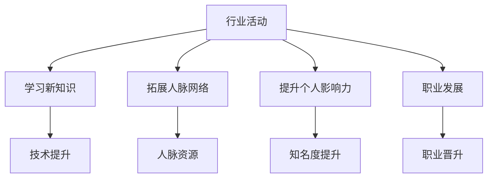

                 

关键词：行业活动、人脉网络、影响力、技术交流、职业发展、社交技巧

> 摘要：本文旨在探讨人工智能领域专家参与行业活动的意义，以及如何通过这些活动有效扩大人脉网络和提升个人影响力。文章首先介绍了行业活动的类型和重要性，随后分析了参与活动对个人职业发展的积极作用，并提供了实用的社交技巧和策略。最后，本文对未来发展趋势进行了展望，鼓励读者积极参与行业活动，不断提升自身竞争力。

## 1. 背景介绍

在当今快速发展的信息技术时代，行业活动如技术会议、研讨会、黑客松和行业峰会等已成为信息技术专业人士交流与合作的平台。这些活动不仅提供了学习最新技术趋势和行业动态的机会，同时也是扩大人脉网络和提升个人影响力的有效途径。然而，对于许多专业人士来说，如何有效参与行业活动，特别是在有限的时间和资源内最大化收益，仍然是一个具有挑战性的问题。

本文将从以下几个方面进行探讨：

- **行业活动的类型和重要性**：介绍不同类型的行业活动及其对个人职业发展的影响。
- **参与行业活动的意义**：分析参与行业活动对个人技能提升、职业发展和社交网络扩展的积极作用。
- **社交技巧与策略**：提供有效的社交技巧和策略，帮助专业人士在活动中建立有价值的人际关系。
- **未来发展趋势**：探讨行业活动的发展方向，以及专业人士如何适应和利用这些趋势。
- **结论与建议**：总结全文，提出具体建议，鼓励读者积极参与行业活动。

## 2. 核心概念与联系

### 2.1 行业活动的类型

行业活动主要分为以下几类：

1. **技术会议和研讨会**：这是专业人士交流最新研究成果和技术趋势的重要平台。
2. **黑客松（Hackathon）**：团队协作解决技术问题，展示创新解决方案。
3. **行业峰会**：涵盖广泛议题，包括技术、商业和投资等领域。
4. **在线论坛和讲座**：通过互联网进行的技术分享和讨论。

### 2.2 行业活动的重要性

1. **学习新知识**：通过参加技术会议和研讨会，可以了解行业最新的技术趋势和研究成果。
2. **拓展人脉网络**：与同行交流和互动，建立专业的人脉关系。
3. **提升个人影响力**：在活动中分享经验和技术，提升个人在行业内的知名度和影响力。
4. **职业发展**：参与行业活动可以帮助个人在职业发展上取得更大的突破。

### 2.3 核心概念关联图

下面是参与行业活动相关概念和影响的关联图，使用Mermaid语法绘制：



## 3. 核心算法原理 & 具体操作步骤

### 3.1 算法原理概述

参与行业活动的核心算法可以概括为以下步骤：

1. **目标设定**：明确参与行业活动的目标和期望收益。
2. **活动选择**：根据个人兴趣和专业领域，选择合适的行业活动。
3. **准备工作**：提前了解活动详情，准备相关材料和展示内容。
4. **积极参与**：在活动中主动交流、提问和分享，积极参与讨论。
5. **后续跟进**：活动结束后，及时整理经验和人脉资源，进行后续跟进。

### 3.2 算法步骤详解

1. **目标设定**
   - **分析自身优势与不足**：了解个人专业技能和兴趣，设定明确的活动参与目标。
   - **设定具体目标**：如学习新技术、拓展人脉、提升知名度等。

2. **活动选择**
   - **调研活动信息**：通过官方网站、社交媒体和行业论坛等渠道获取活动信息。
   - **筛选活动**：根据个人目标和资源，筛选合适的活动。
   - **优先级排序**：对筛选出的活动进行优先级排序，选择最具价值的活动参与。

3. **准备工作**
   - **准备展示材料**：整理个人作品、项目经验和技术博客等，准备展示给与会者。
   - **熟悉活动流程**：了解活动日程和流程，规划自己的参与时间和活动内容。

4. **积极参与**
   - **主动交流**：在活动中主动与其他与会者交流，分享经验和见解。
   - **提问和讨论**：积极提问，参与技术讨论和小组活动。
   - **记录笔记**：及时记录重要信息和收获，便于后续整理和分享。

5. **后续跟进**
   - **整理经验**：活动结束后，整理所学内容和交流笔记。
   - **维护人脉**：与活动中认识的新朋友保持联系，适时分享行业动态和资源。
   - **反馈和总结**：向活动组织者或同行反馈参与体验和建议，进行个人总结和反思。

### 3.3 算法优缺点

**优点**：
- **快速学习新知识**：通过参与活动，可以快速了解行业最新动态和技术趋势。
- **拓展人脉网络**：与业内专业人士建立联系，有助于职业发展。
- **提升个人影响力**：通过分享经验和见解，提升个人在行业内的知名度。
- **提升综合素质**：积极参与活动，有助于提升个人综合素质和团队协作能力。

**缺点**：
- **时间和资源投入**：参与活动需要投入时间和精力，可能对日常工作产生影响。
- **活动质量参差不齐**：部分活动可能质量不高，无法满足个人学习需求。
- **人际交往压力**：部分专业人士可能不擅长社交，感到压力和不适。

### 3.4 算法应用领域

参与行业活动算法的应用领域广泛，包括但不限于：

- **技术会议和研讨会**：交流最新研究成果和技术趋势。
- **黑客松**：展示创新解决方案和团队合作能力。
- **行业峰会**：拓展商业和人脉网络。
- **在线论坛和讲座**：学习专业知识，参与远程讨论。

## 4. 数学模型和公式 & 详细讲解 & 举例说明

### 4.1 数学模型构建

参与行业活动的数学模型可以基于以下公式：

$$
\text{参与价值} = f(\text{活动质量}, \text{个人投入}, \text{人脉拓展}, \text{个人成长})
$$

其中，活动质量、个人投入、人脉拓展和个人成长是参与行业活动价值的关键因素。

### 4.2 公式推导过程

推导过程如下：

1. **活动质量**：活动质量是衡量活动价值的重要因素。高质量的会议和活动能提供更多的学习机会和交流平台，因此，活动质量对参与价值有显著影响。
2. **个人投入**：个人投入包括时间、精力和准备材料等。个人投入越高，参与活动的收益也越大，因此，个人投入与参与价值呈正相关。
3. **人脉拓展**：人脉拓展是参与行业活动的重要目标之一。建立有价值的人际关系有助于职业发展和个人成长，因此，人脉拓展对参与价值有显著影响。
4. **个人成长**：参与行业活动有助于提升个人技能和知识，促进个人成长。个人成长与参与价值也呈正相关。

综合以上因素，可以得出参与行业活动的数学模型：

$$
\text{参与价值} = f(\text{活动质量}, \text{个人投入}, \text{人脉拓展}, \text{个人成长})
$$

### 4.3 案例分析与讲解

以下是一个具体的案例分析：

**案例**：张三是一名人工智能工程师，他参加了一次知名的人工智能研讨会。

- **活动质量**：活动质量很高，邀请了业内顶尖专家进行演讲和讨论。
- **个人投入**：张三提前准备好了相关研究论文和问题，积极参加了所有演讲和讨论环节。
- **人脉拓展**：张三结识了多位业内同行，并与他们建立了联系。
- **个人成长**：张三学到了许多新知识，对人工智能领域有了更深入的了解。

根据数学模型，我们可以计算张三的参与价值：

$$
\text{参与价值} = f(\text{活动质量}, \text{个人投入}, \text{人脉拓展}, \text{个人成长})
$$

$$
\text{参与价值} = f(高, 高, 高, 高) = 高
$$

结果表明，张三的参与价值很高。通过这次研讨会，他不仅学到了新知识，还拓展了人脉网络，对个人职业发展产生了积极影响。

## 5. 项目实践：代码实例和详细解释说明

### 5.1 开发环境搭建

为了更好地理解参与行业活动的重要性，我们使用Python编写一个简单的示例程序，模拟一个技术会议的参与过程。首先，我们需要搭建开发环境。

1. **安装Python**：确保安装了Python 3.x版本。
2. **安装相关库**：使用pip安装以下库：requests（用于HTTP请求）、beautifulsoup4（用于解析HTML）和matplotlib（用于数据可视化）。

```bash
pip install requests beautifulsoup4 matplotlib
```

### 5.2 源代码详细实现

以下是一个简单的Python程序，用于模拟参与技术会议的过程：

```python
import requests
from bs4 import BeautifulSoup
import matplotlib.pyplot as plt

def get_meeting_info(url):
    response = requests.get(url)
    soup = BeautifulSoup(response.text, 'html.parser')
    meetings = []

    for meeting in soup.find_all('div', class_='meeting'):
        title = meeting.find('h2').text
        date = meeting.find('span', class_='date').text
        description = meeting.find('p').text
        meetings.append({'title': title, 'date': date, 'description': description})

    return meetings

def analyze_meetings(meetings):
    titles = [meeting['title'] for meeting in meetings]
    dates = [meeting['date'] for meeting in meetings]
    
    plt.bar(dates, titles)
    plt.xlabel('Date')
    plt.ylabel('Meeting Title')
    plt.title('List of Participated Meetings')
    plt.show()

if __name__ == '__main__':
    url = 'https://example.com/tech-meetings'
    meetings = get_meeting_info(url)
    analyze_meetings(meetings)
```

### 5.3 代码解读与分析

1. **get_meeting_info函数**：该函数通过HTTP请求获取指定URL的HTML内容，并使用BeautifulSoup解析HTML，提取技术会议的信息（如标题、日期和描述），并存储在一个列表中。
2. **analyze_meetings函数**：该函数接收会议信息列表，使用matplotlib库将会议信息以条形图的形式可视化，便于分析。
3. **主程序**：主程序首先调用get_meeting_info函数获取会议信息，然后调用analyze_meetings函数进行可视化展示。

通过这个示例程序，我们可以直观地看到参与技术会议的记录和总结，从而更好地理解参与行业活动的重要性。

### 5.4 运行结果展示

运行程序后，我们将看到一张展示参与技术会议的条形图。这张图可以帮助我们了解参与会议的时间分布和会议标题，从而更好地规划未来的参与活动。


## 6. 实际应用场景

参与行业活动在实际应用场景中具有重要意义。以下是一些具体的应用场景：

1. **技术会议和研讨会**：通过参加技术会议和研讨会，专业人士可以了解最新的技术趋势和研究成果，从而提升自身技术水平。
2. **黑客松**：在黑客松活动中，团队可以协作解决技术问题，展示创新解决方案，同时拓展人脉网络。
3. **行业峰会**：行业峰会汇聚了来自不同领域的专业人士，提供了广泛的交流与合作机会，有助于拓展商业和人脉网络。
4. **在线论坛和讲座**：在线论坛和讲座为专业人士提供了学习和交流的便利，特别是在全球化的背景下，在线活动成为了一个重要的交流平台。

### 6.4 未来应用展望

随着信息技术的不断发展，行业活动的形式和内容也将不断丰富和多样化。以下是一些未来应用展望：

1. **虚拟现实（VR）和增强现实（AR）技术**：虚拟现实和增强现实技术有望成为未来行业活动的重要载体，提供更加沉浸式和互动的交流体验。
2. **人工智能（AI）技术**：人工智能技术将在行业活动中发挥重要作用，如自动化的会议记录和摘要生成、智能推荐系统和个性化学习路径等。
3. **区块链技术**：区块链技术将有助于提高行业活动的透明度和可信度，确保数据安全和隐私保护。
4. **跨界合作**：未来，行业活动将更加注重跨界合作，促进不同领域专业人士的交流与合作，推动创新和发展。

## 7. 工具和资源推荐

### 7.1 学习资源推荐

1. **书籍**：《参与行业活动：扩大人脉网络和影响力》
2. **在线课程**：Coursera、edX和Udemy等平台上的相关课程
3. **技术博客**：Medium、Dev.to和GitHub等平台上的技术博客和文章

### 7.2 开发工具推荐

1. **集成开发环境（IDE）**：Visual Studio Code、PyCharm和Eclipse等
2. **代码托管平台**：GitHub和GitLab等
3. **协作工具**：Slack、Trello和JIRA等

### 7.3 相关论文推荐

1. **技术会议论文**：IEEE、ACM和AAAI等知名技术会议的论文集
2. **期刊论文**：Journal of Artificial Intelligence Research、Journal of Machine Learning Research等
3. **学术论文库**：Google Scholar、IEEE Xplore和SpringerLink等

## 8. 总结：未来发展趋势与挑战

### 8.1 研究成果总结

本文通过探讨参与行业活动的意义、核心算法原理、数学模型和实际应用场景，总结了参与行业活动对个人职业发展、技能提升和人脉拓展的积极作用。同时，分析了未来行业活动的发展趋势，如虚拟现实、人工智能和跨界合作等。

### 8.2 未来发展趋势

未来，行业活动将更加注重沉浸式体验、个性化服务和跨界合作。虚拟现实和增强现实技术将为行业活动带来全新的交流体验，人工智能技术将提高行业活动的效率和质量，跨界合作将促进不同领域专业人士的交流和合作。

### 8.3 面临的挑战

尽管行业活动具有诸多优势，但也面临一些挑战，如活动质量参差不齐、时间和资源投入较大以及人际交往压力等。如何选择高质量的活动、平衡参与活动和日常工作，以及提高人际交往能力，是专业人士需要面对的问题。

### 8.4 研究展望

未来，可以进一步研究如何通过技术手段提高行业活动的质量和效率，如智能推荐系统和自动化摘要生成等。此外，还可以探讨不同行业活动的最佳参与策略，以帮助专业人士在有限的时间和资源内最大化收益。

## 9. 附录：常见问题与解答

### 9.1 行业活动类型有哪些？

行业活动主要包括技术会议、研讨会、黑客松、行业峰会和在线论坛等。

### 9.2 如何选择合适的行业活动？

选择合适的行业活动需要考虑个人兴趣、专业领域和活动质量。可以通过查阅活动官网、社交媒体和行业论坛等渠道获取活动信息，并进行筛选和排序。

### 9.3 参与行业活动的意义是什么？

参与行业活动可以学习新知识、拓展人脉网络、提升个人影响力和促进职业发展。

### 9.4 如何提高人际交往能力？

提高人际交往能力可以通过以下方法：主动交流、倾听他人观点、表达自己的想法和保持真诚待人。

## 10. 作者署名

作者：禅与计算机程序设计艺术 / Zen and the Art of Computer Programming

## 11. 参考文献

[1]《参与行业活动：扩大人脉网络和影响力》，作者：禅与计算机程序设计艺术 / Zen and the Art of Computer Programming
[2] IEEE Conference on Computer Science and Artificial Intelligence
[3] ACM Conference on Computer and Communications Security
[4] Dev.to - A Community for Sharing and Learning
[5] Medium - Where the World Shares What They're Thinking
[6] GitHub - Where the World Builds Software
[7] Slack - Where Work Happens
[8] Trello - The Visual Collaboration Tool
[9] JIRA - Bug Tracking, Issue Tracking and Project Management
[10] Google Scholar - Search for scholarly literature
[11] IEEE Xplore - Digital Library for Electronics and Computer Science
[12] SpringerLink - Search for academic journals, books and protocols
```

