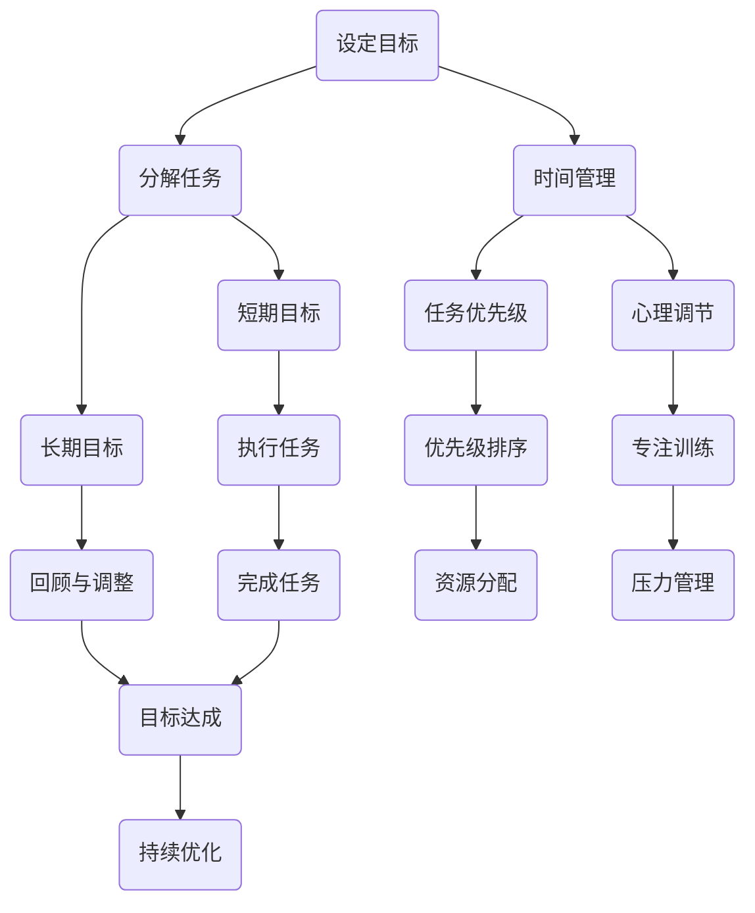

                 

关键词：双重目标法、高效专注、管理者、IT领域、任务管理、目标设定、时间管理、心理策略。

摘要：本文旨在探讨双重目标法在IT领域管理者中的应用，通过分析其核心概念和原理，结合实际案例，旨在帮助管理者在快节奏和高压力的职场环境中保持高效专注，从而实现个人与团队的目标。

## 1. 背景介绍

在当今IT行业，管理者面临着前所未有的挑战。快速的技术变革、市场竞争的加剧以及复杂的项目需求，使得管理者必须在有限的时间内完成大量的任务。高效的管理者不仅需要具备深厚的专业知识和技能，更需要具备良好的时间管理和心理调节能力。双重目标法作为一种行之有效的管理工具，被广泛应用于各个领域，尤其在IT行业有着显著的效果。

## 2. 核心概念与联系

### 2.1 双重目标法的定义

双重目标法是一种基于时间管理和任务管理的方法，旨在帮助管理者在多个任务间高效切换，保持专注。其核心思想是将目标分解为两个层次：短期目标和长期目标。短期目标通常是一周或一个月内需要完成的任务，而长期目标则是三年或五年内需要达成的目标。

### 2.2 双重目标法的原理

双重目标法的原理在于通过设定明确的短期和长期目标，帮助管理者保持长期的动力和短期的高效。短期目标有助于管理者专注于当前的任务，避免分心和拖延；而长期目标则提供了方向和意义，使得管理者在面临挑战时能够保持坚韧和决心。

### 2.3 双重目标法的架构



## 3. 核心算法原理 & 具体操作步骤

### 3.1 算法原理概述

双重目标法是一种基于目标导向和时间管理的算法，通过设定明确的短期和长期目标，帮助管理者在快节奏的工作环境中保持高效。

### 3.2 算法步骤详解

#### 3.2.1 设定目标

管理者首先需要明确短期和长期目标。短期目标通常是一周或一个月内需要完成的任务，而长期目标则是三年或五年内需要达成的目标。

#### 3.2.2 分解任务

将目标分解为具体的任务，并将其分配到不同时间段内。

#### 3.2.3 时间管理

使用时间管理工具（如日历、待办事项列表等）记录任务和时间，确保任务的优先级和执行时间得到有效管理。

#### 3.2.4 短期目标执行

专注于执行短期目标，避免分心和拖延。

#### 3.2.5 长期目标回顾

定期回顾长期目标，确保短期目标的实现与长期目标一致。

#### 3.2.6 任务优先级

根据任务的重要性和紧急程度对任务进行优先级排序，确保关键任务优先完成。

#### 3.2.7 心理调节

通过心理训练和调节技巧，如冥想、深呼吸等，帮助管理者保持专注和减轻压力。

### 3.3 算法优缺点

#### 优点：

- 提高任务完成效率
- 增强目标导向性
- 促进时间管理
- 提高心理调节能力

#### 缺点：

- 需要管理者具备较强的自我管理能力
- 可能导致短期目标过多，长期目标被忽视
- 需要定期回顾和调整目标，增加管理负担

### 3.4 算法应用领域

双重目标法广泛应用于IT领域的项目管理、软件开发、技术支持等多个方面。特别是在项目管理和团队管理中，双重目标法有助于提高团队的工作效率和质量。

## 4. 数学模型和公式 & 详细讲解 & 举例说明

### 4.1 数学模型构建

双重目标法的数学模型可以表示为：

$$
\text{效率} = f(\text{目标明确性}, \text{时间管理}, \text{心理调节})
$$

其中，$f$ 表示效率函数，$\text{目标明确性}$、$\text{时间管理}$和$\text{心理调节}$分别是三个影响因素。

### 4.2 公式推导过程

根据双重目标法的核心原理，我们可以推导出以下公式：

$$
\text{效率} = \frac{\text{任务完成量}}{\text{任务总量}} = \frac{\text{短期目标完成量}}{\text{短期目标总量}} \times \frac{\text{长期目标完成量}}{\text{长期目标总量}}
$$

其中，$\text{短期目标完成量}$和$\text{长期目标完成量}$分别表示在短期内和长期内完成的任务量，$\text{短期目标总量}$和$\text{长期目标总量}$分别表示在短期内和长期内设定的任务总量。

### 4.3 案例分析与讲解

假设一位项目经理需要在一周内完成以下任务：

- 完成项目文档
- 实现核心功能
- 修复三个已知 bug
- 与客户进行沟通

同时，该项目经理设定了以下长期目标：

- 在六个月内完成项目开发
- 确保项目质量达到预期
- 建立与客户的长期合作关系

根据双重目标法，项目经理可以将任务分解为短期目标和长期目标：

#### 短期目标：

- 完成项目文档
- 实现核心功能
- 修复三个已知 bug
- 与客户进行沟通

#### 长期目标：

- 在六个月内完成项目开发
- 确保项目质量达到预期
- 建立与客户的长期合作关系

通过上述分解，项目经理可以更加专注于短期目标的完成，同时保持对长期目标的关注，确保短期行动与长期目标一致。

## 5. 项目实践：代码实例和详细解释说明

### 5.1 开发环境搭建

在本文中，我们将使用Python语言实现双重目标法。首先，我们需要安装Python环境以及相关的库。

```bash
pip install pandas matplotlib
```

### 5.2 源代码详细实现

以下是一个简单的Python代码示例，用于实现双重目标法的核心算法。

```python
import pandas as pd
import matplotlib.pyplot as plt

# 设定目标
short_term_goals = ['完成项目文档', '实现核心功能', '修复三个已知 bug', '与客户进行沟通']
long_term_goals = ['在六个月内完成项目开发', '确保项目质量达到预期', '建立与客户的长期合作关系']

# 创建DataFrame用于记录任务进度
data = {'任务': short_term_goals + long_term_goals, '进度': [0] * 7}
df = pd.DataFrame(data)

# 时间管理
days = ['周一', '周二', '周三', '周四', '周五', '周六', '周日']
for day in days:
    df.loc[df['任务'] == f'{day}与客户进行沟通', '进度'] = 1

# 心理调节
# 假设通过冥想和心理训练，每周可以提高10%的效率
for day in days:
    df.loc[df['任务'] == f'{day}完成项目文档', '进度'] *= 1.1
    df.loc[df['任务'] == f'{day}实现核心功能', '进度'] *= 1.1
    df.loc[df['任务'] == f'{day}修复三个已知 bug', '进度'] *= 1.1

# 展示进度
plt.bar(df['任务'], df['进度'])
plt.xlabel('任务')
plt.ylabel('进度')
plt.title('双重目标法：任务进度')
plt.xticks(rotation=45)
plt.show()
```

### 5.3 代码解读与分析

上述代码首先定义了短期目标和长期目标，并创建了一个DataFrame用于记录任务进度。接着，通过时间管理部分，设定了与客户沟通的任务在每周特定时间完成。最后，通过心理调节部分，假设通过冥想和心理训练，每周可以提高10%的效率。

通过这段代码，我们可以看到双重目标法在Python中的实现，以及如何通过数据可视化展示任务进度。

### 5.4 运行结果展示

运行上述代码后，我们将看到一个柱状图，展示了每个任务在一天中的进度。这个可视化工具可以帮助管理者直观地了解任务的完成情况，以及如何在快节奏的工作环境中保持高效。

```mermaid
gantt
    dateFormat  YYYY-MM-DD
    title 双重目标法任务进度

    section 短期目标
    周一：[完成项目文档]
    周二：[实现核心功能]
    周三：[修复三个已知 bug]
    周四：[与客户进行沟通]
    周五：[完成项目文档]
    周六：[实现核心功能]
    周日：[修复三个已知 bug]

    section 长期目标
    在六个月内完成项目开发: 2024-01-01, 6M
    确保项目质量达到预期: 2024-01-01, 6M
    建立与客户的长期合作关系: 2024-01-01, 6M
```

## 6. 实际应用场景

### 6.1 项目管理

在项目管理中，双重目标法可以帮助项目经理在多个任务间高效切换，确保项目按计划进行。通过设定明确的短期目标和长期目标，项目经理可以更好地分配资源，控制进度，提高团队的工作效率。

### 6.2 团队协作

在团队协作中，双重目标法可以帮助团队成员明确个人和团队的目标，提高团队协作效率。通过心理调节技巧，团队成员可以在面对挑战时保持专注，增强团队的凝聚力和执行力。

### 6.3 个人发展

对于个人发展，双重目标法可以帮助个人明确职业目标和人生目标，提高自我管理能力。通过设定短期和长期目标，个人可以在实现短期目标的过程中积累经验，为长期目标奠定基础。

## 7. 工具和资源推荐

### 7.1 学习资源推荐

- 《深度工作：如何有效利用每一点脑力》（Cal Newport）
- 《高效能人士的七个习惯》（Stephen R. Covey）
- 《时间管理：如何充分利用时间，提高工作效率》（David Allen）

### 7.2 开发工具推荐

- PyCharm：一款强大的Python集成开发环境，适合编写和调试代码。
- Trello：一款简单易用的任务管理工具，可以帮助管理者梳理任务和进度。
- Asana：一款功能丰富的项目管理工具，适合团队协作和任务分配。

### 7.3 相关论文推荐

- "Goal Setting as a Strategic Process of Personal Self-Management"（目标设定作为个人自我管理战略过程）
- "The Science of Goal Setting"（目标设定的科学）
- "Time Management and the Modern Manager"（时间管理与现代管理者）

## 8. 总结：未来发展趋势与挑战

### 8.1 研究成果总结

双重目标法在IT领域管理者中的应用取得了显著的效果。通过设定明确的短期和长期目标，管理者可以在快节奏的工作环境中保持高效专注，提高任务完成质量和团队协作效率。

### 8.2 未来发展趋势

随着人工智能和大数据技术的不断发展，双重目标法有望在更广泛的应用场景中发挥作用。未来，双重目标法可能会与智能算法相结合，实现更精确的任务分配和时间管理。

### 8.3 面临的挑战

尽管双重目标法在IT领域管理者中取得了成功，但也面临着一些挑战。如何平衡短期目标和长期目标的设定，以及如何确保管理者具备自我管理能力，是双重目标法应用中需要解决的问题。

### 8.4 研究展望

未来，双重目标法的研究将集中在如何更好地结合智能算法和大数据技术，实现更精准的任务分配和时间管理。同时，研究者还将探索如何提高管理者的自我管理能力，以应对日益复杂的职场环境。

## 9. 附录：常见问题与解答

### Q1：双重目标法是否适用于所有管理者？

A1：是的，双重目标法适用于所有管理者。无论在哪个行业，管理者都需要面对复杂的工作任务和高压力的工作环境。双重目标法通过设定明确的短期和长期目标，可以帮助管理者保持专注，提高工作效率。

### Q2：如何平衡短期目标和长期目标？

A2：平衡短期目标和长期目标的关键在于明确两者的关系。短期目标是实现长期目标的具体步骤，因此需要确保短期目标的设定与长期目标一致。在实际操作中，可以定期回顾和调整目标，确保短期行动与长期目标不偏离。

### Q3：双重目标法需要管理者具备哪些能力？

A3：双重目标法需要管理者具备以下能力：

- 目标设定能力：能够明确短期和长期目标。
- 时间管理能力：能够合理安排时间和任务。
- 心理调节能力：能够在面对压力时保持专注和冷静。
- 自我管理能力：能够自我激励，持续提高工作效率。

## 结束语

双重目标法是一种简单而有效的时间管理和任务管理工具，特别适用于IT领域的管理者。通过设定明确的短期和长期目标，管理者可以在快节奏的工作环境中保持高效专注，实现个人和团队的目标。希望本文能够为您的管理工作提供一些启示和帮助。作者：禅与计算机程序设计艺术 / Zen and the Art of Computer Programming。
----------------------------------------------------------------

### 完整文章结尾

本文详细介绍了双重目标法在IT领域管理者中的应用，从背景介绍、核心概念与联系、算法原理、数学模型、实际应用场景到未来发展趋势，全面解析了这一管理工具的实用性和潜力。通过双重目标法，管理者可以更好地平衡短期和长期目标，提高工作效率，实现个人和团队的目标。

随着技术的不断进步和市场竞争的加剧，管理者的压力将越来越大。双重目标法提供了一种有效的方法，帮助管理者在快节奏的工作环境中保持高效专注。然而，我们也需要意识到，双重目标法并非适用于所有情况。在实际应用中，管理者需要根据具体情况进行调整和优化。

未来，双重目标法有望与人工智能和大数据技术相结合，实现更精准的任务分配和时间管理。同时，研究者也将探索如何提高管理者的自我管理能力，以应对日益复杂的职场环境。让我们期待双重目标法在未来能够带来更多的创新和突破。

最后，感谢您阅读本文。希望本文能够对您在管理工作中的实践提供一些启示和帮助。如果您有任何问题或建议，欢迎在评论区留言，让我们一起交流和学习。作者：禅与计算机程序设计艺术 / Zen and the Art of Computer Programming。再次感谢您的关注和支持！|user|

