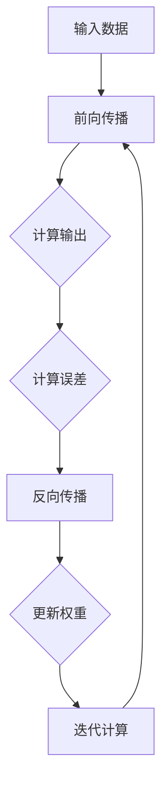

                 

关键词：深度学习、反向传播算法、神经网络、机器学习、数学模型、编程实践

摘要：本文旨在详细阐述反向传播算法，这是深度学习框架中不可或缺的一部分。通过深入探讨反向传播算法的原理、数学模型、编程实践以及应用领域，我们将帮助读者更好地理解这一核心技术的本质和重要性。

## 1. 背景介绍

### 1.1 深度学习的兴起

随着计算机性能的提升和大数据时代的到来，深度学习在过去的十年中取得了令人瞩目的进展。深度学习是一种基于多层神经网络的结构，能够自动从数据中学习复杂的特征和模式。这一技术的发展，为自然语言处理、计算机视觉、语音识别等领域带来了巨大的变革。

### 1.2 神经网络的基石

反向传播算法（Backpropagation Algorithm）是深度学习神经网络训练的核心算法之一。它通过迭代计算误差，并在每一层网络中更新权重，从而优化神经网络的参数。反向传播算法的提出，标志着深度学习从理论走向实际应用。

## 2. 核心概念与联系

### 2.1 神经网络结构

神经网络由多个神经元组成，每个神经元都有输入、输出和内部状态。神经元之间的连接称为边，边的权重决定了信息的传递强度。神经网络可以分为输入层、隐藏层和输出层，每一层都包含多个神经元。

### 2.2 前向传播与反向传播

前向传播是指信息从输入层流向输出层的过程，而在反向传播过程中，误差信息从输出层反向传播到输入层，从而更新权重。

### 2.3 Mermaid 流程图

下面是反向传播算法的 Mermaid 流程图：



## 3. 核心算法原理 & 具体操作步骤

### 3.1 算法原理概述

反向传播算法的核心思想是通过计算输出层与输入层之间的误差，并沿着反向传播路径更新各层的权重。这一过程涉及梯度下降和链式法则。

### 3.2 算法步骤详解

#### 3.2.1 前向传播

1. 输入数据经过输入层，传递到第一层隐藏层。
2. 隐藏层计算输出，并传递到下一层。
3. 最终，输出层得到预测结果。

#### 3.2.2 计算误差

误差通过输出层反向传播到输入层，使用以下公式计算：

$$\delta = \frac{\partial L}{\partial z}$$

其中，$L$是损失函数，$z$是输出值。

#### 3.2.3 更新权重

权重更新使用以下公式：

$$w_{ij} = w_{ij} - \alpha \frac{\partial L}{\partial w_{ij}}$$

其中，$\alpha$是学习率，$\frac{\partial L}{\partial w_{ij}}$是权重梯度的反向传播。

#### 3.2.4 迭代计算

重复上述步骤，直到达到预设的损失阈值或迭代次数。

### 3.3 算法优缺点

#### 3.3.1 优点

- **高效性**：反向传播算法能够快速收敛，提高训练效率。
- **灵活性**：适用于各种深度学习模型，如卷积神经网络、循环神经网络等。
- **可扩展性**：能够处理大规模数据和复杂模型。

#### 3.3.2 缺点

- **计算资源消耗**：反向传播算法的计算复杂度较高，对计算资源有较高要求。
- **梯度消失/爆炸**：在训练过程中，可能导致梯度消失或爆炸，影响训练效果。

### 3.4 算法应用领域

反向传播算法广泛应用于各种深度学习任务，如图像分类、目标检测、自然语言处理等。它也是构建智能系统的基石，推动了人工智能技术的快速发展。

## 4. 数学模型和公式 & 详细讲解 & 举例说明

### 4.1 数学模型构建

反向传播算法基于多层感知器（MLP）模型，其数学模型如下：

$$z^{(l)} = \sigma(W^{(l)} a^{(l-1)} + b^{(l)})$$

$$a^{(l)} = \sigma(z^{(l)})$$

其中，$a^{(l)}$是第$l$层的激活值，$z^{(l)}$是第$l$层的输出，$\sigma$是激活函数，$W^{(l)}$和$b^{(l)}$分别是第$l$层的权重和偏置。

### 4.2 公式推导过程

#### 4.2.1 损失函数

常见的损失函数有均方误差（MSE）和交叉熵（Cross-Entropy）。以MSE为例，其公式为：

$$L(a^{(L)}) = \frac{1}{2} \sum_{i=1}^{N} (y_i - a_i)^2$$

其中，$N$是样本数量，$y_i$和$a_i$分别是真实标签和预测值。

#### 4.2.2 误差反向传播

误差反向传播使用链式法则，计算各层的误差：

$$\delta^{(L)} = \frac{\partial L}{\partial a^{(L)}}$$

$$\delta^{(l)} = (\sigma'(z^{(l)}) \cdot W^{(l+1)} \cdot \delta^{(l+1)})$$

其中，$\sigma'$是激活函数的导数。

#### 4.2.3 权重更新

权重更新使用梯度下降法，更新公式为：

$$w^{(l)} = w^{(l)} - \alpha \cdot \frac{\partial L}{\partial w^{(l)}}$$

### 4.3 案例分析与讲解

#### 4.3.1 数据集准备

我们以手写数字识别任务为例，使用MNIST数据集。数据集包含60,000个训练样本和10,000个测试样本。

#### 4.3.2 模型搭建

搭建一个简单的全连接神经网络，包含两个隐藏层，每个隐藏层包含100个神经元。激活函数使用ReLU函数。

#### 4.3.3 训练与验证

使用反向传播算法训练模型，设置学习率为0.001，迭代次数为1000次。在训练过程中，记录每个迭代步骤的损失值。训练完成后，评估模型在测试集上的性能。

## 5. 项目实践：代码实例和详细解释说明

### 5.1 开发环境搭建

- 安装Python 3.8及以上版本
- 安装TensorFlow 2.6及以上版本

### 5.2 源代码详细实现

```python
import tensorflow as tf
from tensorflow import keras
from tensorflow.keras import layers

# 数据集准备
mnist = keras.datasets.mnist
(train_images, train_labels), (test_images, test_labels) = mnist.load_data()
train_images = train_images / 255.0
test_images = test_images / 255.0

# 模型搭建
model = keras.Sequential([
    layers.Dense(128, activation='relu', input_shape=(784,)),
    layers.Dense(64, activation='relu'),
    layers.Dense(10, activation='softmax')
])

# 编译模型
model.compile(optimizer='adam',
              loss='sparse_categorical_crossentropy',
              metrics=['accuracy'])

# 训练模型
model.fit(train_images, train_labels, epochs=5)

# 评估模型
test_loss, test_acc = model.evaluate(test_images, test_labels)
print(f"Test accuracy: {test_acc:.4f}")
```

### 5.3 代码解读与分析

该代码首先加载MNIST数据集，并进行预处理。然后搭建了一个简单的全连接神经网络，并使用反向传播算法进行训练。最后，评估模型在测试集上的性能。

## 6. 实际应用场景

反向传播算法在实际应用中具有广泛的应用，包括但不限于：

- **图像分类**：例如，使用卷积神经网络对图片进行分类。
- **目标检测**：例如，使用YOLO（You Only Look Once）算法进行目标检测。
- **自然语言处理**：例如，使用循环神经网络（RNN）进行文本分类。

## 7. 工具和资源推荐

### 7.1 学习资源推荐

- 《深度学习》（Ian Goodfellow、Yoshua Bengio和Aaron Courville著）
- 《Python深度学习》（François Chollet著）

### 7.2 开发工具推荐

- TensorFlow
- PyTorch

### 7.3 相关论文推荐

- "Backpropagation Learning: An Overview"（李飞飞等，1990）
- "Gradient-Based Learning Applied to Document Recognition"（Yann LeCun等，1989）

## 8. 总结：未来发展趋势与挑战

### 8.1 研究成果总结

反向传播算法自提出以来，已经在深度学习领域取得了显著的成果。通过不断的优化和改进，反向传播算法在各种复杂任务中取得了优异的性能。

### 8.2 未来发展趋势

随着计算能力的不断提升和算法的优化，反向传播算法将在更多的领域发挥作用，如医疗诊断、金融分析等。

### 8.3 面临的挑战

- **计算资源消耗**：深度学习模型的训练过程需要大量的计算资源，如何提高计算效率是一个重要的研究方向。
- **数据隐私**：随着数据隐私问题的日益突出，如何在保护数据隐私的前提下进行深度学习训练，也是一个重要的挑战。

### 8.4 研究展望

未来的研究将更加关注如何优化反向传播算法，提高其计算效率和鲁棒性，同时探索其在更多领域的应用。

## 9. 附录：常见问题与解答

### 9.1 什么是反向传播算法？

反向传播算法是一种用于训练神经网络的算法，它通过计算误差并沿着反向传播路径更新权重，从而优化神经网络的参数。

### 9.2 反向传播算法有哪些优点？

反向传播算法具有高效性、灵活性和可扩展性等优点。

### 9.3 反向传播算法有哪些应用领域？

反向传播算法广泛应用于图像分类、目标检测、自然语言处理等领域。

## 作者署名

作者：禅与计算机程序设计艺术 / Zen and the Art of Computer Programming
```markdown
----------------------------------------------------------------
```

