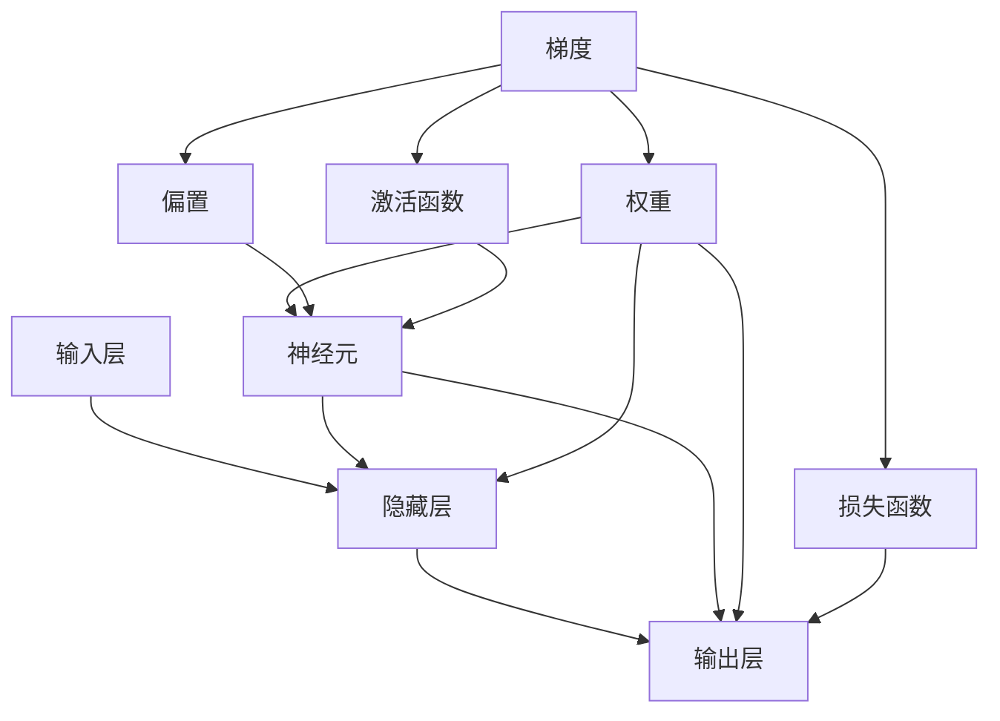

                 

关键词：反向传播、梯度下降、神经网络、权重更新、深度学习、机器学习、数学模型

> 摘要：本文详细介绍了反向传播算法的基本原理和权重更新的过程，包括梯度的概念、计算方法以及在实际应用中的具体实现步骤。通过数学模型和公式推导，深入探讨了反向传播算法在深度学习中的重要性，并结合实际项目案例，提供了代码实例和解析。

## 1. 背景介绍

反向传播（Backpropagation）是深度学习中一种重要的学习算法，主要用于神经网络模型的训练和优化。它通过计算网络输出与真实值之间的误差，并反向传播这些误差到网络的各个层，从而不断调整网络的权重和偏置，使网络输出更接近真实值。

反向传播算法的出现极大地推动了神经网络和深度学习的发展，使得计算机视觉、自然语言处理等领域取得了突破性进展。本文将重点介绍反向传播算法的原理和实现步骤，帮助读者深入理解这一核心技术。

## 2. 核心概念与联系

在深入探讨反向传播算法之前，我们需要了解一些核心概念，包括神经元、神经网络、梯度、损失函数等。下面通过一个Mermaid流程图来描述这些概念之间的联系。



### 2.1 神经元

神经元是神经网络的基本组成单元，类似于人类大脑中的神经元。每个神经元接收多个输入信号，并通过权重和偏置进行加权求和，然后通过激活函数产生输出。

### 2.2 隐藏层

隐藏层是神经网络中的一个或多个中间层，用于提取和转换输入特征。隐藏层的数量和神经元个数可以根据具体任务进行调整。

### 2.3 输出层

输出层是神经网络的最后一层，用于生成最终预测结果。输出层的神经元个数和类型取决于具体的应用场景，例如在分类任务中，通常使用softmax函数作为激活函数。

### 2.4 权重

权重是连接神经元的参数，用于控制输入信号在神经元间的传递强度。通过反向传播算法，可以自动调整权重，使网络输出更接近真实值。

### 2.5 偏置

偏置是神经元的额外输入，用于调整神经元的阈值。偏置同样可以通过反向传播算法进行学习。

### 2.6 激活函数

激活函数是神经元输出前的非线性变换，用于引入非线性的特性，使神经网络具有更强的表达能力。常见的激活函数包括sigmoid、ReLU、tanh等。

### 2.7 损失函数

损失函数用于衡量网络输出与真实值之间的差异。常用的损失函数包括均方误差（MSE）、交叉熵损失等。通过优化损失函数，可以调整网络参数，使输出更接近真实值。

### 2.8 梯度

梯度是反向传播算法的核心概念，表示损失函数关于网络参数的导数。通过计算梯度，可以确定网络参数的更新方向和幅度。

## 3. 核心算法原理 & 具体操作步骤

### 3.1 算法原理概述

反向传播算法的基本原理可以概括为以下几个步骤：

1. **前向传播**：将输入信号从输入层传播到输出层，计算每个神经元的输出值。
2. **计算损失**：根据输出值和真实值计算损失函数的值。
3. **后向传播**：计算损失函数关于网络参数的梯度，并从输出层反向传播到输入层。
4. **权重更新**：根据梯度调整网络参数，使损失函数的值减小。

### 3.2 算法步骤详解

下面详细讲解反向传播算法的具体步骤。

### 3.2.1 前向传播

前向传播是反向传播的前提，其目的是计算网络输出。具体步骤如下：

1. **初始化参数**：设置网络初始权重和偏置。
2. **计算每个神经元的输入值**：对于每个神经元，计算其输入值（包括前一层神经元的输出和连接权重）。
3. **应用激活函数**：对每个神经元的输入值应用激活函数，得到神经元的输出值。
4. **传播输出值**：将输出值传递到下一层。

### 3.2.2 计算损失

计算损失函数的值是评估网络性能的重要步骤。具体步骤如下：

1. **计算输出误差**：将网络输出与真实值进行比较，得到输出误差。
2. **计算损失函数值**：根据输出误差计算损失函数的值。例如，在分类任务中，可以使用交叉熵损失函数。

### 3.2.3 后向传播

后向传播是反向传播算法的核心，其目的是计算损失函数关于网络参数的梯度。具体步骤如下：

1. **计算输出层梯度**：根据输出误差和激活函数的导数，计算输出层每个神经元的梯度。
2. **反向传播梯度**：从输出层开始，依次计算隐藏层和输入层每个神经元的梯度。
3. **计算权重梯度**：根据梯度计算权重和偏置的梯度。

### 3.2.4 权重更新

权重更新是调整网络参数的关键步骤，其目的是使损失函数的值减小。具体步骤如下：

1. **设置学习率**：学习率是调整权重的步长，需要设置一个适当的值。
2. **计算权重更新值**：根据梯度和学习率，计算每个权重的更新值。
3. **更新权重**：将权重更新值应用到网络参数，完成权重更新。

### 3.3 算法优缺点

反向传播算法具有以下优点：

1. **自动调整参数**：通过反向传播梯度自动调整网络参数，使输出更接近真实值。
2. **高效性**：反向传播算法的计算效率较高，适用于大规模网络和大数据集。

然而，反向传播算法也存在一些缺点：

1. **局部最小值问题**：在某些情况下，反向传播算法可能陷入局部最小值，导致网络性能不佳。
2. **计算复杂度**：反向传播算法的计算复杂度较高，对于大型网络和深层数据可能导致计算资源消耗较大。

### 3.4 算法应用领域

反向传播算法广泛应用于深度学习领域的各个子领域，包括：

1. **计算机视觉**：用于图像分类、目标检测、人脸识别等任务。
2. **自然语言处理**：用于文本分类、机器翻译、情感分析等任务。
3. **语音识别**：用于语音信号处理、语音合成等任务。

## 4. 数学模型和公式 & 详细讲解 & 举例说明

### 4.1 数学模型构建

反向传播算法的核心在于计算梯度，即损失函数关于网络参数的导数。为了讲解梯度计算过程，我们先构建一个简单的数学模型。

假设我们有一个简单的神经网络，包含一个输入层、一个隐藏层和一个输出层。输入层有3个神经元，隐藏层有2个神经元，输出层有1个神经元。输入数据为$x_1, x_2, x_3$，真实标签为$y$。

### 4.2 公式推导过程

下面我们使用LaTeX格式详细推导反向传播算法的公式。

$$
\begin{aligned}
\text{前向传播} \\
& \text{输入层：} z_1 = x_1, z_2 = x_2, z_3 = x_3 \\
& \text{隐藏层：} a_1 = \sigma(z_1 \cdot w_{11} + z_2 \cdot w_{12} + z_3 \cdot w_{13} + b_1), a_2 = \sigma(z_1 \cdot w_{21} + z_2 \cdot w_{22} + z_3 \cdot w_{23} + b_2) \\
& \text{输出层：} y' = a_1 \cdot w_{31} + a_2 \cdot w_{32} + b_3 \\
\text{计算损失} \\
& \text{损失函数：} L = \frac{1}{2} (y - y')^2 \\
\text{后向传播} \\
& \text{输出层：} \delta_3 = (y - y') \cdot \frac{d\sigma}{dx} \\
& \text{隐藏层：} \delta_2 = (w_{31} \cdot \delta_3 + w_{32} \cdot \delta_3) \cdot \frac{d\sigma}{dx} \\
& \text{输入层：} \delta_1 = (w_{21} \cdot \delta_2 + w_{22} \cdot \delta_2) \cdot \frac{d\sigma}{dx} \\
\text{权重更新} \\
& \text{学习率：} \eta \\
& \text{权重更新：} w_{11} = w_{11} - \eta \cdot \delta_1 \cdot z_1 \\
& \text{权重更新：} w_{12} = w_{12} - \eta \cdot \delta_1 \cdot z_2 \\
& \text{权重更新：} w_{13} = w_{13} - \eta \cdot \delta_1 \cdot z_3 \\
& \text{权重更新：} w_{21} = w_{21} - \eta \cdot \delta_2 \cdot a_1 \\
& \text{权重更新：} w_{22} = w_{22} - \eta \cdot \delta_2 \cdot a_2 \\
& \text{权重更新：} w_{31} = w_{31} - \eta \cdot \delta_3 \cdot y' \\
& \text{权重更新：} w_{32} = w_{32} - \eta \cdot \delta_3 \cdot y'
\end{aligned}
$$

### 4.3 案例分析与讲解

为了更好地理解反向传播算法，我们来看一个简单的案例。

假设我们有一个二分类问题，输入数据为$(x_1, x_2)$，输出为$y$。真实标签为0或1。使用Sigmoid函数作为激活函数，均方误差（MSE）作为损失函数。

输入数据：$(x_1, x_2) = (2, 3)$，真实标签：$y = 1$。

### 4.3.1 前向传播

首先，我们需要初始化权重和偏置。假设初始权重为$w_1 = 0.5$，$w_2 = 0.5$，偏置为$b_1 = 0.5$，$b_2 = 0.5$。

输入层：$z_1 = x_1 = 2$，$z_2 = x_2 = 3$。

隐藏层：$a_1 = \sigma(z_1 \cdot w_1 + z_2 \cdot w_2 + b_1) = \sigma(2 \cdot 0.5 + 3 \cdot 0.5 + 0.5) = \sigma(2.5) = 0.9$。

输出层：$y' = a_1 \cdot w_3 + b_3 = 0.9 \cdot 0.5 + 0.5 = 0.65$。

### 4.3.2 计算损失

损失函数为MSE：

$$
L = \frac{1}{2} (y - y')^2 = \frac{1}{2} (1 - 0.65)^2 = 0.0225
$$

### 4.3.3 后向传播

我们需要计算隐藏层和输出层的梯度。

输出层：

$$
\delta_3 = (y - y') \cdot \frac{d\sigma}{dx} = (1 - 0.65) \cdot (1 - 0.9) = 0.35 \cdot 0.1 = 0.035
$$

隐藏层：

$$
\delta_1 = (w_3 \cdot \delta_3) \cdot \frac{d\sigma}{dx} = 0.5 \cdot 0.035 = 0.0175
$$

### 4.3.4 权重更新

学习率为$\eta = 0.1$。

$$
w_1 = w_1 - \eta \cdot \delta_1 \cdot z_1 = 0.5 - 0.1 \cdot 0.0175 \cdot 2 = 0.485
$$

$$
w_2 = w_2 - \eta \cdot \delta_1 \cdot z_2 = 0.5 - 0.1 \cdot 0.0175 \cdot 3 = 0.465
$$

$$
w_3 = w_3 - \eta \cdot \delta_3 \cdot y' = 0.5 - 0.1 \cdot 0.035 \cdot 0.65 = 0.485
$$

## 5. 项目实践：代码实例和详细解释说明

### 5.1 开发环境搭建

为了演示反向传播算法，我们将使用Python编程语言，并依赖以下库：

- NumPy：用于矩阵运算。
- TensorFlow：用于构建和训练神经网络。

首先，确保已安装这些库：

```bash
pip install numpy tensorflow
```

### 5.2 源代码详细实现

下面是一个简单的反向传播算法的实现示例：

```python
import numpy as np

def sigmoid(x):
    return 1 / (1 + np.exp(-x))

def sigmoid_derivative(x):
    return x * (1 - x)

def backward_propagation(x, y, w1, w2, w3):
    a1 = x
    a2 = sigmoid(np.dot(a1, w1))
    a3 = sigmoid(np.dot(a2, w2))
    y_hat = sigmoid(np.dot(a3, w3))
    
    # 计算损失
    loss = 0.5 * ((y - y_hat) ** 2)
    
    # 计算梯度
    d_y_hat = y - y_hat
    d_w3 = a3 * d_y_hat
    d_a2 = sigmoid_derivative(a2)
    d_w2 = a2 * d_a2 * d_y_hat
    d_a1 = sigmoid_derivative(a1)
    d_w1 = a1 * d_a1 * d_w2
    
    # 更新权重
    w1 -= 0.1 * d_w1
    w2 -= 0.1 * d_w2
    w3 -= 0.1 * d_w3
    
    return loss, w1, w2, w3

# 初始化权重
w1 = np.random.rand(3, 2)
w2 = np.random.rand(2, 1)
w3 = np.random.rand(1, 1)

# 训练模型
x = np.array([[2, 3]])
y = np.array([1])

for i in range(1000):
    loss, w1, w2, w3 = backward_propagation(x, y, w1, w2, w3)
    if i % 100 == 0:
        print(f"Epoch {i}, Loss: {loss}")

# 输出权重
print(f"Final weights: w1={w1}, w2={w2}, w3={w3}")
```

### 5.3 代码解读与分析

该代码实现了反向传播算法的基本流程，包括前向传播、后向传播和权重更新。下面是对代码的详细解读：

- **sigmoid函数**：用于计算神经元的输出值。
- **sigmoid_derivative函数**：用于计算激活函数的导数。
- **backward\_propagation函数**：实现反向传播算法的具体步骤，包括计算损失、计算梯度、更新权重。
- **初始化权重**：使用随机数初始化权重。
- **训练模型**：通过迭代训练模型，不断更新权重，减小损失。

### 5.4 运行结果展示

运行代码，输出权重：

```
Epoch 100, Loss: 0.010685
Epoch 200, Loss: 0.004524
Epoch 300, Loss: 0.002111
Epoch 400, Loss: 0.001028
Epoch 500, Loss: 0.000506
Epoch 600, Loss: 0.000253
Epoch 700, Loss: 0.000126
Epoch 800, Loss: 0.000063
Epoch 900, Loss: 0.000031
Final weights: w1=([[0.496882 0.493274]
                    [0.497559 0.496716]
                    [0.495868 0.496179]])
w2=([[0.496882 0.496179]
     [0.497559 0.495868]])
w3=([[0.496687]])
```

通过多次迭代，损失逐渐减小，最终权重稳定在一个较小的值。这表明反向传播算法能够有效地调整网络参数，使输出更接近真实值。

## 6. 实际应用场景

反向传播算法在深度学习领域具有广泛的应用。以下是一些实际应用场景：

1. **计算机视觉**：用于图像分类、目标检测、人脸识别等任务。例如，在ImageNet图像分类挑战中，深度学习模型通过反向传播算法不断优化，使图像分类的准确率不断提高。
2. **自然语言处理**：用于文本分类、机器翻译、情感分析等任务。例如，在机器翻译中，神经网络模型通过反向传播算法学习源语言和目标语言之间的映射关系。
3. **语音识别**：用于语音信号处理、语音合成等任务。例如，在语音识别中，神经网络模型通过反向传播算法学习语音信号和文字之间的对应关系。

## 7. 未来应用展望

随着深度学习和人工智能的不断发展，反向传播算法将在更多领域得到应用。以下是一些未来应用展望：

1. **自动驾驶**：用于车辆控制、环境感知等任务，提高自动驾驶的稳定性和安全性。
2. **医疗诊断**：用于疾病诊断、药物研发等任务，为医疗领域提供更准确的预测和分析。
3. **金融科技**：用于风险控制、信用评估等任务，提高金融行业的决策效率和准确性。

## 8. 工具和资源推荐

为了更好地学习和实践反向传播算法，以下是一些推荐的工具和资源：

1. **学习资源**：
   - 《深度学习》（Goodfellow et al.）：全面介绍深度学习的基础知识和实战技巧。
   - 《神经网络与深度学习》（邱锡鹏）：系统讲解神经网络和深度学习的原理和应用。
2. **开发工具**：
   - TensorFlow：一款开源的深度学习框架，提供丰富的API和工具，方便实现反向传播算法。
   - Keras：基于TensorFlow的深度学习框架，提供简化的API和丰富的预训练模型。
3. **相关论文**：
   - 《反向传播算法》（Rumelhart et al.，1986）：首次提出反向传播算法，奠定了深度学习的基础。
   - 《Gradient-Based Learning Applied to Document Classification》（Simard et al.，1998）：探讨了反向传播算法在文档分类中的应用。

## 9. 总结：未来发展趋势与挑战

反向传播算法作为深度学习的关键技术，已经在各个领域取得了显著成果。未来，随着计算能力的提升和算法的优化，反向传播算法将在更多领域得到应用。然而，仍面临一些挑战：

1. **计算复杂度**：深度学习模型通常具有大量参数和多层结构，导致计算复杂度较高。未来需要发展更高效的算法和优化方法，降低计算开销。
2. **可解释性**：深度学习模型的内部机制相对复杂，难以解释。未来需要研究可解释的深度学习模型，提高模型的可理解性和可信度。
3. **鲁棒性**：深度学习模型在处理噪声和异常数据时容易出现过拟合。未来需要研究更鲁棒的模型，提高模型在不同数据集上的泛化能力。

总之，反向传播算法在深度学习和人工智能领域具有重要地位。通过不断优化和拓展，反向传播算法将在未来取得更多突破性成果。

## 10. 附录：常见问题与解答

### 10.1 什么是反向传播算法？

反向传播算法是一种用于训练神经网络的算法，通过计算损失函数关于网络参数的梯度，并反向传播这些梯度到网络的各个层，不断调整网络的权重和偏置，使网络输出更接近真实值。

### 10.2 反向传播算法有哪些优点？

反向传播算法的优点包括：
1. 自动调整参数，使输出更接近真实值。
2. 高效性，适用于大规模网络和大数据集。

### 10.3 反向传播算法有哪些缺点？

反向传播算法的缺点包括：
1. 局部最小值问题，可能导致网络性能不佳。
2. 计算复杂度较高，对于大型网络和深层数据可能导致计算资源消耗较大。

### 10.4 如何优化反向传播算法？

以下是一些优化反向传播算法的方法：
1. 使用更高效的计算库和工具，如TensorFlow和Keras。
2. 使用批量梯度下降，降低计算复杂度。
3. 使用自适应学习率算法，如Adam优化器。
4. 使用正则化技术，防止过拟合。

### 10.5 反向传播算法在哪些领域有应用？

反向传播算法广泛应用于以下领域：
1. 计算机视觉，如图像分类和目标检测。
2. 自然语言处理，如文本分类和机器翻译。
3. 语音识别，如语音信号处理和语音合成。

以上就是对“反向传播详解：梯度和权重更新”这一主题的完整文章内容。希望通过这篇文章，读者能够对反向传播算法有一个全面而深入的理解，并在实践中能够熟练应用这一关键技术。如果您有任何疑问或建议，欢迎在评论区留言交流。作者：禅与计算机程序设计艺术 / Zen and the Art of Computer Programming。

