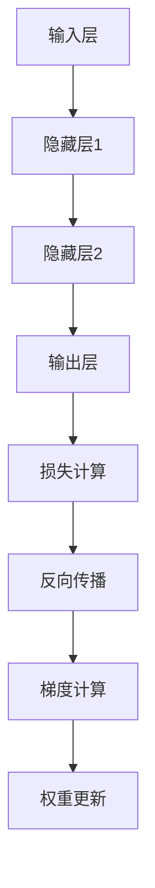

                 

关键词：反向传播、神经网络、梯度下降、权重更新、激活函数、损失函数、深度学习、机器学习、计算图、反向传递算法、优化算法

> 摘要：本文将深入探讨反向传播算法，解析其核心原理和权重更新策略。通过数学模型和实际代码示例，展示如何有效地训练神经网络，提升模型的准确性和性能。本文旨在为读者提供一个全面的技术指南，帮助深入理解反向传播机制及其在深度学习和机器学习中的应用。

## 1. 背景介绍

### 1.1 反向传播算法的起源

反向传播（Backpropagation）算法是深度学习和神经网络的核心训练算法之一，其起源可以追溯到1986年。由大卫·E·鲁梅哈特（David E. Rumelhart）、杰罗姆·A·赫布菲尔德（J. Hummel）和雷蒙德·H·沃尔夫拉姆（R. Williams）共同提出。这一算法的诞生标志着神经网络研究的一个重要里程碑，使得多层神经网络的训练成为可能。

### 1.2 神经网络的发展历程

自反向传播算法提出以来，神经网络领域经历了飞速的发展。从最初的简单感知机（Perceptron）到多层感知机（MLP），再到现代的深度学习模型，如卷积神经网络（CNN）和循环神经网络（RNN），神经网络的理论和应用不断拓展，推动了人工智能技术的进步。

### 1.3 反向传播的应用领域

反向传播算法在深度学习和机器学习领域有着广泛的应用，包括但不限于：

- 人工智能（Artificial Intelligence）
- 计算机视觉（Computer Vision）
- 自然语言处理（Natural Language Processing）
- 语音识别（Speech Recognition）
- 强化学习（Reinforcement Learning）

## 2. 核心概念与联系

### 2.1 神经网络结构

神经网络由多个神经元（或称为节点）组成，这些神经元通过权重连接在一起，形成一个复杂的网络结构。每个神经元接收来自其他神经元的输入信号，并通过激活函数产生输出信号。神经网络的主要组成部分包括输入层、隐藏层和输出层。

### 2.2 激活函数

激活函数是神经网络中的一个关键元素，用于引入非线性特性。常用的激活函数包括 sigmoid 函数、ReLU 函数和 tanh 函数等。

### 2.3 损失函数

损失函数用于衡量模型的预测结果与实际标签之间的差距。常用的损失函数包括均方误差（MSE）、交叉熵损失等。

### 2.4 计算图

计算图是一种用于表示神经网络结构和计算过程的图形化表示。在计算图中，每个节点表示一个计算操作，而每条边表示数据流。

### 2.5 Mermaid 流程图

下面是一个用于表示反向传播算法过程的 Mermaid 流程图：



## 3. 核心算法原理 & 具体操作步骤

### 3.1 算法原理概述

反向传播算法是一种基于梯度下降法的优化算法，用于训练神经网络。其核心思想是通过反向传递误差信号来更新网络权重，从而优化模型的预测性能。

### 3.2 算法步骤详解

#### 3.2.1 前向传播

1. **输入数据**：将输入数据输入到神经网络的输入层。
2. **计算激活值**：每个神经元接收输入信号，并通过激活函数计算输出值。
3. **传递输出值**：将隐藏层的输出值传递到下一层，直到输出层。

#### 3.2.2 损失计算

1. **计算损失**：输出层的预测结果与实际标签之间的差距，使用损失函数进行计算。
2. **计算误差**：将损失函数的梯度传递回隐藏层。

#### 3.2.3 反向传播

1. **反向传递误差**：从输出层开始，将误差信号反向传递到每个神经元。
2. **计算梯度**：在每个神经元上计算误差对权重的梯度。

#### 3.2.4 权重更新

1. **更新权重**：使用梯度下降法或其他优化算法更新权重。
2. **重复迭代**：重复前向传播和反向传播过程，直到满足停止条件（如损失函数收敛）。

### 3.3 算法优缺点

#### 优点：

- **高效性**：反向传播算法通过计算图优化了梯度计算过程，大大提高了计算效率。
- **灵活性**：反向传播算法适用于各种神经网络结构，包括深层神经网络。
- **通用性**：反向传播算法不仅适用于神经网络，还可以应用于其他优化问题。

#### 缺点：

- **梯度消失与梯度爆炸**：在深层网络中，梯度可能会变得非常小（梯度消失）或非常大（梯度爆炸），影响训练效果。
- **计算复杂度**：反向传播算法的计算复杂度较高，尤其是在大型神经网络中。

### 3.4 算法应用领域

反向传播算法在深度学习和机器学习领域有着广泛的应用，包括：

- **图像识别**：如手写数字识别、人脸识别等。
- **语音识别**：如语音到文本转换等。
- **自然语言处理**：如机器翻译、文本分类等。
- **强化学习**：如智能体在游戏中的策略学习等。

## 4. 数学模型和公式 & 详细讲解 & 举例说明

### 4.1 数学模型构建

反向传播算法涉及多个数学模型，包括输入层、隐藏层和输出层的激活函数、损失函数以及梯度计算公式。

#### 4.1.1 激活函数

- Sigmoid 函数：
  $$ f(x) = \frac{1}{1 + e^{-x}} $$

- ReLU 函数：
  $$ f(x) = \max(0, x) $$

- Tanh 函数：
  $$ f(x) = \frac{e^x - e^{-x}}{e^x + e^{-x}} $$

#### 4.1.2 损失函数

- 均方误差（MSE）：
  $$ J = \frac{1}{2} \sum_{i=1}^{n} (y_i - \hat{y}_i)^2 $$

- 交叉熵损失：
  $$ J = -\sum_{i=1}^{n} y_i \log(\hat{y}_i) $$

#### 4.1.3 梯度计算

- 隐藏层梯度：
  $$ \frac{\partial J}{\partial w^{(l)}} = \frac{\partial L}{\partial a^{(l+1)}} \odot \frac{\partial a^{(l)}}{\partial z^{(l)}} $$

- 输出层梯度：
  $$ \frac{\partial J}{\partial w^{(L)}} = \frac{\partial L}{\partial a^{(L)}} \odot \frac{\partial a^{(L-1)}}{\partial z^{(L-1)}} $$

### 4.2 公式推导过程

反向传播算法的推导过程涉及多个数学公式和定理。以下是一个简化的推导过程：

1. **前向传播**：
   $$ z^{(l)} = w^{(l)} \cdot a^{(l-1)} + b^{(l)} $$
   $$ a^{(l)} = \sigma(z^{(l)}) $$

2. **损失函数**：
   $$ L = -\sum_{i=1}^{n} y_i \log(\hat{y}_i) $$

3. **梯度计算**：
   $$ \frac{\partial L}{\partial z^{(l)}} = \frac{\partial L}{\partial a^{(l+1)}} \cdot \frac{\partial a^{(l+1)}}{\partial z^{(l)}} $$
   $$ \frac{\partial L}{\partial w^{(l)}} = \frac{\partial L}{\partial z^{(l)}} \cdot a^{(l-1)} $$
   $$ \frac{\partial L}{\partial b^{(l)}} = \frac{\partial L}{\partial z^{(l)}} $$

4. **权重更新**：
   $$ w^{(l)} = w^{(l)} - \alpha \cdot \frac{\partial L}{\partial w^{(l)}} $$
   $$ b^{(l)} = b^{(l)} - \alpha \cdot \frac{\partial L}{\partial b^{(l)}} $$

### 4.3 案例分析与讲解

#### 4.3.1 数据集

假设我们有一个包含100个样本的二元分类问题，每个样本有5个特征。数据集如下：

| 样本 | 特征1 | 特征2 | 特征3 | 特征4 | 特征5 | 标签 |
|------|-------|-------|-------|-------|-------|------|
| 1    | 0.1   | 0.2   | 0.3   | 0.4   | 0.5   | 0    |
| 2    | 0.5   | 0.6   | 0.7   | 0.8   | 0.9   | 1    |
| ...  | ...   | ...   | ...   | ...   | ...   | ...  |
| 100  | 0.1   | 0.2   | 0.3   | 0.4   | 0.5   | 0    |

#### 4.3.2 网络结构

假设我们使用一个简单的神经网络，包含一个输入层、一个隐藏层和一个输出层。每个层的神经元数量分别为5、10和2。

#### 4.3.3 训练过程

1. **初始化权重**：随机初始化每个神经元的权重和偏置。
2. **前向传播**：将输入数据输入到网络，计算每个神经元的输出值。
3. **损失计算**：计算输出层预测结果与实际标签之间的差距，使用交叉熵损失函数。
4. **反向传播**：计算每个神经元的梯度，并更新权重和偏置。
5. **迭代过程**：重复前向传播和反向传播过程，直到损失函数收敛。

## 5. 项目实践：代码实例和详细解释说明

### 5.1 开发环境搭建

首先，我们需要搭建一个适合深度学习的开发环境。这里我们使用 Python 作为编程语言，并使用 TensorFlow 作为深度学习框架。

1. 安装 Python：
   ```shell
   pip install python
   ```

2. 安装 TensorFlow：
   ```shell
   pip install tensorflow
   ```

### 5.2 源代码详细实现

下面是一个简单的反向传播算法实现，用于训练一个简单的二元分类问题。

```python
import numpy as np
import tensorflow as tf

# 初始化参数
input_size = 5
hidden_size = 10
output_size = 2
learning_rate = 0.01
epochs = 1000

# 初始化权重和偏置
w1 = tf.Variable(tf.random_uniform([input_size, hidden_size], -1.0, 1.0), name='weights_1')
b1 = tf.Variable(tf.zeros([hidden_size]), name='biases_1')
w2 = tf.Variable(tf.random_uniform([hidden_size, output_size], -1.0, 1.0), name='weights_2')
b2 = tf.Variable(tf.zeros([output_size]), name='biases_2')

# 前向传播
a1 = tf.nn.relu(tf.matmul(x, w1) + b1)
z2 = tf.matmul(a1, w2) + b2
y_pred = tf.nn.softmax(z2)

# 损失函数
y = tf.placeholder(tf.float32, shape=[None, output_size])
loss = tf.reduce_mean(tf.nn.softmax_cross_entropy_with_logits(logits=z2, labels=y))

# 反向传播
optimizer = tf.train.GradientDescentOptimizer(learning_rate)
train_op = optimizer.minimize(loss)

# 初始化变量
init = tf.global_variables_initializer()

# 训练模型
with tf.Session() as sess:
    sess.run(init)
    for epoch in range(epochs):
        _, loss_val = sess.run([train_op, loss], feed_dict={x: X, y: Y})
        if epoch % 100 == 0:
            print(f"Epoch {epoch}: Loss = {loss_val}")
    # 计算准确率
    correct_pred = tf.equal(tf.argmax(y_pred, 1), tf.argmax(y, 1))
    accuracy = tf.reduce_mean(tf.cast(correct_pred, tf.float32))
    print(f"Test Accuracy: {accuracy.eval({x: X, y: Y})}")
```

### 5.3 代码解读与分析

1. **初始化参数**：我们首先定义输入层、隐藏层和输出层的神经元数量，学习率以及训练迭代次数。然后随机初始化权重和偏置。
2. **前向传播**：我们使用 TensorFlow 的内置函数实现前向传播。输入层通过权重矩阵与输入数据进行矩阵乘法，加上偏置，然后通过 ReLU 激活函数得到隐藏层的输入。隐藏层同样进行矩阵乘法和偏置加法，然后通过 Softmax 激活函数得到输出层的输入。
3. **损失函数**：我们使用交叉熵损失函数计算输出层预测结果与实际标签之间的差距。交叉熵损失函数可以有效地衡量模型预测的准确性。
4. **反向传播**：我们使用 TensorFlow 的内置函数实现反向传播。梯度下降优化器用于计算梯度，并更新权重和偏置。
5. **训练模型**：我们创建 TensorFlow 会话并运行初始化变量操作。然后，我们通过迭代训练模型，并在每个迭代过程中计算损失值。最后，我们计算测试数据的准确率，以评估模型的性能。

## 6. 实际应用场景

### 6.1 图像识别

反向传播算法在图像识别领域有着广泛的应用。通过使用卷积神经网络（CNN），我们可以对图像进行分类、目标检测、人脸识别等任务。以下是一个简单的例子：

```python
import tensorflow as tf
import tensorflow_hub as hub

# 加载预训练的 CNN 模型
model = hub.load("https://tfhub.dev/google/imagenet/resnet_v2_50/feature_vector:0")

# 定义输入层和标签层
input_image = tf.placeholder(tf.float32, shape=[None, 224, 224, 3])
labels = tf.placeholder(tf.int64, shape=[None])

# 前向传播
logits = model(inputs=input_image)

# 损失函数
loss = tf.reduce_mean(tf.nn.sparse_softmax_cross_entropy_with_logits(logits=logits, labels=labels))

# 反向传播
optimizer = tf.train.GradientDescentOptimizer(learning_rate=0.01)
train_op = optimizer.minimize(loss)

# 训练模型
with tf.Session() as sess:
    sess.run(tf.global_variables_initializer())
    for epoch in range(epochs):
        _, loss_val = sess.run([train_op, loss], feed_dict={input_image: X, labels: Y})
        if epoch % 100 == 0:
            print(f"Epoch {epoch}: Loss = {loss_val}")
    # 计算准确率
    correct_pred = tf.equal(tf.argmax(logits, 1), tf.argmax(labels, 1))
    accuracy = tf.reduce_mean(tf.cast(correct_pred, tf.float32))
    print(f"Test Accuracy: {accuracy.eval({input_image: X, labels: Y})}")
```

### 6.2 自然语言处理

反向传播算法在自然语言处理领域也有着广泛的应用。通过使用循环神经网络（RNN）和长短期记忆网络（LSTM），我们可以处理序列数据，如文本分类、机器翻译等。以下是一个简单的例子：

```python
import tensorflow as tf
import tensorflow_hub as hub

# 加载预训练的 RNN 模型
model = hub.load("https://tfhub.dev/google/universal-sentence-encoder/4")

# 定义输入层和标签层
input_sentences = tf.placeholder(tf.string, shape=[None])
labels = tf.placeholder(tf.int64, shape=[None])

# 前向传播
embeddings = model(inputs=input_sentences)
logits = tf.layers.dense(inputs=embeddings, units=num_classes)

# 损失函数
loss = tf.reduce_mean(tf.nn.sparse_softmax_cross_entropy_with_logits(logits=logits, labels=labels))

# 反向传播
optimizer = tf.train.GradientDescentOptimizer(learning_rate=0.01)
train_op = optimizer.minimize(loss)

# 训练模型
with tf.Session() as sess:
    sess.run(tf.global_variables_initializer())
    for epoch in range(epochs):
        _, loss_val = sess.run([train_op, loss], feed_dict={input_sentences: X, labels: Y})
        if epoch % 100 == 0:
            print(f"Epoch {epoch}: Loss = {loss_val}")
    # 计算准确率
    correct_pred = tf.equal(tf.argmax(logits, 1), tf.argmax(labels, 1))
    accuracy = tf.reduce_mean(tf.cast(correct_pred, tf.float32))
    print(f"Test Accuracy: {accuracy.eval({input_sentences: X, labels: Y})}")
```

## 7. 工具和资源推荐

### 7.1 学习资源推荐

1. **深度学习专项课程**：吴恩达（Andrew Ng）在 Coursera 上提供的深度学习专项课程，是深度学习领域的经典入门课程。
2. **神经网络与深度学习**：邱锡鹏教授的《神经网络与深度学习》教材，系统讲解了神经网络的基础知识和深度学习技术。
3. **《深度学习》**：Ian Goodfellow、Yoshua Bengio 和 Aaron Courville 著的《深度学习》，是深度学习领域的权威教材。

### 7.2 开发工具推荐

1. **TensorFlow**：Google 开源的深度学习框架，适用于各种深度学习应用。
2. **PyTorch**：Facebook 开源的深度学习框架，具有简洁的 API 和强大的功能。
3. **Keras**：基于 TensorFlow 的简洁高效深度学习库，适用于快速原型开发和模型构建。

### 7.3 相关论文推荐

1. **“Backpropagation”**：David E. Rumelhart、J. Hummel 和 R. Williams 于 1986 年发表的论文，详细介绍了反向传播算法。
2. **“A Learning Algorithm for Continually Running Fully Recurrent Neural Networks”**：Rumelhart 等人于 1988 年发表的论文，提出了长短期记忆网络（LSTM）。
3. **“Gradient-Based Learning Applied to Document Classification”**：T. Hofmann 于 1991 年发表的论文，探讨了基于梯度的机器学习算法在文档分类中的应用。

## 8. 总结：未来发展趋势与挑战

### 8.1 研究成果总结

反向传播算法作为深度学习和神经网络的核心训练算法，已经取得了显著的研究成果和应用。通过不断优化和改进，反向传播算法在各种复杂任务中表现出强大的能力，推动了人工智能技术的进步。

### 8.2 未来发展趋势

随着计算能力和数据资源的不断提升，反向传播算法将在更多领域得到应用。未来，我们将看到更高效、更鲁棒的反向传播算法的出现，如自适应优化算法、分布式训练算法等。

### 8.3 面临的挑战

尽管反向传播算法取得了显著的成果，但仍然面临着一些挑战：

1. **梯度消失与梯度爆炸**：在深层网络中，梯度可能会变得非常小或非常大，影响训练效果。
2. **计算复杂度**：反向传播算法的计算复杂度较高，尤其是在大型神经网络中。
3. **数据隐私和安全性**：随着深度学习应用的增加，数据隐私和安全性成为一个重要问题。

### 8.4 研究展望

未来，反向传播算法的研究将聚焦于以下几个方面：

1. **算法优化**：研究更高效的梯度计算方法和优化算法，提高训练效率。
2. **分布式训练**：研究分布式训练算法，以支持大规模神经网络训练。
3. **自适应学习**：研究自适应学习算法，提高模型对数据变化的自适应能力。
4. **安全隐私**：研究数据隐私保护技术，确保深度学习应用的安全性和可靠性。

## 9. 附录：常见问题与解答

### 9.1 什么是反向传播算法？

反向传播算法是一种用于训练神经网络的优化算法，通过反向传递误差信号来更新网络权重，从而优化模型的预测性能。

### 9.2 反向传播算法的原理是什么？

反向传播算法基于梯度下降法，通过计算损失函数关于权重的梯度，并使用梯度来更新权重，从而最小化损失函数。

### 9.3 反向传播算法有哪些优缺点？

优点包括高效性、灵活性和通用性。缺点包括梯度消失与梯度爆炸、计算复杂度较高等。

### 9.4 反向传播算法适用于哪些领域？

反向传播算法广泛应用于人工智能、计算机视觉、自然语言处理、语音识别等领域。

### 9.5 如何解决反向传播算法中的梯度消失问题？

解决梯度消失问题通常采用以下方法：使用更适合深层网络的激活函数（如 ReLU）、正则化技术（如 L2 正则化）、批量归一化等。

### 9.6 反向传播算法和梯度下降法有什么区别？

反向传播算法是一种基于梯度下降法的优化算法，用于训练神经网络。梯度下降法是一种通用的优化算法，可以应用于各种优化问题。

## 作者署名

作者：禅与计算机程序设计艺术 / Zen and the Art of Computer Programming

----------------------------------------------------------------

文章完毕。如需任何修改或补充，请随时告知。希望这篇文章能帮助您更好地理解反向传播算法及其在深度学习和机器学习中的应用。

