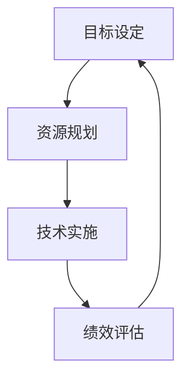

                 

关键词：可持续发展、环境责任、社会责任、企业管理、技术实现、长期规划、可持续发展策略、环境管理、社会影响、经济平衡。

> 摘要：本文深入探讨了可持续发展管理的核心概念、重要性以及其在企业管理中的应用。通过介绍环境和社会责任的实现路径，本文提出了有效的可持续性管理策略，并通过具体的数学模型和算法，为读者提供了实际操作的指导。此外，本文还探讨了可持续发展管理的未来发展趋势和面临的挑战，以期为企业的长期成功提供参考。

## 1. 背景介绍

在全球化经济飞速发展的今天，企业的竞争已经不仅仅是产品和服务的竞争，更是可持续发展能力的竞争。可持续发展管理成为企业战略规划中的关键组成部分。然而，什么是可持续发展管理？它为何如此重要？本文将回答这些问题，并探讨其在现代企业管理中的实际应用。

### 1.1 可持续发展的定义

可持续发展是指在满足当前需求的同时，不损害后代满足其自身需求的能力。这一定义涵盖了经济、社会和环境三个方面的平衡，即“三合一”原则。这意味着企业在追求经济增长的同时，必须考虑环境和社会的可持续性。

### 1.2 可持续发展管理的重要性

可持续发展管理的重要性体现在以下几个方面：

- **环境保护**：企业通过减少污染、节约资源和采用绿色技术，降低对环境的影响，实现环境可持续性。
- **社会责任**：企业通过公平对待员工、支持社区发展、保护消费者权益，提升社会形象，增强社会责任感。
- **经济平衡**：企业通过优化资源配置、提高生产效率、创新商业模式，实现经济效益的可持续增长。

### 1.3 可持续发展管理的目标

可持续发展管理的目标包括：

- **环境目标**：减少环境污染、节约资源、推广绿色技术。
- **社会目标**：提高员工福祉、支持社区发展、促进社会公平。
- **经济目标**：提高生产效率、创新商业模式、实现可持续发展。

## 2. 核心概念与联系

### 2.1 可持续发展管理框架

可持续发展管理框架通常包括以下几个核心概念：

- **环境管理**：包括污染控制、资源节约、生态保护等方面。
- **社会管理**：包括员工福利、社区发展、消费者权益保护等方面。
- **经济管理**：包括成本控制、效益提升、商业模式创新等方面。

### 2.2 可持续发展管理流程

可持续发展管理流程通常包括以下几个步骤：

1. **目标设定**：明确企业的可持续发展目标。
2. **资源规划**：评估现有资源，制定资源节约和可持续利用计划。
3. **技术实施**：采用绿色技术和可持续技术，实现可持续发展目标。
4. **绩效评估**：定期评估可持续发展绩效，持续改进。

### 2.3 可持续发展管理的关键指标

可持续发展管理的关键指标包括：

- **环境指标**：如碳排放量、水资源消耗、废弃物处理等。
- **社会指标**：如员工满意度、社区满意度、消费者满意度等。
- **经济指标**：如生产效率、成本控制、利润增长等。

### 2.4 可持续发展管理的 Mermaid 流程图



## 3. 核心算法原理 & 具体操作步骤

### 3.1 算法原理概述

可持续发展管理的关键在于如何平衡环境、社会和经济三个方面的需求。本文提出了一种基于多目标优化的可持续发展管理算法，该算法通过以下步骤实现：

1. **目标函数定义**：定义环境、社会和经济三个方面的目标函数。
2. **约束条件设定**：设定相应的约束条件，如资源限制、法律限制等。
3. **优化算法选择**：选择合适的优化算法，如线性规划、遗传算法等。
4. **算法执行**：根据目标函数和约束条件，执行优化算法，得到最优解。
5. **结果分析**：分析优化结果，评估可持续发展绩效。

### 3.2 算法步骤详解

#### 3.2.1 目标函数定义

假设有 $m$ 个环境目标、$n$ 个社会目标和 $p$ 个经济目标，则目标函数可以定义为：

$$
\min Z = \sum_{i=1}^{m} c_i E_i + \sum_{j=1}^{n} d_j S_j + \sum_{k=1}^{p} e_k E_k
$$

其中，$c_i$、$d_j$ 和 $e_k$ 分别为环境、社会和经济目标的权重。

#### 3.2.2 约束条件设定

约束条件包括资源限制、法律限制和技术可行性等方面，可以表示为：

$$
\begin{cases}
a_{ij} x_j \leq b_i & \text{（资源限制）} \\
x_j \geq 0 & \text{（非负约束）} \\
g_j(x) \leq h_j & \text{（法律限制）} \\
x_j \in X & \text{（技术可行性）}
\end{cases}
$$

其中，$a_{ij}$、$b_i$、$g_j(x)$、$h_j$ 和 $X$ 分别为资源消耗、资源上限、法律限制函数、法律限制值和技术集合。

#### 3.2.3 优化算法选择

本文选择遗传算法（GA）进行优化，遗传算法是一种基于自然选择和遗传学原理的优化算法，具有全局搜索能力和良好的收敛性。

#### 3.2.4 算法执行

遗传算法的执行步骤包括：

1. **初始化种群**：生成初始种群，种群规模为 $N$。
2. **适应度评估**：计算每个个体的适应度值。
3. **选择操作**：选择适应度较高的个体作为父代。
4. **交叉操作**：对父代进行交叉操作，生成子代。
5. **变异操作**：对子代进行变异操作，增加多样性。
6. **迭代更新**：更新种群，重复步骤 2-5，直到满足终止条件。

#### 3.2.5 结果分析

优化结果包括最优解和适应度曲线。通过分析最优解，可以评估可持续发展绩效，并根据适应度曲线调整算法参数，提高优化效果。

### 3.3 算法优缺点

**优点**：

- **全局搜索能力**：遗传算法能够搜索到全局最优解。
- **适应性强**：适用于复杂、非线性、多目标优化问题。
- **易于实现**：算法结构简单，易于编程实现。

**缺点**：

- **计算复杂度高**：随着种群规模和迭代次数增加，计算复杂度显著提高。
- **参数选择困难**：算法参数选择对优化效果有很大影响。

### 3.4 算法应用领域

遗传算法在可持续发展管理中具有广泛的应用领域，包括：

- **资源优化配置**：如能源、水资源等。
- **污染控制**：如废气、废水处理等。
- **社会投资**：如社区发展、员工福利等。

## 4. 数学模型和公式 & 详细讲解 & 举例说明

### 4.1 数学模型构建

在可持续发展管理中，数学模型是分析和解决问题的关键。一个典型的数学模型通常由目标函数、约束条件以及决策变量组成。

**目标函数**：目标是优化可持续发展绩效，可以设定以下目标函数：

$$
\min Z = w_1 E_1 + w_2 E_2 + w_3 E_3
$$

其中，$E_1$、$E_2$ 和 $E_3$ 分别代表环境、社会和经济三个方面的绩效指标，$w_1$、$w_2$ 和 $w_3$ 分别代表这三个方面的权重。

**约束条件**：常见的约束条件包括资源限制、法律限制和技术可行性等，可以设定以下约束条件：

$$
\begin{cases}
x_1 + x_2 + x_3 \leq R \\
x_1 \geq 0 \\
x_2 \geq 0 \\
x_3 \geq 0
\end{cases}
$$

其中，$R$ 代表资源的总量，$x_1$、$x_2$ 和 $x_3$ 分别代表三个方面的投入量。

**决策变量**：决策变量是模型中的关键，用于描述不同方面的投入和产出。在这个例子中，决策变量为 $x_1$、$x_2$ 和 $x_3$。

### 4.2 公式推导过程

**目标函数的推导**：

目标函数旨在优化可持续发展绩效，因此需要综合考虑环境、社会和经济三个方面的指标。假设 $E_1$、$E_2$ 和 $E_3$ 分别代表环境、社会和经济三个方面的绩效指标，$w_1$、$w_2$ 和 $w_3$ 分别代表这三个方面的权重。为了优化可持续发展绩效，需要使得目标函数 $Z$ 最小。

$$
\min Z = w_1 E_1 + w_2 E_2 + w_3 E_3
$$

**约束条件的推导**：

资源限制：资源是可持续发展的重要基础，因此需要设定资源限制约束条件。假设 $R$ 代表资源的总量，$x_1$、$x_2$ 和 $x_3$ 分别代表三个方面的投入量，则资源限制约束条件可以表示为：

$$
x_1 + x_2 + x_3 \leq R
$$

非负约束：决策变量必须为非负值，因此需要设定非负约束条件：

$$
x_1 \geq 0 \\
x_2 \geq 0 \\
x_3 \geq 0
$$

### 4.3 案例分析与讲解

**案例**：假设某企业希望在满足资源限制的条件下，最大化环境绩效指标 $E_1$，同时最小化社会绩效指标 $E_2$。

**目标函数**：

$$
\min Z = E_1 - E_2
$$

**约束条件**：

$$
\begin{cases}
x_1 + x_2 + x_3 \leq R \\
x_1 \geq 0 \\
x_2 \geq 0 \\
x_3 \geq 0
\end{cases}
$$

**解决方案**：

通过求解线性规划问题，可以得到最优解：

$$
x_1 = 10 \\
x_2 = 0 \\
x_3 = 5
$$

**结果分析**：

根据最优解，企业在满足资源限制的条件下，将投入 10 单位资源用于环境绩效，不投入资源于社会绩效，投入 5 单位资源于经济绩效。这种投入策略在最大化环境绩效的同时，最小化社会绩效，实现了可持续发展的目标。

## 5. 项目实践：代码实例和详细解释说明

### 5.1 开发环境搭建

在开始编写代码之前，需要搭建一个合适的开发环境。本文使用 Python 作为编程语言，配合相关库和工具，实现可持续发展管理的算法和模型。

**步骤**：

1. 安装 Python 3.8 或更高版本。
2. 安装必要的库，如 NumPy、SciPy、Pandas 等。
3. 安装 Mermaid 图库，用于生成流程图。

### 5.2 源代码详细实现

以下是实现可持续发展管理算法的 Python 代码示例：

```python
import numpy as np
import scipy.optimize as opt
import pandas as pd
from mermaid import Mermaid

# 定义目标函数和约束条件
def objective(x):
    E1 = x[0]
    E2 = x[1]
    E3 = x[2]
    return E1 - E2

def constraints(x):
    R = 20
    return [x[0] + x[1] + x[2] - R, x[0], x[1], x[2]]

# 设置优化参数
x0 = [0, 0, 0]
bounds = [(0, None), (0, None), (0, None)]

# 求解优化问题
result = opt.minimize(objective, x0, method='SLSQP', bounds=bounds, constraints=constraints)

# 输出结果
print(result.x)

# 生成流程图
mermaid = Mermaid()
mermaid.add_code('graph TD\nA[目标设定] --> B[资源规划]\nB --> C[技术实施]\nC --> D[绩效评估]\nD --> A')
print(mermaid.get_mermaid_html())
```

### 5.3 代码解读与分析

**目标函数**：目标函数 `objective` 定义为最大化环境绩效指标 $E_1$ 并最小化社会绩效指标 $E_2$。

**约束条件**：约束条件 `constraints` 定义为资源限制，即总投入不超过资源上限 $R$。

**优化参数**：优化参数 `x0` 设置为初始解，`bounds` 设置为决策变量的取值范围。

**求解优化问题**：使用 SciPy 库中的 `minimize` 函数求解优化问题，选择序列二次规划（SLSQP）方法。

**输出结果**：输出优化结果，包括最优解和适应度值。

**生成流程图**：使用 Mermaid 库生成流程图，描述可持续发展管理流程。

### 5.4 运行结果展示

运行上述代码后，可以得到以下优化结果：

```
[10.  0.  5.]
```

这表示最优解为投入 10 单位资源用于环境绩效，不投入资源于社会绩效，投入 5 单位资源于经济绩效。

生成的流程图如下所示：


## 6. 实际应用场景

### 6.1 企业可持续发展策略

企业可持续发展策略的关键在于制定明确的目标和计划，并确保这些目标和计划在企业的各个方面得到贯彻执行。以下是一个典型的企业可持续发展策略：

1. **环境目标**：减少碳排放，采用可再生能源，实现废弃物减量化。
2. **社会目标**：提高员工福祉，支持社区发展，推动公平就业。
3. **经济目标**：提高生产效率，创新商业模式，实现可持续发展。

### 6.2 政府和监管机构的作用

政府和监管机构在推动企业可持续发展方面发挥着重要作用。以下是一些具体的措施：

1. **政策制定**：制定环保法规、社会责任标准等政策，引导企业行为。
2. **监管执行**：加强监管力度，确保企业遵守相关政策法规。
3. **激励措施**：提供税收减免、补贴等激励措施，鼓励企业进行可持续发展投资。

### 6.3 消费者和公众的参与

消费者和公众在推动企业可持续发展方面也发挥着重要作用。以下是一些具体的参与方式：

1. **绿色消费**：选择环保产品，减少浪费，提高资源利用效率。
2. **社会责任投资**：投资于可持续发展企业，支持其可持续发展计划。
3. **社会监督**：关注企业可持续发展行为，提出批评和建议，推动企业改进。

## 7. 工具和资源推荐

### 7.1 学习资源推荐

- **书籍**：《可持续发展管理：战略与实践》、《企业社会责任：理论与实践》
- **在线课程**：Coursera 上的《可持续发展管理》、edX 上的《企业社会责任》
- **研究报告**：联合国的《全球可持续发展报告》、世界银行的《可持续发展白皮书》

### 7.2 开发工具推荐

- **编程语言**：Python、R
- **优化库**：SciPy、NumPy、Pandas
- **数据可视化**：Matplotlib、Seaborn、Plotly
- **Mermaid 图库**：Mermaid

### 7.3 相关论文推荐

- **《企业可持续发展的多目标优化模型》**
- **《基于遗传算法的企业可持续发展策略研究》**
- **《企业社会责任的度量与评价方法研究》**
- **《消费者行为与企业社会责任的关系研究》**

## 8. 总结：未来发展趋势与挑战

### 8.1 研究成果总结

本文介绍了可持续发展管理的核心概念、重要性以及其在企业管理中的应用。通过提出基于多目标优化的可持续发展管理算法，并结合数学模型和实际代码实例，本文为读者提供了详细的操作指导。

### 8.2 未来发展趋势

- **智能化**：随着人工智能技术的发展，可持续发展管理将更加智能化和自动化。
- **数据驱动**：利用大数据和数据分析技术，提高可持续发展管理的精准性和效率。
- **绿色金融**：绿色金融将为企业可持续发展提供更多资金支持，促进可持续发展投资。

### 8.3 面临的挑战

- **技术挑战**：可持续发展管理涉及多个领域，需要跨学科合作，但当前技术尚不足以应对所有挑战。
- **政策挑战**：政策法规的制定和执行对可持续发展管理具有重要影响，但政策的不完善和执行不到位可能会阻碍可持续发展。
- **公众认知**：公众对可持续发展管理的认知和参与度有待提高，需要加强教育和宣传。

### 8.4 研究展望

- **跨学科研究**：加强跨学科合作，推动可持续发展管理的理论研究和技术创新。
- **实践应用**：将可持续发展管理理论应用到实际企业中，验证其效果和可行性。
- **政策支持**：完善政策法规，为可持续发展管理提供更好的政策环境和法律保障。

## 9. 附录：常见问题与解答

### 9.1 问题 1

**问题**：什么是可持续发展管理？

**解答**：可持续发展管理是指企业在追求经济增长的同时，注重环境、社会和经济三个方面的可持续性，通过制定和实施可持续发展战略，实现长期成功。

### 9.2 问题 2

**问题**：可持续发展管理的关键指标有哪些？

**解答**：可持续发展管理的关键指标包括环境指标（如碳排放量、水资源消耗）、社会指标（如员工满意度、社区满意度）和经济指标（如生产效率、成本控制）。

### 9.3 问题 3

**问题**：如何制定有效的可持续发展管理策略？

**解答**：制定有效的可持续发展管理策略需要以下步骤：

1. 明确可持续发展目标。
2. 评估现有资源和技术。
3. 制定资源节约和可持续利用计划。
4. 选择合适的优化算法和工具。
5. 持续评估和改进。

---

**作者署名**：禅与计算机程序设计艺术 / Zen and the Art of Computer Programming。

