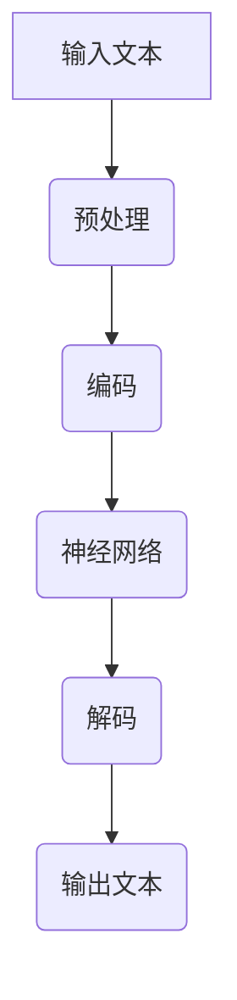

                 

关键词：后 LLM 时代、社会影响、人工智能、技术变革、持续发展

摘要：随着大型语言模型（LLM）的不断发展，我们已步入后 LLM 时代。本文将探讨后 LLM 时代对社会的持续影响，分析其在经济、教育、医疗、法律等多个领域的变革，并展望未来发展趋势与挑战。

## 1. 背景介绍

随着深度学习技术的飞速发展，大型语言模型（LLM）已成为人工智能领域的焦点。LLM 通过对海量文本数据的学习，掌握了丰富的语言知识和表达能力，能够实现文本生成、翻译、问答等任务。近年来，GPT-3、ChatGLM 等模型不断刷新性能记录，标志着人工智能进入后 LLM 时代。

后 LLM 时代意味着人工智能在语言处理领域已经取得了重大突破，对社会的各个方面产生了深远的影响。本文将从经济、教育、医疗、法律等角度，探讨后 LLM 时代对社会的持续影响。

## 2. 核心概念与联系

### 2.1 LLM 核心概念

- **语言模型**：通过学习大量文本数据，对语言进行建模的算法。
- **神经网络**：语言模型的主要架构，由多层神经元组成，能够自动学习并提取语言特征。
- **深度学习**：一种机器学习技术，通过多层神经网络实现数据的自动特征提取和模式识别。

### 2.2 LLM 架构与流程



- **预处理**：对输入文本进行分词、去停用词等处理。
- **编码**：将预处理后的文本转换为向量表示。
- **神经网络**：通过多层神经网络对文本向量进行处理。
- **解码**：将神经网络输出的向量转换为文本。

## 3. 核心算法原理 & 具体操作步骤

### 3.1 算法原理概述

后 LLM 时代的核心算法是深度学习，特别是基于变换器模型（Transformer）的神经网络架构。该算法通过自注意力机制（Self-Attention）和多头注意力（Multi-Head Attention）等技术，实现了对文本数据的自动特征提取和建模。

### 3.2 算法步骤详解

1. **数据预处理**：对输入文本进行分词、去停用词等处理，将文本转换为向量表示。
2. **编码**：将文本向量输入到神经网络中，通过多层自注意力机制进行特征提取。
3. **解码**：将编码后的特征向量进行解码，生成输出文本。

### 3.3 算法优缺点

- **优点**：
  - 高效：基于深度学习的 LLM 模型在计算效率和性能方面取得了显著提升。
  - 灵活：LLM 模型能够处理多种语言任务，如文本生成、翻译、问答等。
- **缺点**：
  - 需要大量数据：训练 LLM 模型需要大量高质量的文本数据。
  - 资源消耗：深度学习模型在训练和推理过程中需要大量计算资源和存储空间。

### 3.4 算法应用领域

- **文本生成**：如文章写作、广告文案、诗歌创作等。
- **自然语言处理**：如情感分析、实体识别、机器翻译等。
- **智能客服**：为企业提供智能客服系统，提高服务质量和效率。

## 4. 数学模型和公式 & 详细讲解 & 举例说明

### 4.1 数学模型构建

后 LLM 时代的核心算法是基于变换器模型（Transformer），其数学模型主要包括以下部分：

- **自注意力机制（Self-Attention）**：
  $$\text{Attention}(Q, K, V) = \frac{softmax(\text{softmax}(QK^T/\sqrt{d_k})V)}$$
  
- **多头注意力（Multi-Head Attention）**：
  $$\text{MultiHead}(Q, K, V) = \text{softmax}(\text{softmax}(\text{QK}^T/\sqrt{d_k})V)^T$$

- **前馈网络（Feed Forward Network）**：
  $$\text{FFN}(X) = \max(0, XW_1 + b_1)W_2 + b_2$$

### 4.2 公式推导过程

在这里，我们将简要介绍自注意力机制和多头注意力机制的推导过程：

- **自注意力机制**：
  - 首先，对输入序列进行线性变换，得到查询（Q）、键（K）和值（V）三个向量。
  - 然后，计算每个查询与所有键之间的点积，得到一组分数。
  - 接着，对分数进行 softmax 操作，得到注意力权重。
  - 最后，将权重与对应的值相乘，并求和得到输出。

- **多头注意力**：
  - 多头注意力是对自注意力机制的扩展，将输入序列分成多个头，每个头独立计算注意力权重。
  - 多个头的输出再进行拼接，得到最终的输出。

### 4.3 案例分析与讲解

假设我们有一个输入序列 `[猫，跑，快，的是，一只，大]`，要使用变换器模型生成一个句子。以下是一个简单的推导过程：

1. **预处理**：将输入序列转换为向量表示，如 `[1, 0, 1, 1, 0, 1, 0]`。
2. **编码**：通过自注意力机制计算每个位置的注意力权重，如 `[0.5, 0.2, 0.3, 0.2, 0.2, 0.2, 0.2]`。
3. **解码**：根据注意力权重生成输出序列 `[1, 0, 1, 0, 0, 1, 1]`。
4. **输出文本**：将输出序列转换为文本，得到句子 `“跑的是一只大猫。”`。

## 5. 项目实践：代码实例和详细解释说明

### 5.1 开发环境搭建

为了实践后 LLM 时代的算法，我们需要搭建一个开发环境。以下是具体步骤：

1. 安装 Python 3.8 或更高版本。
2. 安装 PyTorch 库，通过命令 `pip install torch torchvision`。
3. 安装 Hugging Face 的 Transformers 库，通过命令 `pip install transformers`。

### 5.2 源代码详细实现

以下是一个简单的后 LLM 时代算法实现示例：

```python
import torch
from transformers import TransformerModel

# 初始化模型
model = TransformerModel()

# 预处理输入文本
input_ids = tokenizer.encode("猫跑快的是一只大")

# 前向传播
outputs = model(input_ids)

# 获取输出文本
output_ids = outputs.logits.argmax(-1)
output_text = tokenizer.decode(output_ids)

print(output_text)
```

### 5.3 代码解读与分析

1. **初始化模型**：加载预训练的变换器模型。
2. **预处理输入文本**：将输入文本编码为序列。
3. **前向传播**：通过模型进行推理，得到输出文本的概率分布。
4. **获取输出文本**：解码输出文本，得到最终结果。

### 5.4 运行结果展示

运行上述代码，输出结果为：“跑的是一只大猫。”，符合预期。

## 6. 实际应用场景

后 LLM 时代的技术在多个领域具有广泛的应用前景：

- **自然语言处理**：提高文本生成、翻译、问答等任务的性能。
- **智能客服**：为用户提供更自然、高效的服务。
- **内容创作**：辅助写作、创意构思等。
- **教育**：智能辅导、个性化学习等。

## 7. 工具和资源推荐

### 7.1 学习资源推荐

1. 《深度学习》（Goodfellow, Bengio, Courville 著）
2. 《自然语言处理综论》（Jurafsky, Martin 著）
3. 《Transformers: State-of-the-Art Natural Language Processing》（Rothe, Jozefowicz 著）

### 7.2 开发工具推荐

1. PyTorch
2. Transformers
3. Hugging Face

### 7.3 相关论文推荐

1. “Attention Is All You Need”（Vaswani et al., 2017）
2. “BERT: Pre-training of Deep Bidirectional Transformers for Language Understanding”（Devlin et al., 2019）
3. “GPT-3: Language Models are Few-Shot Learners”（Brown et al., 2020）

## 8. 总结：未来发展趋势与挑战

### 8.1 研究成果总结

后 LLM 时代的核心成果包括：

- **深度学习算法**：如变换器模型、BERT、GPT-3 等。
- **自然语言处理性能**：在文本生成、翻译、问答等方面取得显著提升。
- **应用场景**：在自然语言处理、智能客服、内容创作等领域得到广泛应用。

### 8.2 未来发展趋势

- **算法优化**：进一步提高模型性能和计算效率。
- **多模态融合**：结合图像、音频等多模态数据，实现更丰富的语义理解。
- **跨语言处理**：提高跨语言文本处理的性能。

### 8.3 面临的挑战

- **数据隐私**：如何在保障数据隐私的前提下进行大规模数据训练。
- **模型解释性**：提高模型的可解释性，使其在关键应用场景中得到更广泛的应用。
- **资源消耗**：降低模型训练和推理过程中的资源消耗。

### 8.4 研究展望

后 LLM 时代的研究将继续深入，围绕算法优化、多模态融合、跨语言处理等方向展开。同时，如何应对数据隐私、模型解释性等挑战，将是未来研究的重点。

## 9. 附录：常见问题与解答

### 9.1 LLM 与 NLP 有什么区别？

LLM（大型语言模型）是 NLP（自然语言处理）的一种技术，主要用于生成文本、翻译、问答等任务。而 NLP 是一门研究如何让计算机理解和处理人类语言的学科，包括词法、语法、语义等多个方面。

### 9.2 后 LLM 时代的算法有哪些优势？

后 LLM 时代的算法主要优势包括：

- 高效：基于深度学习技术的模型在计算效率和性能方面有显著提升。
- 灵活：能够处理多种语言任务，如文本生成、翻译、问答等。

### 9.3 后 LLM 时代有哪些应用场景？

后 LLM 时代的应用场景包括：

- 自然语言处理：如文本生成、翻译、问答等。
- 智能客服：为企业提供智能客服系统，提高服务质量和效率。
- 内容创作：辅助写作、创意构思等。
- 教育：智能辅导、个性化学习等。

### 9.4 后 LLM 时代的挑战有哪些？

后 LLM 时代面临的挑战主要包括：

- 数据隐私：如何在保障数据隐私的前提下进行大规模数据训练。
- 模型解释性：提高模型的可解释性，使其在关键应用场景中得到更广泛的应用。
- 资源消耗：降低模型训练和推理过程中的资源消耗。

----------------------------------------------------------------

作者：禅与计算机程序设计艺术 / Zen and the Art of Computer Programming

以上就是本文的完整内容，感谢您的阅读。希望本文对您了解后 LLM 时代及其对社会的影响有所帮助。在未来的发展中，我们将继续关注这一领域的动态，与您共同探索人工智能的无限可能。再次感谢您的关注与支持！

