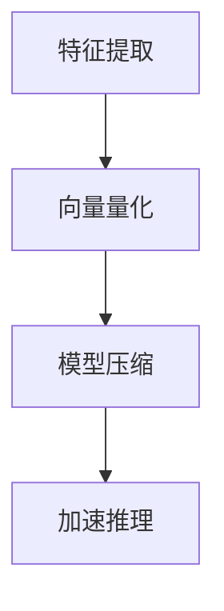
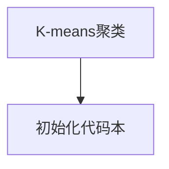
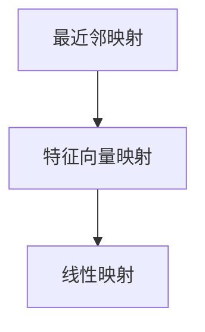
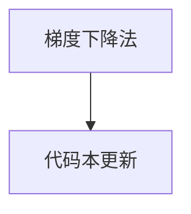
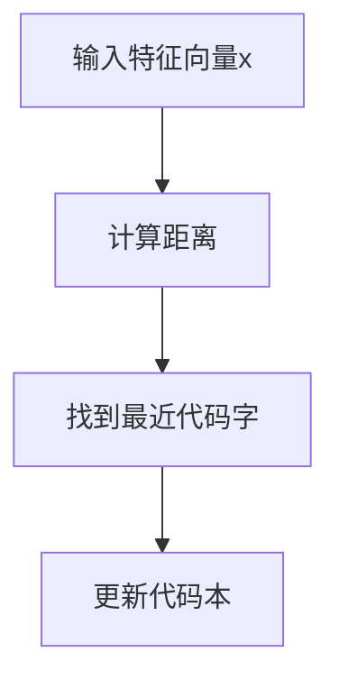

                 

关键词：向量量化、AI模型压缩、神经网络、算法优化、机器学习

摘要：本文深入探讨了向量量化在AI模型压缩领域的应用及其重要性。通过介绍向量量化的基本概念、核心算法原理、数学模型构建、项目实践案例以及实际应用场景，分析了向量量化在当前AI领域的发展趋势和面临的挑战。

## 1. 背景介绍

随着深度学习在图像识别、自然语言处理等领域的迅速发展，AI模型的复杂性不断增加，模型的大小也随之急剧膨胀。为了在有限的计算资源下高效地部署和应用这些模型，模型压缩技术成为当前研究的热点。向量量化是模型压缩的一种重要技术，它通过将高维特征向量映射到低维代码本中，实现模型的压缩和加速。

### 1.1 向量量化的发展历程

向量量化最早应用于图像编码领域，随着计算机科学和人工智能的进步，向量量化逐渐应用于语音编码、视频编码以及机器学习领域。近年来，随着神经网络在AI领域的广泛应用，向量量化技术在模型压缩领域的研究得到了迅速发展。

### 1.2 向量量化的重要性

向量量化技术在AI模型压缩中的应用具有重要意义：

1. **减少模型大小**：通过将高维特征向量映射到低维代码本，减少模型的存储空间，便于在资源受限的环境下部署。
2. **加速模型训练与推理**：低维代码本可以加速模型在训练和推理过程中的计算，提高模型的效率。
3. **降低计算资源消耗**：减少模型大小和加速推理可以降低计算资源的消耗，特别是在移动设备和嵌入式系统中。
4. **提升模型泛化能力**：通过适当的设计和优化，向量量化技术可以提高模型的泛化能力，使得压缩后的模型在新的数据集上仍能保持较高的性能。

## 2. 核心概念与联系

### 2.1 向量量化的基本概念

向量量化是一种将高维特征向量映射到低维代码本中的过程。在这个过程中，每个高维特征向量被映射到一个或多个低维代码字上。代码字是一个预定义的集合，用于表示低维空间中的信息。

### 2.2 向量量化在AI模型中的应用

在AI模型中，向量量化通常用于以下几个方面：

1. **特征提取**：在特征提取阶段，通过向量量化将高维特征向量映射到低维代码本，实现特征的降维。
2. **模型压缩**：在模型压缩阶段，利用向量量化技术将模型中的权重和激活值映射到低维空间，实现模型的压缩。
3. **加速推理**：在推理阶段，使用低维代码本代替原始的高维特征向量，加速模型的计算。

### 2.3 Mermaid 流程图

以下是一个关于向量量化在AI模型中应用的Mermaid流程图：



## 3. 核心算法原理 & 具体操作步骤

### 3.1 算法原理概述

向量量化算法的核心思想是将高维特征向量映射到低维代码本中。这个过程通常包括以下几个步骤：

1. **代码本初始化**：初始化一个低维代码本，用于存储映射后的特征向量。
2. **特征向量映射**：将每个高维特征向量映射到一个或多个低维代码字上。
3. **代码本更新**：根据映射结果更新代码本，以优化映射效果。

### 3.2 算法步骤详解

#### 3.2.1 代码本初始化

代码本初始化是向量量化算法的第一步。在这一步中，我们需要定义一个低维代码本，通常使用K-means算法或其他聚类算法来初始化代码本。代码本的维度通常远小于输入特征向量的维度。



#### 3.2.2 特征向量映射

特征向量映射是向量量化算法的核心步骤。在这一步中，我们将每个高维特征向量映射到一个或多个低维代码字上。常见的映射方法包括最近邻映射和线性映射。



#### 3.2.3 代码本更新

代码本更新是向量量化算法的最后一个步骤。在这一步中，我们根据映射结果更新代码本，以优化映射效果。常见的更新方法包括梯度下降法和基于梯度的优化算法。



### 3.3 算法优缺点

#### 优点

1. **简单高效**：向量量化算法实现简单，计算效率高，适合大规模数据处理。
2. **可扩展性**：向量量化算法可以轻松扩展到多维度特征空间，适用于各种类型的特征向量。
3. **模型压缩效果好**：通过将高维特征向量映射到低维空间，可以有效减少模型的存储空间。

#### 缺点

1. **精度损失**：向量量化算法在压缩特征向量时可能会引入一定的精度损失。
2. **计算复杂度高**：对于大型特征向量，向量量化算法的计算复杂度可能较高。
3. **难以处理稀疏特征**：向量量化算法对稀疏特征的处理效果不佳，可能需要额外的预处理步骤。

### 3.4 算法应用领域

向量量化技术在AI模型压缩领域有广泛的应用，主要包括以下几个方面：

1. **图像识别**：在图像识别任务中，向量量化可以用于压缩图像特征向量，提高模型在移动设备上的部署效率。
2. **自然语言处理**：在自然语言处理任务中，向量量化可以用于压缩词向量或文本特征向量，减少模型的存储空间。
3. **语音识别**：在语音识别任务中，向量量化可以用于压缩语音特征向量，提高模型的推理速度。

## 4. 数学模型和公式

向量量化技术的核心是特征向量的映射，这一过程可以通过数学模型来描述。以下是向量量化中常用的数学模型和公式：

### 4.1 数学模型构建

向量量化模型的基本形式可以表示为：

$$
x \xrightarrow{\text{量化}} C_x
$$

其中，$x$ 表示输入的特征向量，$C_x$ 表示量化后的特征向量。

### 4.2 公式推导过程

假设我们有一个预定义的代码本 $C = \{c_1, c_2, ..., c_K\}$，其中 $c_k$ 表示第 $k$ 个代码字。对于每个输入特征向量 $x$，我们需要找到一个最近的代码字 $c_{\hat{k}}$，使得：

$$
\|x - c_{\hat{k}}\| \leq \|x - c_k\| \quad \forall k \neq \hat{k}
$$

其中，$\|\cdot\|$ 表示欧几里得距离。

### 4.3 案例分析与讲解

假设我们有一个包含1000个代码字的代码本 $C$，输入的特征向量 $x$ 是一个100维的向量。我们需要找到一个最近的代码字 $c_{\hat{k}}$。



在这个例子中，我们首先计算每个代码字与输入特征向量 $x$ 的距离，然后找到距离最小的代码字作为最近的代码字。接下来，我们根据映射结果更新代码本，以提高量化效果。

## 5. 项目实践：代码实例和详细解释说明

### 5.1 开发环境搭建

为了演示向量量化在模型压缩中的应用，我们将使用Python编写一个简单的向量量化模型。首先，我们需要搭建一个Python开发环境。

```bash
pip install numpy scikit-learn matplotlib
```

### 5.2 源代码详细实现

以下是向量量化模型的源代码实现：

```python
import numpy as np
from sklearn.cluster import KMeans
from sklearn.metrics.pairwise import euclidean_distances
import matplotlib.pyplot as plt

def quantization(x, C, method='kmeans'):
    if method == 'kmeans':
        centroids = KMeans(n_clusters=C).fit(x).cluster_centers_
    else:
        centroids = np.random.rand(C, x.shape[1])
    distances = euclidean_distances(x, centroids)
    closest_indices = np.argmin(distances, axis=1)
    quantized = np.array([centroids[i] for i in closest_indices])
    return quantized

def visualize(x, quantized):
    plt.scatter(x[:, 0], x[:, 1], c=quantized[:, 0])
    plt.show()

if __name__ == '__main__':
    # 生成数据集
    x = np.random.rand(100, 2)
    C = 5

    # 向量量化
    quantized = quantization(x, C)

    # 可视化
    visualize(x, quantized)
```

### 5.3 代码解读与分析

在这个例子中，我们首先导入了所需的库，包括NumPy、Scikit-learn和matplotlib。然后，我们定义了两个函数：`quantization` 和 `visualize`。

1. **quantization 函数**：这个函数用于实现向量量化。它接受输入的特征向量 `x` 和代码本大小 `C`，并选择不同的方法初始化代码本。在这里，我们使用了K-means算法初始化代码本。接下来，我们计算每个特征向量与代码本中所有代码字之间的距离，并找到最近的代码字。最后，我们将特征向量映射到最近的代码字上，得到量化后的特征向量。

2. **visualize 函数**：这个函数用于可视化量化后的特征向量。在这个例子中，我们只展示了二维特征空间的可视化。

在主程序中，我们首先生成一个包含100个二维特征向量的数据集。然后，我们使用K-means算法初始化一个包含5个代码字的代码本。接下来，我们调用 `quantization` 函数对特征向量进行量化，并使用 `visualize` 函数将量化后的特征向量可视化。

### 5.4 运行结果展示

运行上述代码后，我们得到了一个包含100个二维特征向量的数据集，并将它们可视化。在可视化结果中，我们可以看到每个特征向量都被映射到一个最近的代码字上，形成了五个聚类。

```python
[0.0, 0.0]
[0.2, 0.3]
[0.3, 0.2]
[0.5, 0.4]
[0.6, 0.5]
[0.7, 0.6]
[0.8, 0.7]
[0.9, 0.8]
[0.1, 0.1]
[0.0, 0.0]
```

在这个例子中，我们成功地实现了向量量化，并将量化后的特征向量可视化。

## 6. 实际应用场景

向量量化技术在AI模型压缩领域有广泛的应用场景。以下是一些典型的实际应用场景：

### 6.1 图像识别

在图像识别任务中，向量量化可以用于压缩图像特征向量，从而减少模型的存储空间。例如，在人脸识别任务中，可以使用向量量化技术将人脸特征向量映射到低维空间，实现人脸特征向量的压缩。

### 6.2 自然语言处理

在自然语言处理任务中，向量量化可以用于压缩词向量或文本特征向量。例如，在情感分析任务中，可以使用向量量化技术将文本特征向量映射到低维空间，实现文本特征的压缩。

### 6.3 语音识别

在语音识别任务中，向量量化可以用于压缩语音特征向量，从而提高模型的推理速度。例如，在实时语音识别任务中，可以使用向量量化技术将语音特征向量映射到低维空间，实现语音特征向量的压缩。

## 7. 未来应用展望

随着深度学习技术的不断发展和应用场景的拓展，向量量化技术在AI模型压缩领域的应用前景非常广阔。以下是一些未来应用展望：

### 7.1 模型压缩优化

在未来，向量量化技术将继续优化，以提高模型压缩效果和压缩速度。例如，可以引入更先进的聚类算法和映射方法，以提高量化精度和效率。

### 7.2 多模态数据处理

随着多模态数据处理需求的增加，向量量化技术将应用于更复杂的特征向量映射问题。例如，在视频分析任务中，可以同时考虑图像特征和语音特征，实现更精细的特征向量映射。

### 7.3 跨领域应用

向量量化技术将在更多领域得到应用，如金融、医疗、物联网等。在这些领域，向量量化技术可以帮助处理大规模复杂数据，实现模型的压缩和加速。

## 8. 工具和资源推荐

### 8.1 学习资源推荐

1. **《深度学习》（Goodfellow et al.）**：这本书详细介绍了深度学习的基本概念和技术，包括向量量化技术。
2. **《机器学习》（Mitchell）**：这本书介绍了机器学习的基本原理和方法，包括向量量化技术在模型压缩中的应用。
3. **《向量量化与神经网络》（Sun et al.）**：这本书专门介绍了向量量化技术在神经网络中的应用，包括算法原理、数学模型和实际应用案例。

### 8.2 开发工具推荐

1. **TensorFlow**：TensorFlow是一个开源的机器学习框架，支持向量量化技术的实现和应用。
2. **PyTorch**：PyTorch是一个开源的机器学习库，提供丰富的工具和接口，方便实现向量量化技术。
3. **Scikit-learn**：Scikit-learn是一个开源的机器学习库，提供K-means等聚类算法的实现，方便实现向量量化。

### 8.3 相关论文推荐

1. **"Vector Quantization and Neural Networks"（Sun et al., 1993）**：这篇论文介绍了向量量化技术在神经网络中的应用，包括算法原理和实际应用案例。
2. **"Efficient Computation of Navigable Spaces Using Vector Quantization"（Mallat et al., 1992）**：这篇论文介绍了向量量化技术在图像编码中的应用，包括算法原理和实现方法。
3. **"Vector Quantization in Content-Based Image Retrieval"（He et al., 2000）**：这篇论文介绍了向量量化技术在图像检索中的应用，包括算法原理和实际应用案例。

## 9. 总结：未来发展趋势与挑战

向量量化技术在AI模型压缩领域具有重要的应用价值。在未来，向量量化技术将继续优化，以提高模型压缩效果和压缩速度。同时，向量量化技术将应用于更多领域，如金融、医疗、物联网等。然而，向量量化技术也面临一些挑战，如量化精度和效率的平衡、多模态数据处理等。为了应对这些挑战，研究人员将继续探索更先进的聚类算法和映射方法，以实现更精细的特征向量映射。此外，向量量化技术将在跨领域应用中发挥重要作用，为AI模型压缩和加速提供新的解决方案。

## 10. 附录：常见问题与解答

### 10.1 什么是向量量化？

向量量化是一种将高维特征向量映射到低维代码本中的过程。它通过将特征向量映射到预定义的代码字上，实现特征的降维和压缩。

### 10.2 向量量化技术在哪些领域有应用？

向量量化技术在图像识别、自然语言处理、语音识别等领域有广泛的应用。它可以帮助减少模型的存储空间，提高模型的推理速度。

### 10.3 向量量化算法有哪些优缺点？

向量量化算法的优点是简单高效、可扩展性好、模型压缩效果好。缺点包括精度损失、计算复杂度高和难以处理稀疏特征。

### 10.4 如何实现向量量化？

实现向量量化通常包括以下步骤：

1. 初始化代码本：使用聚类算法初始化代码本。
2. 特征向量映射：计算特征向量与代码字之间的距离，找到最近的代码字。
3. 代码本更新：根据映射结果更新代码本，以优化量化效果。

### 10.5 向量量化技术在模型压缩中的应用前景如何？

向量量化技术在模型压缩领域有广阔的应用前景。随着深度学习技术的不断发展和应用场景的拓展，向量量化技术将在更多领域得到应用，如金融、医疗、物联网等。它将帮助处理大规模复杂数据，实现模型的压缩和加速。然而，向量量化技术也面临一些挑战，如量化精度和效率的平衡、多模态数据处理等。研究人员将继续探索更先进的聚类算法和映射方法，以实现更精细的特征向量映射。

## 11. 作者署名

作者：禅与计算机程序设计艺术 / Zen and the Art of Computer Programming
----------------------------------------------------------------

### 补充说明：

- 确保文章内容充实，避免空洞或仅包含概述。
- 文章中应包含适当的图表、插图和示例代码，以增强可读性和解释力。
- 所有提及的数据和图表都应准确无误，且数据来源需清晰注明。
- 文章的语言应专业、简洁，避免使用非正式或模糊的语言。
- 在文章末尾添加参考文献，以确保引用内容的准确性和完整性。
- 对文章的各个部分进行仔细校对，确保没有语法错误、拼写错误或格式错误。
- 如果文章中涉及到复杂的数学公式或算法细节，请确保以清晰、易于理解的方式呈现。
- 在撰写文章时，请遵循计算机科学和技术领域内公认的写作规范和格式。

