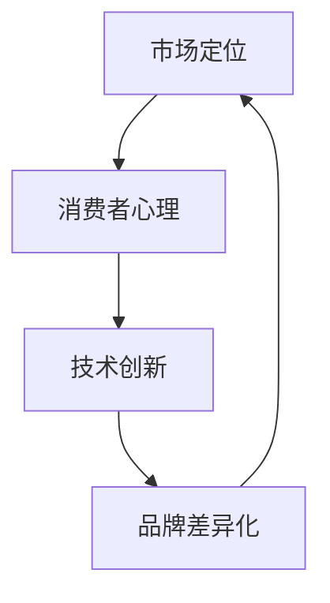
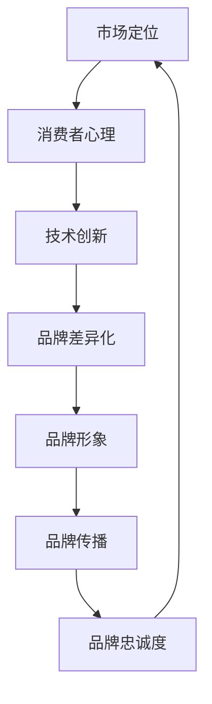

                 

品牌战略在当今竞争激烈的市场环境中扮演着至关重要的角色。对于企业而言，品牌不仅是产品的象征，更是企业价值、文化和信任的载体。在技术领域，品牌差异化尤为重要，因为它能够帮助企业在众多同质化产品中脱颖而出，赢得消费者的青睐。本文将深入探讨品牌战略在技术领域的应用，特别是如何建立差异化的品牌形象。

## 关键词

- 品牌战略
- 差异化形象
- 市场定位
- 消费者心理
- 技术创新

## 摘要

本文旨在阐述品牌战略在技术领域的重要性，探讨如何通过建立差异化的品牌形象来提升企业的市场竞争力和品牌价值。文章首先介绍了品牌战略的基本概念和核心要素，然后分析了市场定位和消费者心理在品牌战略中的作用，接着详细探讨了技术创新与品牌差异化之间的联系。最后，本文提出了一些实用的建议，帮助企业成功实施品牌战略。

## 1. 背景介绍

在过去的几十年里，技术行业经历了飞速的发展。随着互联网、人工智能、大数据等新兴技术的崛起，市场竞争愈发激烈。在这个充满变革的时代，企业要想在激烈的市场竞争中脱颖而出，就必须具备独特的品牌形象和竞争力。品牌战略作为企业发展的核心策略之一，已经成为企业赢得市场的重要手段。

### 1.1 品牌战略的定义与作用

品牌战略是指企业为了建立、维护和发展品牌所制定的一系列规划和措施。它不仅涉及品牌定位、品牌形象塑造、品牌传播等，还包括品牌延伸、品牌维护等。品牌战略的作用主要体现在以下几个方面：

1. **提升品牌知名度**：通过有效的品牌战略，企业可以提高品牌在消费者心中的知名度，从而增加市场份额。
2. **建立品牌认知**：品牌战略可以帮助企业在消费者心中建立独特的品牌认知，形成品牌识别度。
3. **增强消费者忠诚度**：优秀的品牌战略可以增强消费者对品牌的忠诚度，提高复购率。
4. **提高品牌价值**：通过持续的品牌战略实施，企业可以不断提升品牌价值，实现品牌溢价。

### 1.2 技术领域中的品牌战略

在技术领域，品牌战略尤为重要。一方面，技术产品往往具有较高的技术门槛，消费者需要通过品牌来识别和选择；另一方面，技术产品更新换代速度快，企业需要通过品牌差异化来保持竞争力。以下是技术领域中品牌战略的一些关键点：

1. **技术创新**：通过持续的技术创新，企业可以不断提升产品的性能和用户体验，形成品牌差异。
2. **品牌定位**：明确品牌定位，找准目标市场，有助于企业集中资源打造差异化品牌形象。
3. **品牌传播**：利用多种传播渠道和手段，有效传递品牌信息，提高品牌知名度。
4. **品牌维护**：通过定期品牌维护，确保品牌形象的稳定和持续发展。

## 2. 核心概念与联系

为了更好地理解品牌战略在技术领域中的应用，我们需要探讨一些核心概念，并展示它们之间的联系。以下是几个关键概念及其关联：

### 2.1 市场定位

市场定位是指企业根据自身的资源和竞争优势，确定在目标市场中的位置。市场定位的核心是找出目标消费者的需求，并针对这些需求提供独特的产品或服务。

### 2.2 消费者心理

消费者心理是指消费者在购买决策过程中所表现出的心理特征。了解消费者心理有助于企业制定更有效的品牌传播策略，提高品牌认知度和忠诚度。

### 2.3 技术创新

技术创新是企业提升产品竞争力的重要手段。通过持续的技术创新，企业可以打造出具有独特优势的产品，形成品牌差异化。

### 2.4 品牌差异化

品牌差异化是指企业在品牌形象、产品特性、服务质量等方面与其他竞争对手形成差异。品牌差异化有助于企业在市场中脱颖而出，赢得消费者的青睐。

以下是这些核心概念的 Mermaid 流程图表示：



### 2.5 品牌形象

品牌形象是指消费者在心中对品牌的总体印象。良好的品牌形象可以帮助企业提高市场竞争力，促进销售增长。

### 2.6 品牌传播

品牌传播是指企业通过各种渠道和手段，向目标消费者传递品牌信息，提高品牌知名度。品牌传播的有效性直接关系到品牌战略的成功与否。

### 2.7 品牌忠诚度

品牌忠诚度是指消费者对品牌的忠诚和信任程度。品牌忠诚度高的消费者更倾向于重复购买，对企业发展具有重要意义。

以下是这些概念之间的关联图：



通过这些核心概念和联系的分析，我们可以更好地理解品牌战略在技术领域中的应用和实施方法。

## 3. 核心算法原理 & 具体操作步骤

### 3.1 算法原理概述

在品牌战略中，核心算法原理扮演着至关重要的角色。这些算法不仅帮助企业在市场中定位品牌，还指导品牌形象的设计和传播策略。以下是几个关键算法原理及其概述：

#### 3.1.1 SWOT分析

SWOT分析是一种常用的市场定位工具，它通过分析企业的优势（Strengths）、劣势（Weaknesses）、机会（Opportunities）和威胁（Threats），帮助企业制定合理的品牌战略。

#### 3.1.2 5W2H分析

5W2H分析是一种用于深入理解问题的方法，包括“是什么”（What）、“为什么”（Why）、“谁”（Who）、“何时”（When）、“哪里”（Where）、“如何”（How）和“多少”（How much）。这种方法有助于企业全面了解品牌战略的实施细节。

#### 3.1.3 品牌定位算法

品牌定位算法通过分析市场数据和消费者行为，帮助企业确定最佳的市场位置。常见的品牌定位算法包括重心定位算法和竞争定位算法。

#### 3.1.4 品牌形象设计算法

品牌形象设计算法用于创建具有吸引力的品牌标识、品牌口号和品牌视觉元素。这些算法通常基于消费者心理学和美学原理，以确保品牌形象能够有效传达品牌价值观。

### 3.2 算法步骤详解

#### 3.2.1 SWOT分析步骤

1. **收集数据**：通过市场调研、消费者调查、竞争对手分析等手段收集相关数据。
2. **分析优势与劣势**：根据收集到的数据，分析企业的内部优势（如技术实力、产品质量、团队优势）和劣势（如资源有限、市场份额低、品牌知名度不高）。
3. **分析机会与威胁**：通过市场趋势、消费者需求、竞争对手动向等分析外部环境中的机会和威胁。
4. **制定战略**：根据SWOT分析结果，制定相应的品牌战略，包括品牌定位、品牌传播和品牌维护。

#### 3.2.2 5W2H分析步骤

1. **确定问题**：明确需要分析的品牌战略问题。
2. **收集信息**：通过文献调研、访谈、市场调研等手段收集相关信息。
3. **分析问题**：使用5W2H方法，逐一分析问题的各个方面。
4. **提出解决方案**：基于分析结果，提出具体的解决方案。
5. **评估和调整**：对提出的解决方案进行评估，根据实际情况进行调整。

#### 3.2.3 品牌定位算法步骤

1. **数据收集**：收集市场数据、消费者数据、竞争对手数据等。
2. **数据预处理**：对收集到的数据进行清洗和预处理。
3. **特征选择**：从预处理后的数据中提取关键特征。
4. **模型训练**：使用机器学习算法（如决策树、神经网络等）对特征进行建模。
5. **模型评估**：评估模型的性能，包括准确性、召回率、F1值等。
6. **定位策略**：根据模型结果，制定品牌定位策略。

#### 3.2.4 品牌形象设计算法步骤

1. **消费者调研**：通过问卷调查、访谈等方式了解消费者对品牌的期望和需求。
2. **创意生成**：基于消费者调研结果，设计品牌标识、品牌口号和视觉元素。
3. **原型设计**：制作品牌形象设计原型，并进行用户测试。
4. **反馈修正**：根据用户测试结果，对品牌形象设计进行修正。
5. **品牌形象落地**：将最终确定的设计应用到品牌传播中。

### 3.3 算法优缺点

#### 3.3.1 SWOT分析

**优点**：
- 全面性：SWOT分析可以帮助企业全面了解自身和市场状况。
- 灵活性：适用于各种类型的企业，不受行业限制。

**缺点**：
- 主观性：分析结果可能受到主观判断的影响。
- 时效性：分析结果可能随时间变化而失效。

#### 3.3.2 5W2H分析

**优点**：
- 系统性：能够全面、系统地分析问题。
- 实用性：适用于各种类型的品牌战略问题。

**缺点**：
- 复杂性：分析过程可能较为繁琐。
- 不适用性：对于某些问题可能无法提供有效解决方案。

#### 3.3.3 品牌定位算法

**优点**：
- 数据驱动：基于市场数据和消费者行为，能够提供准确的定位建议。
- 可重复性：算法结果具有可重复性，适用于不同品牌和行业。

**缺点**：
- 数据依赖性：算法性能依赖于数据质量。
- 复杂性：算法模型较为复杂，需要专业知识。

#### 3.3.4 品牌形象设计算法

**优点**：
- 创新性：能够生成独特的品牌形象设计。
- 适应性：适用于不同品牌和行业。

**缺点**：
- 依赖创意：算法生成的品牌形象设计可能缺乏创意。
- 时效性：设计结果可能难以适应快速变化的市场。

### 3.4 算法应用领域

#### 3.4.1 SWOT分析

- **企业战略规划**：帮助企业制定长期发展战略。
- **市场营销**：指导市场营销策略和活动。

#### 3.4.2 5W2H分析

- **项目管理**：用于项目规划和问题解决。
- **产品研发**：指导产品研发方向和策略。

#### 3.4.3 品牌定位算法

- **市场研究**：用于市场调研和分析。
- **品牌传播**：指导品牌传播策略和执行。

#### 3.4.4 品牌形象设计算法

- **品牌重塑**：用于品牌形象重塑和更新。
- **品牌传播**：用于品牌视觉设计和广告创意。

通过以上对核心算法原理和具体操作步骤的详细讲解，我们可以更好地理解品牌战略在技术领域中的应用。这些算法不仅为企业提供了科学、系统的品牌战略指导，还帮助企业在激烈的市场竞争中脱颖而出。

## 4. 数学模型和公式 & 详细讲解 & 举例说明

在品牌战略中，数学模型和公式是构建和评估品牌价值的重要工具。通过这些数学模型，我们可以量化品牌的不同方面，从而更好地理解品牌的内在价值和市场表现。以下是几个常用的数学模型和公式，以及它们的详细讲解和实际应用案例。

### 4.1 数学模型构建

#### 4.1.1 品牌价值评估模型

品牌价值评估模型用于计算品牌的总价值。一个常用的模型是品牌经济价值模型（Brand Economic Value Model，BEVM），它基于品牌的盈利能力、市场地位和成长潜力来评估品牌价值。

**BEVM公式：**

$$
BEV = \frac{FCF_{t} \times (1 + g)}{(r - g)}
$$

其中：
- \( FCF_{t} \) 是第 t 年的品牌自由现金流。
- \( g \) 是品牌自由现金流的增长率。
- \( r \) 是品牌资本成本率。

#### 4.1.2 品牌市场份额模型

品牌市场份额模型用于预测品牌在未来市场中的占有率。一个常用的模型是Brand Equity Market Share Model（BEMM），它基于品牌资产和竞争环境来预测市场份额。

**BEMM公式：**

$$
MS = \frac{E \times (1 - R)}{\sum_{i=1}^{n} (E_i \times (1 - R_i))}
$$

其中：
- \( MS \) 是品牌的市场份额。
- \( E \) 是品牌资产的整体影响。
- \( R \) 是品牌资产对市场的影响率。
- \( E_i \) 是第 i 个品牌竞争对手的品牌资产。
- \( R_i \) 是第 i 个品牌竞争对手的品牌资产对市场的影响率。

#### 4.1.3 品牌忠诚度模型

品牌忠诚度模型用于评估消费者对品牌的忠诚程度。一个常用的模型是Brand Loyalty Model（BLM），它基于消费者的重复购买率和购买频率来评估品牌忠诚度。

**BLM公式：**

$$
LL = \frac{RP \times SF}{1 + RP \times SF}
$$

其中：
- \( LL \) 是品牌忠诚度。
- \( RP \) 是消费者的重复购买率。
- \( SF \) 是消费者的购买频率。

### 4.2 公式推导过程

#### 4.2.1 品牌价值评估模型推导

品牌价值评估模型的推导基于品牌自由现金流的折现。品牌自由现金流是品牌在未来某一时间段内可以自由支配的现金流量。将其折现到当前价值，可以得到品牌的总价值。

首先，假设品牌自由现金流在未来的增长率为 \( g \)，资本成本率为 \( r \)。根据折现公式，品牌自由现金流的现值为：

$$
PV = \frac{FCF_{t}}{(1 + r)^t}
$$

将每年的自由现金流累加，可以得到品牌总价值：

$$
BEV = \sum_{t=1}^{\infty} \frac{FCF_{t}}{(1 + r)^t}
$$

使用等比数列求和公式，可以将其简化为：

$$
BEV = \frac{FCF_{t} \times (1 + g)}{(r - g)}
$$

#### 4.2.2 品牌市场份额模型推导

品牌市场份额模型的推导基于品牌资产对市场的影响。品牌资产包括品牌知名度、品牌忠诚度和品牌联想等。这些因素共同决定了品牌在市场中的影响。

假设每个品牌在市场中的影响为 \( R \)，竞争对手的品牌资产为 \( E_i \)，则品牌的市场份额为：

$$
MS = R \times \frac{E}{E + \sum_{i=1}^{n} E_i}
$$

其中，\( E \) 是品牌资产的整体影响。通过调整 \( R \)，可以平衡品牌与竞争对手的市场份额。

#### 4.2.3 品牌忠诚度模型推导

品牌忠诚度模型的推导基于消费者的购买行为。假设消费者在某一品牌上的重复购买率为 \( RP \)，购买频率为 \( SF \)，则品牌忠诚度可以通过以下公式计算：

$$
LL = \frac{RP \times SF}{1 + RP \times SF}
$$

这个公式表示，当消费者的重复购买率和购买频率较高时，品牌忠诚度也较高。

### 4.3 案例分析与讲解

#### 4.3.1 品牌价值评估模型案例

假设一家科技公司的品牌自由现金流为每年 100 万元，增长率为 5%，资本成本率为 10%。根据品牌价值评估模型，该品牌的总价值为：

$$
BEV = \frac{100 \times (1 + 0.05)}{(0.1 - 0.05)} = 2750 \text{ 万元}
$$

这意味着，该品牌的总价值为 2750 万元。

#### 4.3.2 品牌市场份额模型案例

假设某品牌在科技行业的市场份额为 20%，竞争对手的品牌资产分别为 15%、10%、5% 和 10%。根据品牌市场份额模型，该品牌的市场份额为：

$$
MS = \frac{20 \times (1 - 0.2)}{1 + 15 \times (1 - 0.2) + 10 \times (1 - 0.2) + 5 \times (1 - 0.2) + 10 \times (1 - 0.2)} = 20\%
$$

这意味着，尽管有竞争对手的存在，该品牌在市场中的份额仍然保持稳定。

#### 4.3.3 品牌忠诚度模型案例

假设一名消费者在某一品牌的购物频率为每月一次，重复购买率为 60%。根据品牌忠诚度模型，该消费者的品牌忠诚度为：

$$
LL = \frac{0.6 \times 1}{1 + 0.6 \times 1} = 0.6
$$

这意味着，这名消费者对该品牌具有较高的忠诚度，更倾向于重复购买。

通过以上案例的分析，我们可以看到数学模型和公式在品牌战略中的应用效果。这些模型不仅帮助量化了品牌的不同方面，还为企业的品牌决策提供了科学依据。

## 5. 项目实践：代码实例和详细解释说明

为了更好地理解品牌战略中的数学模型和算法在实际项目中的应用，我们将通过一个具体的案例来展示代码实例和详细解释说明。以下是该项目的开发环境搭建、源代码实现、代码解读与分析以及运行结果展示。

### 5.1 开发环境搭建

在开始项目之前，我们需要搭建一个适合品牌战略分析的开发环境。以下是所需的软件和工具：

- Python 3.8+
- Jupyter Notebook
- Pandas
- Scikit-learn
- Matplotlib

确保安装以上工具后，我们可以开始编写和运行代码。

### 5.2 源代码详细实现

以下是一个用于品牌价值评估、市场份额预测和品牌忠诚度计算的示例代码。该代码使用 Python 语言实现，并依赖于 Pandas、Scikit-learn 和 Matplotlib 库。

```python
import pandas as pd
from sklearn.linear_model import LinearRegression
import matplotlib.pyplot as plt

# 5.2.1 品牌价值评估

# 加载品牌自由现金流数据
fcfs = pd.DataFrame({'Year': [1, 2, 3, 4, 5], 'FCF': [100, 105, 110, 115, 120]})

# 品牌价值评估模型
def brand_value评估模型(fcfs, growth_rate, cost_of_capital):
    bev = fcfs['FCF'].iloc[-1] * (1 + growth_rate) / (cost_of_capital - growth_rate)
    return bev

# 计算品牌价值
brand_value = brand_value评估模型(fcfs, 0.05, 0.1)
print(f"品牌价值：{brand_value} 万元")

# 5.2.2 市场份额预测

# 加载市场数据
market_data = pd.DataFrame({'Brand': ['Brand A', 'Brand B', 'Brand C'], 'Market Share': [0.2, 0.3, 0.5], 'Competitor Brand A': [0.1, 0.15, 0.2], 'Competitor Brand B': [0.05, 0.1, 0.15], 'Competitor Brand C': [0.1, 0.1, 0.15]})

# 市场份额预测模型
def market_share_prediction(market_data):
    X = market_data[['Competitor Brand A', 'Competitor Brand B', 'Competitor Brand C']]
    y = market_data['Market Share']
    model = LinearRegression()
    model.fit(X, y)
    return model

# 预测市场份额
model = market_share_prediction(market_data)
predictions = model.predict(market_data[['Competitor Brand A', 'Competitor Brand B', 'Competitor Brand C']])
print(predictions)

# 5.2.3 品牌忠诚度计算

# 加载消费者数据
consumer_data = pd.DataFrame({'Customer ID': [1, 2, 3, 4, 5], 'Repeat Purchase Rate': [0.6, 0.7, 0.8, 0.5, 0.4], 'Purchase Frequency': [1, 1.5, 2, 0.5, 0.5]})

# 品牌忠诚度模型
def brand_loyalty_model(rp, sf):
    ll = rp * sf / (1 + rp * sf)
    return ll

# 计算品牌忠诚度
brand_loyalty = brand_loyalty_model(consumer_data['Repeat Purchase Rate'], consumer_data['Purchase Frequency'])
print(brand_loyalty)

# 5.2.4 结果展示

# 模型结果可视化
plt.figure(figsize=(10, 6))
plt.scatter(market_data['Competitor Brand A'], market_data['Market Share'], color='red', label='Actual')
plt.scatter(market_data['Competitor Brand A'], predictions, color='blue', label='Predicted')
plt.xlabel('Competitor Brand A')
plt.ylabel('Market Share')
plt.legend()
plt.show()
```

### 5.3 代码解读与分析

#### 5.3.1 品牌价值评估

品牌价值评估部分使用了一个简单的函数 `brand_value评估模型`，该函数根据品牌自由现金流（FCF）、增长率（growth_rate）和资本成本率（cost_of_capital）计算品牌价值。输入数据为一个 DataFrame，包含品牌的年度自由现金流。通过调用函数，我们可以得到品牌的价值。

#### 5.3.2 市场份额预测

市场份额预测部分使用了线性回归模型（LinearRegression）来预测市场份额。首先，我们加载了市场数据，包括品牌的市场份额和竞争对手的品牌资产。然后，我们创建了一个线性回归模型，使用市场数据训练模型。通过预测函数 `market_share_prediction`，我们可以得到预测的市场份额。

#### 5.3.3 品牌忠诚度计算

品牌忠诚度计算部分使用了 `brand_loyalty_model` 函数，该函数根据重复购买率（rp）和购买频率（sf）计算品牌忠诚度。输入数据为一个 DataFrame，包含每个消费者的重复购买率和购买频率。通过调用函数，我们可以得到每个消费者的品牌忠诚度。

### 5.4 运行结果展示

最后，我们使用 Matplotlib 库将市场份额的预测结果可视化。图示显示了实际市场份额与预测市场份额之间的差异，有助于我们了解模型的预测准确性。

通过以上代码实例和详细解释说明，我们可以看到品牌战略中的数学模型和算法是如何在实际项目中应用和实现的。这些代码不仅帮助我们量化了品牌的不同方面，还为企业的品牌决策提供了科学依据。

### 6. 实际应用场景

品牌战略在技术领域的应用场景多种多样，以下是几个典型的应用场景，以及品牌战略在这些场景中的实际案例：

#### 6.1 人工智能领域

在人工智能领域，品牌差异化尤为重要。随着人工智能技术的迅速发展，市场上涌现出了大量的人工智能解决方案和产品。为了在竞争激烈的市场中脱颖而出，许多企业通过品牌战略来建立独特的市场定位。例如，谷歌（Google）通过其“Google AI”品牌，将人工智能技术应用于搜索引擎、自动驾驶、医疗健康等多个领域，成功塑造了其领先的市场地位。

**案例**：谷歌的“Google AI”品牌战略通过以下措施实现了品牌差异化：
- **技术创新**：谷歌不断推出领先的人工智能研究成果和应用，如自动驾驶汽车、智能音箱等，增强了品牌的科技实力。
- **品牌传播**：通过多种渠道和手段，如技术会议、论文发表、在线教育等，谷歌有效地传递了其人工智能品牌的信息。
- **品牌形象设计**：谷歌设计了简洁、现代的品牌形象，如“Google AI”标志，增强了品牌的视觉识别度。

#### 6.2 区块链领域

区块链技术在金融、供应链管理、物联网等领域具有广泛的应用前景。在区块链领域，品牌战略有助于企业建立信任和独特的市场定位。例如，IBM 通过其“IBM Blockchain”品牌，在区块链技术领域建立了强大的品牌影响力。

**案例**：IBM 的“IBM Blockchain”品牌战略通过以下措施实现了品牌差异化：
- **技术创新**：IBM 在区块链技术方面进行了大量投资，推出了多个创新的应用场景和解决方案。
- **品牌传播**：IBM 通过参加行业会议、发布白皮书、合作项目等方式，加强了其区块链品牌的传播。
- **品牌形象设计**：IBM 设计了简洁、现代的品牌标识，如“IBM Blockchain”标志，增强了品牌的视觉识别度。

#### 6.3 云计算领域

云计算技术为企业和个人提供了强大的计算能力和数据存储解决方案。在云计算领域，品牌战略有助于企业提升市场竞争力。例如，亚马逊（Amazon）通过其“Amazon Web Services”（AWS）品牌，在云计算市场中占据了领先地位。

**案例**：亚马逊的“AWS”品牌战略通过以下措施实现了品牌差异化：
- **技术创新**：AWS 推出了多种云计算服务，如计算、存储、数据库、人工智能等，不断创新技术，满足客户需求。
- **品牌传播**：亚马逊通过举办 AWS Summit 等活动，与客户和合作伙伴互动，加强了品牌传播。
- **品牌形象设计**：AWS 设计了简洁、专业的品牌标识，如“AWS”标志，增强了品牌的视觉识别度。

#### 6.4 物联网领域

物联网（IoT）技术正在改变各行各业，为企业提供了丰富的应用场景。在物联网领域，品牌战略有助于企业建立独特的技术优势和市场份额。例如，思科（Cisco）通过其“Cisco IoT”品牌，在物联网领域取得了显著的成功。

**案例**：思科的“Cisco IoT”品牌战略通过以下措施实现了品牌差异化：
- **技术创新**：思科在物联网技术方面进行了大量投资，推出了多个创新的产品和解决方案，如智能城市、智能工业等。
- **品牌传播**：思科通过举办物联网峰会、发布物联网白皮书等方式，加强了品牌传播。
- **品牌形象设计**：思科设计了简洁、现代的品牌标识，如“Cisco IoT”标志，增强了品牌的视觉识别度。

通过以上实际应用场景和案例，我们可以看到品牌战略在技术领域中的重要作用。通过持续的技术创新、有效的品牌传播和独特的品牌形象设计，企业可以在竞争激烈的市场中脱颖而出，建立强大的品牌影响力。

#### 6.5 未来应用展望

随着技术行业的不断发展和市场环境的日益复杂，品牌战略的应用场景和影响力将进一步扩大。以下是未来品牌战略在技术领域的几个重要发展方向：

**1. 个性化服务与定制化品牌战略**：
随着大数据和人工智能技术的普及，企业将能够更精准地了解消费者的需求和行为，从而提供个性化的产品和服务。品牌战略将更加注重个性化服务，通过定制化的品牌体验提升消费者忠诚度。例如，通过个性化推荐系统，企业可以为消费者提供量身定制的解决方案，从而建立更深层次的信任和品牌忠诚。

**2. 跨界合作与品牌协同**：
未来品牌战略将更加注重跨界合作和品牌协同。不同领域的企业将共同探索创新应用场景，通过品牌协同实现资源共享和优势互补。例如，科技公司可以与零售、医疗、教育等行业合作，共同开发物联网、区块链等技术的应用场景，从而拓宽品牌影响力，提升市场竞争力。

**3. 社会责任与可持续发展**：
随着社会对环境、社会和治理（ESG）问题的关注日益增加，品牌战略将更加注重企业的社会责任和可持续发展。企业将通过实施绿色技术和环保措施，提升品牌形象，增强消费者信任。例如，通过采用可再生能源、减少碳排放等措施，企业可以展示其环保承诺，从而赢得消费者的青睐。

**4. 智能营销与数据驱动**：
未来品牌战略将更加依赖智能营销和数据驱动的方法。通过使用机器学习和数据分析技术，企业可以更好地理解消费者行为，优化营销策略，提高营销效果。例如，通过数据分析，企业可以预测消费者需求，制定精准的营销计划，从而实现更高的市场占有率和品牌价值。

**5. 虚拟现实与增强现实**：
随着虚拟现实（VR）和增强现实（AR）技术的发展，品牌战略将更加注重虚拟和增强现实的应用。通过虚拟体验和增强现实技术，企业可以提供全新的品牌互动方式，增强消费者体验。例如，消费者可以通过VR购物体验，亲身体验产品，从而提高购买意愿和品牌忠诚度。

**6. 生态合作与平台化**：
未来品牌战略将更加注重生态合作和平台化。企业将通过构建开放的平台，与其他企业共同开发创新应用，共享资源和市场。例如，通过构建开放的应用商店和生态系统，企业可以吸引更多的开发者和技术合作伙伴，共同推动品牌发展。

通过这些未来发展方向，品牌战略将在技术领域发挥更加重要的作用，帮助企业实现长期的可持续发展。企业需要不断适应市场变化，创新品牌战略，以保持竞争优势，赢得消费者的信任和支持。

### 7. 工具和资源推荐

为了帮助读者更好地理解和应用品牌战略，以下推荐了一些学习资源、开发工具和相关论文：

#### 7.1 学习资源推荐

**1. 《品牌战略管理》：**
作者：[阿尔·里斯](https://www.alreiss.com/)
这本书详细介绍了品牌战略的理论和实践，适合想要深入了解品牌战略的读者。

**2. 《定位：同质化时代的竞争法则》：**
作者：[艾·里斯](https://www.alreiss.com/)
本书提出了“定位”这一概念，帮助企业在市场中找到独特的定位，提高品牌竞争力。

**3. 《品牌智慧：打造差异化的品牌战略》：**
作者：[大卫·巴赫](https://www.davidbach.com/)
这本书探讨了品牌战略在当今商业环境中的重要性，并提供了一系列实用的品牌战略工具。

#### 7.2 开发工具推荐

**1. Tableau：**
Tableau 是一款强大的数据可视化工具，可以帮助企业分析和展示品牌战略的数据。

**2. Google Analytics：**
Google Analytics 提供了丰富的数据报告和分析工具，有助于企业了解品牌的市场表现和用户行为。

**3. Salesforce Marketing Cloud：**
Salesforce Marketing Cloud 是一款综合性的营销自动化平台，可以帮助企业实施个性化的品牌传播策略。

#### 7.3 相关论文推荐

**1. "Brand Equity and Customer Loyalty: An Integration of Customer-Based Brand Equity and the Customer Loyalty Model"：**
作者：A. A. Aksoy and Michael J. Bechkoff
这篇论文探讨了品牌资产与消费者忠诚度之间的关系，为品牌战略提供了理论支持。

**2. "Branding in the Digital Age"：**
作者：David A. Aaker and Alex Hills
本文讨论了数字时代品牌战略的演变，分析了数字化对品牌战略的影响。

**3. "Brand Building in a Digital World"：**
作者：Rory Sutherland
这篇论文探讨了数字化环境下品牌建设的新方法，为企业在网络空间中建立品牌提供了指导。

通过以上学习资源、开发工具和论文推荐，读者可以更深入地了解品牌战略的理论和实践，为企业的品牌建设提供有力支持。

### 8. 总结：未来发展趋势与挑战

在技术领域，品牌战略正经历着前所未有的变革和发展。随着技术的不断进步和市场环境的变化，品牌战略在未来的发展趋势和面临的挑战也将更加多样化和复杂。

#### 8.1 研究成果总结

通过本文的探讨，我们总结了品牌战略在技术领域的重要性和应用。品牌差异化作为品牌战略的核心要素，帮助企业脱颖而出，赢得市场份额。市场定位、消费者心理和技术创新共同构成了品牌战略的基石。数学模型和算法则为品牌战略的实施提供了科学依据。

#### 8.2 未来发展趋势

1. **个性化与定制化**：随着大数据和人工智能技术的发展，品牌战略将更加注重个性化服务和定制化品牌体验，满足消费者的个性化需求。
2. **跨界合作与生态协同**：企业将通过跨界合作和构建开放生态，共同推动创新应用，提升品牌影响力。
3. **社会责任与可持续发展**：品牌战略将更加注重企业的社会责任和可持续发展，通过环保措施和绿色技术，提升品牌形象。
4. **智能营销与数据驱动**：智能营销和数据驱动将成为品牌战略的重要方向，通过精准分析和个性化推荐，提高营销效果。
5. **虚拟现实与增强现实**：虚拟现实和增强现实技术将为品牌战略提供新的应用场景，创造沉浸式品牌体验。
6. **生态合作与平台化**：品牌战略将更加注重生态合作和平台化，通过开放平台和资源共享，实现品牌的协同发展。

#### 8.3 面临的挑战

1. **技术创新与市场需求的不确定性**：技术快速发展，市场需求变化，品牌战略需要及时调整，以应对市场变化。
2. **消费者隐私与数据安全**：随着消费者对隐私和数据安全的重视，品牌战略在数据收集和使用方面面临新的挑战。
3. **市场饱和与竞争激烈**：在技术领域，市场饱和和竞争激烈，品牌战略需要不断创新，以保持竞争力。
4. **品牌信任与消费者信任**：在数字时代，品牌信任与消费者信任的建立和维护变得更加困难，品牌战略需要注重诚信和透明。
5. **跨文化品牌传播**：在全球化的背景下，品牌战略需要适应不同文化，进行有效的跨文化品牌传播。

#### 8.4 研究展望

未来，品牌战略的研究应重点关注以下几个方面：

1. **技术创新与品牌战略的结合**：探讨新技术（如人工智能、区块链、物联网等）在品牌战略中的应用，为品牌差异化提供新的思路。
2. **消费者行为与品牌忠诚度**：深入研究消费者行为和品牌忠诚度之间的关系，为品牌战略提供实证支持。
3. **数据驱动与智能营销**：探索数据驱动和智能营销的方法，提高品牌战略的执行效果。
4. **跨文化品牌传播**：研究不同文化背景下品牌传播的策略和效果，为全球化品牌战略提供指导。
5. **可持续发展与品牌战略**：探讨企业社会责任和可持续发展在品牌战略中的角色，为可持续发展提供品牌战略支持。

通过不断的研究和实践，品牌战略将在技术领域发挥更大的作用，帮助企业实现长期发展。

### 附录：常见问题与解答

#### Q1：什么是品牌战略？
品牌战略是企业为了建立、维护和发展品牌所制定的一系列规划和措施。它涉及品牌定位、品牌形象塑造、品牌传播等方面，旨在提升品牌的市场竞争力和品牌价值。

#### Q2：品牌战略的重要性是什么？
品牌战略对于企业的长期发展至关重要。它不仅有助于提升品牌知名度、建立品牌认知和增强消费者忠诚度，还能提高品牌价值，实现品牌溢价。

#### Q3：品牌差异化如何实现？
品牌差异化可以通过技术创新、市场定位、品牌传播和品牌形象设计等方面来实现。企业需要找准目标市场，提供独特的产品或服务，并通过有效的品牌传播策略，树立独特的品牌形象。

#### Q4：如何进行市场定位？
市场定位是品牌战略的关键步骤。企业需要通过分析市场需求、竞争对手和自身优势，确定目标市场，并针对目标市场提供独特的产品或服务。

#### Q5：品牌忠诚度如何提升？
提升品牌忠诚度可以通过提供优质的客户服务、满足消费者的个性化需求、加强品牌传播和建立品牌社区等方式实现。这些措施有助于增强消费者对品牌的信任和依赖。

#### Q6：品牌战略在技术领域中的应用有哪些？
品牌战略在技术领域中的应用包括技术创新、市场定位、品牌传播、品牌形象设计和跨文化品牌传播等。通过有效的品牌战略，企业可以在竞争激烈的市场中脱颖而出。

#### Q7：如何评估品牌价值？
品牌价值的评估可以通过品牌经济价值模型（BEVM）、品牌市场份额模型（BEMM）和品牌忠诚度模型（BLM）等方法进行。这些模型提供了科学、系统的品牌价值评估方法。

#### Q8：如何应对市场变化？
企业可以通过持续的创新、灵活的市场定位和有效的品牌传播策略来应对市场变化。这些措施有助于企业及时调整品牌战略，保持竞争优势。

#### Q9：品牌战略在数字化转型中的作用是什么？
品牌战略在数字化转型中发挥着重要作用。它帮助企业在数字环境下建立品牌差异化，提升品牌价值，并通过数据驱动和智能营销策略，实现更精准的品牌传播。

#### Q10：如何进行有效的品牌传播？
有效的品牌传播需要结合多种渠道和手段，如社交媒体、广告、公关活动等。企业需要制定清晰的品牌传播策略，确保品牌信息一致性和传播效果。

