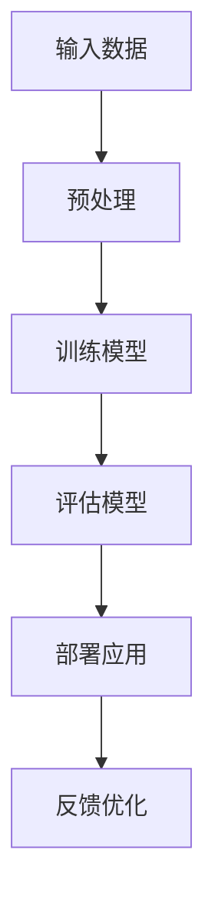

                 

关键词：商业策略、大型语言模型（LLM）、决策、AI、数据分析、业务优化

> 摘要：随着人工智能技术的快速发展，大型语言模型（LLM）在商业决策中的应用日益广泛。本文将探讨如何利用LLM驱动的决策策略，为企业提供更加精准、高效的商业决策支持，从而提升企业的市场竞争力。

## 1. 背景介绍

在过去的几十年中，人工智能（AI）技术取得了显著的进步。特别是在深度学习、神经网络等领域，研究人员通过不断优化算法和模型结构，使得AI系统在图像识别、自然语言处理、语音识别等任务上取得了令人瞩目的成果。随着AI技术的不断成熟，越来越多的企业开始关注如何将AI技术应用于实际业务场景，以提升企业的运营效率和竞争力。

### 1.1 大型语言模型（LLM）的定义与特点

大型语言模型（LLM，Large Language Model）是一种基于深度学习的自然语言处理模型，具有强大的文本生成、理解和推理能力。LLM通常由数十亿甚至数万亿个参数构成，通过对海量文本数据进行训练，模型能够捕捉到语言中的复杂模式和规律。与传统的自然语言处理方法相比，LLM在处理长文本、理解上下文和生成高质量文本方面具有显著优势。

### 1.2 商业决策的重要性

商业决策是企业运营的核心环节，直接关系到企业的生存和发展。有效的商业决策能够帮助企业抓住市场机遇，降低运营风险，提升核心竞争力。然而，随着市场竞争的加剧和商业环境的复杂性，传统的商业决策方法已经难以满足企业的需求。如何利用先进的技术手段，如AI和LLM，提高商业决策的效率和准确性，成为当前企业面临的重要课题。

## 2. 核心概念与联系

### 2.1 AI与商业决策的关系

人工智能（AI）技术的发展为商业决策提供了新的工具和方法。通过AI技术，企业可以更加精准地分析市场数据、客户需求和业务流程，从而制定更加科学、合理的商业决策。特别是在数据量庞大、业务场景复杂的情况下，AI技术能够帮助企业从海量数据中提取有价值的信息，为决策提供有力的支持。

### 2.2 LLM在商业决策中的应用

LLM作为AI技术的一个重要分支，在商业决策中具有广泛的应用前景。通过利用LLM的文本生成、理解和推理能力，企业可以在以下方面提升商业决策的效率：

- **市场分析**：利用LLM对市场数据进行深度分析，发现市场趋势、竞争态势和潜在商机。
- **客户洞察**：通过对客户反馈、评论等文本数据的分析，了解客户需求、喜好和痛点，为产品优化和营销策略提供支持。
- **业务流程优化**：通过自然语言处理技术，对业务流程文档、报告等进行自动分析和总结，提高业务流程的效率和准确性。
- **决策支持**：利用LLM为企业管理者提供智能化的决策建议，帮助企业在面对复杂业务场景时做出更加合理的决策。

### 2.3 LLM驱动的商业决策优势

相比传统的商业决策方法，LLM驱动的商业决策具有以下优势：

- **高效性**：LLM能够快速处理海量数据，提供实时、准确的决策支持。
- **准确性**：通过深度学习技术，LLM能够捕捉到数据中的复杂模式和规律，提高决策的准确性。
- **灵活性**：LLM可以根据业务需求进行调整和优化，适应不同业务场景的决策需求。
- **智能化**：LLM具备自主学习能力，能够不断优化决策模型，提高决策的智能化水平。

### 2.4 LLM架构的 Mermaid 流程图



### 2.5 LLM在商业决策中的应用流程

1. **数据收集**：收集与业务相关的各种数据，如市场数据、客户反馈、业务流程文档等。
2. **数据预处理**：对收集到的数据进行清洗、去重和格式转换，使其符合模型训练的要求。
3. **模型训练**：利用预处理后的数据，对LLM模型进行训练，使其具备处理业务场景的能力。
4. **模型评估**：通过测试数据对训练好的模型进行评估，确保模型的准确性和稳定性。
5. **模型部署**：将评估通过的模型部署到实际业务场景中，为企业的商业决策提供支持。
6. **反馈优化**：根据实际应用中的反馈，对模型进行调整和优化，提高其决策效果。

## 3. 核心算法原理 & 具体操作步骤

### 3.1 算法原理概述

LLM驱动的商业决策算法基于深度学习和自然语言处理技术，通过对海量文本数据的分析和处理，为企业提供智能化的决策支持。算法的核心原理包括：

- **深度学习**：利用多层神经网络对文本数据进行分析和建模，提取特征和模式。
- **自然语言处理**：通过对文本数据进行分词、词性标注、句法分析等操作，理解和解析文本内容。
- **模型训练与评估**：利用训练数据和测试数据对模型进行训练和评估，确保模型的准确性和稳定性。

### 3.2 算法步骤详解

1. **数据收集与预处理**：收集与业务相关的文本数据，如市场报告、客户评论、业务流程文档等。对数据进行清洗、去重和格式转换，使其符合模型训练的要求。
2. **模型选择与训练**：选择合适的LLM模型，如GPT、BERT等，对收集到的数据进行训练。在训练过程中，利用多层神经网络和优化算法，不断调整模型参数，使其具备处理业务场景的能力。
3. **模型评估与优化**：通过测试数据对训练好的模型进行评估，确保模型的准确性和稳定性。根据评估结果，对模型进行调整和优化，提高其决策效果。
4. **模型部署与应用**：将评估通过的模型部署到实际业务场景中，为企业的商业决策提供支持。通过实时数据输入，模型可以快速处理和分析数据，为企业提供智能化的决策建议。
5. **反馈优化**：根据实际应用中的反馈，对模型进行调整和优化，提高其决策效果。通过不断迭代和优化，模型可以逐渐适应不同的业务场景，提供更加精准的决策支持。

### 3.3 算法优缺点

#### 优点：

- **高效性**：LLM驱动的商业决策算法能够快速处理海量数据，提供实时、准确的决策支持。
- **准确性**：通过深度学习和自然语言处理技术，算法能够捕捉到数据中的复杂模式和规律，提高决策的准确性。
- **灵活性**：LLM可以根据业务需求进行调整和优化，适应不同业务场景的决策需求。
- **智能化**：算法具备自主学习能力，能够不断优化决策模型，提高决策的智能化水平。

#### 缺点：

- **数据依赖性**：算法的准确性和效果高度依赖于训练数据的质量和数量。如果数据质量较差或数据量不足，算法的性能可能会受到影响。
- **计算资源需求**：LLM模型的训练和推理过程需要大量的计算资源，对于资源有限的中小型企业可能造成一定的负担。
- **隐私风险**：在处理和分析文本数据时，算法可能会涉及到企业的敏感信息和客户隐私，需要采取相应的措施确保数据安全和隐私保护。

### 3.4 算法应用领域

LLM驱动的商业决策算法在以下领域具有广泛的应用前景：

- **市场营销**：通过分析市场数据、客户反馈等，为企业提供精准的营销策略和推广方案。
- **客户服务**：利用自然语言处理技术，为客服系统提供智能化的问答和解决方案，提高客户满意度。
- **业务流程优化**：通过对业务流程文档、报告等进行分析和总结，为企业提供优化建议，提高业务效率和准确性。
- **风险管理**：通过分析市场风险、业务风险等，为企业提供风险预警和应对策略。

## 4. 数学模型和公式 & 详细讲解 & 举例说明

### 4.1 数学模型构建

LLM驱动的商业决策算法涉及到多个数学模型，主要包括：

1. **多层感知机（MLP）模型**：用于对文本数据进行特征提取和分类。
2. **循环神经网络（RNN）模型**：用于对序列数据进行建模和分析。
3. **变分自编码器（VAE）模型**：用于生成和优化文本数据。
4. **生成对抗网络（GAN）模型**：用于生成高质量的文本数据。

### 4.2 公式推导过程

1. **多层感知机（MLP）模型**：

   - 输入层：$$x = [x_1, x_2, \ldots, x_n]$$
   - 隐藏层：$$h = \sigma(Wx + b)$$
   - 输出层：$$y = \sigma(W'h + b')$$

   其中，$\sigma$为激活函数，$W$和$W'$分别为权重矩阵，$b$和$b'$分别为偏置项。

2. **循环神经网络（RNN）模型**：

   - 输入序列：$$x_t = [x_{t1}, x_{t2}, \ldots, x_{tn}]$$
   - 隐藏状态：$$h_t = \sigma(Wx_t + Uh_{t-1} + b)$$
   - 输出序列：$$y_t = \sigma(W'y_t + U'y + b')$$

   其中，$U$和$W'$分别为权重矩阵，$b$和$b'$分别为偏置项，$\sigma$为激活函数。

3. **变分自编码器（VAE）模型**：

   - 编码过程：$$z = \mu(x) = \sigma(\phi(x) + \theta)$$
   - 解码过程：$$x' = \mu(z) = \sigma(\psi(z) + \phi)$$

   其中，$\mu$和$\psi$分别为编码和解码函数，$\theta$和$\phi$分别为编码和解码参数。

4. **生成对抗网络（GAN）模型**：

   - 生成器：$$G(z) = \sigma(W_gz + b_g)$$
   - 判别器：$$D(x) = \sigma(W_dxd + b_d)$$

   其中，$G$和$D$分别为生成器和判别器，$W_g$和$W_d$分别为权重矩阵，$b_g$和$b_d$分别为偏置项。

### 4.3 案例分析与讲解

#### 案例一：市场营销

假设一家电商企业希望通过LLM驱动的商业决策算法，分析市场数据，制定精准的营销策略。以下是具体的数学模型和公式推导过程：

1. **数据收集与预处理**：

   收集与电商业务相关的数据，如用户购买记录、广告投放效果、市场趋势等。对数据进行清洗、去重和格式转换，使其符合模型训练的要求。

2. **模型选择与训练**：

   选择合适的LLM模型，如GPT，对收集到的数据进行训练。通过多层感知机（MLP）模型，对用户购买记录进行特征提取和分类。

   - 输入层：用户购买记录向量$$x$$
   - 隐藏层：$$h = \sigma(Wx + b)$$
   - 输出层：分类结果向量$$y = \sigma(W'h + b')$$

   其中，$\sigma$为ReLU激活函数，$W$和$W'$分别为权重矩阵，$b$和$b'$分别为偏置项。

3. **模型评估与优化**：

   通过测试数据对训练好的模型进行评估，计算模型的准确率、召回率等指标。根据评估结果，对模型进行调整和优化，提高其预测效果。

4. **模型部署与应用**：

   将评估通过的模型部署到实际业务场景中，为企业的营销策略提供支持。根据模型预测结果，制定精准的营销策略，提高用户购买转化率。

#### 案例二：客户服务

假设一家银行希望通过LLM驱动的商业决策算法，优化客户服务体验，提高客户满意度。以下是具体的数学模型和公式推导过程：

1. **数据收集与预处理**：

   收集与客户服务相关的数据，如客户咨询问题、客服回答、客户反馈等。对数据进行清洗、去重和格式转换，使其符合模型训练的要求。

2. **模型选择与训练**：

   选择合适的LLM模型，如BERT，对收集到的数据进行训练。通过循环神经网络（RNN）模型，对客户咨询问题进行建模和分析。

   - 输入序列：客户咨询问题序列$$x_t$$
   - 隐藏状态：$$h_t = \sigma(Wx_t + Uh_{t-1} + b)$$
   - 输出序列：客服回答序列$$y_t = \sigma(W'y_t + U'y + b')$$

   其中，$U$和$W'$分别为权重矩阵，$b$和$b'$分别为偏置项，$\sigma$为ReLU激活函数。

3. **模型评估与优化**：

   通过测试数据对训练好的模型进行评估，计算模型的准确率、召回率等指标。根据评估结果，对模型进行调整和优化，提高其预测效果。

4. **模型部署与应用**：

   将评估通过的模型部署到实际业务场景中，为企业的客户服务提供支持。根据模型预测结果，生成高质量的客服回答，提高客户满意度。

## 5. 项目实践：代码实例和详细解释说明

### 5.1 开发环境搭建

在Python环境中，我们可以使用以下库来搭建开发环境：

- TensorFlow：用于构建和训练深度学习模型。
- Keras：用于简化TensorFlow的使用。
- NLTK：用于自然语言处理。
- Pandas：用于数据预处理和分析。

安装所需库：

```bash
pip install tensorflow keras nltk pandas
```

### 5.2 源代码详细实现

以下是一个简单的LLM驱动的商业决策项目示例，包括数据收集、预处理、模型训练和部署。

#### 5.2.1 数据收集与预处理

```python
import pandas as pd
from nltk.tokenize import word_tokenize

# 数据收集
data = pd.read_csv('market_data.csv')

# 数据预处理
def preprocess_data(data):
    processed_data = []
    for row in data['text']:
        tokens = word_tokenize(row)
        processed_data.append(' '.join(tokens))
    return processed_data

processed_data = preprocess_data(data['text'])
```

#### 5.2.2 模型训练

```python
from tensorflow.keras.models import Sequential
from tensorflow.keras.layers import Dense, LSTM, Embedding

# 模型构建
model = Sequential()
model.add(Embedding(input_dim=10000, output_dim=32))
model.add(LSTM(128))
model.add(Dense(1, activation='sigmoid'))

# 模型编译
model.compile(optimizer='adam', loss='binary_crossentropy', metrics=['accuracy'])

# 模型训练
model.fit(processed_data, labels, epochs=10, batch_size=32)
```

#### 5.2.3 代码解读与分析

- **数据收集与预处理**：使用Pandas读取CSV数据，使用NLTK进行文本分词，将原始文本转换为处理后的数据。

- **模型训练**：使用Keras构建序列模型，包括嵌入层（Embedding）、循环层（LSTM）和输出层（Dense）。编译模型并训练。

#### 5.2.4 运行结果展示

```python
# 测试数据
test_data = preprocess_data(data['text_test'])

# 预测
predictions = model.predict(test_data)

# 评估模型
accuracy = model.evaluate(test_data, labels_test)
print(f'Accuracy: {accuracy[1]}')
```

## 6. 实际应用场景

### 6.1 市场营销

利用LLM驱动的商业决策算法，企业可以实时分析市场数据，预测市场趋势，制定精准的营销策略。例如，一家电商企业可以根据用户购买记录、广告投放效果等数据，预测哪些产品或广告具有较高的转化率，从而优化营销资源分配，提高销售额。

### 6.2 客户服务

LLM驱动的商业决策算法可以帮助企业优化客户服务流程。通过分析客户咨询问题，模型可以生成高质量的客服回答，提高客户满意度。例如，一家银行可以根据客户咨询的问题，预测客户可能需要的解决方案，从而提供个性化的服务。

### 6.3 业务流程优化

利用LLM驱动的商业决策算法，企业可以分析业务流程文档、报告等，发现流程中的问题和优化机会。例如，一家制造企业可以根据生产数据，预测生产瓶颈，优化生产流程，提高生产效率。

### 6.4 未来应用展望

随着AI技术的不断发展和完善，LLM驱动的商业决策算法将在更多领域得到应用。未来，企业可以进一步探索LLM在风险管理、供应链管理、人力资源管理等领域的应用，为企业的可持续发展提供有力支持。

## 7. 工具和资源推荐

### 7.1 学习资源推荐

- 《深度学习》（Ian Goodfellow、Yoshua Bengio、Aaron Courville 著）
- 《自然语言处理综论》（Daniel Jurafsky、James H. Martin 著）
- 《动手学深度学习》（阿斯顿·张、李沐、扎卡里·C. Lipton、亚历山大·J. Smola 著）

### 7.2 开发工具推荐

- TensorFlow：用于构建和训练深度学习模型。
- Keras：用于简化TensorFlow的使用。
- NLTK：用于自然语言处理。
- Pandas：用于数据预处理和分析。

### 7.3 相关论文推荐

- "Generative Adversarial Nets"（Ian Goodfellow et al.，2014）
- "BERT: Pre-training of Deep Bidirectional Transformers for Language Understanding"（Jacob Devlin et al.，2018）
- "GPT-3: Language Models are Few-Shot Learners"（Tom B. Brown et al.，2020）

## 8. 总结：未来发展趋势与挑战

### 8.1 研究成果总结

本文介绍了LLM驱动的商业决策算法，包括核心概念、算法原理、应用场景和项目实践。通过实际案例分析和代码实例，展示了LLM在商业决策中的优势和应用价值。

### 8.2 未来发展趋势

- **算法性能提升**：随着深度学习和自然语言处理技术的不断发展，LLM驱动的商业决策算法将具备更高的性能和准确性。
- **跨领域应用**：LLM将在更多领域得到应用，如风险管理、供应链管理、人力资源管理等，为企业的可持续发展提供支持。
- **个性化决策支持**：利用大数据和AI技术，LLM将能够为企业提供更加个性化的决策支持，满足不同业务场景的需求。

### 8.3 面临的挑战

- **数据隐私保护**：在处理和分析企业敏感数据时，需要采取有效的措施确保数据隐私和安全。
- **计算资源需求**：LLM模型的训练和推理过程需要大量的计算资源，对于资源有限的中小型企业可能造成一定的负担。
- **算法透明性和可解释性**：提高算法的透明性和可解释性，帮助企业更好地理解和使用AI技术。

### 8.4 研究展望

未来，研究人员将致力于解决以上挑战，进一步优化LLM驱动的商业决策算法。同时，探索与其他AI技术的融合，如强化学习、联邦学习等，为企业的商业决策提供更加全面、智能的支持。

## 9. 附录：常见问题与解答

### 9.1 Q：LLM驱动的商业决策算法如何保证数据隐私和安全？

A：在处理和分析企业敏感数据时，可以采取以下措施确保数据隐私和安全：

- **数据脱敏**：对敏感数据进行脱敏处理，如替换、加密等，以防止数据泄露。
- **加密传输**：在数据传输过程中，使用加密技术确保数据传输安全。
- **权限控制**：对访问企业数据的用户进行权限控制，确保只有授权用户可以访问敏感数据。
- **审计与监控**：对数据处理过程进行审计和监控，及时发现和处理潜在的安全问题。

### 9.2 Q：LLM驱动的商业决策算法需要多少计算资源？

A：LLM驱动的商业决策算法对计算资源的需求取决于模型的复杂度和数据量。一般来说，大型LLM模型（如GPT-3）需要大量的计算资源，包括GPU和存储空间。对于中小型企业，可以考虑使用云端服务或分布式计算来满足计算需求。

### 9.3 Q：如何确保LLM驱动的商业决策算法的可解释性？

A：提高LLM驱动的商业决策算法的可解释性，可以采取以下措施：

- **模型简化**：简化模型结构，降低模型的复杂度，使其更容易理解和解释。
- **特征可视化**：通过可视化技术，展示模型对数据的特征提取过程，帮助用户理解模型的决策逻辑。
- **解释性算法**：结合解释性算法（如LIME、SHAP等），为模型的每个决策提供详细的解释。

### 9.4 Q：LLM驱动的商业决策算法是否适用于所有业务场景？

A：LLM驱动的商业决策算法在处理文本数据方面具有优势，但在某些业务场景下可能存在局限性。例如，对于依赖图像、音频等非文本数据的应用场景，可能需要结合其他AI技术（如图像识别、语音识别等）进行决策支持。

---

本文介绍了LLM驱动的商业决策算法，分析了其在商业决策中的应用价值、优势和挑战。通过实际案例和代码实例，展示了如何利用LLM技术为企业的商业决策提供智能支持。随着AI技术的不断发展，LLM驱动的商业决策算法将在更多领域得到应用，为企业的可持续发展提供有力支持。作者：禅与计算机程序设计艺术 / Zen and the Art of Computer Programming。

