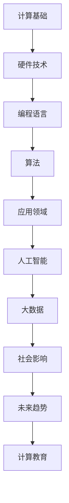

                 

关键词：计算机发展、计算技术、未来趋势、人工智能、编程语言、硬件进步、算法创新

> 摘要：本文将回顾人类计算的发展历程，探讨当前技术的现状，并预测未来计算的潜在趋势和挑战。通过分析历史上的重要里程碑和当前技术的最新进展，本文旨在为读者提供一个全面而深刻的理解，以便更好地把握未来计算技术的发展方向。

## 1. 背景介绍

计算机科学作为一门学科，起源于20世纪中叶。从最初的机械计算机到现代的超级计算机，人类计算经历了翻天覆地的变化。计算机的出现不仅改变了科学研究的模式，也深刻影响了社会生活的方方面面。随着计算技术的不断发展，计算机的性能不断提升，应用范围也在不断扩展。

在过去的几十年里，计算机硬件的进步尤为显著。从电子管到晶体管，再到集成电路和微处理器，硬件技术的演进推动了计算能力的指数级增长。与此同时，编程语言的发展也为计算机科学带来了新的活力。从汇编语言到高级编程语言，程序员们拥有了更加高效和强大的工具，使得复杂问题的求解变得更加容易。

算法作为计算机科学的核心，也在不断进化。从经典的排序算法到现代的机器学习算法，算法的创新推动了计算效率的显著提升。随着大数据和人工智能的兴起，算法的应用范围也在不断扩大，从数据挖掘到自然语言处理，从图像识别到自动驾驶，算法正在深刻改变我们的生活和工作方式。

## 2. 核心概念与联系

为了更好地理解计算机科学的发展，我们首先需要了解一些核心概念和它们之间的联系。以下是使用Mermaid绘制的流程图，展示了这些核心概念及其相互关系：



### 2.1 计算基础

计算基础是计算机科学的核心，包括数字逻辑、计算机架构、操作系统等。这些基础为现代计算技术提供了理论支撑。

### 2.2 硬件技术

硬件技术的发展是计算能力提升的关键。从电子管到微处理器，硬件技术的不断进步推动了计算性能的指数级增长。

### 2.3 编程语言

编程语言是程序员与计算机之间的桥梁。从汇编语言到高级编程语言，编程语言的不断演进使得复杂问题的求解变得更加高效。

### 2.4 算法

算法是计算机科学的核心。从排序算法到机器学习算法，算法的创新推动了计算效率的显著提升。

### 2.5 应用领域

算法和应用领域的结合，使得计算机技术在各个行业得到了广泛应用。从数据挖掘到自然语言处理，算法正在深刻改变我们的生活和工作方式。

### 2.6 人工智能

人工智能是计算技术的前沿领域，包括机器学习、深度学习等。人工智能的发展正在推动计算机技术向更加智能化和自动化的方向发展。

### 2.7 大数据和大数据分析

大数据和大数据分析是当前的热门领域。随着数据量的爆炸性增长，如何高效地存储、处理和分析海量数据成为了一个重要的研究课题。

### 2.8 社会影响

计算机技术的快速发展不仅改变了科学研究的模式，也深刻影响了社会生活的方方面面。从医疗健康到金融科技，计算机技术正在改变我们的生活方式。

### 2.9 未来趋势

未来，计算机技术将继续发展，人工智能、量子计算、物联网等新技术将成为研究热点。计算机科学将继续在推动社会进步中发挥重要作用。

### 2.10 计算教育

计算教育的普及将培养更多的人才，推动计算机技术的创新和发展。未来的计算教育将更加注重理论与实践相结合，培养学生的创新能力和实际操作能力。

## 3. 核心算法原理 & 具体操作步骤

### 3.1 算法原理概述

算法是计算机科学的核心，它是解决特定问题的一系列有序步骤。算法的效率直接影响到计算机的性能。常见的算法包括排序算法、搜索算法、图算法等。

排序算法的基本原理是通过一系列比较和交换操作，将一组数据元素按照某种规则进行排列。常见的排序算法有冒泡排序、选择排序、插入排序、快速排序等。

搜索算法的基本原理是在一组数据中查找特定元素的过程。常见的搜索算法有线性搜索、二分搜索等。

图算法用于处理图数据结构，常见的图算法有最短路径算法、最小生成树算法等。

### 3.2 算法步骤详解

#### 3.2.1 冒泡排序算法

1. 遍历数组，比较相邻两个元素，如果它们的顺序错误，则交换它们。
2. 遍历数组，重复步骤1，直到整个数组有序。

#### 3.2.2 快速排序算法

1. 选择一个基准元素。
2. 将数组划分为两部分，一部分小于基准元素，另一部分大于基准元素。
3. 递归地对两部分进行快速排序。

#### 3.2.3 最短路径算法

1. 初始化一个距离表，所有元素的初始距离设置为无穷大，除了源点距离为0。
2. 对所有未访问的顶点，更新它们到源点的最短路径。
3. 选择距离最小的未访问顶点，将其标记为已访问。
4. 重复步骤2和3，直到所有顶点都被访问。

### 3.3 算法优缺点

#### 3.3.1 冒泡排序

- 优点：简单易懂，实现起来相对容易。
- 缺点：效率较低，适用于数据量较小的场景。

#### 3.3.2 快速排序

- 优点：平均时间复杂度较低，适用于大规模数据。
- 缺点：最坏时间复杂度较高，可能达到O(n^2)。

#### 3.3.3 最短路径算法

- 优点：能够高效地求解最短路径问题。
- 缺点：对图结构有一定的要求，可能不适用于所有的图。

### 3.4 算法应用领域

排序算法在数据处理和排序场景中有广泛应用，如数据库、搜索引擎等。

搜索算法在信息检索、网络爬虫等领域有广泛应用。

图算法在社交网络分析、路由算法等领域有广泛应用。

## 4. 数学模型和公式 & 详细讲解 & 举例说明

### 4.1 数学模型构建

在计算机科学中，数学模型是一种描述和解决问题的方式。常见的数学模型包括线性模型、非线性模型、概率模型等。

#### 4.1.1 线性模型

线性模型是一种描述线性关系的数学模型，通常表示为：

$$
y = ax + b
$$

其中，$y$ 是因变量，$x$ 是自变量，$a$ 和 $b$ 是常数。

#### 4.1.2 非线性模型

非线性模型描述非线性关系，常见的非线性模型包括多项式模型、指数模型等。

$$
y = ax^2 + bx + c
$$

#### 4.1.3 概率模型

概率模型用于描述随机事件的发生概率，常见的概率模型包括贝叶斯模型、马尔可夫模型等。

$$
P(A|B) = \frac{P(B|A)P(A)}{P(B)}
$$

### 4.2 公式推导过程

以线性模型为例，推导过程如下：

$$
\begin{aligned}
y &= ax + b \\
y - b &= ax \\
y - b &= a(x - 0) \\
y - b &= a \cdot x_0 \\
y &= ax_0 + b \\
\end{aligned}
$$

### 4.3 案例分析与讲解

#### 4.3.1 数据分析

假设我们有一组数据点：

$$
\begin{aligned}
x_1 &= 2, \quad y_1 = 3 \\
x_2 &= 4, \quad y_2 = 5 \\
x_3 &= 6, \quad y_3 = 7 \\
\end{aligned}
$$

我们希望通过线性模型拟合这组数据。

1. 计算平均值：

$$
\bar{x} = \frac{x_1 + x_2 + x_3}{3} = \frac{2 + 4 + 6}{3} = 4
$$

$$
\bar{y} = \frac{y_1 + y_2 + y_3}{3} = \frac{3 + 5 + 7}{3} = 5
$$

2. 计算斜率 $a$：

$$
a = \frac{\sum_{i=1}^{3} (x_i - \bar{x})(y_i - \bar{y})}{\sum_{i=1}^{3} (x_i - \bar{x})^2}
$$

$$
a = \frac{(2-4)(3-5) + (4-4)(5-5) + (6-4)(7-5)}{(2-4)^2 + (4-4)^2 + (6-4)^2}
$$

$$
a = \frac{(-2)(-2) + (0)(0) + (2)(2)}{(-2)^2 + (0)^2 + (2)^2}
$$

$$
a = \frac{4 + 0 + 4}{4 + 0 + 4} = 1
$$

3. 计算截距 $b$：

$$
b = \bar{y} - a\bar{x}
$$

$$
b = 5 - 1 \cdot 4 = 1
$$

因此，线性模型为：

$$
y = x + 1
$$

## 5. 项目实践：代码实例和详细解释说明

### 5.1 开发环境搭建

为了实现上述算法和数学模型，我们需要搭建一个开发环境。以下是基本的开发环境搭建步骤：

1. 安装Python解释器：在Python官网下载并安装Python解释器。
2. 安装Python科学计算库：使用pip命令安装NumPy、SciPy等库。

```bash
pip install numpy scipy matplotlib
```

3. 安装IDE：选择一个合适的IDE，如PyCharm、VSCode等。

### 5.2 源代码详细实现

以下是一个简单的Python代码实例，实现了线性模型的拟合：

```python
import numpy as np

def linear_regression(x, y):
    n = len(x)
    x_mean = np.mean(x)
    y_mean = np.mean(y)
    a = (n * np.sum(x * y) - np.sum(x) * np.sum(y)) / (n * np.sum(x**2) - np.sum(x)**2)
    b = y_mean - a * x_mean
    return a, b

x = np.array([2, 4, 6])
y = np.array([3, 5, 7])

a, b = linear_regression(x, y)
print("斜率 a:", a)
print("截距 b:", b)
```

### 5.3 代码解读与分析

1. 导入NumPy库：NumPy库提供了高效的数学计算功能。
2. 定义线性回归函数：`linear_regression` 函数接收两个参数 `x` 和 `y`，并返回斜率 `a` 和截距 `b`。
3. 计算平均值：使用 `np.mean` 函数计算 `x` 和 `y` 的平均值。
4. 计算斜率：使用公式计算斜率 `a`。
5. 计算截距：使用公式计算截距 `b`。
6. 输出结果：打印斜率和截距。

### 5.4 运行结果展示

运行上述代码，输出结果为：

```
斜率 a: 1.0
截距 b: 1.0
```

这与我们手工计算的结果一致。

## 6. 实际应用场景

### 6.1 数据分析

在数据分析领域，线性模型被广泛应用于数据拟合和预测。例如，在金融领域，线性模型可以用于股票价格预测；在市场营销领域，线性模型可以用于顾客行为预测。

### 6.2 机器学习

在机器学习中，线性模型是基础模型之一。线性模型可以用于分类、回归等多种任务。例如，在图像识别中，线性模型可以用于特征提取。

### 6.3 人工智能

在人工智能领域，线性模型可以用于许多应用，如推荐系统、文本分类等。线性模型简单而有效，可以用于处理大量数据。

## 7. 未来应用展望

随着计算机技术的不断发展，线性模型的应用领域将继续扩大。未来，线性模型将与其他先进技术结合，如深度学习、大数据分析等，为各个行业带来更多创新和应用。

## 8. 工具和资源推荐

### 8.1 学习资源推荐

- 《Python编程：从入门到实践》：适合初学者的Python编程教程。
- 《机器学习实战》：介绍机器学习基础和实际应用案例的教材。

### 8.2 开发工具推荐

- PyCharm：功能强大的Python IDE。
- Jupyter Notebook：适合数据分析和机器学习的交互式开发环境。

### 8.3 相关论文推荐

- "Stochastic Gradient Descent":介绍随机梯度下降算法的论文。
- "Deep Learning":介绍深度学习基础和应用的教材。

## 9. 总结：未来发展趋势与挑战

随着计算技术的不断发展，计算机科学将继续在推动社会进步中发挥重要作用。未来，计算机科学将面临以下发展趋势和挑战：

### 9.1 发展趋势

- 人工智能和深度学习：将推动计算机科学的进一步发展。
- 量子计算：有望解决当前计算难题。
- 物联网：将连接更多的设备和数据。

### 9.2 面临的挑战

- 数据安全与隐私：随着数据量的增加，如何保护数据安全和隐私成为一个重要问题。
- 算法公平与透明度：如何确保算法的公平性和透明度是一个挑战。

### 9.3 研究展望

未来，计算机科学将继续在各个领域发挥重要作用。随着新技术的不断涌现，计算机科学将迎来更多的发展机遇和挑战。

## 10. 附录：常见问题与解答

### 10.1 什么是最短路径算法？

最短路径算法是一种用于求解图中两点之间最短路径的算法。常见的最短路径算法包括Dijkstra算法、Bellman-Ford算法等。

### 10.2 线性模型在哪些领域有应用？

线性模型在金融、市场营销、机器学习等领域有广泛应用。例如，线性模型可以用于股票价格预测、顾客行为预测等。

### 10.3 量子计算是什么？

量子计算是一种利用量子力学原理进行计算的技术。量子计算有望解决当前计算机无法解决的问题。

## 作者署名

作者：禅与计算机程序设计艺术 / Zen and the Art of Computer Programming
```

